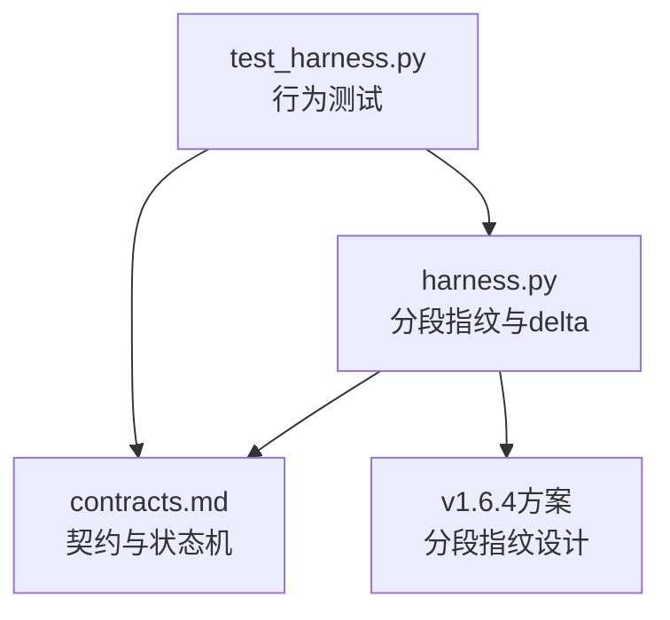
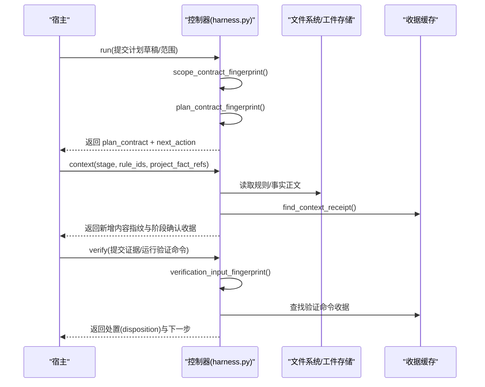
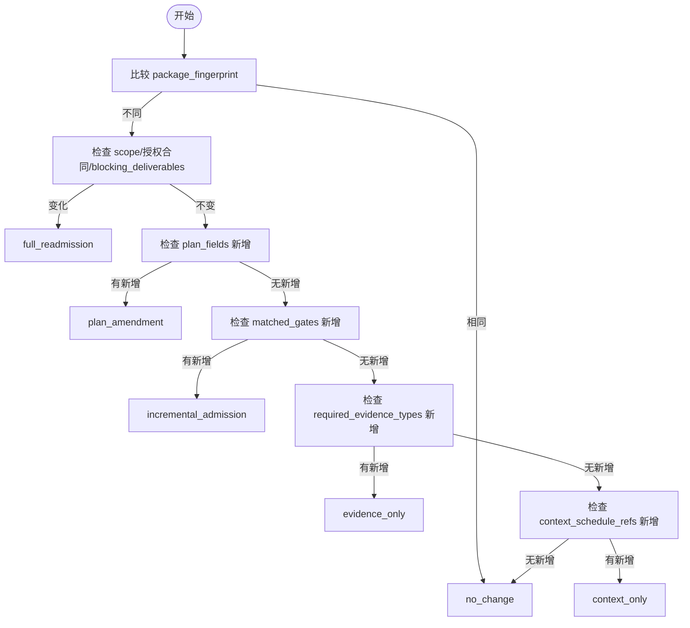
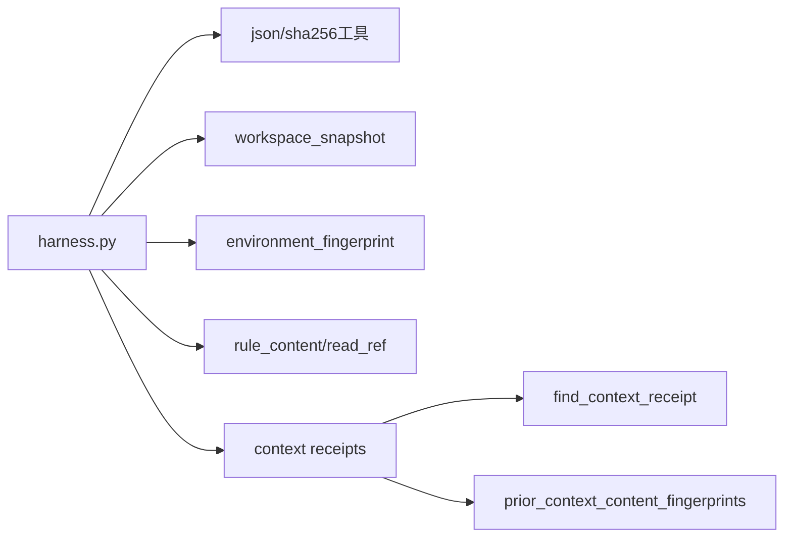

# 合同分段指纹模型

<cite>
**本文引用的文件**   
- [scripts/harness.py](file://scripts/harness.py)
- [docs/contracts.md](file://docs/contracts.md)
- [docs/plans/v1.6.4-minimal-systemic-flow-efficiency-plan.md](file://docs/plans/v1.6.4-minimal-systemic-flow-efficiency-plan.md)
- [tests/test_harness.py](file://tests/test_harness.py)
</cite>

## 目录
1. [简介](#简介)
2. [项目结构](#项目结构)
3. [核心组件](#核心组件)
4. [架构总览](#架构总览)
5. [详细组件分析](#详细组件分析)
6. [依赖关系分析](#依赖关系分析)
7. [性能考量](#性能考量)
8. [故障排查指南](#故障排查指南)
9. [结论](#结论)
10. [附录：示例与案例](#附录示例与案例)

## 简介
本文件面向 Docs Harness 的合同分段指纹模型，系统性阐述以下目标：
- 解释 scope_contract_fingerprint、plan_contract_fingerprint、authorization_contract_fingerprint、context_content_fingerprint、context_set_fingerprint、verification_input_fingerprint 等分段指纹的计算方法与适用场景。
- 详细说明 contract_delta 的计算逻辑，包括 added_gates、added_plan_fields、added_context_refs、added_evidence_types 等字段的生成规则。
- 阐述 disposition 分类机制（no_change、context_only、plan_amendment、evidence_only、incremental_admission、full_readmission）的判断标准与业务含义。
- 提供具体的指纹计算示例与 delta 分析案例，说明如何通过“分段失效”实现最小化重新执行。

该模型的核心思想是：只有发生变化的合同分段才会导致相关对象失效；未变化的计划、授权、上下文与验证收据继续复用，从而显著降低重复工作成本。

## 项目结构
与合同分段指纹相关的代码与文档主要分布在以下位置：
- scripts/harness.py：实现所有分段指纹函数、contract_disposition、build_contract_delta、上下文收据与内容指纹、工作区快照与验证输入指纹等。
- docs/contracts.md：定义任务包 v2、验收层、Git 状态合同、证据收据、上下文与授权收据、退出码等契约。
- docs/plans/v1.6.4-minimal-systemic-flow-efficiency-plan.md：提出分段指纹与 contract_delta、disposition 的设计目标与使用方式。
- tests/test_harness.py：覆盖 Git fetch/sync、意图判定、范围绑定、验证命令缓存等行为，间接验证分段指纹与增量处置的正确性。

图表来源 
- [scripts/harness.py:3082-3197](file://scripts/harness.py#L3082-L3197)
- [docs/contracts.md:1-372](file://docs/contracts.md#L1-L372)
- [docs/plans/v1.6.4-minimal-systemic-flow-efficiency-plan.md:120-160](file://docs/plans/v1.6.4-minimal-systemic-flow-efficiency-plan.md#L120-L160)

章节来源
- [scripts/harness.py:3082-3197](file://scripts/harness.py#L3082-L3197)
- [docs/contracts.md:1-372](file://docs/contracts.md#L1-L372)
- [docs/plans/v1.6.4-minimal-systemic-flow-efficiency-plan.md:120-160](file://docs/plans/v1.6.4-minimal-systemic-flow-efficiency-plan.md#L120-L160)

## 核心组件
本节聚焦合同分段指纹的六大关键组件及其职责：
- 范围合同指纹 scope_contract_fingerprint：基于 read/write/git/external scope、动作、路线与工作包集合计算，用于计划与漂移归因。
- 计划合同指纹 plan_contract_fingerprint：基于 plan fields、matched gates、blocking deliverables、success criteria 计算，用于正式计划冻结与变更检测。
- 授权合同指纹 authorization_contract_fingerprint：基于 authorization_requirements 与全部授权范围（allowed_scope、write_scope、git_scope、external_scope）计算，用于授权收据绑定与继承。
- 上下文内容指纹 context_content_fingerprint：单条规则或项目事实正文的指纹，用于跨阶段内容复用。
- 上下文集合指纹 context_set_fingerprint：某阶段所需内容集合（规则+项目事实）的指纹，用于阶段确认收据。
- 验证输入指纹 verification_input_fingerprint：非 volatile 工作区快照、命令、cwd、工具链标识等的指纹，用于验证命令收据缓存。

这些指纹共同构成“分段失效”的基础，确保仅在相关片段变化时触发最小化的重新加载或重新执行。

章节来源
- [scripts/harness.py:3082-3127](file://scripts/harness.py#L3082-L3127)
- [scripts/harness.py:4196-4210](file://scripts/harness.py#L4196-L4210)
- [docs/plans/v1.6.4-minimal-systemic-flow-efficiency-plan.md:120-130](file://docs/plans/v1.6.4-minimal-systemic-flow-efficiency-plan.md#L120-L130)

## 架构总览
下图展示分段指纹在任务生命周期中的交互关系：范围绑定后编译 Gate，形成最终计划合同；上下文按 stage 与内容指纹跨阶段复用；验证命令逐项缓存；package revision 变化时生成 contract_delta 并据此决定处置策略。

图表来源 
- [scripts/harness.py:3082-3197](file://scripts/harness.py#L3082-L3197)
- [scripts/harness.py:4196-4210](file://scripts/harness.py#L4196-L4210)
- [scripts/harness.py:4297-4389](file://scripts/harness.py#L4297-L4389)

## 详细组件分析

### 范围合同指纹 scope_contract_fingerprint
- 计算依据：allowed_scope、read_scope、write_scope、git_scope、external_scope、allowed_actions、execution_route、execution_topology、work_packages。
- 用途：作为计划与漂移归因的关键键，范围变化将触发 full_readmission。
- 复杂度：O(n) 对字段进行规范化与序列化，哈希为 O(1)。

章节来源
- [scripts/harness.py:3082-3098](file://scripts/harness.py#L3082-L3098)

### 计划合同指纹 plan_contract_fingerprint
- 计算依据：plan_fields、matched_gates、blocking_deliverables、success_criteria。
- 用途：正式计划一次冻结；仅当 plan_fields 新增时才需要补充缺失字段（complete_plan_delta）。
- 复杂度：O(n) 字段序列化与哈希。

章节来源
- [scripts/harness.py:3101-3112](file://scripts/harness.py#L3101-L3112)

### 授权合同指纹 authorization_contract_fingerprint
- 计算依据：authorization_requirements、allowed_scope、write_scope、git_scope、external_scope。
- 用途：授权收据绑定当前 package fingerprint 与授权合同指纹；任何授权范围或外部目标变化禁止继承。
- 复杂度：O(n) 字段序列化与哈希。

章节来源
- [scripts/harness.py:3115-3127](file://scripts/harness.py#L3115-L3127)

### 上下文内容指纹 context_content_fingerprint
- 计算依据：单条规则或项目事实正文的字节内容指纹。
- 用途：跨阶段内容复用；同一 task/target/compiler contract 下相同指纹不重复交付。
- 复杂度：O(k) 读取正文并计算 sha256。

章节来源
- [scripts/harness.py:4190-4194](file://scripts/harness.py#L4190-L4194)

### 上下文集合指纹 context_set_fingerprint
- 计算依据：阶段所需的 rule_ids 与 project_fact_refs 列表，排序后计算集合指纹与内容指纹列表。
- 用途：阶段确认收据；不同 stage 各自保留独立确认收据但可复用已交付内容。
- 复杂度：O(m log m) 排序与哈希。

章节来源
- [scripts/harness.py:4196-4210](file://scripts/harness.py#L4196-L4210)

### 验证输入指纹 verification_input_fingerprint
- 计算依据：非 volatile 的工作区快照、命令 argv 摘要、cwd、相关工具链标识（如 Python 版本、平台、可执行路径）。
- 用途：验证命令收据缓存；输入未变化则直接复用通过收据，避免重跑昂贵命令。
- 复杂度：O(p) 扫描工作区与计算指纹。

章节来源
- [scripts/harness.py:1115-1138](file://scripts/harness.py#L1115-L1138)
- [scripts/harness.py:1239-1244](file://scripts/harness.py#L1239-L1244)
- [docs/plans/v1.6.4-minimal-systemic-flow-efficiency-plan.md:268-293](file://docs/plans/v1.6.4-minimal-systemic-flow-efficiency-plan.md#L268-L293)

### contract_delta 与 disposition
- build_contract_delta 比较 previous 与 current 的任务包，输出：
  - added_gates：新匹配的 gate 集合。
  - added_plan_fields：新要求的 plan fields。
  - added_context_refs：新增的上下文引用（规则与项目事实）。
  - added_evidence_types：新增的证据类型。
  - scope_changed、route_changed、authorization_contract_changed、work_packages_changed、blocking_deliverables_changed、plan_contract_changed：布尔标志。
  - disposition：由 contract_disposition 判定。
- contract_disposition 判定优先级：
  - no_change：package_fingerprint 相同。
  - full_readmission：scope 或授权合同变化，或 blocking_deliverables 变化。
  - plan_amendment：plan_fields 新增。
  - incremental_admission：matched_gates 新增（普通 Gate）。
  - evidence_only：required_evidence_types 新增。
  - context_only：context_schedule_refs 新增。
  - no_change：默认回退。

图表来源 
- [scripts/harness.py:3154-3197](file://scripts/harness.py#L3154-L3197)

章节来源
- [scripts/harness.py:3175-3197](file://scripts/harness.py#L3175-L3197)
- [docs/plans/v1.6.4-minimal-systemic-flow-efficiency-plan.md:131-160](file://docs/plans/v1.6.4-minimal-systemic-flow-efficiency-plan.md#L131-L160)

## 依赖关系分析
- harness.py 内部依赖：
  - sha256_text、canonical_json：用于确定性序列化与哈希。
  - workspace_snapshot、environment_fingerprint：用于验证输入指纹。
  - rule_content、read_ref：用于上下文内容指纹。
  - find_context_receipt、prior_context_content_fingerprints：用于上下文收据复用。
- 契约依赖：
  - contracts.md 定义了任务包 v2、证据收据 v2、上下文与授权收据、完成清单等，约束指纹的使用边界。
- 测试依赖：
  - test_harness.py 覆盖 Git fetch/sync、意图判定、范围绑定、验证命令缓存等行为，间接验证分段指纹与增量处置的正确性。

图表来源 
- [scripts/harness.py:1115-1138](file://scripts/harness.py#L1115-L1138)
- [scripts/harness.py:4196-4210](file://scripts/harness.py#L4196-L4210)
- [scripts/harness.py:4257-4277](file://scripts/harness.py#L4257-L4277)

章节来源
- [scripts/harness.py:1115-1138](file://scripts/harness.py#L1115-L1138)
- [scripts/harness.py:4196-4210](file://scripts/harness.py#L4196-L4210)
- [scripts/harness.py:4257-4277](file://scripts/harness.py#L4257-L4277)

## 性能考量
- 分段指纹避免了以整个 package_fingerprint 作为唯一失效键导致的级联失效，显著减少重复加载与执行。
- 上下文内容跨阶段复用：同一 task/target/compiler contract 下相同指纹只交付一次，stage 仅生成确认收据。
- 验证命令逐项缓存：输入未变化时直接复用通过收据，避免重跑昂贵命令。
- 工作区快照限制：非 Git 工作区快照超过阈值拒绝截断基线，保证一致性。

[本节为通用指导，无需具体文件来源]

## 故障排查指南
- 常见错误与原因码：
  - invalid_scope_description：自然语言范围描述不被接受。
  - stale_rule：规则指纹变化导致上下文失效。
  - workspace_snapshot_truncated：非 Git 工作区快照过大被拒绝。
  - git_remote_drift：远端目标漂移导致 full_readmission。
- 定位方法：
  - 查看 events.jsonl 中 verification_attempt 事件，统计 command_executed_count、command_cache_hit_count、context_full_load_count、context_delta_load_count。
  - 检查 context-receipts.jsonl 与 authorization-receipts.jsonl 是否命中 content_set_fingerprint 与 authorization_contract_fingerprint。
  - 对比 contract-delta.v*.json 中的 added_* 字段与 disposition 值，判断是否需要增量或完整重新准入。

章节来源
- [docs/contracts.md:153-163](file://docs/contracts.md#L153-L163)
- [scripts/harness.py:4297-4389](file://scripts/harness.py#L4297-L4389)

## 结论
Docs Harness 的合同分段指纹模型通过细粒度失效边界，实现了最小化重新执行的目标。范围、计划、授权、上下文与验证命令各自拥有独立的指纹键，仅在变化时触发相应对象的失效与重建。contract_delta 与 disposition 提供了清晰的变更语义与处置策略，使宿主能够精准响应“补证、重读、重试、增量准入、完整重新准入”等不同场景。该模型在保证安全边界的前提下，显著提升了系统效率与可观测性。

[本节为总结，无需具体文件来源]

## 附录：示例与案例

### 示例一：安全与测试 Gate 首次触发
- 场景：范围提案首次包含安全源码与测试文件，触发 security-sensitive 与 testing-acceptance。
- 预期响应：
  - added_gates: ["security-sensitive", "testing-acceptance"]
  - added_plan_fields: ["安全边界", "负向路径"]
  - added_context_refs: ["docs/security.md", "docs/testing.md"]
  - added_evidence_types: ["security_acceptance", "test_result"]
  - disposition: "plan_amendment"
- 结果：宿主仅需补充缺失的计划字段，不重做完整计划；上下文只返回新增内容。

章节来源
- [docs/plans/v1.6.4-minimal-systemic-flow-efficiency-plan.md:176-193](file://docs/plans/v1.6.4-minimal-systemic-flow-efficiency-plan.md#L176-L193)

### 示例二：验证命令缓存命中
- 场景：多条验证命令中一条失败，其他已通过；下一次 verify 时输入未变化。
- 行为：只重跑失败的命令，已通过命令直接复用收据（cache_hit=true）。
- 指标：command_cache_hit_count 增加，command_executed_count 减少。

章节来源
- [docs/plans/v1.6.4-minimal-systemic-flow-efficiency-plan.md:295-303](file://docs/plans/v1.6.4-minimal-systemic-flow-efficiency-plan.md#L295-L303)

### 示例三：上下文跨阶段复用
- 场景：plan 与 action 阶段引用相同的规则与项目事实。
- 行为：action 阶段只返回零正文但生成阶段确认收据；content_set_fingerprint 相同，prior_context_content_fingerprints 命中。
- 结果：避免重复加载与传输，提升效率。

章节来源
- [scripts/harness.py:4257-4277](file://scripts/harness.py#L4257-L4277)
- [scripts/harness.py:4297-4389](file://scripts/harness.py#L4297-L4389)

### 示例四：Git sync 远端漂移
- 场景：远端 main 分支有新提交，verify 时发现 remote_target_unchanged 失败。
- 行为：返回 full_readmission，要求重新准入；git_sync_landed_scope 累积 pull 落盘文件并入 write_scope。
- 结果：宿主需重新提交计划或直接回到 ready_planned（若合同未变）。

章节来源
- [docs/contracts.md:127-132](file://docs/contracts.md#L127-L132)
- [tests/test_harness.py:620-650](file://tests/test_harness.py#L620-L650)