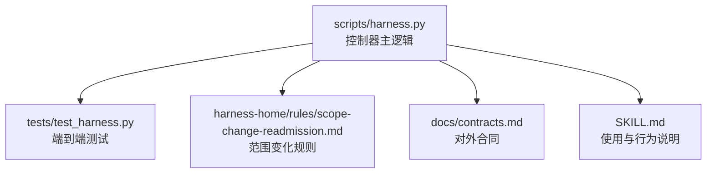
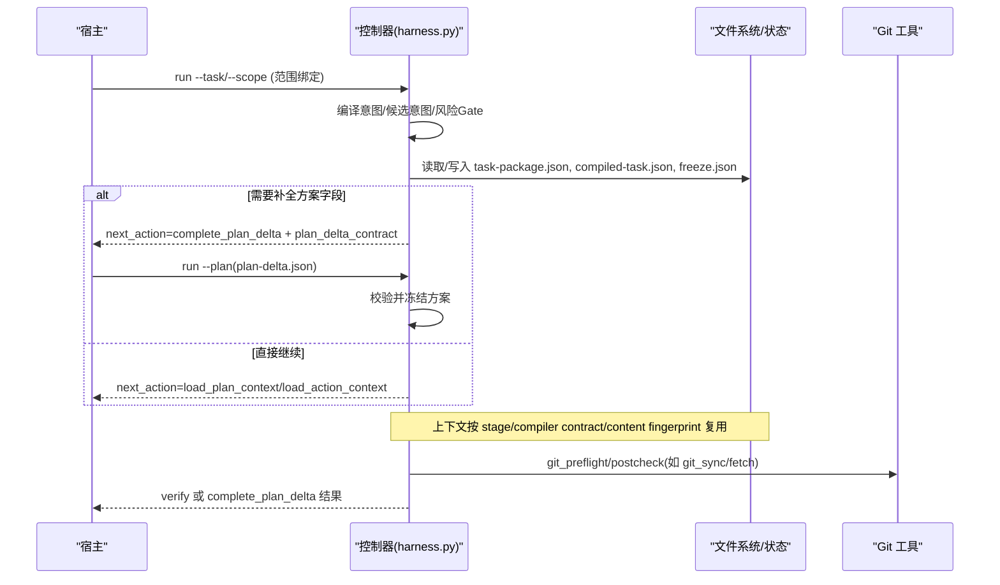
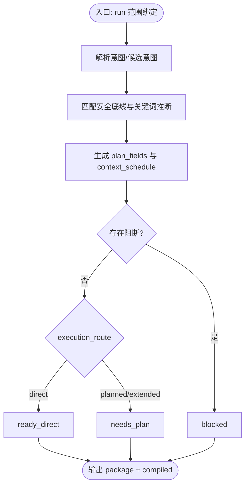
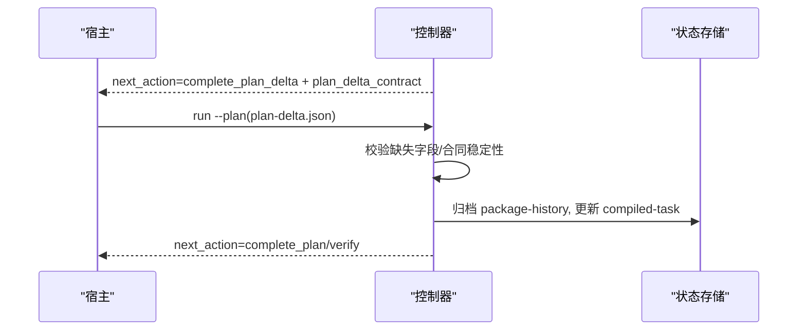
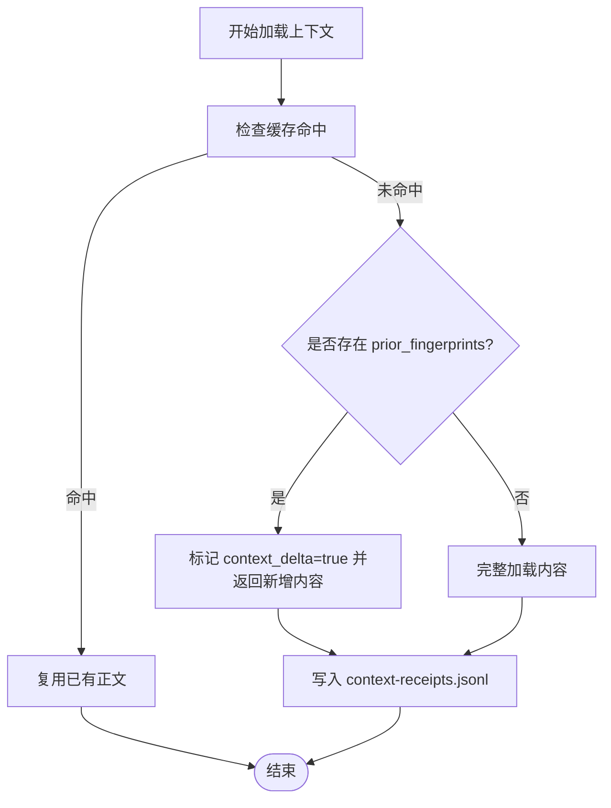
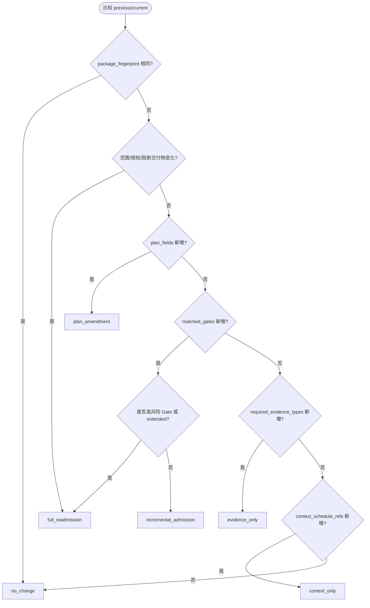
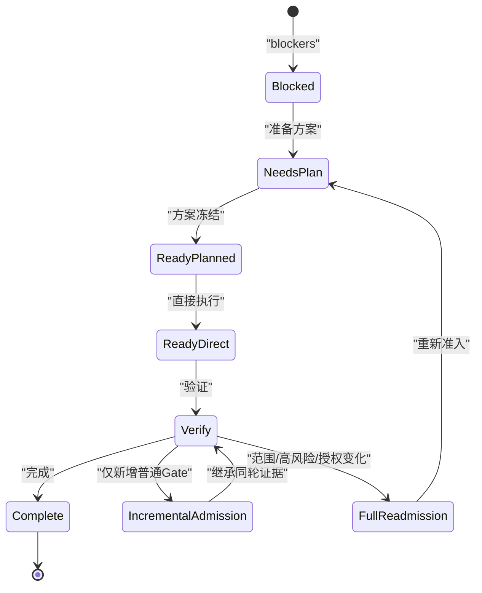
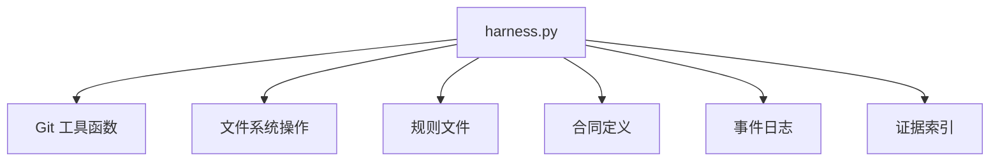

# 增量准入机制

<cite>
**本文引用的文件**   
- [scripts/harness.py](file://scripts/harness.py)
- [tests/test_harness.py](file://tests/test_harness.py)
- [harness-home/rules/scope-change-readmission.md](file://harness-home/rules/scope-change-readmission.md)
- [docs/contracts.md](file://docs/contracts.md)
- [SKILL.md](file://SKILL.md)
</cite>

## 目录
1. [简介](#简介)
2. [项目结构](#项目结构)
3. [核心组件](#核心组件)
4. [架构总览](#架构总览)
5. [详细组件分析](#详细组件分析)
6. [依赖关系分析](#依赖关系分析)
7. [性能考量](#性能考量)
8. [故障排查指南](#故障排查指南)
9. [结论](#结论)
10. [附录](#附录)

## 简介
本文件面向 Docs Harness 的“增量准入”机制，聚焦范围绑定后的 Gate 编译流程、complete_plan_delta 的实现逻辑、增量上下文加载（context_delta）与阶段确认收据生成，以及 incremental_admission 与 full_readmission 的区分标准。文档同时给出状态迁移图与具体实现示例，帮助读者从概念到代码层面全面理解该机制。

## 项目结构
- scripts/harness.py：控制器源码真源，负责任务准入、上下文、验收、Git 交付检查、知识生命周期与后台 Job 状态机。
- tests/test_harness.py：覆盖 run/context/verify 等关键路径的行为验证，包含增量与完整重新准入场景。
- harness-home/rules/scope-change-readmission.md：范围变化重新判断规则，定义何时触发重新准入及失败处理策略。
- docs/contracts.md：对外行为合同，包括 task-package/v2、完成清单、证据收据、上下文与授权收据、退出码等。
- SKILL.md：技能说明，描述 run/context/verify 的工作流与增量/完整重新准入语义。

**图表来源** 
- [scripts/harness.py](file://scripts/harness.py)
- [tests/test_harness.py](file://tests/test_harness.py)
- [harness-home/rules/scope-change-readmission.md](file://harness-home/rules/scope-change-readmission.md)
- [docs/contracts.md](file://docs/contracts.md)
- [SKILL.md](file://SKILL.md)

**章节来源**
- [docs/contracts.md:1-372](file://docs/contracts.md#L1-L372)
- [SKILL.md:1-106](file://SKILL.md#L1-L106)

## 核心组件
- Gate 编译与计划字段：基于 scope 与 matched_gates 决定 plan_fields 与 context_schedule，并在新增 Gate 时进行增量重编译。
- complete_plan_delta：当仅缺少方案字段时返回 delta 契约，宿主只补充缺失字段，不重做完整方案。
- 增量上下文加载：通过 context_delta 标记与内容指纹复用，跨阶段复用正文，避免重复加载。
- 增量 vs 完整重新准入：根据范围、高风险 Gate、授权合同、执行路线等判定。

**章节来源**
- [scripts/harness.py:3154-3197](file://scripts/harness.py#L3154-L3197)
- [scripts/harness.py:5539-5679](file://scripts/harness.py#L5539-L5679)
- [docs/contracts.md:50-80](file://docs/contracts.md#L50-L80)

## 架构总览
下图展示范围绑定后 Gate 编译、计划字段补齐、上下文增量加载与最终冻结的关键交互。

**图表来源** 
- [scripts/harness.py:939-1008](file://scripts/harness.py#L939-L1008)
- [scripts/harness.py:4836-4983](file://scripts/harness.py#L4836-L4983)
- [scripts/harness.py:680-794](file://scripts/harness.py#L680-L794)
- [scripts/harness.py:800-878](file://scripts/harness.py#L800-L878)

## 详细组件分析

### 范围绑定后的 Gate 编译流程
- 输入：任务文本、facts（含 gate_assessment）、scope（项目内相对路径/glob/受控 Git 资源）。
- 过程：
  - 解析意图与候选意图，确定 mutation_profile 与 execution_route。
  - 匹配安全底线 Gate（security-sensitive、destructive-data、release-external），结合宿主声明与关键词推断得到 matched_gates。
  - 生成 plan_fields、context_schedule（plan/action/acceptance 各阶段的 rule_ids 与 project_fact_refs）。
  - 若存在 blockers，进入 blocked；否则根据 route 决定 ready_direct 或 needs_plan。
- 输出：task-package/v2 与 initial_compiled，附带 completion_manifest、verification_commands、semantic_evidence_requirements。

**图表来源** 
- [scripts/harness.py:3000-3076](file://scripts/harness.py#L3000-L3076)
- [scripts/harness.py:3154-3197](file://scripts/harness.py#L3154-L3197)

**章节来源**
- [scripts/harness.py:3000-3076](file://scripts/harness.py#L3000-L3076)
- [docs/contracts.md:9-48](file://docs/contracts.md#L9-L48)

### complete_plan_delta 的实现逻辑
- 触发条件：matched_gates 增加但仅缺 plan_fields（无范围/高风险/授权/执行路线变化）。
- 行为：
  - 生成 plan_delta_contract，指示需补充的 plan_fields。
  - 宿主提交 plan-delta.json 后，控制器校验并冻结方案，继承已冻结的 plan_ref/plan_fingerprint/plan_artifact（若合同未变）。
  - 更新 compiled-task.next_action 为 complete_plan 或 continue。
- 关键点：
  - 不重做完整方案，仅补齐缺失字段。
  - 保持 package_revision 递增，归档历史 package 快照。
  - 事件记录 incremental_gate_readmission，保留 adopted_evidence_ids。

**图表来源** 
- [scripts/harness.py:962-966](file://scripts/harness.py#L962-L966)
- [scripts/harness.py:4836-4983](file://scripts/harness.py#L4836-L4983)
- [scripts/harness.py:5539-5679](file://scripts/harness.py#L5539-L5679)

**章节来源**
- [scripts/harness.py:939-1008](file://scripts/harness.py#L939-L1008)
- [scripts/harness.py:5539-5679](file://scripts/harness.py#L5539-L5679)
- [docs/contracts.md:50-80](file://docs/contracts.md#L50-L80)

### 增量上下文加载机制（context_delta）
- 缓存命中条件：同一 task_id、target_identity、stage、compiler_contract、content_set_fingerprint。
- 行为：
  - 命中则跳过规则与事实正文重复返回。
  - 未命中且 prior_fingerprints 存在时，设置 context_delta=true，仅返回新增内容。
  - 事件记录 context_cache_hit/context_delta_loaded/context_content_loaded。
- 阶段确认收据：context-receipts.jsonl 保存各阶段上下文收据，用于跨轮次复用。

**图表来源** 
- [scripts/harness.py:4343-4387](file://scripts/harness.py#L4343-L4387)
- [docs/contracts.md:222-234](file://docs/contracts.md#L222-L234)

**章节来源**
- [scripts/harness.py:4343-4387](file://scripts/harness.py#L4343-L4387)
- [docs/contracts.md:222-234](file://docs/contracts.md#L222-L234)

### incremental_admission 与 full_readmission 的区分标准
- 判定依据（contract_disposition）：
  - full_readmission：范围合同（read/write/git/external_scope、allowed_actions、execution_route/topology、work_packages）或授权合同变化，或 blocking_deliverables 变化。
  - incremental_admission：仅 matched_gates 增加（非高风险 Gate），且不改变执行/授权/方案合同。
  - plan_amendment：仅 plan_fields 增加。
  - evidence_only：仅 required_evidence_types 增加。
  - context_only：仅 context_schedule_refs 增加。
- 高风险 Gate：product-change、architecture-contract、security-sensitive、destructive-data、release-external、frontend-design。
- 特殊路线：execution_route=extended 时不走增量 Gate 重编译。

**图表来源** 
- [scripts/harness.py:3154-3197](file://scripts/harness.py#L3154-L3197)
- [scripts/harness.py:5550-5558](file://scripts/harness.py#L5550-L5558)

**章节来源**
- [scripts/harness.py:3154-3197](file://scripts/harness.py#L3154-L3197)
- [scripts/harness.py:5539-5679](file://scripts/harness.py#L5539-L5679)
- [docs/contracts.md:50-80](file://docs/contracts.md#L50-L80)

### 状态迁移图

**图表来源** 
- [scripts/harness.py:3200-3226](file://scripts/harness.py#L3200-L3226)
- [docs/contracts.md:50-80](file://docs/contracts.md#L50-L80)

### 具体实现示例
- 测试用例验证：
  - v15_git_sync_preflight_scope_and_postcheck_complete：git_sync 预检与后检完整流程，write_scope 自动推导。
  - v15_git_sync_remote_drift_forces_readmission：远端漂移触发重新准入。
  - v15_negated_write_does_not_upgrade_query：否定语句不升级意图。
  - test_dynamic_context_resolves_feature_and_loads_only_gate_categories：动态上下文仅加载相关 Gate 类别。

**章节来源**
- [tests/test_harness.py:651-684](file://tests/test_harness.py#L651-L684)
- [tests/test_harness.py:620-648](file://tests/test_harness.py#L620-L648)
- [tests/test_harness.py:781-794](file://tests/test_harness.py#L781-L794)
- [tests/test_harness.py:408-428](file://tests/test_harness.py#L408-L428)

## 依赖关系分析
- 控制器依赖：
  - Git 工具链：git_command、git_preflight_contract、git_postcheck。
  - 文件系统：atomic_write_json/read_json/append_jsonl。
  - 规则系统：harness-home/rules/*.md 中的 active 规则。
  - 合同定义：docs/contracts.md 中的 schema_version 与字段约束。
- 耦合与内聚：
  - Gate 编译与计划字段生成高度内聚于 build_package/initial_compiled。
  - 上下文加载与收据管理集中在 context_receipt_valid 与 events.jsonl。
  - 证据索引与验证命令缓存独立模块，便于扩展。

**图表来源** 
- [scripts/harness.py:575-612](file://scripts/harness.py#L575-L612)
- [scripts/harness.py:1034-1074](file://scripts/harness.py#L1034-L1074)
- [scripts/harness.py:5510-5516](file://scripts/harness.py#L5510-L5516)

**章节来源**
- [scripts/harness.py:575-612](file://scripts/harness.py#L575-L612)
- [scripts/harness.py:1034-1074](file://scripts/harness.py#L1034-L1074)
- [scripts/harness.py:5510-5516](file://scripts/harness.py#L5510-L5516)

## 性能考量
- 上下文缓存：通过 content_set_fingerprint 与 compiler_contract 减少重复加载。
- 验证命令缓存：按 cache_key 复用已通过收据，避免重复执行。
- 工作区快照：限制文件大小与数量，避免非 Git 项目快照过大。
- 增量重编译：仅对新增普通 Gate 进行最小化重编译，继承同轮证据。

[本节为通用指导，无需特定文件引用]

## 故障排查指南
- 常见错误码：
  - invalid_scope_description：自然语言范围描述非法。
  - git_remote_drift：远端目标变化导致重新准入。
  - state_locked：状态锁冲突，需等待或清理陈旧锁。
  - archive_source_drift：归档源对象指纹漂移，归档失效。
- 排查步骤：
  - 检查 events.jsonl 中 reason_code 与 phase。
  - 验证 context-receipts.jsonl 与 authorization-receipts.jsonl 的有效性。
  - 确认 git_state_snapshot 与 workspace_snapshot 的一致性。

**章节来源**
- [tests/test_harness.py:485-502](file://tests/test_harness.py#L485-L502)
- [tests/test_harness.py:620-648](file://tests/test_harness.py#L620-L648)
- [scripts/harness.py:1011-1032](file://scripts/harness.py#L1011-L1032)
- [scripts/harness.py:3534-3546](file://scripts/harness.py#L3534-L3546)

## 结论
Docs Harness 的增量准入机制通过精细的合同指纹比较与 Gate 分类，实现了在范围绑定后的高效增量重编译与上下文加载。complete_plan_delta 确保方案字段的原子补齐，context_delta 标记优化了上下文加载成本，而 incremental_admission/full_readmission 的明确区分保障了安全性与一致性。结合严格的 Git 预检/后检与证据收据体系，系统在复杂变更场景中仍能提供稳定可靠的准入控制。

[本节为总结，无需特定文件引用]

## 附录
- 范围变化规则：harness-home/rules/scope-change-readmission.md 定义了范围变化的重新准入策略与失败处理方式。
- 合同参考：docs/contracts.md 提供了完整的 schema 与行为约定。
- 使用指南：SKILL.md 描述了 run/context/verify 的标准工作流。

**章节来源**
- [harness-home/rules/scope-change-readmission.md:1-29](file://harness-home/rules/scope-change-readmission.md#L1-L29)
- [docs/contracts.md:1-372](file://docs/contracts.md#L1-L372)
- [SKILL.md:1-106](file://SKILL.md#L1-L106)