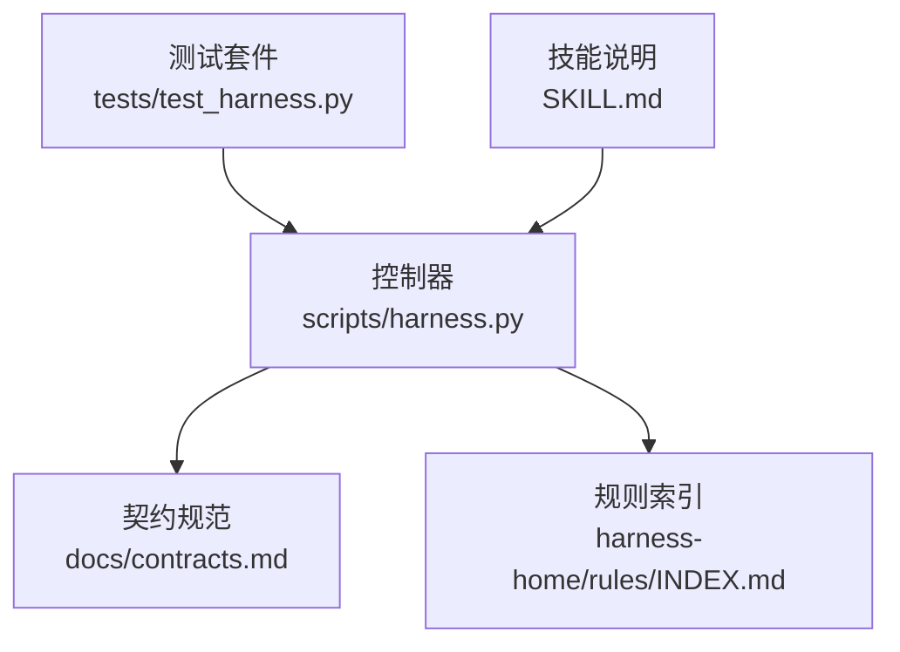
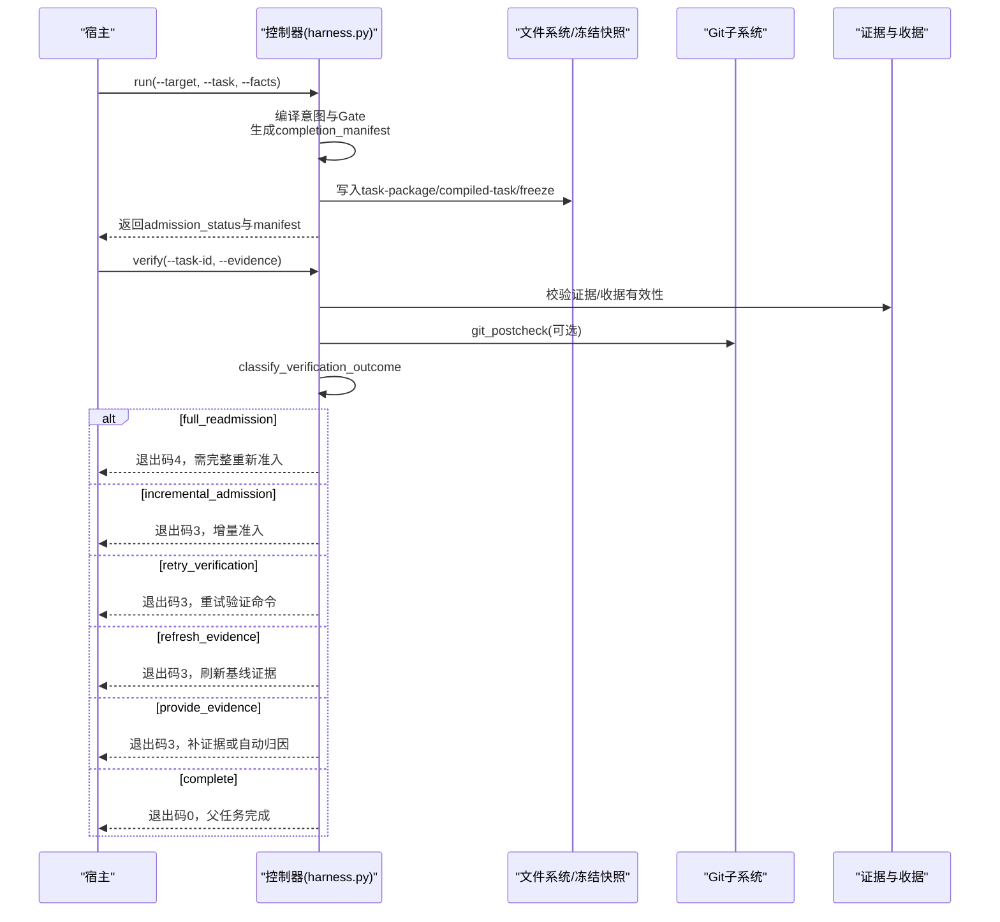
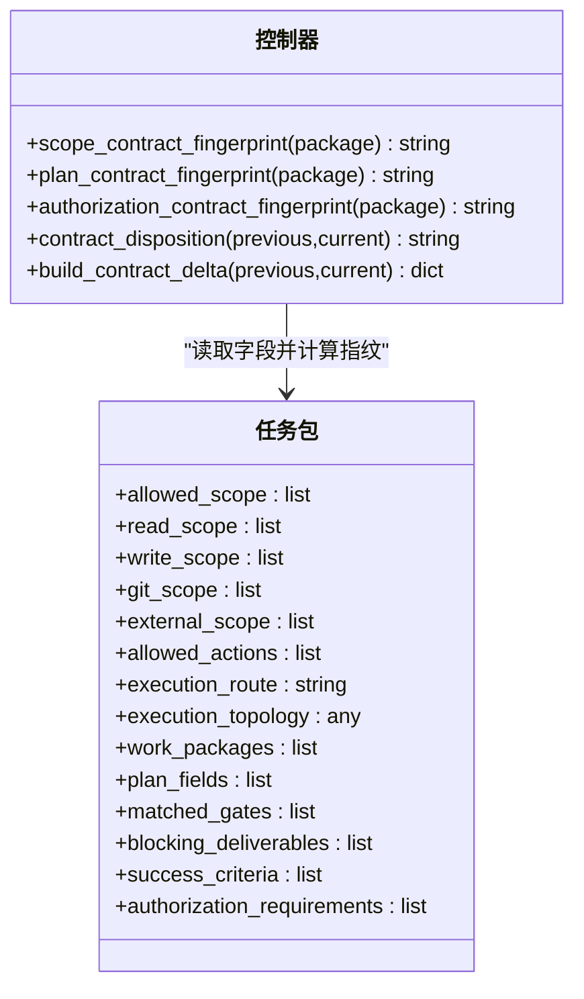
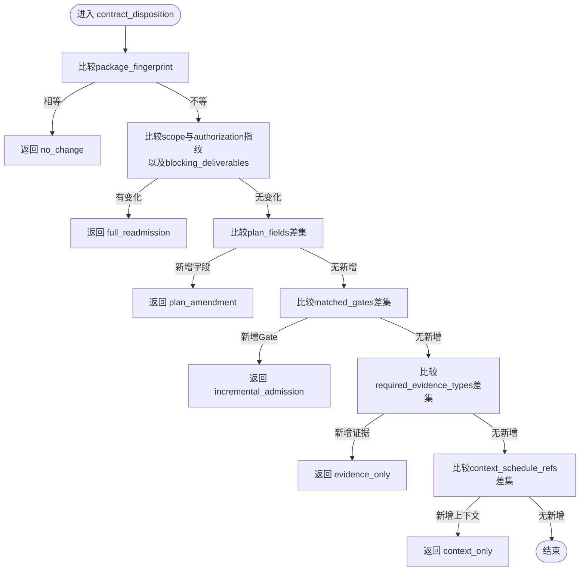
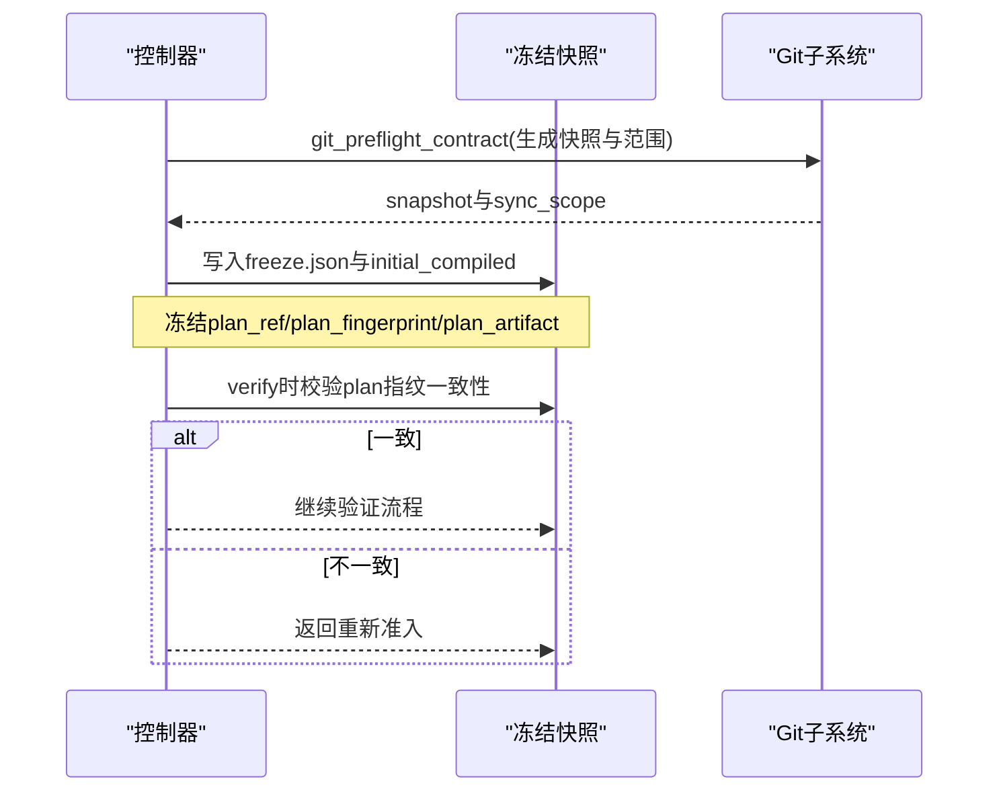
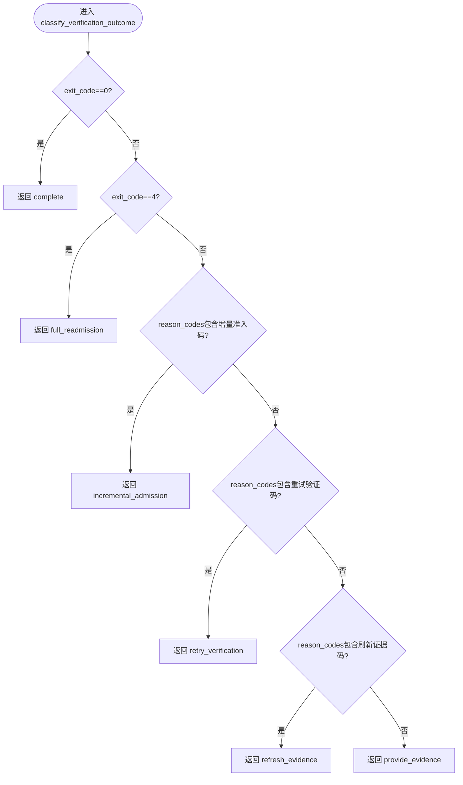
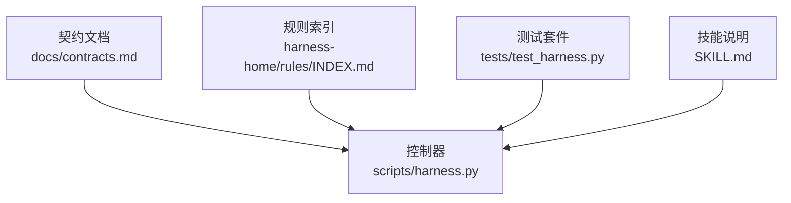

# 最小系统性流程优化

<cite>
**本文引用的文件**   
- [scripts/harness.py](file://scripts/harness.py)
- [docs/contracts.md](file://docs/contracts.md)
- [SKILL.md](file://SKILL.md)
- [harness-home/rules/INDEX.md](file://harness-home/rules/INDEX.md)
- [tests/test_harness.py](file://tests/test_harness.py)
</cite>

## 目录
1. [引言](#引言)
2. [项目结构](#项目结构)
3. [核心组件](#核心组件)
4. [架构总览](#架构总览)
5. [详细组件分析](#详细组件分析)
6. [依赖关系分析](#依赖关系分析)
7. [性能考量](#性能考量)
8. [故障排查指南](#故障排查指南)
9. [结论](#结论)
10. [附录](#附录)

## 引言
本文件面向 Docs Harness 的“最小系统性流程优化”，聚焦以下目标：
- 解释分段指纹模型的设计原理与应用，包括 scope_contract_fingerprint、plan_contract_fingerprint、authorization_contract_fingerprint。
- 阐述增量准入机制的实现细节：contract_delta 计算、disposition 分类与状态迁移逻辑。
- 说明一次性计划冻结策略：范围绑定后的 Gate 编译、计划字段校验与最终合同生成。
- 定义验证结果分级系统：provide_evidence、refresh_evidence、retry_verification、incremental_admission、full_readmission 的分类标准。
- 提供具体优化案例：安全与测试 Gate 场景、上下文去重与验证命令复用。

该文档以仓库中的控制器实现与契约文档为依据，确保所有技术细节均可追溯至源码与规范。

## 项目结构
Docs Harness 的核心由 Python 控制器脚本、契约文档、规则索引与测试套件组成：
- scripts/harness.py：任务控制器，包含指纹计算、增量准入、验证流程、Git 预检/后检、证据与授权收据处理等。
- docs/contracts.md：v1.6.6 契约，定义任务包、完成清单、Git 状态、证据收据、上下文与授权收据、退出码等。
- harness-home/rules/INDEX.md：激活的规则快照与加载约定。
- tests/test_harness.py：覆盖关键路径与边界条件的单元测试。
- SKILL.md：技能使用说明与入口约定。

图表来源
- [scripts/harness.py:1-120](file://scripts/harness.py#L1-L120)
- [docs/contracts.md:1-120](file://docs/contracts.md#L1-L120)
- [harness-home/rules/INDEX.md:1-41](file://harness-home/rules/INDEX.md#L1-L41)
- [tests/test_harness.py:1-120](file://tests/test_harness.py#L1-L120)
- [SKILL.md:1-60](file://SKILL.md#L1-L60)

章节来源
- [scripts/harness.py:1-120](file://scripts/harness.py#L1-L120)
- [docs/contracts.md:1-120](file://docs/contracts.md#L1-L120)
- [harness-home/rules/INDEX.md:1-41](file://harness-home/rules/INDEX.md#L1-L41)
- [tests/test_harness.py:1-120](file://tests/test_harness.py#L1-L120)
- [SKILL.md:1-60](file://SKILL.md#L1-L60)

## 核心组件
- 分段指纹模型
  - scope_contract_fingerprint：对 allowed_scope、read_scope、write_scope、git_scope、external_scope、allowed_actions、execution_route、execution_topology、work_packages 进行规范化 JSON 序列化并求哈希，用于判定范围与执行拓扑是否变化。
  - plan_contract_fingerprint：对 plan_fields、matched_gates、blocking_deliverables、success_criteria 求哈希，用于判定正式方案约束是否变化。
  - authorization_contract_fingerprint：对 authorization_requirements、allowed_scope、write_scope、git_scope、external_scope 求哈希，用于判定授权范围与要求是否变化。
- 增量准入机制
  - contract_disposition：基于 package_fingerprint 与上述三类指纹比较，输出 no_change、plan_amendment、incremental_admission、evidence_only、context_only、full_readmission 等处置结论。
  - build_contract_delta：生成结构化 delta，包含新增 Gate、新增计划字段、新增上下文引用、新增证据类型、范围/路由/授权/工作包/阻断交付物变更标记及 disposition。
- 一次性计划冻结
  - 在范围绑定后（如 git_sync 预检），控制器生成 compiled-task，冻结 plan_ref/plan_fingerprint/plan_artifact；后续 verify 阶段仅校验 plan 指纹一致性，避免重复编译与上下文重载。
- 验证结果分级
  - classify_verification_outcome：根据 exit_code 与 reason_codes 映射到 complete、full_readmission、incremental_admission、retry_verification、refresh_evidence、provide_evidence。
- Git 预检与后检
  - git_preflight_contract：为 git_fetch/git_sync 生成快照与变更范围，检查 LFS/Submodule、fast-forward、脏工作区等。
  - git_postcheck：验证远端漂移、ref 越界、非 fast-forward 等，必要时触发重新准入。

章节来源
- [scripts/harness.py:3082-3127](file://scripts/harness.py#L3082-L3127)
- [scripts/harness.py:3154-3197](file://scripts/harness.py#L3154-L3197)
- [scripts/harness.py:6382-6394](file://scripts/harness.py#L6382-L6394)
- [scripts/harness.py:680-794](file://scripts/harness.py#L680-L794)
- [scripts/harness.py:796-800](file://scripts/harness.py#L796-L800)
- [docs/contracts.md:97-133](file://docs/contracts.md#L97-L133)

## 架构总览
下图展示最小系统性流程的关键交互：run 阶段编译意图与 Gate、生成 completion_manifest；verify 阶段按五级处置分流；Git 操作通过预检/后检保障一致性；上下文与授权收据跨阶段复用。

图表来源
- [scripts/harness.py:3200-3226](file://scripts/harness.py#L3200-L3226)
- [scripts/harness.py:6449-6579](file://scripts/harness.py#L6449-L6579)
- [scripts/harness.py:6382-6394](file://scripts/harness.py#L6382-L6394)
- [docs/contracts.md:50-95](file://docs/contracts.md#L50-L95)

## 详细组件分析

### 分段指纹模型
- scope_contract_fingerprint
  - 输入：任务包的允许范围、读写范围、Git/外部范围、允许动作、执行路线/拓扑与工作包集合。
  - 作用：判定范围与执行拓扑是否变化，驱动 full_readmission 或增量路径。
- plan_contract_fingerprint
  - 输入：计划字段、匹配 Gate、阻断交付物、成功标准。
  - 作用：判定正式方案约束是否变化，驱动 plan_amendment 或 full_readmission。
- authorization_contract_fingerprint
  - 输入：授权要求与全部授权范围。
  - 作用：判定授权是否变化，驱动 full_readmission。

图表来源
- [scripts/harness.py:3082-3127](file://scripts/harness.py#L3082-L3127)
- [scripts/harness.py:3154-3197](file://scripts/harness.py#L3154-L3197)

章节来源
- [scripts/harness.py:3082-3127](file://scripts/harness.py#L3082-L3127)
- [scripts/harness.py:3154-3197](file://scripts/harness.py#L3154-L3197)

### 增量准入机制
- contract_disposition
  - 若 package_fingerprint 未变：no_change。
  - 若范围/授权/阻断交付物变化：full_readmission。
  - 若新增 plan_fields：plan_amendment。
  - 若新增 matched_gates：incremental_admission。
  - 若新增 required_evidence_types：evidence_only。
  - 若新增 context_schedule_refs：context_only。
- build_contract_delta
  - 输出 from/to 包指纹、版本、新增 Gate/计划字段/上下文引用/证据类型、范围/路由/授权/工作包/阻断交付物变更标记、plan_contract_changed 与 disposition。

图表来源
- [scripts/harness.py:3154-3172](file://scripts/harness.py#L3154-L3172)
- [scripts/harness.py:3175-3197](file://scripts/harness.py#L3175-L3197)

章节来源
- [scripts/harness.py:3154-3197](file://scripts/harness.py#L3154-L3197)

### 一次性计划冻结策略
- 范围绑定后（如 git_sync 预检）生成 compiled-task，冻结 plan_ref/plan_fingerprint/plan_artifact。
- verify 阶段校验 plan 指纹一致性，不一致则返回需要重新准入。
- 若旧方案受管副本指纹有效且新 compiled 除范围字段外逐字段相等，可直接继承已冻结 plan 信息，减少重新准入成本。

图表来源
- [scripts/harness.py:3200-3226](file://scripts/harness.py#L3200-L3226)
- [scripts/harness.py:6478-6489](file://scripts/harness.py#L6478-L6489)
- [docs/contracts.md:97-133](file://docs/contracts.md#L97-L133)

章节来源
- [scripts/harness.py:3200-3226](file://scripts/harness.py#L3200-L3226)
- [scripts/harness.py:6478-6489](file://scripts/harness.py#L6478-L6489)
- [docs/contracts.md:97-133](file://docs/contracts.md#L97-L133)

### 验证结果分级系统
- classify_verification_outcome
  - exit_code=0：complete。
  - exit_code=4：full_readmission。
  - reason_codes 命中 INCREMENTAL_ADMISSION_REASON_CODES：incremental_admission。
  - reason_codes 命中 RETRY_VERIFICATION_REASON_CODES：retry_verification。
  - reason_codes 命中 REFRESH_EVIDENCE_REASON_CODES：refresh_evidence。
  - 其他：provide_evidence。
- 结合 workspace_change_attribution 与 new_gates 检测，可能触发 incrementally_recompile_new_gates 进行增量重新编译。

图表来源
- [scripts/harness.py:6382-6394](file://scripts/harness.py#L6382-L6394)

章节来源
- [scripts/harness.py:6382-6394](file://scripts/harness.py#L6382-L6394)

### 安全与测试 Gate 场景优化
- 安全底线 Gate（security-sensitive、destructive-data、release-external）由控制器强制兜底，宿主声明不可豁免；文本触发使用精确词表与否定守卫，避免误报。
- 测试验收 Gate（testing-acceptance）与代码编辑 Gate（code-edit）可触发 test_result 证据需求；控制器支持验证命令缓存与白名单 produces，减少重复执行。

章节来源
- [scripts/harness.py:276-345](file://scripts/harness.py#L276-L345)
- [docs/contracts.md:165-221](file://docs/contracts.md#L165-L221)

### 上下文去重与验证命令复用
- 上下文收据复用条件：同一 task_id、target_identity、stage、compiler_contract、content_set_fingerprint。
- 验证命令收据：按 argv、produces 与输入指纹（读取集与工作区相关写入）绑定；输入不变且上次通过则直接复用，失败或输入变化才重跑。
- 可通过配置关闭命令缓存或恢复自动归因为补证据流程。

章节来源
- [docs/contracts.md:222-234](file://docs/contracts.md#L222-L234)
- [docs/contracts.md:190-221](file://docs/contracts.md#L190-L221)

## 依赖关系分析
- 控制器依赖契约文档定义的任务包、完成清单、证据收据、上下文与授权收据、Git 状态合同。
- 规则索引决定 Gate 与上下文加载；测试套件覆盖关键路径与边界条件。
- 控制器内部模块耦合：指纹计算→增量准入→冻结策略→验证分级→Git 预检/后检→证据与授权处理。

图表来源
- [docs/contracts.md:1-120](file://docs/contracts.md#L1-L120)
- [harness-home/rules/INDEX.md:1-41](file://harness-home/rules/INDEX.md#L1-L41)
- [tests/test_harness.py:1-120](file://tests/test_harness.py#L1-L120)
- [SKILL.md:1-60](file://SKILL.md#L1-L60)

章节来源
- [docs/contracts.md:1-120](file://docs/contracts.md#L1-L120)
- [harness-home/rules/INDEX.md:1-41](file://harness-home/rules/INDEX.md#L1-L41)
- [tests/test_harness.py:1-120](file://tests/test_harness.py#L1-L120)
- [SKILL.md:1-60](file://SKILL.md#L1-L60)

## 性能考量
- 上下文与证据收据复用显著降低重复加载与执行成本。
- 验证命令缓存避免重复运行相同命令，提升整体吞吐。
- 增量准入仅在必要范围内重新编译与加载上下文，减少全量重新准入开销。
- Git 预检/后检提前发现风险，避免无效执行。

[本节为通用指导，不直接分析具体文件]

## 故障排查指南
- 常见退出码含义：
  - 0：成功；verify.result=完成表示父任务完成。
  - 1：项目检查、自检或完整性读取失败。
  - 2：输入、合同、绑定或状态无效。
  - 3：需要方案、授权、证据、迁移、用户输入或 Git 交付。
  - 4：范围、漂移、Gate、远端、授权或规则变化，必须重新准入。
- 常见问题定位：
  - 远端漂移：检查 git_postcheck 与 reason_code。
  - 授权过期：确认 authorization_receipt 与 fingerprint 一致性。
  - 证据失效：核对 evidence-receipt v2 绑定字段与 TTL。
  - 规则指纹漂移：检查 harness-home/rules 快照与 INDEX 一致性。

章节来源
- [docs/contracts.md:361-372](file://docs/contracts.md#L361-L372)
- [scripts/harness.py:6449-6579](file://scripts/harness.py#L6449-L6579)

## 结论
通过分段指纹模型、增量准入机制、一次性计划冻结策略与验证结果分级系统，Docs Harness 实现了最小系统性流程优化：在保证安全与正确性的前提下，显著减少重复工作、降低上下文与验证成本，并提供清晰的故障定位与恢复路径。

[本节为总结性内容，不直接分析具体文件]

## 附录
- 最佳实践建议：
  - 明确 gate_assessment 与安全底线，避免宽泛关键词拖入重流程。
  - 合理使用证据声明草案与自动归因，减少补证据轮次。
  - 利用验证命令缓存与上下文收据复用，提升效率。
  - 在 Git 操作中严格限定 scope，避免脏工作区与非 fast-forward。

[本节为补充建议，不直接分析具体文件]