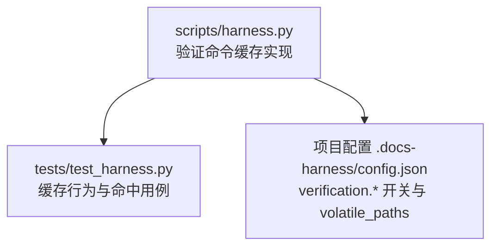
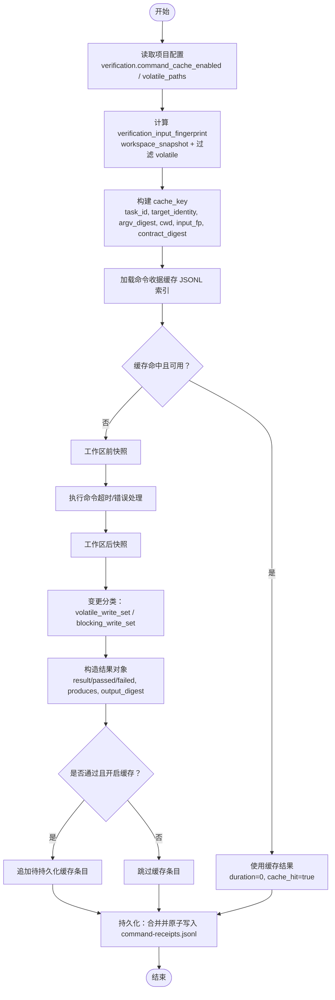
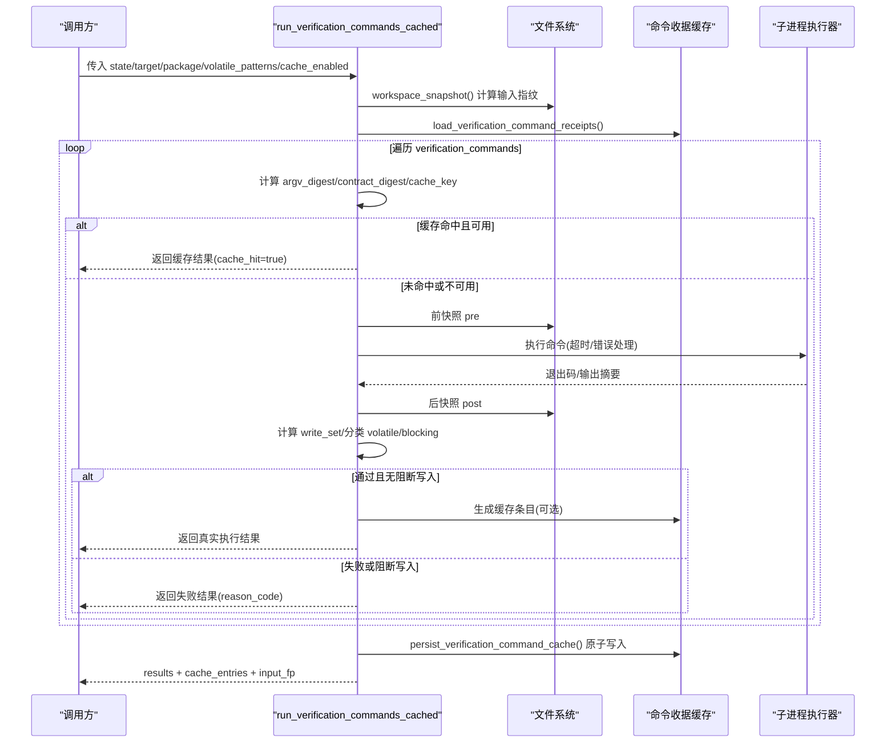
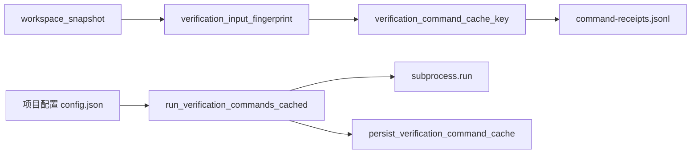

# 验证命令缓存机制

<cite>
**本文引用的文件**   
- [harness.py](file://scripts/harness.py)
- [test_harness.py](file://tests/test_harness.py)
</cite>

## 目录
1. [简介](#简介)
2. [项目结构](#项目结构)
3. [核心组件](#核心组件)
4. [架构总览](#架构总览)
5. [详细组件分析](#详细组件分析)
6. [依赖关系分析](#依赖关系分析)
7. [性能考量](#性能考量)
8. [故障排查指南](#故障排查指南)
9. [结论](#结论)
10. [附录](#附录)

## 简介
本文件面向 Docs Harness 的“验证命令缓存机制”，围绕逐命令执行模型，系统阐述以下要点：
- verification_input_fingerprint 的计算方法与用途
- 可复用收据查找与 TTL 有效性判定
- 独立快照、工作区变更分类（volatile vs blocking）与持久化流程
- 收据键组成要素：task_id、target_identity、command argv digest、cwd、verification_input_fingerprint、contract_digest
- 重跑规则的精细控制：通过但缺证据、单条命令失败、阻断写入、工作区输入变化等场景
- TTL 管理与 volatile 文件处理策略，确保缓存有效性与安全性
- 完整命令执行流程图与缓存命中率优化策略

## 项目结构
验证命令缓存相关逻辑集中在脚本主文件中，测试用例覆盖关键路径与边界条件。

**图表来源** 
- [harness.py:5902-6083](file://scripts/harness.py#L5902-L6083)
- [test_harness.py:3331-3555](file://tests/test_harness.py#L3331-L3555)

**章节来源**
- [harness.py:5902-6083](file://scripts/harness.py#L5902-L6083)
- [test_harness.py:3331-3555](file://tests/test_harness.py#L3331-L3555)

## 核心组件
- 输入指纹计算：排除运行时与允许 volatile 项后的工作区快照指纹，作为验证命令输入缓存键的基础
- 收据键生成：基于任务标识、目标身份、命令参数摘要、工作目录、输入指纹与契约摘要
- 收据加载与可用性判断：读取 JSONL 索引，按最后一条覆盖；校验结果与 TTL
- 逐命令执行：前快照→执行→后快照→变更分类→结果记录→可选缓存条目
- 持久化：原子写入命令收据与缓存索引，保证一致性

**章节来源**
- [harness.py:5902-6083](file://scripts/harness.py#L5902-L6083)
- [harness.py:1140-1239](file://scripts/harness.py#L1140-L1239)
- [harness.py:1181-1202](file://scripts/harness.py#L1181-L1202)

## 架构总览
下图展示验证命令从输入到输出、缓存命中与持久化的整体流程。

**图表来源** 
- [harness.py:5902-6083](file://scripts/harness.py#L5902-L6083)
- [harness.py:1140-1239](file://scripts/harness.py#L1140-L1239)

## 详细组件分析

### 输入指纹 verification_input_fingerprint
- 目的：在排除 Harness Runtime 与允许 volatile 项后，对完整工作区进行快照并计算哈希，作为验证命令输入缓存键的核心维度
- 关键点：
  - 使用 workspace_snapshot 获取相对路径到内容摘要的映射
  - 通过 volatile_verification_path 过滤掉临时/缓存类文件与目录
  - 最终对过滤后的映射进行规范化 JSON 序列化并 sha256

**章节来源**
- [harness.py:5902-5911](file://scripts/harness.py#L5902-L5911)
- [harness.py:1140-1142](file://scripts/harness.py#L1140-L1142)
- [harness.py:1219-1236](file://scripts/harness.py#L1219-L1236)

### 收据键 verification_command_cache_key
- 组成字段：
  - task_id：任务唯一标识
  - target_identity：目标仓库/工作区的稳定身份（含远端 URL 脱敏或本地路径）
  - command_argv_digest：命令参数的规范化摘要
  - cwd：命令执行的工作目录
  - verification_input_fingerprint：输入指纹
  - contract_digest：验证命令契约的摘要
- 作用：唯一标识一次“命令+环境+输入”的组合，用于精确命中缓存

**章节来源**
- [harness.py:5913-5933](file://scripts/harness.py#L5913-L5933)
- [harness.py:600-613](file://scripts/harness.py#L600-L613)

### 可复用收据查找与 TTL 管理
- 读取位置：state/artifacts/verification/command-receipts.jsonl
- 索引规则：同一 cache_key 以最后一条为准
- 可用性判定：
  - result 必须为 passed
  - 若存在 ttl 与 cached_at，则比较当前时间与 cached_at 差值，超过 ttl 即失效
- 命中路径：命中且可用时直接返回缓存结果，duration_ms 置零，cache_hit=true

**章节来源**
- [harness.py:5936-5960](file://scripts/harness.py#L5936-L5960)
- [harness.py:5962-6010](file://scripts/harness.py#L5962-L6010)

### 独立快照与持久化流程
- 前快照：执行命令前对工作区做快照
- 执行：捕获 stdout/stderr 并计算输出摘要；支持超时处理
- 后快照：执行后再次快照，计算变更集合
- 变更分类：
  - volatile_write_set：新产生且匹配 volatile 规则的路径
  - blocking_write_set：非 volatile 的新增写入，视为阻断写入
- 结果记录：
  - exit_code 为 0 且无 blocking_write_set → result=passed
  - 否则 result=failed，并记录 reason_code 与 unexpected_write_set
- 持久化：
  - 仅当 result=passed 且缓存开启时，生成缓存条目
  - 合并现有索引并按 key 覆盖，原子写入 JSONL

**章节来源**
- [harness.py:6010-6083](file://scripts/harness.py#L6010-L6083)

### 重跑规则的精细控制
- 通过但缺证据：
  - 若 required_evidence_types 未满足或缺少 required_receipts（如 read_set/write_set/git_state_snapshot），进入 needs_evidence 状态，提示补充证据
- 单条命令失败：
  - 任意命令 result!=passed 将导致 verification_status=needs_evidence，并返回该命令的失败详情
- 阻断写入：
  - 命令成功但产生 blocking_write_set，标记为 failed，reason_code=verification_command_workspace_write，produces 清空
- 工作区输入变化：
  - verification_input_fingerprint 变化会导致 cache_key 变化，无法命中旧缓存，触发重新执行
- 其他阻断：
  - Git 预检查失败、外部状态漂移、Gate 新增等会触发重新准入或阻塞

**章节来源**
- [harness.py:6768-6824](file://scripts/harness.py#L6768-L6824)
- [harness.py:6042-6049](file://scripts/harness.py#L6042-L6049)

### TTL 管理与 volatile 文件处理
- TTL：
  - 默认 3600 秒，可通过收据中的 ttl 与 cached_at 控制有效期
  - 过期即不可用，需重新执行
- volatile 文件：
  - 内置目录片段、后缀名、文件名白名单
  - 支持项目配置 verification.volatile_paths 扩展匹配
  - 仅允许新产生的 volatile 写入，blocking 写入将被拒绝

**章节来源**
- [harness.py:1145-1150](file://scripts/harness.py#L1145-L1150)
- [harness.py:1153-1188](file://scripts/harness.py#L1153-L1188)
- [harness.py:1219-1236](file://scripts/harness.py#L1219-L1236)
- [harness.py:6066-6069](file://scripts/harness.py#L6066-L6069)

### 完整命令执行流程图

**图表来源** 
- [harness.py:5962-6083](file://scripts/harness.py#L5962-L6083)

## 依赖关系分析
- 配置依赖：
  - verification.command_cache_enabled：全局开关
  - verification.volatile_paths：扩展 volatile 匹配规则
- 数据依赖：
  - state/artifacts/verification/command-receipts.jsonl：命令收据缓存
  - workspace_snapshot：工作区快照
- 外部依赖：
  - 子进程执行器：执行验证命令
  - Git 工具：目标身份识别（远程 URL 脱敏）

**图表来源** 
- [harness.py:5902-6083](file://scripts/harness.py#L5902-L6083)
- [harness.py:600-613](file://scripts/harness.py#L600-L613)

**章节来源**
- [harness.py:1181-1202](file://scripts/harness.py#L1181-L1202)
- [harness.py:5936-5960](file://scripts/harness.py#L5936-L5960)

## 性能考量
- 缓存命中率优化策略：
  - 合理设置 volatile_paths，避免误判导致频繁失效
  - 固定命令参数顺序与格式，减少 argv_digest 抖动
  - 保持 cwd 稳定，避免路径差异影响命中
  - 控制输入指纹粒度，必要时细化 volatile 过滤
- 执行开销控制：
  - 超时保护防止长时间阻塞
  - 输出摘要避免大文本重复传输
- 持久化效率：
  - 原子写入避免并发竞争
  - 按 key 覆盖合并，减少 I/O 次数

[本节为通用指导，不直接分析具体文件]

## 故障排查指南
- 常见错误与定位：
  - 缓存未命中：检查 cache_key 各字段是否一致（task_id、target_identity、argv_digest、cwd、input_fp、contract_digest）
  - TTL 过期：确认 cached_at 与 ttl 设置
  - 阻断写入：查看 unexpected_write_set 与 reason_code
  - 输入指纹变化：对比前后 workspace_snapshot 差异
- 调试建议：
  - 关闭缓存开关验证真实执行结果
  - 打印 volatile 分类结果，确认规则是否合理
  - 检查项目配置 verification.* 是否正确

**章节来源**
- [harness.py:5936-5960](file://scripts/harness.py#L5936-L5960)
- [harness.py:6042-6049](file://scripts/harness.py#L6042-L6049)
- [harness.py:1181-1202](file://scripts/harness.py#L1181-L1202)

## 结论
Docs Harness 的验证命令缓存机制通过严格的输入指纹、稳定的收据键与细粒度的变更分类，实现了高效且安全的命令级缓存。TTL 与 volatile 策略保障了缓存的有效性与隔离性，配合重跑规则与阻断写入，确保验证过程的可控与可追溯。通过合理的配置与优化策略，可显著提升缓存命中率与整体执行效率。

[本节为总结，不直接分析具体文件]

## 附录
- 关键函数与路径参考：
  - verification_input_fingerprint：[harness.py:5902-5911](file://scripts/harness.py#L5902-L5911)
  - verification_command_cache_key：[harness.py:5913-5933](file://scripts/harness.py#L5913-L5933)
  - run_verification_commands_cached：[harness.py:5962-6083](file://scripts/harness.py#L5962-L6083)
  - persist_verification_command_cache：[harness.py:6074-6083](file://scripts/harness.py#L6074-L6083)
  - volatile 规则与配置：[harness.py:1145-1188](file://scripts/harness.py#L1145-L1188)
- 测试用例参考：
  - 缓存命中与禁用：[test_harness.py:3331-3555](file://tests/test_harness.py#L3331-L3555)