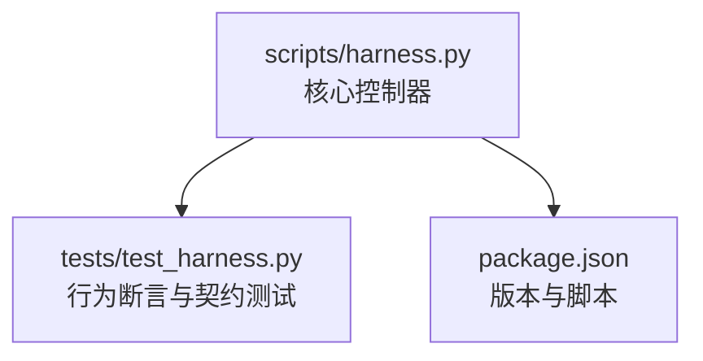
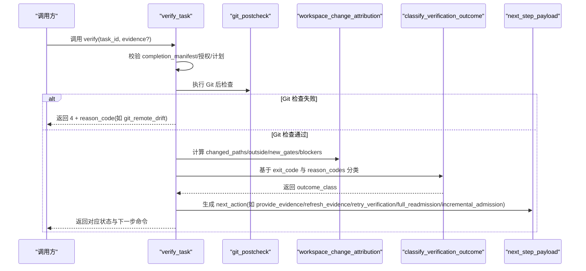
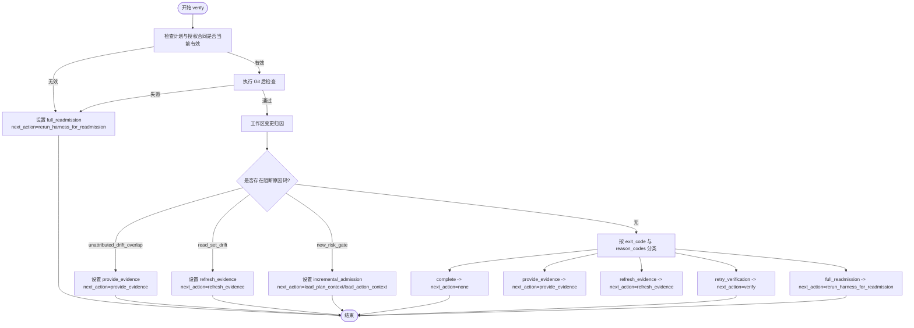
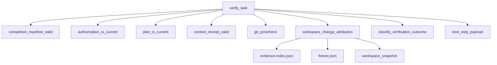

# 验证结果分级系统

<cite>
**本文引用的文件**   
- [scripts/harness.py](file://scripts/harness.py)
- [tests/test_harness.py](file://tests/test_harness.py)
- [package.json](file://package.json)
</cite>

## 目录
1. [简介](#简介)
2. [项目结构](#项目结构)
3. [核心组件](#核心组件)
4. [架构总览](#架构总览)
5. [详细组件分析](#详细组件分析)
6. [依赖关系分析](#依赖关系分析)
7. [性能考量](#性能考量)
8. [故障排查指南](#故障排查指南)
9. [结论](#结论)
10. [附录](#附录)

## 简介
本文件面向 Docs Harness 的“验证结果分级系统”，系统化阐述五级分类体系与原因码映射、处理策略、Package Revision 变化规则以及 next_action 建议。该体系用于在任务执行与证据校验过程中，根据失败原因与变更影响范围，决定是否需要重新准入、增量准入、刷新证据、重试验证或补充证据，从而在保证安全性的同时提升效率。

## 项目结构
- 核心实现位于 scripts/harness.py，包含验证分类、证据索引、Git 预/后检查、合同指纹与再准入判定等关键逻辑。
- 测试用例位于 tests/test_harness.py，覆盖 Git 漂移、read_set 漂移、未归属漂移等场景的行为断言。
- package.json 提供版本信息与脚本入口。

**图表来源** 
- [scripts/harness.py:1-120](file://scripts/harness.py#L1-L120)
- [tests/test_harness.py:1-120](file://tests/test_harness.py#L1-L120)
- [package.json:1-23](file://package.json#L1-L23)

**章节来源**
- [scripts/harness.py:1-120](file://scripts/harness.py#L1-L120)
- [tests/test_harness.py:1-120](file://tests/test_harness.py#L1-L120)
- [package.json:1-23](file://package.json#L1-L23)

## 核心组件
- 验证结果分类器：依据退出码与原因码集合，将验证结果归入五个类别之一（complete、full_readmission、incremental_admission、retry_verification、refresh_evidence、provide_evidence）。
- 证据与变更归因：对工作区变更进行归因，识别 read_set 漂移、未归属漂移、新增风险 Gate 等，并据此生成阻断项与路径清单。
- Git 预/后检查：对 git_fetch/git_sync 操作进行前置约束与后置校验，检测远端漂移、引用越界、LFS/Submodule 可用性等。
- 合同指纹与再准入：比较前后 package 指纹、范围合同、授权合同、Gate 集与证据类型需求，判定 full_readmission 或 incremental_admission。
- 事件与遥测：记录每次 verify 尝试的 outcome_class、reason_codes、上下文加载计数、命令缓存命中等指标。

**章节来源**
- [scripts/harness.py:6380-6447](file://scripts/harness.py#L6380-L6447)
- [scripts/harness.py:5437-5481](file://scripts/harness.py#L5437-L5481)
- [scripts/harness.py:796-878](file://scripts/harness.py#L796-L878)
- [scripts/harness.py:3154-3197](file://scripts/harness.py#L3154-L3197)

## 架构总览
下图展示从 verify 入口到分类决策的关键流程，包括证据加载、变更归因、Git 后检查、再准入判定与 next_action 生成。

**图表来源** 
- [scripts/harness.py:6449-6517](file://scripts/harness.py#L6449-L6517)
- [scripts/harness.py:6382-6394](file://scripts/harness.py#L6382-L6394)
- [scripts/harness.py:939-1008](file://scripts/harness.py#L939-L1008)

## 详细组件分析

### 五级分类体系与判断标准
- complete：exit_code=0，验证成功。
- full_readmission：exit_code=4，或高风险 Gate 新增/路由变更导致需完整再准入。
- incremental_admission：仅新增普通 Gate 或上下文/证据类型增量变化，无需完整再准入。
- retry_verification：可重试的错误（如临时性失败），提示重试验证。
- refresh_evidence：read_set 内容变化或证据过期，需刷新已有证据。
- provide_evidence：缺少类型化证据或证据不足，需补充新证据。

上述分类由 classify_verification_outcome 统一判定，优先级为 complete > full_readmission > incremental_admission > retry_verification > refresh_evidence > provide_evidence。

**章节来源**
- [scripts/harness.py:6382-6394](file://scripts/harness.py#L6382-L6394)

### 原因码到新分类的映射与处理策略
- unattributed_drift_overlap：存在未归属的工作区变更与证据覆盖范围重叠，且无明确归属。策略：提示补充证据，next_action=provide_evidence；若稳定合同且仅此类阻断，可能自动归属部分路径。
- read_set_drift：证据声明的 read_set 与实际读取内容不一致。策略：刷新证据，next_action=refresh_evidence；返回需要刷新的路径与丢弃的证据 ID。
- git_remote_drift：远端目标对象发生变化（如推送了新提交）。策略：阻止验证，触发 full_readmission，next_action=rerun_harness_for_readmission。
- 其他常见原因码：
  - plan_contract_drift / authorization_contract_drift：计划或授权合同漂移，触发 full_readmission。
  - action_context_missing / work_package_incomplete：执行阶段上下文缺失或工作包未完成，提示补充证据。
  - git_ref_scope_violation / git_postcheck_failed：引用越界或通用后检查失败，视情况触发 full_readmission 或重试。

**章节来源**
- [scripts/harness.py:6484-6517](file://scripts/harness.py#L6484-L6517)
- [scripts/harness.py:6610-6701](file://scripts/harness.py#L6610-L6701)
- [scripts/harness.py:5437-5481](file://scripts/harness.py#L5437-L5481)

### Package Revision 在不同分类下的变化规则
- full_readmission：通常伴随 package_revision 递增，因为范围合同、授权合同、Gate 集或证据需求发生显著变化，需完整再准入。
- incremental_admission：仅在新增 Gate 或上下文/证据类型增量变化时，可能不改变 package_fingerprint，但会更新 context_schedule_refs 或 required_evidence_types，必要时递增 package_revision。
- refresh_evidence / provide_evidence：通常不改变 package 指纹，仅更新证据索引或要求补充证据；若涉及合同字段（如 plan_fields）变化，则可能触发 plan_amendment 并递增 revision。
- complete：不改变 package 指纹与 revision，仅推进状态至完成。

上述规则由 contract_disposition 与 build_contract_delta 维护，结合 package_fingerprint、scope_contract_fingerprint、authorization_contract_fingerprint、plan_contract_fingerprint 的比较结果。

**章节来源**
- [scripts/harness.py:3154-3197](file://scripts/harness.py#L3154-L3197)
- [scripts/harness.py:3078-3112](file://scripts/harness.py#L3078-L3112)

### 决策流程图（含错误处理与恢复示例）

**图表来源** 
- [scripts/harness.py:6449-6517](file://scripts/harness.py#L6449-L6517)
- [scripts/harness.py:6610-6701](file://scripts/harness.py#L6610-L6701)
- [scripts/harness.py:6382-6394](file://scripts/harness.py#L6382-L6394)

### 原因码映射表（摘要）
- unattributed_drift_overlap → provide_evidence（必要时 auto_attributed_paths 辅助）
- read_set_drift → refresh_evidence
- git_remote_drift → full_readmission
- plan_contract_drift → full_readmission
- authorization_contract_drift → full_readmission
- action_context_missing → provide_evidence
- work_package_incomplete → provide_evidence
- git_ref_scope_violation → full_readmission
- git_postcheck_failed → full_readmission
- 其他临时性错误 → retry_verification

**章节来源**
- [scripts/harness.py:6484-6517](file://scripts/harness.py#L6484-L6517)
- [scripts/harness.py:6610-6701](file://scripts/harness.py#L6610-L6701)
- [scripts/harness.py:6382-6394](file://scripts/harness.py#L6382-L6394)

### 错误处理与恢复策略示例
- Git 远端漂移：检测到 remote_target_unchanged=false，立即返回 full_readmission，并附带 git_postcheck 详情；用户需 rerun_harness_for_readmission 以重新准入。
- read_set 漂移：检测到证据 read_set 与实际读取不一致，返回 refresh_evidence，附带 refresh_paths 与 discarded_evidence_ids；用户需刷新证据后再验证。
- 未归属漂移：存在未归属变更与证据覆盖重叠，返回 provide_evidence，附带 missing_attribution_paths；若稳定合同，可能自动归属部分路径以减少人工干预。

**章节来源**
- [scripts/harness.py:6484-6517](file://scripts/harness.py#L6484-L6517)
- [scripts/harness.py:6610-6701](file://scripts/harness.py#L6610-L6701)

## 依赖关系分析
- verify_task 依赖 completion_manifest_valid、authorization_is_current、plan_is_current、context_receipt_valid、git_postcheck、workspace_change_attribution、classify_verification_outcome、next_step_payload。
- workspace_change_attribution 依赖证据索引、冻结快照与工作区快照，输出 changed_paths、outside_scope、new_gates、blockers。
- contract_disposition/build_contract_delta 依赖 package_fingerprint、scope_contract_fingerprint、authorization_contract_fingerprint、plan_contract_fingerprint。

**图表来源** 
- [scripts/harness.py:6449-6517](file://scripts/harness.py#L6449-L6517)
- [scripts/harness.py:5437-5481](file://scripts/harness.py#L5437-L5481)
- [scripts/harness.py:3154-3197](file://scripts/harness.py#L3154-L3197)

**章节来源**
- [scripts/harness.py:6449-6517](file://scripts/harness.py#L6449-L6517)
- [scripts/harness.py:5437-5481](file://scripts/harness.py#L5437-L5481)
- [scripts/harness.py:3154-3197](file://scripts/harness.py#L3154-L3197)

## 性能考量
- 验证命令缓存：默认开启，可通过 project_config verification.command_cache_enabled 关闭；缓存命中次数与执行次数记录于遥测事件。
- 上下文加载计数：区分全量加载与 delta 加载，统计 full_load_count 与 delta_load_count，有助于评估上下文成本。
- 工作区快照限制：非 Git 工作区快照超过阈值拒绝截断基线，避免过大快照影响性能。
- Git LFS/Submodule 可用性：前置检查失败直接阻断，避免后续昂贵操作。

**章节来源**
- [scripts/harness.py:1191-1200](file://scripts/harness.py#L1191-L1200)
- [scripts/harness.py:1115-1138](file://scripts/harness.py#L1115-L1138)
- [scripts/harness.py:796-878](file://scripts/harness.py#L796-L878)

## 故障排查指南
- 常见问题定位：
  - 验证失败且 reason_code=git_remote_drift：检查远端是否被推送新提交，必要时 rerun_harness_for_readmission。
  - reason_code=read_set_drift：核对证据的 read_set 是否与真实读取一致，刷新证据后重试。
  - reason_code=unattributed_drift_overlap：确认未归属变更是否应纳入证据覆盖范围，必要时补充证据或调整 scope。
- 日志与遥测：查看 events.jsonl 中的 verification_attempt 事件，关注 outcome_class、reason_codes、command_executed_count、command_cache_hit_count、context_full_load_count、context_delta_load_count。

**章节来源**
- [scripts/harness.py:6410-6447](file://scripts/harness.py#L6410-L6447)
- [tests/test_harness.py:620-650](file://tests/test_harness.py#L620-L650)
- [tests/test_harness.py:685-735](file://tests/test_harness.py#L685-L735)

## 结论
Docs Harness 的验证结果分级系统通过统一的分类器与原因码映射，将复杂的工作区与 Git 变更转化为明确的 next_action 建议，既保障安全性（full_readmission 兜底），又提升效率（incremental_admission、refresh_evidence、retry_verification 精准分流）。配合完善的遥测与事件记录，便于持续优化与问题定位。

## 附录
- 版本信息：当前版本 1.6.6，脚本入口与测试命令见 package.json。
- 相关常量与集合：INCREMENTAL_ADMISSION_REASON_CODES、RETRY_VERIFICATION_REASON_CODES、REFRESH_EVIDENCE_REASON_CODES 等定义于核心模块中，用于分类决策。

**章节来源**
- [package.json:1-23](file://package.json#L1-L23)
- [scripts/harness.py:6355-6394](file://scripts/harness.py#L6355-L6394)