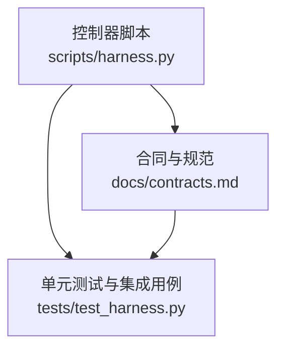
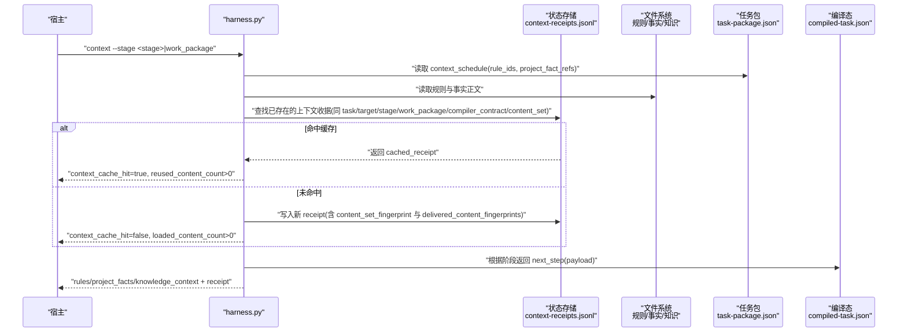
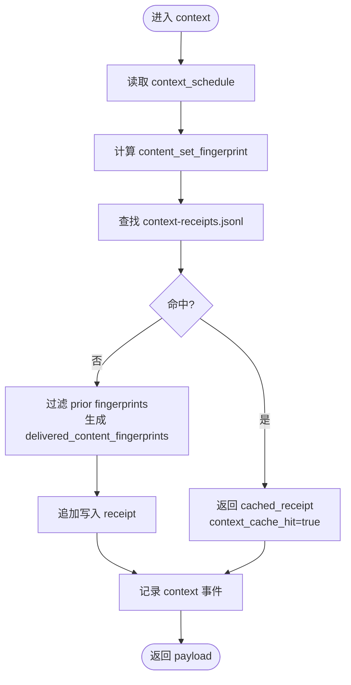
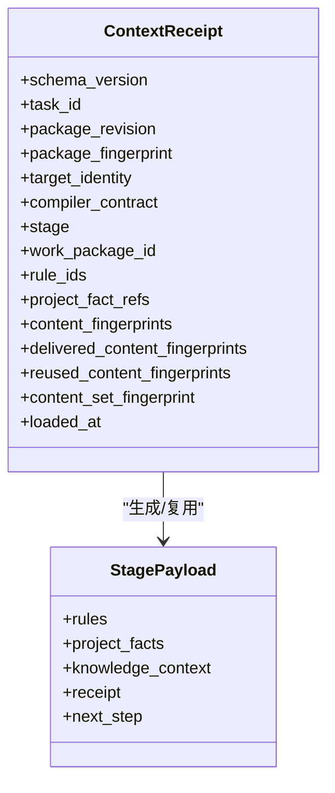
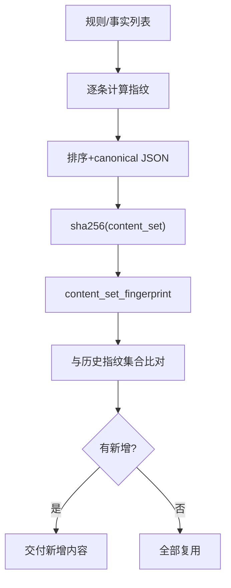
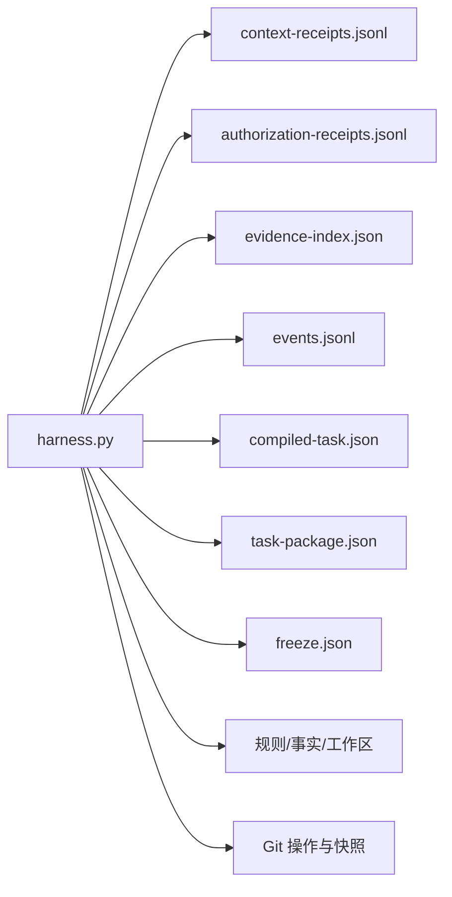

# 上下文正文复用

<cite>
**本文引用的文件**   
- [scripts/harness.py](file://scripts/harness.py)
- [docs/contracts.md](file://docs/contracts.md)
- [tests/test_harness.py](file://tests/test_harness.py)
</cite>

## 目录
1. [引言](#引言)
2. [项目结构](#项目结构)
3. [核心组件](#核心组件)
4. [架构总览](#架构总览)
5. [详细组件分析](#详细组件分析)
6. [依赖关系分析](#依赖关系分析)
7. [性能考量](#性能考量)
8. [故障排查指南](#故障排查指南)
9. [结论](#结论)
10. [附录](#附录)

## 引言
本文件面向 Docs Harness 的“上下文正文复用机制”，系统性阐述跨阶段内容交付、stage 与 acknowledgement/receipt 分离策略、内容传递协议，以及上下文缓存层次结构与优先级规则。同时给出内容复用的触发条件（依赖匹配、版本兼容性与内容相似度评估）、配置方法与性能调优参数，并覆盖内容冲突解决与版本迁移策略。文档以仓库中的控制器实现与合同说明为依据，确保可追溯与可验证。

## 项目结构
Docs Harness 的核心逻辑集中在单一控制器脚本中，配合合同文档与测试用例共同构成完整的行为契约与回归保障。关键位置如下：
- 控制器主程序：scripts/harness.py
- 合同与行为约定：docs/contracts.md
- 行为验证与用例：tests/test_harness.py

**图表来源** 
- [scripts/harness.py:1-120](file://scripts/harness.py#L1-L120)
- [docs/contracts.md:1-120](file://docs/contracts.md#L1-L120)
- [tests/test_harness.py:1-120](file://tests/test_harness.py#L1-L120)

**章节来源**
- [scripts/harness.py:1-120](file://scripts/harness.py#L1-L120)
- [docs/contracts.md:1-120](file://docs/contracts.md#L1-L120)
- [tests/test_harness.py:1-120](file://tests/test_harness.py#L1-L120)

## 核心组件
- 上下文收据与缓存查找：通过 context-receipts.jsonl 记录每个 stage/work_package 的上下文指纹与内容指纹集合，用于命中与增量复用。
- 内容指纹与内容集指纹：对规则与项目事实进行排序与哈希，形成稳定的 content_set_fingerprint；对单条内容生成 sha256 指纹，支持跨阶段去重。
- 阶段调度与载荷：context 命令按 stage 或 work_package 返回 rules/project_facts/knowledge_context，并在 plan/action/work_package/acceptance 等阶段提供下一步指引。
- 授权与证据收据：authorization-receipts.jsonl 与 evidence-receipt/v2 绑定 package fingerprint 与任务边界，保证授权与证据在修订间的安全继承与复用。
- 验证命令缓存：verification-command-receipt/v1 缓存命令执行结果，避免重复执行。

**章节来源**
- [scripts/harness.py:4213-4444](file://scripts/harness.py#L4213-L4444)
- [scripts/harness.py:6000-6133](file://scripts/harness.py#L6000-L6133)
- [docs/contracts.md:222-235](file://docs/contracts.md#L222-L235)

## 架构总览
下图展示上下文从加载、缓存命中到跨阶段复用的整体流程，以及与任务包、编译态、冻结快照的关系。

**图表来源** 
- [scripts/harness.py:4297-4444](file://scripts/harness.py#L4297-L4444)
- [scripts/harness.py:4213-4278](file://scripts/harness.py#L4213-L4278)
- [docs/contracts.md:222-235](file://docs/contracts.md#L222-L235)

## 详细组件分析

### 上下文收据与缓存查找
- 查找键空间：同一 task_id、target_identity、stage（或 work_package_id）、compiler_contract、content_set_fingerprint 完全一致即命中。
- 内容指纹去重：prior_context_content_fingerprints 收集历史 delivered/reused 指纹，避免重复交付相同内容。
- 事件与指标：记录 context_reused/context_delta_loaded/context_loaded 三类事件，附带 context_cache_hit、loaded/reused 计数。

**图表来源** 
- [scripts/harness.py:4213-4278](file://scripts/harness.py#L4213-L4278)
- [scripts/harness.py:4297-4444](file://scripts/harness.py#L4297-L4444)

**章节来源**
- [scripts/harness.py:4213-4278](file://scripts/harness.py#L4213-L4278)
- [scripts/harness.py:4297-4444](file://scripts/harness.py#L4297-L4444)

### 跨阶段内容交付与 stage/acknowledgement/receipt 分离
- 阶段维度：plan、action、work_package、acceptance 各自独立上下文收据，避免跨阶段误用。
- 交付协议：receipt 包含 rule_ids、project_fact_refs、content_fingerprints、delivered_content_fingerprints、reused_content_fingerprints、content_set_fingerprint 等字段，明确“哪些被交付”“哪些被复用”。
- 校验与审计：通过 event 记录 reason_code 与 duration_ms，便于统计全量加载与增量加载比例。

**图表来源** 
- [scripts/harness.py:4344-4394](file://scripts/harness.py#L4344-L4394)

**章节来源**
- [scripts/harness.py:4344-4394](file://scripts/harness.py#L4344-L4394)
- [docs/contracts.md:222-235](file://docs/contracts.md#L222-L235)

### 内容传递协议与指纹
- 内容指纹：每条规则/事实正文计算 sha256 指纹，稳定且可比较。
- 内容集指纹：将 rule_ids 与 project_fact_refs 对应的条目排序后 canonical JSON 再哈希，得到 content_set_fingerprint，作为阶段级内容集合的等价性判定。
- 跨阶段复用：prior_context_content_fingerprints 汇总历史指纹，当前阶段仅交付新增指纹的内容，其余复用。

**图表来源** 
- [scripts/harness.py:4200-4211](file://scripts/harness.py#L4200-L4211)
- [scripts/harness.py:4257-4278](file://scripts/harness.py#L4257-L4278)

**章节来源**
- [scripts/harness.py:4200-4211](file://scripts/harness.py#L4200-L4211)
- [scripts/harness.py:4257-4278](file://scripts/harness.py#L4257-L4278)

### 上下文缓存层次结构与优先级
- 任务级缓存：context-receipts.jsonl 位于任务 Runtime 目录，按 task_id 隔离，天然具备最高优先级。
- 项目级缓存：同一 target 下不同任务的 receipts 彼此独立，但可通过 prior_context_content_fingerprints 共享“内容指纹”层面的复用（不跨 task 直接复用 receipt）。
- 全局缓存：无跨项目的上下文收据共享；全局范围仅体现在验证命令收据缓存（verification/command-receipts.jsonl）与通用工具函数。

优先级规则：
- 精确匹配优先：task_id + target_identity + stage/work_package + compiler_contract + content_set_fingerprint 完全一致才命中。
- 内容指纹级增量：若 receipt 不存在，则基于 prior fingerprints 做增量交付，减少重复负载。

**章节来源**
- [scripts/harness.py:4213-4278](file://scripts/harness.py#L4213-L4278)
- [scripts/harness.py:4297-4444](file://scripts/harness.py#L4297-L4444)

### 内容复用的触发条件
- 依赖匹配：rule_ids 与 project_fact_refs 必须与之前一致，否则 content_set_fingerprint 变化导致无法命中。
- 版本兼容性：compiler_contract 固定为 docs-harness/compiler/v2，任何编译器合同变更都会阻止复用。
- 内容相似度评估：使用严格指纹相等判定，非相似度阈值；如需近似复用需通过上层编排控制 schedule。

**章节来源**
- [scripts/harness.py:4246-4254](file://scripts/harness.py#L4246-L4254)
- [docs/contracts.md:222-235](file://docs/contracts.md#L222-L235)

### 配置方法与性能调优参数
- 验证命令缓存开关：verification.command_cache_enabled=false 可关闭命令收据缓存，避免缓存命中带来的语义偏差风险。
- 自动归因开关：verification.auto_attribute_in_scope=false 恢复显式补证据流程，默认由控制器代铸 workspace_attribution 收据自动认领。
- 临时副产物白名单：verification.volatile_paths 允许追加带固定根目录的 glob 白名单，控制验证命令的副作用容忍度。
- 遥测与监控：events.jsonl 记录 context_full_load_count、context_delta_load_count、command_cache_hit_count 等指标，用于定位热点与优化点。

**章节来源**
- [docs/contracts.md:190-221](file://docs/contracts.md#L190-L221)
- [scripts/harness.py:6074-6083](file://scripts/harness.py#L6074-L6083)
- [scripts/harness.py:6449-6466](file://scripts/harness.py#L6449-L6466)

### 内容冲突解决与版本迁移策略
- 冲突检测：当 stage 或 work_package 的 context_schedule 发生变化（rule_ids/project_fact_refs 改变），content_set_fingerprint 变化导致无法命中旧 receipt，强制重新加载。
- 版本迁移：v1→v2 迁移通过 task migrate --apply 创建 staging、备份、journal，切换对象；存在活动 v2 任务时禁止回滚。迁移后任务进入 needs_readmission，需重新准入。
- 授权与证据继承：authorization-adoption/v1 与 evidence-adoption/v1 支持在合同不变情况下继承授权与证据，避免重复审批与取证。

**章节来源**
- [docs/contracts.md:236-273](file://docs/contracts.md#L236-L273)
- [scripts/harness.py:6192-6227](file://scripts/harness.py#L6192-L6227)

## 依赖关系分析
- 控制器与状态文件：context-receipts.jsonl、authorization-receipts.jsonl、evidence-index.json、events.jsonl、compiled-task.json、task-package.json、freeze.json。
- 控制器与文件系统：规则与事实文件、验证命令工作区、临时副产物目录。
- 控制器与 Git：git_preflight/postcheck 影响验收层，但不直接影响上下文收据命中。

**图表来源** 
- [scripts/harness.py:81-90](file://scripts/harness.py#L81-L90)
- [scripts/harness.py:4297-4444](file://scripts/harness.py#L4297-L4444)

**章节来源**
- [scripts/harness.py:81-90](file://scripts/harness.py#L81-L90)
- [scripts/harness.py:4297-4444](file://scripts/harness.py#L4297-L4444)

## 性能考量
- 命中率优化：保持 context_schedule 稳定，避免频繁变更 rule_ids/project_fact_refs；合理拆分 stage/work_package 粒度，提升增量命中概率。
- 增量加载：利用 prior_context_content_fingerprints 减少重复交付，降低 IO 与序列化开销。
- 命令缓存：开启 verification.command_cache_enabled 以减少外部命令执行次数；必要时关闭以避免缓存污染。
- 遥测驱动调优：通过 events.jsonl 的 context_full_load_count、context_delta_load_count、command_cache_hit_count 定位瓶颈。

[本节为通用指导，无需特定文件引用]

## 故障排查指南
- 常见错误码与原因：
  - invalid_context_stage：stage 无效或未定义。
  - missing_work_package：work_package_id 不存在。
  - authorization_mismatch：授权动作或范围未覆盖任务包。
  - git_remote_drift：远端漂移导致需要重新准入。
- 诊断步骤：
  - 检查 context-receipts.jsonl 是否存在对应 stage/work_package 的 receipt。
  - 核对 content_set_fingerprint 是否变化（schedule 是否变更）。
  - 查看 events.jsonl 中 context_* 事件与 reason_code。
  - 确认 authorization-receipts.jsonl 是否有效且未过期。

**章节来源**
- [scripts/harness.py:4297-4444](file://scripts/harness.py#L4297-L4444)
- [docs/contracts.md:190-221](file://docs/contracts.md#L190-L221)

## 结论
Docs Harness 的上下文正文复用机制以严格的指纹与收据为核心，实现了跨阶段、跨修订的安全复用与增量交付。通过任务级收据、内容指纹与内容集指纹的组合，系统在保持安全性的前提下最大化复用率。结合验证命令缓存与遥测指标，可在工程实践中持续优化性能与稳定性。

[本节为总结性内容，无需特定文件引用]

## 附录
- 相关命令参考：
  - context：加载阶段上下文，返回 rules/project_facts/knowledge_context 与 receipt。
  - verify：执行验收，支持五级处置与命令缓存。
  - background：后台治理 Job 生命周期管理。
- 关键常量与模式：
  - COMPILER_CONTRACT=docs-harness/compiler/v2
  - RECEIPT_SCHEMA=docs-harness/context-receipt/v2
  - VERIFICATION_RECEIPT_SCHEMA=docs-harness/verification-command-receipt/v1

**章节来源**
- [scripts/harness.py:26-50](file://scripts/harness.py#L26-L50)
- [docs/contracts.md:1-120](file://docs/contracts.md#L1-L120)