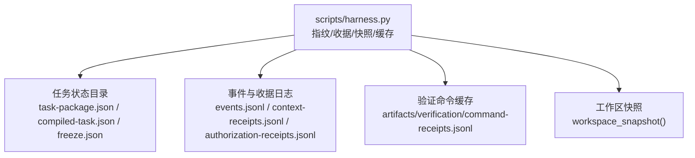
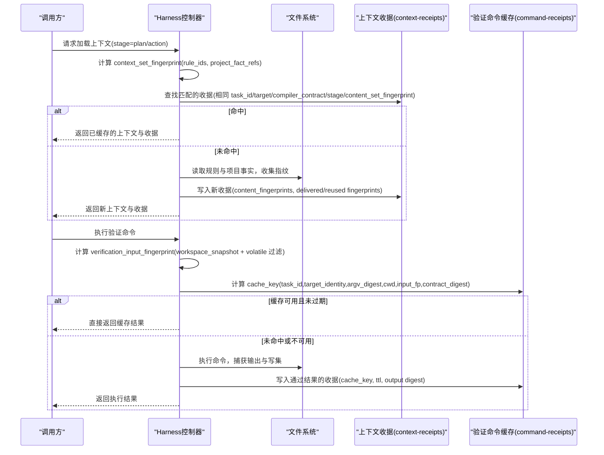
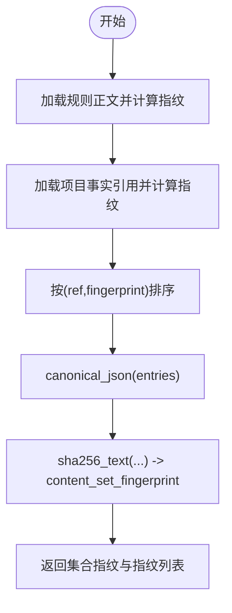
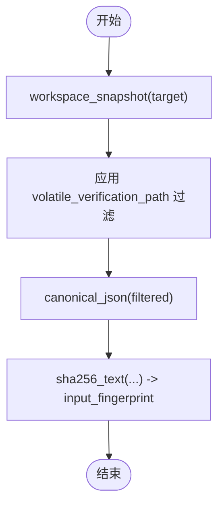
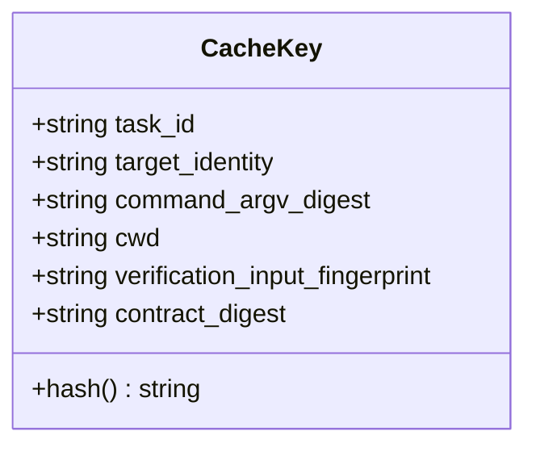
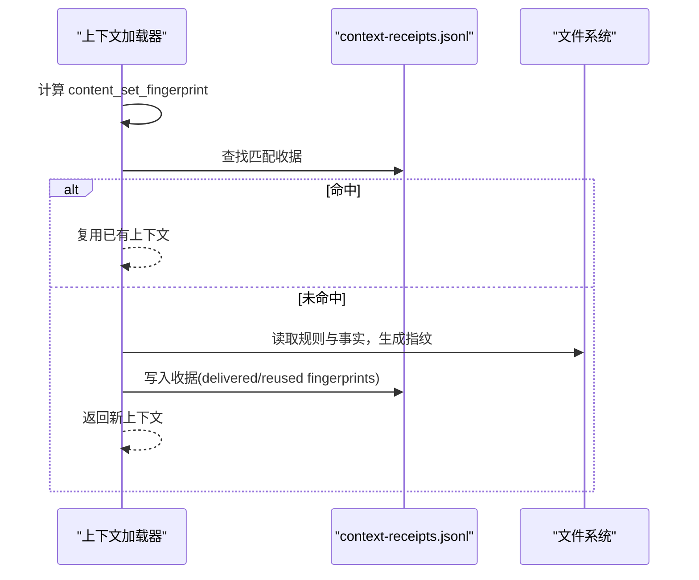
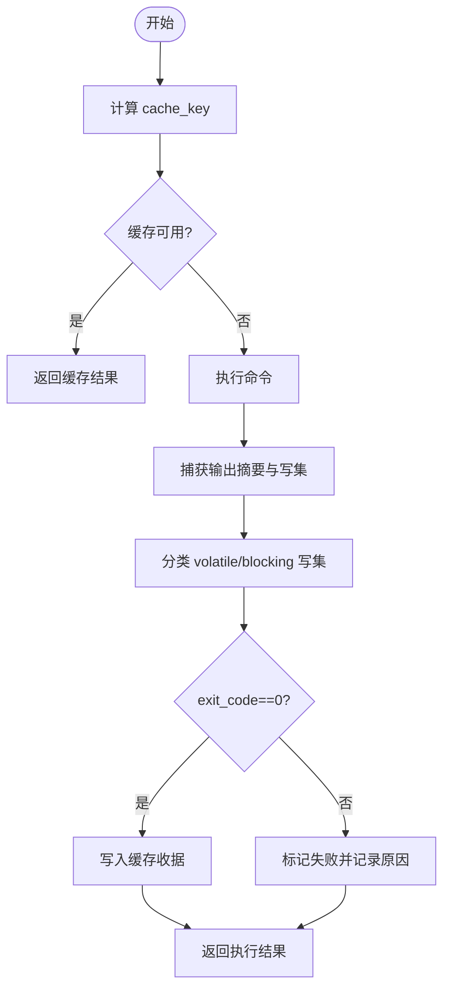
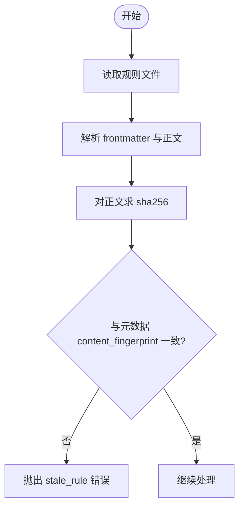
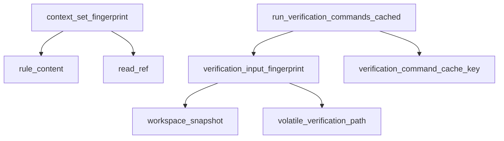

# 内容寻址缓存

<cite>
**本文引用的文件**   
- [scripts/harness.py](file://scripts/harness.py)
- [tests/test_harness.py](file://tests/test_harness.py)
</cite>

## 目录
1. [简介](#简介)
2. [项目结构](#项目结构)
3. [核心组件](#核心组件)
4. [架构总览](#架构总览)
5. [详细组件分析](#详细组件分析)
6. [依赖关系分析](#依赖关系分析)
7. [性能考量](#性能考量)
8. [故障排查指南](#故障排查指南)
9. [结论](#结论)
10. [附录](#附录)

## 简介
本文件系统化阐述 Docs Harness 的内容寻址缓存机制，重点覆盖：
- context_content_fingerprint（上下文内容指纹）与 verification_input_fingerprint（验证输入指纹）的计算算法
- 文件内容哈希、元数据指纹与版本信息的组合策略
- 基于内容的唯一标识生成、重复内容检测与存储优化
- 缓存键的生成规则（输入依赖分析、环境变量影响、运行时参数处理）
- 指纹计算示例与缓存命中场景
- 内容完整性验证与损坏检测机制

## 项目结构
- 核心实现集中在 scripts/harness.py，包含指纹计算、收据管理、工作区快照、验证命令缓存等关键逻辑。
- tests/test_harness.py 提供契约与行为测试，间接验证指纹与缓存相关行为。

**图表来源** 
- [scripts/harness.py:4196-4211](file://scripts/harness.py#L4196-L4211)
- [scripts/harness.py:5902-5911](file://scripts/harness.py#L5902-L5911)
- [scripts/harness.py:5962-6072](file://scripts/harness.py#L5962-L6072)
- [scripts/harness.py:3229-3262](file://scripts/harness.py#L3229-L3262)

**章节来源**
- [scripts/harness.py:4196-4211](file://scripts/harness.py#L4196-L4211)
- [scripts/harness.py:5902-5911](file://scripts/harness.py#L5902-L5911)
- [scripts/harness.py:5962-6072](file://scripts/harness.py#L5962-L6072)
- [scripts/harness.py:3229-3262](file://scripts/harness.py#L3229-L3262)

## 核心组件
- 上下文内容指纹（context_set_fingerprint）：对规则正文与项目事实引用进行规范化排序后求哈希，得到“内容集合指纹”，用于上下文收据匹配与增量复用。
- 验证输入指纹（verification_input_fingerprint）：对工作区进行快照并过滤易变项，得到稳定的“验证输入指纹”，作为验证命令缓存键的核心组成部分。
- 上下文收据（context-receipts.jsonl）：记录每个阶段（plan/action/work_package）加载的内容指纹集合与集合指纹，支持跨阶段去重与增量加载。
- 验证命令收据缓存（command-receipts.jsonl）：按 cache_key 缓存验证命令执行结果，避免重复执行。
- 工作区快照（workspace_snapshot）：遍历工作区文件，小文件使用 sha256 正文指纹，大文件使用“大小+mtime”摘要，排除忽略目录与 .docs-harness 内部路径。
- 目标身份（target_identity）：对 Git 仓库远端 URL 做脱敏后求哈希，或回退到本地路径哈希，确保不同仓库/路径产生不同身份。
- 环境指纹（environment_fingerprint）：记录 Python 版本、平台与可执行路径，参与冻结快照与环境一致性校验。

**章节来源**
- [scripts/harness.py:4196-4211](file://scripts/harness.py#L4196-L4211)
- [scripts/harness.py:5902-5911](file://scripts/harness.py#L5902-L5911)
- [scripts/harness.py:4297-4444](file://scripts/harness.py#L4297-L4444)
- [scripts/harness.py:5962-6072](file://scripts/harness.py#L5962-L6072)
- [scripts/harness.py:1115-1139](file://scripts/harness.py#L1115-L1139)
- [scripts/harness.py:601-613](file://scripts/harness.py#L601-L613)
- [scripts/harness.py:1239-1244](file://scripts/harness.py#L1239-L1244)

## 架构总览
下图展示内容寻址缓存的关键流程：从上下文加载到验证命令执行的完整链路，以及各阶段的指纹与收据交互。

**图表来源** 
- [scripts/harness.py:4196-4211](file://scripts/harness.py#L4196-L4211)
- [scripts/harness.py:4297-4444](file://scripts/harness.py#L4297-L4444)
- [scripts/harness.py:5902-5911](file://scripts/harness.py#L5902-L5911)
- [scripts/harness.py:5962-6072](file://scripts/harness.py#L5962-L6072)

## 详细组件分析

### 上下文内容指纹（context_content_fingerprint）
- 组成要素
  - 规则正文指纹：对规则的 frontmatter 之后的正文部分求 sha256，并与规则元数据中的 content_fingerprint 比对，防止规则被篡改或过期。
  - 项目事实引用指纹：对引用的项目文件（可选锚点章节）内容进行 sha256。
  - 集合指纹：将上述条目按 ref 与 fingerprint 排序后 canonical JSON 再求 sha256，得到稳定的集合指纹。
- 用途
  - 在 context-receipts.jsonl 中匹配历史收据，实现上下文缓存命中。
  - 记录 delivered_content_fingerprints 与 reused_content_fingerprints，支持增量加载与跨 stage 去重。
- 复杂度
  - 时间复杂度 O(N log N)（排序），N 为规则与事实引用数量；空间复杂度 O(N)。

**图表来源** 
- [scripts/harness.py:4182-4194](file://scripts/harness.py#L4182-L4194)
- [scripts/harness.py:4163-4180](file://scripts/harness.py#L4163-L4180)
- [scripts/harness.py:4196-4211](file://scripts/harness.py#L4196-L4211)

**章节来源**
- [scripts/harness.py:4182-4194](file://scripts/harness.py#L4182-L4194)
- [scripts/harness.py:4163-4180](file://scripts/harness.py#L4163-L4180)
- [scripts/harness.py:4196-4211](file://scripts/harness.py#L4196-L4211)

### 验证输入指纹（verification_input_fingerprint）
- 组成要素
  - workspace_snapshot(target)：遍历工作区，小文件使用 sha256 正文指纹，大文件使用“大小:mtime_ns”摘要，排除 .git、node_modules、.venv 及 .docs-harness/runs|quality-ledger|knowledge|knowledge-jobs|background 等目录。
  - volatile 过滤：根据内置白名单与用户配置的 verification.volatile_paths 过滤掉易变文件（如 __pycache__、*.tmp、*.log 等）。
  - 最终指纹：对过滤后的快照进行 canonical JSON 再求 sha256。
- 用途
  - 作为验证命令缓存键的一部分，确保相同输入（忽略易变项）命中同一缓存。
- 配置影响
  - verification.command_cache_enabled：控制是否启用验证命令缓存。
  - verification.volatile_paths：自定义易变路径模式，需满足安全校验（非绝对路径、无通配符在前缀、不在 .git/.docs-harness 下等）。

**图表来源** 
- [scripts/harness.py:1115-1139](file://scripts/harness.py#L1115-L1139)
- [scripts/harness.py:1219-1236](file://scripts/harness.py#L1219-L1236)
- [scripts/harness.py:5902-5911](file://scripts/harness.py#L5902-L5911)

**章节来源**
- [scripts/harness.py:1115-1139](file://scripts/harness.py#L1115-L1139)
- [scripts/harness.py:1219-1236](file://scripts/harness.py#L1219-L1236)
- [scripts/harness.py:5902-5911](file://scripts/harness.py#L5902-L5911)

### 缓存键生成规则（verification_command_cache_key）
- 键字段
  - task_id：任务唯一标识
  - target_identity：目标仓库/路径的身份指纹（远端URL脱敏或本地路径哈希）
  - command_argv_digest：命令参数的规范化 JSON 的 sha256
  - cwd：工作目录（通常为 target.resolve()）
  - verification_input_fingerprint：验证输入指纹
  - contract_digest：验证命令规范（raw spec）的规范化 JSON 的 sha256
- 特性
  - 所有字段均经过规范化与哈希，保证跨进程/跨机器稳定
  - 当任一字段变化时，缓存失效，触发重新执行与缓存更新

**图表来源** 
- [scripts/harness.py:5913-5933](file://scripts/harness.py#L5913-L5933)
- [scripts/harness.py:601-613](file://scripts/harness.py#L601-L613)

**章节来源**
- [scripts/harness.py:5913-5933](file://scripts/harness.py#L5913-L5933)
- [scripts/harness.py:601-613](file://scripts/harness.py#L601-L613)

### 上下文收据与增量复用
- 收据字段
  - schema_version、task_id、package_revision、package_fingerprint、target_identity、compiler_contract、stage、work_package_id
  - rule_ids、project_fact_refs、content_fingerprints、delivered_content_fingerprints、reused_content_fingerprints、content_set_fingerprint、loaded_at
- 命中条件
  - 相同 task_id、target_identity、compiler_contract、stage（或 work_package_id）、content_set_fingerprint
- 增量逻辑
  - 若存在 prior_context_content_fingerprints，则仅交付未在之前阶段出现过的内容指纹，减少重复负载

**图表来源** 
- [scripts/harness.py:4297-4444](file://scripts/harness.py#L4297-L4444)
- [scripts/harness.py:4257-4278](file://scripts/harness.py#L4257-L4278)

**章节来源**
- [scripts/harness.py:4297-4444](file://scripts/harness.py#L4297-L4444)
- [scripts/harness.py:4257-4278](file://scripts/harness.py#L4257-L4278)

### 验证命令缓存与执行流程
- 执行步骤
  - 计算 input_fingerprint 与 cache_key
  - 检查缓存可用性（result=passed、ttl 未过期）
  - 命中：直接返回缓存结果
  - 未命中：执行命令，捕获 stdout/stderr 摘要与写集，分类 volatile/blocking 写集，写入收据（仅 passed）
- 安全性
  - 禁止在工作区产生阻塞性写入（blocking_write_set），否则标记失败
  - 允许易变写入（volatile_write_set），不影响缓存有效性

**图表来源** 
- [scripts/harness.py:5962-6072](file://scripts/harness.py#L5962-L6072)

**章节来源**
- [scripts/harness.py:5962-6072](file://scripts/harness.py#L5962-L6072)

### 内容完整性验证与损坏检测
- 规则完整性
  - 规则正文指纹必须与元数据中的 content_fingerprint 一致，否则视为 stale_rule
- 质量记录完整性
  - 质量记录在持久化前会计算 content_fingerprint，并在后续校验时对比，不一致则判定损坏
- 冻结快照与环境一致性
  - freeze.json 包含 workspace_fingerprint 与 environment fingerprint，可用于后续一致性校验

**图表来源** 
- [scripts/harness.py:4182-4194](file://scripts/harness.py#L4182-L4194)
- [scripts/harness.py:6977-7033](file://scripts/harness.py#L6977-L7033)
- [scripts/harness.py:3229-3262](file://scripts/harness.py#L3229-L3262)

**章节来源**
- [scripts/harness.py:4182-4194](file://scripts/harness.py#L4182-L4194)
- [scripts/harness.py:6977-7033](file://scripts/harness.py#L6977-L7033)
- [scripts/harness.py:3229-3262](file://scripts/harness.py#L3229-L3262)

## 依赖关系分析
- 模块内依赖
  - context_set_fingerprint 依赖 rule_content 与 read_ref
  - verification_input_fingerprint 依赖 workspace_snapshot 与 volatile_verification_path
  - run_verification_commands_cached 依赖 verification_input_fingerprint、verification_command_cache_key 与持久化函数
- 外部依赖
  - Git 命令用于 target_identity 与快照（在非 Git 工作区回退到全量扫描）
  - 文件系统 I/O 用于读取规则、事实与持久化收据

**图表来源** 
- [scripts/harness.py:4196-4211](file://scripts/harness.py#L4196-L4211)
- [scripts/harness.py:5902-5911](file://scripts/harness.py#L5902-L5911)
- [scripts/harness.py:5962-6072](file://scripts/harness.py#L5962-L6072)

**章节来源**
- [scripts/harness.py:4196-4211](file://scripts/harness.py#L4196-L4211)
- [scripts/harness.py:5902-5911](file://scripts/harness.py#L5902-L5911)
- [scripts/harness.py:5962-6072](file://scripts/harness.py#L5962-L6072)

## 性能考量
- 指纹计算
  - 小文件直接 sha256，大文件使用“大小+mtime”快速摘要，降低 I/O 压力
  - 排序与 canonical JSON 序列化开销可控，适合中等规模规则与事实引用
- 缓存命中率
  - 通过 content_set_fingerprint 与 verification_input_fingerprint 精确匹配，提高命中率
  - 易变项过滤避免缓存污染
- 并发与锁
  - 上下文收据写入使用 state_lock 防止竞态，超时保护避免死锁

[本节为通用指导，不直接分析具体文件]

## 故障排查指南
- 常见错误码与原因
  - stale_rule：规则正文指纹与元数据不一致，检查规则文件是否被修改
  - invalid_json/missing_file：JSON 文件或事实引用无效或缺失
  - git_remote_drift/git_ref_scope_violation：Git 远端漂移或受控引用范围违规
  - verification_command_workspace_write：验证命令产生阻塞性写入，需调整命令或配置
- 定位方法
  - 查看 events.jsonl 与 context-receipts.jsonl 获取上下文加载与缓存命中情况
  - 检查 artifacts/verification/command-receipts.jsonl 确认验证命令缓存状态
  - 核对 freeze.json 中的 workspace_fingerprint 与 environment fingerprint 是否一致

**章节来源**
- [scripts/harness.py:4182-4194](file://scripts/harness.py#L4182-L4194)
- [scripts/harness.py:4297-4444](file://scripts/harness.py#L4297-L4444)
- [scripts/harness.py:5962-6072](file://scripts/harness.py#L5962-L6072)
- [scripts/harness.py:3229-3262](file://scripts/harness.py#L3229-L3262)

## 结论
Docs Harness 的内容寻址缓存通过严格的指纹计算与收据机制，实现了上下文与验证命令的高效复用与一致性保障。其设计兼顾了稳定性（哈希与规范化）、安全性（完整性校验与范围约束）与性能（增量与缓存），适用于复杂文档治理与工作流自动化场景。

[本节为总结，不直接分析具体文件]

## 附录
- 指纹计算示例（概念性）
  - 假设规则 A 正文为 “...”，事实文件 B 内容为 “...”，则 context_set_fingerprint 为对 entries=[{ref:"rule:A",fingerprint:sha256(A)}, {ref:"fact:B",fingerprint:sha256(B)}] 排序后 canonical JSON 的 sha256
  - 假设工作区快照过滤后为 {path1:fp1, path2:fp2}，则 verification_input_fingerprint 为该映射 canonical JSON 的 sha256
- 缓存命中场景
  - 相同 task_id、target_identity、compiler_contract、stage、content_set_fingerprint → 上下文缓存命中
  - 相同 cache_key 且 result=passed、ttl 未过期 → 验证命令缓存命中

[本节为概念性说明，不直接分析具体文件]