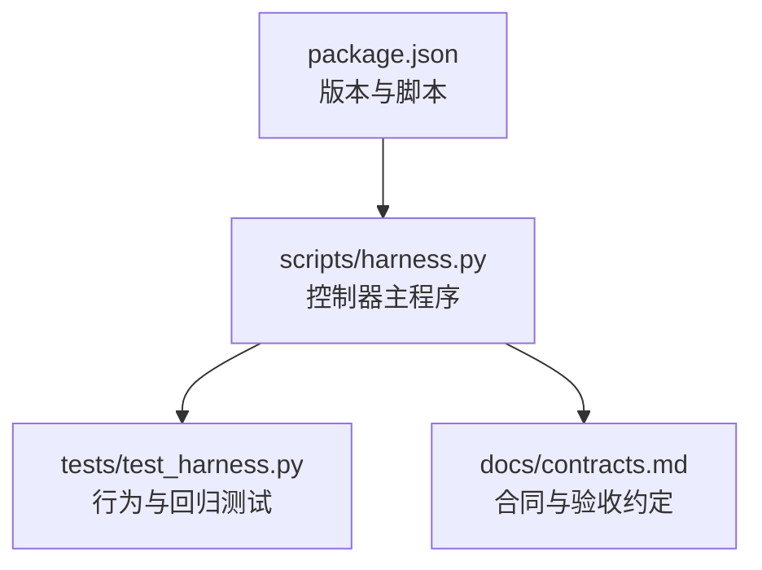
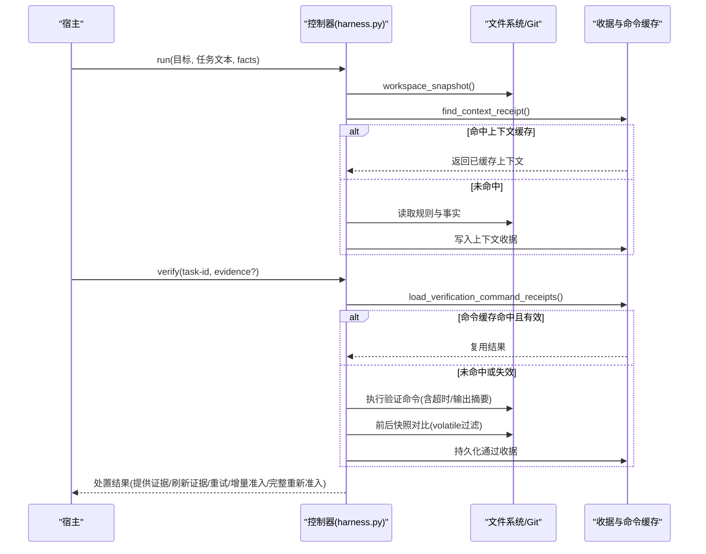
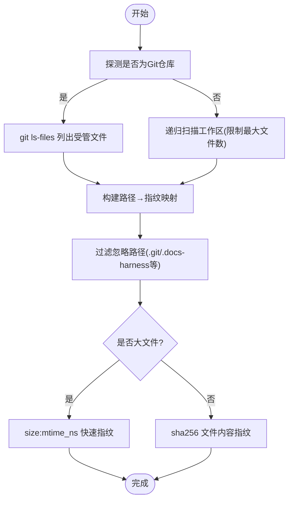
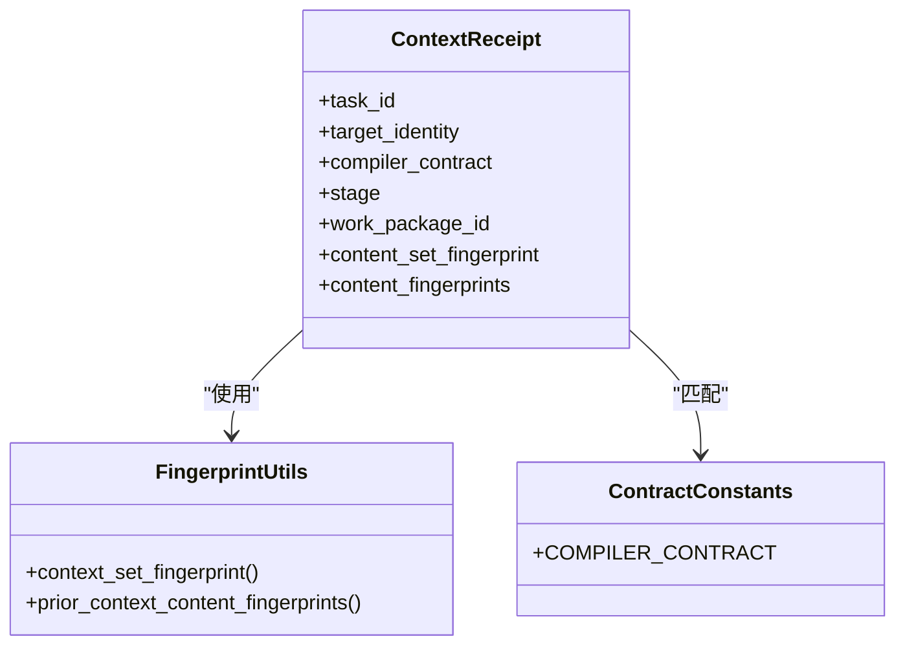
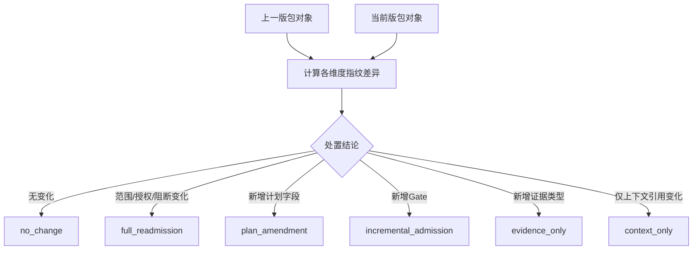
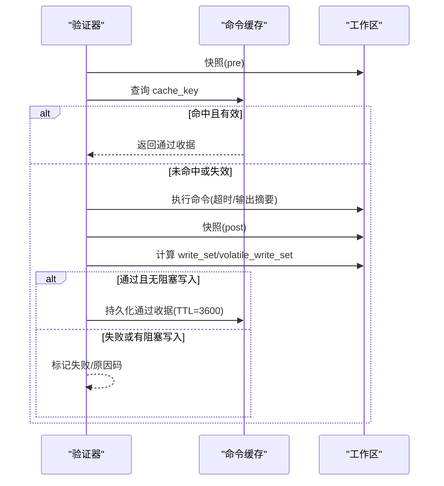
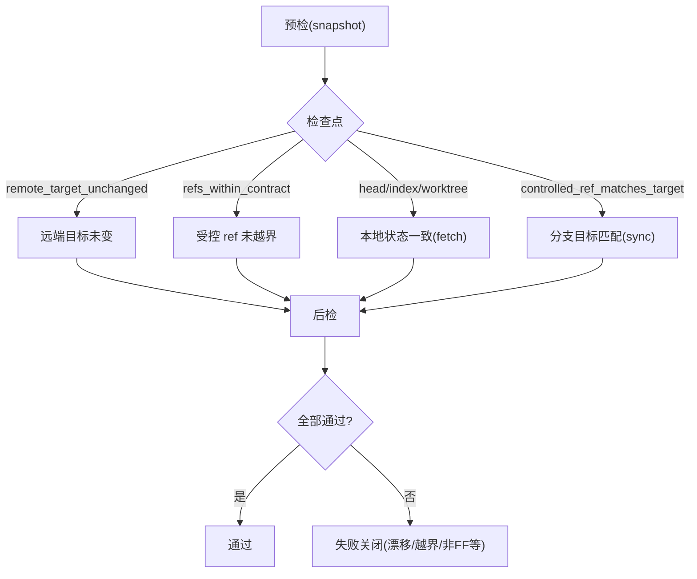
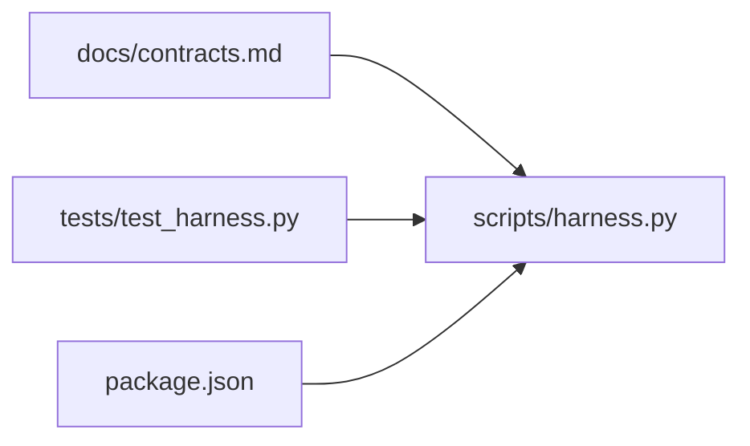

# 缓存失效策略

<cite>
**本文引用的文件**   
- [scripts/harness.py](file://scripts/harness.py)
- [tests/test_harness.py](file://tests/test_harness.py)
- [docs/contracts.md](file://docs/contracts.md)
- [package.json](file://package.json)
</cite>

## 目录
1. [简介](#简介)
2. [项目结构](#项目结构)
3. [核心组件](#核心组件)
4. [架构总览](#架构总览)
5. [详细组件分析](#详细组件分析)
6. [依赖关系分析](#依赖关系分析)
7. [性能考量](#性能考量)
8. [故障排查指南](#故障排查指南)
9. [结论](#结论)
10. [附录](#附录)

## 简介
本文件面向 Docs Harness 的“缓存失效策略”，系统性阐述工作区输入变化检测、编译器契约变更处理、包修订（package revision）兼容机制，以及验证命令与上下文收据的缓存与失效。文档同时给出监控指标与调试建议，并基于源码实现进行性能分析与优化建议。

## 项目结构
Docs Harness 的核心控制逻辑集中在 Python 脚本中，配合测试套件与合同文档共同构成可验证的实现基线。关键路径：
- 控制器主程序：scripts/harness.py
- 单元测试：tests/test_harness.py
- 合同与行为约定：docs/contracts.md
- 包元数据与脚本入口：package.json

**图表来源** 
- [scripts/harness.py](file://scripts/harness.py)
- [tests/test_harness.py](file://tests/test_harness.py)
- [docs/contracts.md](file://docs/contracts.md)
- [package.json](file://package.json)

**章节来源**
- [scripts/harness.py](file://scripts/harness.py)
- [tests/test_harness.py](file://tests/test_harness.py)
- [docs/contracts.md](file://docs/contracts.md)
- [package.json](file://package.json)

## 核心组件
围绕缓存失效的关键能力包括：
- 工作区快照与增量差异：workspace_snapshot、snapshot_changes
- Git 预检/后检：git_preflight_contract、git_postcheck
- 上下文收据与内容指纹：context_set_fingerprint、find_context_receipt、prior_context_content_fingerprints
- 验证命令缓存：verification_input_fingerprint、verification_command_cache_key、run_verification_commands_cached、persist_verification_command_cache
- 包修订与合同差异：contract_disposition、build_contract_delta、scope/plan/authorization contract fingerprint
- 事件与指标：append_task_event 记录 context_cache_hit、readmission_count、evidence_round_count 等

这些组件协同完成“最小化重新计算”和“精准失效”。

**章节来源**
- [scripts/harness.py:1115-1138](file://scripts/harness.py#L1115-L1138)
- [scripts/harness.py:1141-1142](file://scripts/harness.py#L1141-L1142)
- [scripts/harness.py:680-794](file://scripts/harness.py#L680-L794)
- [scripts/harness.py:796-878](file://scripts/harness.py#L796-L794)
- [scripts/harness.py:4196-4211](file://scripts/harness.py#L4196-L4211)
- [scripts/harness.py:4213-4254](file://scripts/harness.py#L4213-L4254)
- [scripts/harness.py:4257-4277](file://scripts/harness.py#L4257-L4277)
- [scripts/harness.py:5902-6101](file://scripts/harness.py#L5902-L6101)
- [scripts/harness.py:3154-3197](file://scripts/harness.py#L3154-L3197)
- [scripts/harness.py:1034-1074](file://scripts/harness.py#L1034-L1074)

## 架构总览
下图展示任务生命周期中与缓存失效相关的关键流程：从任务创建、上下文加载、验证执行到最终验收，各阶段均通过指纹与收据驱动精确失效。

**图表来源** 
- [scripts/harness.py:4297-4395](file://scripts/harness.py#L4297-L4395)
- [scripts/harness.py:5902-6101](file://scripts/harness.py#L5902-L6101)
- [scripts/harness.py:1115-1138](file://scripts/harness.py#L1115-L1138)
- [scripts/harness.py:4213-4254](file://scripts/harness.py#L4213-L4254)

## 详细组件分析

### 工作区输入变化检测（文件系统监控、增量更新与全量扫描）
- 全量扫描：workspace_snapshot 遍历受控路径，生成相对路径到内容指纹的映射；对大文件采用 size:mtime_ns 快速指纹以减少 IO。
- 增量差异：snapshot_changes 比较 before/after 快照，输出变更路径集合。
- 忽略策略：excluded_workspace_path 排除 .git、.docs-harness 运行态目录等；非 Git 工作区存在文件数量上限保护。
- Git 集成：git_workspace_paths 优先使用 git ls-files 获取受管文件列表，保证一致性。

**图表来源** 
- [scripts/harness.py:1115-1138](file://scripts/harness.py#L1115-L1138)
- [scripts/harness.py:1089-1112](file://scripts/harness.py#L1089-L1112)
- [scripts/harness.py:1076-1086](file://scripts/harness.py#L1076-L1086)

**章节来源**
- [scripts/harness.py:1115-1138](file://scripts/harness.py#L1115-L1138)
- [scripts/harness.py:1089-1112](file://scripts/harness.py#L1089-L1112)
- [scripts/harness.py:1076-1086](file://scripts/harness.py#L1076-L1086)

### 编译器契约变化的处理（版本兼容性、差异分析与自动升级）
- 编译器契约常量：COMPILER_CONTRACT 用于上下文收据匹配，确保跨阶段复用仅在相同契约下生效。
- 上下文指纹：context_set_fingerprint 将规则与项目事实引用组合为内容集指纹，作为缓存键的一部分。
- 收据查找：find_context_receipt 按 task_id、target_identity、stage/work_package、compiler_contract、content_set_fingerprint 五要素匹配。
- 历史指纹去重：prior_context_content_fingerprints 收集已交付过的内容指纹，避免重复加载。
- 版本迁移：v1→v2 迁移在合同中明确，禁止静默回退，需显式迁移与回滚检查。

**图表来源** 
- [scripts/harness.py:4196-4211](file://scripts/harness.py#L4196-L4211)
- [scripts/harness.py:4213-4254](file://scripts/harness.py#L4213-L4254)
- [scripts/harness.py:4257-4277](file://scripts/harness.py#L4257-L4277)
- [docs/contracts.md:236-249](file://docs/contracts.md#L236-L249)

**章节来源**
- [scripts/harness.py:4196-4211](file://scripts/harness.py#L4196-L4211)
- [scripts/harness.py:4213-4254](file://scripts/harness.py#L4213-L4254)
- [scripts/harness.py:4257-4277](file://scripts/harness.py#L4257-L4277)
- [docs/contracts.md:236-249](file://docs/contracts.md#L236-L249)

### package revision 兼容处理机制（向后兼容、破坏性变更与迁移脚本）
- 包指纹与范围/授权/方案指纹：package_fingerprint、scope_contract_fingerprint、authorization_contract_fingerprint、plan_contract_fingerprint 分别对关键维度生成稳定指纹。
- 合同差异判定：contract_disposition 根据上述指纹与字段差集决定 no_change、incremental_admission、full_readmission 等处置。
- 差异报告：build_contract_delta 输出新增 Gate、新增计划字段、新增上下文引用、新增证据类型、范围/路由/授权/工作包/阻断交付物变化等结构化信息。
- 冻结与基线：freeze.json 保存首次任务基线与初始环境指纹，后续重新准入不刷新基线，保障可追溯。

**图表来源** 
- [scripts/harness.py:3078-3127](file://scripts/harness.py#L3078-L3127)
- [scripts/harness.py:3154-3197](file://scripts/harness.py#L3154-L3197)
- [scripts/harness.py:3229-3262](file://scripts/harness.py#L3229-L3262)

**章节来源**
- [scripts/harness.py:3078-3127](file://scripts/harness.py#L3078-L3127)
- [scripts/harness.py:3154-3197](file://scripts/harness.py#L3154-L3197)
- [scripts/harness.py:3229-3262](file://scripts/harness.py#L3229-L3262)

### 验证命令缓存与失效（输入指纹、TTL、volatile 过滤）
- 输入指纹：verification_input_fingerprint 在工作区快照基础上剔除 volatile 项，形成稳定的输入指纹。
- 缓存键：verification_command_cache_key 聚合 task_id、target_identity、命令 argv 摘要、cwd、输入指纹、契约摘要。
- 缓存读写：run_verification_commands_cached 支持命中跳过、失败/超时记录、volatile 写入分类、通过收据持久化。
- TTL 与可用性：verification_command_receipt_usable 校验 TTL 与状态，过期或失败不可复用。
- 配置开关：verification.command_cache_enabled 允许整体关闭命令缓存；auto_attribute_in_scope 控制写范围自动归因。

**图表来源** 
- [scripts/harness.py:5902-6101](file://scripts/harness.py#L5902-L6101)
- [scripts/harness.py:1191-1202](file://scripts/harness.py#L1191-L1202)
- [scripts/harness.py:1205-1216](file://scripts/harness.py#L1205-L1216)

**章节来源**
- [scripts/harness.py:5902-6101](file://scripts/harness.py#L5902-L6101)
- [scripts/harness.py:1191-1202](file://scripts/harness.py#L1191-L1202)
- [scripts/harness.py:1205-1216](file://scripts/harness.py#L1205-L1216)

### Git 状态约束与漂移处理（预检/后检、ref 越界、fast-forward）
- 预检：git_preflight_contract 捕获远端 URL、refs、index_tree、工作区指纹、LFS/Submodule 可用性与 fast-forward 可行性，生成 snapshot 与 blockers。
- 后检：git_postcheck 校验 remote_target_unchanged、controlled refs 未越界、HEAD/index/worktree 不变（fetch）或 controlled_ref 匹配（sync），并识别 changed_refs/outside_refs。
- 漂移处理：远端漂移触发重新准入，diff 落盘文件并入 write_scope，支持继承 plan_ref/plan_fingerprint/plan_artifact 以缩短恢复路径。

**图表来源** 
- [scripts/harness.py:680-794](file://scripts/harness.py#L680-L794)
- [scripts/harness.py:796-878](file://scripts/harness.py#L796-L878)

**章节来源**
- [scripts/harness.py:680-794](file://scripts/harness.py#L680-L794)
- [scripts/harness.py:796-878](file://scripts/harness.py#L796-L878)

## 依赖关系分析
- 控制器与合同：harness.py 严格遵循 docs/contracts.md 的行为约定，如退出码、处置策略、证据与收据格式。
- 控制器与测试：tests/test_harness.py 覆盖 Git fetch/sync、漂移、dirty 冲突、LFS/Submodule 不可用等场景，确保失效策略正确性。
- 包元数据：package.json 定义版本与自测脚本，便于回归与自检。

**图表来源** 
- [docs/contracts.md](file://docs/contracts.md)
- [scripts/harness.py](file://scripts/harness.py)
- [tests/test_harness.py](file://tests/test_harness.py)
- [package.json](file://package.json)

**章节来源**
- [docs/contracts.md](file://docs/contracts.md)
- [scripts/harness.py](file://scripts/harness.py)
- [tests/test_harness.py](file://tests/test_harness.py)
- [package.json](file://package.json)

## 性能考量
- 快照成本：workspace_snapshot 对大文件采用 size:mtime_ns 快速指纹，降低 IO；非 Git 模式有文件数量上限保护，避免极端情况。
- 命令缓存：verification_command_cache_enabled 默认开启，显著减少重复验证开销；TTL=3600 平衡稳定性与时效性。
- 上下文复用：context receipt 按 content_set_fingerprint 精确匹配，避免重复加载规则与事实；prior_context_content_fingerprints 进一步去重。
- Git 操作：preflight/postcheck 通过一次性快照与 diff 计算，避免多次调用；LFS/Submodule 可用性提前探测，失败快速关闭。
- 事件统计：append_task_event 记录 context_cache_hit、readmission_count、evidence_round_count 等指标，便于定位热点与瓶颈。

优化建议：
- 对超大仓库考虑启用更细粒度的 scope 限定，减少 snapshot 规模。
- 合理设置 verification.volatile_paths，避免误判 volatile 导致频繁重跑。
- 在高并发场景关注 state_lock 竞争，必要时拆分任务粒度。
- 结合 events.jsonl 定期分析 readmission 与 evidence round 分布，优化 Gate 与范围声明。

[本节为通用指导，无需特定文件来源]

## 故障排查指南
常见失效原因与定位方法：
- 上下文未命中：检查 compiler_contract、stage/work_package、content_set_fingerprint 是否一致；查看 context-receipts.jsonl 最近条目。
- 验证命令缓存未命中：确认 input_fingerprint 是否因 volatile 或工作区变化而改变；检查 command-receipts.jsonl 的 cache_key 与 TTL。
- Git 漂移/越界：查看 git_postcheck 的 checks 与 reason_code；核对 controlled_refs_namespace 与 git_scope。
- 包修订导致重新准入：比对 contract_disposition 与 build_contract_delta 输出，定位具体变化维度（范围/授权/计划/Gate/上下文）。
- 事件与指标：events.jsonl 中的 phase/context/readmission/evidence 字段可辅助判断卡点。

**章节来源**
- [scripts/harness.py:4213-4254](file://scripts/harness.py#L4213-L4254)
- [scripts/harness.py:5902-6101](file://scripts/harness.py#L5902-L6101)
- [scripts/harness.py:796-878](file://scripts/harness.py#L796-L878)
- [scripts/harness.py:3154-3197](file://scripts/harness.py#L3154-L3197)
- [scripts/harness.py:1034-1074](file://scripts/harness.py#L1034-L1074)

## 结论
Docs Harness 的缓存失效策略以“指纹+收据”为核心，贯穿工作区快照、Git 状态、上下文内容与验证命令四大层面，实现最小化重新计算与精准失效。通过严格的合同约束、清晰的处置决策与完善的监控指标，既保证了安全性与可审计性，也兼顾了性能与可维护性。

[本节为总结，无需特定文件来源]

## 附录
- 监控指标建议：
  - context_cache_hit、context_load_count、readmission_count、evidence_round_count、host_receipt_count、business_action_count
  - 验证命令命中率与平均耗时、TTL 过期率
  - Git 漂移次数与 rebase/fast-forward 比例
- 调试工具：
  - 查看 events.jsonl 与 context-receipts.jsonl、command-receipts.jsonl
  - 打印 contract_disposition 与 build_contract_delta 的差异
  - 使用 --json 输出与 tests/test_harness.py 的断言用例复现实验环境

[本节为补充说明，无需特定文件来源]