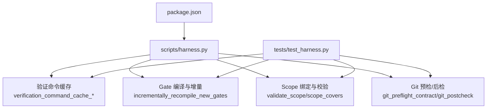
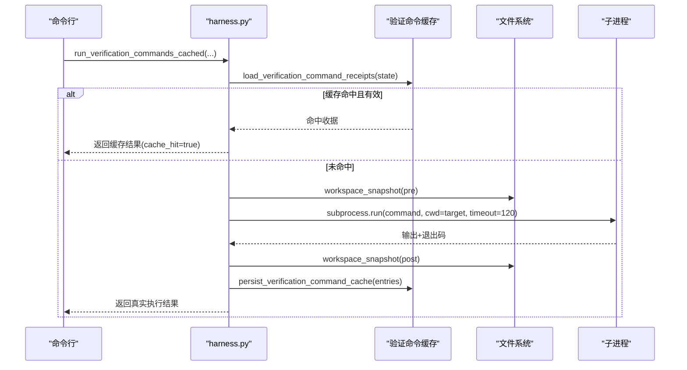
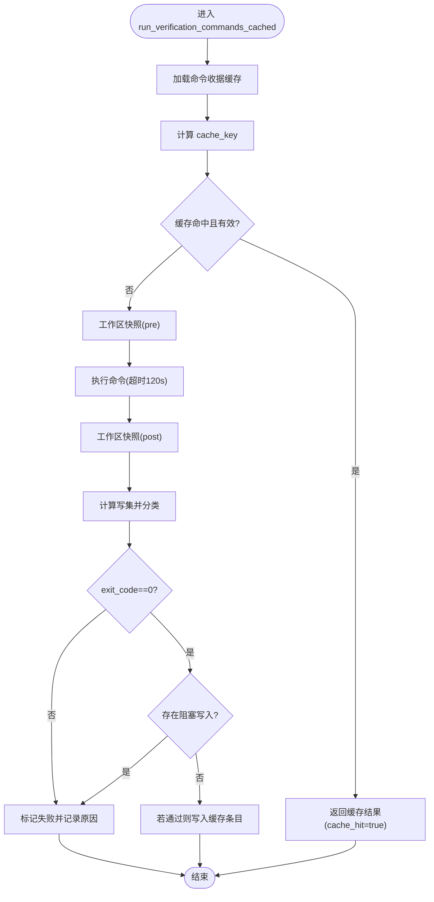
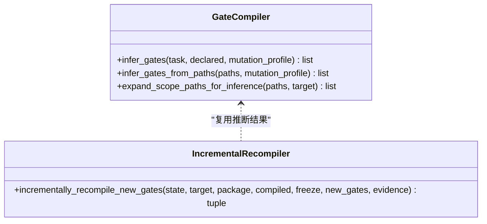
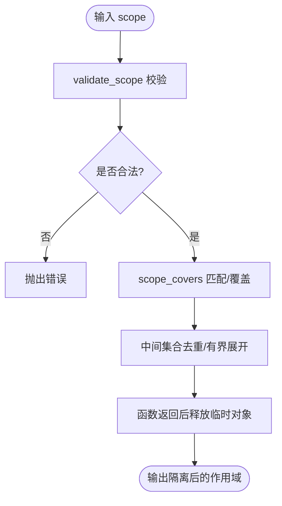
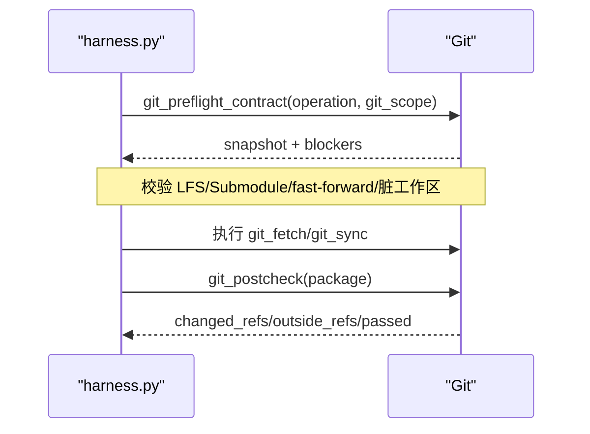
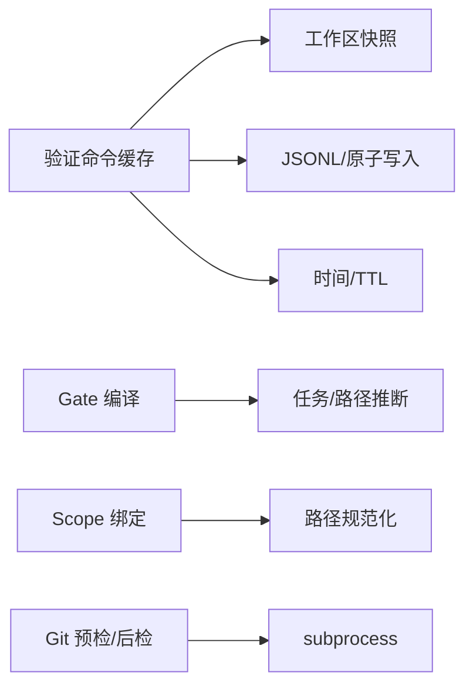

# 缓存性能优化

<cite>
**本文引用的文件**   
- [scripts/harness.py](file://scripts/harness.py)
- [tests/test_harness.py](file://tests/test_harness.py)
- [package.json](file://package.json)
</cite>

## 目录
1. [简介](#简介)
2. [项目结构](#项目结构)
3. [核心组件](#核心组件)
4. [架构总览](#架构总览)
5. [详细组件分析](#详细组件分析)
6. [依赖关系分析](#依赖关系分析)
7. [性能考量](#性能考量)
8. [故障排查指南](#故障排查指南)
9. [结论](#结论)
10. [附录](#附录)

## 简介
本文件聚焦 Docs Harness 的缓存与编译优化，围绕以下目标展开：
- Scope 绑定优化：作用域隔离、内存管理与垃圾回收策略
- Gate 编译优化：并行/增量编译与结果缓存
- 验证命令执行优化：命令预编译、参数缓存与执行计划优化
- 监控指标与基准测试方法
- 内存使用、I/O 操作与网络请求优化的最佳实践

## 项目结构
- scripts/harness.py：控制器主逻辑，包含任务包构建、Gate 推断与编译、验证命令缓存、Git 预检查/后检查、状态持久化等
- tests/test_harness.py：覆盖验证命令缓存、Git 同步/拉取、Gate 推断、范围校验等关键路径
- package.json：脚本入口与自测命令

**图表来源** 
- [scripts/harness.py:5910-6109](file://scripts/harness.py#L5910-L6109)
- [scripts/harness.py:5539-5679](file://scripts/harness.py#L5539-L5679)
- [scripts/harness.py:2500-2529](file://scripts/harness.py#L2500-L2529)
- [scripts/harness.py:680-794](file://scripts/harness.py#L680-L794)
- [tests/test_harness.py:3459-3510](file://tests/test_harness.py#L3459-L3510)
- [package.json:17-21](file://package.json#L17-L21)

**章节来源**
- [scripts/harness.py:1-120](file://scripts/harness.py#L1-L120)
- [tests/test_harness.py:1-120](file://tests/test_harness.py#L1-L120)
- [package.json:17-21](file://package.json#L17-L21)

## 核心组件
- 验证命令缓存子系统：按任务、目标、命令参数、工作目录、输入指纹、契约摘要生成唯一键，命中则跳过执行并返回缓存收据
- Gate 编译与增量：基于任务文本与路径推断 Gate，支持新增 Gate 的增量准入与证据继承
- Scope 绑定与隔离：严格校验 scope 为结构化路径或受控资源，提供匹配与覆盖判定
- Git 预检/后检：对 git_fetch/git_sync 进行前置约束与后置校验，确保变更范围可控
- 状态与快照：任务状态、冻结快照、事件日志与证据索引的原子写入与一致性校验

**章节来源**
- [scripts/harness.py:5910-6109](file://scripts/harness.py#L5910-L6109)
- [scripts/harness.py:5539-5679](file://scripts/harness.py#L5539-L5679)
- [scripts/harness.py:2500-2529](file://scripts/harness.py#L2500-L2529)
- [scripts/harness.py:680-794](file://scripts/harness.py#L680-L794)
- [scripts/harness.py:3200-3262](file://scripts/harness.py#L3200-L3262)

## 架构总览
下图展示“验证命令执行”的关键调用链与缓存命中流程。

**图表来源** 
- [scripts/harness.py:5962-6071](file://scripts/harness.py#L5962-L6071)
- [scripts/harness.py:6074-6083](file://scripts/harness.py#L6074-L6083)

## 详细组件分析

### 验证命令缓存（Verification Command Cache）
- 缓存键生成：由 task_id、target_identity、command_argv_digest、cwd、input_fingerprint、contract_digest 组合哈希
- 缓存读取：从 artifacts/verification/command-receipts.jsonl 加载，同 key 以最后一条为准
- 有效性判断：仅 result=passed 且 TTL 未过期才视为可用
- 执行流程：pre 快照→执行→post 快照→差异分类（阻塞写入 vs 易变写入）→通过时写入缓存条目
- 持久化：合并新条目到 JSONL，原子写入避免损坏既有索引

**图表来源** 
- [scripts/harness.py:5962-6071](file://scripts/harness.py#L5962-L6071)
- [scripts/harness.py:6074-6083](file://scripts/harness.py#L6074-L6083)

**章节来源**
- [scripts/harness.py:5910-6109](file://scripts/harness.py#L5910-L6109)
- [tests/test_harness.py:3459-3510](file://tests/test_harness.py#L3459-L3510)

### Gate 编译与增量优化
- Gate 推断：基于任务文本与路径模式推断 Gate，结合 mutation_profile 过滤
- 增量准入：当新增 Gate 不改变执行/授权/方案合同且满足稳定字段不变时，采用增量 readmission，继承本轮证据
- 结果缓存：增量过程避免全量重编译，减少上下文加载与规则匹配开销

**图表来源** 
- [scripts/harness.py:2411-2452](file://scripts/harness.py#L2411-L2452)
- [scripts/harness.py:5539-5679](file://scripts/harness.py#L5539-L5679)

**章节来源**
- [scripts/harness.py:2402-2452](file://scripts/harness.py#L2402-L2452)
- [scripts/harness.py:5539-5679](file://scripts/harness.py#L5539-L5679)

### Scope 绑定优化（作用域隔离、内存管理、GC 策略）
- 作用域隔离：validate_scope 强制结构化路径或受控资源；scope_covers 提供精确匹配与覆盖判定
- 内存管理：
  - 快照与差异：workspace_snapshot 与 snapshot_changes 控制内存占用，避免大对象常驻
  - 列表去重与有界展开：expand_scope_paths_for_inference 限制最大展开数量，防止巨量路径导致内存膨胀
- 垃圾回收策略：
  - 临时对象生命周期短（如中间集合），函数返回后即释放
  - 事件与收据追加采用流式写入，避免一次性构建超大对象
  - 缓存条目按 key 覆盖更新，避免重复累积

**图表来源** 
- [scripts/harness.py:2500-2529](file://scripts/harness.py#L2500-L2529)
- [scripts/harness.py:2455-2476](file://scripts/harness.py#L2455-L2476)

**章节来源**
- [scripts/harness.py:2500-2529](file://scripts/harness.py#L2500-L2529)
- [scripts/harness.py:2455-2476](file://scripts/harness.py#L2455-L2476)

### Git 预检/后检与范围控制
- 预检：解析 git_scope，校验远端引用、LFS/Submodule 可用性、fast-forward 条件与工作区脏读冲突
- 后检：对比 refs 变化、确认变更范围与预期一致，阻止越权写入

**图表来源** 
- [scripts/harness.py:680-794](file://scripts/harness.py#L680-L794)
- [scripts/harness.py:796-800](file://scripts/harness.py#L796-L800)

**章节来源**
- [scripts/harness.py:680-794](file://scripts/harness.py#L680-L794)
- [scripts/harness.py:796-800](file://scripts/harness.py#L796-L800)

## 依赖关系分析
- 模块内依赖：验证命令缓存依赖工作区快照、JSONL 读写与原子写入；Gate 编译依赖任务文本与路径推断；Scope 绑定依赖路径规范化与匹配
- 外部依赖：subprocess 调用 Git；文件系统 I/O 用于快照与缓存持久化；时间与时区用于 TTL 与审计

**图表来源** 
- [scripts/harness.py:5962-6071](file://scripts/harness.py#L5962-L6071)
- [scripts/harness.py:2411-2452](file://scripts/harness.py#L2411-L2452)
- [scripts/harness.py:2500-2529](file://scripts/harness.py#L2500-L2529)
- [scripts/harness.py:680-794](file://scripts/harness.py#L680-L794)

**章节来源**
- [scripts/harness.py:5962-6071](file://scripts/harness.py#L5962-L6071)
- [scripts/harness.py:2411-2452](file://scripts/harness.py#L2411-L2452)
- [scripts/harness.py:2500-2529](file://scripts/harness.py#L2500-L2529)
- [scripts/harness.py:680-794](file://scripts/harness.py#L680-L794)

## 性能考量
- 缓存命中率提升
  - 合理设置 verification.command_cache_enabled 开关，默认开启
  - 确保 input_fingerprint 与 contract_digest 准确反映输入与契约变化
  - 避免在验证命令中产生阻塞性写入，否则无法缓存
- 增量 Gate 编译
  - 新增 Gate 尽量保持 stable_fields 不变，触发增量 readmission
  - 将频繁变化的配置项收敛至非稳定字段，降低重编译概率
- Scope 与快照
  - 使用结构化 scope 与最小化路径集合，减少 expand_scope_paths_for_inference 的展开规模
  - 控制快照粒度，避免全量扫描巨型目录
- I/O 与并发
  - 使用原子写入与 JSONL 追加，降低锁竞争与损坏风险
  - 子进程执行设置超时，避免长时间阻塞

[本节为通用指导，无需特定文件引用]

## 故障排查指南
- 验证命令缓存失效
  - 检查 verification.command_cache_enabled 配置
  - 确认 command_argv_digest、contract_digest、input_fingerprint 是否随输入变化
  - 查看 command-receipts.jsonl 是否存在对应 cache_key 且 TTL 未过期
- Gate 未生效或全量重编译
  - 检查新增 Gate 是否属于 full_readmission_gates 集合
  - 核对 stable_fields 是否被修改导致增量失败
- Scope 校验失败
  - 确认 scope 为相对路径或受控资源，不包含描述性文本
  - 检查路径是否越界或包含非法字符
- Git 预检/后检失败
  - 检查 LFS/Submodule 可用性
  - 确认 fast-forward 条件与工作区无脏读冲突

**章节来源**
- [scripts/harness.py:1191-1202](file://scripts/harness.py#L1191-L1202)
- [scripts/harness.py:5910-6109](file://scripts/harness.py#L5910-L6109)
- [scripts/harness.py:2500-2529](file://scripts/harness.py#L2500-L2529)
- [scripts/harness.py:680-794](file://scripts/harness.py#L680-L794)

## 结论
Docs Harness 通过验证命令缓存、Gate 增量编译与严格的 Scope 绑定，显著提升了任务执行的效率与可预测性。配合原子 I/O、快照与 TTL 机制，系统在内存与 I/O 层面实现了良好的平衡。建议在生产环境中持续监控缓存命中率与增量成功率，并结合基准测试优化输入指纹与契约设计。

[本节为总结，无需特定文件引用]

## 附录

### 缓存性能监控指标
- 验证命令缓存命中率：cache_hit / total_commands
- 平均执行耗时：duration_ms 均值与分位
- 缓存条目大小与增长速率：command-receipts.jsonl 行数与体积
- Gate 增量成功率：incremental_gate_readmission 成功次数 / 尝试次数
- Scope 展开规模：expand_scope_paths_for_inference 返回路径数

[本节为通用指标定义，无需特定文件引用]

### 基准测试方法
- 场景设计：固定任务文本与 facts，多次运行以统计缓存命中率与耗时
- 变量控制：切换 verification.command_cache_enabled、不同 input_fingerprint、不同 contract_digest
- 数据收集：解析 --json 输出中的 duration_ms、cache_hit、evidence_types 等字段
- 回归检测：对比不同版本或配置的指标变化，识别退化

**章节来源**
- [package.json:17-21](file://package.json#L17-L21)
- [tests/test_harness.py:3459-3510](file://tests/test_harness.py#L3459-L3510)

### 最佳实践清单
- 内存使用
  - 避免在验证命令中创建大对象；必要时使用流式处理
  - 控制快照范围，避免全量扫描
- I/O 操作
  - 使用原子写入与 JSONL 追加，减少锁竞争
  - 合理设置超时与重试策略
- 网络请求
  - 对远程 Git 操作设置超时与回退策略
  - 清理敏感信息（如 URL 中的凭据）后再做指纹计算

[本节为通用实践，无需特定文件引用]