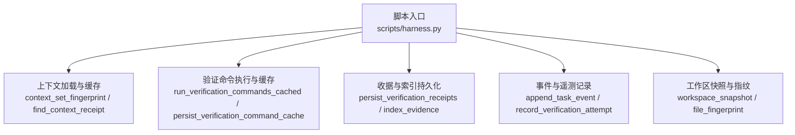
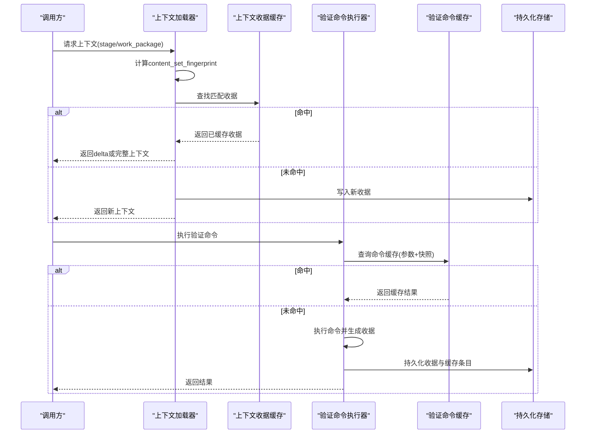
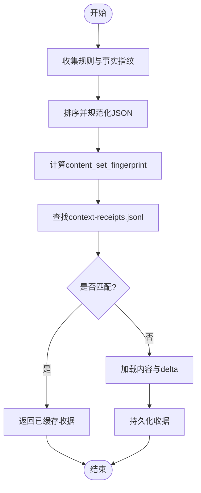
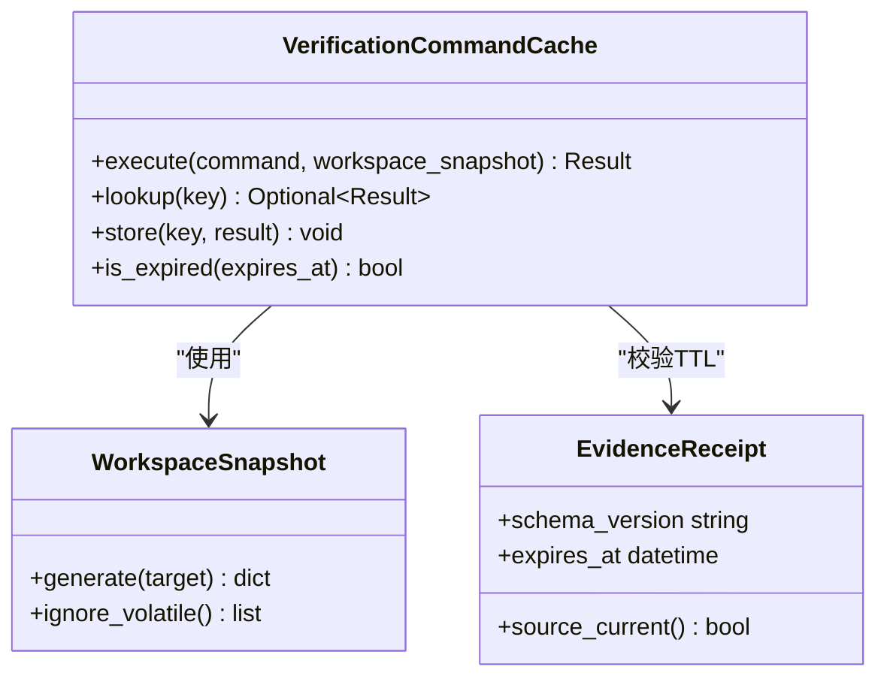
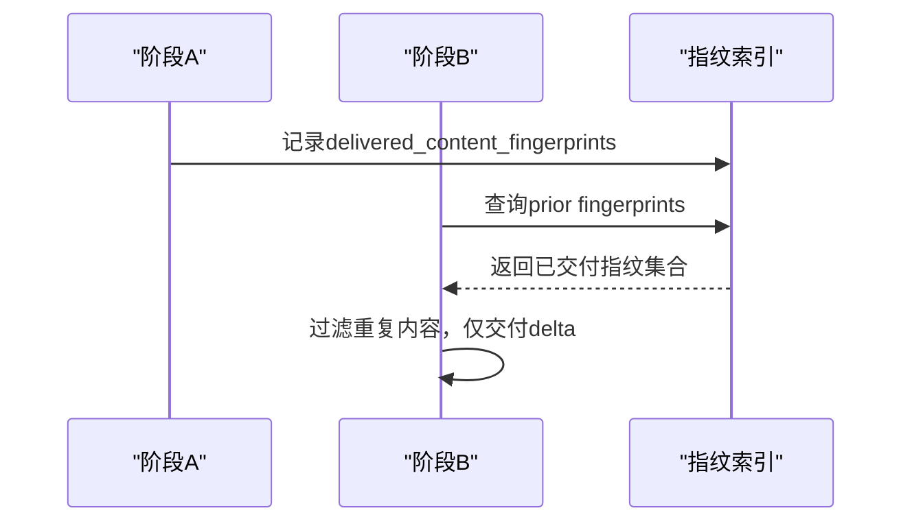
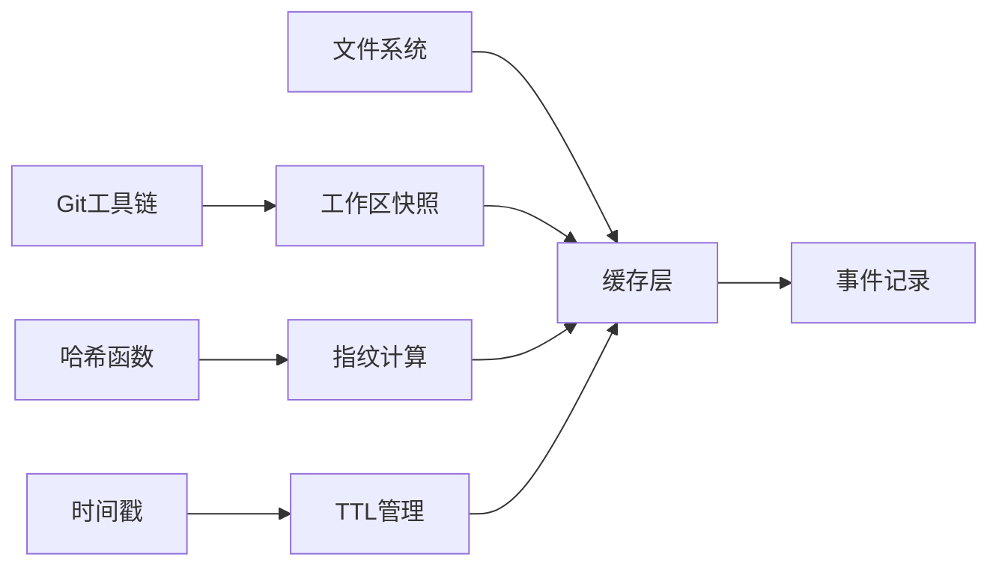

# 缓存机制

<cite>
**本文引用的文件**   
- [harness.py](file://scripts/harness.py)
- [test_harness.py](file://tests/test_harness.py)
</cite>

## 目录
1. [简介](#简介)
2. [项目结构](#项目结构)
3. [核心组件](#核心组件)
4. [架构总览](#架构总览)
5. [详细组件分析](#详细组件分析)
6. [依赖关系分析](#依赖关系分析)
7. [性能考量](#性能考量)
8. [故障排查指南](#故障排查指南)
9. [结论](#结论)
10. [附录](#附录)

## 简介
本文件系统化阐述 Docs Harness 的缓存机制，重点覆盖：
- 内容寻址缓存（Context Content Addressing Cache）的实现原理与指纹计算
- 验证命令收据缓存策略（逐项快照、输入指纹绑定、TTL 管理）
- 上下文正文复用机制（跨阶段交付与 stage/工作包收据分离）
- 缓存失效条件（工作区输入变化、编译器契约变化、package revision 兼容处理）
- 缓存命中优化案例（scope 绑定优化、Gate 编译优化、验证命令执行优化）
- 缓存监控指标与性能基准测试方法

## 项目结构
Docs Harness 的核心逻辑集中在单一脚本中，包含任务编排、状态管理、证据索引、上下文加载、验证执行与缓存等模块。与缓存相关的关键实现均位于该脚本内，包括：
- 上下文收据与指纹计算
- 验证命令缓存与收据持久化
- 事件遥测与指标统计
- 工作区快照与变更归因

**图表来源** 
- [harness.py:4029-4087](file://scripts/harness.py#L4029-L4087)
- [harness.py:6282-6700](file://scripts/harness.py#L6282-L6700)
- [harness.py:1112-1135](file://scripts/harness.py#L1112-L1135)

**章节来源**
- [harness.py:1-1200](file://scripts/harness.py#L1-L1200)
- [harness.py:4000-4500](file://scripts/harness.py#L4000-L4500)
- [harness.py:6200-6700](file://scripts/harness.py#L6200-L6700)

## 核心组件
- 内容指纹与集合指纹
  - 文件级指纹：对文件内容进行 SHA-256 摘要，统一前缀标识
  - 上下文集合指纹：将规则与项目事实的指纹排序后规范化 JSON 再求哈希，作为阶段/工作包的“内容集指纹”
- 上下文收据（Context Receipt）
  - 按 task_id、target_identity、compiler_contract、stage/work_package 维度匹配
  - 通过 content_set_fingerprint 精确命中，避免重复加载相同内容
- 验证命令收据缓存（Verification Command Receipt Cache）
  - 以命令参数与工作区快照为键，存储执行结果与输出摘要
  - 支持 TTL 过期与输入指纹绑定，确保一致性
- 事件与遥测
  - 记录 context_cache_hit、command_cache_hit_count 等关键指标
  - 提供 full/delta 负载计数，便于评估增量效果

**章节来源**
- [harness.py:4029-4087](file://scripts/harness.py#L4029-L4087)
- [harness.py:1112-1135](file://scripts/harness.py#L1112-L1135)
- [harness.py:6282-6700](file://scripts/harness.py#L6282-L6700)

## 架构总览
下图展示上下文与验证命令缓存的整体交互流程，包括指纹计算、收据查找、命中/未命中分支与持久化路径。

**图表来源** 
- [harness.py:4130-4276](file://scripts/harness.py#L4130-L4276)
- [harness.py:6282-6700](file://scripts/harness.py#L6282-L6700)

## 详细组件分析

### 内容寻址缓存（Context Content Addressing Cache）
- 指纹计算
  - 文件级指纹：对每个文件内容做 SHA-256 摘要，大文件采用 size:mtime_ns 快速指纹
  - 上下文集合指纹：收集 rule_ids 与 project_fact_refs 对应的指纹，排序后规范化 JSON 再求哈希
- 收据匹配
  - 匹配键：task_id、target_identity、compiler_contract、stage/work_package、content_set_fingerprint
  - 命中则跳过重复加载，仅返回差异内容（delta）
- 跨阶段复用
  - prior_context_content_fingerprints 汇总历史交付指纹，避免跨 stage 重复交付相同内容

**图表来源** 
- [harness.py:4029-4087](file://scripts/harness.py#L4029-L4087)
- [harness.py:4090-4110](file://scripts/harness.py#L4090-L4110)

**章节来源**
- [harness.py:4029-4087](file://scripts/harness.py#L4029-L4087)
- [harness.py:4090-4110](file://scripts/harness.py#L4090-L4110)
- [harness.py:4130-4276](file://scripts/harness.py#L4130-L4276)

### 验证命令收据缓存策略
- 逐项快照
  - 每次执行前对工作区生成快照指纹，作为缓存键的一部分
  - 快照忽略 volatile 路径（如 __pycache__、测试缓存等），减少噪声
- 输入指纹绑定
  - 命令参数、工作区快照、package fingerprint、target identity 共同构成唯一键
  - 若 package 或 target 变化，强制失效
- TTL 管理
  - 收据可设置 expires_at；过期即视为无效
  - 结合 evidence_source_current 判断证据源是否仍有效
- 持久化
  - 命令结果与缓存条目分别持久化到 receipts 与 cache 文件
  - 支持开关 verification.command_cache_enabled 控制整体启用

**图表来源** 
- [harness.py:1178-1200](file://scripts/harness.py#L1178-L1200)
- [harness.py:6282-6700](file://scripts/harness.py#L6282-L6700)

**章节来源**
- [harness.py:1178-1200](file://scripts/harness.py#L1178-L1200)
- [harness.py:6282-6700](file://scripts/harness.py#L6282-L6700)

### 上下文正文复用机制
- 跨阶段内容交付
  - prior_context_content_fingerprints 汇总历史交付指纹，当前阶段仅交付未出现过的内容
  - 通过 context_delta 标记是否为增量加载
- stage 与工作包收据分离
  - work_package 使用独立 stage="work_package" 的收据空间，避免与 plan/action 混淆
  - 收据字段包含 work_package_id，确保隔离

**图表来源** 
- [harness.py:4090-4110](file://scripts/harness.py#L4090-L4110)
- [harness.py:4130-4276](file://scripts/harness.py#L4130-L4276)

**章节来源**
- [harness.py:4090-4110](file://scripts/harness.py#L4090-L4110)
- [harness.py:4130-4276](file://scripts/harness.py#L4130-L4276)

### 缓存失效条件
- 工作区输入变化
  - workspace_snapshot 指纹变化导致验证命令缓存失效
  - Git 预检查与后检查确保受控引用未漂移
- 编译器契约变化
  - compiler_contract 不匹配时，上下文收据失效
  - package_revision 递增触发重新编译与准入
- package revision 兼容处理
  - 历史收据保留但不再被新 revision 使用
  - 通过 package_fingerprint 与 target_identity 双重绑定确保一致性

**章节来源**
- [harness.py:1112-1135](file://scripts/harness.py#L1112-L1135)
- [harness.py:4029-4087](file://scripts/harness.py#L4029-L4087)
- [harness.py:6282-6700](file://scripts/harness.py#L6282-L6700)

### 缓存命中优化案例
- scope 绑定优化
  - 基于 allowed_scope/write_scope/read_scope 精准匹配，减少无关内容加载
  - 通过 recompile_package_from_plan_scope 动态调整范围，提升命中率
- Gate 编译优化
  - 新增风险 Gate 时尝试增量重编译，避免全量重新准入
  - auto-attribution 自动归因未声明写入，消解漂移
- 验证命令执行优化
  - 命令参数+快照指纹命中直接返回结果
  - 统计 command_cache_hit_count 与 command_executed_count 评估收益

**章节来源**
- [harness.py:4367-4408](file://scripts/harness.py#L4367-L4408)
- [harness.py:6282-6700](file://scripts/harness.py#L6282-L6700)

## 依赖关系分析
缓存机制依赖以下核心能力：
- 文件系统操作：原子写入、JSONL 追加读取
- Git 集成：工作树快照、引用校验、远端一致性检查
- 哈希算法：SHA-256 用于指纹计算
- 时间戳：UTC 时间用于 TTL 与审计

**图表来源** 
- [harness.py:419-434](file://scripts/harness.py#L419-L434)
- [harness.py:507-529](file://scripts/harness.py#L507-L529)
- [harness.py:1112-1135](file://scripts/harness.py#L1112-L1135)

**章节来源**
- [harness.py:419-434](file://scripts/harness.py#L419-L434)
- [harness.py:507-529](file://scripts/harness.py#L507-L529)
- [harness.py:1112-1135](file://scripts/harness.py#L1112-L1135)

## 性能考量
- 指纹计算开销
  - 小文件直接哈希，大文件使用 size:mtime_ns 快速指纹
  - 上下文集合指纹排序与规范化 JSON 带来固定开销
- I/O 优化
  - 原子写入避免部分写入导致的损坏
  - JSONL 追加模式适合高并发写入
- 缓存命中率
  - 通过 context_cache_hit 与 command_cache_hit_count 监控
  - delta 加载显著减少网络与解析开销

[本节为通用指导，无需特定文件来源]

## 故障排查指南
- 常见问题
  - 上下文收据未命中：检查 compiler_contract、target_identity、stage/work_package 是否一致
  - 验证命令缓存未生效：确认 verification.command_cache_enabled 开关与快照指纹
  - TTL 过期：检查 expires_at 时间戳与系统时钟同步
- 调试步骤
  - 查看 events.jsonl 中的 context_cache_hit 与 command_cache_hit_count
  - 检查 context-receipts.jsonl 与验证收据文件
  - 对比 workspace_snapshot 指纹变化定位输入漂移

**章节来源**
- [harness.py:1031-1070](file://scripts/harness.py#L1031-L1070)
- [harness.py:6230-6240](file://scripts/harness.py#L6230-L6240)
- [harness.py:6282-6700](file://scripts/harness.py#L6282-L6700)

## 结论
Docs Harness 的缓存机制通过内容寻址与收据驱动的设计，实现了高效的上下文复用与验证命令缓存。其核心优势在于：
- 精确的指纹计算与匹配，避免重复工作
- 灵活的 TTL 与绑定策略，确保一致性与时效性
- 丰富的遥测指标，便于性能监控与优化

建议在生产环境中持续监控 context_cache_hit 与 command_cache_hit_count，结合 delta 加载比例评估缓存有效性。

[本节为总结性内容，无需特定文件来源]

## 附录
- 关键常量与模式
  - RECEIPT_SCHEMA、VERIFICATION_RECEIPT_SCHEMA 等版本标识
  - VOLATILE_VERIFICATION_* 忽略模式集合
- 测试用例参考
  - tests/test_harness.py 中包含上下文缓存命中与验证命令缓存的断言

**章节来源**
- [harness.py:33-48](file://scripts/harness.py#L33-L48)
- [harness.py:1142-1147](file://scripts/harness.py#L1142-L1147)
- [test_harness.py:962-963](file://tests/test_harness.py#L962-L963)
- [test_harness.py:3331-3347](file://tests/test_harness.py#L3331-L3347)