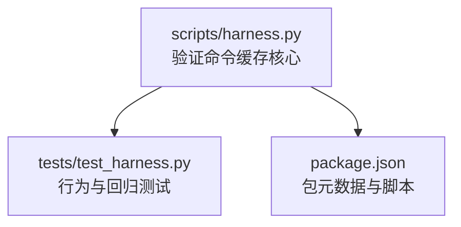
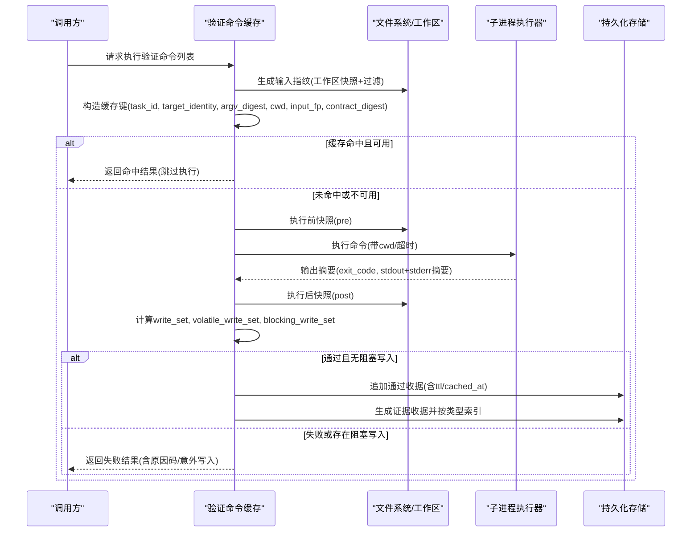
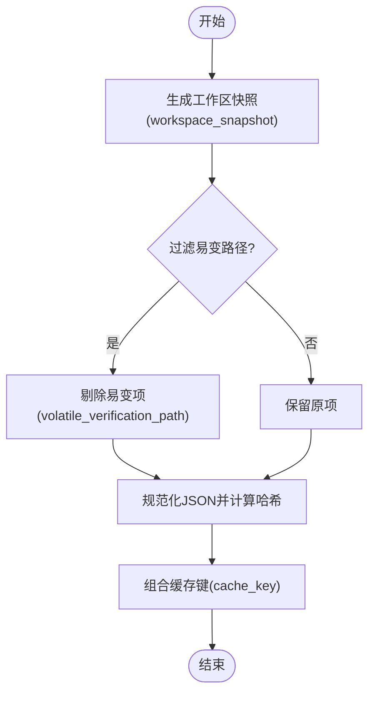
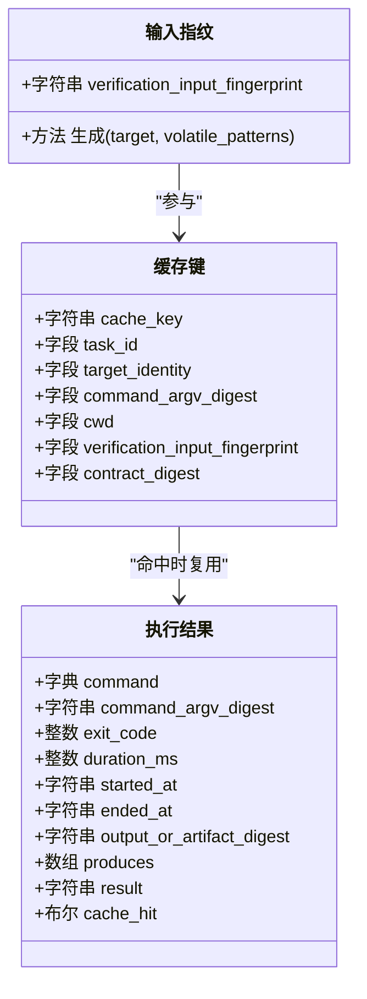
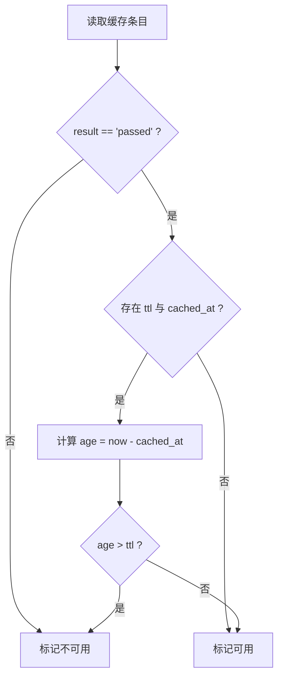
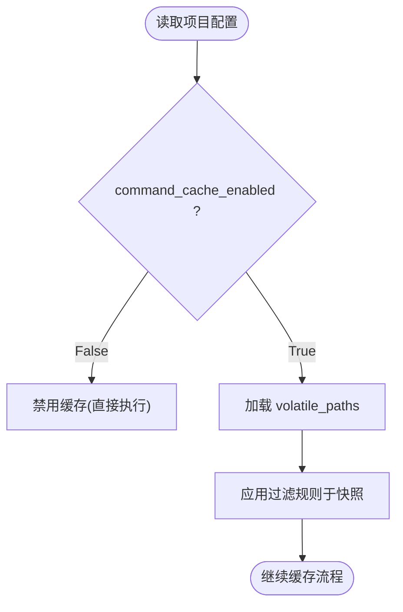
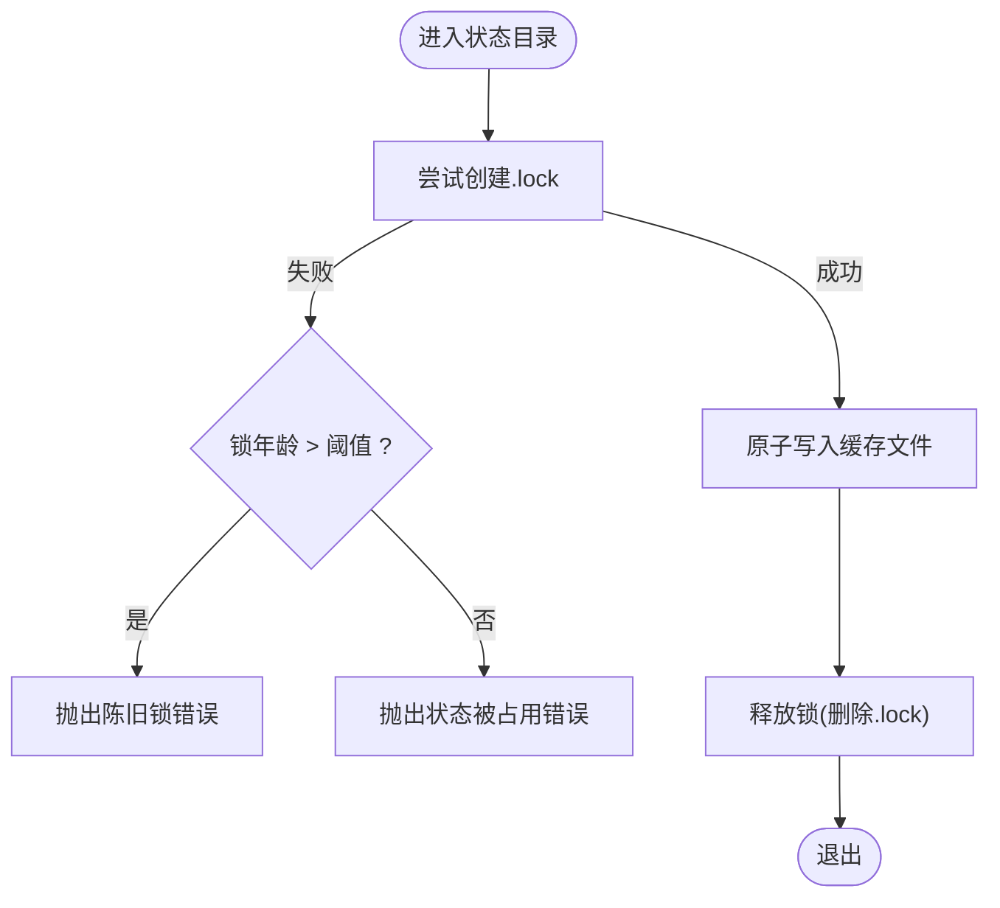
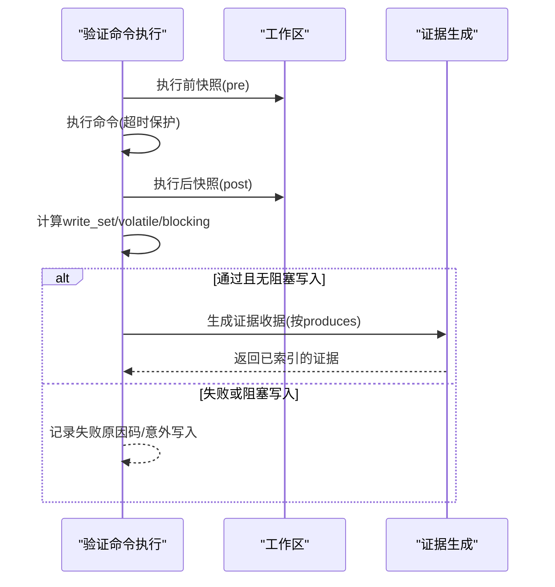
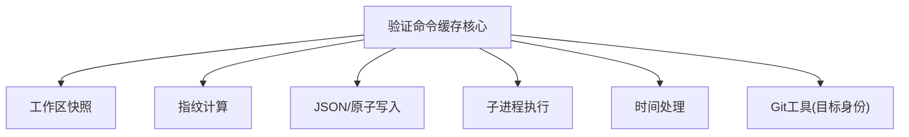

# 验证命令收据缓存

<cite>
**本文引用的文件**   
- [scripts/harness.py](file://scripts/harness.py)
- [tests/test_harness.py](file://tests/test_harness.py)
- [package.json](file://package.json)
</cite>

## 目录
1. [简介](#简介)
2. [项目结构](#项目结构)
3. [核心组件](#核心组件)
4. [架构总览](#架构总览)
5. [详细组件分析](#详细组件分析)
6. [依赖关系分析](#依赖关系分析)
7. [性能考量](#性能考量)
8. [故障排查指南](#故障排查指南)
9. [结论](#结论)
10. [附录](#附录)

## 简介
本文件面向 Docs Harness 的“验证命令收据缓存系统”，系统性阐述其逐项快照机制、输入指纹绑定、TTL 管理策略、配置与优化参数，以及缓存一致性与并发访问控制。该子系统在任务执行过程中对声明的验证命令进行逐条执行与结果缓存，确保相同输入与契约下可复用已通过的结果，从而提升整体验证效率并降低重复开销。

## 项目结构
- 核心实现位于 scripts/harness.py，包含工作区快照、验证命令缓存键生成、缓存读取/写入、持久化与证据生成等关键逻辑。
- tests/test_harness.py 提供端到端用例，覆盖缓存命中、未命中、超时、写集合校验等行为。
- package.json 定义包元数据与脚本入口，便于运行测试与自检。

**图表来源** 
- [scripts/harness.py:5900-6200](file://scripts/harness.py#L5900-L6200)
- [tests/test_harness.py:1-120](file://tests/test_harness.py#L1-L120)
- [package.json:1-23](file://package.json#L1-L23)

**章节来源**
- [scripts/harness.py:5900-6200](file://scripts/harness.py#L5900-L6200)
- [tests/test_harness.py:1-120](file://tests/test_harness.py#L1-L120)
- [package.json:1-23](file://package.json#L1-L23)

## 核心组件
- 输入指纹计算：基于工作区快照过滤掉易变项后生成稳定指纹，作为缓存键的一部分。
- 缓存键构造：聚合任务ID、目标身份、命令参数摘要、工作目录、输入指纹与契约摘要。
- 缓存读取与可用性判定：按 key 查找最近条目，校验结果为通过且 TTL 未过期。
- 逐项执行与快照：执行前/后分别对工作区做快照，计算变更集，区分易变写入与阻塞写入。
- 缓存持久化：将本次新产生的通过收据合并为原子写入，避免部分更新导致不一致。
- 证据产出：对通过的命令按 produces 类型生成标准化证据收据并索引。

**章节来源**
- [scripts/harness.py:5902-5911](file://scripts/harness.py#L5902-L5911)
- [scripts/harness.py:5913-5933](file://scripts/harness.py#L5913-L5933)
- [scripts/harness.py:5936-5944](file://scripts/harness.py#L5936-L5944)
- [scripts/harness.py:5947-5959](file://scripts/harness.py#L5947-L5959)
- [scripts/harness.py:5962-6071](file://scripts/harness.py#L5962-L6071)
- [scripts/harness.py:6074-6083](file://scripts/harness.py#L6074-L6083)
- [scripts/harness.py:6085-6132](file://scripts/harness.py#L6085-L6132)

## 架构总览
下图展示验证命令缓存的关键流程：从输入指纹到缓存键生成、命中判断、执行与快照、结果分类与缓存持久化、证据生成。

**图表来源** 
- [scripts/harness.py:5902-5911](file://scripts/harness.py#L5902-L5911)
- [scripts/harness.py:5913-5933](file://scripts/harness.py#L5913-L5933)
- [scripts/harness.py:5962-6071](file://scripts/harness.py#L5962-L6071)
- [scripts/harness.py:6074-6083](file://scripts/harness.py#L6074-L6083)
- [scripts/harness.py:6085-6132](file://scripts/harness.py#L6085-L6132)

## 详细组件分析

### 输入指纹绑定机制（依赖追踪、版本锁定、变更检测）
- 依赖追踪：以工作区快照为基础，排除运行时与易变路径，仅保留稳定内容参与指纹计算。
- 版本锁定：指纹由 JSON 规范化后的哈希构成，保证跨平台与顺序无关性；同时记录 target_identity 与 command_argv_digest，确保环境与命令参数一致性。
- 变更检测：对比 pre/post 快照得到 write_set，进一步区分 volatile_write_set 与 blocking_write_set，防止非预期写入污染证据。

**图表来源** 
- [scripts/harness.py:5902-5911](file://scripts/harness.py#L5902-L5911)
- [scripts/harness.py:5913-5933](file://scripts/harness.py#L5913-L5933)

**章节来源**
- [scripts/harness.py:5902-5911](file://scripts/harness.py#L5902-L5911)
- [scripts/harness.py:5913-5933](file://scripts/harness.py#L5913-L5933)

### 逐项快照机制（环境、输入、输出）
- 环境快照：target_identity 由 Git 远端信息或本地路径决定，确保不同仓库/路径隔离。
- 输入快照：verification_input_fingerprint 基于过滤后的工作区快照，屏蔽构建产物与临时文件。
- 输出快照：stdout+stderr 拼接后计算摘要，作为 output_or_artifact_digest；同时记录 exit_code、started_at/ended_at、duration_ms。

**图表来源** 
- [scripts/harness.py:5902-5911](file://scripts/harness.py#L5902-L5911)
- [scripts/harness.py:5913-5933](file://scripts/harness.py#L5913-L5933)
- [scripts/harness.py:5962-6071](file://scripts/harness.py#L5962-L6071)

**章节来源**
- [scripts/harness.py:5902-5911](file://scripts/harness.py#L5902-L5911)
- [scripts/harness.py:5913-5933](file://scripts/harness.py#L5913-L5933)
- [scripts/harness.py:5962-6071](file://scripts/harness.py#L5962-L6071)

### TTL（生存时间）管理策略
- 动态过期时间：每条通过收据携带 ttl 秒数与 cached_at 时间戳，可用性判定会计算当前时间与 cached_at 的差值，超过 ttl 即失效。
- 条件失效：若解析时间失败或结果不为 passed，则视为不可用。
- 手动清理：可通过外部工具删除 artifacts/verification/command-receipts.jsonl 中的对应条目或整表重建。

**图表来源** 
- [scripts/harness.py:5947-5959](file://scripts/harness.py#L5947-L5959)

**章节来源**
- [scripts/harness.py:5947-5959](file://scripts/harness.py#L5947-L5959)

### 验证命令缓存的配置选项与优化参数
- 全局开关：verification.command_cache_enabled 控制是否启用缓存（默认开启）。
- 易变路径过滤：verification.volatile_paths 支持指定 glob 模式，用于过滤构建产物与临时文件，减少指纹抖动。
- 自动归因：verification.auto_attribute_in_scope 控制是否在范围内未归因写入时由控制器自动归因（与验证命令相关场景配合使用）。

**图表来源** 
- [scripts/harness.py:1191-1202](file://scripts/harness.py#L1191-L1202)
- [scripts/harness.py:1181-1188](file://scripts/harness.py#L1181-L1188)
- [scripts/harness.py:1205-1216](file://scripts/harness.py#L1205-L1216)

**章节来源**
- [scripts/harness.py:1191-1202](file://scripts/harness.py#L1191-L1202)
- [scripts/harness.py:1181-1188](file://scripts/harness.py#L1181-L1188)
- [scripts/harness.py:1205-1216](file://scripts/harness.py#L1205-L1216)

### 缓存一致性保证与并发访问控制
- 一致性：缓存条目按 cache_key 覆盖写入，持久化时将内存索引序列化到单一文件，避免增量追加导致的歧义。
- 并发锁：状态目录使用 .lock 文件实现互斥，检测到陈旧锁（超过阈值）需人工确认清理，否则拒绝并发更新。
- 原子写入：所有持久化操作采用原子替换，确保读侧不会看到半写状态。

**图表来源** 
- [scripts/harness.py:1011-1032](file://scripts/harness.py#L1011-L1032)
- [scripts/harness.py:6074-6083](file://scripts/harness.py#L6074-L6083)

**章节来源**
- [scripts/harness.py:1011-1032](file://scripts/harness.py#L1011-L1032)
- [scripts/harness.py:6074-6083](file://scripts/harness.py#L6074-L6083)

### 执行流程与证据产出
- 执行前快照：pre 快照记录命令执行前的工作区状态。
- 执行与输出摘要：捕获 stdout+stderr 摘要，记录耗时与时间戳。
- 执行后快照：post 快照与 pre 比较得到 write_set，区分易变写入与阻塞写入。
- 证据生成：对通过的命令按 produces 类型生成证据收据，并索引至证据索引。

**图表来源** 
- [scripts/harness.py:5962-6071](file://scripts/harness.py#L5962-L6071)
- [scripts/harness.py:6085-6132](file://scripts/harness.py#L6085-L6132)

**章节来源**
- [scripts/harness.py:5962-6071](file://scripts/harness.py#L5962-L6071)
- [scripts/harness.py:6085-6132](file://scripts/harness.py#L6085-L6132)

## 依赖关系分析
- 模块内依赖：验证命令缓存依赖工作区快照、指纹计算、JSON 读写、原子写入、时间处理与子进程执行。
- 外部依赖：Git 命令用于目标身份识别与引用检查；文件系统用于快照与持久化。
- 耦合度：各功能函数职责清晰，低耦合高内聚；缓存键与指纹计算解耦执行与持久化。

**图表来源** 
- [scripts/harness.py:5902-5911](file://scripts/harness.py#L5902-L5911)
- [scripts/harness.py:5913-5933](file://scripts/harness.py#L5913-L5933)
- [scripts/harness.py:5962-6071](file://scripts/harness.py#L5962-L6071)
- [scripts/harness.py:6074-6083](file://scripts/harness.py#L6074-L6083)

**章节来源**
- [scripts/harness.py:5902-5911](file://scripts/harness.py#L5902-L5911)
- [scripts/harness.py:5913-5933](file://scripts/harness.py#L5913-L5933)
- [scripts/harness.py:5962-6071](file://scripts/harness.py#L5962-L6071)
- [scripts/harness.py:6074-6083](file://scripts/harness.py#L6074-L6083)

## 性能考量
- 缓存命中率：合理配置 volatile_paths 可减少指纹抖动，提高命中率。
- 执行超时：设置合理的子进程超时，避免长时间阻塞。
- 快照粒度：工作区快照按文件大小与修改时间优化大文件指纹，避免全量哈希。
- 持久化频率：仅在通过结果时追加缓存条目，减少 I/O 压力。

[本节为通用指导，不直接分析具体文件]

## 故障排查指南
- 常见错误码：
  - verification_command_workspace_write：命令产生非预期的阻塞写入。
  - stale_lock：检测到陈旧锁，需人工清理。
  - state_locked：同一任务正在被另一个进程更新。
- 诊断步骤：
  - 检查 artifacts/verification/command-receipts.jsonl 是否存在与 cache_key 匹配的条目。
  - 确认 TTL 与 cached_at 是否有效。
  - 查看 volatile_write_set 与 blocking_write_set 以确定写入类别。
  - 检查 .lock 文件是否存在且年龄是否超过阈值。

**章节来源**
- [scripts/harness.py:5947-5959](file://scripts/harness.py#L5947-L5959)
- [scripts/harness.py:1011-1032](file://scripts/harness.py#L1011-L1032)
- [scripts/harness.py:6074-6083](file://scripts/harness.py#L6074-L6083)

## 结论
Docs Harness 的验证命令收据缓存系统通过稳定的输入指纹、严格的快照与变更检测、灵活的 TTL 管理与原子持久化，实现了高效、安全、可复用的验证结果缓存。结合配置化的易变路径过滤与并发锁机制，系统在复杂工程环境中仍能保持高一致性与高性能。

[本节为总结，不直接分析具体文件]

## 附录
- 端到端测试覆盖：
  - 首次执行未命中，第二次执行命中。
  - 超时与失败路径的行为验证。
  - 写集合校验与易变写入区分。

**章节来源**
- [tests/test_harness.py:3331-3345](file://tests/test_harness.py#L3331-L3345)
- [tests/test_harness.py:3491-3500](file://tests/test_harness.py#L3491-L3500)