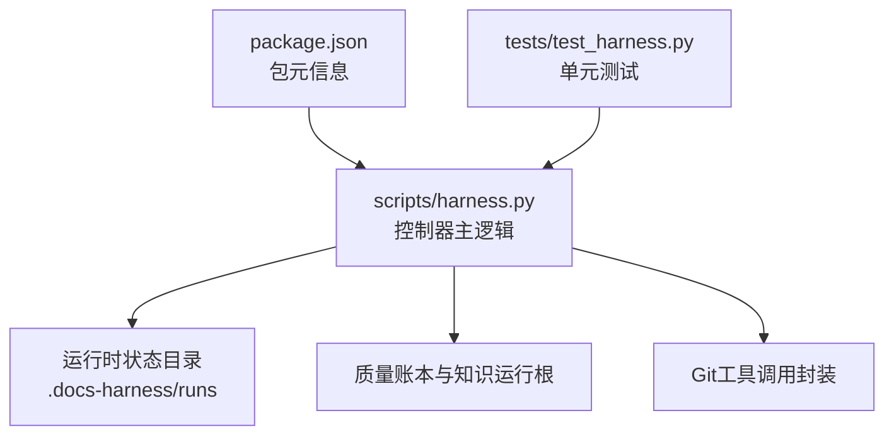
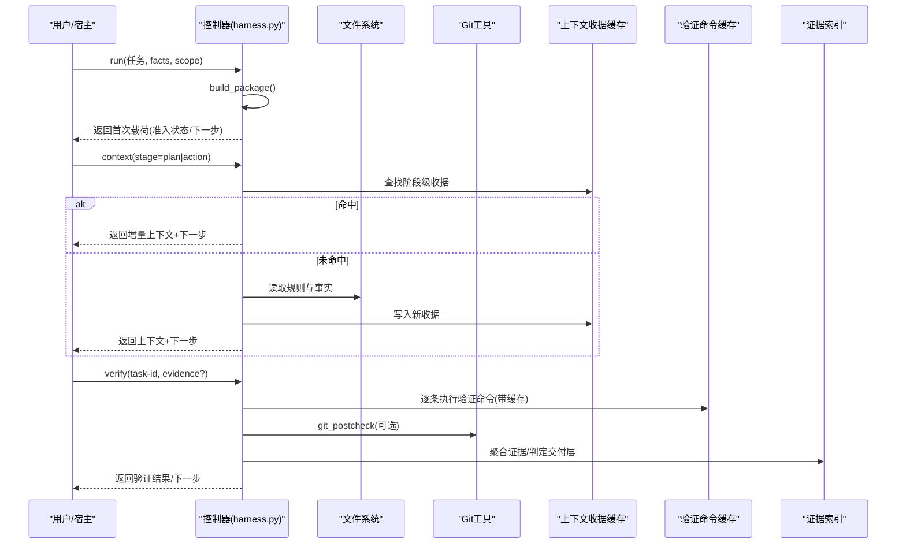
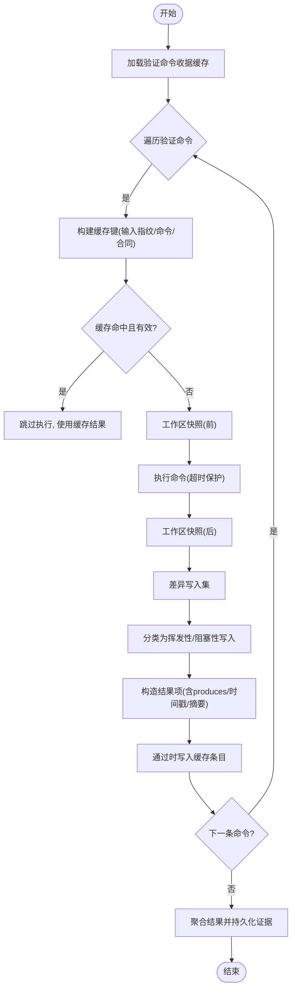
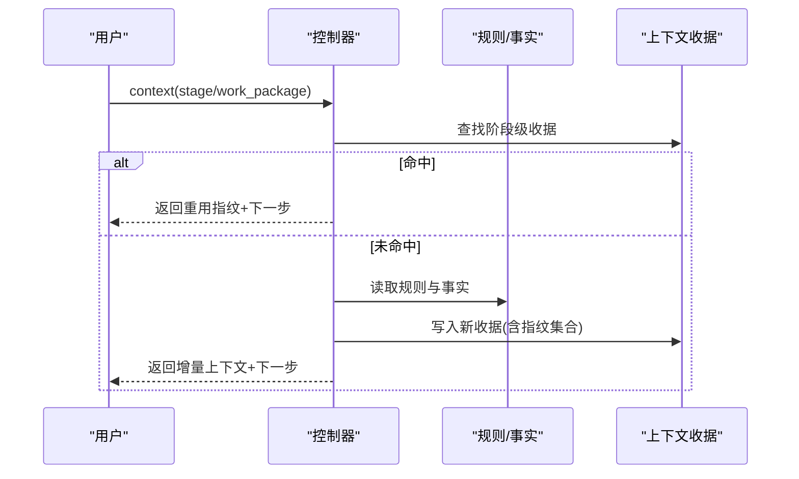
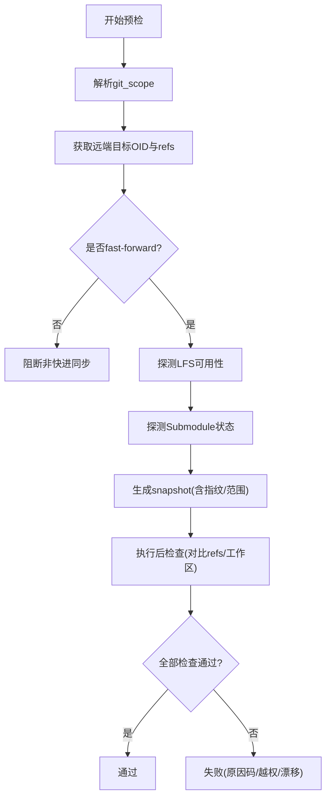
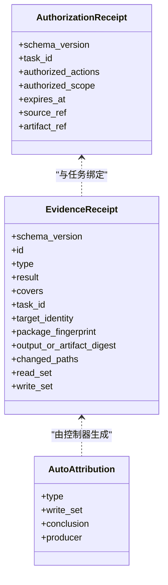
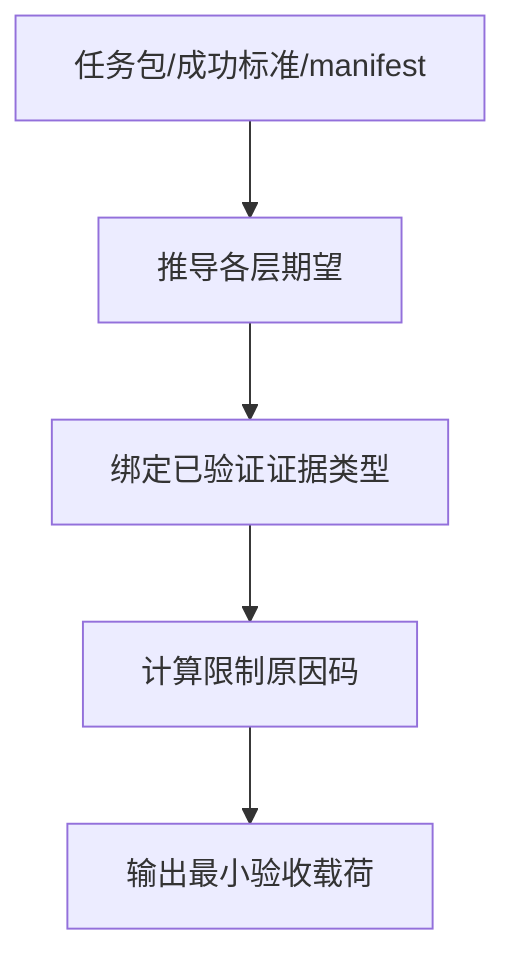
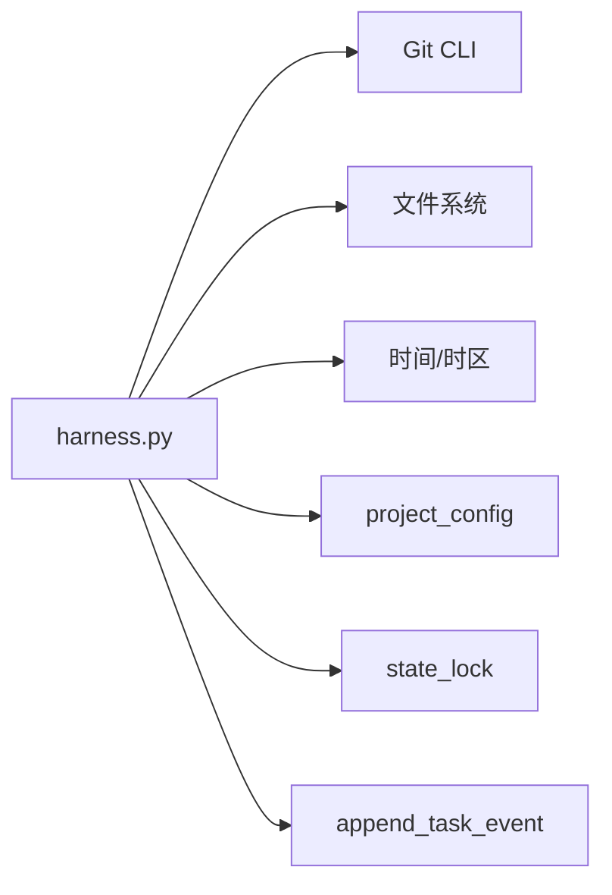

# I/O批处理

<cite>
**本文引用的文件**   
- [harness.py](file://scripts/harness.py)
- [test_harness.py](file://tests/test_harness.py)
- [package.json](file://package.json)
</cite>

## 目录
1. [简介](#简介)
2. [项目结构](#项目结构)
3. [核心组件](#核心组件)
4. [架构总览](#架构总览)
5. [详细组件分析](#详细组件分析)
6. [依赖关系分析](#依赖关系分析)
7. [性能考虑](#性能考虑)
8. [故障排查指南](#故障排查指南)
9. [结论](#结论)
10. [附录](#附录)

## 简介
本文件面向Docs Harness的I/O批处理机制，围绕以下目标展开：
- 批量验证命令执行策略：命令分组、并行控制与结果聚合
- 增量上下文加载：变更检测、差异计算与选择性更新
- I/O操作优化：缓冲策略、异步处理与错误重试
- 批处理调度器设计：任务队列、优先级管理与资源分配
- 批处理配置选项与性能调优建议

该机制以“意图优先、证据可复用、失败关闭”为核心原则，通过受管工件、收据缓存、快照对比与门禁Gate体系，确保在复杂工作区环境下稳定、可审计地执行I/O与验证。

## 项目结构
仓库包含控制器脚本、测试套件与元数据描述：
- scripts/harness.py：主控制器，实现任务编排、上下文加载、验证命令执行、Git前后检查、证据索引与交付层判定等
- tests/test_harness.py：覆盖关键路径与边界场景的单元测试
- package.json：包元信息与脚本入口（self-test、pack:check）

**图表来源**
- [package.json:1-23](file://package.json#L1-L23)
- [harness.py:909-916](file://scripts/harness.py#L909-L916)
- [harness.py:575-586](file://scripts/harness.py#L575-L586)

**章节来源**
- [package.json:1-23](file://package.json#L1-L23)
- [harness.py:909-916](file://scripts/harness.py#L909-L916)

## 核心组件
- 验证命令执行与缓存：逐条执行、输入指纹、工作区快照、挥发性写入过滤、收据缓存与持久化
- 上下文加载与增量：规则与事实引用指纹、阶段级收据、跨阶段去重、delta标记
- Git前后检查：预检契约、远端漂移检测、受控ref范围校验、LFS/Submodule可用性
- 证据与授权：证据摄取、自动归因、授权继承与过期校验
- 交付层判定：按意图与成功标准推导各层期望与已验证证据集合

**章节来源**
- [harness.py:5962-6071](file://scripts/harness.py#L5962-L6071)
- [harness.py:4297-4443](file://scripts/harness.py#L4297-L4443)
- [harness.py:796-878](file://scripts/harness.py#L796-L878)
- [harness.py:6229-6346](file://scripts/harness.py#L6229-L6346)
- [harness.py:6144-6179](file://scripts/harness.py#L6144-L6179)

## 架构总览
下图展示从run到verify的关键流程，以及上下文加载、验证命令执行、Git后检查与证据聚合的关系。

**图表来源**
- [harness.py:4707-4800](file://scripts/harness.py#L4707-L4800)
- [harness.py:4297-4443](file://scripts/harness.py#L4297-L4443)
- [harness.py:5962-6071](file://scripts/harness.py#L5962-L6071)
- [harness.py:6449-6466](file://scripts/harness.py#L6449-L6466)
- [harness.py:796-878](file://scripts/harness.py#L796-L878)

## 详细组件分析

### 验证命令批处理与结果聚合
- 命令分组与执行：按verification_commands逐项执行；每项生成argv与contract指纹作为缓存键
- 缓存策略：若输入指纹、cwd、target_identity、command_argv_digest、contract_digest一致且收据可用，则跳过执行
- 工作区快照：执行前/后快照对比，区分挥发性写入与阻塞性写入；仅允许挥发性写入
- 结果聚合：通过结果列表汇总exit_code、duration_ms、输出摘要、produces类型；通过persist_verification_receipts生成证据并索引

**图表来源**
- [harness.py:5962-6071](file://scripts/harness.py#L5962-L6071)
- [harness.py:6074-6083](file://scripts/harness.py#L6074-L6083)
- [harness.py:6085-6133](file://scripts/harness.py#L6085-L6133)

**章节来源**
- [harness.py:5962-6071](file://scripts/harness.py#L5962-L6071)
- [harness.py:6074-6083](file://scripts/harness.py#L6074-L6083)
- [harness.py:6085-6133](file://scripts/harness.py#L6085-L6133)

### 增量上下文加载机制
- 变更检测：基于规则与事实引用的指纹集合content_set_fingerprint进行阶段级匹配
- 差异计算：prior_context_content_fingerprints获取历史指纹集合，比较得到delivered/reused指纹
- 选择性更新：仅在未命中阶段级收据时加载缺失内容，记录context_delta标志与事件计数

**图表来源**
- [harness.py:4297-4443](file://scripts/harness.py#L4297-L4443)
- [harness.py:4213-4254](file://scripts/harness.py#L4213-L4254)
- [harness.py:4257-4277](file://scripts/harness.py#L4257-L4277)

**章节来源**
- [harness.py:4297-4443](file://scripts/harness.py#L4297-L4443)
- [harness.py:4213-4254](file://scripts/harness.py#L4213-L4254)
- [harness.py:4257-4277](file://scripts/harness.py#L4257-L4277)

### Git前后检查与范围约束
- 预检契约：git_preflight_contract生成snapshot，包含remote、refs、index_tree、worktree_fingerprint、fast_forward、lfs/submodule状态
- 后检查：git_postcheck对比当前refs与工作区指纹，判断是否越权修改受控ref或远端漂移
- 范围约束：git_scope_target解析受控远端分支，git_sync需严格绑定单一分支

**图表来源**
- [harness.py:680-794](file://scripts/harness.py#L680-L794)
- [harness.py:796-878](file://scripts/harness.py#L796-L878)
- [harness.py:664-678](file://scripts/harness.py#L664-L678)

**章节来源**
- [harness.py:680-794](file://scripts/harness.py#L680-L794)
- [harness.py:796-878](file://scripts/harness.py#L796-L878)
- [harness.py:664-678](file://scripts/harness.py#L664-L678)

### 证据与授权管理
- 证据摄取：load_evidence规范化证据，store_managed_artifact归档受管副本，index_evidence建立索引
- 自动归因：write_scope内未归因写入可由控制器自动生成workspace_attribution证据
- 授权继承：authorization_adoption_record在合同不变时生成可审计的授权继承记录

**图表来源**
- [harness.py:6085-6133](file://scripts/harness.py#L6085-L6133)
- [harness.py:6192-6226](file://scripts/harness.py#L6192-L6226)
- [harness.py:6621-6655](file://scripts/harness.py#L6621-L6655)

**章节来源**
- [harness.py:6085-6133](file://scripts/harness.py#L6085-L6133)
- [harness.py:6192-6226](file://scripts/harness.py#L6192-L6226)
- [harness.py:6621-6655](file://scripts/harness.py#L6621-L6655)

### 交付层判定与最小验收
- 层推导：根据任务意图、成功标准与manifest要求推导source/local_verification/git_head/remote_delivery/fresh_clone/release_artifact/ui/external_state各层期望
- 最小验收：minimum_delivery_receipt汇总已验证层、限制原因码与背景作业状态

**图表来源**
- [harness.py:6229-6346](file://scripts/harness.py#L6229-L6346)

**章节来源**
- [harness.py:6229-6346](file://scripts/harness.py#L6229-L6346)

## 依赖关系分析
- 外部依赖：Git CLI（subprocess封装）、文件系统（原子写入/JSONL追加）、时间与时区
- 内部依赖：状态锁state_lock保证并发安全；append_task_event统一遥测；project_config提供验证开关

**图表来源**
- [harness.py:575-586](file://scripts/harness.py#L575-L586)
- [harness.py:1011-1032](file://scripts/harness.py#L1011-L1032)
- [harness.py:1034-1073](file://scripts/harness.py#L1034-L1073)
- [harness.py:1282-1287](file://scripts/harness.py#L1282-L1287)

**章节来源**
- [harness.py:575-586](file://scripts/harness.py#L575-L586)
- [harness.py:1011-1032](file://scripts/harness.py#L1011-L1032)
- [harness.py:1034-1073](file://scripts/harness.py#L1034-L1073)
- [harness.py:1282-1287](file://scripts/harness.py#L1282-L1287)

## 性能考虑
- 验证命令缓存：默认开启，可通过verification.command_cache_enabled整体关闭；命中时零执行开销
- 工作区快照优化：Git工作区优先ls-files枚举，非Git回退至rglob并限制文件数量上限
- 挥发性写入过滤：内置目录/后缀/文件名白名单，支持项目配置扩展volatile_paths
- 上下文增量：阶段级收据避免重复加载；prior指纹集合减少不必要传输
- 事件与遥测：bounded事件计数，避免无限增长；duration_ms统计便于瓶颈定位

[本节为通用指导，不直接分析具体文件]

## 故障排查指南
- 常见错误码与原因：
  - verification_command_workspace_write：验证命令产生阻塞性写入
  - git_remote_drift / git_ref_scope_violation：远端漂移或越权修改受控ref
  - authorization_expired / authorization_mismatch：授权过期或未覆盖范围
  - plan_contract_drift / rule_drift：方案或规则指纹变化导致重新准入
- 调试步骤：
  - 查看events.jsonl中的verification_attempt与context事件
  - 检查context-receipts.jsonl与verification command receipts
  - 确认git_postcheck结果与reason_code
  - 使用--json输出定位next_action与blockers

**章节来源**
- [harness.py:6349-6394](file://scripts/harness.py#L6349-L6394)
- [harness.py:6410-6447](file://scripts/harness.py#L6410-L6447)
- [harness.py:796-878](file://scripts/harness.py#L796-L878)
- [harness.py:6144-6179](file://scripts/harness.py#L6144-L6179)

## 结论
Docs Harness的I/O批处理机制通过严格的契约与收据体系，实现了高可靠、可审计的验证与上下文管理。其核心优势在于：
- 命令级缓存与快照对比，显著降低重复I/O与执行成本
- 阶段级上下文增量，避免冗余加载与传输
- Git前后检查与范围约束，保障操作安全与一致性
- 证据与授权的可继承性与过期控制，提升复用效率与安全性

建议在大规模任务中启用命令缓存、合理配置volatile_paths，并结合事件遥测持续优化批处理吞吐与延迟。

[本节为总结，不直接分析具体文件]

## 附录
- 配置项参考：
  - verification.command_cache_enabled：是否启用验证命令缓存
  - verification.volatile_paths：挥发性写入模式扩展
  - verification.auto_attribute_in_scope：是否允许自动归因
- 相关测试用例：
  - 验证命令缓存与通过收据持久化
  - Git fetch/sync预检与后检查
  - 上下文增量与收据命中

**章节来源**
- [harness.py:1191-1202](file://scripts/harness.py#L1191-L1202)
- [harness.py:1153-1188](file://scripts/harness.py#L1153-L1188)
- [harness.py:1205-1216](file://scripts/harness.py#L1205-L1216)
- [test_harness.py:59-87](file://tests/test_harness.py#L59-L87)
- [test_harness.py:503-537](file://tests/test_harness.py#L503-L537)
- [test_harness.py:651-684](file://tests/test_harness.py#L651-L684)