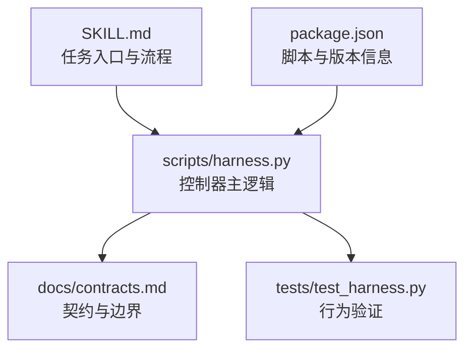
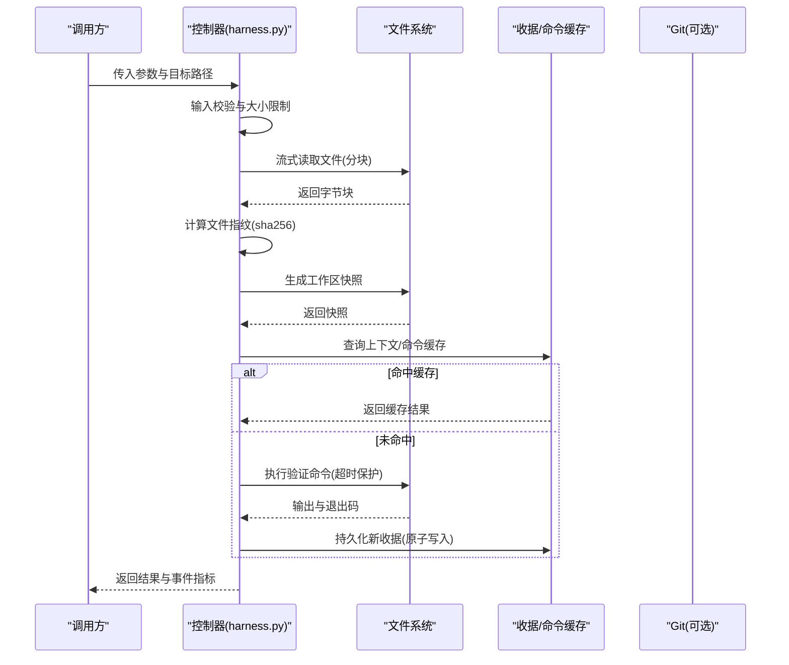
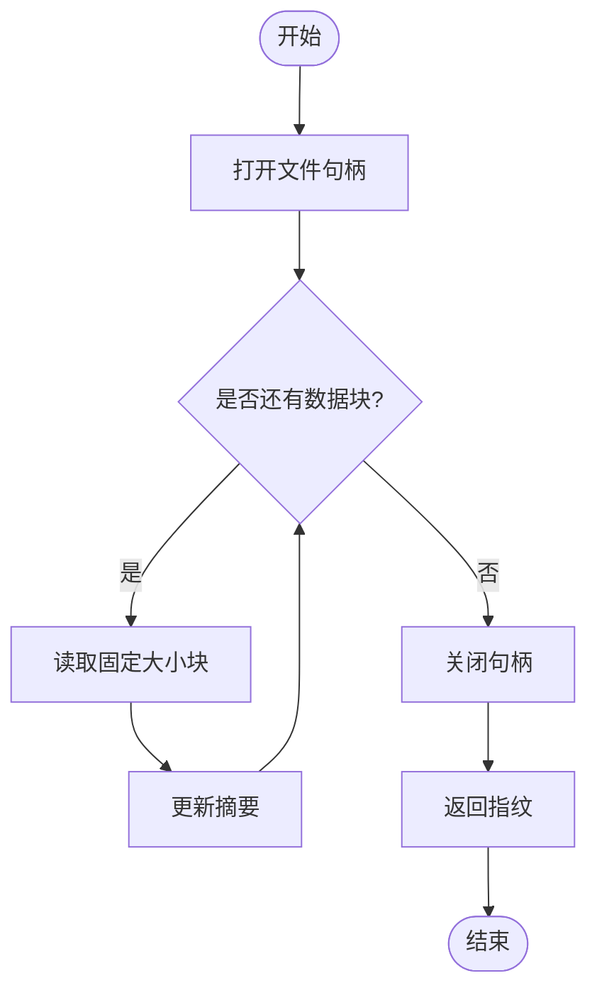
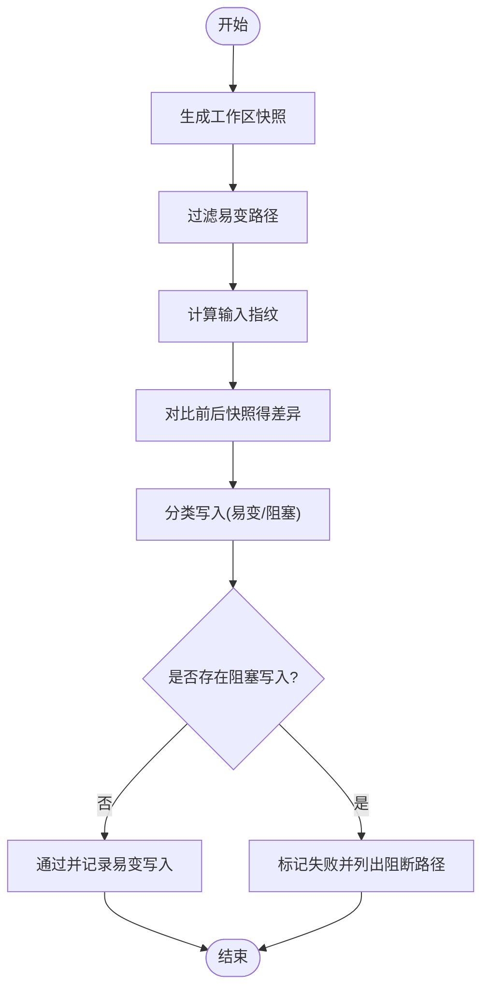
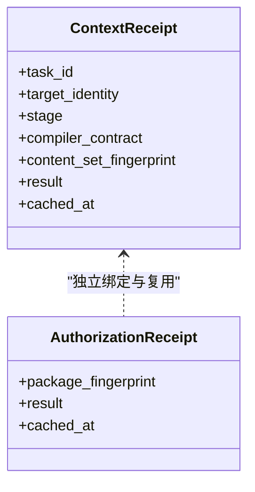
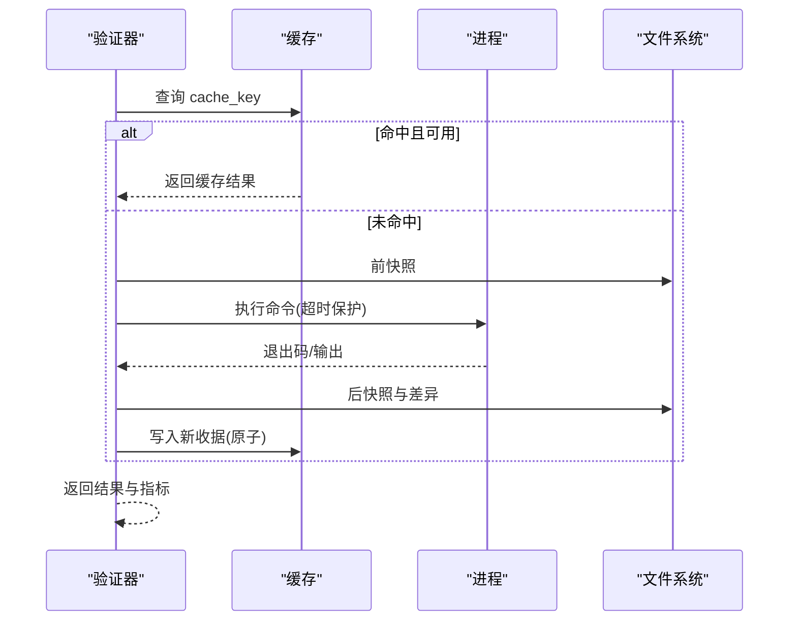
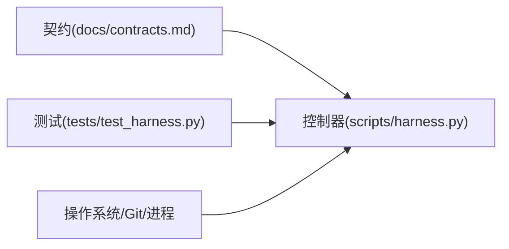

# 内存优化

<cite>
**本文引用的文件**   
- [scripts/harness.py](file://scripts/harness.py)
- [tests/test_harness.py](file://tests/test_harness.py)
- [docs/contracts.md](file://docs/contracts.md)
- [SKILL.md](file://SKILL.md)
- [package.json](file://package.json)
</cite>

## 目录
1. [简介](#简介)
2. [项目结构](#项目结构)
3. [核心组件](#核心组件)
4. [架构总览](#架构总览)
5. [详细组件分析](#详细组件分析)
6. [依赖关系分析](#依赖关系分析)
7. [性能考量](#性能考量)
8. [故障排查指南](#故障排查指南)
9. [结论](#结论)
10. [附录](#附录)

## 简介
本文件面向 Docs Harness 的内存优化策略，聚焦大文件处理、垃圾回收与对象引用管理、内存使用监控、缓存机制设计与调优方法。内容基于仓库中的控制器实现与合同文档进行归纳与解读，帮助读者在不深入源码细节的前提下理解并应用内存优化实践。

## 项目结构
Docs Harness 的核心逻辑集中在单个 Python 脚本中，配合测试与契约文档共同构成完整的运行时行为说明。关键位置如下：
- 控制器主脚本：scripts/harness.py
- 单元测试：tests/test_harness.py
- 契约与边界说明：docs/contracts.md
- 技能说明与入口约定：SKILL.md
- 包元数据与脚本入口：package.json

图表来源
- [scripts/harness.py:1-20](file://scripts/harness.py#L1-L20)
- [docs/contracts.md:1-100](file://docs/contracts.md#L1-L100)
- [tests/test_harness.py:1-120](file://tests/test_harness.py#L1-L120)
- [SKILL.md:1-60](file://SKILL.md#L1-L60)
- [package.json:1-23](file://package.json#L1-L23)

章节来源
- [scripts/harness.py:1-120](file://scripts/harness.py#L1-L120)
- [docs/contracts.md:1-120](file://docs/contracts.md#L1-L120)
- [tests/test_harness.py:1-120](file://tests/test_harness.py#L1-L120)
- [SKILL.md:1-60](file://SKILL.md#L1-L60)
- [package.json:1-23](file://package.json#L1-L23)

## 核心组件
围绕内存优化的关键能力包括：
- 流式读取与大文件指纹计算：按固定块大小迭代读取，避免一次性加载整个文件到内存。
- 工作区快照与增量差异：对文件系统状态生成指纹与差异集合，控制写入范围与临时产物识别。
- 上下文与验证命令缓存：通过受控键空间与 TTL 复用结果，减少重复 I/O 与计算。
- 原子写入与持久化：确保中间态不污染运行态，失败时回滚或保持原状。
- 事件与效率指标：记录上下文命中、负载计数等轻量指标，便于定位热点与瓶颈。

章节来源
- [scripts/harness.py:410-420](file://scripts/harness.py#L410-L420)
- [scripts/harness.py:422-438](file://scripts/harness.py#L422-L438)
- [scripts/harness.py:5900-6099](file://scripts/harness.py#L5900-L6099)
- [docs/contracts.md:150-220](file://docs/contracts.md#L150-L220)

## 架构总览
下图展示与内存优化相关的核心流程：输入校验与限制、流式指纹计算、工作区快照与差异、验证命令缓存与执行、上下文收据复用。

图表来源
- [scripts/harness.py:410-420](file://scripts/harness.py#L410-L420)
- [scripts/harness.py:5900-6099](file://scripts/harness.py#L5900-L6099)
- [docs/contracts.md:150-220](file://docs/contracts.md#L150-L220)

## 详细组件分析

### 流式读取与大文件指纹
- 实现要点
  - 以固定块大小（例如 1MB）循环读取文件，逐块更新摘要，避免整文件驻留内存。
  - 提供统一的文本哈希工具，保证一致性。
- 复杂度与内存占用
  - 时间复杂度 O(N)，N 为文件大小；峰值内存与块大小相关，远小于文件全量加载。
- 适用场景
  - 大文件指纹、校验、审计与证据摘要。

图表来源
- [scripts/harness.py:410-420](file://scripts/harness.py#L410-L420)

章节来源
- [scripts/harness.py:410-420](file://scripts/harness.py#L410-L420)

### 工作区快照与差异
- 实现要点
  - 生成工作区快照（包含排除项），用于构建验证命令输入指纹与变更集。
  - 区分“易变”写入（如测试缓存、编辑器临时文件）与阻塞性写入，保障验收安全。
- 内存影响
  - 快照为路径到摘要的映射，通常远小于文件内容本身；差异计算在内存中进行，注意控制规模。
- 配置与限制
  - 可通过项目配置开关整体禁用验证命令缓存，避免缓存带来的额外内存与磁盘开销。

图表来源
- [scripts/harness.py:5900-6099](file://scripts/harness.py#L5900-L6099)

章节来源
- [scripts/harness.py:5900-6099](file://scripts/harness.py#L5900-L6099)

### 上下文与授权收据缓存
- 实现要点
  - 上下文收据复用需满足 task_id、target_identity、stage、compiler_contract、content_set_fingerprint 一致。
  - 命中时直接返回，避免重复加载规则与事实正文，降低内存与 I/O 压力。
- 指标记录
  - 事件中包含 context_cache_hit 与 context_load_count，便于统计命中率与负载。
- 失效策略
  - 任一关键字段变化即失效重载，保证一致性。

图表来源
- [docs/contracts.md:220-240](file://docs/contracts.md#L220-L240)
- [scripts/harness.py:4330-4386](file://scripts/harness.py#L4330-L4386)

章节来源
- [docs/contracts.md:220-240](file://docs/contracts.md#L220-L240)
- [scripts/harness.py:4330-4386](file://scripts/harness.py#L4330-L4386)

### 验证命令缓存与执行
- 实现要点
  - 以任务、目标、命令、工作区输入、契约摘要等组合生成 cache_key。
  - 命中且 TTL 有效则跳过执行；否则执行前快照→执行→后快照→分类写入→持久化收据。
  - 支持整体开关 verification.command_cache_enabled=false 关闭缓存。
- 内存与性能
  - 通过缓存显著减少重复 I/O 与进程启动开销；TTL 控制过期，避免长期驻留。
- 失败与恢复
  - 非零退出或产生阻塞写入将失败；仅成功结果入缓存。

图表来源
- [scripts/harness.py:5900-6099](file://scripts/harness.py#L5900-L6099)

章节来源
- [scripts/harness.py:5900-6099](file://scripts/harness.py#L5900-L6099)

### 原子写入与持久化
- 实现要点
  - 先写临时文件，再原子替换目标路径，确保崩溃或中断不会留下半写状态。
  - JSON 与文本写入均遵循此模式，必要时 fsync 落盘。
- 内存影响
  - 临时文件与最终替换过程内存占用低，适合大对象序列化后的落盘。

章节来源
- [scripts/harness.py:422-438](file://scripts/harness.py#L422-L438)

### 事件与效率指标
- 实现要点
  - 事件只保留有界字段，包含 context_cache_hit、context_load_count、readmission_count 等。
  - 禁止保存敏感信息与冗长日志，降低内存与存储压力。
- 用途
  - 用于复算效率结论与定位热点阶段。

章节来源
- [docs/contracts.md:280-305](file://docs/contracts.md#L280-L305)
- [scripts/harness.py:1042-1057](file://scripts/harness.py#L1042-L1057)

## 依赖关系分析
- 控制器与契约：控制器严格遵循契约定义的边界与字段，确保内存与行为可预期。
- 控制器与测试：测试覆盖关键路径（上下文命中、Git 操作、验证命令等），保障内存与性能回归。
- 控制器与系统：通过子进程调用 Git 与外部命令，设置超时与捕获输出，避免资源泄漏。

图表来源
- [docs/contracts.md:1-120](file://docs/contracts.md#L1-L120)
- [scripts/harness.py:1-120](file://scripts/harness.py#L1-L120)
- [tests/test_harness.py:1-120](file://tests/test_harness.py#L1-L120)

章节来源
- [docs/contracts.md:1-120](file://docs/contracts.md#L1-L120)
- [scripts/harness.py:1-120](file://scripts/harness.py#L1-L120)
- [tests/test_harness.py:1-120](file://tests/test_harness.py#L1-L120)

## 性能考量
- 大文件处理
  - 采用流式读取与分块摘要，峰值内存与块大小成正比，避免 O(N) 全量驻留。
- 快照与差异
  - 快照为路径级摘要映射，差异计算在内存中进行；建议限制扫描范围与排除无关目录。
- 缓存策略
  - 上下文与验证命令缓存显著降低重复 I/O；TTL 控制有效期，避免长期占用。
- 原子写入
  - 临时文件+原子替换确保一致性，避免损坏与回滚成本。
- 事件与指标
  - 仅记录必要字段，降低事件体积与解析开销。

[本节为通用指导，无需代码来源]

## 故障排查指南
- 常见问题
  - 验证命令超时：检查命令耗时与超时阈值，必要时拆分或异步化。
  - 缓存未命中：确认 cache_key 组成字段是否稳定（任务、目标、命令、输入指纹、契约）。
  - 阻塞写入：排查验证命令产生的非易变写入，调整 volatile_patterns 或重构命令。
  - 上下文未复用：核对 stage、compiler_contract、content_set_fingerprint 是否一致。
- 诊断手段
  - 查看事件中的 context_cache_hit、context_load_count 等指标，定位热点。
  - 使用 --json 输出与测试用例对照，快速复现问题。

章节来源
- [scripts/harness.py:5900-6099](file://scripts/harness.py#L5900-L6099)
- [scripts/harness.py:4330-4386](file://scripts/harness.py#L4330-L4386)
- [tests/test_harness.py:950-970](file://tests/test_harness.py#L950-L970)

## 结论
Docs Harness 在大文件处理、快照与差异、缓存与原子写入等方面提供了稳健的内存优化基础。通过流式读取、受控缓存与最小化事件，系统在大规模工程下仍能保持较低的内存峰值与稳定的性能表现。建议结合项目实际，合理配置缓存开关、易变路径与超时阈值，以获得最佳效果。

[本节为总结性内容，无需代码来源]

## 附录
- 入口与安装
  - 项目初始化与任务入口见 SKILL.md 与 package.json 脚本定义。
- 契约参考
  - 任务包、证据、上下文、验收层与事件字段详见 docs/contracts.md。

章节来源
- [SKILL.md:1-60](file://SKILL.md#L1-L60)
- [package.json:1-23](file://package.json#L1-L23)
- [docs/contracts.md:1-120](file://docs/contracts.md#L1-L120)