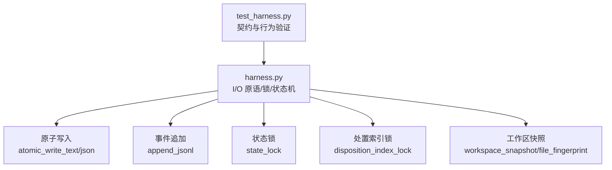
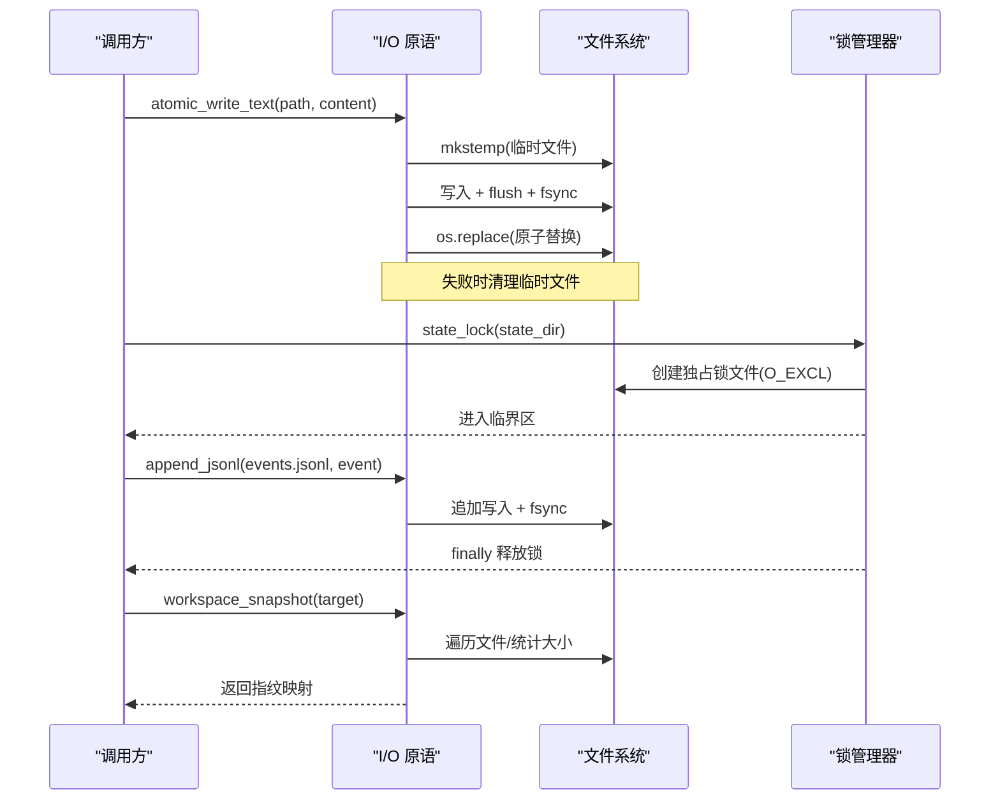
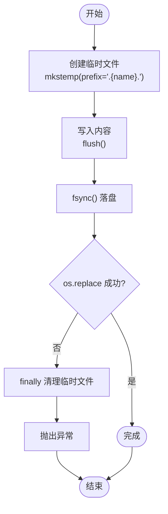
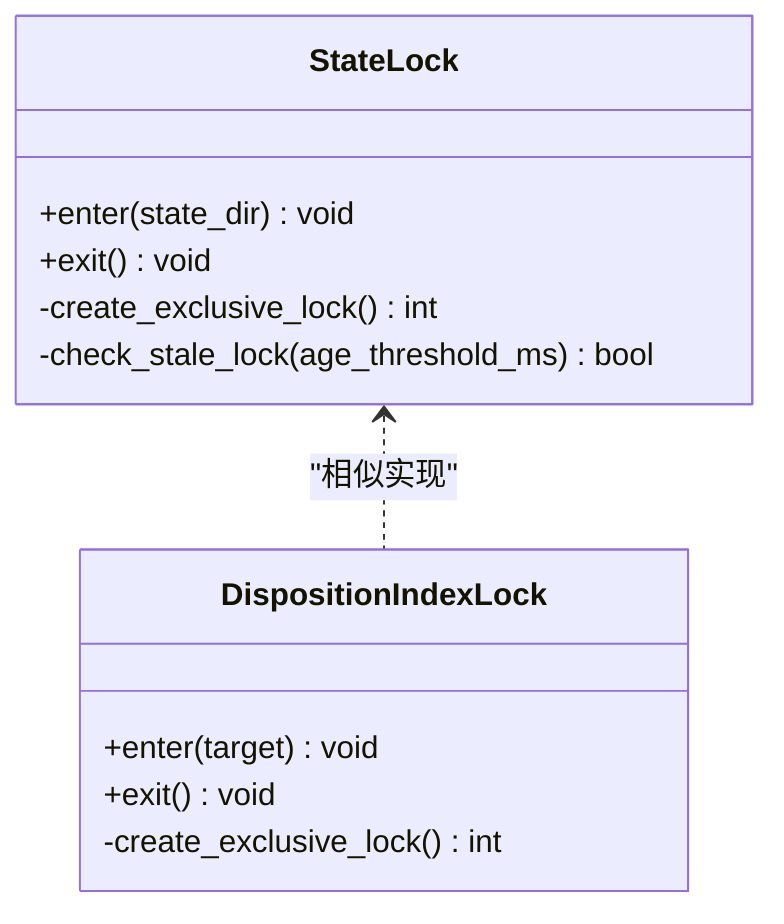
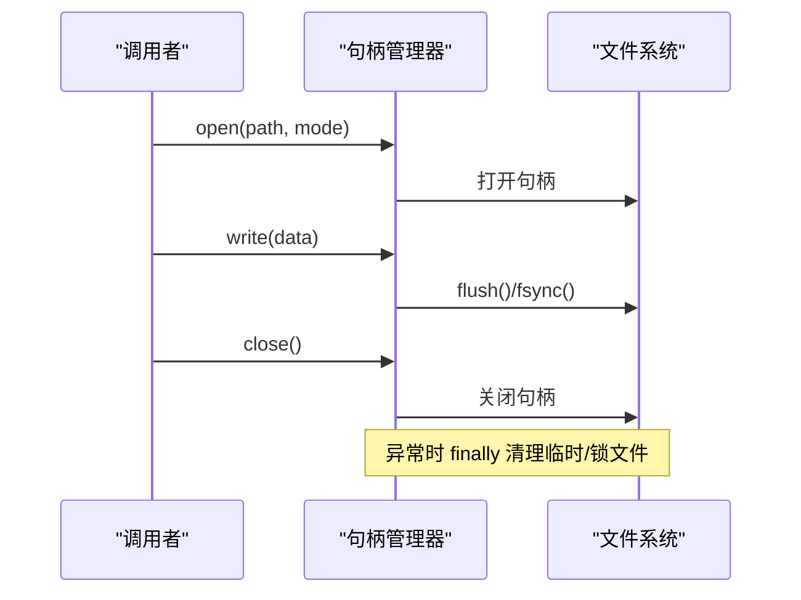
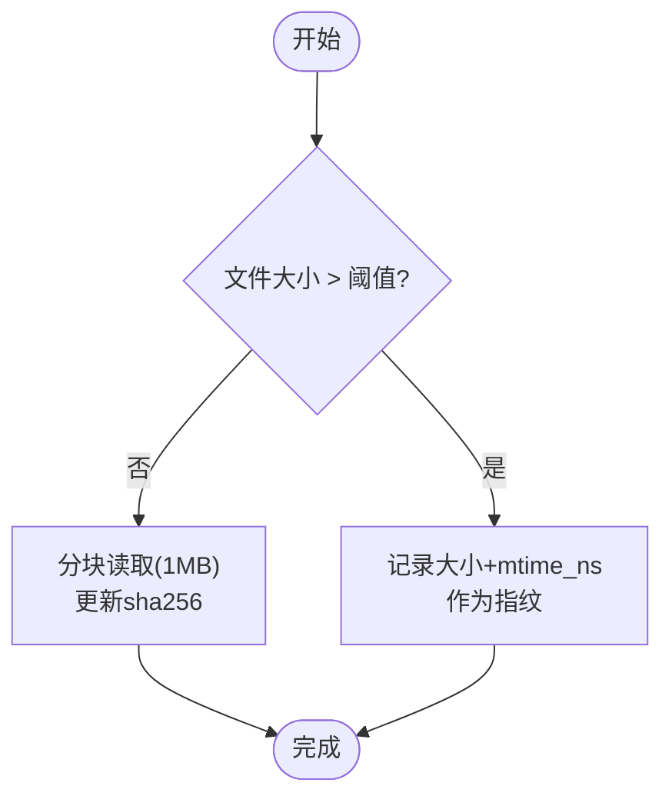
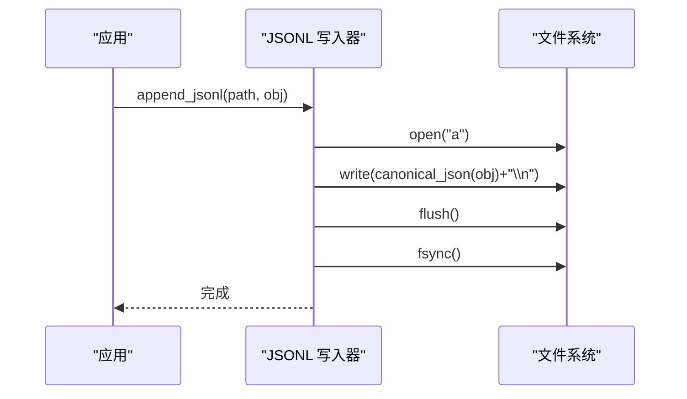
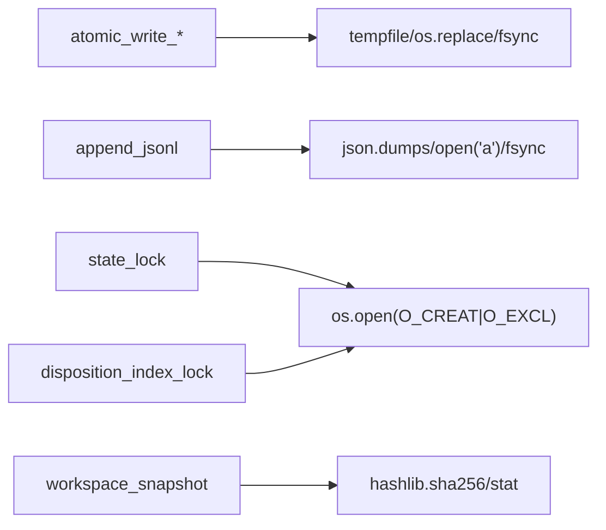

# 文件句柄管理

<cite>
**本文引用的文件**   
- [scripts/harness.py](file://scripts/harness.py)
- [tests/test_harness.py](file://tests/test_harness.py)
</cite>

## 目录
1. [简介](#简介)
2. [项目结构](#项目结构)
3. [核心组件](#核心组件)
4. [架构总览](#架构总览)
5. [详细组件分析](#详细组件分析)
6. [依赖关系分析](#依赖关系分析)
7. [性能考量](#性能考量)
8. [故障排除指南](#故障排除指南)
9. [结论](#结论)

## 简介
本文件聚焦 Docs Harness 的文件句柄管理机制，围绕受管 artifact store 的原子写入策略、文件锁机制、句柄生命周期与大文件处理进行系统化说明。目标是帮助读者理解：
- 如何通过临时文件与原子替换保证写入一致性；
- 如何使用文件系统级锁避免并发冲突；
- 如何安全地打开、使用并释放文件句柄，以及在异常路径下确保资源清理；
- 如何在大数据量场景下采用流式读写、分块校验与内存映射等策略提升稳定性与吞吐。

## 项目结构
- 核心实现集中在单一脚本中，提供统一的 I/O 原语（原子写、追加日志、JSON 读写）、状态锁与任务处置索引锁，以及工作区快照与指纹计算等能力。
- 测试用例覆盖关键行为与边界条件，可作为正确性验证参考。

**图表来源** 
- [scripts/harness.py:422-437](file://scripts/harness.py#L422-L437)
- [scripts/harness.py:510-532](file://scripts/harness.py#L510-L532)
- [scripts/harness.py:1011-1032](file://scripts/harness.py#L1011-L1032)
- [scripts/harness.py:3501-3516](file://scripts/harness.py#L3501-L3516)
- [scripts/harness.py:1115-1138](file://scripts/harness.py#L1115-L1138)
- [tests/test_harness.py:1-120](file://tests/test_harness.py#L1-L120)

**章节来源**
- [scripts/harness.py:422-437](file://scripts/harness.py#L422-L437)
- [scripts/harness.py:510-532](file://scripts/harness.py#L510-L532)
- [scripts/harness.py:1011-1032](file://scripts/harness.py#L1011-L1032)
- [scripts/harness.py:3501-3516](file://scripts/harness.py#L3501-L3516)
- [scripts/harness.py:1115-1138](file://scripts/harness.py#L1115-L1138)
- [tests/test_harness.py:1-120](file://tests/test_harness.py#L1-L120)

## 核心组件
- 原子写入
  - 文本/JSON 原子写入通过“创建临时文件 → 写入并 fsync → 原子替换”实现，确保消费者要么看到旧版本，要么看到完整新版本，不会出现半写状态。
- 事件追加
  - 以追加模式打开 JSONL 文件，逐行写入规范化 JSON，并在每次写入后 flush 与 fsync，保证顺序持久化。
- 状态锁与处置索引锁
  - 基于不可重入的独占文件锁（O_CREAT | O_EXCL）实现进程级互斥，包含陈旧锁检测与错误码区分，避免并发覆盖与死锁。
- 工作区快照与指纹
  - 对大文件采用“大小+时间戳”摘要，小文件采用内容哈希，兼顾准确性与性能。

**章节来源**
- [scripts/harness.py:422-437](file://scripts/harness.py#L422-L437)
- [scripts/harness.py:510-532](file://scripts/harness.py#L510-L532)
- [scripts/harness.py:1011-1032](file://scripts/harness.py#L1011-L1032)
- [scripts/harness.py:3501-3516](file://scripts/harness.py#L3501-L3516)
- [scripts/harness.py:1115-1138](file://scripts/harness.py#L1115-L1138)

## 架构总览
下图展示受管 artifact store 的关键流程：原子写入、事件追加、加锁保护与快照生成之间的协作关系。

**图表来源** 
- [scripts/harness.py:422-437](file://scripts/harness.py#L422-L437)
- [scripts/harness.py:510-532](file://scripts/harness.py#L510-L532)
- [scripts/harness.py:1011-1032](file://scripts/harness.py#L1011-L1032)
- [scripts/harness.py:3501-3516](file://scripts/harness.py#L3501-L3516)
- [scripts/harness.py:1115-1138](file://scripts/harness.py#L1115-L1138)

## 详细组件分析

### 原子写入策略（临时文件、内容验证、原子替换）
- 设计要点
  - 在目标文件同目录下创建隐藏前缀的临时文件，避免被扫描到。
  - 写入完成后执行 flush 与 fsync，确保数据落盘。
  - 使用 os.replace 完成原子替换，保证读端不会看到部分写入。
  - 异常路径下清理临时文件，防止残留。
- 适用场景
  - 任务包、编译产物、证据索引、冻结清单、日志等关键元数据更新。
- 复杂度与影响
  - 时间复杂度 O(n)（n 为内容长度），空间复杂度 O(1)（流式写入）。
  - 磁盘 I/O 两次（写临时 + 替换），fsync 带来持久化成本但保障一致性。

**图表来源** 
- [scripts/harness.py:422-437](file://scripts/harness.py#L422-L437)

**章节来源**
- [scripts/harness.py:422-437](file://scripts/harness.py#L422-L437)

### 文件锁机制（并发访问控制）
- 状态锁 state_lock
  - 在状态目录内创建独占锁文件，使用 O_CREAT | O_EXCL 确保唯一性。
  - 若锁已存在，检查修改时间：超过阈值视为陈旧锁，提示人工清理；否则报“同一任务正在被另一个进程更新”。
  - 临界区内执行业务逻辑，finally 中释放锁（删除锁文件）。
- 处置索引锁 disposition_index_lock
  - 针对任务处置索引的全局锁，防止并发更新导致索引不一致。
- 语义与错误码
  - stale_lock：陈旧锁，需人工介入。
  - state_locked/disposition_index_locked：并发冲突，应重试或协调。

**图表来源** 
- [scripts/harness.py:1011-1032](file://scripts/harness.py#L1011-L1032)
- [scripts/harness.py:3501-3516](file://scripts/harness.py#L3501-L3516)

**章节来源**
- [scripts/harness.py:1011-1032](file://scripts/harness.py#L1011-L1032)
- [scripts/harness.py:3501-3516](file://scripts/harness.py#L3501-L3516)

### 文件句柄生命周期管理（打开、使用、释放、异常处理）
- 打开
  - 使用 with 上下文管理器或 os.fdopen 显式管理句柄，确保自动关闭。
  - 文本写入指定编码与换行符，避免平台差异。
- 使用
  - 写入后立即 flush，必要时 fsync 确保持久化。
  - 对 JSONL 追加写入，逐行规范化输出，避免跨行污染。
- 释放
  - finally 分支统一清理临时文件与锁文件，避免资源泄漏。
- 异常处理
  - 捕获并转换为领域异常（如 missing_file、invalid_json、state_locked 等），附带错误码便于上层决策。

**图表来源** 
- [scripts/harness.py:422-437](file://scripts/harness.py#L422-L437)
- [scripts/harness.py:510-532](file://scripts/harness.py#L510-L532)
- [scripts/harness.py:1011-1032](file://scripts/harness.py#L1011-L1032)

**章节来源**
- [scripts/harness.py:422-437](file://scripts/harness.py#L422-L437)
- [scripts/harness.py:510-532](file://scripts/harness.py#L510-L532)
- [scripts/harness.py:1011-1032](file://scripts/harness.py#L1011-L1032)

### 大文件处理策略（流式读写、内存映射、分块处理）
- 流式读取与分块哈希
  - 对大文件按固定块大小循环读取并更新哈希，避免一次性加载到内存。
- 工作区快照优化
  - 对小文件使用内容哈希，对大文件使用“大小+时间戳”摘要，降低 I/O 压力。
- 建议实践
  - 优先使用流式 API，避免 read_bytes/read_text 全量加载。
  - 需要随机访问时可考虑内存映射，但需谨慎评估内存占用与平台兼容性。

**图表来源** 
- [scripts/harness.py:414-419](file://scripts/harness.py#L414-L419)
- [scripts/harness.py:1115-1138](file://scripts/harness.py#L1115-L1138)

**章节来源**
- [scripts/harness.py:414-419](file://scripts/harness.py#L414-L419)
- [scripts/harness.py:1115-1138](file://scripts/harness.py#L1115-L1138)

### 事件追加与持久化（JSONL 追加）
- 设计要点
  - 以追加模式打开文件，逐行写入规范化 JSON，确保每行独立可解析。
  - 每次写入后 flush 与 fsync，保证顺序与持久化。
- 错误处理
  - 读取时按行解析，遇到无效行抛出明确错误码，便于定位问题。

**图表来源** 
- [scripts/harness.py:510-532](file://scripts/harness.py#L510-L532)

**章节来源**
- [scripts/harness.py:510-532](file://scripts/harness.py#L510-L532)

## 依赖关系分析
- 模块内依赖
  - 原子写入依赖临时文件与系统替换操作；事件追加依赖规范化 JSON 与 fsync；锁机制依赖操作系统独占锁语义。
- 外部依赖
  - 文件系统 API（open、fsync、replace、mkstemp）；Python 标准库 contextlib、tempfile、hashlib。
- 耦合与内聚
  - I/O 原语高度内聚，职责清晰；锁与写入分离，便于复用与测试。

**图表来源** 
- [scripts/harness.py:422-437](file://scripts/harness.py#L422-L437)
- [scripts/harness.py:510-532](file://scripts/harness.py#L510-L532)
- [scripts/harness.py:1011-1032](file://scripts/harness.py#L1011-L1032)
- [scripts/harness.py:3501-3516](file://scripts/harness.py#L3501-L3516)
- [scripts/harness.py:1115-1138](file://scripts/harness.py#L1115-L1138)

**章节来源**
- [scripts/harness.py:422-437](file://scripts/harness.py#L422-L437)
- [scripts/harness.py:510-532](file://scripts/harness.py#L510-L532)
- [scripts/harness.py:1011-1032](file://scripts/harness.py#L1011-L1032)
- [scripts/harness.py:3501-3516](file://scripts/harness.py#L3501-L3516)
- [scripts/harness.py:1115-1138](file://scripts/harness.py#L1115-L1138)

## 性能考量
- 原子写入
  - 额外一次 fsync 与临时文件复制开销，适合元数据与小体积文件；对超大文件建议先压缩或分片后再原子替换。
- 事件追加
  - 频繁 fsync 会显著降低吞吐，可在批处理后批量 fsync，或在高可靠需求下保持逐条 fsync。
- 快照与指纹
  - 大文件采用轻量摘要减少 I/O；如需强一致性，可对关键文件启用内容哈希。
- 锁竞争
  - 缩短临界区范围，避免长时间持有锁；合理拆分任务粒度以降低争用。

[本节为通用指导，不直接分析具体文件]

## 故障排除指南
- 常见错误与处理
  - 缺少文件或 JSON 无效：检查路径与权限，确认上游写入是否完成。
  - 状态锁冲突：等待并重试；若出现陈旧锁，人工清理锁文件。
  - 事件文件损坏：定位行号与内容，修复或重建事件日志。
  - 工作区快照过大：非 Git 仓库且文件过多时会拒绝截断基线，建议纳入 Git 或使用增量快照。
- 诊断步骤
  - 查看 events.jsonl 最近事件，确认阶段与原因码。
  - 检查 .lock 文件时间与 PID，判断是否为僵尸锁。
  - 对比原子替换前后的文件指纹，确认一致性。

**章节来源**
- [scripts/harness.py:440-446](file://scripts/harness.py#L440-L446)
- [scripts/harness.py:1011-1032](file://scripts/harness.py#L1011-L1032)
- [scripts/harness.py:518-532](file://scripts/harness.py#L518-L532)
- [scripts/harness.py:1115-1138](file://scripts/harness.py#L1115-L1138)

## 结论
Docs Harness 通过原子写入、严格加锁与流式处理，构建了稳健的文件句柄管理机制。该机制在保证一致性与并发安全的同时，兼顾了大文件处理的性能与可靠性。遵循本文的最佳实践与故障排除建议，可有效降低数据损坏风险并提升系统可用性。

[本节为总结性内容，不直接分析具体文件]