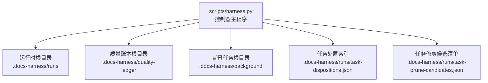
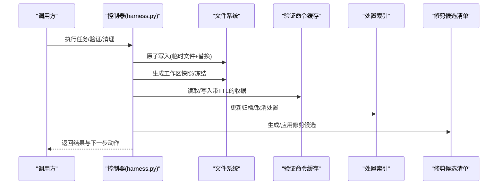
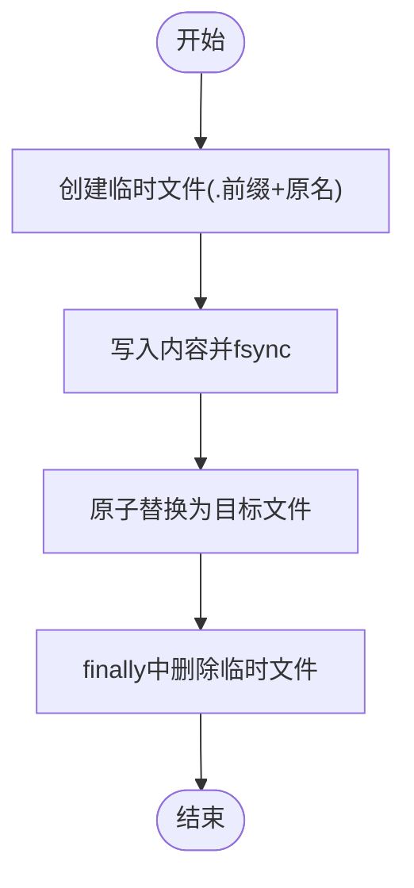
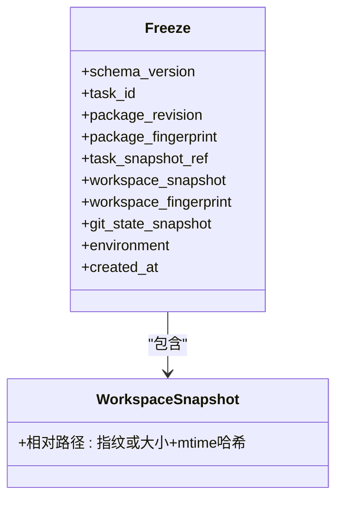
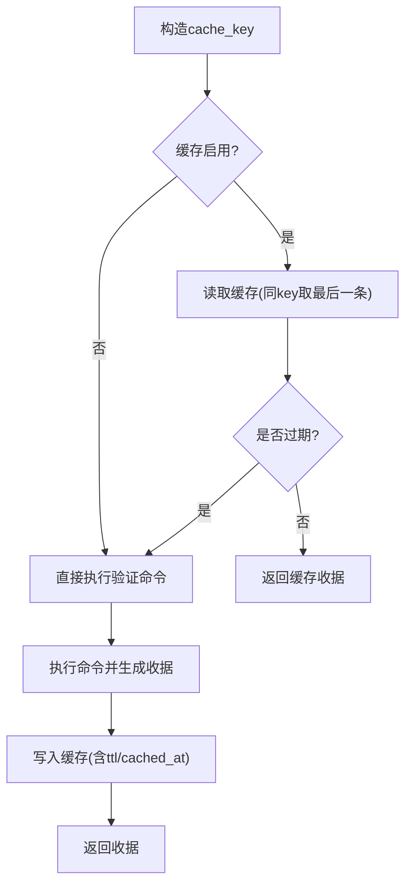
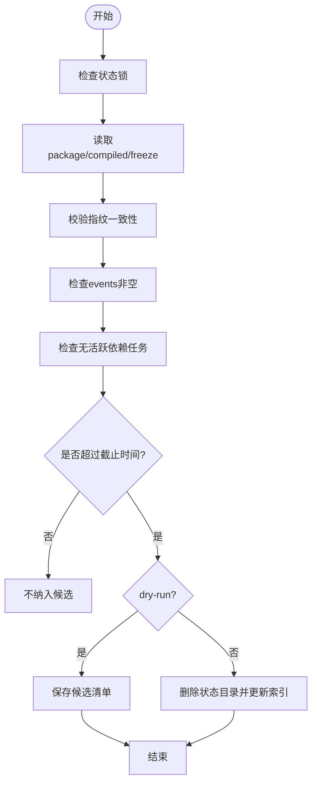
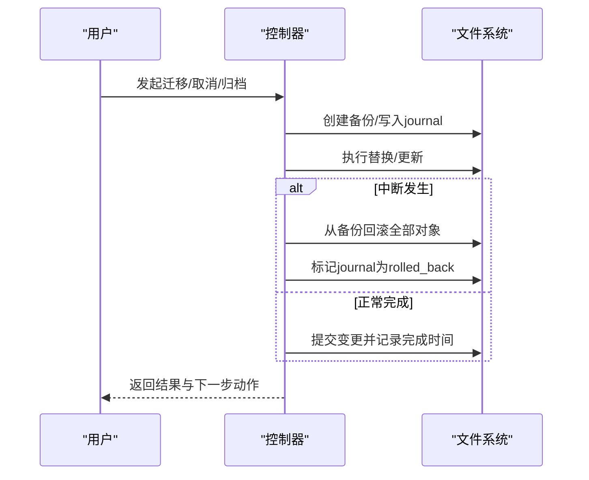
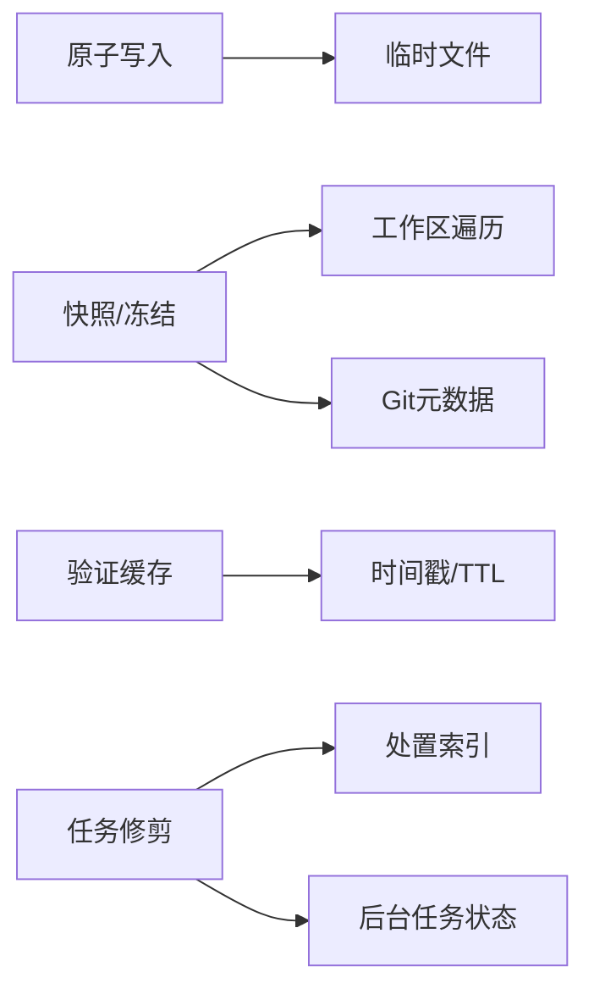

# 资源清理

<cite>
**本文引用的文件**   
- [scripts/harness.py](file://scripts/harness.py)
- [tests/test_harness.py](file://tests/test_harness.py)
- [package.json](file://package.json)
</cite>

## 目录
1. [简介](#简介)
2. [项目结构](#项目结构)
3. [核心组件](#核心组件)
4. [架构总览](#架构总览)
5. [详细组件分析](#详细组件分析)
6. [依赖关系分析](#依赖关系分析)
7. [性能考量](#性能考量)
8. [故障排查指南](#故障排查指南)
9. [结论](#结论)
10. [附录](#附录)

## 简介
本文件面向 Docs Harness 的资源清理策略，围绕以下目标展开：
- 临时文件管理机制：自动创建、命名规范与生命周期清理
- 工作区快照与冻结（freeze）管理：版本一致性、空间回收与保留策略
- 缓存过期处理：时间戳检查、依赖关系维护与主动清理
- 异常恢复机制：中断处理、状态回滚与一致性保证
- 资源清理配置与监控工具使用方法

上述能力由脚本控制器统一实现，并通过任务状态目录、事件日志、处置索引与候选清单等持久化对象进行治理。

## 项目结构
- 控制器主程序位于 scripts/harness.py，集中实现任务编排、状态管理、Git 预/后检查、验证命令缓存、任务归档与清理等能力。
- 测试用例 tests/test_harness.py 覆盖关键路径与边界条件，可作为使用示例与行为契约参考。
- package.json 提供脚本入口与自测命令，便于在 CI 或本地环境快速验证。

图表来源
- [scripts/harness.py:909-925](file://scripts/harness.py#L909-L925)
- [scripts/harness.py:3497-3532](file://scripts/harness.py#L3497-L3532)
- [scripts/harness.py:3752-3882](file://scripts/harness.py#L3752-L3882)

章节来源
- [scripts/harness.py:909-925](file://scripts/harness.py#L909-L925)
- [package.json:1-23](file://package.json#L1-L23)

## 核心组件
- 原子写入与临时文件：通过临时文件+原子替换保障写入一致性，并在 finally 中清理残留临时文件。
- 工作区快照与冻结：对运行期工作区生成指纹快照，冻结任务初始状态，用于一致性校验与差异对比。
- 验证命令缓存：基于 cache_key 与 ttl 的收据缓存，支持按 TTL 过期与按需刷新。
- 任务生命周期与清理：终态判定、取消/归档、基于时间的修剪（prune），以及锁检测与陈旧锁保护。
- 事件与审计：事件追加到 events.jsonl，记录阶段、耗时、上下文命中、证据轮次等指标。

章节来源
- [scripts/harness.py:422-438](file://scripts/harness.py#L422-L438)
- [scripts/harness.py:1115-1139](file://scripts/harness.py#L1115-L1139)
- [scripts/harness.py:3229-3262](file://scripts/harness.py#L3229-L3262)
- [scripts/harness.py:5913-6074](file://scripts/harness.py#L5913-L6074)
- [scripts/harness.py:3752-3882](file://scripts/harness.py#L3752-L3882)
- [scripts/harness.py:1034-1074](file://scripts/harness.py#L1034-L1074)

## 架构总览
下图展示资源清理相关的关键流程与数据流：临时文件原子写入、工作区快照/冻结、验证命令缓存、任务修剪与处置索引更新。

图表来源
- [scripts/harness.py:422-438](file://scripts/harness.py#L422-L438)
- [scripts/harness.py:1115-1139](file://scripts/harness.py#L1115-L1139)
- [scripts/harness.py:5913-6074](file://scripts/harness.py#L5913-L6074)
- [scripts/harness.py:3497-3532](file://scripts/harness.py#L3497-L3532)
- [scripts/harness.py:3752-3882](file://scripts/harness.py#L3752-L3882)

## 详细组件分析

### 临时文件管理与原子写入
- 自动创建：所有需要落盘的 JSON/文本均通过原子写入函数创建父目录并写入临时文件。
- 命名规范：临时文件以“.”前缀与原始文件名作为前缀，避免与业务文件冲突。
- 定期清理：写入成功后原子替换目标文件；finally 块确保删除临时文件，防止残留。
- 适用场景：任务包、编译状态、冻结快照、事件日志、各类 receipts 等。

图表来源
- [scripts/harness.py:422-438](file://scripts/harness.py#L422-L438)

章节来源
- [scripts/harness.py:422-438](file://scripts/harness.py#L422-L438)

### 工作区快照与冻结（freeze）管理
- 快照生成：遍历工作区文件，排除特定目录与后缀，小文件计算指纹，大文件用大小+修改时间哈希。
- 冻结对象：任务创建时写入 freeze.json，包含任务指纹、工作区快照指纹、Git 状态快照与环境指纹。
- 一致性校验：加载状态时校验 package/compiled/freeze 三者指纹一致，否则拒绝继续。
- 空间回收：任务修剪时删除整个任务状态目录，释放快照与事件占用空间。

图表来源
- [scripts/harness.py:1115-1139](file://scripts/harness.py#L1115-L1139)
- [scripts/harness.py:3229-3262](file://scripts/harness.py#L3229-L3262)
- [scripts/harness.py:3265-3280](file://scripts/harness.py#L3265-L3280)

章节来源
- [scripts/harness.py:1115-1139](file://scripts/harness.py#L1115-L1139)
- [scripts/harness.py:3229-3262](file://scripts/harness.py#L3229-L3262)
- [scripts/harness.py:3265-3280](file://scripts/harness.py#L3265-L3280)

### 验证命令缓存与过期处理
- 缓存键：基于验证命令参数与上下文生成 cache_key，同一 key 以最后一条为准。
- TTL 检查：收据携带 ttl 与 cached_at，若当前时间超过 ended_at + ttl 则视为过期。
- 依赖维护：缓存条目包含 command_argv_digest、cwd、changed_paths 等，确保环境变化可触发失效。
- 主动清理：当缓存项被新条目覆盖或显式刷新时，旧条目自然淘汰；无独立 GC 线程，依赖读写路径清理。

图表来源
- [scripts/harness.py:5913-6074](file://scripts/harness.py#L5913-L6074)

章节来源
- [scripts/harness.py:5913-6074](file://scripts/harness.py#L5913-L6074)

### 任务修剪与空间回收
- 候选判定：仅终态任务参与，需满足事件非空、指纹一致、无活动锁、无活跃后台任务依赖等。
- 时间阈值：older_than 指定天数，超过截止时间的终态任务进入候选。
- 安全执行：dry-run 生成候选清单并冻结；apply 模式严格比对候选指纹后删除状态目录。
- 索引同步：若为归档任务，修剪时从处置索引移除对应条目。

图表来源
- [scripts/harness.py:3752-3882](file://scripts/harness.py#L3752-L3882)

章节来源
- [scripts/harness.py:3752-3882](file://scripts/harness.py#L3752-L3882)

### 异常恢复与一致性保证
- 迁移中断回滚：v1→v2 迁移过程中若发生中断，会按备份全量回滚，并标记 journal 状态。
- 锁检测：任务级 .lock 文件与全局处置索引锁，区分活动锁与陈旧锁（>5分钟）。
- 幂等性：取消/归档操作具备幂等语义，重复调用不会覆盖首次处置事实。
- 一致性校验：加载状态时校验 package/compiled/freeze 指纹一致，否则拒绝继续。

图表来源
- [scripts/harness.py:3342-3494](file://scripts/harness.py#L3342-L3494)
- [scripts/harness.py:3549-3561](file://scripts/harness.py#L3549-L3561)
- [scripts/harness.py:3563-3660](file://scripts/harness.py#L3563-L3660)
- [scripts/harness.py:3663-3715](file://scripts/harness.py#L3663-L3715)

章节来源
- [scripts/harness.py:3342-3494](file://scripts/harness.py#L3342-L3494)
- [scripts/harness.py:3549-3561](file://scripts/harness.py#L3549-L3561)
- [scripts/harness.py:3563-3660](file://scripts/harness.py#L3563-L3660)
- [scripts/harness.py:3663-3715](file://scripts/harness.py#L3663-L3715)

### 资源清理配置与监控工具
- 配置项
  - verification.command_cache_enabled：控制验证命令缓存开关
  - verification.auto_attribute_in_scope：控制作用域内未归因写入的自动归因
  - verification.volatile_paths：声明易变路径，用于验证阶段忽略
- 监控与诊断
  - task list：列出任务及处置状态，支持包含归档
  - task prune --dry-run：生成修剪候选清单并冻结
  - task prune --apply：基于冻结清单执行删除与索引同步
  - 事件日志 events.jsonl：记录阶段、耗时、上下文命中、证据轮次等

章节来源
- [scripts/harness.py:1191-1216](file://scripts/harness.py#L1191-L1216)
- [scripts/harness.py:1153-1188](file://scripts/harness.py#L1153-L1188)
- [scripts/harness.py:3718-3742](file://scripts/harness.py#L3718-L3742)
- [scripts/harness.py:3752-3882](file://scripts/harness.py#L3752-L3882)
- [scripts/harness.py:1034-1074](file://scripts/harness.py#L1034-L1074)

## 依赖关系分析
- 模块内依赖
  - 原子写入依赖临时文件与系统替换能力
  - 快照/冻结依赖工作区遍历与 Git 元数据
  - 缓存依赖时间戳与 TTL 计算
  - 修剪依赖处置索引与后台任务状态
- 外部依赖
  - Git 命令用于工作区与引用快照
  - 文件系统用于状态目录、事件日志与缓存

图表来源
- [scripts/harness.py:422-438](file://scripts/harness.py#L422-L438)
- [scripts/harness.py:1115-1139](file://scripts/harness.py#L1115-L1139)
- [scripts/harness.py:5913-6074](file://scripts/harness.py#L5913-L6074)
- [scripts/harness.py:3497-3532](file://scripts/harness.py#L3497-L3532)
- [scripts/harness.py:3752-3882](file://scripts/harness.py#L3752-L3882)

章节来源
- [scripts/harness.py:422-438](file://scripts/harness.py#L422-L438)
- [scripts/harness.py:1115-1139](file://scripts/harness.py#L1115-L1139)
- [scripts/harness.py:5913-6074](file://scripts/harness.py#L5913-L6074)
- [scripts/harness.py:3497-3532](file://scripts/harness.py#L3497-L3532)
- [scripts/harness.py:3752-3882](file://scripts/harness.py#L3752-L3882)

## 性能考量
- 快照规模限制：非 Git 工作区快照有文件数量上限，超出将拒绝截断基线，避免过大快照影响性能。
- 大文件优化：大于阈值的大文件采用大小+mtime 哈希，减少 IO 与 CPU 开销。
- 缓存命中率：合理设置 TTL 与 cache_key，降低重复验证成本。
- 修剪批量化：dry-run 先收集候选，apply 再批量删除，减少锁竞争与重复扫描。

[本节为通用指导，无需源码引用]

## 故障排查指南
- 常见错误码
  - stale_lock：检测到超过 5 分钟的锁，需人工确认清理
  - state_locked：任务正被其他进程更新
  - invalid_prune_request：修剪参数非法
  - evidence_expired：证据收据已过期
  - archive_source_drift：归档源对象指纹漂移
- 定位步骤
  - 查看 events.jsonl 获取阶段与耗时
  - 检查 .lock 文件时间与 PID
  - 核对 task-dispositions.json 与 task-prune-candidates.json
  - 验证 package/compiled/freeze 指纹一致性

章节来源
- [scripts/harness.py:1011-1032](file://scripts/harness.py#L1011-L1032)
- [scripts/harness.py:3549-3561](file://scripts/harness.py#L3549-L3561)
- [scripts/harness.py:3830-3882](file://scripts/harness.py#L3830-L3882)
- [scripts/harness.py:5355-5359](file://scripts/harness.py#L5355-L5359)
- [scripts/harness.py:3534-3546](file://scripts/harness.py#L3534-L3546)

## 结论
Docs Harness 的资源清理策略以原子写入、快照/冻结、缓存 TTL 与任务修剪为核心，结合锁机制与事件审计，形成闭环的一致性保障。通过配置项与命令行工具，可在不同环境下灵活调整清理策略与监控手段，确保系统在长时间运行下的稳定性与可维护性。

[本节为总结，无需源码引用]

## 附录
- 自测与测试
  - 使用 package.json 中的 self-test 与 test 脚本快速验证控制器行为
  - 参考 tests/test_harness.py 中的用例了解典型用法与边界条件

章节来源
- [package.json:17-21](file://package.json#L17-L21)
- [tests/test_harness.py:1-800](file://tests/test_harness.py#L1-L800)