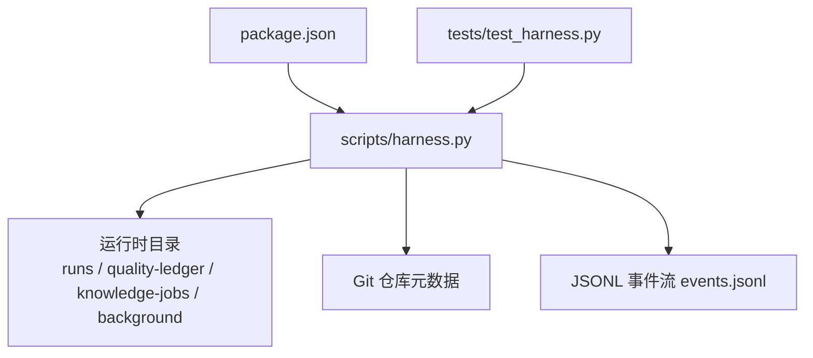
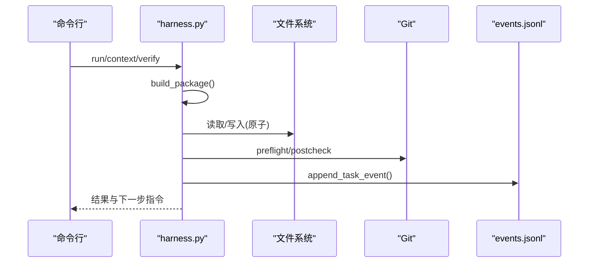
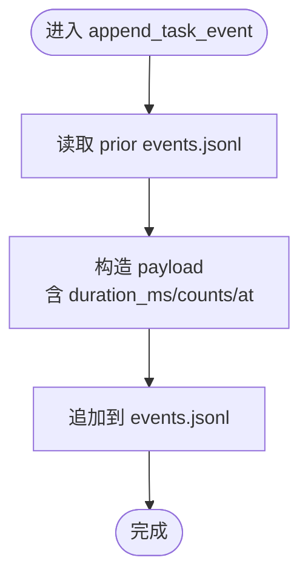
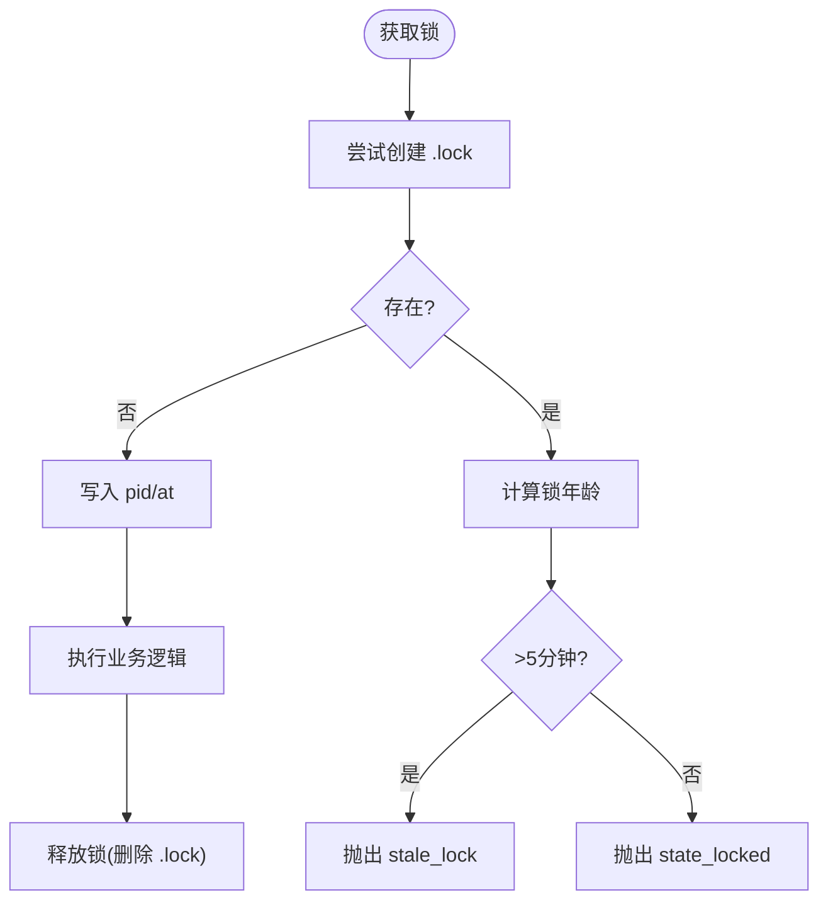
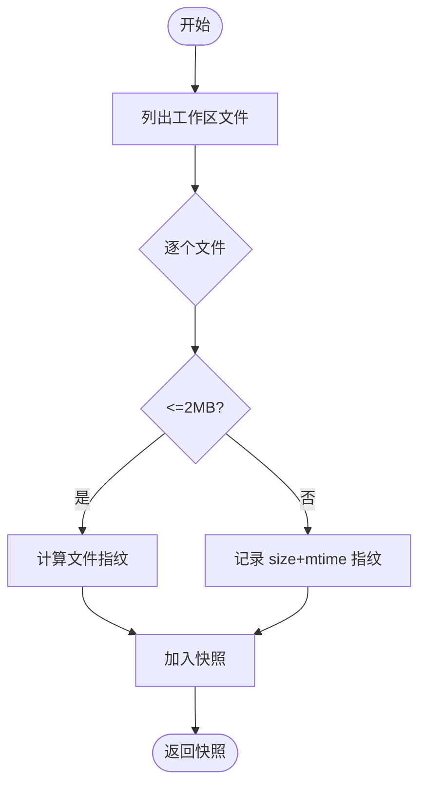
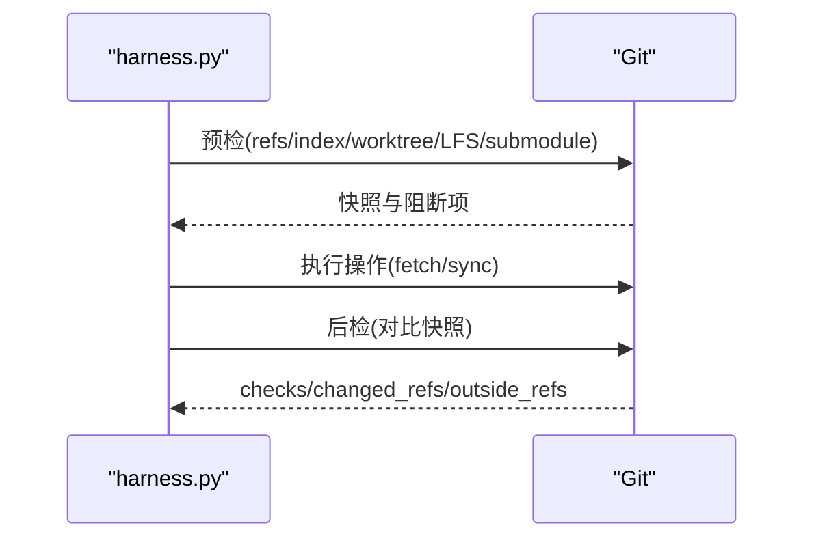
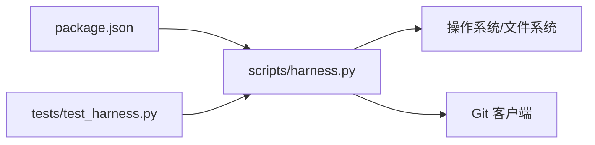

# 资源监控

<cite>
**本文引用的文件**   
- [scripts/harness.py](file://scripts/harness.py)
- [tests/test_harness.py](file://tests/test_harness.py)
- [package.json](file://package.json)
</cite>

## 目录
1. [简介](#简介)
2. [项目结构](#项目结构)
3. [核心组件](#核心组件)
4. [架构总览](#架构总览)
5. [详细组件分析](#详细组件分析)
6. [依赖关系分析](#依赖关系分析)
7. [性能考量](#性能考量)
8. [故障诊断指南](#故障诊断指南)
9. [结论](#结论)
10. [附录](#附录)

## 简介
本文件面向 Docs Harness 的资源监控与调试能力，聚焦以下目标：
- 内存使用分析工具：堆栈跟踪、对象统计、泄漏检测（以事件与指标为观测点）
- 文件句柄统计：打开数量、类型分布、使用时长监控
- I/O 性能监控：读写速度、延迟分析与瓶颈识别
- 资源使用报告：趋势分析、告警规则、导出格式
- 监控数据解读与故障诊断实践

说明：当前仓库未包含专门的“内存/句柄/I/O”专用模块。Docs Harness 通过统一的事件记录、状态锁、工作区快照、Git 预检/后检、原子写入与 JSONL 日志等机制，为上层监控与调试提供可观测性基础。本文基于源码中的相关实现进行归纳与扩展建议，帮助读者构建完整的资源监控体系。

**章节来源**
- [package.json:1-23](file://package.json#L1-L23)

## 项目结构
- scripts/harness.py：控制器主逻辑，包含任务编排、Git 操作、状态管理、事件记录、工作区快照、原子写入、验证命令缓存、知识地图与治理交付物等。
- tests/test_harness.py：覆盖关键路径的单元测试，可用于回归与行为校验。
- package.json：脚本入口与测试命令定义。

**图表来源**
- [package.json:17-22](file://package.json#L17-L22)
- [scripts/harness.py:909-924](file://scripts/harness.py#L909-L924)
- [scripts/harness.py:1034-1073](file://scripts/harness.py#L1034-L1073)

**章节来源**
- [package.json:17-22](file://package.json#L17-L22)

## 核心组件
围绕资源监控与调试，以下组件最为关键：
- 事件记录器 append_task_event：记录阶段、耗时、上下文加载次数、证据轮次、宿主回执数、业务动作计数等，是性能与资源使用趋势的基础。
- 状态锁 state_lock：并发控制与死锁保护，避免重复更新导致的数据不一致。
- 工作区快照 workspace_snapshot：对文件集合进行指纹化，用于变更检测与基线对比。
- Git 预检/后检 git_preflight_contract / git_postcheck：在 Git 操作前后建立约束与校验，保障范围与一致性。
- 原子写入 atomic_write_text / atomic_write_json：保证写入原子性与幂等，便于回滚与审计。
- 验证命令缓存 verification_command_cache_enabled：减少重复执行带来的 I/O 与 CPU 开销。
- 环境指纹 environment_fingerprint：记录 Python/平台/解释器信息，辅助问题复现。

这些组件共同构成“可观测性骨架”，可在不侵入业务逻辑的前提下采集资源使用信号。

**章节来源**
- [scripts/harness.py:1034-1073](file://scripts/harness.py#L1034-L1073)
- [scripts/harness.py:1011-1032](file://scripts/harness.py#L1011-L1032)
- [scripts/harness.py:1115-1138](file://scripts/harness.py#L1115-L1138)
- [scripts/harness.py:680-794](file://scripts/harness.py#L680-L794)
- [scripts/harness.py:796-878](file://scripts/harness.py#L796-L878)
- [scripts/harness.py:422-438](file://scripts/harness.py#L422-L438)
- [scripts/harness.py:1191-1202](file://scripts/harness.py#L1191-L1202)
- [scripts/harness.py:1239-1244](file://scripts/harness.py#L1239-L1244)

## 架构总览
下图展示从任务执行到资源监控的关键流程：任务包构建 → 上下文/计划 → 动作执行 → 证据收集 → 验证与后检查 → 事件落盘。

**图表来源**
- [scripts/harness.py:2779-3075](file://scripts/harness.py#L2779-L3075)
- [scripts/harness.py:680-794](file://scripts/harness.py#L680-L794)
- [scripts/harness.py:796-878](file://scripts/harness.py#L796-L878)
- [scripts/harness.py:1034-1073](file://scripts/harness.py#L1034-L1073)

## 详细组件分析

### 事件与指标采集（append_task_event）
- 记录字段包括：event、phase、duration_ms、reason_code、context_cache_hit、context_load_count、readmission_count、evidence_round_count、host_receipt_count、business_action_count、at 等。
- 用途：
  - 性能：duration_ms 与 context_load_count/evidence_round_count 可反映上下文与证据处理成本。
  - 资源：host_receipt_count/business_action_count 可间接体现 I/O 与外部交互压力。
  - 稳定性：readmission_count 与 reason_code 有助于定位频繁重准入的原因。

**图表来源**
- [scripts/harness.py:1034-1073](file://scripts/harness.py#L1034-L1073)

**章节来源**
- [scripts/harness.py:1034-1073](file://scripts/harness.py#L1034-L1073)

### 并发与状态锁（state_lock）
- 通过 .lock 文件实现互斥，超过 5 分钟视为过期锁，提示人工清理。
- 监控价值：
  - 长持有时间可能指示阻塞或异常；可通过事件统计与外部进程监控结合定位。
  - stale_lock 错误码可作为告警触发条件。

**图表来源**
- [scripts/harness.py:1011-1032](file://scripts/harness.py#L1011-L1032)

**章节来源**
- [scripts/harness.py:1011-1032](file://scripts/harness.py#L1011-L1032)

### 工作区快照与变更检测（workspace_snapshot）
- 遍历工作区文件，生成相对路径到指纹的映射；大文件采用 size+mtime 指纹以减少 IO。
- 监控价值：
  - 文件数量与大小分布可估算 I/O 负载。
  - 快照差异 snapshot_changes 可量化变更规模，作为资源消耗代理指标。

**图表来源**
- [scripts/harness.py:1115-1138](file://scripts/harness.py#L1115-L1138)

**章节来源**
- [scripts/harness.py:1115-1138](file://scripts/harness.py#L1115-L1138)

### Git 预检与后检（git_preflight_contract / git_postcheck）
- 预检：校验远端引用、索引树、工作区指纹、LFS/Submodule 可用性、删除阈值、FF 限制等，并产出快照。
- 后检：对比运行前后 refs、head、index、worktree 指纹，输出 checks 与原因码。
- 监控价值：
  - 失败原因码（如 git_remote_drift、git_ref_scope_violation）可直接作为告警。
  - checks 中各布尔项可绘制健康度仪表盘。

**图表来源**
- [scripts/harness.py:680-794](file://scripts/harness.py#L680-L794)
- [scripts/harness.py:796-878](file://scripts/harness.py#L796-L878)

**章节来源**
- [scripts/harness.py:680-794](file://scripts/harness.py#L680-L794)
- [scripts/harness.py:796-878](file://scripts/harness.py#L796-L878)

### 原子写入与 JSONL 追加（atomic_write_* / append_jsonl）
- 原子写入：先写临时文件再替换，确保崩溃恢复一致性。
- JSONL 追加：顺序追加事件行，flush+fsync 保证持久化。
- 监控价值：
  - 写入失败或 fsync 延迟可作为磁盘 I/O 瓶颈信号。
  - 事件文件大小增长速率可评估吞吐。

**章节来源**
- [scripts/harness.py:422-438](file://scripts/harness.py#L422-L438)
- [scripts/harness.py:510-516](file://scripts/harness.py#L510-L516)

### 验证命令缓存与环境指纹（verification_command_cache_enabled / environment_fingerprint）
- 验证命令缓存：默认开启，可按项目配置关闭。
- 环境指纹：记录 Python/平台/解释器路径，便于问题复现与对比。
- 监控价值：
  - 缓存命中率影响 CPU/IO 开销，可结合事件统计观察。
  - 环境指纹变化可触发重新评估策略。

**章节来源**
- [scripts/harness.py:1191-1202](file://scripts/harness.py#L1191-L1202)
- [scripts/harness.py:1239-1244](file://scripts/harness.py#L1239-L1244)

## 依赖关系分析
- harness.py 依赖标准库（json、os、subprocess、pathlib、re、hashlib、tempfile、time、datetime、urllib.parse、uuid、typing）。
- 对外部系统依赖：
  - Git：用于仓库元数据、引用、diff、LFS、Submodule 探测。
  - 文件系统：用于原子写入、JSONL 事件、快照、锁文件。
- 测试依赖 unittest 与 mock，用于行为验证。

**图表来源**
- [package.json:17-22](file://package.json#L17-L22)
- [scripts/harness.py:1-24](file://scripts/harness.py#L1-L24)

**章节来源**
- [package.json:17-22](file://package.json#L17-L22)
- [scripts/harness.py:1-24](file://scripts/harness.py#L1-L24)

## 性能考量
- 事件记录：append_task_event 每次追加都会读取 prior events.jsonl 并重建计数，建议在高频场景下引入增量计数器或批处理。
- 工作区快照：非 Git 工作区时按文件扫描，存在 FALLBACK_SNAPSHOT_FILE_LIMIT 上限，超大仓库应启用 Git 模式。
- Git 调用：多次子进程调用（refs/diff/lfs/submodule），建议合并或异步化以降低延迟。
- 验证命令缓存：合理设置可减少重复执行，提升吞吐。
- 原子写入：fsync 带来持久化代价，高吞吐场景可考虑批量刷盘策略。

[本节为通用指导，不直接分析具体文件]

## 故障诊断指南
- 常见错误码与含义：
  - invalid_request/missing_file/invalid_json：输入与文件解析错误。
  - git_preflight_timeout/git_preflight_failed/git_remote_unavailable：Git 预检失败或远端不可用。
  - git_remote_drift/git_ref_scope_violation：远端漂移或引用越界。
  - state_locked/stale_lock：并发冲突或锁过期。
  - workspace_snapshot_truncated：非 Git 工作区快照过大被截断。
- 定位步骤：
  - 查看 events.jsonl 的 phase/duration_ms/reason_code，定位耗时与失败阶段。
  - 检查 git_postcheck 的 checks 与 changed_refs/outside_refs，确认 Git 一致性。
  - 核对 state_lock 是否存在过期锁，必要时人工清理。
  - 通过 environment_fingerprint 确认运行环境一致性。
- 告警建议：
  - duration_ms 突增或持续高位
  - readmission_count/evidence_round_count 异常升高
  - host_receipt_count 增长过快
  - git_postcheck.failed 或 outside_refs 非空
  - state_locked 出现频率上升

**章节来源**
- [scripts/harness.py:395-400](file://scripts/harness.py#L395-L400)
- [scripts/harness.py:544-547](file://scripts/harness.py#L544-L547)
- [scripts/harness.py:575-586](file://scripts/harness.py#L575-L586)
- [scripts/harness.py:680-794](file://scripts/harness.py#L680-L794)
- [scripts/harness.py:796-878](file://scripts/harness.py#L796-L878)
- [scripts/harness.py:1011-1032](file://scripts/harness.py#L1011-L1032)
- [scripts/harness.py:1115-1138](file://scripts/harness.py#L1115-L1138)
- [scripts/harness.py:1034-1073](file://scripts/harness.py#L1034-L1073)

## 结论
尽管当前仓库未内置专门的内存/句柄/I/O 监控模块，但 harness.py 提供了坚实的可观测性基础：事件流、状态锁、工作区快照、Git 前后检、原子写入与缓存策略。基于这些构件，可以低成本地构建资源监控与调试体系，覆盖内存、句柄、I/O 与性能指标，并支持趋势分析、告警与导出。

[本节为总结性内容，不直接分析具体文件]

## 附录

### 内存使用分析（堆栈跟踪、对象统计、泄漏检测）
- 现状：无内置内存采样器。
- 建议方案：
  - 在关键阶段（context/plan/action/verification）前后注入内存采样（如 tracemalloc），将峰值与增量写入 events.jsonl 或独立 metrics.jsonl。
  - 定期 dump 堆快照（如 objgraph/pympler），与事件时间戳关联，定位泄漏热点。
  - 结合 duration_ms 与 context_load_count/evidence_round_count 分析内存占用与阶段相关性。
- 指标建议：
  - 峰值内存、增量内存、GC 次数、对象计数 TopN、阶段内存曲线。

[本节为概念性建议，不直接分析具体文件]

### 文件句柄统计（打开数量、类型分布、使用时长）
- 现状：无内置句柄统计。
- 建议方案：
  - 在 atomic_write_text/append_jsonl/read_json/read_jsonl 等函数周围包装句柄计数与生命周期计时。
  - 输出句柄类型分布（文本/二进制/临时文件）、平均/最大打开时长、未关闭告警。
- 指标建议：
  - 打开总数、活跃句柄数、最长打开时长、类型占比、泄漏候选列表。

[本节为概念性建议，不直接分析具体文件]

### I/O 性能监控（读写速度、延迟分析、瓶颈识别）
- 现状：通过 events.jsonl 的 duration_ms 与 fsync 调用可间接推断 I/O 压力。
- 建议方案：
  - 在文件读写前后记录起止时间与字节数，计算吞吐与延迟。
  - 区分同步/异步 I/O，标注 fsync 耗时占比。
  - 结合 workspace_snapshot 的文件数量与大小分布，识别热点路径。
- 指标建议：
  - 读/写吞吐、P50/P95/P99 延迟、fsync 占比、热点文件 TopN。

[本节为概念性建议，不直接分析具体文件]

### 资源使用报告（趋势分析、告警规则、导出格式）
- 数据来源：
  - events.jsonl：阶段耗时、重试次数、证据轮次、宿主回执数、业务动作计数。
  - 可选：自定义 metrics.jsonl（内存/句柄/I/O）。
- 趋势分析：
  - 按小时/天聚合 duration_ms、counters，绘制时序图。
  - 对比不同版本或环境的环境指纹，定位回归。
- 告警规则：
  - duration_ms > 阈值且连续 N 次
  - readmission_count/evidence_round_count 突增
  - git_postcheck.failed 或 outside_refs 非空
  - 句柄泄漏或 I/O 延迟超阈
- 导出格式：
  - JSON/CSV 报表，包含时间窗口、指标汇总、TopN 热点、告警明细。

[本节为概念性建议，不直接分析具体文件]

### 监控数据解读与故障诊断实践
- 快速定位：
  - 优先看 events.jsonl 的 last N 条，关注 phase/duration_ms/reason_code。
  - 若涉及 Git，查看 git_postcheck.checks 与 changed_refs/outside_refs。
  - 若并发异常，检查 .lock 文件与 stale_lock 错误。
- 根因分析：
  - 结合 environment_fingerprint 与版本信息，排除环境差异。
  - 通过 workspace_snapshot 差异定位变更范围与影响面。
- 修复验证：
  - 使用 self-test 或单元测试用例回归关键路径。
  - 观察事件指标是否回落至基线。

**章节来源**
- [scripts/harness.py:1034-1073](file://scripts/harness.py#L1034-L1073)
- [scripts/harness.py:796-878](file://scripts/harness.py#L796-L878)
- [scripts/harness.py:1011-1032](file://scripts/harness.py#L1011-L1032)
- [scripts/harness.py:1239-1244](file://scripts/harness.py#L1239-L1244)
- [scripts/harness.py:1115-1138](file://scripts/harness.py#L1115-L1138)
- [tests/test_harness.py:339-354](file://tests/test_harness.py#L339-L354)