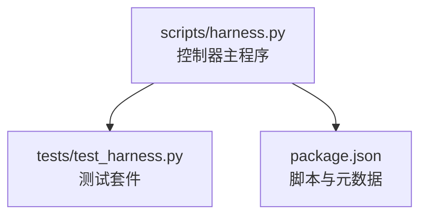
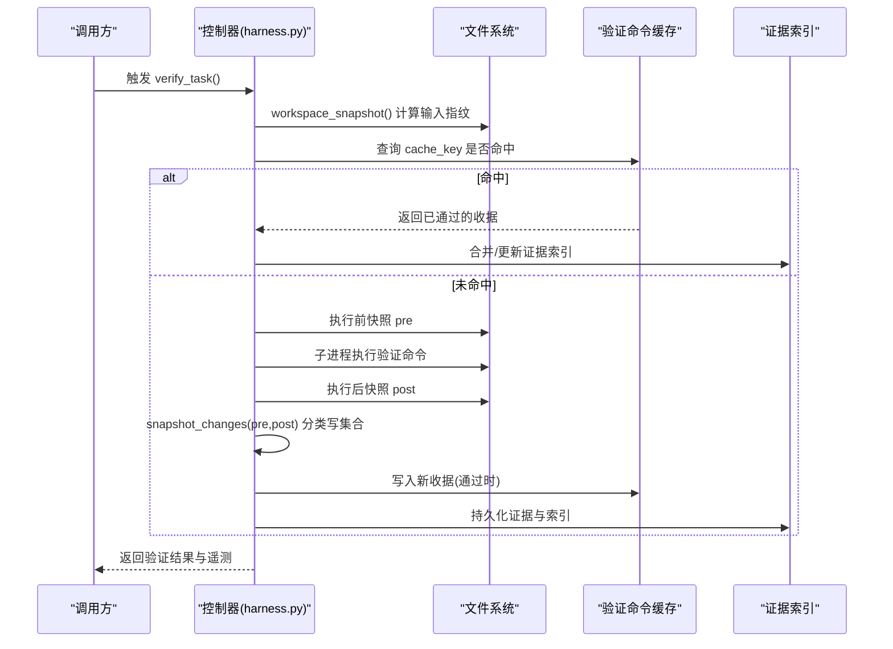
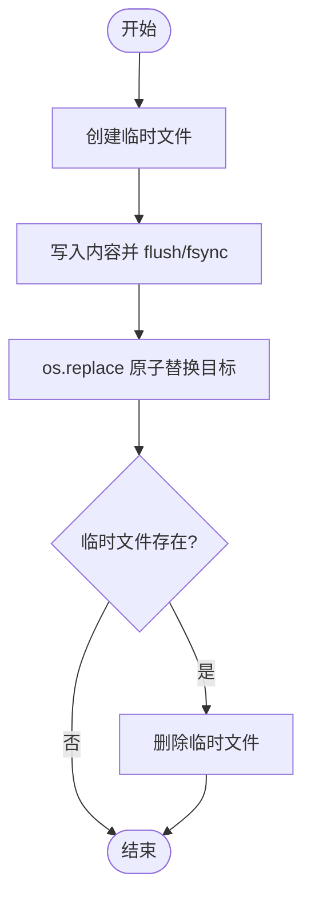
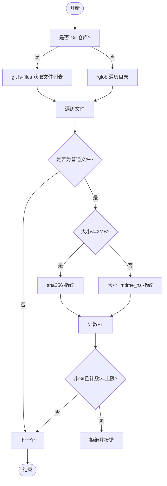
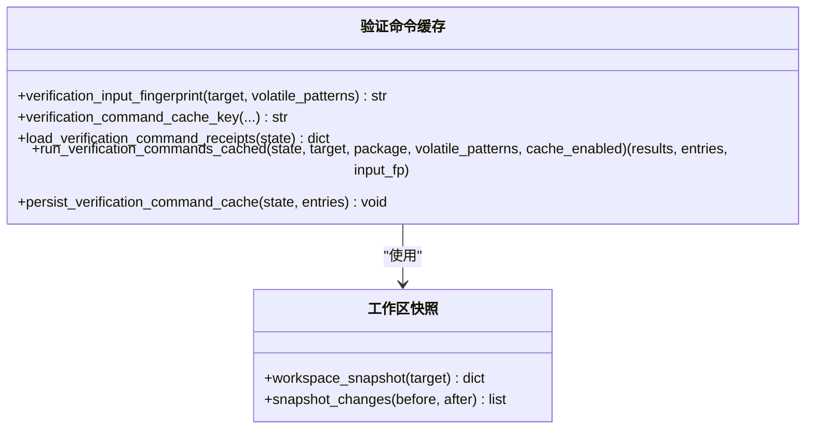
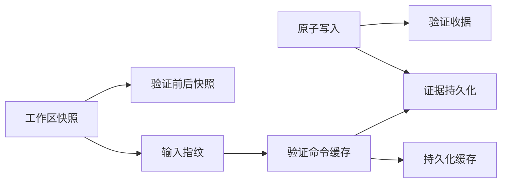

# 资源管理

<cite>
**本文引用的文件**   
- [scripts/harness.py](file://scripts/harness.py)
- [tests/test_harness.py](file://tests/test_harness.py)
- [package.json](file://package.json)
</cite>

## 目录
1. [简介](#简介)
2. [项目结构](#项目结构)
3. [核心组件](#核心组件)
4. [架构总览](#架构总览)
5. [详细组件分析](#详细组件分析)
6. [依赖关系分析](#依赖关系分析)
7. [性能考量](#性能考量)
8. [故障排查指南](#故障排查指南)
9. [结论](#结论)
10. [附录](#附录)

## 简介
本文件面向 Docs Harness 的资源管理机制，聚焦以下目标：
- 文件句柄管理与原子写入、索引更新策略
- 内存使用优化（大文件处理、流式读取、垃圾回收）
- I/O 批处理机制（批量验证命令执行与增量上下文加载）
- 资源清理策略（临时文件、工作区快照、缓存过期）
- 资源监控与调试（内存分析、文件句柄统计、I/O 性能）
- 资源泄漏检测与故障恢复

上述能力由单一控制器脚本实现，并通过测试套件覆盖关键路径。

## 项目结构
- scripts/harness.py：Docs Harness 控制器主程序，包含所有资源管理、I/O、缓存、校验、后台任务等核心逻辑
- tests/test_harness.py：端到端与契约测试，覆盖 Git 预检查/后检查、验证命令缓存、非 Git 快照限制、质量账本等
- package.json：包元数据与脚本入口（self-test、test）

**图表来源**
- [scripts/harness.py:1-120](file://scripts/harness.py#L1-L120)
- [tests/test_harness.py:1-120](file://tests/test_harness.py#L1-L120)
- [package.json:1-23](file://package.json#L1-L23)

**章节来源**
- [scripts/harness.py:1-120](file://scripts/harness.py#L1-L120)
- [tests/test_harness.py:1-120](file://tests/test_harness.py#L1-L120)
- [package.json:1-23](file://package.json#L1-L23)

## 核心组件
- 原子写入与受管 Artifact Store
  - 原子文本/JSON 写入，确保并发安全与幂等更新
  - 受管证据与收据持久化到独立目录，避免污染工作树
- 工作区快照与变更追踪
  - Git 优先的快照采集；非 Git 模式下的降级与上限保护
  - 大文件指纹优化（大小+时间戳），减少内存占用
- 验证命令缓存与批处理
  - 按输入指纹生成键，命中则跳过执行
  - 逐条执行并分类写集合（易变 vs 阻塞）
- 事件与遥测
  - 追加 JSONL 事件，记录上下文加载、验证尝试、命令缓存命中率
- 状态锁与并发控制
  - 基于独占文件的轻量锁，防止同一任务并发修改
- 后台任务与知识同步
  - 增量知识 Job 创建、基线快照、重基线标记与事件记录

**章节来源**
- [scripts/harness.py:422-438](file://scripts/harness.py#L422-L438)
- [scripts/harness.py:1115-1143](file://scripts/harness.py#L1115-L1143)
- [scripts/harness.py:5902-6083](file://scripts/harness.py#L5902-L6083)
- [scripts/harness.py:1034-1074](file://scripts/harness.py#L1034-L1074)
- [scripts/harness.py:1011-1032](file://scripts/harness.py#L1011-L1032)
- [scripts/harness.py:7324-7353](file://scripts/harness.py#L7324-L7353)

## 架构总览
下图展示资源管理在验证流程中的位置与交互：输入指纹计算、缓存命中、命令执行、快照对比、证据持久化与索引更新。

**图表来源**
- [scripts/harness.py:5902-6083](file://scripts/harness.py#L5902-L6083)
- [scripts/harness.py:6085-6133](file://scripts/harness.py#L6085-L6133)
- [scripts/harness.py:1115-1143](file://scripts/harness.py#L1115-L1143)

## 详细组件分析

### 文件句柄管理与原子写入
- 原子写入文本/JSON
  - 使用临时文件 + fsync + os.replace 实现原子替换，失败时清理临时文件
  - 适用于受管 artifact store 的 index/evidence/receipt 等关键文件
- 追加 JSONL
  - 顺序追加并 fsync，保证事件日志不丢失
- 错误处理
  - 统一抛出 HarnessError，携带 code 与 exit_code，便于上层决策

**图表来源**
- [scripts/harness.py:422-438](file://scripts/harness.py#L422-L438)
- [scripts/harness.py:510-516](file://scripts/harness.py#L510-L516)

**章节来源**
- [scripts/harness.py:422-438](file://scripts/harness.py#L422-L438)
- [scripts/harness.py:510-516](file://scripts/harness.py#L510-L516)

### 工作区快照与大文件优化
- Git 优先扫描，非 Git 回退为 rglob
- 大文件指纹优化：超过阈值仅记录大小与时间戳，避免全量读入内存
- 非 Git 快照上限保护：超过文件数阈值直接拒绝，避免截断基线导致不一致
- 排除目录与隐藏目录，降低无关 I/O

**图表来源**
- [scripts/harness.py:1115-1143](file://scripts/harness.py#L1115-L1143)

**章节来源**
- [scripts/harness.py:1115-1143](file://scripts/harness.py#L1115-L1143)

### 验证命令缓存与批处理
- 输入指纹：workspace_snapshot 过滤易变项后的哈希作为缓存键的一部分
- 缓存键：包含 task_id、target_identity、command_argv_digest、cwd、input_fingerprint、contract_digest
- 执行策略：
  - 命中：直接复用通过收据，零 I/O
  - 未命中：pre/post 快照对比，区分易变写与阻塞写，失败时记录 unexpected_write_set
- 持久化：通过收据以 JSONL 形式合并写入，失败不影响既有索引

**图表来源**
- [scripts/harness.py:5902-6083](file://scripts/harness.py#L5902-L6083)
- [scripts/harness.py:1115-1143](file://scripts/harness.py#L1115-L1143)

**章节来源**
- [scripts/harness.py:5902-6083](file://scripts/harness.py#L5902-L6083)

### 证据与索引更新
- 证据收据持久化：通过验证命令或外部证据，生成 EVIDENCE_RECEIPT_SCHEMA 收据
- 索引更新：将证据写入 evidence-index.json，支持后续快速检索与有效性判断
- 绑定与时效：根据 package_fingerprint、target_identity、expires_at 判定可复用性

**章节来源**
- [scripts/harness.py:6085-6133](file://scripts/harness.py#L6085-L6133)

### 状态锁与并发控制
- 基于 .lock 文件的独占锁，带超时检测（超过 5 分钟视为陈旧锁）
- 用于受管 artifact store 的并发写入保护

**章节来源**
- [scripts/harness.py:1011-1032](file://scripts/harness.py#L1011-L1032)

### 事件与遥测
- append_task_event：追加 events.jsonl，记录 context_load_count、readmission_count、evidence_round_count 等
- record_verification_attempt：每次 verify 入口记录有界遥测，不包含正文与凭据

**章节来源**
- [scripts/harness.py:1034-1074](file://scripts/harness.py#L1034-L1074)
- [scripts/harness.py:6410-6447](file://scripts/harness.py#L6410-L6447)

### 后台任务与知识同步
- 增量知识 Job：根据 changed_paths 与 knowledge_context 生成 job.json，设置 allowed_write_scope、forbidden_write_scope
- 基线快照：knowledge_base_snapshot 仅保留 docs/** 范围
- 重基线标记：当基线漂移时标记 needs_rebase，并记录 rebase_changed_paths

**章节来源**
- [scripts/harness.py:7324-7353](file://scripts/harness.py#L7324-L7353)
- [scripts/harness.py:7671-7769](file://scripts/harness.py#L7671-L7769)

## 依赖关系分析
- 模块内依赖
  - 原子写入被证据持久化、验证收据、配置更新等多处使用
  - workspace_snapshot 被输入指纹、验证前后快照、知识基线等使用
  - 验证命令缓存依赖输入指纹、工作区快照、JSONL 读写
- 外部依赖
  - Git 工具链（ls-files、rev-parse、diff、lfs、submodule）
  - 子进程执行验证命令（subprocess.run）

**图表来源**
- [scripts/harness.py:422-438](file://scripts/harness.py#L422-L438)
- [scripts/harness.py:5902-6083](file://scripts/harness.py#L5902-L6083)
- [scripts/harness.py:1115-1143](file://scripts/harness.py#L1115-L1143)

**章节来源**
- [scripts/harness.py:422-438](file://scripts/harness.py#L422-L438)
- [scripts/harness.py:5902-6083](file://scripts/harness.py#L5902-L6083)
- [scripts/harness.py:1115-1143](file://scripts/harness.py#L1115-L1143)

## 性能考量
- 大文件指纹优化：对 >2MB 的文件仅记录大小与 mtime_ns，避免全量读入内存
- 非 Git 快照上限：超过 4096 文件即拒绝，防止大规模遍历导致的内存与 I/O 压力
- 验证命令缓存：默认开启，显著减少重复执行与 I/O
- 事件追加采用 JSONL 顺序写入，避免随机访问开销
- 建议
  - 合理配置 verification.volatile_paths，减少无效快照差异
  - 关闭 command_cache_enabled 仅在调试场景使用
  - 监控 events.jsonl 增长，定期归档

[本节为通用指导，无需引用具体文件]

## 故障排查指南
- 常见错误码与原因
  - missing_file / invalid_json：输入文件缺失或格式错误
  - workspace_snapshot_truncated：非 Git 快照超过上限
  - state_locked / stale_lock：状态锁冲突或陈旧锁
  - git_preflight_failed / git_remote_drift：Git 预检失败或远端漂移
  - verification_command_workspace_write：验证命令产生阻塞写
- 定位步骤
  - 查看 events.jsonl 中最近的事件，关注 reason_code 与 duration_ms
  - 检查 evidence-index.json 与 artifacts/verification/command-receipts.jsonl
  - 确认 .lock 是否存在且未被长时间持有
- 恢复策略
  - 清理陈旧锁后重试
  - 修正验证命令或 volatile_paths 配置
  - 重新提交计划或授权以触发重新准入

**章节来源**
- [scripts/harness.py:1011-1032](file://scripts/harness.py#L1011-L1032)
- [scripts/harness.py:1115-1143](file://scripts/harness.py#L1115-L1143)
- [scripts/harness.py:5902-6083](file://scripts/harness.py#L5902-L6083)
- [scripts/harness.py:6410-6447](file://scripts/harness.py#L6410-L6447)

## 结论
Docs Harness 的资源管理以原子写入、快照指纹、验证缓存为核心，结合事件遥测与状态锁，实现了高可靠、低内存占用的 I/O 与资源生命周期管理。通过严格的 Git 预检/后检与证据索引，保障了变更的可追溯性与一致性。建议在大规模项目中启用验证命令缓存并合理配置易变路径，以获得最佳性能与稳定性。

[本节为总结，无需引用具体文件]

## 附录
- 运行与自检
  - 使用 npm 脚本进行自测与单元测试，确保规则与契约有效
- 参考测试用例
  - Git fetch/sync 预检与后检、非 Git 快照限制、质量账本增查等

**章节来源**
- [package.json:17-21](file://package.json#L17-L21)
- [tests/test_harness.py:503-757](file://tests/test_harness.py#L503-L757)