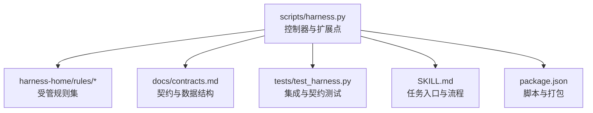
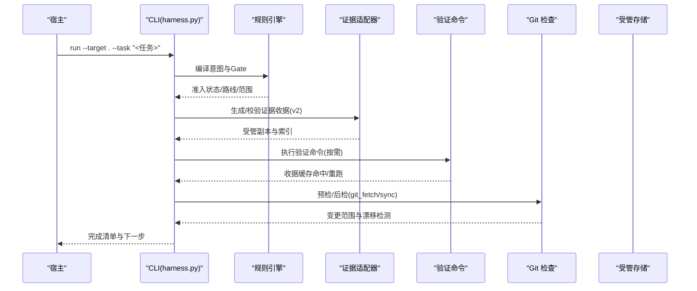
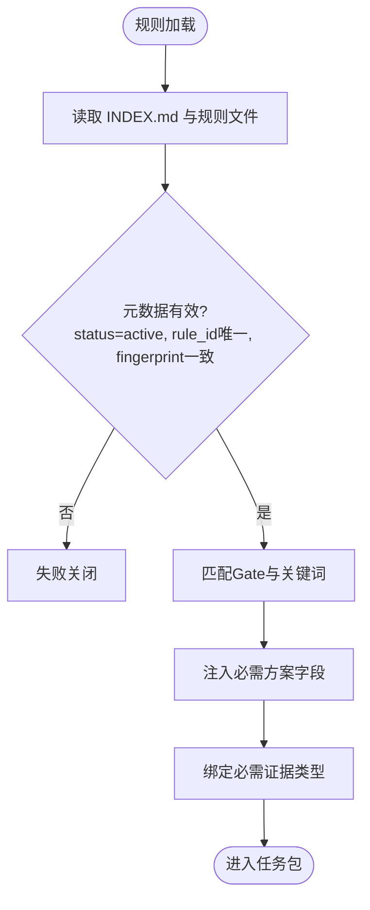
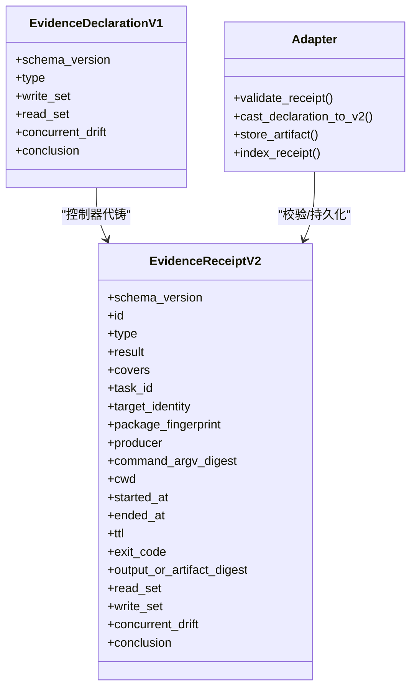
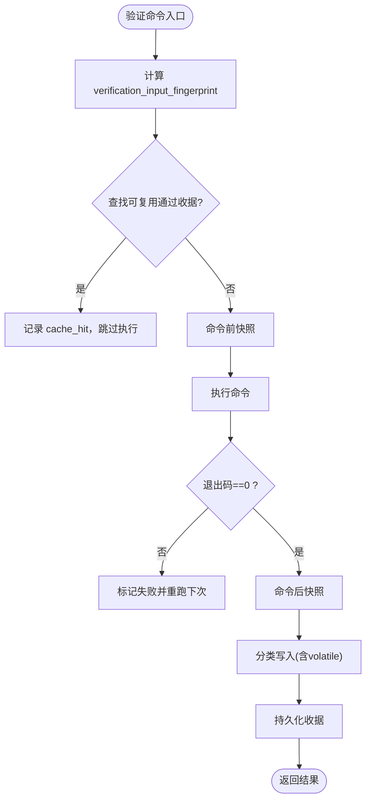
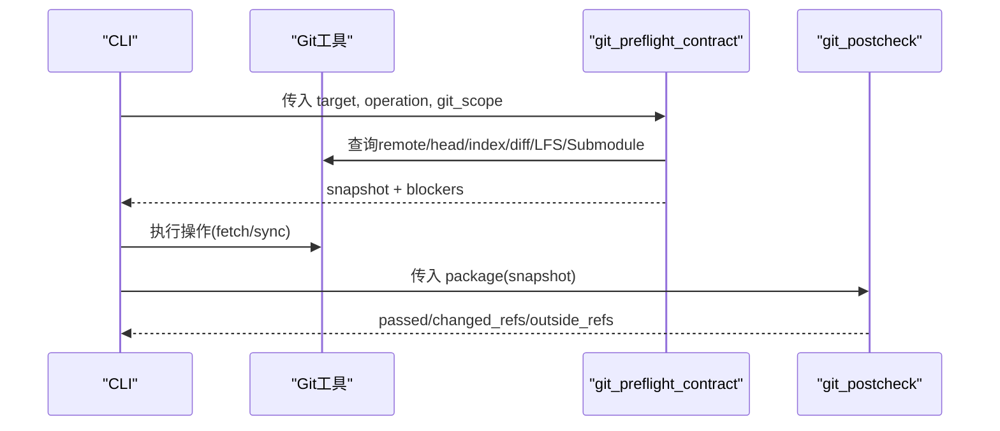
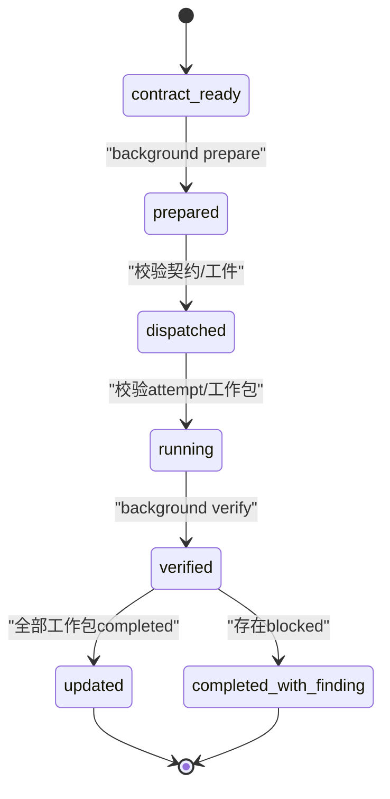
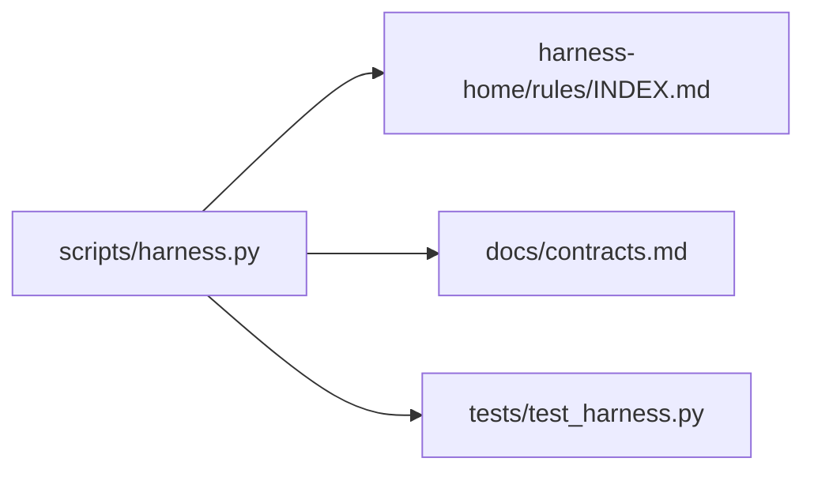

# 扩展开发

<cite>
**本文引用的文件**
- [scripts/harness.py](file://scripts/harness.py)
- [tests/test_harness.py](file://tests/test_harness.py)
- [harness-home/rules/INDEX.md](file://harness-home/rules/INDEX.md)
- [harness-home/rules/_rule-template.md](file://harness-home/rules/_rule-template.md)
- [harness-home/rules/api-compatibility.md](file://harness-home/rules/api-compatibility.md)
- [harness-home/rules/external-input-security.md](file://harness-home/rules/external-input-security.md)
- [harness-home/rules/testing-release.md](file://harness-home/rules/testing-release.md)
- [docs/contracts.md](file://docs/contracts.md)
- [docs/architecture.md](file://docs/architecture.md)
- [SKILL.md](file://SKILL.md)
- [package.json](file://package.json)
</cite>

## 目录
1. [引言](#引言)
2. [项目结构](#项目结构)
3. [核心组件](#核心组件)
4. [架构总览](#架构总览)
5. [详细组件分析](#详细组件分析)
6. [依赖分析](#依赖分析)
7. [性能考虑](#性能考虑)
8. [故障排查指南](#故障排查指南)
9. [结论](#结论)
10. [附录](#附录)

## 引言
本文件面向 Docs Harness 的扩展开发者，系统性阐述插件架构与扩展点：规则引擎扩展点、证据适配器模式、自定义验证命令开发；并给出完整的开发示例（自定义规则、证据处理器、验证命令）、扩展测试策略、调试方法与部署指南。读者无需深入源码即可理解如何安全、可演进地扩展 Docs Harness 的行为。

## 项目结构
Docs Harness 以单文件控制器为核心，配合受管规则集与契约文档，形成“控制器 + 规则 + 契约”的可扩展体系：
- scripts/harness.py：任务准入、上下文、验收、Git 交付检查、后台治理状态机与扩展点实现。
- harness-home/rules/*：发布包内受管规则快照，通过 INDEX.md 声明生效规则与加载约定。
- docs/contracts.md：对外行为与数据合同（任务包、证据收据、Git 状态、验收分层等）。
- tests/test_harness.py：覆盖 CLI、规则激活、Git 预检/后检、证据与命令缓存等关键路径。
- SKILL.md：任务入口、准入与验收流程要点。
- package.json：脚本与打包清单。

**图表来源**
- [scripts/harness.py:1-120](file://scripts/harness.py#L1-L120)
- [harness-home/rules/INDEX.md:1-41](file://harness-home/rules/INDEX.md#L1-L41)
- [docs/contracts.md:1-370](file://docs/contracts.md#L1-L370)
- [tests/test_harness.py:1-120](file://tests/test_harness.py#L1-L120)
- [SKILL.md:1-105](file://SKILL.md#L1-L105)
- [package.json:1-23](file://package.json#L1-L23)

**章节来源**
- [scripts/harness.py:1-120](file://scripts/harness.py#L1-L120)
- [harness-home/rules/INDEX.md:1-41](file://harness-home/rules/INDEX.md#L1-L41)
- [docs/contracts.md:1-120](file://docs/contracts.md#L1-L120)
- [tests/test_harness.py:1-120](file://tests/test_harness.py#L1-L120)
- [SKILL.md:1-60](file://SKILL.md#L1-L60)
- [package.json:1-23](file://package.json#L1-L23)

## 核心组件
- 规则引擎扩展点
  - Gate 定义与匹配：GATE_DEFS、FLOOR_TERMS、SAFETY_FLOOR_GATES 决定风险门控与强制底线。
  - 规则发现与激活：harness-home/rules/INDEX.md 声明 active_rules，规则文件需 status: active、唯一 rule_id、content_fingerprint 校验。
  - 规则影响范围：gates、keywords、plan_fields、evidence_types、failure_mode 驱动方案字段、证据类型与失败处理。
- 证据适配器模式
  - 证据收据 v2：docs-harness/evidence-receipt/v2，绑定 task/target/package/producer/command 指纹等。
  - 可信生产者白名单：TRUSTED_EVIDENCE_PRODUCERS，高风险证据类型 HIGH_RISK_EVIDENCE_TYPES 必须来自可信 v2 生产者。
  - 宿主声明草案：docs-harness/evidence-declaration/v1，由控制器代铸为完整 v2 收据。
  - 自动归因：workspace_attribution 在允许范围内未归因写入时自动认领。
- 验证命令与缓存
  - 验证命令收据：docs-harness/verification-command-receipt/v1，按 argv/produces/input fingerprint 复用。
  - volatile_paths：允许临时副产物白名单，越界或绝对路径失败关闭。
  - 五级处置：provide_evidence/refresh_evidence/retry_verification/incremental_admission/full_readmission。
- Git 交付检查
  - git_preflight_contract/git_postcheck：预检/后检确保只读、只改声明 refs、fast-forward、LFS/Submodule 可用等。
- 后台治理
  - background_* 命令与状态机：prepare/dispatched/running/progress/verify 严格顺序与工件校验。

**章节来源**
- [scripts/harness.py:240-390](file://scripts/harness.py#L240-L390)
- [scripts/harness.py:677-791](file://scripts/harness.py#L677-L791)
- [docs/contracts.md:165-246](file://docs/contracts.md#L165-L246)
- [harness-home/rules/INDEX.md:1-41](file://harness-home/rules/INDEX.md#L1-L41)

## 架构总览
Docs Harness 的扩展能力围绕“规则 + 证据 + 命令”三要素展开，控制器作为编排中枢，将意图、Gate、范围、上下文、授权、证据与验收串联成可审计流水线。

**图表来源**
- [scripts/harness.py:1-120](file://scripts/harness.py#L1-L120)
- [docs/contracts.md:1-120](file://docs/contracts.md#L1-L120)
- [SKILL.md:25-60](file://SKILL.md#L25-L60)

## 详细组件分析

### 规则引擎扩展点
- 规则发现与激活
  - 通过 harness-home/rules/INDEX.md 的 active_rules 列表与每个规则的 content_fingerprint 保证一致性。
  - 规则文件需包含 status、rule_id、content_fingerprint、gates、keywords、plan_fields、evidence_types、failure_mode。
- Gate 匹配与底线
  - GATE_DEFS 提供通用词表与事实/方案字段/证据类型映射。
  - SAFETY_FLOOR_GATES 与 FLOOR_TERMS 对安全相关 Gate 使用精确词表与否定守卫，宿主声明不可豁免。
- 规则影响
  - gates：触发 Gate 集合；keywords：自然语言匹配；plan_fields：强制方案字段；evidence_types：必需证据类型；failure_mode：失败处理策略。

**图表来源**
- [harness-home/rules/INDEX.md:1-41](file://harness-home/rules/INDEX.md#L1-L41)
- [harness-home/rules/_rule-template.md:1-21](file://harness-home/rules/_rule-template.md#L1-L21)
- [scripts/harness.py:273-342](file://scripts/harness.py#L273-L342)

**章节来源**
- [harness-home/rules/INDEX.md:1-41](file://harness-home/rules/INDEX.md#L1-L41)
- [harness-home/rules/_rule-template.md:1-21](file://harness-home/rules/_rule-template.md#L1-L21)
- [scripts/harness.py:273-390](file://scripts/harness.py#L273-L390)

### 证据适配器模式
- 收据 v2 与可信生产者
  - 所有新任务证据采用 docs-harness/evidence-receipt/v2，绑定 task/target/package/producer/command 指纹等。
  - TRUSTED_EVIDENCE_PRODUCERS 白名单控制可信来源；HIGH_RISK_EVIDENCE_TYPES 要求更高信任等级。
- 宿主声明草案
  - 支持 docs-harness/evidence-declaration/v1，控制器代铸完整 v2 收据，producer 记 ("docs-harness", "host_declaration")。
- 自动归因
  - 当 write_scope 内存在未归因写入且合同稳定时，控制器默认代铸 workspace_attribution 收据自动认领。

**图表来源**
- [docs/contracts.md:165-246](file://docs/contracts.md#L165-L246)
- [scripts/harness.py:240-258](file://scripts/harness.py#L240-L258)

**章节来源**
- [docs/contracts.md:165-246](file://docs/contracts.md#L165-L246)
- [scripts/harness.py:240-258](file://scripts/harness.py#L240-L258)

### 自定义验证命令开发
- 命令声明与收据
  - 使用 docs-harness/verification-command-receipt/v1，按 argv/produces/input fingerprint 绑定。
  - produces 只能使用证据白名单；退出码 0、输出摘要与工作区无额外交付写入方可生成收据。
- 缓存与重跑
  - 输入不变则复用通过收据；输入变化或上次失败则重跑；volatile 新建不影响通过但同名已有文件修改仍阻断。
- 配置项
  - verification.volatile_paths：追加带固定根目录的 glob 白名单；verification.command_cache_enabled=false 关闭缓存。

**图表来源**
- [docs/contracts.md:190-221](file://docs/contracts.md#L190-L221)

**章节来源**
- [docs/contracts.md:190-221](file://docs/contracts.md#L190-L221)

### Git 交付检查扩展点
- 预检与后检
  - git_preflight_contract：生成 snapshot，校验 LFS/Submodule、fast-forward、脏工作区、删除阈值等。
  - git_postcheck：对比远端目标、ref 漂移、controlled refs 命名空间，判定是否越界。
- 范围与漂移
  - git_sync_landed_scope：累积 pull 落盘文件并入 write_scope；origin/HEAD 更新不再误判 ref 越界。

**图表来源**
- [scripts/harness.py:677-791](file://scripts/harness.py#L677-L791)

**章节来源**
- [scripts/harness.py:677-791](file://scripts/harness.py#L677-L791)

### 后台治理扩展点
- 状态机与工件
  - prepare/dispatched/running/progress/verify 严格顺序；job.json/plan.json/progress.json/events.jsonl 属于控制面，仅 CLI 写入。
- 复杂路线
  - background_goal/background_goal_phased：先建立持续目标与正式方案，再执行工作包；控制器复验绑定、attempt、工作包全集与指纹。

**图表来源**
- [docs/contracts.md:305-348](file://docs/contracts.md#L305-L348)

**章节来源**
- [docs/contracts.md:305-348](file://docs/contracts.md#L305-L348)

## 依赖分析
- 控制器与规则
  - 控制器通过 INDEX.md 与规则文件内容指纹强约束规则集；任何缺失、增加或变化均失败关闭。
- 控制器与契约
  - 所有数据结构与行为遵循 docs/contracts.md；违反即失败关闭。
- 控制器与测试
  - tests/test_harness.py 覆盖 CLI、规则激活、Git 预检/后检、证据与命令缓存等关键路径。

**图表来源**
- [scripts/harness.py:1-120](file://scripts/harness.py#L1-L120)
- [harness-home/rules/INDEX.md:1-41](file://harness-home/rules/INDEX.md#L1-L41)
- [docs/contracts.md:1-120](file://docs/contracts.md#L1-L120)
- [tests/test_harness.py:1-120](file://tests/test_harness.py#L1-L120)

**章节来源**
- [scripts/harness.py:1-120](file://scripts/harness.py#L1-L120)
- [harness-home/rules/INDEX.md:1-41](file://harness-home/rules/INDEX.md#L1-L41)
- [docs/contracts.md:1-120](file://docs/contracts.md#L1-L120)
- [tests/test_harness.py:1-120](file://tests/test_harness.py#L1-L120)

## 性能考虑
- 验证命令逐项收据与复用：避免重复执行昂贵命令，仅重跑失败或输入变化的命令。
- 五级处置减少不必要重新准入：仅在高风险或合同变化时 full_readmission。
- 上下文与授权收据复用：跨阶段复用正文，授权绑定当前 package fingerprint，避免冗余加载。
- Git 预检/后检最小化副作用：只改声明 refs，避免全仓扫描。

[本节为通用指导，不直接分析具体文件]

## 故障排查指南
- 常见错误与退出码
  - 0：成功；只有 verify.result=完成表示父任务完成。
  - 1：项目检查、自检或完整性读取失败。
  - 2：输入、合同、绑定或状态无效。
  - 3：需要方案、授权、证据（含 provide_evidence/refresh_evidence）、迁移、用户输入或 Git 交付。
  - 4：范围、漂移、Gate、远端、授权或规则变化，必须重新准入。
- 典型问题定位
  - 规则缺失或指纹漂移：检查 harness-home/rules/INDEX.md 与规则文件 content_fingerprint。
  - 证据不可信或过期：核对 producer 是否在 TRUSTED_EVIDENCE_PRODUCERS 中，TTL 与 package fingerprint 是否匹配。
  - 验证命令失败：查看 command_argv_digest、produces 白名单、volatile_paths 配置与工作区写入。
  - Git 同步失败：检查 fast-forward、LFS/Submodule 可用性、dirty 重叠与删除阈值。

**章节来源**
- [docs/contracts.md:359-370](file://docs/contracts.md#L359-L370)
- [scripts/harness.py:240-258](file://scripts/harness.py#L240-L258)
- [scripts/harness.py:677-791](file://scripts/harness.py#L677-L791)

## 结论
Docs Harness 的扩展体系以“规则 + 证据 + 命令”为核心，通过严格的契约与指纹机制保障可扩展性与安全性。开发者应遵循规则模板、证据收据与验证命令规范，结合五级处置与命令缓存提升效率，并在 Git 交付检查与后台治理中保持最小权限与确定性。

[本节为总结性内容，不直接分析具体文件]

## 附录

### 扩展点注册机制（插件发现、依赖管理与生命周期）
- 插件发现
  - 规则发现：harness-home/rules/INDEX.md 声明 active_rules；控制器按 content_fingerprint 校验一致性。
  - 证据适配器：通过 TRUSTED_EVIDENCE_PRODUCERS 白名单与证据类型白名单控制接入。
  - 验证命令：通过 produces 白名单与 argv/输入指纹绑定，控制器管理缓存与重跑。
- 依赖管理
  - 规则依赖 Gate 与计划字段；证据依赖 package fingerprint 与可信生产者；命令依赖输入指纹与 volatile_paths。
- 生命周期控制
  - 任务生命周期：run → context → plan → action → verify；每阶段收据与指纹约束复用边界。
  - 后台 Job 生命周期：contract_ready → prepare → dispatched → running → progress → verify → 终态。

**章节来源**
- [harness-home/rules/INDEX.md:1-41](file://harness-home/rules/INDEX.md#L1-L41)
- [docs/contracts.md:1-120](file://docs/contracts.md#L1-L120)
- [scripts/harness.py:240-258](file://scripts/harness.py#L240-L258)

### 开发示例

#### 自定义规则开发
- 步骤
  - 在 harness-home/rules/ 新增规则文件，填写 _rule-template.md 元数据与正文。
  - 在 INDEX.md 的 active_rules 中添加 rule_id，并确保 content_fingerprint 正确。
  - 通过 self-test 与单元测试验证规则激活与影响。
- 关键点
  - gates/keywords/plan_fields/evidence_types/failure_mode 必须准确描述影响范围与失败处理。

**章节来源**
- [harness-home/rules/_rule-template.md:1-21](file://harness-home/rules/_rule-template.md#L1-L21)
- [harness-home/rules/INDEX.md:1-41](file://harness-home/rules/INDEX.md#L1-L41)
- [tests/test_harness.py:339-354](file://tests/test_harness.py#L339-L354)

#### 证据处理器实现
- 步骤
  - 选择证据类型（如 test_result/security_acceptance），确保在 produces 白名单内。
  - 生成 docs-harness/evidence-receipt/v2 或 docs-harness/evidence-declaration/v1 草案。
  - 提交至 verify，控制器代铸/校验/索引/存储受管副本。
- 关键点
  - 高风险证据类型必须来自可信 v2 生产者；TTL、package fingerprint、cwd 必须正确。

**章节来源**
- [docs/contracts.md:165-246](file://docs/contracts.md#L165-L246)
- [scripts/harness.py:240-258](file://scripts/harness.py#L240-L258)

#### 验证命令编写
- 步骤
  - 声明 argv 与 produces；确保退出码 0、输出摘要与工作区无额外交付写入。
  - 如需临时副产物，配置 verification.volatile_paths；必要时关闭缓存 verification.command_cache_enabled=false。
- 关键点
  - 输入指纹变化导致缓存失效；只重跑失败或输入变化的命令。

**章节来源**
- [docs/contracts.md:190-221](file://docs/contracts.md#L190-L221)

### 测试策略
- 单元与集成测试
  - 使用 tests/test_harness.py 中的 run_harness/run_installed_harness 封装 CLI 调用。
  - 覆盖规则激活、Git 预检/后检、证据与命令缓存、背景 Job 状态机等关键路径。
- 自测与契约校验
  - 使用 self-test 与 package.json 脚本进行自检与打包检查。

**章节来源**
- [tests/test_harness.py:1-120](file://tests/test_harness.py#L1-L120)
- [package.json:17-22](file://package.json#L17-L22)

### 调试方法
- 启用 JSON 输出：所有 CLI 命令加 --json 便于结构化解析。
- 关注事件与收据：events.jsonl 与 evidence-index.json 提供审计线索。
- 缩小范围：通过 scope/write_scope/git_scope 限制影响面，快速定位问题。

**章节来源**
- [tests/test_harness.py:59-87](file://tests/test_harness.py#L59-L87)
- [docs/contracts.md:283-302](file://docs/contracts.md#L283-L302)

### 部署指南
- 安装与升级
  - 使用 project init/project upgrade --apply 复制受管规则快照到目标项目。
  - 确保 rules_root 指向 .docs-harness/harness-home/rules，并保持版本一致。
- 运行与验收
  - 通过 run/verify 完成任务准入与验收；只有 verify.result=完成表示父任务完成。

**章节来源**
- [SKILL.md:13-24](file://SKILL.md#L13-L24)
- [SKILL.md:43-51](file://SKILL.md#L43-L51)