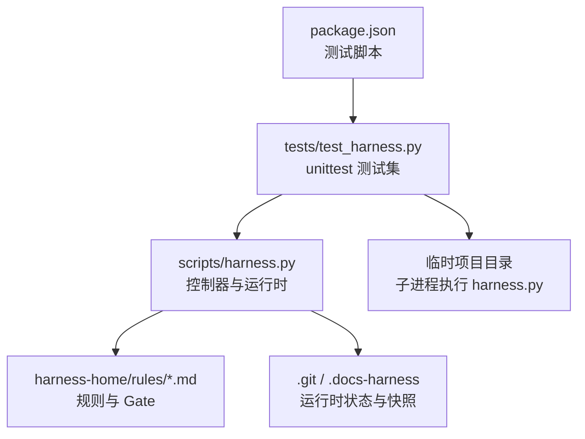
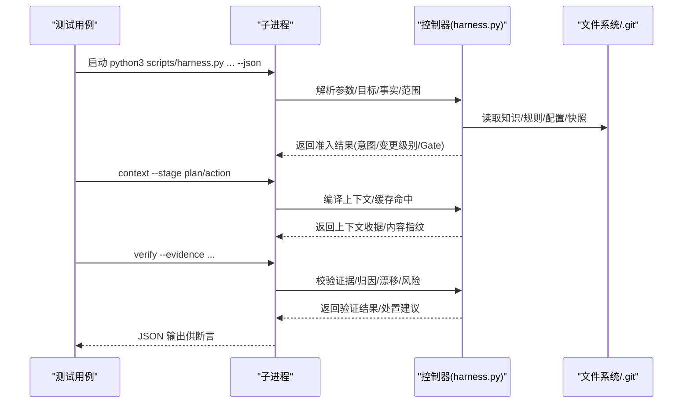
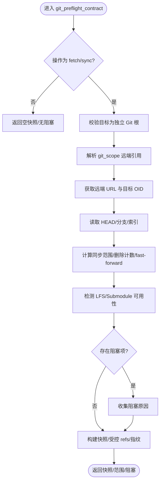
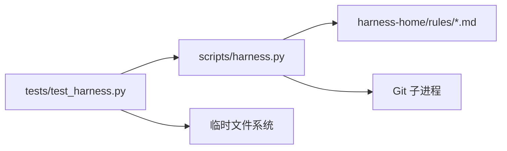

# 扩展测试与调试

<cite>
**本文引用的文件**
- [tests/test_harness.py](file://tests/test_harness.py)
- [scripts/harness.py](file://scripts/harness.py)
- [package.json](file://package.json)
- [docs/testing.md](file://docs/testing.md)
- [harness-home/rules/INDEX.md](file://harness-home/rules/INDEX.md)
- [harness-home/rules/testing-release.md](file://harness-home/rules/testing-release.md)
- [SKILL.md](file://SKILL.md)
</cite>

## 目录
1. [简介](#简介)
2. [项目结构](#项目结构)
3. [核心组件](#核心组件)
4. [架构总览](#架构总览)
5. [详细组件分析](#详细组件分析)
6. [依赖关系分析](#依赖关系分析)
7. [性能考量](#性能考量)
8. [故障排查指南](#故障排查指南)
9. [结论](#结论)
10. [附录](#附录)

## 简介
本文件面向 Docs Harness 的扩展测试与调试，系统性说明如何编写单元测试、设计集成测试、构造模拟对象；如何使用日志、断点与性能剖析定位问题；如何管理测试数据（用例设计、准备与清理）；如何在持续集成中配置自动化流水线、质量门禁与报告生成。文档同时给出规则测试、适配器测试、命令测试的最佳实践示例路径，并总结常见问题诊断、性能瓶颈分析与内存泄漏检测技巧。

## 项目结构
- 测试入口与脚本
  - Python 测试套件位于 tests/test_harness.py，基于 unittest 组织大量契约与行为测试。
  - package.json 提供 npm test、self-test、pack:check 等脚本，统一触发测试与自检。
- 控制器与运行时
  - scripts/harness.py 为独立任务控制器，定义版本、Schema、Gate、意图、变更级别、Git 预检/后检查、事件与证据协议等核心逻辑。
- 规则与策略
  - harness-home/rules 包含生效规则索引与具体规则，如 testing-release.md 约束测试放行条件。
- 测试事实与验收分层
  - docs/testing.md 描述自动化入口、验收分层与事实来源。
- 技能说明
  - SKILL.md 概述安装、任务入口、后台治理、质量账本与按需读取等使用要点。

图表来源
- [package.json:17-21](file://package.json#L17-L21)
- [tests/test_harness.py:47-87](file://tests/test_harness.py#L47-L87)
- [scripts/harness.py:26-50](file://scripts/harness.py#L26-L50)
- [harness-home/rules/INDEX.md:1-41](file://harness-home/rules/INDEX.md#L1-L41)

章节来源
- [package.json:1-23](file://package.json#L1-L23)
- [docs/testing.md:1-25](file://docs/testing.md#L1-L25)
- [SKILL.md:1-106](file://SKILL.md#L1-L106)

## 核心组件
- 测试框架与基类
  - 使用 unittest.TestCase 作为基类，封装临时项目创建、清理、子进程运行 harness.py、JSON 读写、快照对比等通用能力。
- 控制器与协议
  - 控制器暴露 run、context、verify、background、project 等命令，严格遵循 v2 任务包、事件、证据、冻结、授权等 Schema。
- 规则系统
  - 通过 INDEX.md 声明生效规则，testing-release.md 定义测试放行 Gate、关键词、方案字段与证据类型。

章节来源
- [tests/test_harness.py:47-106](file://tests/test_harness.py#L47-L106)
- [scripts/harness.py:26-50](file://scripts/harness.py#L26-L50)
- [harness-home/rules/INDEX.md:1-41](file://harness-home/rules/INDEX.md#L1-L41)
- [harness-home/rules/testing-release.md:1-29](file://harness-home/rules/testing-release.md#L1-L29)

## 架构总览
Docs Harness 的测试与执行流程围绕“任务准入—上下文—执行—验证”闭环展开，测试通过子进程调用控制器，构造临时项目与证据，断言返回结构与状态机转换。

图表来源
- [tests/test_harness.py:59-87](file://tests/test_harness.py#L59-L87)
- [scripts/harness.py:2229-2435](file://scripts/harness.py#L2229-L2435)

## 详细组件分析

### 测试框架与用例设计
- 基类能力
  - setUp/tearDown：创建临时目录、初始化项目、清理环境。
  - run_harness/run_installed_harness：以子进程方式执行控制器，捕获 stdout JSON 并断言返回码。
  - write_json/evidence/quality_review：构造输入与证据文件，支持 read_set、changed_paths、concurrent_drift、producer 等字段。
  - bootstrap_knowledge/init_project：构建最小知识骨架与治理真源，确保可复现。
- 典型测试类别
  - 规则自测与激活：校验规则索引与 active 状态、ID 与指纹。
  - 安装与升级：校验 portable 安装、缺失规则失败关闭、preserve-and-merge、版本标记迁移。
  - Git 操作：fetch/sync/inspect 的预检与后检查、脏工作区与非快进阻断、LFS/Submodule 可用性。
  - 证据与归因：跨包绑定拒绝、不可信 producer、过期证据、未归因写入、并发漂移、读集合指纹漂移。
  - 任务生命周期：v1/v2 迁移、遥测事件边界、回滚检查、克隆就绪性。
- 最佳实践
  - 每个测试聚焦单一职责，使用临时项目隔离副作用。
  - 明确 expected 返回码，断言关键路径字段与状态机转换。
  - 使用 snapshot_tree 对文件树进行稳定比对，避免非确定性差异。

章节来源
- [tests/test_harness.py:47-106](file://tests/test_harness.py#L47-L106)
- [tests/test_harness.py:339-354](file://tests/test_harness.py#L339-L354)
- [tests/test_harness.py:356-376](file://tests/test_harness.py#L356-L376)
- [tests/test_harness.py:377-406](file://tests/test_harness.py#L377-L406)
- [tests/test_harness.py:503-536](file://tests/test_harness.py#L503-L536)
- [tests/test_harness.py:651-684](file://tests/test_harness.py#L651-L684)
- [tests/test_harness.py:736-757](file://tests/test_harness.py#L736-L757)
- [tests/test_harness.py:808-875](file://tests/test_harness.py#L808-L875)
- [tests/test_harness.py:907-948](file://tests/test_harness.py#L907-L948)
- [tests/test_harness.py:950-972](file://tests/test_harness.py#L950-L972)
- [tests/test_harness.py:973-983](file://tests/test_harness.py#L973-L983)
- [tests/test_harness.py:984-1051](file://tests/test_harness.py#L984-L1051)
- [tests/test_harness.py:1052-1121](file://tests/test_harness.py#L1052-L1121)
- [tests/test_harness.py:1122-1163](file://tests/test_harness.py#L1122-L1163)
- [tests/test_harness.py:1164-1189](file://tests/test_harness.py#L1164-L1189)
- [tests/test_harness.py:1190-1221](file://tests/test_harness.py#L1190-L1221)
- [tests/test_harness.py:1222-1284](file://tests/test_harness.py#L1222-L1284)
- [tests/test_harness.py:1285-1364](file://tests/test_harness.py#L1285-L1364)
- [tests/test_harness.py:1365-1394](file://tests/test_harness.py#L1365-L1394)
- [tests/test_harness.py:1395-1420](file://tests/test_harness.py#L1395-L1420)
- [tests/test_harness.py:1421-1524](file://tests/test_harness.py#L1421-L1524)
- [tests/test_harness.py:1525-1532](file://tests/test_harness.py#L1525-L1532)
- [tests/test_harness.py:1533-1561](file://tests/test_harness.py#L1533-L1561)
- [tests/test_harness.py:1562-1582](file://tests/test_harness.py#L1562-L1582)
- [tests/test_harness.py:1583-1599](file://tests/test_harness.py#L1583-L1599)

### 控制器与运行时（调试重点）
- 关键常量与协议
  - 版本、Schema、Gate 定义、意图与变更级别映射、Git 预检/后检查、事件与证据协议、遥测字段。
- 错误处理
  - HarnessError 携带 code 与 exit_code，用于失败关闭与可观测性。
- 调试切入点
  - git_command/git_preflight_contract/git_postcheck：Git 相关异常与超时、远端不可用、LFS/Submodule 检测。
  - load_input_file/load_json_object_file：输入大小限制、内联输入拒绝、JSON 校验。
  - file_fingerprint/target_identity/environment_fingerprint：指纹与环境一致性。
  - append_jsonl/read_jsonl：事件追加与读取健壮性。
- 性能关注
  - 大文件指纹计算、JSONL 追加、快照遍历、Git 子进程调用耗时。

图表来源
- [scripts/harness.py:680-794](file://scripts/harness.py#L680-L794)

章节来源
- [scripts/harness.py:395-400](file://scripts/harness.py#L395-L400)
- [scripts/harness.py:449-508](file://scripts/harness.py#L449-L508)
- [scripts/harness.py:575-586](file://scripts/harness.py#L575-L586)
- [scripts/harness.py:680-794](file://scripts/harness.py#L680-L794)
- [scripts/harness.py:796-800](file://scripts/harness.py#L796-L800)
- [scripts/harness.py:414-420](file://scripts/harness.py#L414-L420)
- [scripts/harness.py:601-613](file://scripts/harness.py#L601-L613)
- [scripts/harness.py:1239-1245](file://scripts/harness.py#L1239-L1245)
- [scripts/harness.py:510-533](file://scripts/harness.py#L510-L533)

### 规则系统与测试放行
- 规则索引与激活
  - INDEX.md 声明 active_rules、加载约定、激活条件与指纹校验。
- 测试放行规则
  - testing-release.md 定义 Gate、关键词、必需方案字段、证据类型与失败模式。
- 测试覆盖要点
  - 规则缺失或为空时失败关闭；Windows PowerShell 路径规范化与规则匹配；仅只读查询不升级变更级别。

章节来源
- [harness-home/rules/INDEX.md:1-41](file://harness-home/rules/INDEX.md#L1-L41)
- [harness-home/rules/testing-release.md:1-29](file://harness-home/rules/testing-release.md#L1-L29)
- [tests/test_harness.py:1190-1221](file://tests/test_harness.py#L1190-L1221)
- [tests/test_harness.py:1379-1394](file://tests/test_harness.py#L1379-L1394)

### 命令测试与集成测试
- 命令入口
  - run/context/verify/background/project/task 等命令在测试中以子进程形式调用，--json 输出便于断言。
- 集成场景
  - Git fetch/sync/inspect 端到端流程；fresh clone 与交付就绪；安装/升级幂等与 preserve-and-merge。
- 断言策略
  - 返回码、admission_status、mutation_profile、write_scope、git_scope、matched_gates、control_status、git_postcheck、reason_code、next_action 等关键字段。

章节来源
- [tests/test_harness.py:59-87](file://tests/test_harness.py#L59-L87)
- [tests/test_harness.py:503-536](file://tests/test_harness.py#L503-L536)
- [tests/test_harness.py:651-684](file://tests/test_harness.py#L651-L684)
- [tests/test_harness.py:1285-1364](file://tests/test_harness.py#L1285-L1364)
- [tests/test_harness.py:1395-1420](file://tests/test_harness.py#L1395-L1420)

### 模拟对象与外部依赖
- 子进程与 Git
  - 通过 subprocess.run 调用 git 命令，测试中可 mock git_command 注入不可用场景（LFS/Submodule）。
- 文件系统
  - 使用 tempfile.TemporaryDirectory 隔离项目，snapshot_tree 生成稳定快照。
- JSON 输入/输出
  - write_json/evidence/quality_review 构造结构化输入，断言 JSON 结构与字段。

章节来源
- [tests/test_harness.py:50-57](file://tests/test_harness.py#L50-L57)
- [tests/test_harness.py:94-106](file://tests/test_harness.py#L94-L106)
- [tests/test_harness.py:736-757](file://tests/test_harness.py#L736-L757)

### 调试工具与方法
- 日志分析
  - events.jsonl 记录阶段、时间、耗时、原因码、证据轮次、宿主收据数等，用于回溯与审计。
- 断点调试
  - 在控制器关键函数（git_preflight_contract、load_input_file、append_jsonl/read_jsonl、file_fingerprint）设置断点，观察输入、异常与返回值。
- 性能剖析
  - 针对大文件指纹、JSONL 追加、Git 子进程调用进行计时与采样，识别热点路径。
- 常见错误定位
  - HarnessError.code 与 exit_code 快速定位失败原因；git_preflight_timeout、git_remote_unavailable、invalid_git_scope 等。

章节来源
- [scripts/harness.py:510-533](file://scripts/harness.py#L510-L533)
- [scripts/harness.py:575-586](file://scripts/harness.py#L575-L586)
- [scripts/harness.py:414-420](file://scripts/harness.py#L414-L420)
- [tests/test_harness.py:1122-1163](file://tests/test_harness.py#L1122-L1163)

### 测试数据管理
- 用例设计
  - 按功能域拆分：安装/升级、Git 操作、证据与归因、规则与 Gate、任务生命周期。
- 数据准备
  - bootstrap_knowledge 构建最小知识骨架；init_project 初始化治理真源；evidence/quality_review 构造证据与质量记录。
- 清理策略
  - tearDown 清理临时目录；snapshot_tree 保证比较稳定性；避免污染全局状态。

章节来源
- [tests/test_harness.py:108-163](file://tests/test_harness.py#L108-L163)
- [tests/test_harness.py:248-304](file://tests/test_harness.py#L248-L304)
- [tests/test_harness.py:306-323](file://tests/test_harness.py#L306-L323)
- [tests/test_harness.py:50-57](file://tests/test_harness.py#L50-L57)

### 持续集成配置
- 自动化测试
  - npm test 触发 unittest discover；npm run self-test 执行控制器自检；npm run pack:check 检查打包清单。
- 质量门禁
  - 要求完整回归、自检与打包检查通过；Git 提交前需满足 delivery_status/in_head 与 clone_ready。
- 报告生成
  - 利用 events.jsonl 与 verify 输出生成可审计报告；结合 CI 平台聚合测试结果与覆盖率。

章节来源
- [package.json:17-21](file://package.json#L17-L21)
- [docs/testing.md:1-25](file://docs/testing.md#L1-L25)
- [tests/test_harness.py:1285-1364](file://tests/test_harness.py#L1285-L1364)

## 依赖关系分析
- 测试对控制器的依赖
  - 通过子进程调用 scripts/harness.py，依赖其 CLI 与内部模块导出（VERSION、函数）。
- 控制器对规则的依赖
  - 加载 harness-home/rules 下的规则索引与具体规则，校验 active 状态与指纹。
- 控制器对 Git 的依赖
  - 通过 git_command 调用 Git，处理远端、引用、LFS/Submodule、diff/name-status 等。

图表来源
- [tests/test_harness.py:59-87](file://tests/test_harness.py#L59-L87)
- [scripts/harness.py:575-586](file://scripts/harness.py#L575-L586)
- [harness-home/rules/INDEX.md:1-41](file://harness-home/rules/INDEX.md#L1-L41)

章节来源
- [tests/test_harness.py:59-87](file://tests/test_harness.py#L59-L87)
- [scripts/harness.py:575-586](file://scripts/harness.py#L575-L586)
- [harness-home/rules/INDEX.md:1-41](file://harness-home/rules/INDEX.md#L1-L41)

## 性能考量
- 大文件指纹计算
  - file_fingerprint 分块读取，注意 I/O 与 CPU 开销，必要时限制扫描范围或启用缓存。
- JSONL 追加与读取
  - append_jsonl/read_jsonl 顺序追加与逐行解析，避免全量加载；合理设置缓冲与刷新策略。
- Git 子进程调用
  - git_command 带超时保护，减少频繁调用；批量合并命令以降低进程开销。
- 快照与遍历
  - workspace_snapshot 与 snapshot_tree 遍历文件树，注意排除运行时状态与无关目录。

章节来源
- [scripts/harness.py:414-420](file://scripts/harness.py#L414-L420)
- [scripts/harness.py:510-533](file://scripts/harness.py#L510-L533)
- [scripts/harness.py:575-586](file://scripts/harness.py#L575-L586)
- [tests/test_harness.py:94-106](file://tests/test_harness.py#L94-L106)

## 故障排查指南
- 常见错误与定位
  - HarnessError.code：missing_file、invalid_json、git_preflight_timeout、git_remote_unavailable、invalid_git_scope、evidence_binding_mismatch、untrusted_evidence_producer、evidence_expired、legacy_evidence_not_accepted、migration_interrupted、source_version_inconsistent、git_delivery_ignored 等。
  - 退出码：0 成功、1 业务失败、2 请求无效、3 预检/迁移失败、4 高风险阻断。
- 调试步骤
  - 查看 events.jsonl 与 verify 输出，定位阶段与原因码。
  - 在 git_preflight_contract、load_input_file、append_jsonl/read_jsonl 设置断点，检查输入与异常。
  - 使用 snapshot_tree 对比文件树变化，确认未预期写入。
- 性能瓶颈定位
  - 对 file_fingerprint、workspace_snapshot、git_command 进行计时，识别热点。
  - 减少不必要的 JSON 序列化与文件遍历，启用上下文缓存（context_cache_hit）。
- 内存泄漏检测
  - 监控子进程资源释放；避免长时间持有大对象引用；合理使用 with 语句与显式 close。
  - 在 CI 中启用内存使用统计，观察峰值与增长趋势。

章节来源
- [scripts/harness.py:395-400](file://scripts/harness.py#L395-L400)
- [scripts/harness.py:575-586](file://scripts/harness.py#L575-L586)
- [scripts/harness.py:449-508](file://scripts/harness.py#L449-L508)
- [tests/test_harness.py:1122-1163](file://tests/test_harness.py#L1122-L1163)
- [tests/test_harness.py:984-1051](file://tests/test_harness.py#L984-L1051)
- [tests/test_harness.py:1052-1121](file://tests/test_harness.py#L1052-L1121)
- [tests/test_harness.py:1525-1532](file://tests/test_harness.py#L1525-L1532)

## 结论
Docs Harness 的测试与调试体系以 unittest 为核心，结合子进程调用控制器、临时项目隔离、证据与事件协议，形成高可靠、可审计、可扩展的测试与调试能力。通过规则系统、Gate 机制与严格的失败关闭策略，确保任务执行的正确性与安全性。建议在 CI 中固化测试与自检流程，结合事件与验证输出生成质量报告，持续提升交付质量与可维护性。

## 附录
- 快速参考
  - 运行测试：npm test
  - 控制器自检：npm run self-test
  - 打包检查：npm run pack:check
- 常用命令
  - run/context/verify/background/project/task 等命令的 --json 输出用于断言与报告。
- 最佳实践
  - 小步快跑、单测先行、证据驱动、失败关闭、可观测优先。

章节来源
- [package.json:17-21](file://package.json#L17-L21)
- [docs/testing.md:1-25](file://docs/testing.md#L1-L25)
- [SKILL.md:1-106](file://SKILL.md#L1-L106)