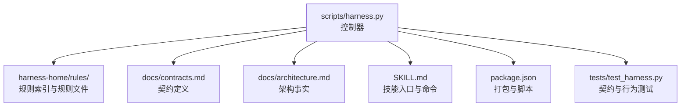
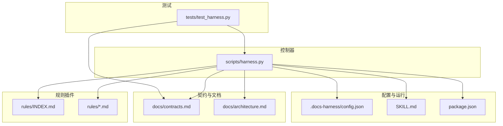
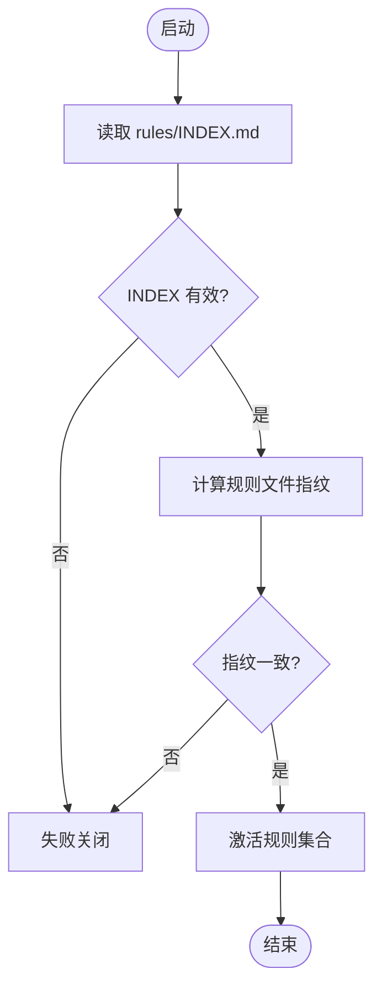
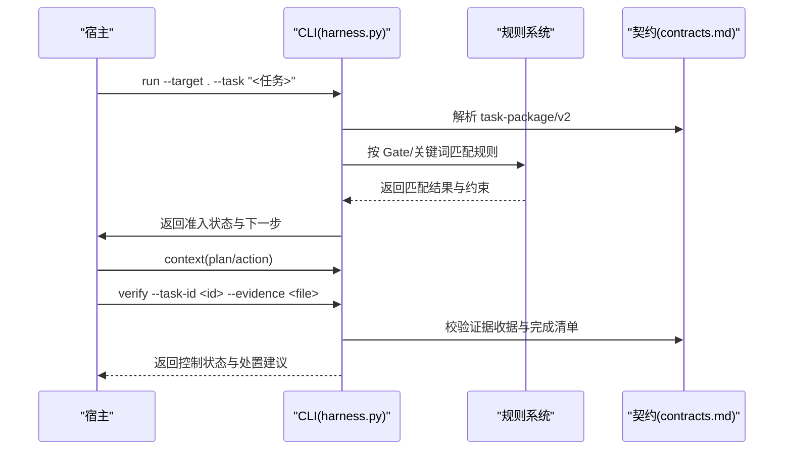
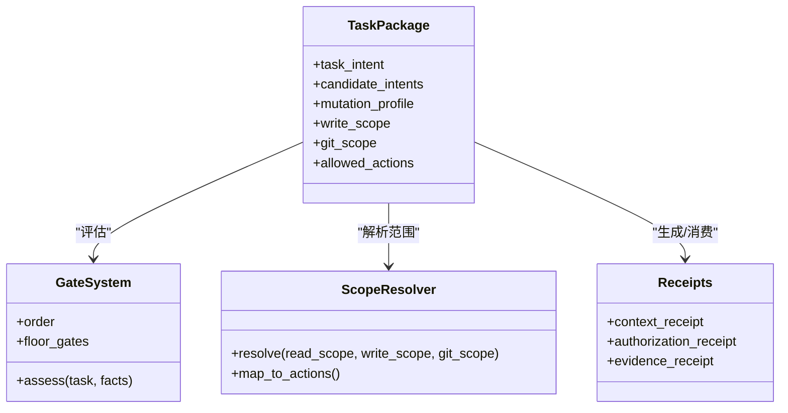
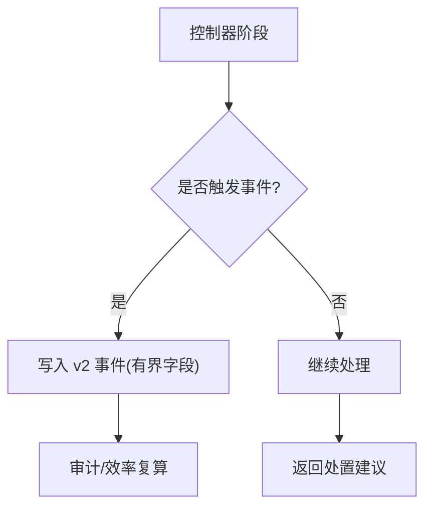
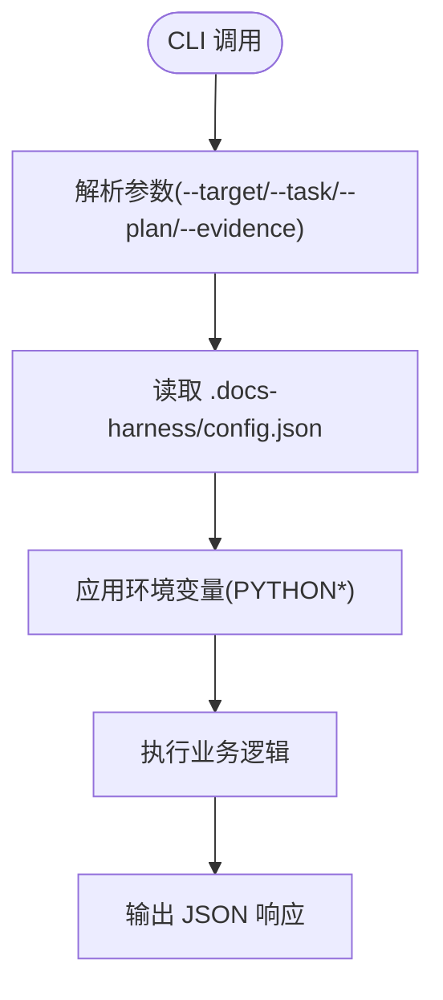
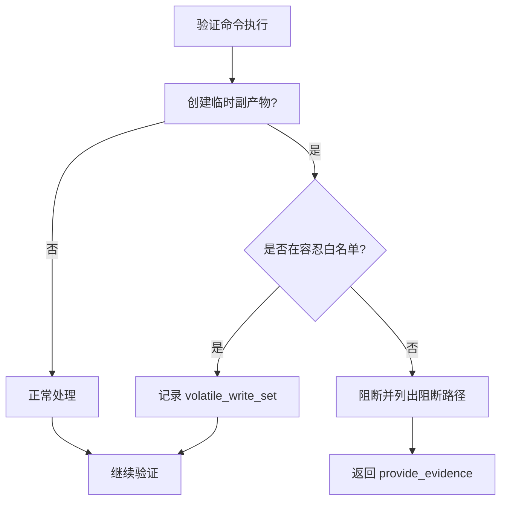
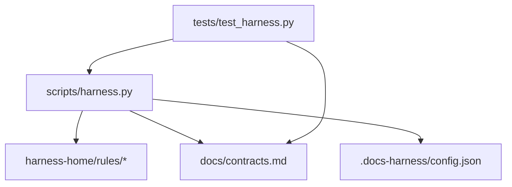

# 插件架构设计

<cite>
**本文引用的文件**
- [scripts/harness.py](file://scripts/harness.py)
- [docs/contracts.md](file://docs/contracts.md)
- [docs/architecture.md](file://docs/architecture.md)
- [harness-home/rules/INDEX.md](file://harness-home/rules/INDEX.md)
- [harness-home/rules/_rule-template.md](file://harness-home/rules/_rule-template.md)
- [SKILL.md](file://SKILL.md)
- [package.json](file://package.json)
- [tests/test_harness.py](file://tests/test_harness.py)
</cite>

## 目录
1. [引言](#引言)
2. [项目结构](#项目结构)
3. [核心组件](#核心组件)
4. [架构总览](#架构总览)
5. [详细组件分析](#详细组件分析)
6. [依赖关系分析](#依赖关系分析)
7. [性能考量](#性能考量)
8. [故障排查指南](#故障排查指南)
9. [结论](#结论)
10. [附录](#附录)

## 引言
本文件面向 Docs Harness 的“插件化”扩展能力，围绕规则与治理的可插拔性进行系统化说明。尽管当前仓库以单控制器脚本为核心，但通过“规则即插件”的设计，已具备清晰的插件发现、生命周期管理、配置管理与安全模型基础。本文在此基础上，给出插件接口规范（注册表模式、事件监听与回调）、配置管理（配置文件格式、环境变量注入、运行时参数传递）、安全模型（权限控制、沙箱隔离、资源限制）以及最佳实践与示例，帮助开发者构建可插拔的规则处理器、证据适配器与验证命令。

## 项目结构
Docs Harness 的核心由一个独立控制器脚本与受管规则集组成：
- scripts/harness.py：任务准入、上下文、验收、知识生命周期、后台 Job 状态机与 Git 交付检查等主流程实现。
- harness-home/rules/*：随包发布的受管规则真源，安装时复制到目标项目的 .docs-harness/harness-home/rules/，并通过 INDEX.md 声明激活规则与指纹。
- docs/contracts.md：对外合同定义，涵盖任务包、证据收据、上下文与授权收据、Git 状态、完成清单、退出码等。
- docs/architecture.md：架构事实，描述控制器职责、受管目录与数据面/控制面边界。
- SKILL.md：技能入口与运行约定，包含 run/verify/background 等命令语义。
- package.json：打包元信息与脚本入口。
- tests/test_harness.py：覆盖关键行为与契约的测试用例。

**图表来源**
- [scripts/harness.py:1-120](file://scripts/harness.py#L1-L120)
- [docs/contracts.md:1-120](file://docs/contracts.md#L1-L120)
- [docs/architecture.md:1-26](file://docs/architecture.md#L1-L26)
- [harness-home/rules/INDEX.md:1-41](file://harness-home/rules/INDEX.md#L1-L41)
- [SKILL.md:1-105](file://SKILL.md#L1-L105)
- [package.json:1-23](file://package.json#L1-L23)

**章节来源**
- [docs/architecture.md:1-26](file://docs/architecture.md#L1-L26)
- [package.json:1-23](file://package.json#L1-L23)

## 核心组件
- 控制器与契约：控制器负责任务意图解析、Gate 判定、范围与授权、上下文装配、证据校验与验收、后台 Job 状态机与 Git 交付检查；契约定义了任务包、证据收据、上下文与授权收据、Git 状态、完成清单与退出码等。
- 规则系统：规则以 Markdown 文件形式存在，通过 INDEX.md 声明 active_rules 与内容指纹；控制器在准入阶段按 Gate/关键词匹配并加载规则，缺失或指纹漂移将失败关闭。
- 配置管理：项目级配置位于 .docs-harness/config.json，用于控制规则根路径、验证白名单、命令缓存开关、自动归因开关等。
- 事件与审计：事件采用 v2 有界字段记录，避免敏感信息泄露；质量账本与处置索引提供审计与归档能力。

**章节来源**
- [scripts/harness.py:1-120](file://scripts/harness.py#L1-L120)
- [docs/contracts.md:1-120](file://docs/contracts.md#L1-L120)
- [harness-home/rules/INDEX.md:1-41](file://harness-home/rules/INDEX.md#L1-L41)

## 架构总览
下图展示控制器、规则、契约、配置与测试之间的交互关系，体现“规则即插件”的注册与执行路径。

**图表来源**
- [scripts/harness.py:1-120](file://scripts/harness.py#L1-L120)
- [docs/contracts.md:1-120](file://docs/contracts.md#L1-L120)
- [docs/architecture.md:1-26](file://docs/architecture.md#L1-L26)
- [harness-home/rules/INDEX.md:1-41](file://harness-home/rules/INDEX.md#L1-L41)
- [SKILL.md:1-105](file://SKILL.md#L1-L105)
- [package.json:1-23](file://package.json#L1-L23)
- [tests/test_harness.py:1-120](file://tests/test_harness.py#L1-L120)

## 详细组件分析

### 插件发现机制（规则即插件）
- 规则索引：INDEX.md 声明 active_rules 列表与规则文件清单，控制器在安装与升级时将固定快照同步到目标项目的 .docs-harness/harness-home/rules/，并在配置中记录逐文件指纹。
- 指纹校验：控制器计算规则文件指纹并与冻结指纹比对，缺失、增加或变化均失败关闭，确保插件一致性。
- 激活条件：只有 status: active、规则 ID 唯一、正文指纹正确且合同字段完整的规则才能进入任务包。

**图表来源**
- [harness-home/rules/INDEX.md:1-41](file://harness-home/rules/INDEX.md#L1-L41)
- [scripts/harness.py:1910-1924](file://scripts/harness.py#L1910-L1924)

**章节来源**
- [harness-home/rules/INDEX.md:1-41](file://harness-home/rules/INDEX.md#L1-L41)
- [scripts/harness.py:1910-1924](file://scripts/harness.py#L1910-L1924)

### 生命周期管理（任务与规则）
- 任务生命周期：run → context(plan/action) → verify，支持幂等复用、增量准入与完整重新准入。
- 规则生命周期：安装时复制快照 → 运行时校验指纹 → 准入阶段按 Gate/关键词匹配 → 变更检测触发失败关闭或迁移。
- 后台 Job 生命周期：prepare → dispatched → running → progress → verify → 终态，复杂路线需遵循标准序列。

**图表来源**
- [docs/contracts.md:1-120](file://docs/contracts.md#L1-L120)
- [scripts/harness.py:1-120](file://scripts/harness.py#L1-L120)
- [SKILL.md:1-105](file://SKILL.md#L1-L105)

**章节来源**
- [docs/contracts.md:1-120](file://docs/contracts.md#L1-L120)
- [SKILL.md:1-105](file://SKILL.md#L1-L105)

### 依赖解析（Gate、范围与授权）
- Gate 顺序与底线：产品变更、架构契约、安全敏感、数据破坏、外部发布等 Gate 按固定顺序评估；安全底线 Gate 不可豁免。
- 范围与授权：read_scope/write_scope/git_scope/external_scope 决定允许动作；混合意图取最高变更面；facts 中的 gate_assessment 可权威声明 Gate。
- 依赖链：任务包 → 编译任务 → 上下文收据 → 授权收据 → 证据收据 → 完成清单。

**图表来源**
- [docs/contracts.md:1-120](file://docs/contracts.md#L1-L120)
- [scripts/harness.py:260-342](file://scripts/harness.py#L260-L342)

**章节来源**
- [docs/contracts.md:1-120](file://docs/contracts.md#L1-L120)
- [scripts/harness.py:260-342](file://scripts/harness.py#L260-L342)

### 插件接口规范（注册表、事件监听与回调）
- 注册表模式：规则以 Markdown 文件为插件单元，INDEX.md 作为注册表，控制器在启动时加载并校验指纹，形成激活规则集合。
- 事件监听：事件使用 v2 有界字段记录 phase/duration_ms/reason_code 等，不保存敏感输入；控制器在关键阶段追加事件，供审计与效率复算。
- 回调机制：verify 阶段根据阻断原因返回五级处置（provide_evidence/refresh_evidence/retry_verification/incremental_admission/full_readmission），宿主据此回调下一步动作。

**图表来源**
- [docs/contracts.md:283-302](file://docs/contracts.md#L283-L302)
- [scripts/harness.py:1-120](file://scripts/harness.py#L1-L120)

**章节来源**
- [docs/contracts.md:283-302](file://docs/contracts.md#L283-L302)
- [scripts/harness.py:1-120](file://scripts/harness.py#L1-L120)

### 插件配置管理（配置文件、环境变量与运行时参数）
- 配置文件：.docs-harness/config.json 存储 rules_root、verification.volatile_paths、verification.auto_attribute_in_scope、verification.command_cache_enabled 等。
- 环境变量：测试与运行可通过环境变量影响行为（如 PYTHONDONTWRITEBYTECODE），控制器对敏感输入脱敏。
- 运行时参数：CLI 参数如 --target、--task、--plan、--evidence、--json 等驱动控制器行为；文件型参数仅接受路径，大小与编码受限。

**图表来源**
- [scripts/harness.py:1280-1290](file://scripts/harness.py#L1280-L1290)
- [tests/test_harness.py:59-87](file://tests/test_harness.py#L59-L87)

**章节来源**
- [scripts/harness.py:1280-1290](file://scripts/harness.py#L1280-L1290)
- [tests/test_harness.py:59-87](file://tests/test_harness.py#L59-L87)

### 插件安全模型（权限控制、沙箱隔离与资源限制）
- 权限控制：write_scope 严格限定写入范围；Git 操作通过 git_scope 绑定远端引用；外部写入需显式授权。
- 沙箱隔离：验证命令期间新建的已知临时副产物容忍，但同名已有文件修改或删除仍阻断；控制器代铸 workspace_attribution 收据自动认领范围内写入。
- 资源限制：文件大小、UTF-8、JSON 类型与文件系统错误结构化；事件只保存有界字段；退出码明确业务含义。

**图表来源**
- [docs/contracts.md:190-220](file://docs/contracts.md#L190-L220)
- [scripts/harness.py:1-120](file://scripts/harness.py#L1-L120)

**章节来源**
- [docs/contracts.md:190-220](file://docs/contracts.md#L190-L220)
- [scripts/harness.py:1-120](file://scripts/harness.py#L1-L120)

### 插件开发最佳实践（错误处理、日志记录与性能优化）
- 错误处理：使用结构化错误码与退出码，避免回显敏感输入；失败关闭策略确保一致性。
- 日志记录：事件只保存有界字段，便于审计与效率复算；质量账本按需记录经验。
- 性能优化：上下文与证据收据缓存命中复用；验证命令缓存启用可减少重复执行；增量准入避免完整重新准入。

**章节来源**
- [docs/contracts.md:283-302](file://docs/contracts.md#L283-L302)
- [docs/contracts.md:220-221](file://docs/contracts.md#L220-L221)

### 插件示例（规则处理器、证据适配器、验证命令）
- 规则处理器：新增 Markdown 规则文件，设置 status: active、rule_id、content_fingerprint 与 gates/keywords/evidence_types/failure_mode，更新 INDEX.md 激活。
- 证据适配器：实现 v2 证据收据 producer，绑定 task_id/target_identity/package_fingerprint/cwd/时间戳/ttl/exit_code/digest/read_set/write_set；或使用声明草案由控制器代铸。
- 验证命令：在 verification_commands 中声明 argv 与 produces，控制器校验退出码与摘要后生成收据；可启用命令缓存提升性能。

**章节来源**
- [harness-home/rules/_rule-template.md:1-21](file://harness-home/rules/_rule-template.md#L1-L21)
- [docs/contracts.md:165-220](file://docs/contracts.md#L165-L220)

## 依赖关系分析
控制器与规则、契约、配置、测试之间的依赖如下：
- 控制器依赖规则索引与规则文件进行准入匹配。
- 控制器依赖契约定义进行任务包、证据收据、上下文与授权收据的校验。
- 控制器依赖配置文件控制行为开关与白名单。
- 测试覆盖契约与行为，确保一致性。

**图表来源**
- [scripts/harness.py:1-120](file://scripts/harness.py#L1-L120)
- [docs/contracts.md:1-120](file://docs/contracts.md#L1-L120)
- [harness-home/rules/INDEX.md:1-41](file://harness-home/rules/INDEX.md#L1-L41)
- [tests/test_harness.py:1-120](file://tests/test_harness.py#L1-L120)

**章节来源**
- [scripts/harness.py:1-120](file://scripts/harness.py#L1-L120)
- [docs/contracts.md:1-120](file://docs/contracts.md#L1-L120)
- [harness-home/rules/INDEX.md:1-41](file://harness-home/rules/INDEX.md#L1-L41)
- [tests/test_harness.py:1-120](file://tests/test_harness.py#L1-L120)

## 性能考量
- 上下文与证据收据缓存：同一 task_id/target/stage/compiler_contract/content_set_fingerprint 命中时复用，减少重复加载。
- 验证命令缓存：输入不变且上次通过则直接复用收据，避免重复执行。
- 增量准入：仅追加普通 Gate 且合同不变时，原子生成下一 package revision，继承同轮已校验收据。

**章节来源**
- [docs/contracts.md:220-221](file://docs/contracts.md#L220-L221)
- [docs/contracts.md:78-81](file://docs/contracts.md#L78-L81)

## 故障排查指南
- 规则缺失或指纹漂移：检查 .docs-harness/harness-home/rules/ 与 INDEX.md，确保与冻结指纹一致。
- 验证失败：查看 verify 返回的 reason_code 与 blocked 原因，确认 write_scope 与证据收据有效性。
- Git 操作失败：检查 git_scope 与远端引用，确认 LFS/Submodule 可用性与工作区干净状态。
- 事件与审计：通过 events.jsonl 与质量账本定位问题，避免敏感信息泄露。

**章节来源**
- [harness-home/rules/INDEX.md:1-41](file://harness-home/rules/INDEX.md#L1-L41)
- [docs/contracts.md:283-302](file://docs/contracts.md#L283-L302)

## 结论
Docs Harness 通过“规则即插件”的设计，实现了清晰的插件发现、生命周期管理、配置管理与安全模型。结合契约定义的严格校验与事件审计，开发者可基于此构建可插拔的规则处理器、证据适配器与验证命令，遵循最佳实践确保稳定性与性能。未来可在现有基础上进一步抽象插件接口，增强事件总线与回调机制，提升扩展性与可维护性。

## 附录
- 命令参考：run/context/verify/background/ledger/task 等命令语义见 SKILL.md。
- 契约参考：任务包、证据收据、上下文与授权收据、Git 状态、完成清单与退出码见 docs/contracts.md。
- 架构事实：控制器职责与数据面/控制面边界见 docs/architecture.md。

**章节来源**
- [SKILL.md:1-105](file://SKILL.md#L1-L105)
- [docs/contracts.md:1-370](file://docs/contracts.md#L1-L370)
- [docs/architecture.md:1-26](file://docs/architecture.md#L1-L26)