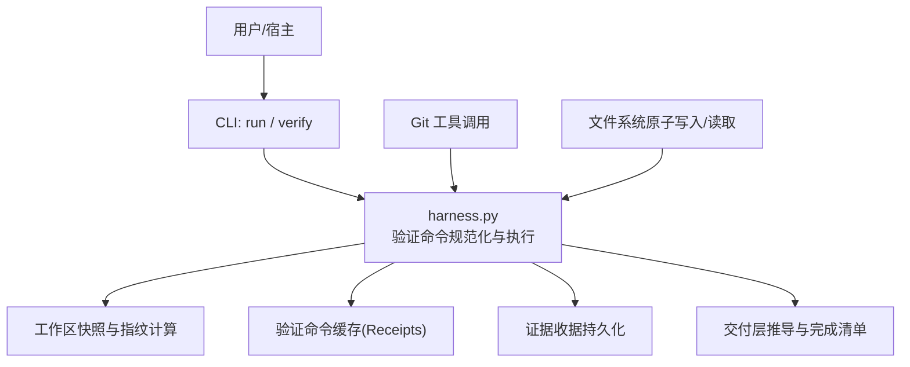
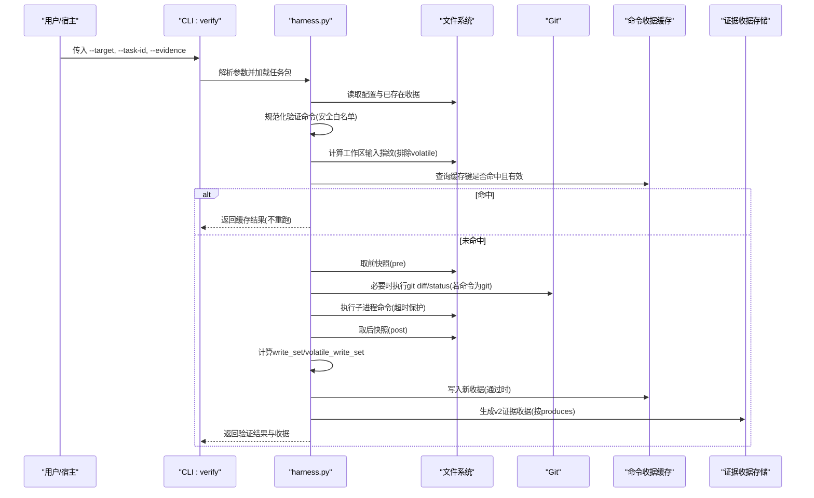
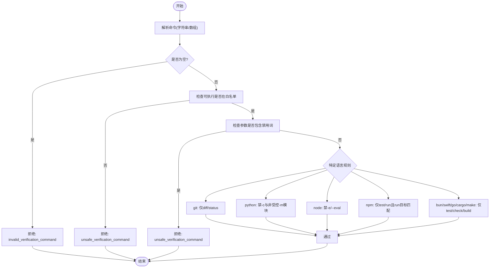
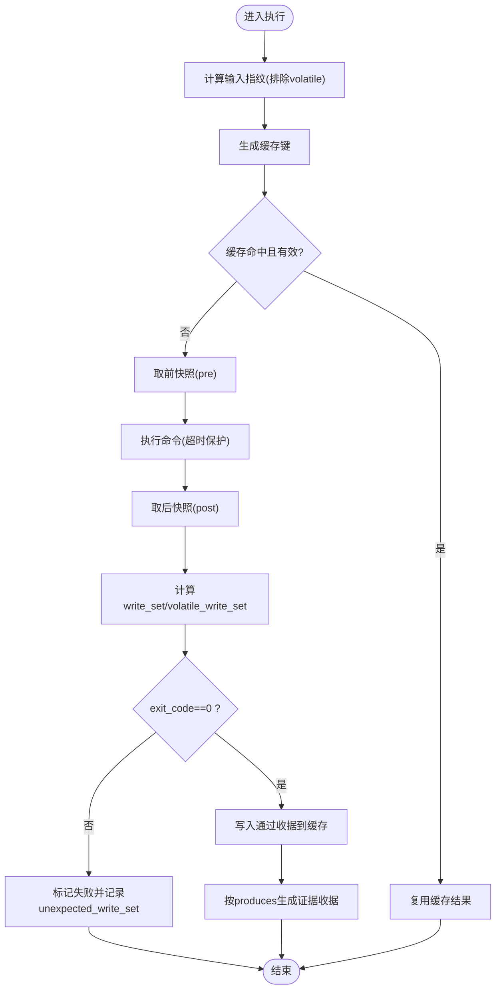
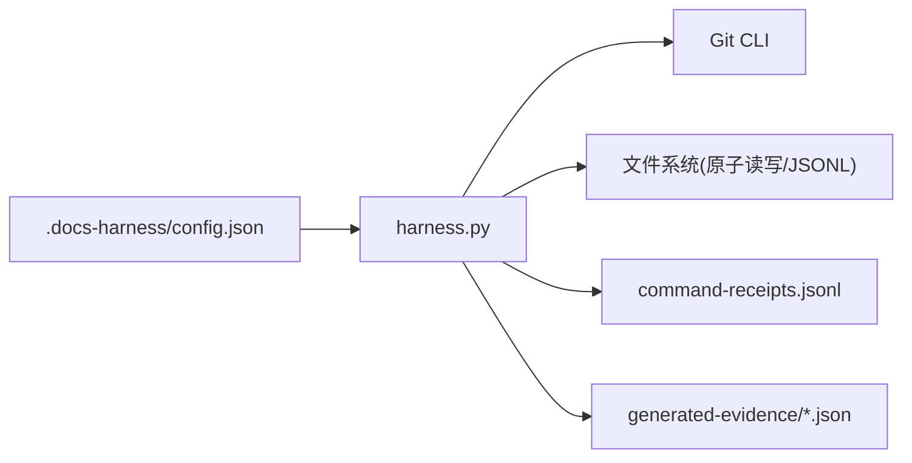

# 自定义验证命令

<cite>
**本文引用的文件**   
- [scripts/harness.py](file://scripts/harness.py)
- [tests/test_harness.py](file://tests/test_harness.py)
- [package.json](file://package.json)
- [SKILL.md](file://SKILL.md)
- [docs/contracts.md](file://docs/contracts.md)
- [harness-home/rules/INDEX.md](file://harness-home/rules/INDEX.md)
</cite>

## 目录
1. [引言](#引言)
2. [项目结构](#项目结构)
3. [核心组件](#核心组件)
4. [架构总览](#架构总览)
5. [详细组件分析](#详细组件分析)
6. [依赖关系分析](#依赖关系分析)
7. [性能考量](#性能考量)
8. [故障排查指南](#故障排查指南)
9. [结论](#结论)
10. [附录](#附录)

## 引言
本文件面向“Docs Harness 自定义验证命令”的开发与集成，系统性阐述验证命令框架的注册机制、参数解析与执行管道；明确命令接口规范（输入输出格式、错误码定义与状态管理）；给出复杂验证逻辑的实现要点（多步骤验证、条件分支、异步处理）；说明与系统集成（Git 操作、文件系统访问、网络请求处理）；并提供完整的开发示例（代码质量检查、安全扫描、合规性验证）、测试方法、调试技巧与部署策略。读者无需深入源码即可上手开发与排障。

## 项目结构
- scripts/harness.py：控制器主程序，包含验证命令规范化、执行、缓存与收据生成等核心实现。
- tests/test_harness.py：覆盖验证命令安全校验、可挥发产物容忍、缓存命中与失效、配置项影响等用例。
- package.json：脚本入口与测试命令。
- SKILL.md：高层使用指引与关键流程说明。
- docs/contracts.md：契约文档，定义任务包、证据、验收层、退出码等。
- harness-home/rules/INDEX.md：规则索引与激活约定。

**图表来源** 
- [scripts/harness.py](file://scripts/harness.py)
- [docs/contracts.md](file://docs/contracts.md)

**章节来源**
- [package.json](file://package.json)
- [SKILL.md](file://SKILL.md)

## 核心组件
- 验证命令规范化与安全白名单
  - 仅允许受控可执行与受限参数，禁止危险参数与内联代码执行。
  - 对 git/python/node/npm/bun/swift/go/cargo/make 等分别进行参数级约束。
- 验证命令执行管道
  - 输入指纹计算（排除运行时与可挥发路径）→ 缓存键生成 → 命中则复用 → 未命中则前快照→执行→后快照→分类写入集→结果记录。
- 验证命令收据缓存
  - 以 task_id/target_identity/command_argv_digest/cwd/input_fingerprint/contract_digest 为键，TTL 控制有效期。
- 证据收据生成
  - 通过命令后按声明 produces 生成 v2 证据收据，producer 标记为 verification_command。
- 交付层与完成清单
  - 基于意图与成功标准推导各层期望与验证状态，绑定证据引用。

**章节来源**
- [scripts/harness.py](file://scripts/harness.py)
- [docs/contracts.md](file://docs/contracts.md)

## 架构总览
验证命令在 verify 阶段被调度执行，贯穿“规范化→缓存→执行→快照对比→收据持久化→交付层推导”的完整链路。

**图表来源** 
- [scripts/harness.py](file://scripts/harness.py)
- [docs/contracts.md](file://docs/contracts.md)

## 详细组件分析

### 验证命令规范化与安全白名单
- 支持字符串或字符串数组形式，空命令拒绝。
- 可执行白名单：python/python3/pytest/npm/node/bun/swift/go/cargo/make/git。
- 禁止参数：push/publish/deploy/release/reset/clean/checkout/rm/uninstall。
- git 仅允许 diff/status；Python 不允许 -c 与非受控模块；Node 不允许 -e/--eval；npm 仅允许 test/run 且 run 目标需含 test/check/lint/type/build。

**图表来源** 
- [scripts/harness.py](file://scripts/harness.py)

**章节来源**
- [scripts/harness.py](file://scripts/harness.py)

### 验证命令执行与缓存
- 输入指纹：工作区快照排除运行时与 volatile 路径后的哈希。
- 缓存键：task_id + target_identity + command_argv_digest + cwd + input_fingerprint + contract_digest。
- TTL 控制：默认 3600 秒，过期即失效。
- 执行流程：pre 快照→子进程执行(超时保护)→post 快照→差异分类(volatile vs blocking)→结果记录。
- 缓存写入：仅当 exit_code=0 时写入通过收据，后续相同键直接复用。

**图表来源** 
- [scripts/harness.py](file://scripts/harness.py)

**章节来源**
- [scripts/harness.py](file://scripts/harness.py)

### 证据收据与自动归因
- 通过验证命令后，按声明 produces 生成 v2 证据收据，producer 能力为 verification_command。
- 若阻断仅为 write_scope 内未归因写入，控制器可代铸 workspace_attribution 收据自动认领（可通过配置关闭）。
- 证据副本受管保存，原始文件删除不影响已采纳证据。

**章节来源**
- [scripts/harness.py](file://scripts/harness.py)
- [docs/contracts.md](file://docs/contracts.md)

### 交付层与完成清单
- 根据任务意图与成功标准推导 source/local_verification/git_head/remote_delivery/fresh_clone/release_artifact/ui/external_state 各层的期望与验证状态。
- 只读意图默认 remote_delivery/fresh_clone 为 not_applicable；本地 modify 未声明 Git/外部交付时为 not_requested；git_sync/external_write 或明确要求远端/发布/安装/fresh clone 时为 required。
- 完成清单固定要求，不得在收尾阶段静默增加隐藏要求。

**章节来源**
- [docs/contracts.md](file://docs/contracts.md)
- [scripts/harness.py](file://scripts/harness.py)

### 与系统集成：Git、文件系统、网络
- Git 操作：verify 阶段仅允许 git diff/status；fetch/sync 由 run 阶段预检与后置校验保障范围与一致性。
- 文件系统：原子写入/读取、JSONL 追加、快照与指纹计算、volatile 路径容忍。
- 网络请求：验证命令本身不应发起网络写操作；如需网络读取，应通过宿主侧代理并在 facts 中声明，避免在 verify 中直接触发远程写。

**章节来源**
- [scripts/harness.py](file://scripts/harness.py)
- [docs/contracts.md](file://docs/contracts.md)

### 复杂验证逻辑：多步骤、条件分支、异步
- 多步骤验证：可在 facts.verification_commands 中声明多条命令，按顺序执行，失败命令单独标记，通过命令继续。
- 条件分支：依据 exit_code 与 write_set 分类决定 produce 与阻断；volatile 写入不阻断但可见。
- 异步处理：验证命令本身同步执行；如需异步，建议宿主在 background Job 中编排，父任务 verify 仅消费冻结 deliverables 并推进。

**章节来源**
- [scripts/harness.py](file://scripts/harness.py)
- [docs/contracts.md](file://docs/contracts.md)

## 依赖关系分析
- 控制器依赖 Git 工具与 Python 子进程执行环境。
- 验证命令收据缓存位于 artifacts/verification/command-receipts.jsonl。
- 证据收据持久化于 generated-evidence 目录，受管副本用于准入。
- 配置项 .docs-harness/config.json 中的 verification.volatile_paths 扩展容忍范围。

**图表来源** 
- [scripts/harness.py](file://scripts/harness.py)

**章节来源**
- [scripts/harness.py](file://scripts/harness.py)

## 性能考量
- 缓存命中显著降低重复执行成本；输入指纹排除 volatile 提升命中率。
- 子进程执行设置超时保护，避免长时间阻塞。
- 快照与指纹计算在大仓库可能开销较大，建议合理限定 scope 与减少无关变更。
- 按需读取上下文与证据，避免全量加载。

[本节为通用指导，不直接分析具体文件]

## 故障排查指南
- 常见错误码与含义
  - invalid_verification_command：命令格式非法或 produces 类型不在白名单。
  - unsafe_verification_command：可执行或参数不在白名单/被禁止。
  - verification_command_workspace_write：命令产生非 volatile 的工作区写入。
  - provide_evidence/refresh_evidence/retry_verification/incremental_admission/full_readmission：verify 五级处置对应的退出码与下一步动作。
- 定位步骤
  - 查看 verify 响应中的 verification_commands 列表，确认 result 与 reason_code。
  - 检查 unexpected_write_set 与 volatile_write_set，判断是否命中 volatile 白名单。
  - 核对 .docs-harness/config.json 的 verification.volatile_paths 配置是否覆盖预期路径。
  - 检查 command-receipts.jsonl 缓存键与 TTL，确认是否命中。
- 调试技巧
  - 临时关闭命令缓存以复现实时行为（配置项 verification.command_cache_enabled=false）。
  - 使用最小可复现 facts 与单条验证命令逐步缩小问题范围。
  - 通过 self-test 确保控制器与规则健康。

**章节来源**
- [scripts/harness.py](file://scripts/harness.py)
- [tests/test_harness.py](file://tests/test_harness.py)
- [docs/contracts.md](file://docs/contracts.md)

## 结论
Docs Harness 的验证命令框架以“安全白名单+输入指纹缓存+严格工作区约束”为核心，提供稳定、可审计、可复用的本地验证能力。开发者只需声明安全的 argv 与 produces，即可获得证据收据与交付层推导；复杂场景可通过多命令组合与后台 Job 编排实现。遵循本指南可实现高质量、高可靠性的自定义验证命令开发与集成。

[本节为总结，不直接分析具体文件]

## 附录

### 命令接口规范（摘要）
- 输入
  - facts.verification_commands：数组，每项可为字符串或对象 {argv, produces}。
  - .docs-harness/config.json.verification.volatile_paths：glob 白名单（必须带固定根目录，禁止 *|** 越界）。
- 输出
  - verify 响应包含 verification_commands 列表（result/exit_code/duration_ms/produces/cache_hit 等）。
  - verification_receipts：v2 证据收据列表，producer.capability=verification_command。
  - delivery_layers：每层 expectation/status/evidence_refs。
- 退出码
  - 0：成功；3：需要证据/迁移/Git 交付等；4：需要重新准入。

**章节来源**
- [docs/contracts.md](file://docs/contracts.md)
- [scripts/harness.py](file://scripts/harness.py)

### 开发示例（代码质量检查、安全扫描、合规性验证）
- 代码质量检查
  - 使用 pytest/unittest 作为验证命令，声明 produces=["test_result"]。
  - 将覆盖率与缓存目录纳入 volatile 白名单。
- 安全扫描
  - 使用静态扫描工具（如 ruff/secrets-linter），仅允许只读分析与报告输出至 volatile 目录。
- 合规性验证
  - 使用 npm test/run <check-script> 执行合规脚本，限制 run 目标包含 check/lint/type。

**章节来源**
- [tests/test_harness.py](file://tests/test_harness.py)
- [scripts/harness.py](file://scripts/harness.py)

### 测试方法与调试技巧
- 单元测试
  - 参考 tests/test_harness.py 中 unsafe/safe 命令、volatile byproducts、缓存命中/失效、配置项影响等用例。
- 调试
  - 打印 verify 响应中的 verification_commands 与 receipts。
  - 临时关闭缓存与扩大 volatile 白名单定位边界。
  - 使用 self-test 校验控制器与规则完整性。

**章节来源**
- [tests/test_harness.py](file://tests/test_harness.py)
- [package.json](file://package.json)

### 部署策略
- 安装与升级
  - 使用 project init/upgrade 安装或升级，保持 rules_root 与知识骨架一致。
- 版本与脚本
  - package.json 提供 test/self-test 脚本，便于 CI 集成。
- 规则与契约
  - 确保 active 规则指纹一致，契约文档与控制器版本对齐。

**章节来源**
- [package.json](file://package.json)
- [harness-home/rules/INDEX.md](file://harness-home/rules/INDEX.md)
- [SKILL.md](file://SKILL.md)