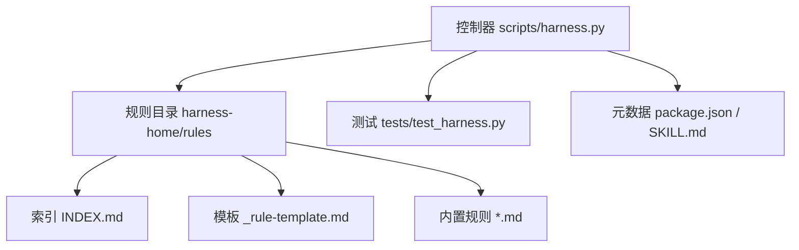
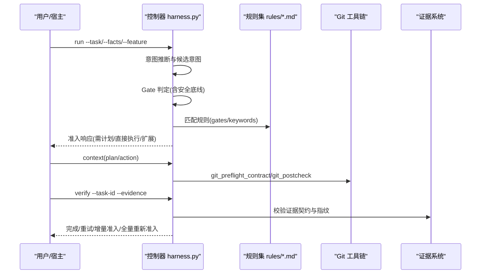
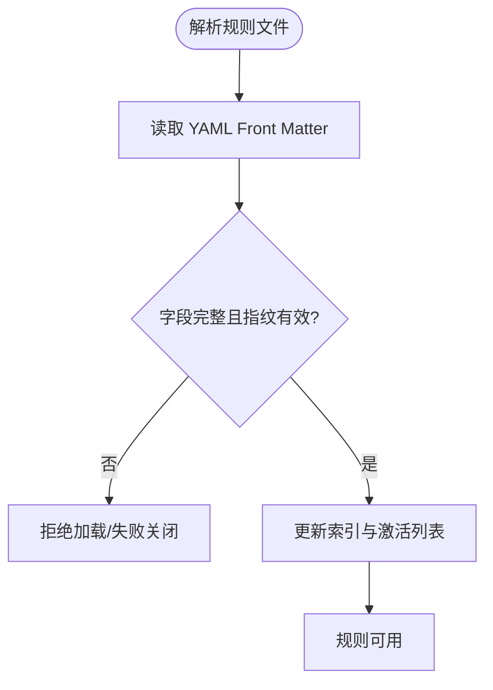
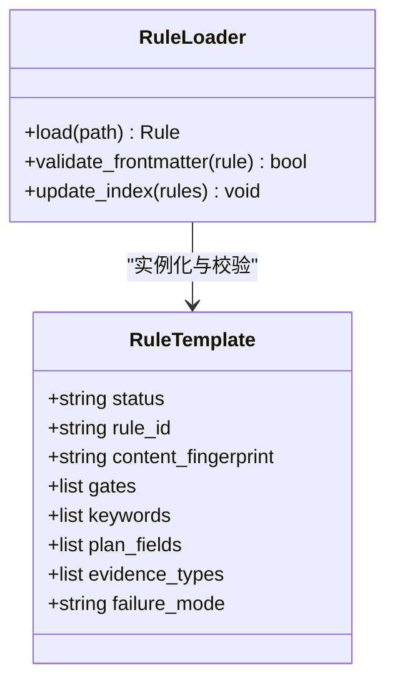
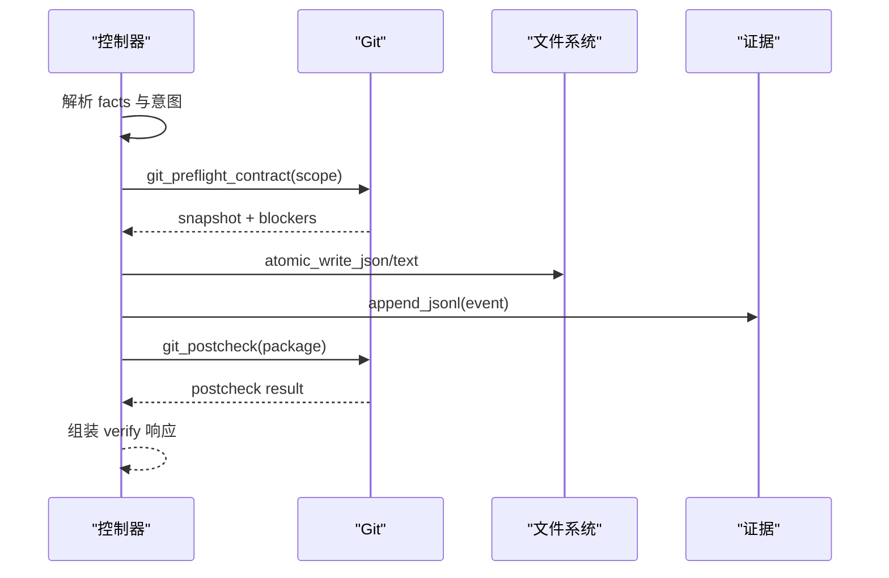
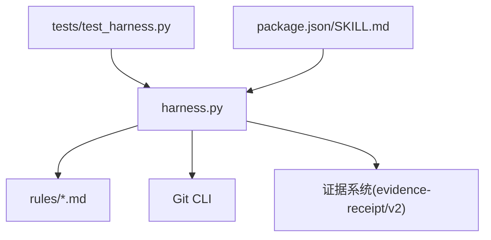

# 规则引擎扩展

<cite>
**本文引用的文件**   
- [harness.py](file://scripts/harness.py)
- [INDEX.md](file://harness-home/rules/INDEX.md)
- [_rule-template.md](file://harness-home/rules/_rule-template.md)
- [api-compatibility.md](file://harness-home/rules/api-compatibility.md)
- [external-input-security.md](file://harness-home/rules/external-input-security.md)
- [testing-release.md](file://harness-home/rules/testing-release.md)
- [documentation-changes.md](file://harness-home/rules/documentation-changes.md)
- [ui-complete-states.md](file://harness-home/rules/ui-complete-states.md)
- [release-authorization-rollback.md](file://harness-home/rules/release-authorization-rollback.md)
- [scope-change-readmission.md](file://harness-home/rules/scope-change-readmission.md)
- [test_harness.py](file://tests/test_harness.py)
- [SKILL.md](file://SKILL.md)
- [package.json](file://package.json)
</cite>

## 目录
1. [引言](#引言)
2. [项目结构](#项目结构)
3. [核心组件](#核心组件)
4. [架构总览](#架构总览)
5. [详细组件分析](#详细组件分析)
6. [依赖关系分析](#依赖关系分析)
7. [性能考量](#性能考量)
8. [故障排查指南](#故障排查指南)
9. [结论](#结论)
10. [附录](#附录)

## 引言
本文件面向 Docs Harness 规则引擎扩展开发者，系统化阐述规则定义语法（Markdown + YAML Front Matter）、内置规则类型与验收要求、自定义规则开发流程、执行上下文（变量访问、文件操作、Git 集成）、完整示例与调试技巧，以及版本管理、冲突解决与性能优化策略。读者无需深入源码即可上手开发与排障，同时提供面向源码的“章节来源”以便进一步定位实现细节。

## 项目结构
Docs Harness 的规则系统由两部分组成：
- 控制器脚本：Python 实现的独立任务控制器，负责 Gate 判定、任务包编排、证据校验、Git 预检/后检、知识上下文装配等。
- 规则仓库：以 Markdown + YAML Front Matter 声明的规则集合，包含索引、模板与各内置规则。

图表来源
- [harness.py:1-120](file://scripts/harness.py#L1-L120)
- [INDEX.md:1-41](file://harness-home/rules/INDEX.md#L1-L41)
- [_rule-template.md:1-21](file://harness-home/rules/_rule-template.md#L1-L21)

章节来源
- [package.json:1-23](file://package.json#L1-L23)
- [SKILL.md:1-105](file://SKILL.md#L1-L105)

## 核心组件
- 规则定义与加载
  - 规则以 Markdown 文件组织，YAML Front Matter 声明元数据：status、rule_id、content_fingerprint、gates、keywords、plan_fields、evidence_types、failure_mode。
  - 索引文件 INDEX.md 维护生效规则清单与激活条件，安装时复制固定快照并记录指纹，缺失或变更将失败关闭。
- 内置规则类型
  - API 兼容性检查：DH-API-COMPATIBILITY
  - 外部输入安全验证：DH-EXTERNAL-INPUT-SECURITY
  - 测试放行与覆盖率要求：DH-TESTING-RELEASE
  - 文档修改治理：DH-DOCUMENTATION-CHANGES
  - UI 完整状态验收：DH-UI-COMPLETE-STATES
  - 发布授权与回滚：DH-RELEASE-AUTHORIZATION-ROLLBACK
  - 范围变化重新准入：DH-SCOPE-CHANGE-READMISSION
- 执行上下文
  - 控制器在 run/verify 阶段注入知识上下文、Gate 评估、写权限范围、Git 预检/后检结果、证据契约与可复用的命令缓存。
- 测试与自测
  - 单元测试覆盖规则完整性、Git 行为、意图推断、证据与验证流程、后台 Job 生命周期等。

章节来源
- [INDEX.md:1-41](file://harness-home/rules/INDEX.md#L1-L41)
- [api-compatibility.md:1-29](file://harness-home/rules/api-compatibility.md#L1-L29)
- [external-input-security.md:1-29](file://harness-home/rules/external-input-security.md#L1-L29)
- [testing-release.md:1-29](file://harness-home/rules/testing-release.md#L1-L29)
- [documentation-changes.md:1-29](file://harness-home/rules/documentation-changes.md#L1-L29)
- [ui-complete-states.md:1-29](file://harness-home/rules/ui-complete-states.md#L1-L29)
- [release-authorization-rollback.md:1-29](file://harness-home/rules/release-authorization-rollback.md#L1-L29)
- [scope-change-readmission.md:1-29](file://harness-home/rules/scope-change-readmission.md#L1-L29)
- [test_harness.py:1-120](file://tests/test_harness.py#L1-L120)

## 架构总览
规则引擎的核心流程围绕“意图识别 → Gate 判定 → 规则匹配 → 上下文装配 → 执行与验证 → 证据归档”展开。控制器通过关键词与语义模式推断任务意图，结合宿主提交的 gate_assessment 与安全底线 Gate，决定准入路径与所需证据类型；随后按规则约束生成计划字段要求与验收标准，并在 verify 阶段进行证据与 Git 一致性校验。

图表来源
- [harness.py:260-395](file://scripts/harness.py#L260-L395)
- [harness.py:680-794](file://scripts/harness.py#L680-L794)
- [SKILL.md:25-55](file://SKILL.md#L25-L55)

章节来源
- [harness.py:200-395](file://scripts/harness.py#L200-L395)
- [harness.py:680-794](file://scripts/harness.py#L680-L794)
- [SKILL.md:25-55](file://SKILL.md#L25-L55)

## 详细组件分析

### 规则定义语法（Markdown + YAML Front Matter）
- 必需字段
  - status: scaffold/active（模板为 scaffold，生产规则为 active）
  - rule_id: 唯一标识，如 DH-API-COMPATIBILITY
  - content_fingerprint: sha256 指纹，用于安装快照与变更检测
  - gates: 触发的 Gate 名称（如 architecture-contract、security-sensitive）
  - keywords: 触发关键词（中英文均可）
  - plan_fields: 方案必须包含的字段名
  - evidence_types: 验收所需的证据类型
  - failure_mode: 失败处理策略描述
- 正文结构
  - 适用条件、必需的方案字段、验收条件、失败处理方式四段式说明，便于宿主与智能体理解约束与边界。

图表来源
- [_rule-template.md:1-21](file://harness-home/rules/_rule-template.md#L1-L21)
- [INDEX.md:1-41](file://harness-home/rules/INDEX.md#L1-L41)

章节来源
- [_rule-template.md:1-21](file://harness-home/rules/_rule-template.md#L1-L21)
- [INDEX.md:1-41](file://harness-home/rules/INDEX.md#L1-L41)

### 内置规则类型详解
- API 兼容性检查（DH-API-COMPATIBILITY）
  - 触发 Gate：architecture-contract
  - 关键词：api, 接口, schema, 协议, 数据库, 迁移
  - 方案字段：兼容策略、迁移与回滚
  - 证据类型：contract_acceptance
  - 失败处理：未声明消费者、范围扩大或回滚不可执行时停止并重新准入
- 外部输入安全验证（DH-EXTERNAL-INPUT-SECURITY）
  - 触发 Gate：security-sensitive
  - 关键词：安全, 鉴权, 权限, 密钥, 隐私, security, auth, token
  - 方案字段：安全边界、负向路径
  - 证据类型：security_acceptance
  - 失败处理：无法证明边界、数据去向或失败关闭时不得继续
- 测试放行与覆盖率（DH-TESTING-RELEASE）
  - 触发 Gate：testing-acceptance
  - 关键词：测试, 验收, 回归, test, verify, acceptance
  - 方案字段：验收结果
  - 证据类型：test_result
  - 失败处理：测试未运行、证据过期、目标层级不匹配或未解释失败时不得宣称完成
- 文档修改治理（DH-DOCUMENTATION-CHANGES）
  - 触发 Gate：document-edit
  - 关键词：文档, 说明, readme, markdown
  - 方案字段：文档真源、索引与残留
  - 证据类型：document_review
  - 失败处理：事实无法确认、索引断链或新旧体系同时生效时停止补齐
- UI 完整状态验收（DH-UI-COMPLETE-STATES）
  - 触发 Gate：frontend-design
  - 关键词：ui, 界面, 页面, 组件, 视觉, 交互, frontend, swiftui
  - 方案字段：设计状态、真实页面验收
  - 证据类型：ui_acceptance
  - 失败处理：缺少完整状态、演示数据冒充真实链路或页面不可操作时不得宣称完成
- 发布授权与回滚（DH-RELEASE-AUTHORIZATION-ROLLBACK）
  - 触发 Gate：release-external
  - 关键词：发布, 上线, 部署, 推送, 发送, publish, deploy, release, push
  - 方案字段：外部目标、发布与回滚
  - 证据类型：external_state
  - 失败处理：授权不新鲜、目标不明确、产物无法唯一识别或不可回滚时停止
- 范围变化重新准入（DH-SCOPE-CHANGE-READMISSION）
  - 触发 Gate：review-audit
  - 关键词：范围变化, 范围变更, scope change, outside scope
  - 方案字段：影响范围
  - 证据类型：review_result
  - 失败处理：任何未声明范围、目标或动作变化立即停止并从入口重新准入

章节来源
- [api-compatibility.md:1-29](file://harness-home/rules/api-compatibility.md#L1-L29)
- [external-input-security.md:1-29](file://harness-home/rules/external-input-security.md#L1-L29)
- [testing-release.md:1-29](file://harness-home/rules/testing-release.md#L1-L29)
- [documentation-changes.md:1-29](file://harness-home/rules/documentation-changes.md#L1-L29)
- [ui-complete-states.md:1-29](file://harness-home/rules/ui-complete-states.md#L1-L29)
- [release-authorization-rollback.md:1-29](file://harness-home/rules/release-authorization-rollback.md#L1-L29)
- [scope-change-readmission.md:1-29](file://harness-home/rules/scope-change-readmission.md#L1-L29)

### 自定义规则开发流程
- 使用模板
  - 基于 _rule-template.md 创建新规则文件，填写 Front Matter 与正文四段式说明。
- 逻辑实现要点
  - 明确适用条件与关键词，确保与 Gate 映射合理。
  - 指定 plan_fields 与 evidence_types，保证宿主能生成可执行的计划与证据。
  - 编写 failure_mode 指导失败时的处理策略。
- 测试方法
  - 在 tests/test_harness.py 中新增用例，覆盖规则加载、匹配、验证与失败分支。
  - 使用 self-test 与 project check 确保规则指纹与索引一致。

图表来源
- [_rule-template.md:1-21](file://harness-home/rules/_rule-template.md#L1-L21)
- [INDEX.md:1-41](file://harness-home/rules/INDEX.md#L1-L41)

章节来源
- [_rule-template.md:1-21](file://harness-home/rules/_rule-template.md#L1-L21)
- [test_harness.py:339-354](file://tests/test_harness.py#L339-L354)

### 规则执行上下文（变量访问、文件操作、Git 集成）
- 变量访问
  - 控制器在 run 阶段注入 knowledge_context、matched_gates、candidate_intents、mutation_profile、write_scope 等字段，供宿主与智能体决策。
- 文件操作
  - 原子写入、JSON/JSONL 读写、事件追加、指纹计算、大小限制与路径安全检查。
- Git 集成
  - 预检：git_preflight_contract 生成快照、同步范围、删除计数、fast-forward 判断、LFS/Submodule 可用性检查。
  - 后检：git_postcheck 校验 ref 变更、工作区漂移、远端一致性。
  - 身份与指纹：target_identity、sanitized_remote_fingerprint 去除凭据与片段，统一远程标识。

图表来源
- [harness.py:680-794](file://scripts/harness.py#L680-L794)
- [harness.py:422-533](file://scripts/harness.py#L422-L533)
- [harness.py:549-613](file://scripts/harness.py#L549-L613)

章节来源
- [harness.py:422-533](file://scripts/harness.py#L422-L533)
- [harness.py:549-613](file://scripts/harness.py#L549-L613)
- [harness.py:680-794](file://scripts/harness.py#L680-L794)

### 复杂业务规则示例与调试技巧
- 示例一：API 兼容性检查
  - 场景：Schema 变更涉及多消费者与迁移顺序
  - 关键点：兼容策略、回滚路径、契约验收证据
  - 调试：核对 matched_gates 是否包含 architecture-contract；检查 contract_acceptance 证据是否覆盖新旧消费者与失败路径
- 示例二：外部输入安全验证
  - 场景：鉴权、权限、秘密、隐私数据处理
  - 关键点：信任边界、最小权限、负向路径、失败关闭
  - 调试：确认 security_sensitive Gate 命中；证据需覆盖未授权、畸形输入与敏感信息泄露
- 示例三：测试放行与覆盖率
  - 场景：静态检查、源码测试、运行时验证、产物验证、真实产品验收
  - 关键点：区分测试层级、记录实际命令与退出码、覆盖范围与失败项
  - 调试：验证 test_result 证据是否来自真实构建与运行；避免用源码测试替代产物验证

章节来源
- [api-compatibility.md:1-29](file://harness-home/rules/api-compatibility.md#L1-L29)
- [external-input-security.md:1-29](file://harness-home/rules/external-input-security.md#L1-L29)
- [testing-release.md:1-29](file://harness-home/rules/testing-release.md#L1-L29)
- [test_harness.py:324-338](file://tests/test_harness.py#L324-L338)

### 规则版本管理与冲突解决
- 版本快照与指纹
  - 安装时复制固定规则快照并记录逐文件指纹；缺失、增加或变化均失败关闭，需通过升级或人工 preserve-and-merge。
- 冲突解决
  - 当规则指纹不一致或索引与实际文件不符时，优先恢复快照并合并差异；禁止静默覆盖。
- 激活条件
  - 仅 status: active、rule_id 唯一、正文指纹正确且合同字段完整的规则进入任务包。

章节来源
- [INDEX.md:1-41](file://harness-home/rules/INDEX.md#L1-L41)
- [test_harness.py:356-376](file://tests/test_harness.py#L356-L376)

### 性能优化策略
- 命令缓存与证据复用
  - 验证命令带逐项收据复用，仅失败或输入变化重跑；可通过 verification.command_cache_enabled=false 整体关闭。
- 增量准入
  - 合同稳定时支持五级处置：provide_evidence、refresh_evidence、retry_verification、incremental_admission、full_readmission。
- 只读与最小写入
  - read_only 查询使用 write_scope=[]；Git inspect/fetch/sync 分别限定为读取、元数据写入与工作区写入，降低副作用。
- 快照与指纹
  - 使用 canonical_json 与 sha256 文本指纹，避免大对象序列化开销；文件读取采用分块哈希。

章节来源
- [SKILL.md:43-55](file://SKILL.md#L43-L55)
- [harness.py:406-420](file://scripts/harness.py#L406-L420)

## 依赖关系分析
- 控制器与规则
  - 控制器通过规则索引与 Front Matter 元数据匹配 Gate 与关键词，生成计划字段与证据要求。
- 控制器与 Git
  - 预检/后检严格约束工作区状态、远端引用与 LFS/Submodule 可用性，防止越界写入与漂移。
- 控制器与证据系统
  - 证据 v2 契约绑定 task/target/package fingerprint、可信 producer、时效与读写集合；验证命令白名单 produces 才产生语义证据。
- 测试与自测
  - 单元测试覆盖规则完整性、Git 行为、意图推断、证据与验证流程、后台 Job 生命周期。

图表来源
- [harness.py:1-120](file://scripts/harness.py#L1-L120)
- [test_harness.py:1-120](file://tests/test_harness.py#L1-L120)
- [package.json:1-23](file://package.json#L1-L23)
- [SKILL.md:1-105](file://SKILL.md#L1-L105)

章节来源
- [harness.py:1-120](file://scripts/harness.py#L1-L120)
- [test_harness.py:1-120](file://tests/test_harness.py#L1-L120)

## 性能考量
- 控制面轻量：run/verify 尽量复用已冻结方案与证据，减少重复执行。
- 文件系统 I/O：原子写入与分块哈希避免阻塞与大对象拷贝。
- Git 操作：预检阶段尽早发现 blocker（脏工作区、非 fast-forward、LFS/Submodule 不可用），避免无效执行。
- 证据缓存：命令收据复用与增量准入显著降低验证成本。

[本节为通用指导，不直接分析具体文件]

## 故障排查指南
- 常见错误与定位
  - 规则缺失或指纹不一致：检查 .docs-harness/harness-home/rules 快照与 INDEX.md 一致性。
  - Git 预检失败：查看 blockers 原因（脏工作区、删除数量阈值、非 fast-forward、LFS/Submodule）。
  - 证据无效：核对 evidence-receipt/v2 契约字段、producer 可信性、时间戳与 TTL。
  - 意图误判：检查 facts.gate_assessment 与安全底线 Gate 命中情况。
- 调试步骤
  - 使用 self-test 与 project check 快速定位问题。
  - 在 run/verify 输出中关注 admission_status、matched_gates、write_scope、git_postcheck 结果。
  - 对验证命令失败场景启用 retry_verification 并检查命令缓存。

章节来源
- [test_harness.py:339-376](file://tests/test_harness.py#L339-L376)
- [harness.py:680-794](file://scripts/harness.py#L680-L794)
- [SKILL.md:43-55](file://SKILL.md#L43-L55)

## 结论
Docs Harness 规则引擎以 Markdown + YAML Front Matter 声明规则，结合控制器严格的 Gate 判定、Git 预检/后检与证据契约，形成高可靠的任务治理闭环。开发者可基于模板快速扩展规则，借助测试与自测保障质量；通过版本快照、指纹校验与增量准入实现稳健的版本管理与性能优化。遵循本文档的实践建议，可在复杂业务场景中实现安全、可审计、可回滚的高质量交付。

[本节为总结，不直接分析具体文件]

## 附录
- 常用命令参考
  - 项目初始化：python3 scripts/harness.py project init --target <project> --json
  - 任务执行：python3 scripts/harness.py run --target . --task "<原始用户任务>" --json
  - 最终验收：python3 scripts/harness.py verify --target . --task-id <task-id> --evidence <evidence.json> --json
  - 后台治理：background list/status/prepare/dispatch/progress/verify/retry
- 关键常量与模式
  - VERSION、TASK_SCHEMA、COMPILED_SCHEMA、EVENT_SCHEMA、EVIDENCE_SCHEMA 等
  - INTENT_PATTERNS、MUTATION_PROFILES、GATE_DEFS、FLOOR_TERMS、NEGATION_MARKERS

章节来源
- [SKILL.md:14-88](file://SKILL.md#L14-L88)
- [harness.py:26-120](file://scripts/harness.py#L26-L120)