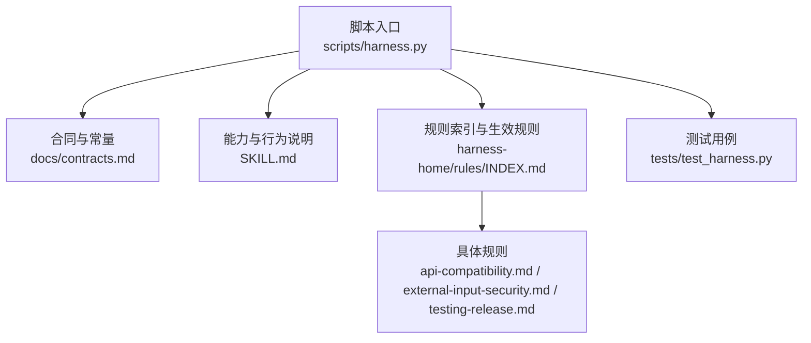
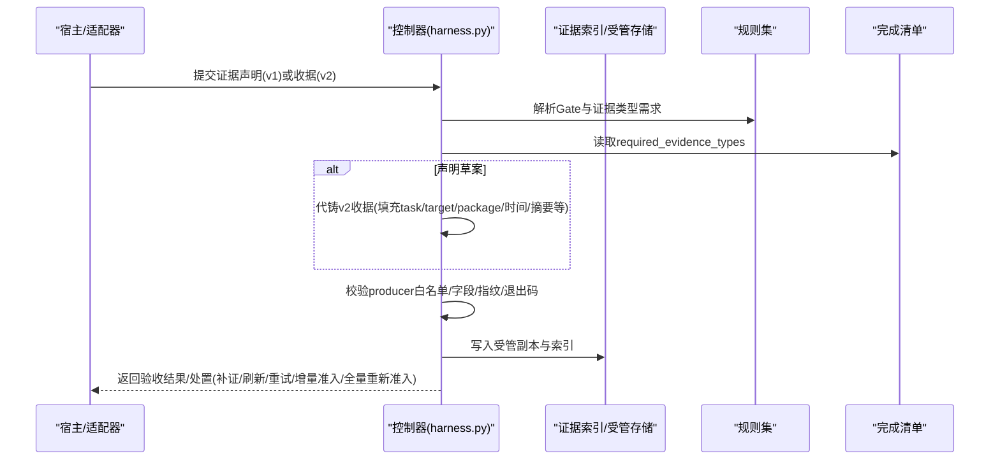
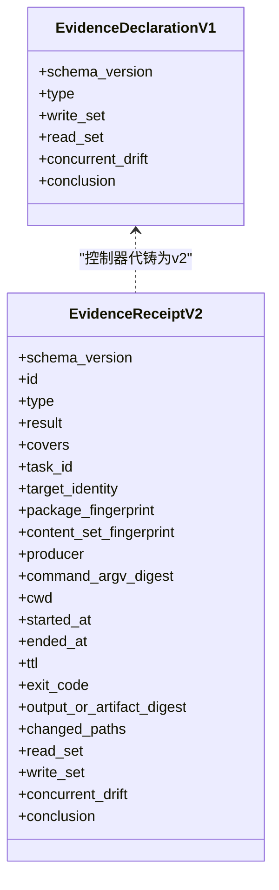
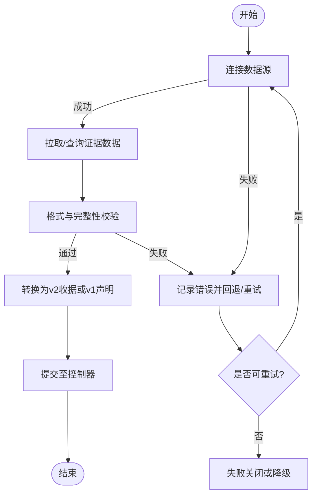
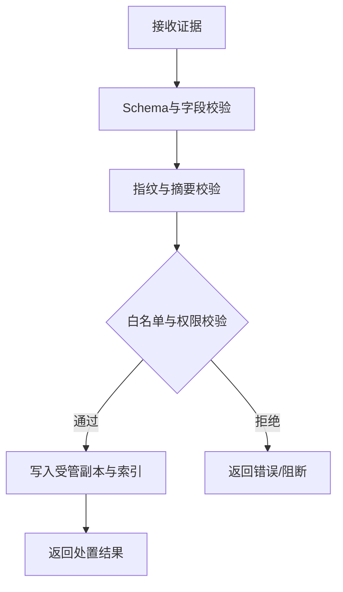
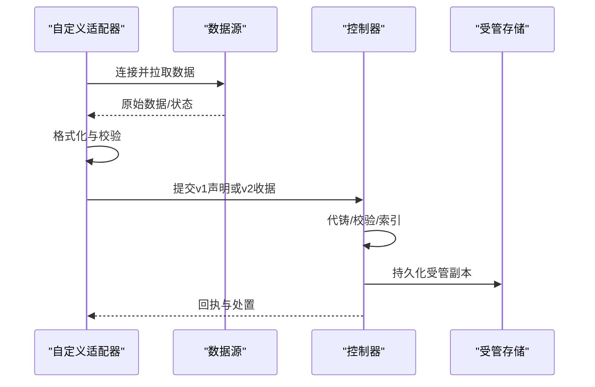
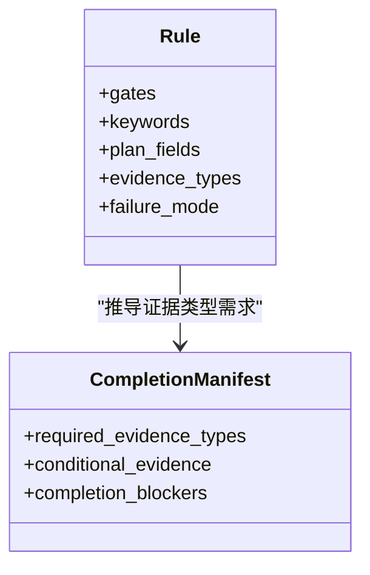
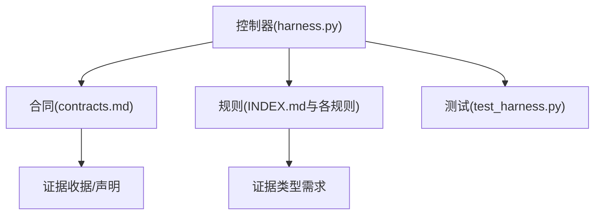

# 证据适配器模式

<cite>
**本文引用的文件**   
- [SKILL.md](file://SKILL.md)
- [architecture.md](file://docs/architecture.md)
- [contracts.md](file://docs/contracts.md)
- [harness.py](file://scripts/harness.py)
- [test_harness.py](file://tests/test_harness.py)
- [INDEX.md](file://harness-home/rules/INDEX.md)
- [api-compatibility.md](file://harness-home/rules/api-compatibility.md)
- [external-input-security.md](file://harness-home/rules/external-input-security.md)
- [testing-release.md](file://harness-home/rules/testing-release.md)
</cite>

## 目录
1. [简介](#简介)
2. [项目结构](#项目结构)
3. [核心组件](#核心组件)
4. [架构总览](#架构总览)
5. [详细组件分析](#详细组件分析)
6. [依赖分析](#依赖分析)
7. [性能考虑](#性能考虑)
8. [故障排除指南](#故障排除指南)
9. [结论](#结论)
10. [附录](#附录)

## 简介
本文件围绕 Docs Harness 的“证据适配器模式”进行系统化说明，聚焦以下目标：
- 解释证据系统如何通过接口抽象、实现类与转换逻辑解耦不同数据源；
- 阐述证据类型扩展（文件证据、API 响应证据、数据库查询证据）的实现方式；
- 说明证据收集器开发要点（数据源连接、批量处理、错误恢复）；
- 阐述证据验证机制（格式校验、完整性检查、签名/指纹校验）；
- 提供完整的适配器开发示例（自定义数据源集成、实时证据收集、离线证据处理）；
- 给出适配器测试策略、性能调优与故障排除建议。

该模式在 Docs Harness 中体现为对“证据收据 v2”的统一契约与可信生产者白名单，以及控制器对声明式证据草案的代铸与索引流程，从而将多源异构证据接入到统一的准入与验收管线。

**章节来源**
- [SKILL.md:26-58](file://SKILL.md#L26-L58)
- [contracts.md:165-221](file://docs/contracts.md#L165-L221)

## 项目结构
Docs Harness 以独立控制器为核心，围绕任务包、证据收据、上下文与授权收据、后台治理等合同展开。证据适配器模式贯穿如下关键位置：
- 控制器入口与常量定义（版本、Schema、受控意图、可信生产者集合等）；
- 证据收据与声明的解析、校验、索引与受管副本管理；
- 规则体系驱动的证据类型需求与 Gate 判定；
- 测试套件覆盖证据生命周期与边界条件。

**图表来源**
- [harness.py:26-56](file://scripts/harness.py#L26-L56)
- [contracts.md:1-10](file://docs/contracts.md#L1-L10)
- [SKILL.md:1-25](file://SKILL.md#L1-L25)
- [INDEX.md:1-20](file://harness-home/rules/INDEX.md#L1-L20)

**章节来源**
- [architecture.md:1-10](file://docs/architecture.md#L1-L10)
- [harness.py:26-56](file://scripts/harness.py#L26-L56)
- [contracts.md:1-10](file://docs/contracts.md#L1-L10)

## 核心组件
- 证据收据 v2（evidence-receipt/v2）：统一绑定 task_id、target_identity、package_fingerprint、producer、命令摘要、时间戳、退出码、输出/工件摘要、read_set/write_set/concurrent_drift 等字段，确保跨任务、跨目标的唯一性与可审计性。
- 证据声明草案（evidence-declaration/v1）：宿主仅提供 type、write_set、read_set、conclusion 等关键字段，由控制器代铸完整收据并纳入索引。
- 可信生产者白名单（TRUSTED_EVIDENCE_PRODUCERS）：仅允许受信任的 adapter/capability 组合产出高安全等级证据。
- 证据类型需求（required_evidence_types）：由完成清单与规则推导，决定验收所需证据类型集合。
- 验证命令收据（verification-command-receipt/v1）：按 argv、produces 与输入指纹缓存复用，避免重复执行。

这些组件共同构成证据适配器的“接口层”（收据/声明 Schema）、“实现层”（控制器解析与代铸）、“转换层”（从宿主声明到完整收据的映射）。

**章节来源**
- [contracts.md:165-221](file://docs/contracts.md#L165-L221)
- [harness.py:243-260](file://scripts/harness.py#L243-L260)
- [harness.py:3147-3187](file://scripts/harness.py#L3147-L3187)

## 架构总览
证据适配器模式在 Docs Harness 中的整体交互如下：

**图表来源**
- [contracts.md:165-221](file://docs/contracts.md#L165-L221)
- [harness.py:5176-5203](file://scripts/harness.py#L5176-L5203)
- [harness.py:5203-5265](file://scripts/harness.py#L5203-L5265)

## 详细组件分析

### 证据收据与声明的接口抽象
- 接口抽象：通过 v2 收据与 v1 声明两个 Schema 抽象出“证据主体”，屏蔽数据来源差异。
- 字段约束：task_id、target_identity、package_fingerprint、producer、command_argv_digest、cwd、started_at/ended_at、ttl、exit_code、output_or_artifact_digest、read_set、write_set、concurrent_drift、conclusion 等。
- 代铸流程：对声明草案，控制器自动填充受控字段并生成指纹，保证一致性。

**图表来源**
- [contracts.md:165-221](file://docs/contracts.md#L165-L221)

**章节来源**
- [contracts.md:165-221](file://docs/contracts.md#L165-L221)
- [harness.py:5203-5265](file://scripts/harness.py#L5203-L5265)

### 证据类型扩展：文件证据、API 响应证据、数据库查询证据
- 文件证据：write_set 指向工作区路径，read_set 包含被读取的文件；适合代码变更、文档更新等场景。
- API 响应证据：producer 使用外部适配器（如 codex-host/command_receipt），output_or_artifact_digest 绑定响应摘要；适用于远程服务调用结果。
- 数据库查询证据：read_set 描述查询涉及的表/视图/索引，write_set 为空或仅元数据；结合事务快照与查询计划指纹增强可追溯性。

扩展要点：
- 新增证据类型需在规则或完成清单中声明 required_evidence_types；
- producer 必须位于可信白名单；
- 对于高风险类型（security_acceptance、external_state、recovery_acceptance、remote_delivery、fresh_clone_verification、release_acceptance），必须由可信 v2 生产者产出。

**章节来源**
- [contracts.md:165-221](file://docs/contracts.md#L165-L221)
- [harness.py:243-260](file://scripts/harness.py#L243-L260)
- [harness.py:3147-3187](file://scripts/harness.py#L3147-L3187)

### 证据收集器开发：数据源连接、批量处理、错误恢复
- 数据源连接：适配器负责建立与数据源的连接（文件系统、HTTP、数据库等），并捕获异常结构化返回；
- 批量处理：对大量证据项采用分页/批处理，控制内存占用与超时；
- 错误恢复：失败时记录原因码与重试策略，支持幂等重放；对临时副产物（缓存、日志）遵循 volatile 白名单。

[本图为概念流程图，不直接映射具体源码文件]

### 证据验证机制：格式校验、完整性检查、签名/指纹校验
- 格式校验：严格校验 JSON Schema、必填字段、枚举值、时间格式与时区；
- 完整性检查：read_set/write_set 路径有效性、指纹一致性、退出码与摘要匹配；
- 签名/指纹校验：command_argv_digest、output_or_artifact_digest、package_fingerprint、target_identity 等指纹用于防篡改与幂等；
- 验证命令缓存：按 argv+produces+输入指纹命中缓存，避免重复执行。

**图表来源**
- [contracts.md:165-221](file://docs/contracts.md#L165-L221)
- [harness.py:5166-5176](file://scripts/harness.py#L5166-L5176)
- [harness.py:5176-5203](file://scripts/harness.py#L5176-L5203)

**章节来源**
- [contracts.md:165-221](file://docs/contracts.md#L165-L221)
- [harness.py:5166-5176](file://scripts/harness.py#L5166-L5176)
- [harness.py:5176-5203](file://scripts/harness.py#L5176-L5203)

### 适配器开发示例：自定义数据源集成、实时证据收集、离线证据处理
- 自定义数据源集成：实现适配器将数据源输出转为 v1 声明或 v2 收据，并确保 producer 在白名单；
- 实时证据收集：流式采集并分批提交，保持幂等键稳定；
- 离线证据处理：先落盘再批量提交，支持断点续传与失败重试。

[本图为概念序列图，不直接映射具体源码文件]

### 基于规则的 Gate 与证据类型联动
- 规则定义证据类型需求（evidence_types）与方案字段（plan_fields），控制器据此推导 required_evidence_types；
- 当规则触发特定 Gate（如 security-sensitive、testing-acceptance），需对应的高风险或专用证据类型；
- 完成清单冻结后，新增证据类型需走增量或全量重新准入。

**图表来源**
- [api-compatibility.md:1-29](file://harness-home/rules/api-compatibility.md#L1-L29)
- [external-input-security.md:1-29](file://harness-home/rules/external-input-security.md#L1-L29)
- [testing-release.md:1-29](file://harness-home/rules/testing-release.md#L1-L29)
- [contracts.md:63-95](file://docs/contracts.md#L63-L95)

**章节来源**
- [harness.py:276-345](file://scripts/harness.py#L276-L345)
- [contracts.md:63-95](file://docs/contracts.md#L63-L95)

## 依赖分析
- 控制器依赖合同与规则：证据类型需求来源于完成清单与规则；
- 证据收据依赖指纹与白名单：确保不可伪造与可信来源；
- 测试依赖控制器导出函数与固定装置：覆盖初始化、Git 操作、证据生命周期与边界条件。

**图表来源**
- [harness.py:26-56](file://scripts/harness.py#L26-L56)
- [contracts.md:1-10](file://docs/contracts.md#L1-L10)
- [INDEX.md:1-20](file://harness-home/rules/INDEX.md#L1-L20)
- [test_harness.py:47-100](file://tests/test_harness.py#L47-L100)

**章节来源**
- [harness.py:26-56](file://scripts/harness.py#L26-L56)
- [contracts.md:1-10](file://docs/contracts.md#L1-L10)
- [INDEX.md:1-20](file://harness-home/rules/INDEX.md#L1-L20)
- [test_harness.py:47-100](file://tests/test_harness.py#L47-L100)

## 性能考虑
- 验证命令缓存：按 argv+produces+输入指纹命中，减少重复执行；
- 批量处理：对大体积证据集采用分片与异步提交；
- 指纹计算优化：对只读路径使用增量哈希，避免全量扫描；
- 受管副本最小化：仅保存必要摘要与引用，降低存储压力。

[本节为通用指导，不直接分析具体文件]

## 故障排除指南
- 常见错误码与处置：
  - provide_evidence：未归因写入在 write_scope 内，需补证据；
  - refresh_evidence：读取基线漂移，失效并重读相关证据；
  - retry_verification：验证命令失败，输入不变则重试；
  - incremental_admission：仅追加普通 Gate 且合同不变；
  - full_readmission：范围、高风险合同或规则变化，需重新准入。
- 调试建议：
  - 检查 producer 是否在白名单；
  - 核对 command_argv_digest 与 output_or_artifact_digest；
  - 确认 read_set/write_set 路径有效且不越界；
  - 查看事件文件与受管副本一致性。

**章节来源**
- [contracts.md:153-164](file://docs/contracts.md#L153-L164)
- [harness.py:5166-5176](file://scripts/harness.py#L5166-L5176)
- [harness.py:5176-5203](file://scripts/harness.py#L5176-L5203)

## 结论
Docs Harness 的证据适配器模式通过统一的收据/声明契约、可信生产者白名单与严格的指纹校验，实现了多源异构证据的可插拔接入与强一致验收。结合规则驱动的 Gate 与完成清单，系统在安全性、可审计性与可扩展性之间取得平衡。开发者可按本文指引快速构建自定义证据适配器，并在测试与性能层面获得最佳实践参考。

[本节为总结，不直接分析具体文件]

## 附录
- 安装与运行：参见 SKILL.md 的任务入口与 verify 命令；
- 合同细节：详见 contracts.md 的证据收据与声明规范；
- 规则与 Gate：参见 harness-home/rules 下的各规则文件；
- 测试样例：参考 tests/test_harness.py 的证据构造与验收流程。

**章节来源**
- [SKILL.md:26-58](file://SKILL.md#L26-L58)
- [contracts.md:165-221](file://docs/contracts.md#L165-L221)
- [INDEX.md:1-20](file://harness-home/rules/INDEX.md#L1-L20)
- [test_harness.py:248-304](file://tests/test_harness.py#L248-L304)