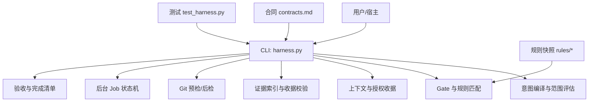
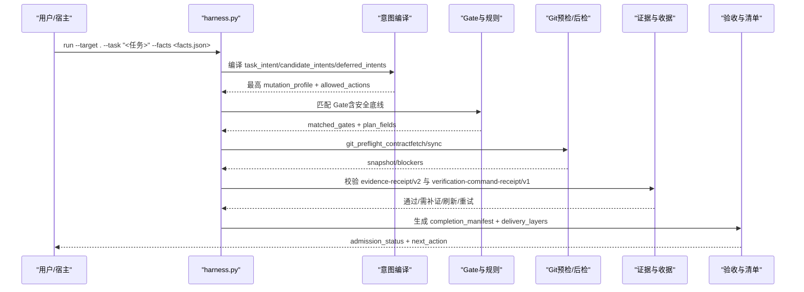
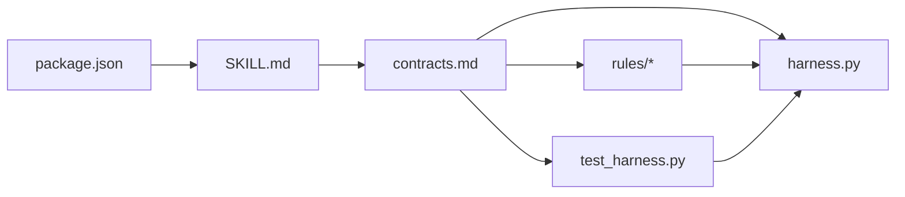

# 常见问题诊断

<cite>
**本文引用的文件**   
- [package.json](file://package.json)
- [SKILL.md](file://SKILL.md)
- [harness.py](file://scripts/harness.py)
- [test_harness.py](file://tests/test_harness.py)
- [contracts.md](file://docs/contracts.md)
- [INDEX.md](file://harness-home/rules/INDEX.md)
- [api-compatibility.md](file://harness-home/rules/api-compatibility.md)
- [external-input-security.md](file://harness-home/rules/external-input-security.md)
- [testing-release.md](file://harness-home/rules/testing-release.md)
</cite>

## 目录
1. [简介](#简介)
2. [项目结构](#项目结构)
3. [核心组件](#核心组件)
4. [架构总览](#架构总览)
5. [详细组件分析](#详细组件分析)
6. [依赖关系分析](#依赖关系分析)
7. [性能注意事项](#性能注意事项)
8. [故障排查指南](#故障排查指南)
9. [结论](#结论)
10. [附录](#附录)

## 简介
本指南面向 Docs Harness 使用者与集成宿主，聚焦“任务准入失败、验证命令错误、Git 集成问题、后台任务异常”四类常见问题的定位与修复。内容基于控制器实现、合同定义与规则快照，提供可操作的错误信息解读、证据收集步骤与修复建议，帮助快速恢复流水线并降低误判风险。

## 项目结构
Docs Harness 以独立 Python 脚本为核心，配合规则快照、合同文档与测试套件构成完整控制面：
- scripts/harness.py：任务编排、意图编译、范围评估、授权与证据校验、Git 预检/后检、后台 Job 状态机、验收与完成清单生成等核心逻辑
- docs/contracts.md：v2 任务包、证据收据、上下文与授权收据、Git 状态合同、退出码等契约说明
- harness-home/rules/*：生效规则快照（API 兼容、外部输入安全、测试放行等），用于 Gate 匹配与失败关闭策略
- tests/test_harness.py：覆盖 run/verify/git_sync/git_fetch/background 等关键路径的断言与用例
- package.json：版本、脚本入口（self-test、pack:check）
- SKILL.md：安装、run/verify 命令、背景治理、质量账本、按需读取等使用说明

图表来源
- [harness.py:1-120](file://scripts/harness.py#L1-L120)
- [contracts.md:1-120](file://docs/contracts.md#L1-L120)
- [INDEX.md:1-41](file://harness-home/rules/INDEX.md#L1-L41)
- [test_harness.py:1-120](file://tests/test_harness.py#L1-L120)

章节来源
- [package.json:1-23](file://package.json#L1-L23)
- [SKILL.md:1-105](file://SKILL.md#L1-L105)
- [harness.py:1-120](file://scripts/harness.py#L1-L120)
- [contracts.md:1-120](file://docs/contracts.md#L1-L120)
- [INDEX.md:1-41](file://harness-home/rules/INDEX.md#L1-L41)
- [test_harness.py:1-120](file://tests/test_harness.py#L1-L120)

## 核心组件
- 意图与变更面：query/audit/git_inspect/git_fetch/git_sync/modify/external_write，对应 read_only/git_metadata_write/workspace_write/external_write 等变更面
- Gate 体系：产品变更、架构契约、安全敏感、数据破坏、外部发布、前端设计、诊断修复、测试验收、审查审计、代码编辑、文档编辑；安全底线 Gate 不可豁免
- 证据与收据：evidence-receipt/v2、verification-command-receipt/v1、context-receipt/v2、authorization-receipt/v2
- Git 状态合同：preflight/postcheck、ref 受控命名空间、漂移处理、fast-forward 约束、删除阈值、LFS/Submodule 可用性
- 后台 Job：background_direct/goal/goal_phased，prepare/dispatched/running/progress/verify/retry，终态集合与重试策略
- 验收与完成清单：delivery_layers、completion_manifest、增量/完整重新准入策略

章节来源
- [harness.py:197-389](file://scripts/harness.py#L197-L389)
- [contracts.md:9-164](file://docs/contracts.md#L9-L164)

## 架构总览
下图展示一次典型 run→verify 流程中的关键交互与校验点，包括意图编译、Gate 判定、Git 预检、证据校验与完成清单生成。

图表来源
- [harness.py:197-389](file://scripts/harness.py#L197-L389)
- [contracts.md:9-164](file://docs/contracts.md#L9-L164)

## 详细组件分析

### 任务准入失败：意图编译错误、范围评估失败、授权验证问题
- 意图编译错误
  - 现象：返回 blocked/needs_plan/needs_authorization，或 candidate_intents 不符合预期
  - 常见原因：
    - 自然语言 scope 被当作路径导致 invalid_scope_description
    - 混合意图降级（如 query+fix 被错误降级为只读）
    - 未提交 gate_assessment 导致关键词推断不满足安全底线
  - 诊断要点：
    - 检查 facts.task_intent、facts.read_scope/write_scope 是否为合法相对路径/glob/受控 Git 资源
    - 确认 highest mutation_profile 是否由候选意图决定
    - 若涉及安全/发布/数据破坏，确保 gate_assessment.gates 包含安全底线且 rationale 非空
  - 修复建议：
    - 将自然语言约束放入任务约束而非 scope
    - 显式声明 gate_assessment，避免宽泛关键词叠加
    - 使用 --new-task 强制新建以避免幂等复用旧任务

- 范围评估失败
  - 现象：blocked 且 blockers 包含“脏工作区”“非 fast-forward”“删除数量超限”“LFS/Submodule 不可用”等
  - 诊断要点：
    - git_preflight_contract 输出 blockers 列表
    - git_sync 必须绑定单一远端分支，git_scope 格式需符合 .git:refs/remotes/<remote>/<branch>
  - 修复建议：
    - 清理工作区冲突或暂存变更
    - 保证目标 OID 可达且 fast-forward 可行
    - 安装/启用 LFS 与 Submodule 工具链

- 授权验证问题
  - 现象：needs_authorization 或 verify 阶段拒绝高风险证据
  - 诊断要点：
    - authorization-receipt/v2 是否绑定当前 package fingerprint
    - 高风险证据类型是否来自可信 v2 生产者
  - 修复建议：
    - 重新生成授权收据并绑定最新 package fingerprint
    - 使用受信 producer 能力（如 codex-host 的 review_receipt）

章节来源
- [harness.py:441-543](file://scripts/harness.py#L441-L543)
- [contracts.md:9-164](file://docs/contracts.md#L9-L164)
- [test_harness.py:485-502](file://tests/test_harness.py#L485-L502)

### 验证命令错误：证据收集失败、收据验证错误、上下文加载问题
- 证据收集失败
  - 现象：provide_evidence/refresh_evidence/retry_verification
  - 诊断要点：
    - evidence-receipt/v2 必填字段缺失或过期
    - 验证命令 produces 白名单不匹配
    - volatile_paths 越界或绝对路径
  - 修复建议：
    - 补齐 type/write_set/read_set/conclusion 等字段
    - 在 config.json 中追加带固定根目录的 glob 白名单
    - 仅重跑失败或输入变化的命令，利用 command_cache_enabled=false 整体关闭缓存

- 收据验证错误
  - 现象：跨任务/target/package_fingerprint 拒绝、exit_code!=0、摘要无效
  - 诊断要点：
    - 核对 task_id/target_identity/package_fingerprint/command_argv_digest/output_or_artifact_digest
    - 检查 cwd 是否为有界项目路径
  - 修复建议：
    - 重新生成收据并确保指纹一致
    - 修正命令参数或工作目录

- 上下文加载问题
  - 现象：context-receipt/v2 命中失败，重复加载
  - 诊断要点：
    - 同一 task_id/target/stage/compiler_contract/content_set_fingerprint 是否完全一致
  - 修复建议：
    - 保持 compiler contract 与内容集不变
    - 跨修订时允许 context 复用但需重新授权

章节来源
- [contracts.md:165-221](file://docs/contracts.md#L165-L221)
- [harness.py:419-505](file://scripts/harness.py#L419-L505)

### Git 集成问题：分支冲突、提交失败、远程同步异常
- 分支冲突与非 fast-forward
  - 现象：blocked，blockers 包含“非 fast-forward”“分支分歧”
  - 诊断要点：
    - git_preflight_contract 计算 merge-base 与 diff
    - controlled_refs_namespace 自动包含 origin/HEAD，不再误判 ref 越界
  - 修复建议：
    - 先 rebase/merge 至目标 OID 再执行 sync
    - 确保 git_scope 指向单一远端分支

- 提交失败与工作区漂移
  - 现象：dirty 重叠、删除数量超过阈值、新增风险 Gate
  - 诊断要点：
    - git status --porcelain=v1 -z 解析 dirty_paths
    - deletion_count > GIT_DELETION_THRESHOLD
  - 修复建议：
    - 清理工作区或缩小 git_sync_scope
    - 减少批量删除操作

- 远程同步异常
  - 现象：git_remote_unavailable/git_remote_ref_missing/git_target_object_missing
  - 诊断要点：
    - ls-remote 获取远端引用失败
    - cat-file 检查目标对象是否存在
  - 修复建议：
    - 先执行 git_fetch 获取远端对象
    - 校验 remote URL 与权限

章节来源
- [harness.py:572-791](file://scripts/harness.py#L572-L791)
- [contracts.md:97-133](file://docs/contracts.md#L97-L133)
- [test_harness.py:620-757](file://tests/test_harness.py#L620-L757)

### 后台任务异常：作业状态异常、依赖等待超时、执行失败重试
- 作业状态异常
  - 现象：queued_manual/needs_user_input/needs_rebase/waiting_for_bootstrap_merge
  - 诊断要点：
    - background prepare/dispatch/progress/verify 序列是否正确
    - work_package_states 是否全部 completed
  - 修复建议：
    - 按顺序调用 background prepare → dispatched → running → progress → verify
    - 对 needs_user_input 补充必要输入

- 依赖等待超时
  - 现象：waiting_for_dependency/waiting_for_bootstrap_merge
  - 诊断要点：
    - bootstrap 是否成功且知识 ready
    - 增量 Job 是否被阻塞
  - 修复建议：
    - 等待 bootstrap 完成并复算知识 ready
    - 避免并发修改 knowledge-map 或共享事实

- 执行失败重试
  - 现象：retry 归档旧 attempt 工件并要求重新 prepare
  - 诊断要点：
    - 工件损坏或被篡改
  - 修复建议：
    - 使用 background retry 触发新 attempt
    - 必要时使用 --repair 修复工件

章节来源
- [harness.py:95-124](file://scripts/harness.py#L95-L124)
- [contracts.md:303-348](file://docs/contracts.md#L303-L348)
- [SKILL.md:59-90](file://SKILL.md#L59-L90)

## 依赖关系分析
- 控制器依赖规则快照进行 Gate 匹配与失败关闭策略
- 合同文档定义 v2 任务包、证据收据、Git 状态等契约
- 测试套件覆盖关键路径，确保行为一致性
- 配置项（如 verification.volatile_paths、verification.auto_attribute_in_scope）影响证据与归因行为

图表来源
- [package.json:1-23](file://package.json#L1-L23)
- [SKILL.md:1-105](file://SKILL.md#L1-L105)
- [contracts.md:1-120](file://docs/contracts.md#L1-L120)
- [INDEX.md:1-41](file://harness-home/rules/INDEX.md#L1-L41)
- [test_harness.py:1-120](file://tests/test_harness.py#L1-L120)
- [harness.py:1-120](file://scripts/harness.py#L1-L120)

章节来源
- [INDEX.md:1-41](file://harness-home/rules/INDEX.md#L1-L41)
- [contracts.md:1-120](file://docs/contracts.md#L1-L120)

## 性能注意事项
- 证据与上下文收据缓存可减少重复加载与验证开销
- 验证命令缓存（verification.command_cache_enabled）可避免重复执行相同命令
- Git 预检/后检仅在 fetch/sync 时触发，避免频繁调用
- 后台 Job 重试与归档机制防止无限重试与状态污染

[本节为通用指导，无需特定文件引用]

## 故障排查指南
- 任务准入失败
  - 检查 facts 中的 task_intent、read_scope、write_scope 合法性
  - 确认 gate_assessment 包含安全底线且 rationale 非空
  - 使用 --new-task 强制新建避免幂等复用
  - 参考错误码：invalid_scope_description、invalid_task_id、missing_file、invalid_json

- 验证命令错误
  - 核对 evidence-receipt/v2 必填字段与指纹
  - 检查 verification-command-receipt/v1 的 produces 白名单
  - 调整 verification.volatile_paths 与 auto_attribute_in_scope
  - 参考处置：provide_evidence、refresh_evidence、retry_verification

- Git 集成问题
  - 清理工作区冲突，确保 fast-forward 可行
  - 校验 git_scope 格式与远端引用存在性
  - 安装 LFS/Submodule 工具链
  - 参考错误码：git_preflight_failed、git_remote_unavailable、git_sync_scope_ambiguous

- 后台任务异常
  - 按顺序调用 background prepare/dispatch/progress/verify
  - 检查 work_package_states 是否全部 completed
  - 使用 retry/--repair 处理工件损坏
  - 参考状态：queued_manual、needs_user_input、waiting_for_bootstrap_merge

章节来源
- [harness.py:441-791](file://scripts/harness.py#L441-L791)
- [contracts.md:153-164](file://docs/contracts.md#L153-L164)
- [test_harness.py:620-757](file://tests/test_harness.py#L620-L757)

## 结论
通过理解意图编译、Gate 匹配、证据收据、Git 状态与后台 Job 状态机的核心机制，结合结构化错误码与处置策略，可快速定位并修复 Docs Harness 的常见问题。建议在集成宿主中内置自动化检查与提示，减少人工干预成本并提升流水线稳定性。

[本节为总结，无需特定文件引用]

## 附录
- 常用命令
  - run：python3 scripts/harness.py run --target . --task "<任务>" --json
  - verify：python3 scripts/harness.py verify --target . --task-id <id> --evidence <file> --json
  - background：list/status/prepare/dispatch/progress/verify/retry
- 退出码
  - 0：成功；只有 verify.result=完成 表示父任务完成
  - 1：项目检查/自检失败
  - 2：输入/合同/状态无效
  - 3：需要方案/授权/证据/迁移/用户输入/Git 交付
  - 4：范围/漂移/Gate/远端/授权/规则变化，需重新准入

章节来源
- [SKILL.md:25-58](file://SKILL.md#L25-L58)
- [contracts.md:359-370](file://docs/contracts.md#L359-L370)