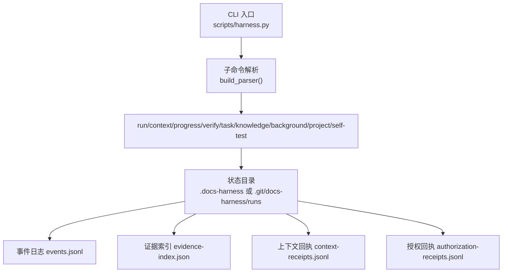
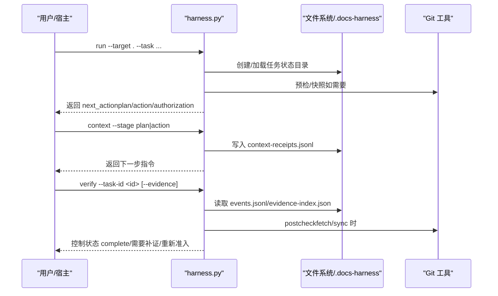
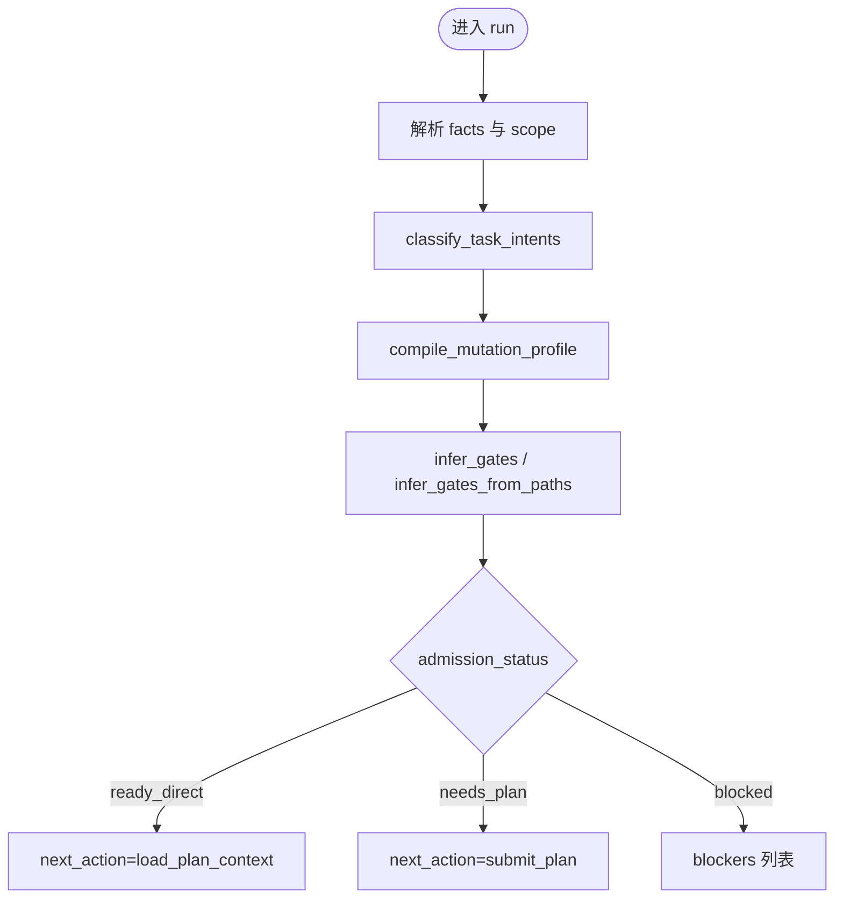
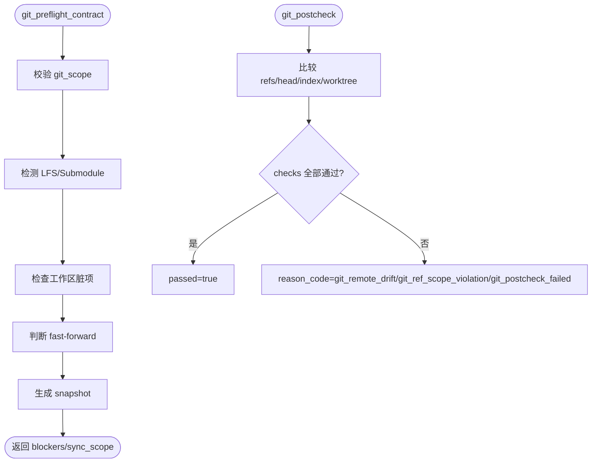
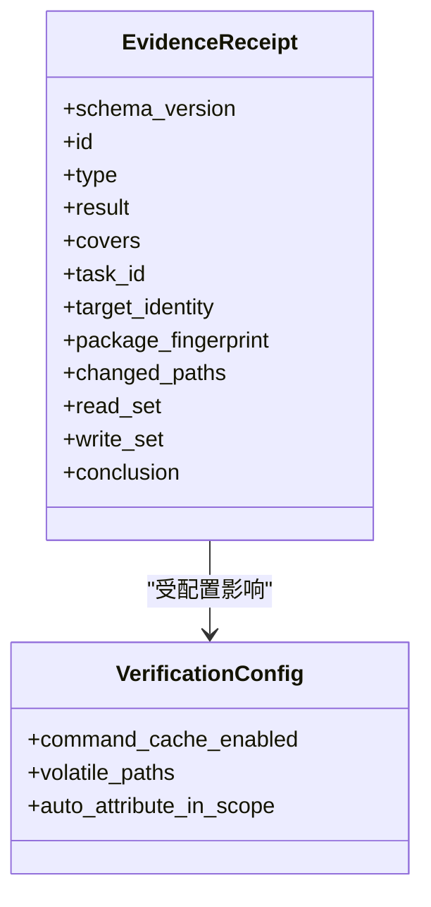
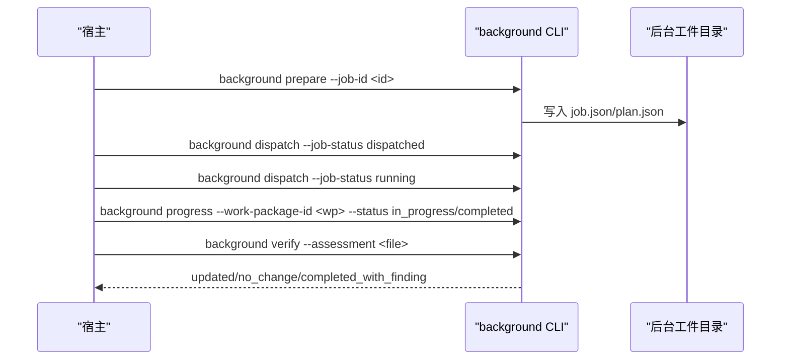
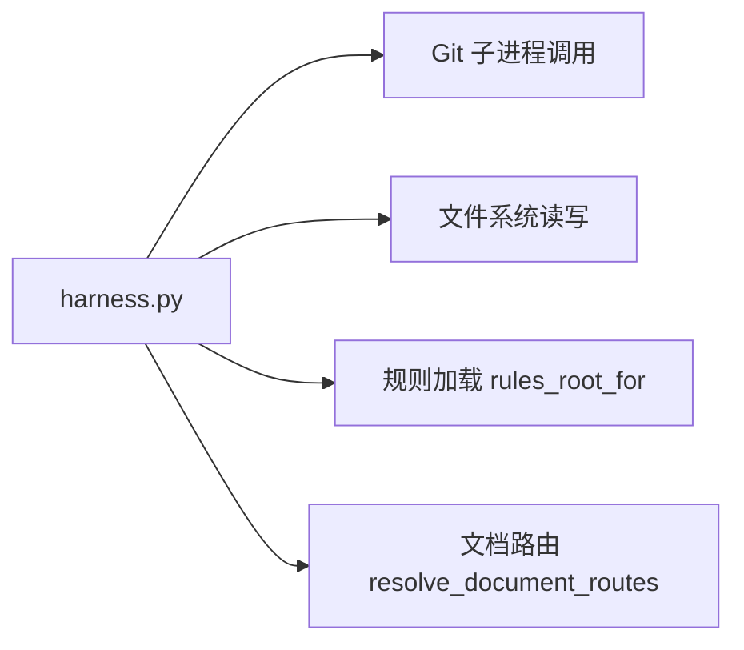

# 故障排除

<cite>
**本文引用的文件**   
- [scripts/harness.py](file://scripts/harness.py)
- [tests/test_harness.py](file://tests/test_harness.py)
- [SKILL.md](file://SKILL.md)
- [package.json](file://package.json)
</cite>

## 目录
1. [简介](#简介)
2. [项目结构](#项目结构)
3. [核心组件](#核心组件)
4. [架构总览](#架构总览)
5. [详细组件分析](#详细组件分析)
6. [依赖关系分析](#依赖关系分析)
7. [性能注意事项](#性能注意事项)
8. [故障排除指南](#故障排除指南)
9. [结论](#结论)
10. [附录](#附录)

## 简介
本指南面向 Docs Harness 的运维与使用者，聚焦于任务准入失败、验证命令错误、Git 集成问题与后台任务异常的常见场景。内容涵盖日志分析方法、调试技巧、错误分类与处理策略、恢复步骤以及错误代码参考矩阵，帮助快速定位并解决问题。

## 项目结构
Docs Harness 以独立 Python CLI 为核心，通过子命令组织功能：run、context、progress、verify、task、knowledge、background、project、self-test。运行时状态与事件落盘在目标项目的 .docs-harness 或 Git 仓库 docs-harness/runs 下，事件采用 JSONL 追加写入，便于审计与回溯。

**图表来源** 
- [scripts/harness.py:10299-10360](file://scripts/harness.py#L10299-L10360)
- [scripts/harness.py:906-922](file://scripts/harness.py#L906-L922)
- [scripts/harness.py:1031-1070](file://scripts/harness.py#L1031-L1070)

**章节来源**
- [scripts/harness.py:10299-10360](file://scripts/harness.py#L10299-L10360)
- [package.json:1-23](file://package.json#L1-L23)

## 核心组件
- 错误模型与统一抛出：HarnessError 携带 code 与 exit_code，所有异常路径均收敛为结构化错误响应。
- 事件记录：append_task_event 将阶段、耗时、原因码、计数等指标写入 events.jsonl，支持按 task_id 检索。
- 状态锁：state_lock 提供进程级互斥，避免并发写冲突；超时清理机制防止死锁。
- Git 预检与后验：git_preflight_contract 与 git_postcheck 对 fetch/sync 做范围、LFS、Submodule、快进合并等约束校验。
- 知识状态：knowledge_status 评估知识库是否 ready/partial/absent/quarantined，并给出 gaps 与 active_job_id。
- 后台任务：background_* 系列函数管理 Job 生命周期、工作包进度、验收与重试。

**章节来源**
- [scripts/harness.py:392-397](file://scripts/harness.py#L392-L397)
- [scripts/harness.py:1031-1070](file://scripts/harness.py#L1031-L1070)
- [scripts/harness.py:1008-1029](file://scripts/harness.py#L1008-L1029)
- [scripts/harness.py:677-791](file://scripts/harness.py#L677-L791)
- [scripts/harness.py:793-875](file://scripts/harness.py#L793-L875)
- [scripts/harness.py:1653-1684](file://scripts/harness.py#L1653-L1684)

## 架构总览
下图展示一次典型 run→context→verify 流程中的关键交互与状态落盘点，包括事件记录、证据索引与回执文件。

**图表来源** 
- [scripts/harness.py:10322-10356](file://scripts/harness.py#L10322-L10356)
- [scripts/harness.py:1031-1070](file://scripts/harness.py#L1031-L1070)
- [scripts/harness.py:793-875](file://scripts/harness.py#L793-L875)

## 详细组件分析

### 任务准入与意图推断
- 意图分类：classify_task_intents 基于关键词与否定守卫识别 query/audit/git_inspect/git_fetch/git_sync/modify/external_write，并输出候选与延迟意图。
- 变更等级：compile_mutation_profile 取最高 mutation_profile，确保只读查询不会误升级。
- Gate 推断：infer_gates/infer_gates_from_paths 结合任务文本与路径特征推断产品/架构/安全/前端/测试/代码/文档编辑等 Gate。
- 幂等复用：相同 target+任务文本+事实+快照会复用活动任务，避免重复建立上下文与授权。

**图表来源** 
- [scripts/harness.py:2154-2228](file://scripts/harness.py#L2154-L2228)
- [scripts/harness.py:2236-2243](file://scripts/harness.py#L2236-L2243)
- [scripts/harness.py:2245-2286](file://scripts/harness.py#L2245-L2286)
- [scripts/harness.py:936-1005](file://scripts/harness.py#L936-L1005)

**章节来源**
- [scripts/harness.py:2154-2228](file://scripts/harness.py#L2154-L2228)
- [scripts/harness.py:2236-2243](file://scripts/harness.py#L2236-L2243)
- [scripts/harness.py:2245-2286](file://scripts/harness.py#L2245-L2286)
- [scripts/harness.py:936-1005](file://scripts/harness.py#L936-L1005)

### Git 集成与同步
- 预检：git_preflight_contract 检查远端引用、fast-forward、脏工作区、删除数量阈值、LFS/Submodule 可用性，生成 snapshot。
- 后验：git_postcheck 对比 refs、head、index、worktree 指纹，判定 remote_target_unchanged、refs_within_contract、branch_not_diverged 等。
- 漂移处理：若远端漂移触发 reason_code=git_remote_drift，需重新准入；受控 ref 越界则 reason_code=git_ref_scope_violation。

**图表来源** 
- [scripts/harness.py:677-791](file://scripts/harness.py#L677-L791)
- [scripts/harness.py:793-875](file://scripts/harness.py#L793-L875)

**章节来源**
- [scripts/harness.py:677-791](file://scripts/harness.py#L677-L791)
- [scripts/harness.py:793-875](file://scripts/harness.py#L793-L875)

### 验证命令与证据
- 证据收据：v2 收据绑定 task/target/package fingerprint、producer、时间戳、changed_paths/read_set/write_set/conclusion。
- 缓存与挥发：verification.command_cache_enabled 可关闭逐项缓存；volatile_paths 白名单允许临时产物不视为额外写入。
- 自动归因：write_scope 内未归因写入默认 auto_attribute_in_scope=true，控制器代铸 workspace_attribution 收据。

**图表来源** 
- [scripts/harness.py:1178-1213](file://scripts/harness.py#L1178-L1213)
- [scripts/harness.py:1142-1176](file://scripts/harness.py#L1142-L1176)

**章节来源**
- [scripts/harness.py:1178-1213](file://scripts/harness.py#L1178-L1213)
- [scripts/harness.py:1142-1176](file://scripts/harness.py#L1142-L1176)

### 后台任务治理
- 路线：background_direct/goal/goal_phased，复杂路线需 prepare→dispatched→running→progress→verify。
- 工件：job.json/plan.json/progress.json/events.jsonl 仅由 CLI 控制面写入，业务数据面不得直接修改。
- 重试与修复：retry 归档旧 attempt 工件并要求重新 prepare；损坏工件需 background prepare --repair。

**图表来源** 
- [scripts/harness.py:9735-9781](file://scripts/harness.py#L9735-L9781)
- [scripts/harness.py:10255-10269](file://scripts/harness.py#L10255-L10269)

**章节来源**
- [scripts/harness.py:9735-9781](file://scripts/harness.py#L9735-L9781)
- [scripts/harness.py:10255-10269](file://scripts/harness.py#L10255-L10269)

## 依赖关系分析
- 模块内聚：harness.py 集中了 CLI、状态机、Git 工具封装、事件与证据处理、后台 Job 管理。
- 外部依赖：Git 命令行、Python 标准库、文件系统 I/O。
- 规则与合同：rules_root_for 动态加载 harness-home/rules/*.md 作为 active 规则；document_routes 校验文档真源。

**图表来源** 
- [scripts/harness.py:1888-1907](file://scripts/harness.py#L1888-L1907)
- [scripts/harness.py:1400-1456](file://scripts/harness.py#L1400-L1456)

**章节来源**
- [scripts/harness.py:1888-1907](file://scripts/harness.py#L1888-L1907)
- [scripts/harness.py:1400-1456](file://scripts/harness.py#L1400-L1456)

## 性能注意事项
- 事件与回执追加写入使用原子化与 fsync，保证一致性但可能带来 IO 开销。
- 工作区快照在非 Git 模式下有文件大小限制，避免巨型目录导致性能退化。
- 验证命令缓存默认开启，可通过 verification.command_cache_enabled 整体关闭以排查缓存相关问题。

[本节为通用指导，无需特定文件来源]

## 故障排除指南

### 一、常见问题诊断方法

#### 1. 任务准入失败
- 现象：admission_status=blocked 或 needs_plan，返回 blockers 列表。
- 诊断要点：
  - 检查 facts 中 candidate_intents 与 task_intent 是否合法。
  - 确认 scope 描述是否为结构化路径，非自然语言。
  - 查看 inferred gates 与 mutation_profile 是否合理。
- 常用命令：
  - run --facts <facts.json> --scope <paths> --json
  - context --stage plan 或 action 获取下一步指令
- 参考实现：
  - classify_task_intents、compile_mutation_profile、infer_gates、validate_scope

**章节来源**
- [scripts/harness.py:2154-2228](file://scripts/harness.py#L2154-L2228)
- [scripts/harness.py:2236-2243](file://scripts/harness.py#L2236-L2243)
- [scripts/harness.py:2245-2286](file://scripts/harness.py#L2245-L2286)
- [scripts/harness.py:2334-2353](file://scripts/harness.py#L2334-L2353)

#### 2. 验证命令错误
- 现象：verify 返回 provide_evidence/refresh_evidence/retry_verification/full_readmission。
- 诊断要点：
  - 检查 evidence 收据 schema_version 与字段完整性。
  - 确认 verification.command_cache_enabled 与 volatile_paths 配置。
  - 若 write_scope 内写入未归因，启用 auto_attribute_in_scope 或手动提交 v2 收据。
- 常用命令：
  - verify --task-id <id> --evidence <evidence.json> --json
- 参考实现：
  - 证据校验与缓存逻辑、自动归因开关

**章节来源**
- [scripts/harness.py:1178-1213](file://scripts/harness.py#L1178-L1213)
- [scripts/harness.py:1142-1176](file://scripts/harness.py#L1142-L1176)

#### 3. Git 集成问题
- 现象：git_preflight_timeout/git_preflight_failed/git_remote_unavailable/git_remote_ref_missing/git_sync_scope_ambiguous。
- 诊断要点：
  - 确认目标为独立 Git 根目录且远端存在。
  - 检查 LFS/Submodule 可用性与状态。
  - 对于 git_sync，确保 fast-forward 且无脏工作区重叠。
- 常用命令：
  - git status、git log、git ls-remote、git lfs version、git submodule status
- 参考实现：
  - git_preflight_contract、git_postcheck、git_command

**章节来源**
- [scripts/harness.py:677-791](file://scripts/harness.py#L677-L791)
- [scripts/harness.py:793-875](file://scripts/harness.py#L793-L875)
- [scripts/harness.py:572-583](file://scripts/harness.py#L572-L583)

#### 4. 后台任务异常
- 现象：Job 处于 needs_user_input/needs_rebase/queued_manual 或 stale_after 过期。
- 诊断要点：
  - 检查 job.json/plan.json/progress.json 是否被业务侧非法修改。
  - 确认 prepare→dispatched→running→progress→verify 顺序完整。
  - 工件损坏时使用 background prepare --repair。
- 常用命令：
  - background list/status/prepare/dispatch/progress/verify/retry --json
- 参考实现：
  - background_* 命令与状态机、迁移与修复逻辑

**章节来源**
- [scripts/harness.py:9735-9781](file://scripts/harness.py#L9735-L9781)
- [scripts/harness.py:10255-10269](file://scripts/harness.py#L10255-L10269)

### 二、日志分析技巧

#### 1. 事件日志解读
- 位置：events.jsonl，每行一个 JSON 对象，包含 event、phase、duration_ms、reason_code、context_load_count、readmission_count、evidence_round_count 等。
- 分析方法：
  - 按 task_id 过滤，观察各阶段耗时与重试次数。
  - 关注 reason_code 变化，定位失败分支。
  - 结合 context-receipts.jsonl 与 authorization-receipts.jsonl 交叉验证上下文与授权。

**章节来源**
- [scripts/harness.py:1031-1070](file://scripts/harness.py#L1031-L1070)

#### 2. 调试输出分析
- CLI 输出：--json 模式输出结构化 payload，包含 next_action、next_command_argv、artifact_ref 等。
- 自检：self-test 命令校验版本、规则、合同一致性。

**章节来源**
- [scripts/harness.py:10299-10360](file://scripts/harness.py#L10299-L10360)
- [scripts/harness.py:10103-10152](file://scripts/harness.py#L10103-L10152)

#### 3. 性能瓶颈定位
- 关注 duration_ms 与 context_load_count/evidence_round_count，识别慢上下文加载或多次补证。
- 检查 workspace_snapshot 是否触发截断限制。

**章节来源**
- [scripts/harness.py:1031-1070](file://scripts/harness.py#L1031-L1070)
- [scripts/harness.py:1112-1135](file://scripts/harness.py#L1112-L1135)

### 三、调试工具与技巧

#### 1. 断点设置
- 在 main() 入口与 command_* 函数处设置断点，观察 args 与 payload。
- 针对 Git 调用，可在 git_command 前后打印 stdout/stderr。

**章节来源**
- [scripts/harness.py:10322-10356](file://scripts/harness.py#L10322-L10356)
- [scripts/harness.py:572-583](file://scripts/harness.py#L572-L583)

#### 2. 状态检查
- 使用 task status/list/prune 查看任务状态与清理候选。
- 使用 project check/diff 检查安装状态与差异。

**章节来源**
- [scripts/harness.py:10022-10064](file://scripts/harness.py#L10022-L10064)
- [scripts/harness.py:10224-10232](file://scripts/harness.py#L10224-L10232)

#### 3. 问题复现
- 固定 target、任务文本、facts 与快照，利用幂等复用特性稳定复现。
- 必要时使用 --new-task 强制新建任务隔离环境。

**章节来源**
- [SKILL.md:25-44](file://SKILL.md#L25-L44)

### 四、错误分类与处理策略

#### 1. 可重试错误
- 特征：reason_code 属于 BACKGROUND_RETRYABLE_STATES 或验证命令失败。
- 策略：background retry 或 verify 重试，必要时清理缓存或修复工件。

**章节来源**
- [scripts/harness.py:114](file://scripts/harness.py#L114)

#### 2. 需补证错误
- 特征：provide_evidence/refresh_evidence。
- 策略：补充 v2 证据收据或刷新漂移路径证据，保持 read_set/write_set 一致。

**章节来源**
- [SKILL.md:43-54](file://SKILL.md#L43-L54)

#### 3. 完整重新准入
- 特征：full_readmission，通常因高风险或合同变化。
- 策略：重新执行 run，接受新的 admission_status 与 next_action。

**章节来源**
- [SKILL.md:43-54](file://SKILL.md#L43-L54)

### 五、故障恢复步骤

#### 1. 状态重置
- 清理状态锁：若检测到 stale_lock，人工确认后清理 .lock。
- 重置任务：task cancel/archive 后重新 run。

**章节来源**
- [scripts/harness.py:1008-1029](file://scripts/harness.py#L1008-L1029)
- [scripts/harness.py:10224-10232](file://scripts/harness.py#L10224-L10232)

#### 2. 工件清理
- background prune --apply 清理过期工件。
- project uninstall --purge-runtime 清理运行时目录（谨慎）。

**章节来源**
- [scripts/harness.py:10255-10269](file://scripts/harness.py#L10255-L10269)
- [scripts/harness.py:10065-10100](file://scripts/harness.py#L10065-L10100)

#### 3. 任务重启
- 使用 run --task-id <id> 继续已有任务，或 --new-task 强制新建。
- 对于 Git 漂移，先解决漂移再 verify。

**章节来源**
- [SKILL.md:25-44](file://SKILL.md#L25-L44)
- [scripts/harness.py:793-875](file://scripts/harness.py#L793-L875)

### 六、常见错误代码参考与解决方案矩阵

- missing_file/invalid_json：输入文件缺失或 JSON 无效，检查路径与格式。
- invalid_task_id：task-id 格式不符，遵循 dh-YYYYMMDDTHHMMSS-<hash>。
- git_preflight_timeout/git_preflight_failed：Git 命令超时或失败，检查网络与权限。
- git_remote_unavailable/git_remote_ref_missing：远端不可达或引用不存在，确认 remote 与 refspec。
- git_sync_scope_ambiguous：git_sync 必须绑定单一远端分支，修正 git_scope。
- git_remote_drift/git_ref_scope_violation：远端漂移或受控 ref 越界，重新准入或调整范围。
- state_locked/stale_lock：状态锁冲突或过期，清理锁文件或等待。
- invalid_scope_description：scope 包含自然语言描述，改为结构化路径。
- invalid_gate/invalid_mutation_profile：Gate 或变更等级无效，修正 facts。
- invalid_knowledge_map/knowledge_pending：知识地图非法或未就绪，完善 knowledge-map.json。
- background_job_stale：后台 Job 过期，重试或清理。

**章节来源**
- [scripts/harness.py:392-397](file://scripts/harness.py#L392-L397)
- [scripts/harness.py:541-543](file://scripts/harness.py#L541-L543)
- [scripts/harness.py:572-583](file://scripts/harness.py#L572-L583)
- [scripts/harness.py:615-639](file://scripts/harness.py#L615-L639)
- [scripts/harness.py:664-671](file://scripts/harness.py#L664-L671)
- [scripts/harness.py:793-875](file://scripts/harness.py#L793-L875)
- [scripts/harness.py:1008-1029](file://scripts/harness.py#L1008-L1029)
- [scripts/harness.py:2334-2353](file://scripts/harness.py#L2334-L2353)
- [scripts/harness.py:2245-2249](file://scripts/harness.py#L2245-L2249)
- [scripts/harness.py:2236-2243](file://scripts/harness.py#L2236-L2243)
- [scripts/harness.py:1526-1588](file://scripts/harness.py#L1526-L1588)
- [scripts/harness.py:9669-9689](file://scripts/harness.py#L9669-L9689)

## 结论
通过结构化错误码、事件日志与严格的 Git/证据契约，Docs Harness 提供了可观测、可恢复的任务治理体系。建议在日常运维中优先依据 events.jsonl 与 reason_code 定位问题，结合 CLI 子命令进行状态检查与恢复，必要时使用 self-test 与 project check 保障环境健康。

[本节为总结性内容，无需特定文件来源]

## 附录

### 实用命令速查
- 任务运行与上下文：run、context、verify、task
- 后台治理：background list/status/prepare/dispatch/progress/verify/retry
- 项目维护：project init/upgrade/check/diff/uninstall
- 自检：self-test

**章节来源**
- [scripts/harness.py:10160-10279](file://scripts/harness.py#L10160-L10279)
- [package.json:17-21](file://package.json#L17-L21)