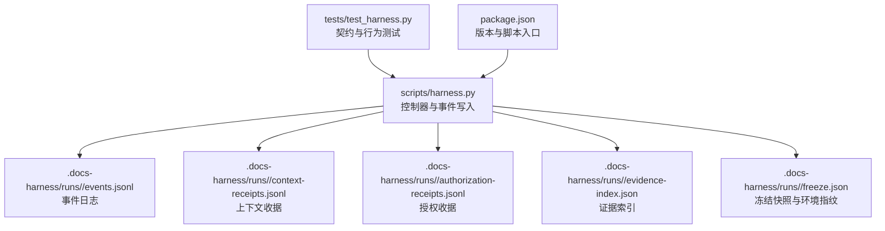
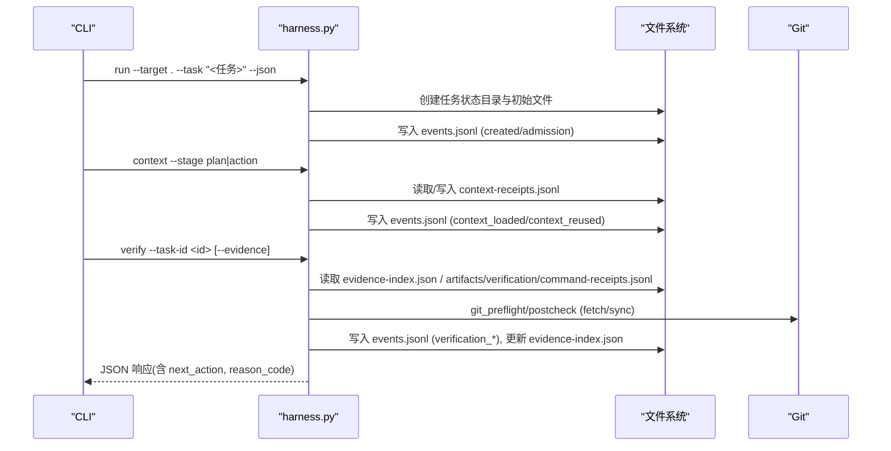
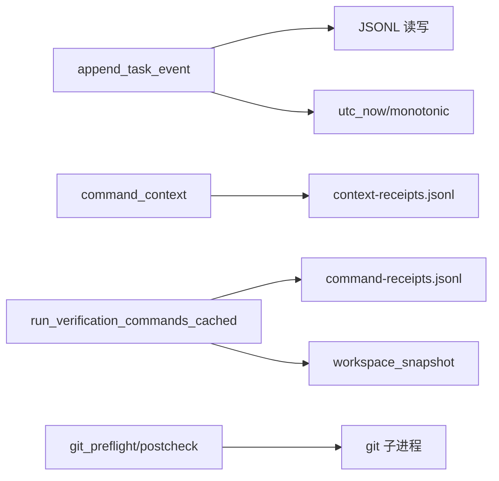

# 日志分析技巧

<cite>
**本文引用的文件**   
- [scripts/harness.py](file://scripts/harness.py)
- [tests/test_harness.py](file://tests/test_harness.py)
- [package.json](file://package.json)
</cite>

## 目录
1. [简介](#简介)
2. [项目结构](#项目结构)
3. [核心组件](#核心组件)
4. [架构总览](#架构总览)
5. [详细组件分析](#详细组件分析)
6. [依赖关系分析](#依赖关系分析)
7. [性能考量](#性能考量)
8. [故障排查指南](#故障排查指南)
9. [结论](#结论)
10. [附录：日志分析工具与脚本示例](#附录日志分析工具与脚本示例)

## 简介
本指南面向 Docs Harness 的运维、开发与审计人员，系统化讲解如何解读事件日志、调试输出与性能指标，帮助快速定位问题、优化执行效率并建立稳定的日志策略。内容覆盖：
- 事件日志格式规范、关键事件类型与时间线分析方法
- 调试输出（上下文加载、验证命令执行）的分析要点
- 性能瓶颈定位（CPU、I/O、数据库/外部调用）
- 日志级别配置与过滤技巧（多环境策略、敏感信息脱敏、轮转）
- 实用分析与自动化脚本示例

## 项目结构
Docs Harness 的核心控制逻辑集中在 Python 脚本中，测试与包元数据分别位于 tests 与 package.json。运行时产物（任务状态、事件、收据等）按任务隔离存放于目标仓库的工作区或 Git 内部路径。

图表来源
- [scripts/harness.py:80-90](file://scripts/harness.py#L80-L90)
- [scripts/harness.py:3206-3239](file://scripts/harness.py#L3206-L3239)
- [tests/test_harness.py:17-24](file://tests/test_harness.py#L17-L24)
- [package.json:1-23](file://package.json#L1-L23)

章节来源
- [scripts/harness.py:80-90](file://scripts/harness.py#L80-L90)
- [scripts/harness.py:3206-3239](file://scripts/harness.py#L3206-L3239)
- [tests/test_harness.py:17-24](file://tests/test_harness.py#L17-L24)
- [package.json:1-23](file://package.json#L1-L23)

## 核心组件
- 事件系统
  - 事件写入统一通过 append_task_event，持久化到 events.jsonl，包含 schema_version、event、phase、started_at、duration_ms、reason_code、at 等字段，以及上下文缓存命中、读入计数、证据轮次等业务统计。
  - 事件用于构建任务时间线、回放与审计。
- 上下文收据与缓存
  - context-receipts.jsonl 记录各阶段（plan/action/work_package）上下文加载结果，支持缓存命中与增量差异识别，减少重复加载。
- 验证命令执行与缓存
  - verification_command_receipts.jsonl 缓存逐条验证命令的执行结果，避免重复执行；失败时生成证据并标记 unexpected_write_set/volatile_write_set。
- 工作区快照与变更追踪
  - workspace_snapshot 对文件集合计算指纹，配合 snapshot_changes 精确识别变更集，支撑证据归因与漂移检测。
- 安全与脱敏
  - 远程 URL 指纹去凭据、敏感模式匹配与校验，确保日志与指纹不含敏感信息。

章节来源
- [scripts/harness.py:1034-1074](file://scripts/harness.py#L1034-L1074)
- [scripts/harness.py:4287-4433](file://scripts/harness.py#L4287-L4433)
- [scripts/harness.py:5903-6062](file://scripts/harness.py#L5903-L6062)
- [scripts/harness.py:1115-1143](file://scripts/harness.py#L1115-L1143)
- [scripts/harness.py:588-613](file://scripts/harness.py#L588-L613)
- [scripts/harness.py:196-198](file://scripts/harness.py#L196-L198)

## 架构总览
下图展示一次典型 run→context→verify 流程中的事件与收据流转，体现“只写不可变”的事件流与可复用的收据/缓存机制。

图表来源
- [scripts/harness.py:3206-3239](file://scripts/harness.py#L3206-L3239)
- [scripts/harness.py:4287-4433](file://scripts/harness.py#L4287-L4433)
- [scripts/harness.py:5903-6062](file://scripts/harness.py#L5903-L6062)
- [scripts/harness.py:680-878](file://scripts/harness.py#L680-L878)

## 详细组件分析

### 事件日志规范与时间线分析
- 事件文件位置
  - 每个任务状态目录下的 events.jsonl，按追加顺序记录生命周期事件。
- 事件关键字段
  - schema_version、event、phase、task_id、started_at、duration_ms、reason_code、at
  - 业务统计：context_cache_hit、context_load_count、readmission_count、evidence_round_count、host_receipt_count、business_action_count
- 常见 phase 与 event
  - admission: created
  - context: context_loaded / context_reused / context_delta_loaded
  - verification: 验证开始/结束、重试、失败原因
  - lifecycle: task_cancelled 等终态事件
- 时间线分析方法
  - 以 started_at/at 排序，结合 phase 与 event 重建执行序列
  - 使用 duration_ms 评估各阶段耗时，关注异常高耗时事件
  - 结合 reason_code 定位失败根因（如 git_remote_drift、state_locked、invalid_json 等）
  - 关联 context-receipts.jsonl 与 evidence-index.json 进行上下文与证据溯源

章节来源
- [scripts/harness.py:1034-1074](file://scripts/harness.py#L1034-L1074)
- [scripts/harness.py:3593-3613](file://scripts/harness.py#L3593-L3613)
- [scripts/harness.py:3206-3239](file://scripts/harness.py#L3206-L3239)

### 调试输出分析：上下文加载与验证命令
- 上下文加载
  - 通过 context-receipts.jsonl 判断是否命中缓存、是否增量加载、加载内容与规则清单
  - 事件中的 context_cache_hit、loaded_content_count、reused_content_count 反映缓存命中率与增量幅度
- 验证命令执行
  - artifacts/verification/command-receipts.jsonl 缓存命令结果，避免重复执行
  - 每次执行记录 command_argv_digest、exit_code、duration_ms、output_or_artifact_digest、produces
  - 若产生非挥发性写入，将标记 unexpected_write_set 并判定失败；volatile_write_set 仅可见不计入证据
- 调试建议
  - 优先检查 context_cache_hit 与 loaded_content_count，确认上下文是否正确复用
  - 关注 verification 阶段的 exit_code 与 unexpected_write_set，定位命令副作用
  - 使用 duration_ms 对比不同命令耗时，识别慢查询或阻塞 I/O

章节来源
- [scripts/harness.py:4287-4433](file://scripts/harness.py#L4287-L4433)
- [scripts/harness.py:5903-6062](file://scripts/harness.py#L5903-L6062)
- [scripts/harness.py:1145-1151](file://scripts/harness.py#L1145-L1151)

### 工作区快照与变更追踪
- 快照生成
  - workspace_snapshot 遍历工作区文件，计算 sha256 指纹或大文件的 size+mtime 摘要
  - 排除 .git、node_modules、.venv 及 .docs-harness 下 runs/quality-ledger/knowledge/background 等目录
- 变更识别
  - snapshot_changes 比较前后快照，返回新增/修改/删除的路径列表
- 应用
  - 证据归因、验证命令副作用检测、Git 同步范围约束

章节来源
- [scripts/harness.py:1115-1143](file://scripts/harness.py#L1115-L1143)
- [scripts/harness.py:1076-1086](file://scripts/harness.py#L1076-L1086)

### Git 预检与后检
- 预检（preflight）
  - 校验远端可达性、LFS/Submodule 可用性、fast-forward 条件、脏工作区与同步范围重叠
  - 生成 git_state_snapshot 包含 remote、refs、head、index_tree、worktree_fingerprint 等
- 后检（postcheck）
  - 验证远端目标未漂移、受控引用未越界、分支未分叉、LFS/Submodule 状态有效
  - 失败原因码：git_remote_drift、git_ref_scope_violation、git_postcheck_failed

章节来源
- [scripts/harness.py:680-878](file://scripts/harness.py#L680-L878)

### 安全与敏感信息处理
- 远程 URL 指纹脱敏
  - sanitized_remote_fingerprint 去除用户名/密码/令牌与片段，保证指纹稳定且不含敏感信息
- 敏感模式匹配
  - QUALITY_SECRET_PATTERN 用于识别密钥、Bearer Token 等敏感字符串，便于在质量审查或日志中脱敏
- 输入校验与大小限制
  - load_input_file/load_json_object_file 对文件大小与格式严格校验，防止注入与解析异常

章节来源
- [scripts/harness.py:588-613](file://scripts/harness.py#L588-L613)
- [scripts/harness.py:196-198](file://scripts/harness.py#L196-L198)
- [scripts/harness.py:459-508](file://scripts/harness.py#L459-L508)

## 依赖关系分析
- 模块内依赖
  - 事件写入依赖 JSONL 读写、原子写入、时间戳与哈希工具
  - 上下文收据依赖目标身份、编译器合同、内容指纹比对
  - 验证命令缓存依赖 cache_key 构造、TTL 过期判断、工作区快照
- 外部依赖
  - Git 子进程调用（ls-remote、rev-parse、diff、status、lfs、submodule）
  - 文件系统操作（原子写入、临时文件、锁文件）

图表来源
- [scripts/harness.py:1034-1074](file://scripts/harness.py#L1034-L1074)
- [scripts/harness.py:4287-4433](file://scripts/harness.py#L4287-L4433)
- [scripts/harness.py:5903-6062](file://scripts/harness.py#L5903-L6062)
- [scripts/harness.py:680-878](file://scripts/harness.py#L680-L878)

章节来源
- [scripts/harness.py:1034-1074](file://scripts/harness.py#L1034-L1074)
- [scripts/harness.py:4287-4433](file://scripts/harness.py#L4287-L4433)
- [scripts/harness.py:5903-6062](file://scripts/harness.py#L5903-L6062)
- [scripts/harness.py:680-878](file://scripts/harness.py#L680-L878)

## 性能考量
- CPU 占用分析
  - 关注 duration_ms 分布，识别长耗时事件（如验证命令、Git 操作、上下文加载）
  - 利用 context_cache_hit 降低重复计算与 I/O
- I/O 监控
  - 工作区快照与 JSONL 追加是主要 I/O 热点；合理设置 volatile_paths 减少无关写入
  - 大文件指纹采用 size+mtime，避免全量哈希带来的开销
- 数据库/外部调用
  - 通过 verification_commands 的 exit_code 与 output digest 间接观测外部依赖稳定性
  - 超时与错误码纳入 reason_code，便于聚合分析

[本节为通用指导，不直接分析具体文件]

## 故障排查指南
- 常见问题与定位
  - 状态锁冲突：.lock 存在且超过阈值视为陈旧锁，需人工清理；否则提示 state_locked
  - JSON 无效：events.jsonl 行解析失败会报 invalid_state，需修复损坏事件
  - Git 预检失败：LFS/Submodule 不可用、远端不可达、fast-forward 不满足、脏工作区重叠
  - 验证命令副作用：unexpected_write_set 非空导致失败，需调整命令或白名单
- 排查步骤
  - 查看 events.jsonl 最近事件，定位 phase 与 reason_code
  - 检查 context-receipts.jsonl 确认上下文是否命中缓存
  - 检查 artifacts/verification/command-receipts.jsonl 获取命令执行详情
  - 核对 freeze.json 的环境指纹与工作区快照一致性

章节来源
- [scripts/harness.py:1011-1032](file://scripts/harness.py#L1011-L1032)
- [scripts/harness.py:518-532](file://scripts/harness.py#L518-L532)
- [scripts/harness.py:680-878](file://scripts/harness.py#L680-L878)
- [scripts/harness.py:5903-6062](file://scripts/harness.py#L5903-L6062)

## 结论
Docs Harness 通过结构化事件与收据实现可审计、可回放的执行过程。借助事件时间线、上下文与验证收据、工作区快照与 Git 预/后检，能够快速定位问题、优化性能并保障安全。建议结合本指南的日志策略与脚本示例，建立标准化的排障与监控体系。

[本节为总结，不直接分析具体文件]

## 附录：日志分析工具与脚本示例
以下示例基于仓库现有能力与数据结构，提供可直接运行的思路与命令参考（不粘贴代码内容，仅给出路径与用法说明）。

- 提取事件时间线与耗时
  - 读取 events.jsonl，按 started_at/at 排序，筛选 phase=verification 或 context，统计 duration_ms 分布
  - 参考事件写入与读取函数：append_task_event、read_jsonl
  - 参考路径：[scripts/harness.py:1034-1074](file://scripts/harness.py#L1034-L1074)、[scripts/harness.py:518-532](file://scripts/harness.py#L518-L532)

- 上下文缓存命中率分析
  - 统计 context-receipts.jsonl 中 context_cache_hit 比例，结合 loaded_content_count 与 reused_content_count
  - 参考路径：[scripts/harness.py:4287-4433](file://scripts/harness.py#L4287-L4433)

- 验证命令执行与副作用检测
  - 读取 artifacts/verification/command-receipts.jsonl，统计 exit_code、duration_ms、unexpected_write_set、volatile_write_set
  - 参考路径：[scripts/harness.py:5903-6062](file://scripts/harness.py#L5903-L6062)

- Git 预检/后检失败原因聚合
  - 从 events.jsonl 与 verify 响应中提取 reason_code（如 git_remote_drift、git_ref_scope_violation），汇总失败次数
  - 参考路径：[scripts/harness.py:680-878](file://scripts/harness.py#L680-L878)

- 敏感信息脱敏与指纹校验
  - 使用 QUALITY_SECRET_PATTERN 扫描日志与收据，替换敏感串；验证 sanitized_remote_fingerprint 一致性
  - 参考路径：[scripts/harness.py:196-198](file://scripts/harness.py#L196-L198)、[scripts/harness.py:588-613](file://scripts/harness.py#L588-L613)

- 运行测试与自检
  - 使用 package.json 提供的脚本执行单元测试与 self-test，确保契约与规则生效
  - 参考路径：[package.json:17-21](file://package.json#L17-L21)

章节来源
- [scripts/harness.py:1034-1074](file://scripts/harness.py#L1034-L1074)
- [scripts/harness.py:518-532](file://scripts/harness.py#L518-L532)
- [scripts/harness.py:4287-4433](file://scripts/harness.py#L4287-L4433)
- [scripts/harness.py:5903-6062](file://scripts/harness.py#L5903-L6062)
- [scripts/harness.py:680-878](file://scripts/harness.py#L680-L878)
- [scripts/harness.py:196-198](file://scripts/harness.py#L196-L198)
- [scripts/harness.py:588-613](file://scripts/harness.py#L588-L613)
- [package.json:17-21](file://package.json#L17-L21)