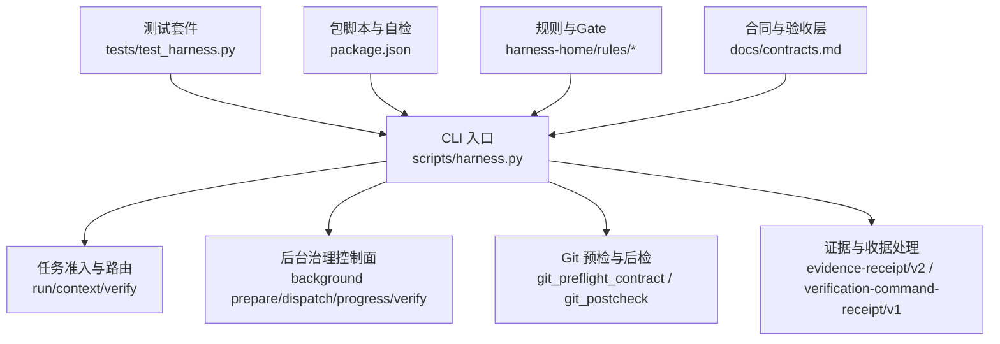
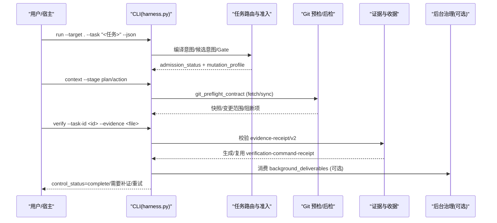
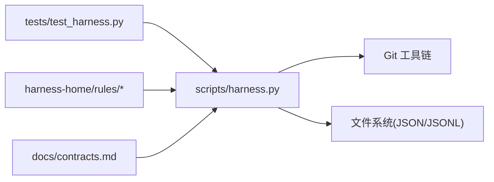

# 调试工具和技巧

<cite>
**本文引用的文件**   
- [scripts/harness.py](file://scripts/harness.py)
- [tests/test_harness.py](file://tests/test_harness.py)
- [package.json](file://package.json)
- [SKILL.md](file://SKILL.md)
- [docs/contracts.md](file://docs/contracts.md)
- [docs/testing.md](file://docs/testing.md)
- [harness-home/rules/INDEX.md](file://harness-home/rules/INDEX.md)
</cite>

## 目录
1. [简介](#简介)
2. [项目结构](#项目结构)
3. [核心组件](#核心组件)
4. [架构总览](#架构总览)
5. [详细组件分析](#详细组件分析)
6. [依赖关系分析](#依赖关系分析)
7. [性能考量](#性能考量)
8. [故障排查指南](#故障排查指南)
9. [结论](#结论)
10. [附录](#附录)

## 简介
本指南面向 Docs Harness 的开发者与使用者，聚焦“如何高效调试”：从断点设置、条件断点、变量检查，到状态检查（任务状态、证据索引、后台作业）、问题复现（最小化用例、环境隔离、数据准备），以及调试模式（详细日志、模拟数据注入、外部服务 mock）。文档以仓库实际实现为依据，提供可操作的步骤与图示。

## 项目结构
Docs Harness 以独立 Python 控制器为核心，配合测试套件与规则集，形成“意图优先、证据可复用且失败关闭”的控制面。关键位置如下：
- 控制器入口与主逻辑：scripts/harness.py
- 自动化测试与用例构造：tests/test_harness.py
- 包脚本与自检命令：package.json
- 能力说明与 CLI 用法：SKILL.md
- 合同与验收层定义：docs/contracts.md
- 测试事实与分层验收策略：docs/testing.md
- 生效规则清单与加载约定：harness-home/rules/INDEX.md

图表来源
- [scripts/harness.py:1-120](file://scripts/harness.py#L1-L120)
- [tests/test_harness.py:1-120](file://tests/test_harness.py#L1-L120)
- [package.json:17-22](file://package.json#L17-L22)
- [docs/contracts.md:1-120](file://docs/contracts.md#L1-L120)
- [harness-home/rules/INDEX.md:1-41](file://harness-home/rules/INDEX.md#L1-L41)

章节来源
- [scripts/harness.py:1-120](file://scripts/harness.py#L1-L120)
- [tests/test_harness.py:1-120](file://tests/test_harness.py#L1-L120)
- [package.json:17-22](file://package.json#L17-L22)
- [SKILL.md:1-60](file://SKILL.md#L1-L60)
- [docs/contracts.md:1-120](file://docs/contracts.md#L1-L120)
- [docs/testing.md:1-25](file://docs/testing.md#L1-L25)
- [harness-home/rules/INDEX.md:1-41](file://harness-home/rules/INDEX.md#L1-L41)

## 核心组件
- 控制器与错误模型：统一异常 HarnessError 携带 code 与 exit_code，贯穿输入校验、JSON 解析、文件系统与 Git 操作等路径，便于定位与分类。
- Git 预检/后检：git_preflight_contract 生成受控快照与变更范围；git_postcheck 验证远端漂移、ref 越界、非 fast-forward、删除阈值、LFS/Submodule 可用性。
- 证据与收据：evidence-receipt/v2 绑定 task/target/package fingerprint、可信 producer、读写集合；verification-command-receipt/v1 支持命令级缓存与逐项收据。
- 后台治理：background prepare/dispatch/progress/verify 严格约束工件版本、attempt、工作包全集与指纹，确保幂等与一致性。
- 规则与 Gate：按关键词与精确词表匹配风险 Gate，安全底线不可豁免，结合否定守卫避免误报。

章节来源
- [scripts/harness.py:395-410](file://scripts/harness.py#L395-L410)
- [scripts/harness.py:549-794](file://scripts/harness.py#L549-L794)
- [docs/contracts.md:165-221](file://docs/contracts.md#L165-L221)
- [docs/contracts.md:303-345](file://docs/contracts.md#L303-L345)
- [harness-home/rules/INDEX.md:12-36](file://harness-home/rules/INDEX.md#L12-L36)

## 架构总览
下图展示一次典型“run → context → verify”流程中的关键交互与状态流转，映射到控制器内部模块。

图表来源
- [scripts/harness.py:549-794](file://scripts/harness.py#L549-L794)
- [docs/contracts.md:165-221](file://docs/contracts.md#L165-L221)
- [docs/contracts.md:303-345](file://docs/contracts.md#L303-L345)

## 详细组件分析

### 断点与调试器使用（Python）
- 推荐在以下位置设置断点：
  - 输入解析与校验：load_input_file、load_json_object_file、safe_target、validate_task_id
  - Git 预检/后检：git_preflight_contract、git_postcheck
  - 证据处理：append_jsonl、read_jsonl、evidence 校验与收据生成
  - 后台治理：prepare/dispatch/progress/verify 的关键分支
- 条件断点建议：
  - 针对特定 task_id、job_id、remote ref 或 write_scope 命中时触发
  - 针对退出码为 2/3/4 的错误路径，快速定位失败原因
- 变量检查要点：
  - 查看 admission_status、mutation_profile、allowed_actions、write_scope、git_scope
  - 检查 git_state_snapshot 的 controlled_refs_namespace、fast_forward、deletion_count
  - 检查 evidence 的 producer、read_set/write_set、content_set_fingerprint、command_argv_digest

章节来源
- [scripts/harness.py:459-508](file://scripts/harness.py#L459-L508)
- [scripts/harness.py:535-547](file://scripts/harness.py#L535-L547)
- [scripts/harness.py:549-794](file://scripts/harness.py#L549-L794)
- [docs/contracts.md:165-221](file://docs/contracts.md#L165-L221)

### 状态检查方法
- 任务状态查看：
  - 通过 verify 返回 control_status 与 completion_manifest，判断是否 complete 或需补证/重试
  - 关注 delivery_layers 各层期望与状态，区分 not_applicable/not_requested/required
- 证据索引检查：
  - 读取 events.jsonl 与 evidence-index.json，核对任务绑定、producer 可信度、时间戳与 TTL
  - 对 verification-command-receipt 检查 cache_hit 与输入指纹一致性
- 后台作业监控：
  - background list/status/progress/verify 观察 attempt、work_package_states、终态语义
  - 复杂路线必须覆盖 prepare → dispatched → running → progress → verify 全链路

章节来源
- [docs/contracts.md:50-133](file://docs/contracts.md#L50-L133)
- [docs/contracts.md:165-221](file://docs/contracts.md#L165-L221)
- [docs/contracts.md:303-345](file://docs/contracts.md#L303-L345)
- [tests/test_harness.py:165-196](file://tests/test_harness.py#L165-L196)

### 问题复现技巧
- 最小化测试用例构建：
  - 参考 tests/test_harness.py 的 setUp/tearDown、init_project、bootstrap_knowledge、commit_project、init_git_remote
  - 使用临时目录隔离运行，避免污染真实仓库
- 环境隔离方法：
  - 通过 subprocess.run 调用 harness.py，设置 PYTHONDONTWRITEBYTECODE=1，捕获 stdout/stderr
  - 使用独立的 remote.git 与 clone 源，模拟远端漂移与分歧
- 数据准备策略：
  - 构造 plan-*.json、evidence-*.json、quality-review-*.json 等固定数据
  - 通过 write_background_goal_artifacts、complete_background_work_packages 驱动复杂 Job

章节来源
- [tests/test_harness.py:47-120](file://tests/test_harness.py#L47-L120)
- [tests/test_harness.py:146-164](file://tests/test_harness.py#L146-L164)
- [tests/test_harness.py:197-223](file://tests/test_harness.py#L197-L223)
- [tests/test_harness.py:236-304](file://tests/test_harness.py#L236-L304)

### 调试模式启用与配置
- 详细日志输出：
  - 控制器本身不输出冗长日志，但可通过 --json 获取结构化响应，结合 stderr 捕获定位错误
  - 事件文件 events.jsonl 记录脱敏效率事件，适合复盘耗时与阶段
- 模拟数据注入：
  - 使用 test_harness.py 的 fixture 写入计划、证据、质量审查等 JSON 文件
  - 通过 mock.patch 替换 git_command，模拟 LFS/Submodule 不可用等边界场景
- 外部服务 Mock：
  - 将远程仓库指向本地 bare 仓库，模拟 push/fetch/sync 行为
  - 通过环境变量与子进程参数控制 Python 运行时行为（如禁用字节码）

章节来源
- [tests/test_harness.py:59-87](file://tests/test_harness.py#L59-L87)
- [tests/test_harness.py:736-757](file://tests/test_harness.py#L736-L757)
- [docs/contracts.md:283-301](file://docs/contracts.md#L283-L301)

### 具体调试场景与解决案例
- 场景一：git_sync 被脏工作区阻断
  - 现象：admission_status=blocked，blockers 包含“脏工作区与 git_sync 变化范围重叠”
  - 排查：检查 status --porcelain=v1 输出的 dirty_paths 与 sync_scope 交集
  - 解决：清理或提交冲突文件，或调整 scope 声明
- 场景二：非 fast-forward 导致同步失败
  - 现象：blockers 包含“远端目标不能从当前 HEAD fast-forward”
  - 排查：比较 head 与 target_oid 的祖先关系
  - 解决：先合并或 rebase，再执行 sync
- 场景三：LFS/Submodule 不可用导致预检失败
  - 现象：blockers 包含“Git LFS 不可用”“Git Submodule 状态不可验证”
  - 排查：执行 lfs version 与 submodule status 确认可用
  - 解决：安装 LFS、修复子模块状态或移除相关配置
- 场景四：证据未归因导致 provide_evidence
  - 现象：verify 返回 provide_evidence，提示 write_scope 内未归因写入
  - 排查：检查 auto_attribute_in_scope 开关与 workspace_attribution 收据
  - 解决：开启自动归因或补充证据收据

章节来源
- [tests/test_harness.py:685-709](file://tests/test_harness.py#L685-L709)
- [tests/test_harness.py:710-735](file://tests/test_harness.py#L710-L735)
- [tests/test_harness.py:736-757](file://tests/test_harness.py#L736-L757)
- [docs/contracts.md:153-163](file://docs/contracts.md#L153-L163)

## 依赖关系分析
- 控制器依赖 Git 工具链进行预检/后检，依赖文件系统读写 JSON/JSONL 文件
- 测试套件依赖 unittest 与 subprocess，通过临时目录与裸仓库构造隔离环境
- 规则与 Gate 由 harness-home/rules 提供，控制器按 active 规则与指纹校验加载
- 合同定义约束任务包、证据、收据、后台 Job 的结构与语义

图表来源
- [scripts/harness.py:549-794](file://scripts/harness.py#L549-L794)
- [tests/test_harness.py:1-120](file://tests/test_harness.py#L1-120)
- [harness-home/rules/INDEX.md:12-36](file://harness-home/rules/INDEX.md#L12-L36)
- [docs/contracts.md:1-120](file://docs/contracts.md#L1-L120)

章节来源
- [scripts/harness.py:549-794](file://scripts/harness.py#L549-L794)
- [tests/test_harness.py:1-120](file://tests/test_harness.py#L1-120)
- [harness-home/rules/INDEX.md:12-36](file://harness-home/rules/INDEX.md#L12-L36)
- [docs/contracts.md:1-120](file://docs/contracts.md#L1-L120)

## 性能考量
- 事件文件与证据索引采用追加写与行式 JSON，避免整文件重写，提升并发写入稳定性
- 验证命令收据缓存减少重复执行，仅重跑失败或输入变化的命令
- Git 预检批量收集 refs、index_tree、worktree_fingerprint，降低多次命令开销
- 后台 Job 的 attempt 隔离与工件归档避免重复计算与状态污染

[本节为通用指导，无需引用具体文件]

## 故障排查指南
- 常见错误码与含义：
  - 2：输入、合同、绑定或状态无效
  - 3：需要方案、授权、证据、迁移、用户输入或 Git 交付
  - 4：范围、漂移、Gate、远端、授权或规则变化，必须重新准入
- 快速定位步骤：
  - 捕获 stderr 与 --json 响应，提取 reason_code 与 blockers
  - 检查 events.jsonl 的阶段耗时与上下文缓存命中情况
  - 使用 test_harness.py 的 fixture 复现实例，逐步缩小范围
- 典型阻断原因：
  - 脏工作区与 sync 范围重叠、非 fast-forward、删除数量超限
  - LFS/Submodule 不可用、远端漂移、ref 越界
  - 证据过期、producer 不可信、命令退出码非零

章节来源
- [docs/contracts.md:361-372](file://docs/contracts.md#L361-L372)
- [tests/test_harness.py:685-757](file://tests/test_harness.py#L685-L757)
- [docs/contracts.md:283-301](file://docs/contracts.md#L283-L301)

## 结论
通过系统化的断点设置、条件断点与变量检查，结合任务状态、证据索引与后台作业的监控，能够高效定位并解决 Docs Harness 的常见问题。借助最小化用例与环境隔离，可在可控范围内复现与验证修复。调试模式下的结构化输出与模拟数据注入，进一步提升了排障效率与可靠性。

[本节为总结性内容，无需引用具体文件]

## 附录
- 常用命令与自检：
  - npm test：完整回归
  - npm run self-test：控制器自检
  - npm run pack:check：发布包清单检查
- 关键文件路径：
  - 控制器：scripts/harness.py
  - 测试套件：tests/test_harness.py
  - 包脚本：package.json
  - 合同与验收：docs/contracts.md
  - 规则清单：harness-home/rules/INDEX.md

章节来源
- [package.json:17-22](file://package.json#L17-L22)
- [docs/testing.md:1-25](file://docs/testing.md#L1-L25)