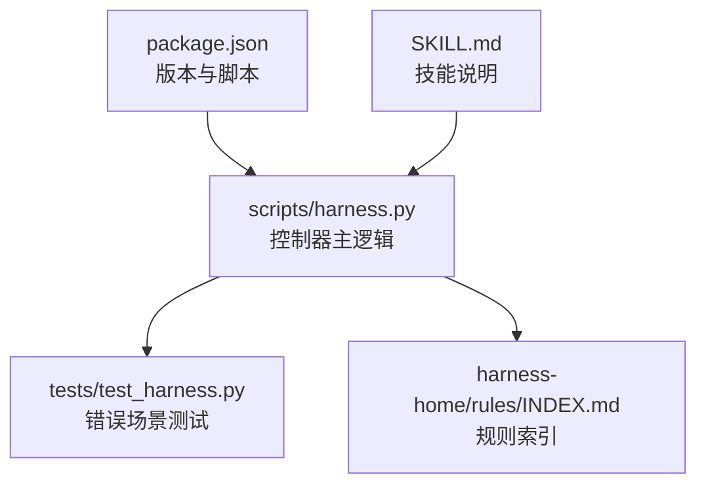
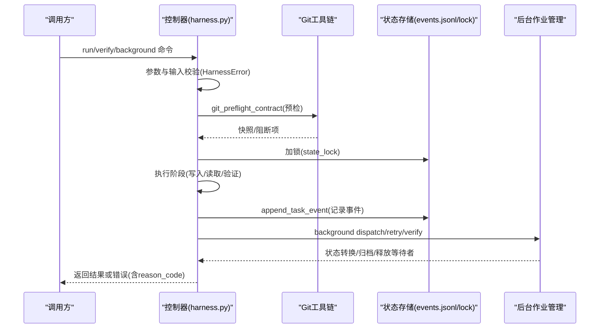
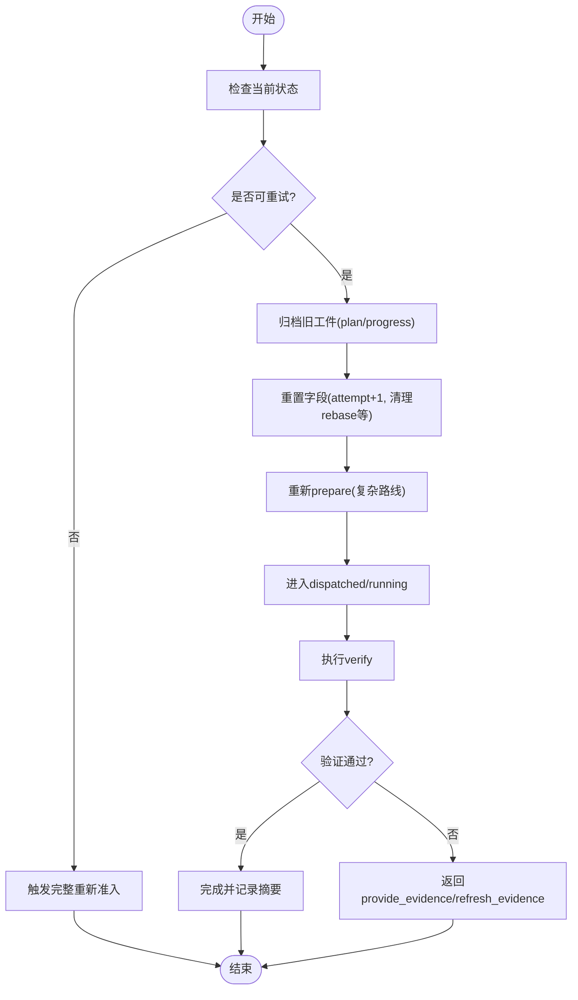
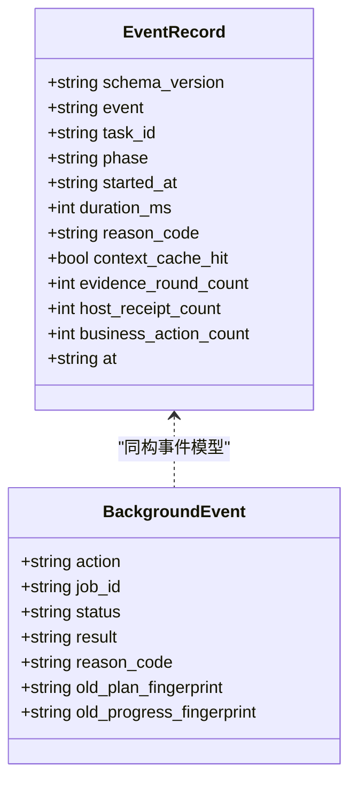
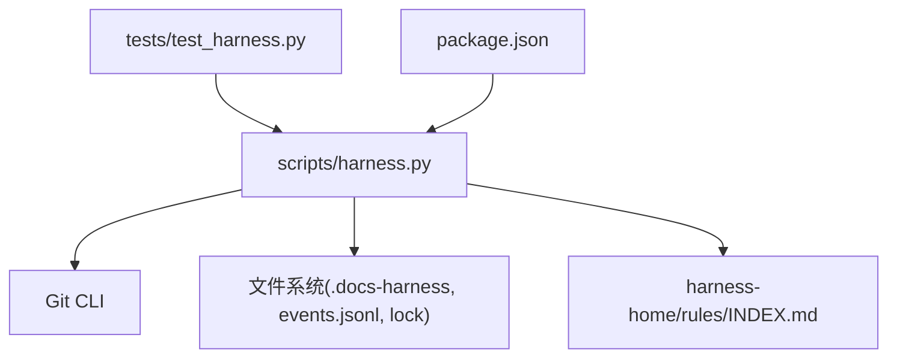

# 错误处理策略

<cite>
**本文引用的文件**   
- [scripts/harness.py](file://scripts/harness.py)
- [tests/test_harness.py](file://tests/test_harness.py)
- [package.json](file://package.json)
- [SKILL.md](file://SKILL.md)
- [harness-home/rules/INDEX.md](file://harness-home/rules/INDEX.md)
</cite>

## 目录
1. [引言](#引言)
2. [项目结构](#项目结构)
3. [核心组件](#核心组件)
4. [架构总览](#架构总览)
5. [详细组件分析](#详细组件分析)
6. [依赖关系分析](#依赖关系分析)
7. [性能考量](#性能考量)
8. [故障排查指南](#故障排查指南)
9. [结论](#结论)
10. [附录](#附录)

## 引言
本指南面向 Docs Harness 的错误处理策略，聚焦以下目标：
- 建立统一的错误分类体系（可重试、需补证、完整重新准入等）
- 明确错误恢复步骤（状态重置、工件清理、任务重启策略）
- 规范异常捕获与处理（自定义异常类、错误码定义、用户友好提示）
- 设计错误监控与告警机制（错误率统计、趋势分析、自动通知）
- 提供代码级示例路径与故障恢复脚本指引

该策略贯穿任务准入、执行、验证、后台治理与质量账本等全链路。

## 项目结构
Docs Harness 以独立 Python 控制器为核心，配合规则集、测试套件与元数据配置组织：
- scripts/harness.py：控制器主逻辑，包含错误类型、预检查/后检查、事件记录、后台作业控制等
- tests/test_harness.py：覆盖关键错误场景的单元测试
- package.json：版本与脚本入口
- SKILL.md：技能说明与命令约定
- harness-home/rules/INDEX.md：生效规则索引

**图表来源** 
- [scripts/harness.py:1-120](file://scripts/harness.py#L1-L120)
- [tests/test_harness.py:1-120](file://tests/test_harness.py#L1-L120)
- [package.json:1-23](file://package.json#L1-L23)
- [SKILL.md:1-106](file://SKILL.md#L1-L106)
- [harness-home/rules/INDEX.md:1-41](file://harness-home/rules/INDEX.md#L1-L41)

**章节来源**
- [scripts/harness.py:1-120](file://scripts/harness.py#L1-L120)
- [package.json:1-23](file://package.json#L1-L23)
- [SKILL.md:1-106](file://SKILL.md#L1-L106)
- [harness-home/rules/INDEX.md:1-41](file://harness-home/rules/INDEX.md#L1-L41)

## 核心组件
- 自定义异常类 HarnessError：统一错误码、退出码与消息，贯穿输入校验、Git 操作、状态锁、配置校验等
- 预检查与后检查：git_preflight_contract/git_postcheck 对 Git 范围、漂移、LFS/Submodule 进行强约束
- 事件与审计：append_task_event/append_background_event 记录阶段、原因码、耗时、上下文命中等
- 后台作业控制：dispatch/retry/verify 等动作的状态机与重试上限、工件归档与修复
- 工作区快照与易失路径：workspace_snapshot/volatile_verification_path 用于变更检测与临时产物过滤

**章节来源**
- [scripts/harness.py:395-400](file://scripts/harness.py#L395-L400)
- [scripts/harness.py:680-794](file://scripts/harness.py#L680-L794)
- [scripts/harness.py:796-878](file://scripts/harness.py#L796-L878)
- [scripts/harness.py:1034-1074](file://scripts/harness.py#L1034-L1074)
- [scripts/harness.py:9000-9176](file://scripts/harness.py#L9000-L9176)
- [scripts/harness.py:1115-1138](file://scripts/harness.py#L1115-L1138)
- [scripts/harness.py:1219-1236](file://scripts/harness.py#L1219-L1236)

## 架构总览
错误处理在“输入校验—准入—执行—验证—后台治理”各阶段均通过统一异常与原因码驱动，结合事件记录与状态锁保障一致性。

**图表来源** 
- [scripts/harness.py:680-794](file://scripts/harness.py#L680-L794)
- [scripts/harness.py:1011-1032](file://scripts/harness.py#L1011-L1032)
- [scripts/harness.py:1034-1074](file://scripts/harness.py#L1034-L1074)
- [scripts/harness.py:9000-9176](file://scripts/harness.py#L9000-L9176)

## 详细组件分析

### 错误分类体系
- 可重试错误（Retryable）
  - 后台作业：needs_user_input、needs_rebase、queued_manual 以及 failed 状态允许重试；达到最大尝试次数则失败关闭
  - 验证命令：verification 失败支持 retry_verification 分支
- 需补证错误（Provide Evidence）
  - 未归因写入或缺少证据时返回 provide_evidence/refresh_evidence，要求宿主提交 v2 证据收据
- 完整重新准入（Full Readmission）
  - 范围变化、高风险 Gate 变化、合同指纹变化触发 full_readmission；增量变更走 incremental_admission
- 其他常见错误
  - 输入/配置无效：invalid_request、invalid_json、invalid_project_config、invalid_knowledge_map 等
  - Git 相关：git_preflight_timeout、git_remote_unavailable、git_sync_scope_ambiguous、git_remote_drift 等
  - 状态锁冲突：state_locked、stale_lock

**章节来源**
- [scripts/harness.py:117-127](file://scripts/harness.py#L117-L127)
- [scripts/harness.py:9000-9053](file://scripts/harness.py#L9000-L9053)
- [scripts/harness.py:9054-9176](file://scripts/harness.py#L9054-L9176)
- [scripts/harness.py:443-446](file://scripts/harness.py#L443-L446)
- [scripts/harness.py:584-585](file://scripts/harness.py#L584-L585)
- [scripts/harness.py:635-642](file://scripts/harness.py#L635-L642)
- [scripts/harness.py:667-674](file://scripts/harness.py#L667-L674)
- [scripts/harness.py:1011-1032](file://scripts/harness.py#L1011-L1032)

### 错误恢复流程
- 状态重置
  - 后台作业重试：attempt+1，清空 rebase_reason_code/completed_at 等字段，进入 contract_ready
  - 复杂路线需要重新 prepare/dispatched/running 序列
- 工件清理
  - 重试前归档 plan.json/progress.json，避免污染；损坏或被篡改仅允许显式 repair
- 任务重启策略
  - verify 失败：retry_verification；证据基线漂移：refresh_evidence；范围/Gate/合同变化：full_readmission
  - 知识 Job 更新验收需 assessment 且 knowledge_status=ready，否则回到 needs_user_input

**图表来源** 
- [scripts/harness.py:9012-9053](file://scripts/harness.py#L9012-L9053)
- [scripts/harness.py:9054-9176](file://scripts/harness.py#L9054-L9176)

**章节来源**
- [scripts/harness.py:9012-9053](file://scripts/harness.py#L9012-L9053)
- [scripts/harness.py:9054-9176](file://scripts/harness.py#L9054-L9176)

### 异常捕获与处理最佳实践
- 自定义异常类 HarnessError
  - 统一 code、exit_code、message，便于上层解析与用户提示
- 错误码定义规范
  - 输入/配置：invalid_request、invalid_json、invalid_project_config、invalid_knowledge_map
  - Git：git_preflight_timeout、git_remote_unavailable、git_sync_scope_ambiguous、git_remote_drift
  - 状态锁：state_locked、stale_lock
  - 后台作业：invalid_background_retry、incomplete_background_work_packages、background_goal_artifacts_tampered
- 用户友好提示生成
  - 将 reason_code 映射为中文描述（如 DELIVERY_LIMIT_DETAILS），并在响应中附带 next_action 与 next_command_argv 指引

**章节来源**
- [scripts/harness.py:395-400](file://scripts/harness.py#L395-L400)
- [scripts/harness.py:443-446](file://scripts/harness.py#L443-L446)
- [scripts/harness.py:584-585](file://scripts/harness.py#L584-L585)
- [scripts/harness.py:635-642](file://scripts/harness.py#L635-L642)
- [scripts/harness.py:667-674](file://scripts/harness.py#L667-L674)
- [scripts/harness.py:1011-1032](file://scripts/harness.py#L1011-L1032)
- [scripts/harness.py:9000-9176](file://scripts/harness.py#L9000-L9176)

### 错误监控与告警机制
- 事件记录
  - append_task_event/append_background_event 持久化 events.jsonl，包含 phase、reason_code、duration_ms、context_cache_hit、evidence_round_count 等
- 错误率统计与趋势分析
  - 基于 events.jsonl 聚合 reason_code 分布、phase 维度、at 时间戳，计算错误率与趋势
- 自动通知配置
  - 当 reason_code 命中高优先级集合（如 git_remote_drift、background_goal_artifacts_tampered、max_attempts_reached）时触发告警
  - 结合 DELIVERY_LIMIT_CODES 与 TASK_DISPOSITION_REASON_CODES 做分层告警

**图表来源** 
- [scripts/harness.py:1034-1074](file://scripts/harness.py#L1034-L1074)
- [scripts/harness.py:9000-9176](file://scripts/harness.py#L9000-L9176)

**章节来源**
- [scripts/harness.py:1034-1074](file://scripts/harness.py#L1034-L1074)
- [scripts/harness.py:9000-9176](file://scripts/harness.py#L9000-L9176)

### 具体错误处理示例与恢复脚本
- 示例路径（不展示代码内容）
  - 输入校验与 JSON 错误：[scripts/harness.py:443-446](file://scripts/harness.py#L443-L446)、[scripts/harness.py:503-506](file://scripts/harness.py#L503-L506)
  - Git 预检超时与远端不可用：[scripts/harness.py:584-585](file://scripts/harness.py#L584-L585)、[scripts/harness.py:635-642](file://scripts/harness.py#L635-L642)
  - 状态锁冲突与过期锁：[scripts/harness.py:1011-1032](file://scripts/harness.py#L1011-L1032)
  - 后台作业重试与归档：[scripts/harness.py:9012-9053](file://scripts/harness.py#L9012-L9053)
  - 背景作业验收与重大发现：[scripts/harness.py:9054-9176](file://scripts/harness.py#L9054-L9176)
- 故障恢复脚本建议
  - 清理过期锁：若检测到 stale_lock，人工确认进程已终止后删除 .lock
  - 修复损坏工件：使用 background prepare --repair 重建 plan/progress
  - 重试受限作业：仅在 BACKGROUND_RETRYABLE_STATES 或 failed 状态下执行 background retry
  - 证据刷新：针对 refresh_evidence 场景，按指引更新证据引用后再次 verify

**章节来源**
- [scripts/harness.py:443-446](file://scripts/harness.py#L443-L446)
- [scripts/harness.py:503-506](file://scripts/harness.py#L503-L506)
- [scripts/harness.py:584-585](file://scripts/harness.py#L584-L585)
- [scripts/harness.py:635-642](file://scripts/harness.py#L635-L642)
- [scripts/harness.py:1011-1032](file://scripts/harness.py#L1011-L1032)
- [scripts/harness.py:9012-9053](file://scripts/harness.py#L9012-L9053)
- [scripts/harness.py:9054-9176](file://scripts/harness.py#L9054-L9176)

## 依赖关系分析
- 控制器与 Git 工具链：通过 git_command 封装子进程调用，统一超时与错误码
- 控制器与状态存储：events.jsonl、.lock、quality-ledger、knowledge-jobs/background 等路径由 runtime_root 派生
- 控制器与规则系统：规则索引与指纹校验确保安装与升级安全
- 测试与控制器：tests/test_harness.py 通过 subprocess 调用控制器，断言错误码与响应结构

**图表来源** 
- [scripts/harness.py:575-586](file://scripts/harness.py#L575-L586)
- [scripts/harness.py:909-916](file://scripts/harness.py#L909-L916)
- [harness-home/rules/INDEX.md:1-41](file://harness-home/rules/INDEX.md#L1-L41)
- [tests/test_harness.py:59-87](file://tests/test_harness.py#L59-L87)
- [package.json:1-23](file://package.json#L1-L23)

**章节来源**
- [scripts/harness.py:575-586](file://scripts/harness.py#L575-L586)
- [scripts/harness.py:909-916](file://scripts/harness.py#L909-L916)
- [harness-home/rules/INDEX.md:1-41](file://harness-home/rules/INDEX.md#L1-L41)
- [tests/test_harness.py:59-87](file://tests/test_harness.py#L59-L87)
- [package.json:1-23](file://package.json#L1-L23)

## 性能考量
- 事件追加采用原子写入与 fsync，保证幂等与持久性
- 工作区快照限制文件大小与数量，非 Git 工作区有截断保护
- 验证命令缓存默认开启，可通过配置整体关闭
- 易失路径白名单减少无关变更带来的误判

**章节来源**
- [scripts/harness.py:1115-1138](file://scripts/harness.py#L1115-L1138)
- [scripts/harness.py:1191-1202](file://scripts/harness.py#L1191-L1202)
- [scripts/harness.py:1219-1236](file://scripts/harness.py#L1219-L1236)

## 故障排查指南
- 常见问题定位
  - 输入/配置错误：检查 invalid_request/invalid_json/invalid_project_config 等错误码
  - Git 预检失败：查看 git_preflight_failed/git_remote_unavailable/git_sync_scope_ambiguous
  - 状态锁冲突：检查 state_locked/stale_lock，必要时人工清理
  - 后台作业重试限制：确认是否在 BACKGROUND_RETRYABLE_STATES 或 failed 状态
- 恢复步骤
  - 清理锁与工件：删除过期 .lock，使用 background prepare --repair
  - 补充证据：按 provide_evidence/refresh_evidence 指引提交 v2 证据
  - 重新准入：范围/Gate/合同变化时执行 full_readmission
- 监控与告警
  - 聚合 events.jsonl 中的 reason_code 与 phase，设置阈值告警
  - 对高优先级错误码（如 git_remote_drift、background_goal_artifacts_tampered、max_attempts_reached）即时通知

**章节来源**
- [scripts/harness.py:443-446](file://scripts/harness.py#L443-L446)
- [scripts/harness.py:584-585](file://scripts/harness.py#L584-L585)
- [scripts/harness.py:635-642](file://scripts/harness.py#L635-L642)
- [scripts/harness.py:1011-1032](file://scripts/harness.py#L1011-L1032)
- [scripts/harness.py:9000-9176](file://scripts/harness.py#L9000-L9176)

## 结论
Docs Harness 的错误处理以统一异常与原因码为核心，贯穿输入校验、Git 预/后检查、状态锁、事件记录与后台作业控制。通过可重试、需补证、完整重新准入三类错误分类，配合工件归档与状态重置，实现稳健的恢复流程。事件驱动的监控与告警为持续改进提供数据基础。遵循本指南可在复杂协作环境中保持失败关闭与可审计性。

## 附录
- 参考命令与入口
  - 任务入口与验收：见 SKILL.md 的命令约定
  - 规则索引与激活条件：见 harness-home/rules/INDEX.md
  - 版本与脚本：见 package.json

**章节来源**
- [SKILL.md:1-106](file://SKILL.md#L1-L106)
- [harness-home/rules/INDEX.md:1-41](file://harness-home/rules/INDEX.md#L1-L41)
- [package.json:1-23](file://package.json#L1-L23)