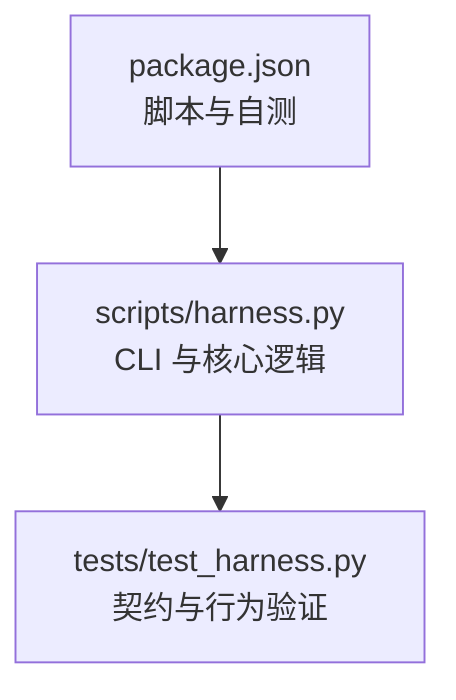
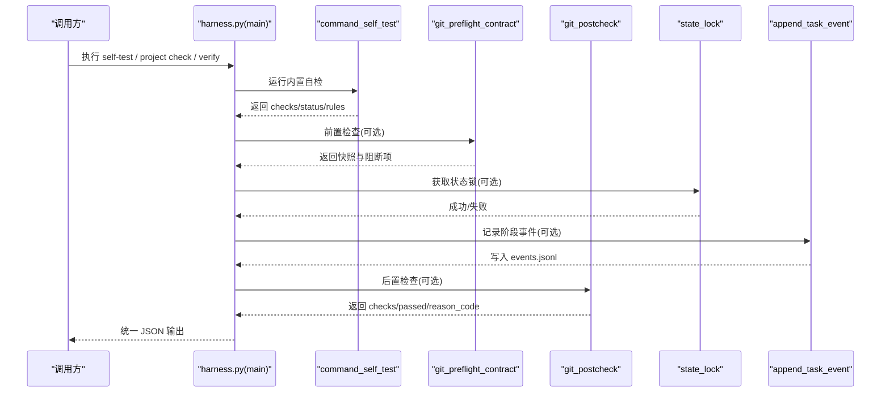
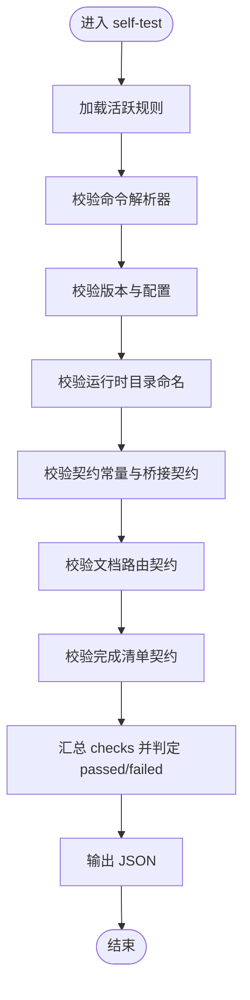
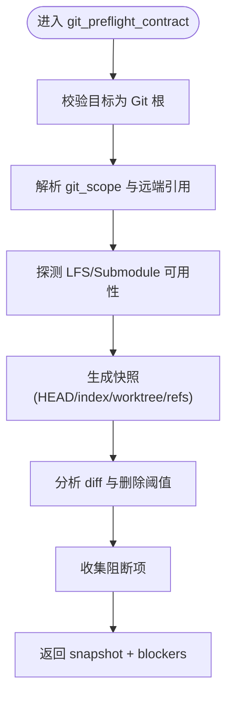
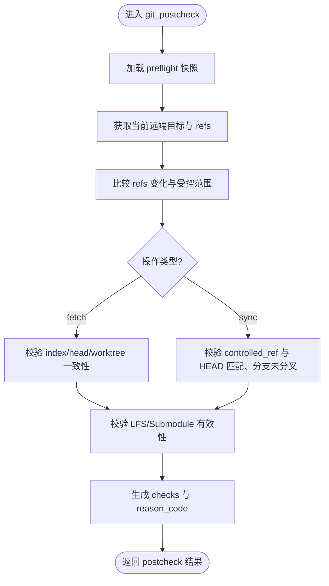
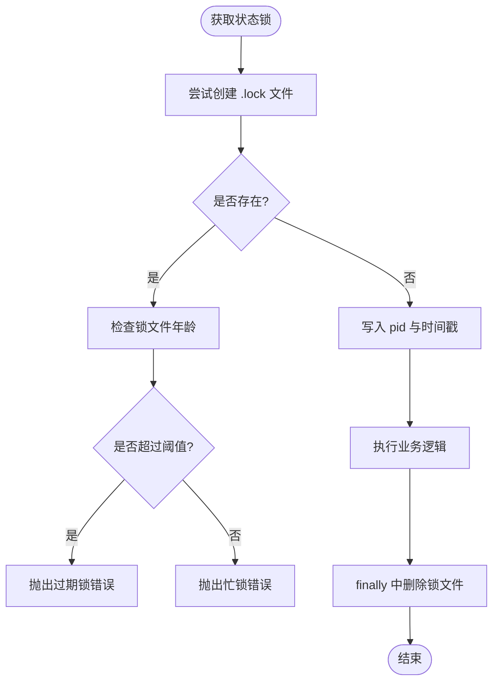
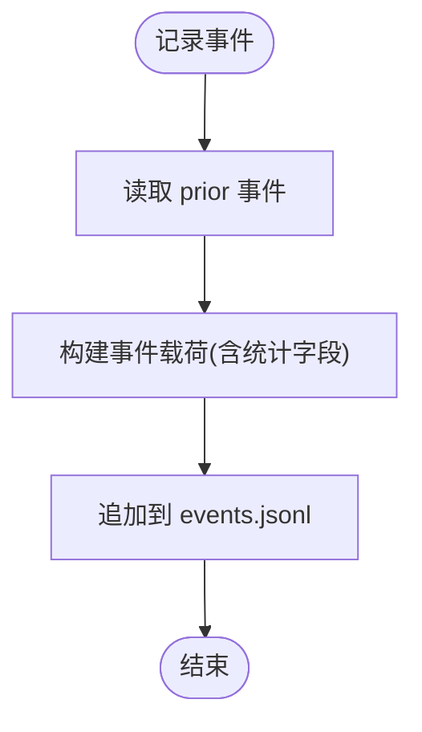
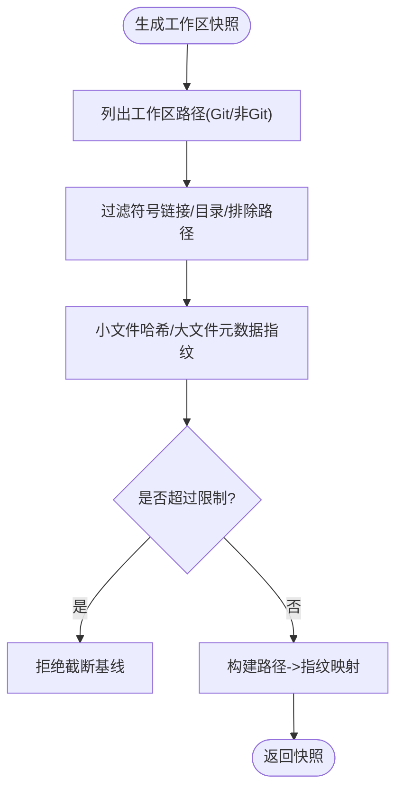
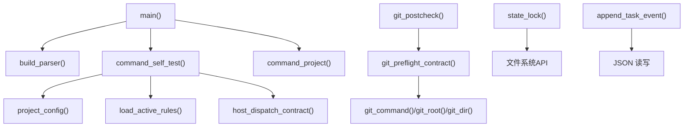

# 健康检查与状态监控

<cite>
**本文引用的文件**   
- [scripts/harness.py](file://scripts/harness.py)
- [tests/test_harness.py](file://tests/test_harness.py)
- [package.json](file://package.json)
</cite>

## 目录
1. [简介](#简介)
2. [项目结构](#项目结构)
3. [核心组件](#核心组件)
4. [架构总览](#架构总览)
5. [详细组件分析](#详细组件分析)
6. [依赖关系分析](#依赖关系分析)
7. [性能考量](#性能考量)
8. [故障诊断指南](#故障诊断指南)
9. [结论](#结论)
10. [附录](#附录)

## 简介
本文件面向 Docs Harness 的健康检查与状态监控，聚焦以下目标：
- 系统健康检查的实现机制：核心组件状态检测、依赖服务可用性检查、资源使用监控。
- 健康检查端点的定义与响应格式：就绪探针、存活探针、就绪性检查（以 CLI 子命令与 JSON 输出形式提供）。
- 系统状态监控：进程状态、文件锁状态、队列长度等。
- 配置示例与故障诊断：常见问题排查方法与恢复策略。

说明：Docs Harness 以命令行工具形态运行，通过子命令与 JSON 输出暴露“类 HTTP”的探针能力，便于在容器或编排系统中集成。

## 项目结构
- scripts/harness.py：主程序入口，包含所有命令实现、状态管理、Git 预检/后检、自检、事件记录、工作区快照、锁机制等。
- tests/test_harness.py：覆盖关键路径与边界条件的测试用例，验证行为与契约。
- package.json：脚本入口与自测命令，便于 CI/CD 中触发自检。

图表来源
- [package.json:17-21](file://package.json#L17-L21)
- [scripts/harness.py:10494-10532](file://scripts/harness.py#L10494-L10532)
- [tests/test_harness.py:17-24](file://tests/test_harness.py#L17-L24)

章节来源
- [package.json:17-21](file://package.json#L17-L21)
- [scripts/harness.py:10494-10532](file://scripts/harness.py#L10494-L10532)
- [tests/test_harness.py:17-24](file://tests/test_harness.py#L17-L24)

## 核心组件
- 命令路由与统一输出
  - main() 负责解析参数、分发到各子命令、统一输出 JSON 或文本。
  - emit() 负责结构化输出；enrich_next_step_response() 为需要下一步动作的任务补充执行提示。
- 自检与健康检查
  - command_self_test() 提供内置合同自检，校验版本、命令解析器、规则集、运行时命名、契约常量、后台桥接契约、文档路由契约、完成清单契约等。
- Git 依赖健康检查
  - git_preflight_contract()：对 git_fetch/git_sync 进行前置检查（远端可达性、LFS/Submodule、工作区脏读、删除阈值、FF 约束等），返回快照与阻断项。
  - git_postcheck()：对操作结果进行后置校验（远程目标未漂移、受控引用范围、索引与工作树一致性、LFS/Submodule 有效性等）。
- 任务状态与并发控制
  - state_lock()：基于 .lock 文件的原子创建与过期清理，避免并发写冲突。
  - append_task_event()：将阶段事件追加到 events.jsonl，附带上下文缓存命中、证据轮次、业务动作计数等指标。
- 工作区与资源快照
  - workspace_snapshot()：生成工作区文件指纹集合，支持 Git 与非 Git 模式，限制大文件与数量上限。
  - snapshot_changes()：对比前后快照差异，用于变更追踪。
- 项目安装与检查
  - command_project()：提供 init/upgrade/uninstall/check/diff/rollback-check 等生命周期命令；project check 可发现缺失 harness-home 等环境问题。

章节来源
- [scripts/harness.py:10494-10532](file://scripts/harness.py#L10494-L10532)
- [scripts/harness.py:10275-10324](file://scripts/harness.py#L10275-L10324)
- [scripts/harness.py:680-794](file://scripts/harness.py#L680-L794)
- [scripts/harness.py:796-878](file://scripts/harness.py#L796-L878)
- [scripts/harness.py:1011-1032](file://scripts/harness.py#L1011-L1032)
- [scripts/harness.py:1034-1074](file://scripts/harness.py#L1034-L1074)
- [scripts/harness.py:1115-1138](file://scripts/harness.py#L1115-L1138)
- [scripts/harness.py:1141-1142](file://scripts/harness.py#L1141-L1142)
- [scripts/harness.py:10022-10448](file://scripts/harness.py#L10022-L10448)

## 架构总览
Docs Harness 以 CLI 为中心，通过子命令对外暴露健康检查与状态查询能力。自检与 Git 健康检查是两大支柱：
- 自检：校验运行时环境、契约常量、规则集与桥接契约，确保“代码与契约一致”。
- Git 健康检查：前置检查保障安全与可回滚，后置检查保障一致性、完整性与合规性。

图表来源
- [scripts/harness.py:10494-10532](file://scripts/harness.py#L10494-L10532)
- [scripts/harness.py:10275-10324](file://scripts/harness.py#L10275-L10324)
- [scripts/harness.py:680-794](file://scripts/harness.py#L680-L794)
- [scripts/harness.py:796-878](file://scripts/harness.py#L796-L878)
- [scripts/harness.py:1011-1032](file://scripts/harness.py#L1011-L1032)
- [scripts/harness.py:1034-1074](file://scripts/harness.py#L1034-L1074)

## 详细组件分析

### 自检与“健康检查”端点（self-test）
- 功能要点
  - 校验脚本版本与配置文件版本一致性。
  - 校验命令解析器是否包含全部子命令。
  - 校验 rules_root 存在且 active_rules 有效。
  - 校验独立运行时目录命名规范。
  - 校验 v2 任务契约、证据契约、背景目标宿主桥接契约、文档路由契约、完成清单契约。
  - 返回 status=passed/failed、checks 字典、rules 列表、rule_errors 列表。
- 适用场景
  - 作为“存活探针”（进程能正确自检即视为存活）。
  - 作为“就绪探针”（当所有 checks 均为真时视为就绪）。
- 典型用法
  - 通过 package.json 中的 self-test 脚本触发，或在 CI/CD 中直接调用 harness self-test --target <项目根> --json。

图表来源
- [scripts/harness.py:10275-10324](file://scripts/harness.py#L10275-L10324)
- [package.json:17-21](file://package.json#L17-L21)

章节来源
- [scripts/harness.py:10275-10324](file://scripts/harness.py#L10275-L10324)
- [package.json:17-21](file://package.json#L17-L21)

### Git 前置健康检查（preflight）
- 功能要点
  - 仅对 git_fetch/git_sync 生效。
  - 校验目标是否为独立 Git 仓库根。
  - 解析 git_scope，限定受控远端与分支。
  - 探测 LFS/Submodule 可用性与状态。
  - 计算工作区快照指纹、索引树指纹、HEAD 与受控引用。
  - 收集阻断项（脏工作区重叠、删除过多、非 FF、LFS/Submodule 不可用等）。
  - 返回 snapshot 与 blockers，供后续验证与审计。
- 适用场景
  - 作为“就绪性检查”的一部分，确保 Git 操作满足安全与一致性要求。

图表来源
- [scripts/harness.py:680-794](file://scripts/harness.py#L680-L794)

章节来源
- [scripts/harness.py:680-794](file://scripts/harness.py#L680-L794)

### Git 后置健康检查（postcheck）
- 功能要点
  - 读取 preflight 快照，比较当前远端目标与 refs 变化。
  - 校验 index/head/worktree 是否与快照一致（fetch 场景）。
  - 校验 controlled_ref 与 head 匹配、分支未分叉（sync 场景）。
  - 校验 LFS/Submodule 有效性（如启用）。
  - 返回 checks、reason_code、changed_refs、outside_refs、remote_refs。
- 适用场景
  - 作为“就绪性检查”的关键环节，确保 Git 操作结果符合预期且无越权变更。

图表来源
- [scripts/harness.py:796-878](file://scripts/harness.py#L796-L878)

章节来源
- [scripts/harness.py:796-878](file://scripts/harness.py#L796-L878)

### 状态锁与并发控制
- 功能要点
  - 使用 .lock 文件原子创建（O_CREAT | O_EXCL）实现互斥。
  - 若锁已存在，判断年龄超过阈值（默认 300 秒）则视为过期锁，需人工清理；否则报“同一任务正在被另一个进程更新”。
  - 写入 pid 与时间戳，finally 中释放锁。
- 适用场景
  - 作为“进程状态监控”的基础，避免并发写导致状态不一致。

图表来源
- [scripts/harness.py:1011-1032](file://scripts/harness.py#L1011-L1032)

章节来源
- [scripts/harness.py:1011-1032](file://scripts/harness.py#L1011-L1032)

### 事件记录与队列长度监控
- 功能要点
  - append_task_event() 将阶段事件追加到 events.jsonl，包含 duration_ms、context_cache_hit、evidence_round_count、host_receipt_count、business_action_count 等指标。
  - 可通过读取 events.jsonl 的行数估算“队列长度”（待处理/进行中事件）。
- 适用场景
  - 作为“队列长度监控”的依据，结合外部日志采集系统进行告警。

图表来源
- [scripts/harness.py:1034-1074](file://scripts/harness.py#L1034-L1074)

章节来源
- [scripts/harness.py:1034-1074](file://scripts/harness.py#L1034-L1074)

### 工作区快照与资源使用监控
- 功能要点
  - workspace_snapshot() 遍历工作区文件，生成相对路径到指纹的映射；对大文件采用 size:mtime 指纹以减少开销。
  - 非 Git 模式下有文件数量上限，超限会拒绝截断基线。
  - snapshot_changes() 对比前后快照，得到变更路径列表。
- 适用场景
  - 作为“资源使用监控”的辅助手段，观察工作区规模与变更趋势。

图表来源
- [scripts/harness.py:1115-1138](file://scripts/harness.py#L1115-L1138)
- [scripts/harness.py:1141-1142](file://scripts/harness.py#L1141-L1142)

章节来源
- [scripts/harness.py:1115-1138](file://scripts/harness.py#L1115-L1138)
- [scripts/harness.py:1141-1142](file://scripts/harness.py#L1141-L1142)

### 项目检查（project check）与环境健康
- 功能要点
  - project check 可发现缺失 harness-home、规则不激活等问题，返回 findings 与 status。
  - 测试用例覆盖了 missing_harness_home 等场景。
- 适用场景
  - 作为“环境健康检查”的入口，快速定位安装与配置问题。

章节来源
- [tests/test_harness.py:356-375](file://tests/test_harness.py#L356-L375)
- [scripts/harness.py:10022-10448](file://scripts/harness.py#L10022-L10448)

## 依赖关系分析
- 内部依赖
  - main() 依赖 build_parser() 与各子命令实现。
  - command_self_test() 依赖 project_config()、load_active_rules()、host_dispatch_contract() 等。
  - Git 健康检查依赖 git_command()、git_root()、git_dir() 等工具函数。
  - 状态锁与事件记录依赖文件系统与 JSON 读写。
- 外部依赖
  - Git 客户端（用于 rev-parse、ls-files、diff、lfs、submodule 等）。
  - 操作系统文件 API（原子创建、锁文件）。
- 耦合与内聚
  - 健康检查相关逻辑集中在 harness.py，内聚度高；对外通过 CLI 暴露，降低耦合。
  - 事件与快照模块职责清晰，易于扩展新的监控维度。

图表来源
- [scripts/harness.py:10494-10532](file://scripts/harness.py#L10494-L10532)
- [scripts/harness.py:10275-10324](file://scripts/harness.py#L10275-L10324)
- [scripts/harness.py:680-794](file://scripts/harness.py#L680-L794)
- [scripts/harness.py:796-878](file://scripts/harness.py#L796-L878)
- [scripts/harness.py:1011-1032](file://scripts/harness.py#L1011-L1032)
- [scripts/harness.py:1034-1074](file://scripts/harness.py#L1034-L1074)

章节来源
- [scripts/harness.py:10494-10532](file://scripts/harness.py#L10494-L10532)
- [scripts/harness.py:10275-10324](file://scripts/harness.py#L10275-L10324)
- [scripts/harness.py:680-794](file://scripts/harness.py#L680-L794)
- [scripts/harness.py:796-878](file://scripts/harness.py#L796-L878)
- [scripts/harness.py:1011-1032](file://scripts/harness.py#L1011-L1032)
- [scripts/harness.py:1034-1074](file://scripts/harness.py#L1034-L1074)

## 性能考量
- Git 操作超时与批量扫描
  - git_command() 设置超时，避免阻塞。
  - workspace_snapshot() 对大文件采用元数据指纹，减少 I/O。
- 事件与索引
  - events.jsonl 追加写入，顺序 I/O，适合高吞吐记录。
  - evidence-index.json 按需读取，避免全量扫描。
- 锁与并发
  - 原子锁创建避免竞争；过期锁检测防止僵尸锁影响。
- 建议
  - 在高频健康检查中，优先使用 self-test 与轻量级 Git 探测，避免全量快照。
  - 对 events.jsonl 的读取应分页或增量拉取，避免阻塞。

[本节为通用指导，不直接分析具体文件]

## 故障诊断指南
- 常见错误码与含义
  - stale_lock：检测到超过阈值的锁文件，需人工确认后清理。
  - state_locked：同一任务正在被另一个进程更新。
  - git_remote_drift：远端目标发生变化，需重新准入或同步。
  - git_ref_scope_violation：受控引用范围被违反。
  - git_preflight_failed：前置检查失败（如 LFS/Submodule 不可用）。
  - invalid_json/missing_file：输入文件无效或缺失。
- 排查步骤
  - 运行 self-test，确认 checks 中失败的条目与 rule_errors。
  - 对于 Git 相关错误，查看 preflight/postcheck 返回的 checks 与 reason_code。
  - 检查 .docs-harness/runs/<task_id>/events.jsonl 的事件序列，定位卡点。
  - 检查 .lock 文件是否存在与修改时间，必要时清理过期锁。
- 恢复策略
  - 清理脏工作区或解决冲突后再试。
  - 修复 LFS/Submodule 环境后重试。
  - 修正项目配置或规则集，确保 active_rules 有效。
  - 对过期锁进行人工确认后删除，再重试。

章节来源
- [scripts/harness.py:1011-1032](file://scripts/harness.py#L1011-L1032)
- [scripts/harness.py:796-878](file://scripts/harness.py#L796-L878)
- [scripts/harness.py:1034-1074](file://scripts/harness.py#L1034-L1074)
- [tests/test_harness.py:356-375](file://tests/test_harness.py#L356-L375)

## 结论
Docs Harness 通过 CLI 子命令与 JSON 输出提供了完善的健康检查与状态监控能力：
- 自检覆盖运行时、契约与规则集，适合作为存活/就绪探针。
- Git 前置/后置检查确保操作安全与一致性，适合作为就绪性检查。
- 状态锁与事件记录提供并发控制与可观测性基础。
- 项目检查与环境诊断帮助快速定位安装与配置问题。
建议在编排系统中组合使用 self-test、project check、verify 的 postcheck 结果，形成完整的健康检查与监控闭环。

[本节为总结性内容，不直接分析具体文件]

## 附录
- 健康检查配置示例
  - 在 CI/CD 中调用：python3 scripts/harness.py self-test --target . --json
  - 在项目根目录下执行：npm run self-test
- 常用命令
  - self-test：运行内置合同自检。
  - project check：检查项目安装与环境健康。
  - verify：对任务进行同源验收，返回 git_postcheck 结果。
- 参考路径
  - 事件文件：.docs-harness/runs/<task_id>/events.jsonl
  - 锁文件：<state_dir>/.lock

章节来源
- [package.json:17-21](file://package.json#L17-L21)
- [scripts/harness.py:10494-10532](file://scripts/harness.py#L10494-L10532)
- [scripts/harness.py:10275-10324](file://scripts/harness.py#L10275-L10324)
- [scripts/harness.py:796-878](file://scripts/harness.py#L796-L878)