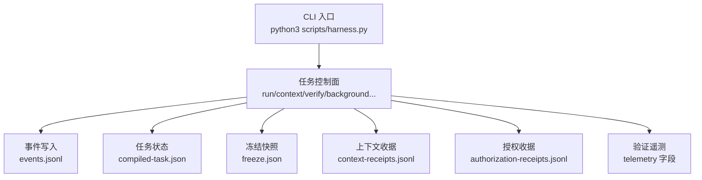
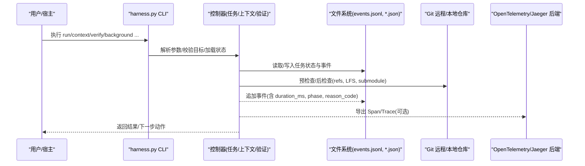
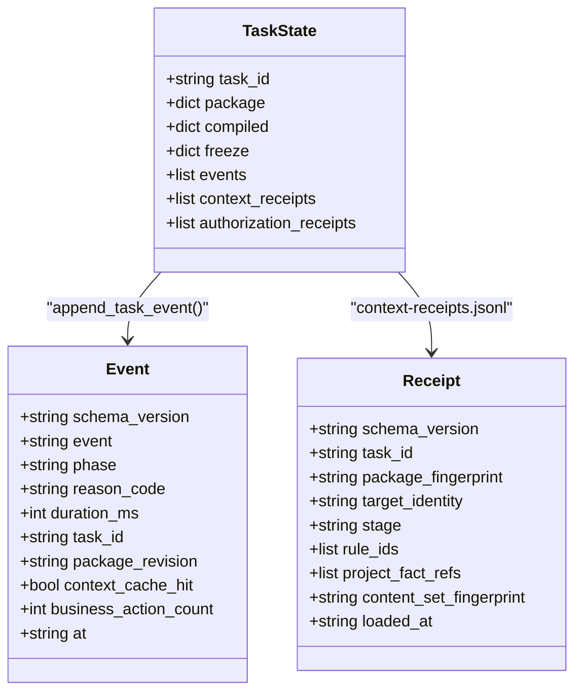
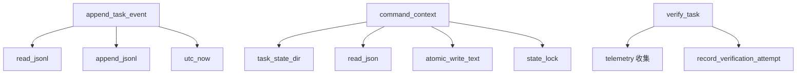

# 分布式追踪与链路跟踪

<cite>
**本文引用的文件**   
- [scripts/harness.py](file://scripts/harness.py)
- [tests/test_harness.py](file://tests/test_harness.py)
- [package.json](file://package.json)
</cite>

## 目录
1. [简介](#简介)
2. [项目结构](#项目结构)
3. [核心组件](#核心组件)
4. [架构总览](#架构总览)
5. [详细组件分析](#详细组件分析)
6. [依赖关系分析](#依赖关系分析)
7. [性能考量](#性能考量)
8. [故障排查指南](#故障排查指南)
9. [结论](#结论)
10. [附录](#附录)

## 简介
本文件面向 Docs Harness 的分布式追踪与链路跟踪，聚焦以下目标：
- 请求链路跟踪的实现机制：追踪ID生成、跨进程调用跟踪、上下文传播。
- 分布式追踪集成方案：对接 OpenTelemetry、Jaeger 等主流系统。
- 性能热点识别：调用链分析、耗时统计、瓶颈定位方法。
- 采样策略与性能影响评估：在保持可观测性的同时降低开销。
- 配置示例与调试工具使用：帮助快速定位分布式系统中的性能问题与错误。

Docs Harness 当前以 CLI 控制器为核心，通过事件日志（events.jsonl）、任务状态（compiled-task.json）、冻结快照（freeze.json）以及验证遥测（telemetry）构建完整的执行轨迹。这些能力为分布式追踪提供了天然的数据源和扩展点。

## 项目结构
- scripts/harness.py：主控制器脚本，包含任务生命周期、事件记录、Git 预检查/后检查、上下文加载、验证流程、锁机制、指纹计算等核心逻辑。
- tests/test_harness.py：覆盖主要行为与契约的测试用例，可用于验证追踪与性能相关改动。
- package.json：定义脚本入口与自测命令，便于在 CI/本地运行 harness 自检。

图表来源
- [scripts/harness.py:3253-3262](file://scripts/harness.py#L3253-L3262)
- [scripts/harness.py:4297-4443](file://scripts/harness.py#L4297-L4443)
- [scripts/harness.py:6450-6464](file://scripts/harness.py#L6450-L6464)

章节来源
- [scripts/harness.py:1-120](file://scripts/harness.py#L1-L120)
- [package.json:17-21](file://package.json#L17-L21)

## 核心组件
- 事件系统（Event System）
  - 通过 append_task_event 将阶段化事件持久化为 events.jsonl，包含 event、phase、duration_ms、reason_code、task_id、package_revision、context_cache_hit、business_action_count 等字段，适合映射为分布式追踪 Span/Event。
  - 关键行参考：[append_task_event:1034-1073](file://scripts/harness.py#L1034-L1073)。

- 任务状态与编译态（Task State & Compiled Task）
  - create_task_state 初始化任务目录与多个 JSON/JSONL 文件；initial_compiled 生成 compiled-task.json，描述 control_status、execution_route、work_package_states、verification_status 等。
  - 关键行参考：[create_task_state:3229-3262](file://scripts/harness.py#L3229-L3262)、[initial_compiled:3200-3226](file://scripts/harness.py#L3200-L3226)。

- 上下文加载与缓存（Context Loading & Cache）
  - command_context 负责按阶段加载规则与事实，生成 context-receipts.jsonl，并记录是否命中缓存、是否增量加载、加载内容数量等。
  - 关键行参考：[command_context:4297-4443](file://scripts/harness.py#L4297-L4443)。

- 验证遥测（Verification Telemetry）
  - verify_task 流程收集 command_executed_count、command_cache_hit_count、command_cache_enabled、duration_ms 等指标，用于性能分析与采样决策。
  - 关键行参考：[verify_task telemetry 收集:6450-6464](file://scripts/harness.py#L6450-L6464)、[验证循环统计:6772-6776](file://scripts/harness.py#L6772-L6776)。

- Git 预检查与后检查（Preflight/Postcheck）
  - git_preflight_contract 捕获远端引用、工作区指纹、LFS/Submodule 可用性、fast-forward 等约束；git_postcheck 校验变更范围与一致性。
  - 关键行参考：[git_preflight_contract:680-794](file://scripts/harness.py#L680-L794)、[git_postcheck:796-878](file://scripts/harness.py#L796-L878)。

- 锁与并发安全（Locking）
  - state_lock 提供基于文件的互斥锁，避免同一任务被多进程并发修改；task_cancel/task_archive 也使用专用锁保护索引。
  - 关键行参考：[state_lock:1011-1032](file://scripts/harness.py#L1011-L1032)、[disposition_index_lock:3501-3516](file://scripts/harness.py#L3501-L3516)。

章节来源
- [scripts/harness.py:1034-1073](file://scripts/harness.py#L1034-L1073)
- [scripts/harness.py:3229-3262](file://scripts/harness.py#L3229-L3262)
- [scripts/harness.py:4297-4443](file://scripts/harness.py#L4297-L4443)
- [scripts/harness.py:6450-6464](file://scripts/harness.py#L6450-L6464)
- [scripts/harness.py:6772-6776](file://scripts/harness.py#L6772-L6776)
- [scripts/harness.py:680-878](file://scripts/harness.py#L680-L878)
- [scripts/harness.py:1011-1032](file://scripts/harness.py#L1011-L1032)
- [scripts/harness.py:3501-3516](file://scripts/harness.py#L3501-L3516)

## 架构总览
下图展示从 CLI 到内部状态与外部系统的调用链，以及与分布式追踪的对接点。

图表来源
- [scripts/harness.py:4297-4443](file://scripts/harness.py#L4297-L4443)
- [scripts/harness.py:6450-6464](file://scripts/harness.py#L6450-L6464)
- [scripts/harness.py:680-878](file://scripts/harness.py#L680-L878)

## 详细组件分析

### 追踪ID生成与上下文传播
- 追踪ID生成
  - task_id 由正则 TASK_ID_RE 约束，格式为 dh-时间戳-随机段，保证唯一性与可排序性。
  - 事件中的 event_ref 指向 events.jsonl 的行号，形成“事件级”追踪标识。
  - 关键行参考：[TASK_ID_RE](file://scripts/harness.py#L72)、[event_ref 构造:3626-3629](file://scripts/harness.py#L3626-L3629)。

- 上下文传播
  - 上下文收据 receipt 包含 task_id、package_fingerprint、target_identity、stage、rule_ids、project_fact_refs、content_fingerprints、loaded_at 等，可作为 Trace Context 的载体。
  - 关键行参考：[receipt 构造:4344-4362](file://scripts/harness.py#L4344-L4362)。

- 跨进程调用跟踪
  - 通过 state_lock 确保同一任务在同一时刻仅一个进程更新；取消/归档操作使用独立锁保护处置索引。
  - 关键行参考：[state_lock:1011-1032](file://scripts/harness.py#L1011-L1032)、[disposition_index_lock:3501-3516](file://scripts/harness.py#L3501-L3516)。

图表来源
- [scripts/harness.py:1034-1073](file://scripts/harness.py#L1034-L1073)
- [scripts/harness.py:4344-4362](file://scripts/harness.py#L4344-L4362)
- [scripts/harness.py:3229-3262](file://scripts/harness.py#L3229-L3262)

章节来源
- [scripts/harness.py:72](file://scripts/harness.py#L72)
- [scripts/harness.py:3626-3629](file://scripts/harness.py#L3626-L3629)
- [scripts/harness.py:1011-1032](file://scripts/harness.py#L1011-L1032)
- [scripts/harness.py:3501-3516](file://scripts/harness.py#L3501-L3516)
- [scripts/harness.py:4344-4362](file://scripts/harness.py#L4344-L4362)
- [scripts/harness.py:1034-1073](file://scripts/harness.py#L1034-L1073)

### 分布式追踪集成方案（OpenTelemetry/Jaeger）
- 数据源映射
  - events.jsonl 的每条记录可映射为 Span/Event，包含开始时间、持续时间、阶段、原因码、业务动作计数等。
  - context-receipts.jsonl 可作为 Link/Baggage，携带上下文指纹与阶段信息。
  - verification telemetry 提供命令执行次数、缓存命中率、整体耗时等指标。

- 集成步骤建议
  - 在 append_task_event 处注入 OpenTelemetry SDK，将事件转换为 Span，设置属性如 phase、reason_code、task_id、package_revision、context_cache_hit、business_action_count。
  - 在 command_context 中创建“上下文加载”Span，记录 loaded_content_count、reused_content_count、context_delta。
  - 在 verify_task 中创建“验证”Span，记录 command_executed_count、command_cache_hit_count、command_cache_enabled、duration_ms。
  - 将 Trace ID 与 task_id、event_ref 关联，便于在 Jaeger/Kibana 中串联查询。

- 采样策略
  - 基于 reason_code 与 phase 进行条件采样：例如对失败或重试路径全量采样，成功路径按比例采样。
  - 基于 telemetry.command_cache_hit_count 与 duration_ms 动态调整采样率，减少热路径开销。

章节来源
- [scripts/harness.py:1034-1073](file://scripts/harness.py#L1034-L1073)
- [scripts/harness.py:4297-4443](file://scripts/harness.py#L4297-L4443)
- [scripts/harness.py:6450-6464](file://scripts/harness.py#L6450-L6464)
- [scripts/harness.py:6772-6776](file://scripts/harness.py#L6772-L6776)

### 性能热点识别方法
- 调用链分析
  - 通过 events.jsonl 的阶段顺序与 duration_ms 重建调用链，识别长耗时阶段（如 context、verification）。
  - 结合 context-receipts.jsonl 的 reused_content_count 与 loaded_content_count 判断上下文加载效率。

- 耗时统计
  - 使用 time.monotonic() 计算的 duration_ms 作为阶段耗时；verify_task 汇总命令执行与缓存命中情况。
  - 关键行参考：[command_context 耗时:4297-4443](file://scripts/harness.py#L4297-L4443)、[verify_task 耗时:6450-6464](file://scripts/harness.py#L6450-L6464)。

- 瓶颈定位
  - 关注 reason_code 为失败或重试的路径，结合 git_preflight_contract/git_postcheck 的 checks 字段定位 Git 相关问题（如 remote drift、LFS/Submodule 不可用）。
  - 关键行参考：[git_preflight_contract:680-794](file://scripts/harness.py#L680-L794)、[git_postcheck:796-878](file://scripts/harness.py#L796-L878)。

章节来源
- [scripts/harness.py:4297-4443](file://scripts/harness.py#L4297-L4443)
- [scripts/harness.py:6450-6464](file://scripts/harness.py#L6450-L6464)
- [scripts/harness.py:6772-6776](file://scripts/harness.py#L6772-L6776)
- [scripts/harness.py:680-878](file://scripts/harness.py#L680-L878)

### 追踪数据采样策略与性能影响评估
- 采样策略
  - 固定比例采样：对成功路径按 10%~30% 采样，失败路径 100% 采样。
  - 动态采样：根据 duration_ms 阈值与 command_cache_hit_count 调整采样率，降低高频短耗时任务的开销。
  - 关键路径优先：对 verification、git_preflight/postcheck、context 加载等高成本阶段提高采样率。

- 性能影响评估
  - 通过 telemetry.command_executed_count 与 command_cache_hit_count 评估命令执行与缓存效果。
  - 通过 events.jsonl 的 duration_ms 分布评估整体耗时变化，避免引入过多 I/O 或序列化开销。

章节来源
- [scripts/harness.py:6450-6464](file://scripts/harness.py#L6450-L6464)
- [scripts/harness.py:6772-6776](file://scripts/harness.py#L6772-L6776)

### 实际追踪配置示例与调试工具使用方法
- 配置示例（概念性）
  - 在 append_task_event 处启用 OpenTelemetry Exporter，设置采样器为概率采样或动态采样。
  - 将 task_id、event_ref、phase、reason_code 作为 Span 属性，便于在 Jaeger 中过滤与聚合。
  - 将 context-receipts.jsonl 的 content_set_fingerprint 作为 Link，关联上下文变更。

- 调试工具使用
  - 使用 tests/test_harness.py 中的 run_harness 辅助函数执行 harness 命令并解析 JSON 输出，验证追踪数据完整性。
  - 通过 self-test 命令确认规则与版本一致性，确保追踪环境稳定。
  - 关键行参考：[run_harness:59-71](file://tests/test_harness.py#L59-L71)、[self-test:19-20](file://package.json#L19-L20)。

章节来源
- [tests/test_harness.py:59-71](file://tests/test_harness.py#L59-L71)
- [package.json:19-20](file://package.json#L19-L20)

## 依赖关系分析
- 模块内依赖
  - append_task_event 依赖 read_jsonl、append_jsonl、utc_now 等基础工具。
  - command_context 依赖 task_state_dir、read_json、atomic_write_text、state_lock 等。
  - verify_task 依赖 telemetry 收集与 record_verification_attempt。

- 外部依赖
  - Git 子进程调用用于预检查/后检查，需确保 LFS/Submodule 可用。
  - 文件系统 I/O 用于事件与状态持久化，需考虑并发锁与原子写入。

图表来源
- [scripts/harness.py:1034-1073](file://scripts/harness.py#L1034-L1073)
- [scripts/harness.py:4297-4443](file://scripts/harness.py#L4297-L4443)
- [scripts/harness.py:6450-6464](file://scripts/harness.py#L6450-L6464)

章节来源
- [scripts/harness.py:1034-1073](file://scripts/harness.py#L1034-L1073)
- [scripts/harness.py:4297-4443](file://scripts/harness.py#L4297-L4443)
- [scripts/harness.py:6450-6464](file://scripts/harness.py#L6450-L6464)

## 性能考量
- I/O 优化
  - 使用 atomic_write_text/atomic_write_json 确保写入原子性，避免部分写入导致的状态不一致。
  - 通过 context-receipts.jsonl 的缓存命中减少重复加载，降低 I/O 压力。

- 计算优化
  - 使用 file_fingerprint 与 sha256_text 计算指纹，避免大对象比较；对大文件采用大小+时间戳哈希。
  - 通过 workspace_snapshot 限制非 Git 工作区的文件数量，防止快照过大。

- 并发控制
  - state_lock 与 disposition_index_lock 确保并发安全，避免竞争条件导致的追踪数据错乱。

章节来源
- [scripts/harness.py:422-438](file://scripts/harness.py#L422-L438)
- [scripts/harness.py:410-420](file://scripts/harness.py#L410-L420)
- [scripts/harness.py:1115-1138](file://scripts/harness.py#L1115-L1138)
- [scripts/harness.py:1011-1032](file://scripts/harness.py#L1011-L1032)
- [scripts/harness.py:3501-3516](file://scripts/harness.py#L3501-L3516)

## 故障排查指南
- 常见错误码
  - invalid_task_id、invalid_json、missing_target、unsafe_target、git_preflight_failed、git_remote_unavailable、git_remote_ref_missing、workspace_snapshot_truncated、stale_lock、state_locked、archive_source_drift、task_already_terminal 等。
  - 关键行参考：[错误码定义与抛出:395-400](file://scripts/harness.py#L395-L400)、[Git 错误处理:575-586](file://scripts/harness.py#L575-L586)、[快照限制:1127-1131](file://scripts/harness.py#L1127-L1131)、[锁冲突:1017-1025](file://scripts/harness.py#L1017-L1025)。

- 排查步骤
  - 检查 events.jsonl 的阶段顺序与 reason_code，定位失败阶段。
  - 查看 context-receipts.jsonl 的 context_cache_hit 与 loaded_content_count，评估上下文加载效率。
  - 检查 git_preflight_contract 与 git_postcheck 的 checks 字段，确认 Git 状态与约束。
  - 使用 tests/test_harness.py 的 run_harness 复现问题并验证修复。

章节来源
- [scripts/harness.py:395-400](file://scripts/harness.py#L395-L400)
- [scripts/harness.py:575-586](file://scripts/harness.py#L575-L586)
- [scripts/harness.py:1127-1131](file://scripts/harness.py#L1127-L1131)
- [scripts/harness.py:1017-1025](file://scripts/harness.py#L1017-L1025)
- [tests/test_harness.py:59-71](file://tests/test_harness.py#L59-L71)

## 结论
Docs Harness 通过事件日志、任务状态、上下文收据与验证遥测构建了完整的执行轨迹，为分布式追踪提供了丰富的数据源。通过合理映射到 OpenTelemetry/Jaeger，可实现端到端的链路跟踪与性能分析。建议在生产环境中启用条件采样与动态采样，平衡可观测性与性能开销。

## 附录
- 术语表
  - 追踪ID：task_id、event_ref
  - 上下文传播：context-receipts.jsonl 的 receipt
  - 采样策略：基于 reason_code、phase、duration_ms、command_cache_hit_count
  - 性能指标：duration_ms、command_executed_count、command_cache_hit_count