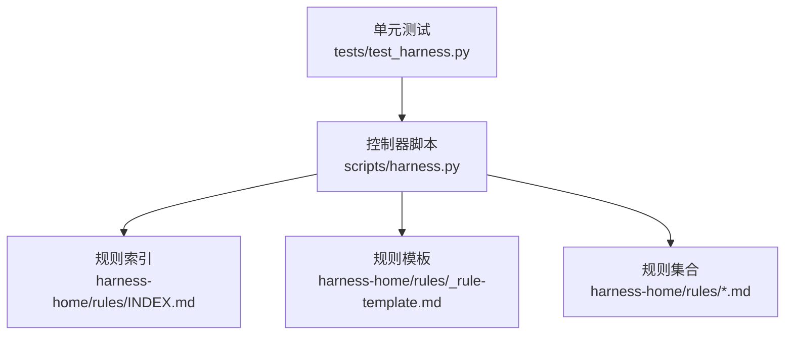
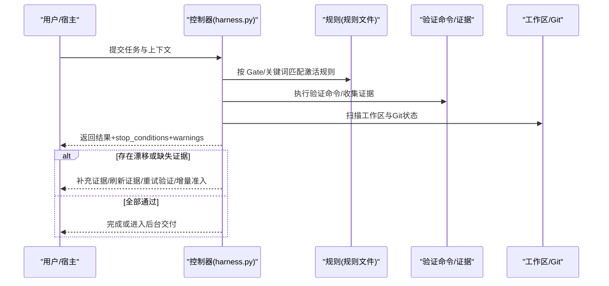
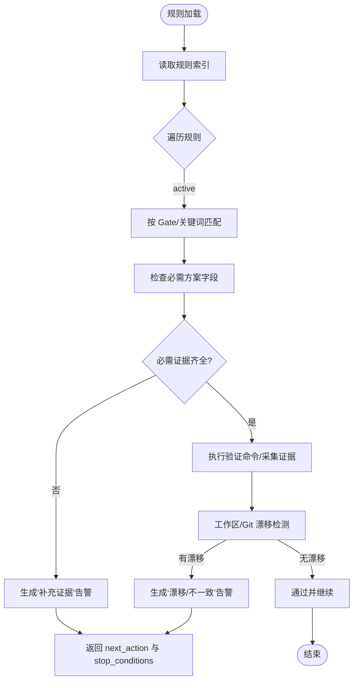
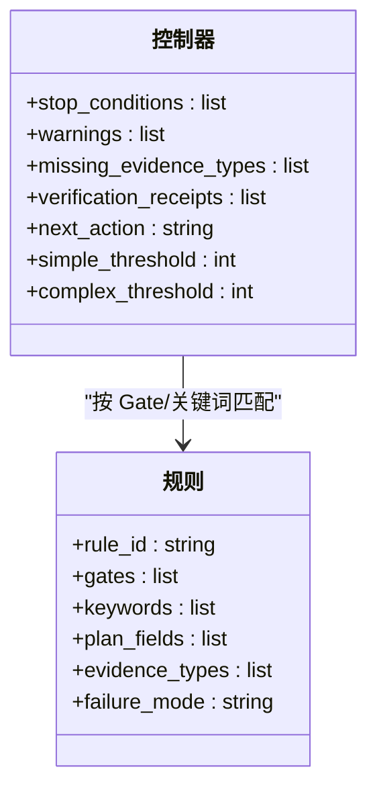
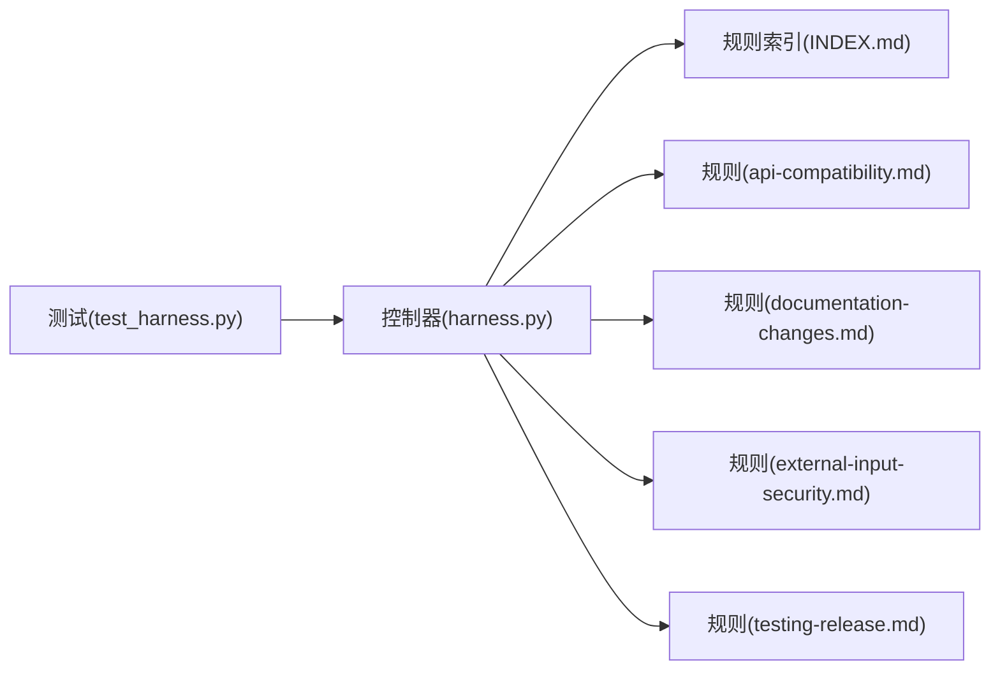

# 告警配置与管理

<cite>
**本文引用的文件**   
- [scripts/harness.py](file://scripts/harness.py)
- [harness-home/rules/INDEX.md](file://harness-home/rules/INDEX.md)
- [harness-home/rules/_rule-template.md](file://harness-home/rules/_rule-template.md)
- [harness-home/rules/api-compatibility.md](file://harness-home/rules/api-compatibility.md)
- [harness-home/rules/documentation-changes.md](file://harness-home/rules/documentation-changes.md)
- [harness-home/rules/external-input-security.md](file://harness-home/rules/external-input-security.md)
- [harness-home/rules/testing-release.md](file://harness-home/rules/testing-release.md)
- [tests/test_harness.py](file://tests/test_harness.py)
</cite>

## 目录
1. [简介](#简介)
2. [项目结构](#项目结构)
3. [核心组件](#核心组件)
4. [架构总览](#架构总览)
5. [详细组件分析](#详细组件分析)
6. [依赖关系分析](#依赖关系分析)
7. [性能与稳定性考虑](#性能与稳定性考虑)
8. [故障排查指南](#故障排查指南)
9. [结论](#结论)
10. [附录：规则模板与示例](#附录：规则模板与示例)

## 简介
本文件面向运维与平台工程人员，系统化说明 Docs Harness 的“告警配置与管理”能力。内容涵盖：
- 告警规则的定义语法与配置方法（阈值、条件表达式、触发频率）
- 告警级别管理（严重性分级、通知渠道、升级策略）
- 抑制与去重机制（避免告警风暴与重复通知）
- 告警模板定制与通知消息格式化
- 实战配置示例与调试技巧

需要特别说明的是：当前仓库未提供独立的“告警引擎”模块，Docs Harness 通过任务执行流程中的“证据校验、门禁 Gate、失败关闭、工作区漂移检测、验证命令缓存与收据复用”等机制，实现告警式的质量门控与问题提示。因此，本文将以“规则即告警”的方式组织文档，将规则命中、证据缺失、漂移与不一致视为“告警事件”，并给出可操作的配置与治理建议。

## 项目结构
与告警相关的关键位置：
- 规则索引与快照：harness-home/rules/INDEX.md
- 规则模板：harness-home/rules/_rule-template.md
- 具体规则定义：harness-home/rules/*.md
- 控制器主逻辑（含漂移检测、证据校验、验证命令缓存、停止条件等）：scripts/harness.py
- 测试用例（覆盖告警/警告字段、阈值等）：tests/test_harness.py

图表来源 
- [scripts/harness.py](file://scripts/harness.py)
- [harness-home/rules/INDEX.md](file://harness-home/rules/INDEX.md)
- [harness-home/rules/_rule-template.md](file://harness-home/rules/_rule-template.md)

章节来源
- [harness-home/rules/INDEX.md](file://harness-home/rules/INDEX.md)
- [scripts/harness.py](file://scripts/harness.py)

## 核心组件
- 规则系统（Rules）
  - 以 Markdown + YAML Frontmatter 形式声明规则 ID、适用 Gate、关键词、必需方案字段、证据类型与失败处理方式。
  - 规则由 INDEX.md 统一索引，运行时按 Gate/关键词匹配激活。
- 控制器（Controller）
  - 负责任务准入、Gate 判定、证据校验、验证命令执行与缓存、工作区漂移检测、停止条件与处置建议。
  - 输出结构化响应，包含 stop_conditions、warnings、missing_evidence_types、verification_receipts 等关键告警信息。
- 测试与契约（Tests & Contracts）
  - 通过单元测试覆盖关键路径，确保规则加载、指纹校验、证据与命令收据一致性。

章节来源
- [harness-home/rules/INDEX.md](file://harness-home/rules/INDEX.md)
- [harness-home/rules/_rule-template.md](file://harness-home/rules/_rule-template.md)
- [scripts/harness.py](file://scripts/harness.py)

## 架构总览
下图展示“规则即告警”的整体流程：任务输入经控制器编译意图与候选意图后，结合 Gate 词表与规则命中，驱动证据校验与验证命令执行；若出现漂移或缺失证据，则生成告警/警告并给出下一步动作。

图表来源 
- [scripts/harness.py](file://scripts/harness.py)
- [harness-home/rules/INDEX.md](file://harness-home/rules/INDEX.md)

## 详细组件分析

### 规则系统与告警映射
- 规则字段与告警含义
  - status: active/scaffold：控制是否生效
  - rule_id：唯一标识，便于告警追踪与聚合
  - gates：关联 Gate，决定风险等级与审批强度
  - keywords：命中关键词，用于快速识别变更范围
  - plan_fields：必须填写的方案字段，缺失时产生“补证/重新准入”告警
  - evidence_types：必需的证据类型，缺失时产生“补充证据”告警
  - failure_mode：失败处理策略，指导“停止并补齐/重新准入”等告警处置
- 规则索引与快照
  - INDEX.md 维护生效规则清单与快照约定，保证安装与升级的一致性

图表来源 
- [harness-home/rules/INDEX.md](file://harness-home/rules/INDEX.md)
- [scripts/harness.py](file://scripts/harness.py)

章节来源
- [harness-home/rules/INDEX.md](file://harness-home/rules/INDEX.md)
- [harness-home/rules/_rule-template.md](file://harness-home/rules/_rule-template.md)
- [harness-home/rules/api-compatibility.md](file://harness-home/rules/api-compatibility.md)
- [harness-home/rules/documentation-changes.md](file://harness-home/rules/documentation-changes.md)
- [harness-home/rules/external-input-security.md](file://harness-home/rules/external-input-security.md)
- [harness-home/rules/testing-release.md](file://harness-home/rules/testing-release.md)

### 控制器告警与停止条件
- 停止条件（stop_conditions）
  - 控制器在多个阶段设置 stop_conditions，明确“何时应停止并等待外部动作”，如“交付结构化证据”“返回通过/补证/重新准入结论”。
- 告警/警告（warnings）
  - 工作区漂移检测会产出 warnings，包含 reason_code（如 concurrent_drift_unrelated、unattributed_drift_unrelated）与受影响路径。
- 证据与命令收据
  - 缺失证据类型时返回 missing_evidence_types；验证命令支持缓存与收据复用，减少重复执行与重复告警。
- 阈值与频率控制
  - 控制器内存在简单/复杂阈值常量，可用于限制某些操作规模或复杂度，间接影响告警触发面。

图表来源 
- [scripts/harness.py](file://scripts/harness.py)
- [harness-home/rules/_rule-template.md](file://harness-home/rules/_rule-template.md)

章节来源
- [scripts/harness.py](file://scripts/harness.py)
- [tests/test_harness.py](file://tests/test_harness.py)

### 阈值设置、条件表达式与触发频率
- 阈值设置
  - 控制器内置 simple_threshold 与 complex_threshold，用于限制任务规模或复杂度，降低误报与告警风暴概率。
- 条件表达式
  - 规则通过 gates 与 keywords 组合表达条件；控制器对安全底线 Gate 使用精确词表与否定守卫，减少误命中。
- 触发频率控制
  - 验证命令缓存与证据收据复用，避免重复执行导致的重复告警；同时 stop_conditions 明确“等待外部动作”的时机，天然限流。

章节来源
- [scripts/harness.py](file://scripts/harness.py)

### 告警级别管理与升级策略
- 严重性分级
  - 通过 Gate 区分风险等级（如 security-sensitive、destructive-data、release-external 为安全底线），高风险场景强制更严格的证据与验收。
- 通知渠道配置
  - 当前仓库未集成外部通知通道；建议在宿主层基于控制器返回的 stop_conditions/warnings/missing_evidence_types 进行路由与通知。
- 升级策略
  - 当证据缺失或漂移持续存在时，控制器返回 next_action（如“补充证据”“刷新证据”“重试验证”“增量准入”“全量重新准入”），宿主持续升级处置直至闭环。

章节来源
- [scripts/harness.py](file://scripts/harness.py)

### 抑制与去重机制
- 抑制
  - 控制器支持 suppress_post_completion_dispatch 等标志位，避免完成后的不必要派发与告警。
- 去重
  - 证据收据与验证命令收据具备指纹与时效，相同输入与命令可复用结果，避免重复告警。
- 漂移去噪
  - 针对无关漂移（unrelated）与未归因漂移（unattributed）分别给出 reason_code，便于上层过滤与降噪。

章节来源
- [scripts/harness.py](file://scripts/harness.py)

### 告警模板与通知消息格式化
- 模板化骨架
  - 控制器会为缺失的证据类型生成 skeleton 引用，便于宿主填充模板化证据。
- 消息格式化
  - 控制器返回的结构化字段（stop_conditions、warnings、missing_evidence_types、verification_receipts、next_action）可直接作为通知消息的数据源，宿主可按需渲染。

章节来源
- [scripts/harness.py](file://scripts/harness.py)

### 实际配置示例与调试技巧
- 配置示例
  - 新增一条规则：在 harness-home/rules 下创建 .md，填写 frontmatter（rule_id、gates、keywords、plan_fields、evidence_types、failure_mode），并在 INDEX.md 中纳入 active_rules。
  - 调整阈值：在控制器常量处修改 simple_threshold/complex_threshold，以适配不同规模任务。
- 调试技巧
  - 使用 --json 输出结构化结果，重点查看 stop_conditions、warnings、missing_evidence_types、verification_receipts。
  - 定位漂移：根据 warnings.reason_code 与 paths 定位受影响文件，确认是否为无关漂移或未归因写入。
  - 复现与幂等：同一 target、任务文本与工作区快照重复 run 会复用活动任务，避免重复告警。

章节来源
- [harness-home/rules/_rule-template.md](file://harness-home/rules/_rule-template.md)
- [harness-home/rules/INDEX.md](file://harness-home/rules/INDEX.md)
- [scripts/harness.py](file://scripts/harness.py)
- [tests/test_harness.py](file://tests/test_harness.py)

## 依赖关系分析
- 控制器依赖规则索引与规则文件，按 Gate/关键词匹配激活规则。
- 测试用例依赖控制器模块与规则集合，确保契约一致性与行为稳定。
- 规则之间相互独立，通过 INDEX.md 统一管理。

图表来源 
- [scripts/harness.py](file://scripts/harness.py)
- [harness-home/rules/INDEX.md](file://harness-home/rules/INDEX.md)
- [tests/test_harness.py](file://tests/test_harness.py)

章节来源
- [scripts/harness.py](file://scripts/harness.py)
- [harness-home/rules/INDEX.md](file://harness-home/rules/INDEX.md)
- [tests/test_harness.py](file://tests/test_harness.py)

## 性能与稳定性考虑
- 验证命令缓存与收据复用显著降低重复执行成本，减少告警风暴。
- 工作区漂移检测采用 Git 快照与指纹对比，避免全量扫描带来的开销。
- 阈值与 Gate 词表设计兼顾准确性与性能，防止过度匹配与误报。

[本节为通用指导，不直接分析具体文件]

## 故障排查指南
- 常见告警类型
  - 补充证据：missing_evidence_types 非空，需按 skeleton 填充并提交证据收据。
  - 刷新证据：基线漂移导致证据失效，需更新证据引用。
  - 重试验证：验证命令失败，检查命令白名单与输入参数。
  - 漂移告警：concurrent_drift_unrelated 或 unattributed_drift_unrelated，检查工作区写入与归因。
- 定位步骤
  - 查看控制器 JSON 输出中的 stop_conditions、warnings、missing_evidence_types。
  - 根据 paths 定位受影响文件，确认是否为无关漂移或未归因写入。
  - 若涉及 Gate 升级，按 failure_mode 要求补齐方案字段与证据。

章节来源
- [scripts/harness.py](file://scripts/harness.py)
- [tests/test_harness.py](file://tests/test_harness.py)

## 结论
Docs Harness 以“规则即告警”的方式，将质量门控、证据校验与漂移检测融入任务执行流程。通过 Gate 分级、阈值控制、验证命令缓存与证据收据复用，有效避免告警风暴与重复通知。运维人员可基于控制器返回的结构化字段，构建通知与升级策略，快速定位与闭环问题。

[本节为总结性内容，不直接分析具体文件]

## 附录：规则模板与示例
- 规则模板字段说明
  - status：scaffold/active
  - rule_id：唯一标识
  - content_fingerprint：内容指纹（用于一致性校验）
  - gates：关联 Gate
  - keywords：命中关键词
  - plan_fields：必需方案字段
  - evidence_types：必需证据类型
  - failure_mode：失败处理方式
- 示例规则
  - API 兼容：DH-API-COMPATIBILITY，关联 architecture-contract，强调兼容策略与回滚路径。
  - 文档修改：DH-DOCUMENTATION-CHANGES，关联 document-edit，强调真源与索引同步。
  - 外部输入安全：DH-EXTERNAL-INPUT-SECURITY，关联 security-sensitive，强调信任边界与负向路径。
  - 测试放行：DH-TESTING-RELEASE，关联 testing-acceptance，强调分层验证与产物验收。

章节来源
- [harness-home/rules/_rule-template.md](file://harness-home/rules/_rule-template.md)
- [harness-home/rules/api-compatibility.md](file://harness-home/rules/api-compatibility.md)
- [harness-home/rules/documentation-changes.md](file://harness-home/rules/documentation-changes.md)
- [harness-home/rules/external-input-security.md](file://harness-home/rules/external-input-security.md)
- [harness-home/rules/testing-release.md](file://harness-home/rules/testing-release.md)