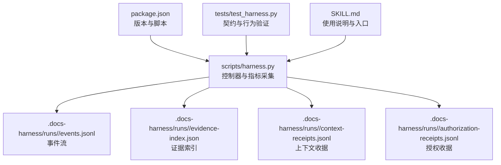
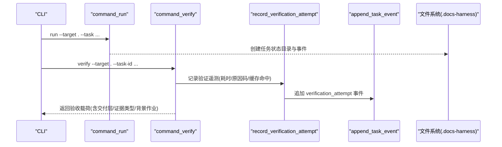
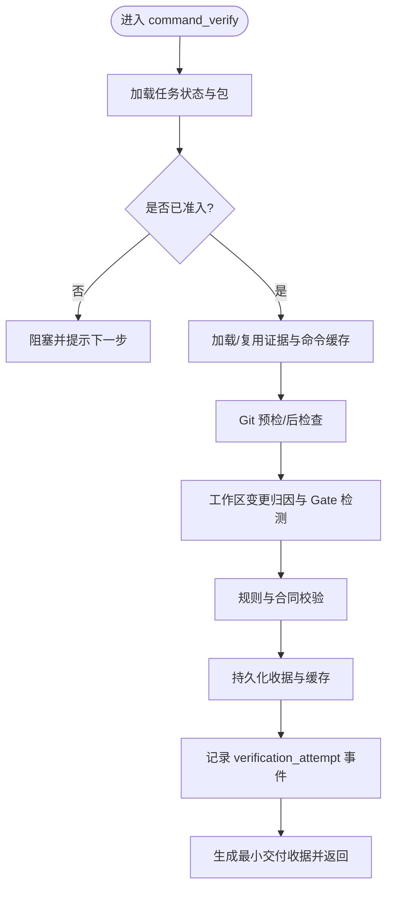
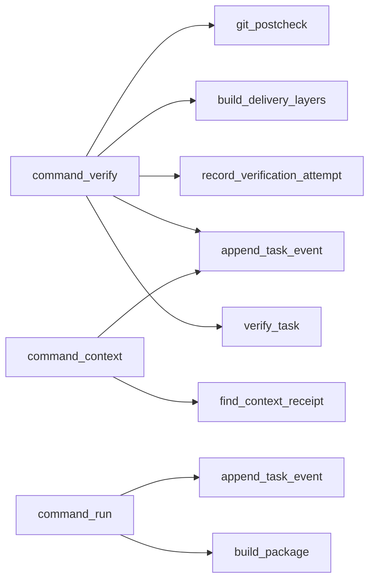

# 指标收集与统计

<cite>
**本文引用的文件**   
- [scripts/harness.py](file://scripts/harness.py)
- [tests/test_harness.py](file://tests/test_harness.py)
- [package.json](file://package.json)
- [SKILL.md](file://SKILL.md)
</cite>

## 目录
1. [简介](#简介)
2. [项目结构](#项目结构)
3. [核心组件](#核心组件)
4. [架构总览](#架构总览)
5. [详细组件分析](#详细组件分析)
6. [依赖关系分析](#依赖关系分析)
7. [性能考量](#性能考量)
8. [故障排查指南](#故障排查指南)
9. [结论](#结论)
10. [附录](#附录)

## 简介
本文件面向 Docs Harness 的指标收集与统计，聚焦以下目标：
- 任务执行指标的采集机制：生命周期事件、执行时间统计、成功率监控。
- 性能统计数据实现：CPU/内存/I/O 监控接入点与扩展方法。
- 业务关键指标定义与采集：证据收集效率、规则引擎执行结果、知识图谱更新状态。
- 指标格式规范与导出接口：Prometheus 格式输出与自定义指标扩展。
- 集成示例：如何在现有 CLI 流程中嵌入监控系统（以路径引用代替代码片段）。

## 项目结构
Docs Harness 的核心逻辑集中在单一脚本 harness.py，测试用例位于 tests/test_harness.py；包元信息与脚本入口由 package.json 管理；SKILL.md 提供高层使用说明。

图表来源
- [scripts/harness.py:906-922](file://scripts/harness.py#L906-L922)
- [scripts/harness.py:1031-1071](file://scripts/harness.py#L1031-L1071)

章节来源
- [package.json:1-23](file://package.json#L1-L23)
- [SKILL.md:25-55](file://SKILL.md#L25-L55)

## 核心组件
- 事件写入与生命周期追踪
  - 通过 append_task_event 将每个阶段的事件持久化到 events.jsonl，包含 duration_ms、phase、reason_code、context_cache_hit、readmission_count、evidence_round_count、host_receipt_count、business_action_count 等字段，用于构建任务生命周期与执行时长统计。
- 验证遥测记录
  - record_verification_attempt 对每次 verify 入口进行有界遥测记录，聚合 exit_code、outcome_class、reason_codes、command_executed_count、command_cache_hit_count、context_full_load_count/delta_load_count 等，支撑成功率与命令缓存命中率统计。
- 上下文加载计数
  - context_load_counters 统计全量与增量上下文加载次数，辅助评估上下文构建成本与缓存有效性。
- Git 预检/后检查
  - git_preflight_contract 与 git_postcheck 产出 preflight 快照与 postcheck 校验结果，作为交付层“git_head”的证据来源与范围约束依据。
- 交付层构建
  - build_delivery_layers 根据任务意图与成功标准推导各层期望与已验证证据集合，形成可观测的交付层状态。

章节来源
- [scripts/harness.py:1031-1071](file://scripts/harness.py#L1031-L1071)
- [scripts/harness.py:6243-6280](file://scripts/harness.py#L6243-L6280)
- [scripts/harness.py:6230-6241](file://scripts/harness.py#L6230-L6241)
- [scripts/harness.py:677-791](file://scripts/harness.py#L677-L791)
- [scripts/harness.py:793-876](file://scripts/harness.py#L793-L876)
- [scripts/harness.py:6070-6144](file://scripts/harness.py#L6070-L6144)

## 架构总览
下图展示从 CLI 入口到指标落盘的调用链路与数据流向。

图表来源
- [scripts/harness.py:4540-4563](file://scripts/harness.py#L4540-L4563)
- [scripts/harness.py:6282-6298](file://scripts/harness.py#L6282-L6298)
- [scripts/harness.py:6243-6280](file://scripts/harness.py#L6243-L6280)
- [scripts/harness.py:1031-1071](file://scripts/harness.py#L1031-L1071)

## 详细组件分析

### 任务生命周期指标
- 事件模型
  - schema_version、event、task_id、phase、started_at、duration_ms、reason_code、package_revision、context_cache_hit、context_load_count、readmission_count、evidence_round_count、host_receipt_count、business_action_count、at。
- 关键事件
  - context_loaded/context_reused/context_delta_loaded：上下文加载与复用。
  - readmission/scope_bound_readmission/incremental_gate_readmission：重新准入与范围边界重编译。
  - verification_attempt：验证尝试，聚合 outcome_class、reason_codes、exit_code、command_executed_count、command_cache_hit_count、context_full_load_count、context_delta_load_count、changed_path_count 等。
  - auto_attribution：自动归因事件，记录受控路径与证据 ID。
- 指标用途
  - 生命周期阶段耗时分布、重试与再准入频率、上下文缓存命中率、证据轮次与宿主收据数量、业务动作计数。

图表来源
- [scripts/harness.py:6282-6298](file://scripts/harness.py#L6282-L6298)
- [scripts/harness.py:6301-6777](file://scripts/harness.py#L6301-L6777)
- [scripts/harness.py:6243-6280](file://scripts/harness.py#L6243-L6280)

章节来源
- [scripts/harness.py:1031-1071](file://scripts/harness.py#L1031-L1071)
- [scripts/harness.py:6243-6280](file://scripts/harness.py#L6243-L6280)
- [scripts/harness.py:6301-6777](file://scripts/harness.py#L6301-L6777)

### 执行时间统计
- 计时点
  - command_context/command_verify/command_run 等入口使用 time.monotonic() 计算 duration_ms。
  - append_task_event 将 duration_ms 写入事件，支持阶段级耗时统计。
- 统计维度
  - 按 phase（context/admission/verification）划分；结合 reason_code 与 outcome_class 做成功率与失败原因分析。

章节来源
- [scripts/harness.py:4131-4213](file://scripts/harness.py#L4131-L4213)
- [scripts/harness.py:6282-6298](file://scripts/harness.py#L6282-L6298)
- [scripts/harness.py:1031-1071](file://scripts/harness.py#L1031-L1071)

### 成功率监控
- 分类器
  - classify_verification_outcome 基于 exit_code 与 reason_codes 映射为 complete/full_readmission/retry_verification/refresh_evidence/provide_evidence 等类别。
- 聚合
  - record_verification_attempt 汇总 outcome_class、reason_codes、exit_code、command_executed_count、command_cache_hit_count、context_full_load_count/delta_load_count、changed_path_count 等，便于外部系统聚合成功率与失败原因。

章节来源
- [scripts/harness.py:6192-6228](file://scripts/harness.py#L6192-L6228)
- [scripts/harness.py:6243-6280](file://scripts/harness.py#L6243-L6280)

### 性能统计数据实现（CPU/内存/I/O）
- 现状
  - 当前脚本未直接采集 CPU/内存/IO 指标，但提供了稳定的埋点位置与事件通道，适合在入口处或子进程调用处注入系统指标采集。
- 建议接入点
  - 在 command_run/command_verify/command_context 等入口前后插入系统探针（如 psutil），将 cpu_percent、memory_rss、io_counters 等写入同一事件流或独立指标文件，保持与现有 duration_ms 对齐。
  - 对于 Git/外部命令调用（subprocess.run），可在调用前后采样 IO 与延迟，关联到 verification_attempt 事件的 command_executed_count。

章节来源
- [scripts/harness.py:4540-4563](file://scripts/harness.py#L4540-L4563)
- [scripts/harness.py:6282-6298](file://scripts/harness.py#L6282-L6298)
- [scripts/harness.py:572-583](file://scripts/harness.py#L572-L583)

### 业务关键指标（证据/规则/知识图谱）
- 证据收集效率
  - evidence_round_count、command_executed_count、command_cache_hit_count、stale_evidence、reusable_evidence 等字段可用于衡量证据获取与复用效率。
- 规则引擎执行结果
  - matched_rules、rule_errors、active_rules vs frozen_rules 的差异驱动 readmission 或增量重编译；可通过事件中的 reason_code 与 business_action_count 观察规则稳定性与影响面。
- 知识图谱更新状态
  - background_jobs 与 post_completion 描述知识维护任务的创建与分发状态；knowledge_job 的 created/dispatched/running/updated 等状态可作为知识图谱更新进度的指标源。

章节来源
- [scripts/harness.py:6070-6144](file://scripts/harness.py#L6070-L6144)
- [scripts/harness.py:6301-6777](file://scripts/harness.py#L6301-L6777)
- [scripts/harness.py:6243-6280](file://scripts/harness.py#L6243-L6280)

### 指标格式规范与导出接口
- 事件格式
  - 所有事件遵循 EVENT_SCHEMA，字段包括 event、task_id、phase、started_at、duration_ms、reason_code、package_revision、context_cache_hit、context_load_count、readmission_count、evidence_round_count、host_receipt_count、business_action_count、at 及具体场景附加字段。
- 导出建议
  - 将 events.jsonl 逐行解析为 Prometheus 文本格式（如 counters/gauges/histograms），按 task_id、phase、reason_code、outcome_class 等维度打标签。
  - 对 verification_attempt 事件构建计数器（attempt_total、success_total、failure_total）与时序直方图（duration_ms）。
- 自定义扩展
  - 新增指标时，优先在 append_task_event 或 record_verification_attempt 中追加字段，确保向后兼容；对外暴露统一导出器读取 events.jsonl 并转换为指标格式。

章节来源
- [scripts/harness.py:1031-1071](file://scripts/harness.py#L1031-L1071)
- [scripts/harness.py:6243-6280](file://scripts/harness.py#L6243-L6280)

### 集成监控系统示例（路径引用）
- 在 command_verify 入口前后采集系统指标并写入事件
  - 参考：[command_verify:6282-6298](file://scripts/harness.py#L6282-L6298)
- 将验证结果与原因码写入 verification_attempt 事件
  - 参考：[record_verification_attempt:6243-6280](file://scripts/harness.py#L6243-L6280)
- 读取 events.jsonl 并转换为 Prometheus 指标
  - 参考：[append_task_event:1031-1071](file://scripts/harness.py#L1031-L1071)

## 依赖关系分析
- 模块内依赖
  - command_verify 依赖 load_state、verify_task、record_verification_attempt、append_task_event、build_delivery_layers、git_postcheck 等。
  - command_run 依赖 build_package、create_task_state、first_run_payload、append_task_event。
  - command_context 依赖 find_context_receipt、append_task_event、plan_contract_payload。
- 外部依赖
  - Git 子进程调用（git_command）、文件系统读写（atomic_write_json、append_jsonl、read_jsonl）、时间函数（utc_now、time.monotonic）。

图表来源
- [scripts/harness.py:6282-6298](file://scripts/harness.py#L6282-L6298)
- [scripts/harness.py:6301-6777](file://scripts/harness.py#L6301-L6777)
- [scripts/harness.py:4131-4213](file://scripts/harness.py#L4131-L4213)
- [scripts/harness.py:4540-4563](file://scripts/harness.py#L4540-L4563)

章节来源
- [scripts/harness.py:6282-6298](file://scripts/harness.py#L6282-L6298)
- [scripts/harness.py:6301-6777](file://scripts/harness.py#L6301-L6777)
- [scripts/harness.py:4131-4213](file://scripts/harness.py#L4131-L4213)
- [scripts/harness.py:4540-4563](file://scripts/harness.py#L4540-L4563)

## 性能考量
- 事件写入采用追加模式与 fsync，保证幂等与一致性；在高吞吐场景下建议批量导出与异步消费 events.jsonl。
- 上下文缓存与命令缓存显著降低重复开销；可通过 context_cache_hit、command_cache_hit_count 监控缓存有效性。
- Git 操作存在超时与 LFS/Submodule 可用性检查；建议在外部监控中对这些失败路径设置告警。

章节来源
- [scripts/harness.py:1031-1071](file://scripts/harness.py#L1031-L1071)
- [scripts/harness.py:6243-6280](file://scripts/harness.py#L6243-L6280)
- [scripts/harness.py:677-791](file://scripts/harness.py#L677-L791)

## 故障排查指南
- 常见错误码与处理
  - invalid_request、missing_file、invalid_json、state_locked、stale_lock、git_preflight_timeout、git_remote_unavailable、git_ref_scope_violation、authorization_expired、authorization_mismatch 等。
- 定位步骤
  - 查看 events.jsonl 中对应 task_id 的事件序列，关注 phase、reason_code、duration_ms。
  - 检查 evidence-index.json 与 context-receipts.jsonl、authorization-receipts.jsonl 的一致性。
  - 针对 Git 相关错误，核对 git_preflight_contract 快照与 git_postcheck 校验结果。

章节来源
- [scripts/harness.py:392-397](file://scripts/harness.py#L392-L397)
- [scripts/harness.py:1009-1029](file://scripts/harness.py#L1009-L1029)
- [scripts/harness.py:677-791](file://scripts/harness.py#L677-L791)
- [scripts/harness.py:793-876](file://scripts/harness.py#L793-L876)

## 结论
Docs Harness 通过结构化事件与有界遥测实现了完善的任务生命周期与验证过程的可观测性。借助 events.jsonl 与现有字段，可稳定构建执行时间、成功率、证据效率、规则稳定性与知识图谱更新状态的指标体系。建议在入口与子进程调用处补充系统级指标采集，并通过统一导出器将事件转换为 Prometheus 格式，以满足生产监控需求。

## 附录
- 运行与自测
  - 使用 package.json 提供的脚本执行测试与自检，确保契约与行为一致。
- 参考入口
  - SKILL.md 描述了 run/verify/background 等入口用法，便于在宿主侧编排指标采集。

章节来源
- [package.json:17-21](file://package.json#L17-L21)
- [SKILL.md:25-55](file://SKILL.md#L25-L55)