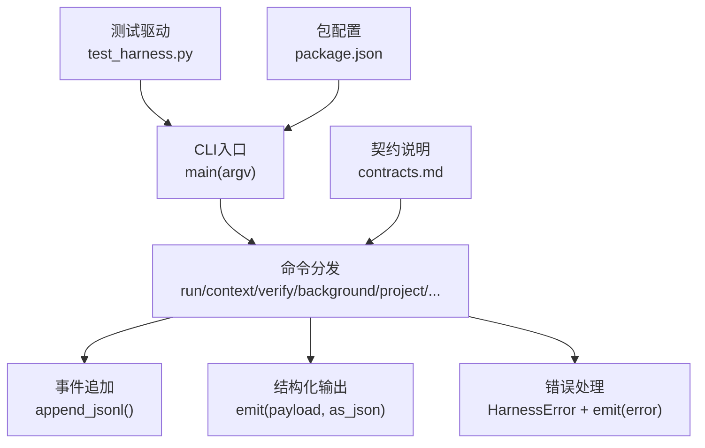
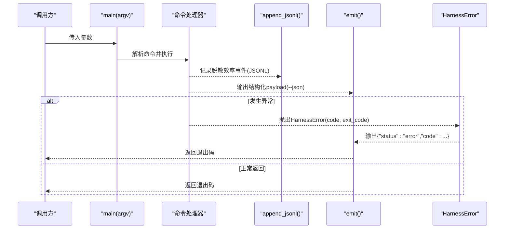
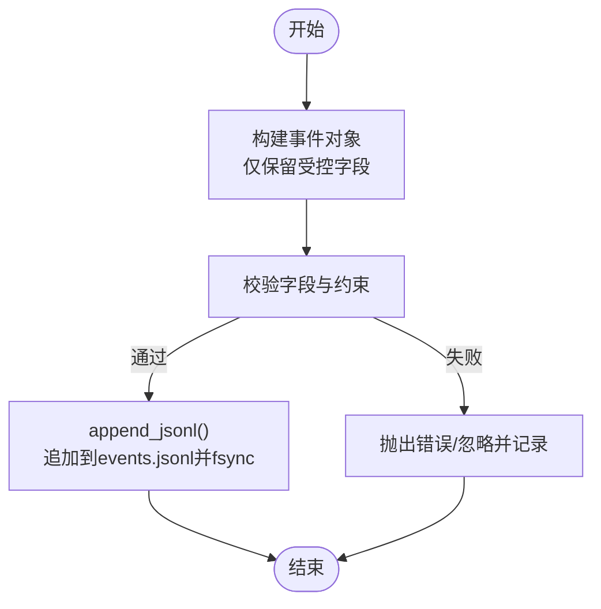
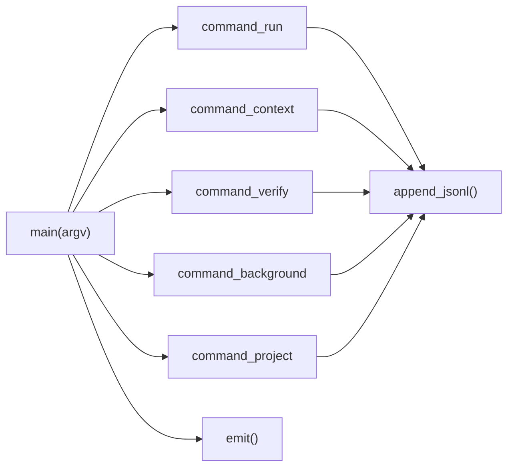

# 日志聚合与分析

<cite>
**本文引用的文件**   
- [scripts/harness.py](file://scripts/harness.py)
- [tests/test_harness.py](file://tests/test_harness.py)
- [docs/contracts.md](file://docs/contracts.md)
- [package.json](file://package.json)
</cite>

## 目录
1. [引言](#引言)
2. [项目结构](#项目结构)
3. [核心组件](#核心组件)
4. [架构总览](#架构总览)
5. [详细组件分析](#详细组件分析)
6. [依赖关系分析](#依赖关系分析)
7. [性能考虑](#性能考虑)
8. [故障排查指南](#故障排查指南)
9. [结论](#结论)
10. [附录](#附录)

## 引言
本文件为 Docs Harness 的“日志聚合与分析”专项文档，聚焦于结构化日志格式、级别管理策略、日志采集与集中存储方案、查询分析方法、轮转与空间优化建议，以及常见问题定位。该文档基于仓库现有实现与契约进行归纳，并给出面向运维与开发的可操作实践。

## 项目结构
Docs Harness 的核心逻辑集中在单一脚本中，测试用例与契约文档分别位于 tests 与 docs 目录；包元数据在 package.json 中定义。日志相关能力主要体现为：
- 事件追加写入（JSONL）
- 结构化输出（--json）
- 退出码与错误对象
- 运行时工件路径约定

图表来源
- [scripts/harness.py:10522-10560](file://scripts/harness.py#L10522-L10560)
- [scripts/harness.py:10482-10490](file://scripts/harness.py#L10482-L10490)
- [scripts/harness.py:510-516](file://scripts/harness.py#L510-L516)
- [tests/test_harness.py:59-71](file://tests/test_harness.py#L59-L71)
- [docs/contracts.md:283-301](file://docs/contracts.md#L283-L301)
- [package.json:17-21](file://package.json#L17-L21)

章节来源
- [scripts/harness.py:10522-10560](file://scripts/harness.py#L10522-L10560)
- [tests/test_harness.py:59-71](file://tests/test_harness.py#L59-L71)
- [docs/contracts.md:283-301](file://docs/contracts.md#L283-L301)
- [package.json:17-21](file://package.json#L17-L21)

## 核心组件
- 事件追加器（JSONL）
  - 功能：以 JSON 单行追加到 events.jsonl，确保原子落盘与同步刷新。
  - 关键字段：phase、started_at、duration_ms、reason_code、package_revision、context_cache_hit、context_load_count、readmission_count、evidence_round_count、host_receipt_count、business_action_count。
  - 约束：不得保存用户任务正文、原始工具输出、环境变量、凭证或完整日志。
- 结构化输出（--json）
  - 功能：所有命令通过 emit 输出结构化 payload，便于机器消费与聚合。
  - 行为：当 as_json=True 时输出 JSON；否则以 key: value 形式打印。
- 错误模型
  - 异常类型：HarnessError，包含 code、exit_code、message。
  - 统一捕获：main 中 try/except 将错误转为标准错误 payload 并返回对应退出码。
- 退出码规范
  - 0：成功；只有 verify.result=完成 表示父任务完成
  - 1：检查/自检失败
  - 2：输入/合同/状态无效
  - 3：需要方案/授权/证据/迁移/用户输入/Git 交付
  - 4：范围/漂移/Gate/远端/授权/规则变化，需重新准入

章节来源
- [scripts/harness.py:510-516](file://scripts/harness.py#L510-L516)
- [docs/contracts.md:283-301](file://docs/contracts.md#L283-L301)
- [scripts/harness.py:10482-10490](file://scripts/harness.py#L10482-L10490)
- [scripts/harness.py:395-400](file://scripts/harness.py#L395-L400)
- [scripts/harness.py:10553-10556](file://scripts/harness.py#L10553-L10556)
- [docs/contracts.md:361-370](file://docs/contracts.md#L361-L370)

## 架构总览
下图展示 CLI 主流程、命令分发、事件记录与结构化输出的整体交互。

图表来源
- [scripts/harness.py:10522-10560](file://scripts/harness.py#L10522-L10560)
- [scripts/harness.py:510-516](file://scripts/harness.py#L510-L516)
- [scripts/harness.py:10482-10490](file://scripts/harness.py#L10482-L10490)

## 详细组件分析

### 结构化日志格式设计
- 事件文件
  - 位置：任务 Runtime 内 events.jsonl（由 append_jsonl 写入）。
  - 字段：phase、started_at、duration_ms、reason_code、package_revision、context_cache_hit、context_load_count、readmission_count、evidence_round_count、host_receipt_count、business_action_count。
  - 时间戳：ISO 8601（UTC），无毫秒精度（由 utc_now 生成）。
  - 安全：不记录敏感信息（任务正文、工具输出、环境变量、凭证等）。
- 输出格式
  - --json 模式：emit 输出 JSON 对象，供外部系统聚合。
  - 非 JSON 模式：逐行 key: value 打印，便于人类阅读。
- 事件写入
  - 追加写、UTF-8、换行符控制、fsync 保证持久化。

图表来源
- [scripts/harness.py:510-516](file://scripts/harness.py#L510-L516)
- [docs/contracts.md:283-301](file://docs/contracts.md#L283-L301)

章节来源
- [scripts/harness.py:510-516](file://scripts/harness.py#L510-L516)
- [docs/contracts.md:283-301](file://docs/contracts.md#L283-L301)

### 日志级别管理策略
- 当前实现未内置分级日志（如 DEBUG/INFO/WARN/ERROR），而是采用：
  - 结构化事件（效率指标）+ 结构化错误（code/message/exit_code）
  - 退出码表达严重性（0/1/2/3/4）
- 建议映射（用于上层聚合层）
  - DEBUG：内部调试事件（如缓存命中、加载计数）
  - INFO：阶段开始/结束、业务动作计数
  - WARN：可恢复问题（如重试、增量准入）
  - ERROR：不可恢复错误（输入无效、权限不足、Git 校验失败）
- 输出控制
  - 通过 --json 开关控制是否输出结构化结果，便于上游按级别过滤与路由。

章节来源
- [scripts/harness.py:10482-10490](file://scripts/harness.py#L10482-L10490)
- [docs/contracts.md:361-370](file://docs/contracts.md#L361-L370)

### 日志聚合方案
- 本地日志收集
  - 读取 events.jsonl 与命令输出（--json 模式），结合任务 ID、阶段、时间戳进行归一化。
  - 使用 append_jsonl 的 fsync 特性保证顺序与一致性。
- 远程日志传输
  - 通过 CI/CD 或守护进程定期 tail events.jsonl，经 HTTP/消息队列转发至集中式存储。
  - 对敏感字段做二次脱敏（尽管事件已脱敏，仍建议在网关层加固）。
- 集中式存储配置
  - 推荐索引字段：task_id、phase、started_at、duration_ms、reason_code、package_revision。
  - 保留原始 JSON 行以便回溯。

章节来源
- [scripts/harness.py:510-516](file://scripts/harness.py#L510-L516)
- [docs/contracts.md:283-301](file://docs/contracts.md#L283-L301)

### 日志查询与分析方法
- 关键字搜索
  - 在 events.jsonl 上按 reason_code、phase、task_id 检索。
- 时间范围过滤
  - 基于 started_at 字段进行 ISO 时间区间筛选。
- 统计分析
  - 按 phase 统计耗时分布（duration_ms）、重试次数（readmission_count）、证据轮次（evidence_round_count）。
  - 结合任务生命周期（run→context→verify）计算端到端时长。

章节来源
- [docs/contracts.md:283-301](file://docs/contracts.md#L283-L301)

### 日志轮转与存储空间优化
- 轮转策略
  - 按天或大小触发轮转（例如 >10MB 或每日 00:00），归档压缩旧文件。
  - 保留策略：最近 N 天 + 关键任务周期（如发布窗口前后）。
- 存储优化
  - 仅保留必要字段；避免重复冗余。
  - 对大体积附件（如有）使用摘要指纹引用而非内联内容。
  - 清理过期任务工件（参考 task prune 语义，但针对日志独立策略）。

[本节为通用实践建议，不直接分析具体文件]

### 常见日志问题排查
- 事件缺失或不完整
  - 检查 append_jsonl 是否被调用；确认 fsync 成功。
  - 核对事件字段是否符合契约，避免非法字符导致解析失败。
- 输出非 JSON
  - 确认调用时是否传递 --json；检查 emit 分支。
- 错误无法定位
  - 查看错误 payload 中的 code 与 message；对照退出码含义。
  - 结合 phase 与 duration_ms 定位慢点。

章节来源
- [scripts/harness.py:10482-10490](file://scripts/harness.py#L10482-L10490)
- [scripts/harness.py:10553-10556](file://scripts/harness.py#L10553-L10556)
- [docs/contracts.md:361-370](file://docs/contracts.md#L361-L370)

## 依赖关系分析
- 模块耦合
  - main 负责解析与分发；各命令处理器负责业务逻辑与事件记录。
  - append_jsonl 与 emit 为横切关注点，被多处复用。
- 外部依赖
  - Git 命令、文件系统、子进程调用（由 harness.py 内部封装）。
- 潜在循环依赖
  - 单文件实现，循环依赖风险低。

图表来源
- [scripts/harness.py:10522-10560](file://scripts/harness.py#L10522-L10560)
- [scripts/harness.py:510-516](file://scripts/harness.py#L510-L516)

章节来源
- [scripts/harness.py:10522-10560](file://scripts/harness.py#L10522-L10560)

## 性能考虑
- I/O 性能
  - append_jsonl 每次写入后 fsync，确保可靠性但可能影响吞吐；在高并发场景可考虑批量合并写入（需谨慎保证顺序与幂等）。
- 序列化开销
  - canonical_json 与 json.dumps 频繁调用，注意避免重复构造大对象。
- 查询性能
  - 对 events.jsonl 的扫描建议使用流式解析与索引字段预取。

[本节为通用性能建议，不直接分析具体文件]

## 故障排查指南
- 快速定位
  - 使用 --json 获取结构化输出；根据 status/code/message 判断错误类型。
  - 查看 events.jsonl 中对应 task_id 的事件序列，定位阶段与耗时。
- 常见错误码
  - 2：输入/合同/状态无效
  - 3：需要方案/授权/证据/迁移/用户输入/Git 交付
  - 4：范围/漂移/Gate/远端/授权/规则变化，需重新准入
- 事件完整性
  - 若事件缺失，检查是否有异常路径绕过 append_jsonl；必要时在关键分支显式记录。

章节来源
- [scripts/harness.py:10482-10490](file://scripts/harness.py#L10482-L10490)
- [scripts/harness.py:10553-10556](file://scripts/harness.py#L10553-L10556)
- [docs/contracts.md:361-370](file://docs/contracts.md#L361-L370)

## 结论
Docs Harness 的日志体系以“脱敏事件 JSONL + 结构化输出 + 退出码”为核心，强调安全性与可观测性。通过统一的 append_jsonl 与 emit，配合契约定义的字段与约束，可在上层轻松实现采集、传输、存储、查询与分析。建议在上层补充级别映射、轮转策略与索引优化，以满足大规模生产环境的运维需求。

## 附录
- 运行与测试
  - 使用 package.json 中的脚本执行测试与自检，验证日志输出与事件记录。
- 参考契约
  - contracts.md 定义了事件字段、退出码与运行时约定，是日志设计的权威依据。

章节来源
- [package.json:17-21](file://package.json#L17-L21)
- [docs/contracts.md:283-301](file://docs/contracts.md#L283-L301)
- [docs/contracts.md:361-370](file://docs/contracts.md#L361-L370)