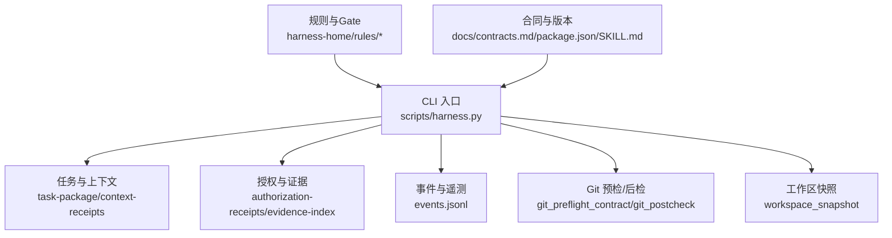
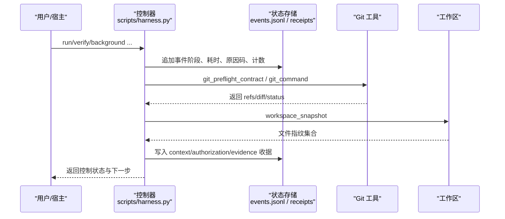
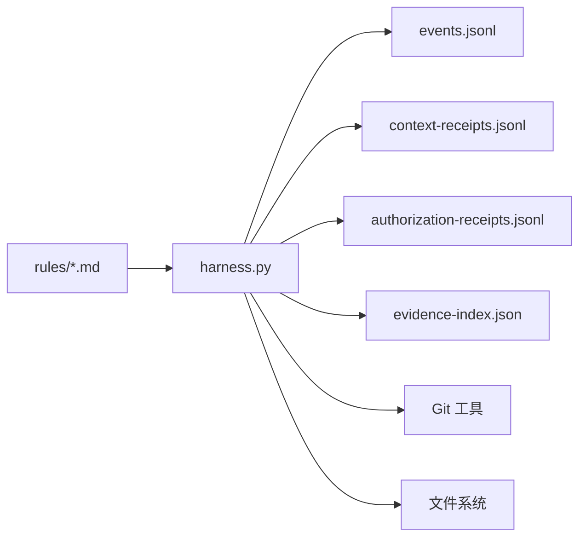

# 监控与可观测性

<cite>
**本文引用的文件**   
- [scripts/harness.py](file://scripts/harness.py)
- [package.json](file://package.json)
- [SKILL.md](file://SKILL.md)
- [docs/contracts.md](file://docs/contracts.md)
- [docs/architecture.md](file://docs/architecture.md)
- [harness-home/rules/INDEX.md](file://harness-home/rules/INDEX.md)
- [tests/test_harness.py](file://tests/test_harness.py)
</cite>

## 目录
1. [简介](#简介)
2. [项目结构](#项目结构)
3. [核心组件](#核心组件)
4. [架构总览](#架构总览)
5. [详细组件分析](#详细组件分析)
6. [依赖关系分析](#依赖关系分析)
7. [性能考量](#性能考量)
8. [故障排查指南](#故障排查指南)
9. [结论](#结论)
10. [附录](#附录)

## 简介
本文件为 Docs Harness 的监控与可观测性文档，聚焦以下方面：
- 指标收集机制：任务执行指标、性能统计数据、业务关键指标
- 健康检查实现：系统状态监控、依赖服务检查、资源使用监控
- 告警配置策略：阈值设置、告警规则、通知机制
- 日志聚合与分析：结构化日志格式、日志级别管理、查询分析方法
- 分布式追踪支持：请求链路跟踪、跨服务调用监控、性能热点识别
- 监控仪表板配置与运维自动化脚本示例

Docs Harness 以 CLI 控制器为核心，通过事件文件（events.jsonl）和受管收据（context-receipts.jsonl、authorization-receipts.jsonl、evidence-index.json）沉淀运行时数据，形成可审计、可复算的可观测基础。

## 项目结构
- scripts/harness.py：控制器源码真源，负责任务准入、上下文、验收、知识生命周期、后台 Job 状态机以及事件与收据写入
- package.json：包元信息与脚本入口（self-test、test）
- SKILL.md：对外行为与任务入口说明
- docs/contracts.md：合同定义（任务包、证据、Git 状态、退出码等）
- docs/architecture.md：架构事实与运行态边界
- harness-home/rules/INDEX.md：生效规则索引与加载约定
- tests/test_harness.py：契约与行为测试，覆盖 Git fetch/sync、verify、事件与收据等

图表来源
- [scripts/harness.py:1054-1093](file://scripts/harness.py#L1054-L1093)
- [scripts/harness.py:1144-1172](file://scripts/harness.py#L1144-L1172)
- [scripts/harness.py:677-791](file://scripts/harness.py#L677-L791)
- [scripts/harness.py:793-867](file://scripts/harness.py#L793-L867)
- [harness-home/rules/INDEX.md:1-41](file://harness-home/rules/INDEX.md#L1-L41)
- [docs/contracts.md:1-370](file://docs/contracts.md#L1-L370)
- [package.json:1-22](file://package.json#L1-L22)

章节来源
- [scripts/harness.py:1-1229](file://scripts/harness.py#L1-L1229)
- [docs/architecture.md:1-26](file://docs/architecture.md#L1-L26)
- [docs/contracts.md:1-370](file://docs/contracts.md#L1-L370)
- [package.json:1-22](file://package.json#L1-L22)

## 核心组件
- 事件系统（events.jsonl）：记录每个阶段的开始时间、耗时、原因码、上下文缓存命中、读入次数、重新准入次数、验证轮次、宿主收据数量、业务动作数等，用于指标复算与问题定位
- 上下文收据（context-receipts.jsonl）：按 stage 与内容指纹复用上下文，避免重复加载
- 授权收据（authorization-receipts.jsonl）：绑定 package fingerprint，确保授权不可跨修订复用
- 证据索引（evidence-index.json）：证据收据索引，支撑快速查找与校验
- Git 预检/后检：对 git_fetch/git_sync 进行前置约束与后置校验，保障远端一致性、分支快进、删除阈值、LFS/Submodule 可用性
- 工作区快照：生成稳定指纹，用于漂移检测与归因

章节来源
- [scripts/harness.py:1054-1093](file://scripts/harness.py#L1054-L1093)
- [scripts/harness.py:4200-4313](file://scripts/harness.py#L4200-L4313)
- [scripts/harness.py:677-791](file://scripts/harness.py#L677-L791)
- [scripts/harness.py:793-867](file://scripts/harness.py#L793-L867)
- [scripts/harness.py:1144-1172](file://scripts/harness.py#L1144-L1172)

## 架构总览
Docs Harness 的可观测性由“事件 + 收据 + 快照”构成闭环：
- 事件提供时序与计数维度
- 收据提供幂等与复用依据
- 快照提供变更基线与漂移检测

图表来源
- [scripts/harness.py:1054-1093](file://scripts/harness.py#L1054-L1093)
- [scripts/harness.py:677-791](file://scripts/harness.py#L677-L791)
- [scripts/harness.py:1144-1172](file://scripts/harness.py#L1144-L1172)
- [scripts/harness.py:4200-4313](file://scripts/harness.py#L4200-L4313)

## 详细组件分析

### 指标收集机制
- 任务执行指标
  - 阶段耗时：duration_ms
  - 上下文缓存命中：context_cache_hit
  - 上下文加载次数：context_load_count
  - 重新准入次数：readmission_count
  - 验证轮次：evidence_round_count
  - 宿主收据数量：host_receipt_count
  - 业务动作数：business_action_count
- 性能统计数据
  - 上下文增量加载：context_delta_loaded vs context_content_loaded
  - 命令缓存命中：verification command cache（可通过配置关闭）
  - Git 操作成功率与失败原因码
- 业务关键指标
  - 交付层状态：source/local_verification/git_head/remote_delivery/fresh_clone/release_artifact/ui/external_state
  - Gate 触发与处理：security-sensitive/destructive-data/release-external 等
  - 背景 Job 终态分布：updated/no_change/completed_with_finding/failed/cancelled

章节来源
- [scripts/harness.py:1054-1093](file://scripts/harness.py#L1054-L1093)
- [docs/contracts.md:82-95](file://docs/contracts.md#L82-L95)
- [docs/contracts.md:283-301](file://docs/contracts.md#L283-L301)

### 健康检查实现
- 系统状态监控
  - 状态锁：state_lock 检测死锁与并发冲突
  - 事件完整性：events.jsonl 存在性与可读性
  - 收据一致性：context/authorization/evidence 收据与 package fingerprint 绑定
- 依赖服务检查
  - Git 可用性：git_command 超时与错误码
  - LFS/Submodule：preflight 中探测并阻断不可用场景
  - 远端可达性：ls-remote 与 ref 解析
- 资源使用监控
  - 工作区快照大小限制：非 Git 模式文件数上限
  - 大文件指纹优化：仅记录 size:mtime_ns 而非全文哈希

章节来源
- [scripts/harness.py:1031-1051](file://scripts/harness.py#L1031-L1051)
- [scripts/harness.py:677-791](file://scripts/harness.py#L677-L791)
- [scripts/harness.py:1144-1172](file://scripts/harness.py#L1144-L1172)

### 告警配置策略
- 阈值设置
  - Git 删除阈值：GIT_DELETION_THRESHOLD（默认 100）
  - 非 Git 快照文件上限：FALLBACK_SNAPSHOT_FILE_LIMIT（默认 4096）
  - 状态锁超时：5 分钟 stale lock 判定
- 告警规则
  - verify 失败分类：provide_evidence/refresh_evidence/retry_verification/incremental_admission/full_readmission
  - Git 漂移与越界：git_remote_drift/ref 越界/non-fast-forward
  - Gate 升级：新增安全/破坏性/外部发布 Gate 强制完整重新准入
- 通知机制
  - 通过退出码与 reason_code 驱动上层编排（CI/CD、调度器）
  - 事件与收据作为唯一真相源，供外部告警系统消费

章节来源
- [scripts/harness.py:95-124](file://scripts/harness.py#L95-L124)
- [scripts/harness.py:1031-1051](file://scripts/harness.py#L1031-L1051)
- [docs/contracts.md:153-163](file://docs/contracts.md#L153-L163)
- [docs/contracts.md:359-370](file://docs/contracts.md#L359-L370)

### 日志聚合与分析
- 结构化日志格式
  - events.jsonl：每行一个 JSON 对象，包含 schema_version、event、task_id、phase、started_at、duration_ms、reason_code、package_revision、context_cache_hit、context_load_count、readmission_count、evidence_round_count、host_receipt_count、business_action_count、at
- 日志级别管理
  - 通过 reason_code 区分成功、重试、需补证、需重读、需重新准入等
- 查询分析方法
  - 按 task_id/phase/event 过滤
  - 计算 duration_ms 分位数、readmission_count 趋势、evidence_round_count 分布
  - 关联 context-receipts/authorization-receipts/evidence-index 进行根因定位

章节来源
- [scripts/harness.py:1054-1093](file://scripts/harness.py#L1054-L1093)
- [docs/contracts.md:283-301](file://docs/contracts.md#L283-L301)

### 分布式追踪支持
- 请求链路跟踪
  - 以 task_id 为链路标识，贯穿 run/context/verify/background 各阶段
  - phase 字段标识阶段（如 context/verification/work_package），便于绘制时序图
- 跨服务调用监控
  - host_receipt_count 统计宿主侧收据数量
  - business_action_count 统计 begin/submit 等业务动作
- 性能热点识别
  - duration_ms 与 context_load_count/evidence_round_count 联合分析
  - context_cache_hit 命中率低时关注上下文重复加载

章节来源
- [scripts/harness.py:1054-1093](file://scripts/harness.py#L1054-L1093)
- [scripts/harness.py:4200-4313](file://scripts/harness.py#L4200-L4313)

### 监控仪表板配置建议
- 指标面板
  - 任务耗时分布（P50/P95/P99）
  - 上下文缓存命中率
  - 重新准入率（readmission_count/total）
  - 验证轮次分布（evidence_round_count）
  - Git 操作成功率与失败原因码分布
- 健康看板
  - 状态锁占用时长
  - 事件文件增长速率
  - 收据一致性校验结果
- 告警规则
  - 连续 verify 失败超过阈值
  - Git 漂移或 ref 越界
  - 长时间持有状态锁

[本节为概念性配置建议，不直接分析具体文件]

### 运维自动化脚本示例
- 自检与打包检查
  - npm test：运行单元测试
  - npm run self-test：执行控制器自检
  - npm run pack:check：dry-run 打包检查
- 指标采集脚本思路
  - 读取 events.jsonl 并按 task_id/phase 聚合
  - 计算 duration_ms 分位数、readmission_count 趋势
  - 输出 Prometheus 文本格式或推送至时序数据库

章节来源
- [package.json:17-21](file://package.json#L17-L21)
- [tests/test_harness.py:59-71](file://tests/test_harness.py#L59-L71)

## 依赖关系分析
- 控制器依赖 Git 工具、文件系统、JSON 读写
- 事件与收据强依赖状态目录（Git 项目位于 .git/docs-harness/runs，非 Git 位于 .docs-harness/runs）
- 规则与 Gate 从 harness-home/rules 加载，指纹变化触发完整重新准入

图表来源
- [scripts/harness.py:1054-1093](file://scripts/harness.py#L1054-L1093)
- [scripts/harness.py:4200-4313](file://scripts/harness.py#L4200-L4313)
- [harness-home/rules/INDEX.md:1-41](file://harness-home/rules/INDEX.md#L1-L41)

章节来源
- [scripts/harness.py:1054-1093](file://scripts/harness.py#L1054-L1093)
- [harness-home/rules/INDEX.md:1-41](file://harness-home/rules/INDEX.md#L1-L41)

## 性能考量
- 上下文去重：按 content_set_fingerprint 复用，减少重复加载
- 验证命令缓存：输入未变则复用已通过收据，降低昂贵命令重跑
- 工作区快照优化：大文件仅记录 size:mtime_ns，避免全量哈希
- Git 预检/后检：提前发现 LFS/Submodule 不可用、脏工作区、非 fast-forward 等问题，减少无效执行

章节来源
- [scripts/harness.py:1144-1172](file://scripts/harness.py#L1144-L1172)
- [scripts/harness.py:677-791](file://scripts/harness.py#L677-L791)
- [docs/contracts.md:220-221](file://docs/contracts.md#L220-L221)

## 故障排查指南
- 常见错误与原因码
  - state_locked/stale_lock：状态锁冲突或死锁
  - invalid_json/missing_file：输入文件无效或缺失
  - git_preflight_failed/git_remote_unavailable：Git 预检失败或远端不可达
  - git_remote_drift/ref 越界：远端漂移或引用越界
  - provide_evidence/refresh_evidence/retry_verification：需补证、重读或重试
- 排查步骤
  - 查看 events.jsonl 最近事件，定位 phase 与 reason_code
  - 检查 context-receipts/authorization-receipts 是否过期或不一致
  - 确认 Git 状态（HEAD、refs、index、worktree）与预检快照一致
  - 检查工作区快照是否被截断或过大

章节来源
- [scripts/harness.py:1031-1051](file://scripts/harness.py#L1031-L1051)
- [scripts/harness.py:677-791](file://scripts/harness.py#L677-L791)
- [docs/contracts.md:153-163](file://docs/contracts.md#L153-L163)

## 结论
Docs Harness 的可观测性以事件与收据为核心，结合 Git 预检/后检与工作区快照，形成完整的监控与诊断基础。通过结构化事件、受控原因码与退出码，可与 CI/CD、告警系统与仪表板无缝集成，实现任务执行、性能与健康状态的全面可视化与自动化治理。

## 附录
- 合同参考：任务包、证据、Git 状态、退出码详见 contracts.md
- 架构事实：运行态边界与交付层详见 architecture.md
- 规则索引：生效规则与加载约定详见 harness-home/rules/INDEX.md

章节来源
- [docs/contracts.md:1-370](file://docs/contracts.md#L1-L370)
- [docs/architecture.md:1-26](file://docs/architecture.md#L1-L26)
- [harness-home/rules/INDEX.md:1-41](file://harness-home/rules/INDEX.md#L1-L41)