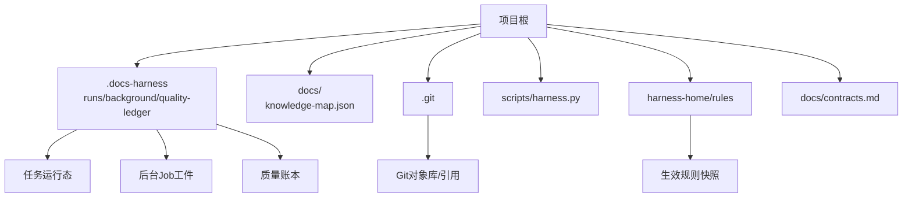
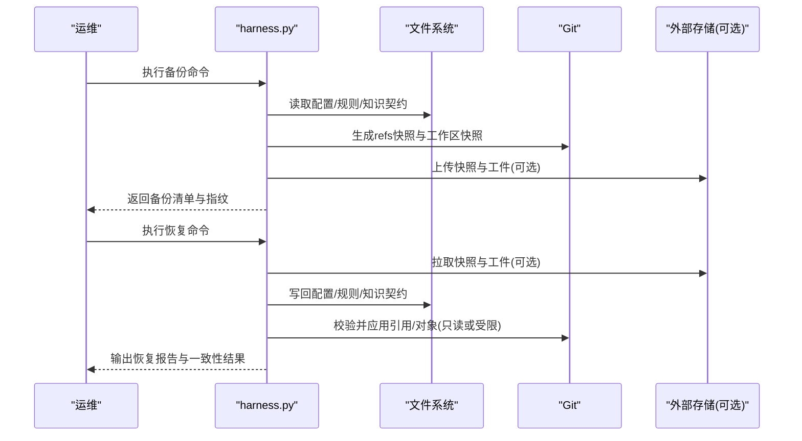
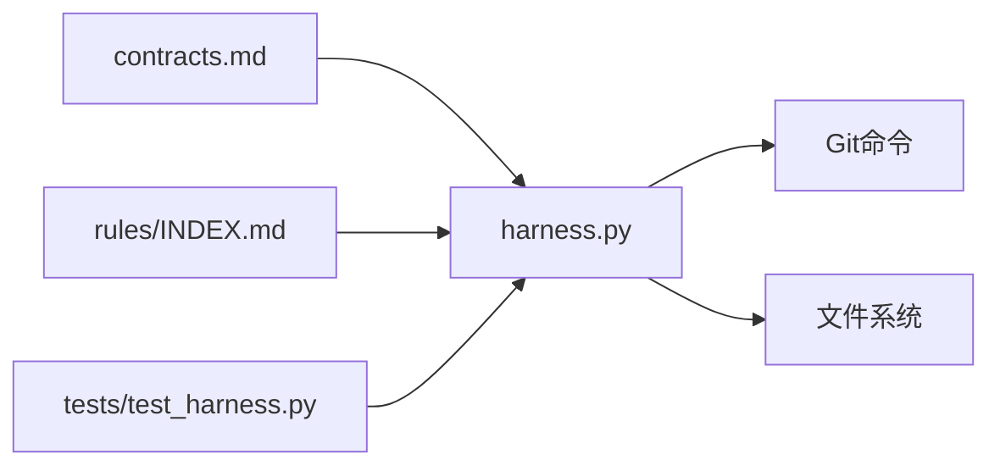

# 备份与恢复

<cite>
**本文引用的文件**   
- [scripts/harness.py](file://scripts/harness.py)
- [docs/contracts.md](file://docs/contracts.md)
- [harness-home/rules/INDEX.md](file://harness-home/rules/INDEX.md)
- [.gitignore](file://.gitignore)
- [package.json](file://package.json)
- [SKILL.md](file://SKILL.md)
</cite>

## 目录
1. [简介](#简介)
2. [项目结构](#项目结构)
3. [核心组件](#核心组件)
4. [架构总览](#架构总览)
5. [详细组件分析](#详细组件分析)
6. [依赖关系分析](#依赖关系分析)
7. [性能考量](#性能考量)
8. [故障排查指南](#故障排查指南)
9. [结论](#结论)
10. [附录](#附录)

## 简介
本文件为 Docs Harness 的“备份与恢复”专项文档，面向运维与平台工程团队，提供可落地的备份策略、数据范围、存储方案、恢复流程与自动化脚本使用指南。内容基于仓库内控制器实现与合同规范，确保与现有任务、证据、Git 状态与后台治理机制一致。

## 项目结构
Docs Harness 的核心控制逻辑集中在 Python 控制器中，配合规则与合同文档共同约束行为。与备份相关的关键点包括：
- 运行时与状态目录：任务运行态、后台 Job、质量账本等位于受管目录，默认不进入 Git（由 .gitignore 排除）。
- 快照与指纹：控制器对 Git refs、工作区、对象库进行快照与指纹计算，用于一致性校验与回滚锚点。
- 冻结与迁移：任务冻结、v1→v2 迁移具备全对象备份与回滚能力，保证迁移原子性与可恢复性。

**图示来源** 
- [.gitignore:1-10](file://.gitignore#L1-L10)
- [harness-home/rules/INDEX.md:1-41](file://harness-home/rules/INDEX.md#L1-L41)
- [docs/contracts.md:352-360](file://docs/contracts.md#L352-L360)

**章节来源**
- [.gitignore:1-10](file://.gitignore#L1-L10)
- [harness-home/rules/INDEX.md:1-41](file://harness-home/rules/INDEX.md#L1-L41)
- [docs/contracts.md:352-360](file://docs/contracts.md#L352-L360)

## 核心组件
- 控制器与工具函数：提供 Git 引用快照、工作区快照、原子写入、JSONL 追加/读取、目标安全校验等能力，是构建备份与恢复的基础。
- 合同与规则：定义任务包、证据收据、上下文授权、Git 状态快照、Runtime 目录约定与退出码等，指导备份范围与恢复顺序。
- 测试套件：覆盖 Git fetch/sync 预检/后检、快照与漂移处理、归档与清理等行为，可作为恢复演练用例参考。

**章节来源**
- [scripts/harness.py:615-626](file://scripts/harness.py#L615-L626)
- [scripts/harness.py:1115-1141](file://scripts/harness.py#L1115-L1141)
- [docs/contracts.md:97-133](file://docs/contracts.md#L97-L133)
- [docs/contracts.md:352-360](file://docs/contracts.md#L352-L360)

## 架构总览
下图展示备份与恢复在 Docs Harness 中的关键交互：控制器通过快照与指纹锁定一致性，结合冻结与迁移事务完成可回滚的变更；恢复时按“配置与规则 → 知识契约 → 任务与证据 → 后台工件 → Git 引用”的顺序重建。

**图示来源** 
- [scripts/harness.py:615-626](file://scripts/harness.py#L615-L626)
- [scripts/harness.py:1115-1141](file://scripts/harness.py#L1115-L1141)
- [docs/contracts.md:352-360](file://docs/contracts.md#L352-L360)

## 详细组件分析

### 备份策略设计
- 全量备份
  - 范围：配置与规则、知识契约（knowledge-map）、任务与证据索引、后台工件、Git 引用与对象库（按需）、本地 Runtime（仅当需要离线恢复）。
  - 频率：建议每日一次，重大变更前触发额外快照。
  - 校验：对每个阶段生成指纹（sha256），记录到备份清单。
- 增量备份
  - 范围：自上次快照以来的变更路径（基于 git diff 与工作区快照差异）。
  - 频率：每小时或事件驱动（如提交、验证完成）。
  - 校验：增量清单包含新增/修改/删除路径与对应指纹。
- 实时同步
  - 适用：高可用场景下将变更流式同步至异地容灾存储。
  - 触发：监听 Git 推送、验证完成事件、后台 Job 终态。
  - 限制：避免同步 Runtime 与临时文件；遵循 .gitignore 排除策略。

**章节来源**
- [scripts/harness.py:615-626](file://scripts/harness.py#L615-L626)
- [scripts/harness.py:1115-1141](file://scripts/harness.py#L1115-L1141)
- [.gitignore:1-10](file://.gitignore#L1-L10)

### 需备份的数据类型
- 工件存储
  - 任务产物、证据收据、上下文与授权收据、验证命令缓存。
  - 后台 Job 工件（job.json、plan.json、progress.json、events.jsonl）。
- 状态数据
  - 任务运行态（runs）、后台工件（background）、质量账本（quality-ledger）。
  - 迁移 staging、journal、manifest 与全对象备份（v1→v2）。
- 配置信息
  - 项目配置（config.json）、规则快照（harness-home/rules）、知识地图（knowledge-map.json）。
- 证据收据
  - evidence-receipt/v2、context-receipt/v2、authorization-receipt/v2、verification-command-receipt/v1。

**章节来源**
- [docs/contracts.md:352-360](file://docs/contracts.md#L352-L360)
- [docs/contracts.md:236-249](file://docs/contracts.md#L236-L249)
- [harness-home/rules/INDEX.md:1-41](file://harness-home/rules/INDEX.md#L1-L41)

### 备份存储方案
- 本地存储
  - 推荐独立磁盘或卷，保留多代快照（全量+增量）与清单。
  - 定期校验完整性（指纹比对），异常告警。
- 云存储
  - 对象存储（S3/OSS/COS）分桶按项目与环境隔离，开启版本化与加密。
  - 生命周期策略：热/冷分层，自动归档与过期清理。
- 异地容灾
  - 跨地域复制（异步），RPO/RTO 明确；定期演练恢复。
  - 网络与权限最小化，访问日志审计。

[本节为通用指导，不直接分析具体文件]

### 恢复流程指南
- 灾难恢复预案
  - 触发条件：主机不可用、数据损坏、误删、恶意篡改。
  - 优先级：先恢复配置与规则，再恢复知识契约，最后恢复任务与证据。
- 数据一致性验证
  - 使用控制器提供的快照与指纹工具校验一致性。
  - 对比 Git refs 快照与工作区指纹，确认无漂移。
- 系统重启步骤
  - 恢复配置与规则后执行自检（self-test）。
  - 恢复任务与证据后执行 verify 校验。
  - 恢复后台工件后检查 Job 终态与进度。

**章节来源**
- [docs/contracts.md:236-249](file://docs/contracts.md#L236-L249)
- [scripts/harness.py:615-626](file://scripts/harness.py#L615-L626)
- [scripts/harness.py:1115-1141](file://scripts/harness.py#L1115-L1141)

### 自动化备份脚本与恢复工具
- 备份脚本要点
  - 调用控制器函数生成 Git refs 快照与工作区快照。
  - 收集配置、规则、知识契约、任务与证据、后台工件。
  - 生成清单与指纹，上传至本地/云存储。
- 恢复工具要点
  - 从备份源拉取清单与数据。
  - 按顺序写回配置、规则、知识契约、任务与证据、后台工件。
  - 执行一致性校验与自检，输出恢复报告。

[本节为通用指导，不直接分析具体文件]

## 依赖关系分析
- 控制器依赖 Git 命令与文件系统 API，生成快照与指纹。
- 合同与规则约束备份范围与恢复顺序。
- 测试套件提供行为验证用例，可用于恢复演练。

**图示来源** 
- [scripts/harness.py:615-626](file://scripts/harness.py#L615-L626)
- [docs/contracts.md:352-360](file://docs/contracts.md#L352-L360)
- [harness-home/rules/INDEX.md:1-41](file://harness-home/rules/INDEX.md#L1-L41)

**章节来源**
- [scripts/harness.py:615-626](file://scripts/harness.py#L615-L626)
- [docs/contracts.md:352-360](file://docs/contracts.md#L352-L360)
- [harness-home/rules/INDEX.md:1-41](file://harness-home/rules/INDEX.md#L1-L41)

## 性能考量
- 快照粒度：按文件级指纹计算，大文件建议使用增量与并行。
- 存储带宽：云存储上传采用压缩与分片，降低带宽占用。
- 恢复时间：优先恢复关键路径（配置、规则、知识契约），其余异步恢复。
- 资源限制：避免与业务高峰重叠，设置超时与重试策略。

[本节为通用指导，不直接分析具体文件]

## 故障排查指南
- 常见问题
  - 快照不一致：检查 Git refs 与工作区指纹是否匹配。
  - 恢复失败：确认恢复顺序与权限，验证清单指纹。
  - 规则缺失：检查 harness-home/rules 是否完整且指纹正确。
- 定位方法
  - 使用控制器自检与任务状态查询。
  - 查看 events.jsonl 与后台工件日志。
  - 对比备份清单与实际文件指纹。

**章节来源**
- [docs/contracts.md:352-360](file://docs/contracts.md#L352-L360)
- [scripts/harness.py:615-626](file://scripts/harness.py#L615-L626)

## 结论
Docs Harness 的备份与恢复应围绕快照与指纹构建一致性保障，结合冻结与迁移事务实现可回滚变更。通过分层备份（全量+增量+实时同步）与多存储方案（本地+云+异地容灾），可满足不同 RPO/RTO 需求。恢复流程需严格遵循顺序与校验，确保系统快速稳定回归。

[本节为总结，不直接分析具体文件]

## 附录
- 参考命令
  - 自检：参见 package.json 中的 self-test 脚本。
  - 任务与后台管理：参见 SKILL.md 中的 background 命令序列。
- 最佳实践
  - 定期演练恢复，记录 RTO/RPO。
  - 监控备份成功率与延迟，设置告警。
  - 最小权限原则，审计访问日志。

**章节来源**
- [package.json:17-21](file://package.json#L17-L21)
- [SKILL.md:72-86](file://SKILL.md#L72-L86)