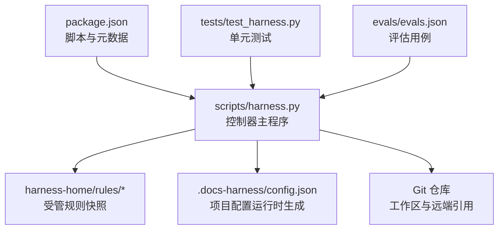
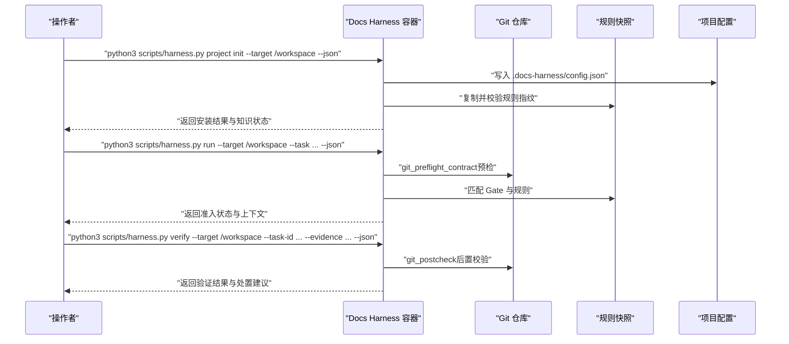
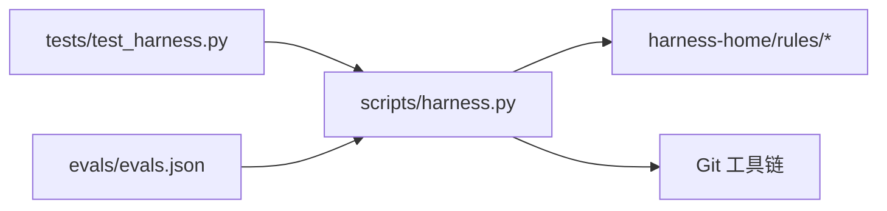

# 容器化部署

<cite>
**本文引用的文件**   
- [package.json](file://package.json)
- [scripts/harness.py](file://scripts/harness.py)
- [tests/test_harness.py](file://tests/test_harness.py)
- [SKILL.md](file://SKILL.md)
- [docs/architecture.md](file://docs/architecture.md)
- [harness-home/rules/INDEX.md](file://harness-home/rules/INDEX.md)
- [harness-home/rules/external-input-security.md](file://harness-home/rules/external-input-security.md)
- [harness-home/rules/api-compatibility.md](file://harness-home/rules/api-compatibility.md)
- [evals/evals.json](file://evals/evals.json)
</cite>

## 目录
1. [简介](#简介)
2. [项目结构](#项目结构)
3. [核心组件](#核心组件)
4. [架构总览](#架构总览)
5. [详细组件分析](#详细组件分析)
6. [依赖关系分析](#依赖关系分析)
7. [性能考虑](#性能考虑)
8. [故障排查指南](#故障排查指南)
9. [结论](#结论)
10. [附录](#附录)

## 简介
本文件面向 Docs Harness 的容器化与编排部署，覆盖以下主题：
- Docker 镜像构建流程（多阶段构建、基础镜像选择、依赖管理）
- 容器编排配置（Docker Compose、环境变量注入、服务依赖）
- 容器运行时配置（资源限制、网络、存储卷挂载）
- 生产环境最佳实践（安全加固、日志收集、监控集成）
- 完整的 Dockerfile 示例与编排配置文件模板

Docs Harness 是一个以 Python 为核心的独立控制器，通过 CLI 提供任务准入、上下文装配、验收与后台治理等能力。其运行依赖 Git 工具链与 Python 解释器，且对规则集与项目配置有严格校验。

**章节来源**
- [docs/architecture.md:1-26](file://docs/architecture.md#L1-L26)
- [SKILL.md:1-105](file://SKILL.md#L1-L105)

## 项目结构
- scripts/harness.py：控制器主程序，包含版本常量、CLI 入口、Git 预检查/后检查、知识生命周期、后台 Job 状态机等核心逻辑。
- harness-home/rules/*：受管规则快照，安装时复制到目标项目的 .docs-harness/harness-home/rules/，并在配置中记录指纹。
- package.json：包元数据与脚本入口（测试、自检、打包检查）。
- tests/test_harness.py：单元测试，覆盖 CLI 调用、Git 行为、规则激活、验收流程等。
- evals/evals.json：评估用例集合，描述关键场景的预期行为。
- docs/*：架构、契约、测试策略等文档。

**图表来源**
- [scripts/harness.py:1-100](file://scripts/harness.py#L1-L100)
- [harness-home/rules/INDEX.md:1-41](file://harness-home/rules/INDEX.md#L1-L41)
- [package.json:1-23](file://package.json#L1-L23)
- [tests/test_harness.py:1-120](file://tests/test_harness.py#L1-L120)
- [evals/evals.json:1-175](file://evals/evals.json#L1-L175)

**章节来源**
- [docs/architecture.md:1-26](file://docs/architecture.md#L1-L26)
- [package.json:1-23](file://package.json#L1-L23)
- [harness-home/rules/INDEX.md:1-41](file://harness-home/rules/INDEX.md#L1-L41)

## 核心组件
- 控制器主程序（scripts/harness.py）
  - 版本与常量定义（VERSION、各类 SCHEMA 常量）
  - Git 前置检查与后置校验（git_preflight_contract、git_postcheck）
  - 项目配置读取与校验（project_config、verification.* 字段）
  - 规则加载与指纹校验（rules_root、指纹一致性）
  - 后台 Job 状态机与进度管理（prepare、dispatch、progress、verify、retry）
- 规则系统（harness-home/rules/*）
  - 规则索引与激活条件（status、rule_id、content_fingerprint）
  - Gate 映射与安全底线（security-sensitive、destructive-data、release-external）
- 测试与评估（tests/test_harness.py、evals/evals.json）
  - CLI 调用封装、子进程执行、JSON 输出解析
  - 场景断言与预期行为对照

**章节来源**
- [scripts/harness.py:1-100](file://scripts/harness.py#L1-L100)
- [scripts/harness.py:1154-1212](file://scripts/harness.py#L1154-L1212)
- [scripts/harness.py:1279-1308](file://scripts/harness.py#L1279-L1308)
- [harness-home/rules/INDEX.md:1-41](file://harness-home/rules/INDEX.md#L1-L41)
- [harness-home/rules/external-input-security.md:1-29](file://harness-home/rules/external-input-security.md#L1-L29)
- [harness-home/rules/api-compatibility.md:1-29](file://harness-home/rules/api-compatibility.md#L1-L29)
- [tests/test_harness.py:1-120](file://tests/test_harness.py#L1-L120)
- [evals/evals.json:1-175](file://evals/evals.json#L1-L175)

## 架构总览
Docs Harness 在容器中作为无状态 CLI 控制器运行，依赖宿主提供的 Git 仓库与 Python 环境。典型交互包括：
- 项目初始化与升级（project init/upgrade）
- 任务准入与上下文装配（run、context）
- 证据验证与完成（verify）
- 后台治理（background prepare/dispatch/progress/verify/retry）

**图表来源**
- [scripts/harness.py:677-791](file://scripts/harness.py#L677-L791)
- [scripts/harness.py:793-800](file://scripts/harness.py#L793-L800)
- [harness-home/rules/INDEX.md:1-41](file://harness-home/rules/INDEX.md#L1-L41)
- [tests/test_harness.py:59-87](file://tests/test_harness.py#L59-L87)

## 详细组件分析

### 镜像构建与多阶段优化
- 基础镜像选择
  - 使用官方 Python 镜像（如 python:3.x-slim），仅包含运行时所需组件，减小体积。
  - 若需 Git 命令，可在构建阶段安装 git 并在最终镜像中保留最小依赖；或采用双阶段构建将构建期依赖与运行期镜像分离。
- 多阶段构建建议
  - 构建阶段：安装依赖、执行静态检查与测试（可选）、准备只读规则快照。
  - 运行阶段：仅拷贝必要文件（scripts/harness.py、harness-home/rules/*、package.json 元数据），设置非 root 用户运行。
- 依赖管理
  - 控制器为单文件 Python 脚本，无外部 Python 包依赖；确保镜像内 Python 版本与脚本兼容。
  - 如需扩展功能（例如 LFS、Submodule），应在构建阶段按需安装对应工具。

[本节为通用指导，不直接分析具体文件]

### 环境变量注入与服务依赖
- 环境变量
  - 控制器通过 Python 标准库访问环境变量，无需额外 SDK。常见用途：
    - 调试开关（如禁用字节码生成 PYTHONDONTWRITEBYTECODE=1）
    - 超时与重试参数（由调用方传入 CLI 参数，而非环境变量）
- 服务依赖
  - 强依赖：Git（必须可用，用于 pre/post check、ref 快照、diff 计算）
  - 弱依赖：Git LFS、Submodule（不可用时会在预检查中报告阻断）
- 编排建议
  - 在 Docker Compose 中将 Git 仓库路径挂载到容器内固定路径（如 /workspace），并通过环境变量传递必要的认证信息（如 SSH_KEY、GIT_ASKPASS 等）。

**章节来源**
- [tests/test_harness.py:59-87](file://tests/test_harness.py#L59-L87)
- [scripts/harness.py:572-583](file://scripts/harness.py#L572-L583)
- [scripts/harness.py:722-731](file://scripts/harness.py#L722-L731)

### 容器运行时配置
- 资源限制
  - 为容器设置 CPU/内存上限，避免长时间运行的背景任务耗尽宿主资源。
  - 针对 verify 与 background 任务，可设置更严格的超时与重试策略。
- 网络配置
  - 控制器本身不暴露端口，通常以一次性任务方式运行；如需持久化服务，应通过反向代理或 API 网关封装。
- 存储卷挂载
  - 工作区卷：/workspace（指向 Git 仓库根）
  - 规则快照：/rules（只读挂载 harness-home/rules/*）
  - 日志卷：/logs（集中收集 stdout/stderr 与结构化日志）
  - 缓存卷：/cache（可选，用于验证命令缓存 verification.command_cache_enabled）

**章节来源**
- [scripts/harness.py:1178-1212](file://scripts/harness.py#L1178-L1212)
- [scripts/harness.py:1279-1308](file://scripts/harness.py#L1279-L1308)

### 生产环境最佳实践
- 安全加固
  - 以非 root 用户运行容器，最小权限原则。
  - 规则指纹校验失败时失败关闭，禁止静默降级。
  - 敏感信息（密钥、Token）通过环境变量或密钥管理服务注入，避免进入镜像层。
- 日志收集
  - 统一输出 JSON 格式日志至 /logs，便于集中采集与检索。
  - 区分 stdout 与 stderr，错误路径优先告警。
- 监控集成
  - 暴露健康检查端点（如 /healthz）或通过 CLI 自检（self-test）返回状态。
  - 指标上报：任务耗时、验证通过率、Git 预检失败率等。

**章节来源**
- [harness-home/rules/INDEX.md:1-41](file://harness-home/rules/INDEX.md#L1-L41)
- [SKILL.md:1-105](file://SKILL.md#L1-L105)

### Dockerfile 示例（模板）
- 构建阶段
  - 安装 Git、Python 及必要工具
  - 复制源码与规则快照
  - 执行静态检查与测试（可选）
- 运行阶段
  - 仅拷贝必要文件
  - 创建非 root 用户
  - 设置工作目录与默认命令

[本节为通用模板说明，不直接展示代码内容]

### Docker Compose 模板（模板）
- 服务定义
  - docs-harness：控制器服务，挂载工作区、规则快照、日志与缓存卷
  - 可选：git-proxy（代理 Git 访问，处理认证）
- 环境变量
  - GIT_SSH_COMMAND、GIT_ASKPASS、SSH_KEY 等
  - 调试开关：PYTHONDONTWRITEBYTECODE=1
- 依赖管理
  - depends_on 声明 Git 可达性
  - healthcheck 检查 Git 连通性与控制器自检

[本节为通用模板说明，不直接展示代码内容]

## 依赖关系分析
- 内部依赖
  - scripts/harness.py 依赖 harness-home/rules/* 的规则快照与指纹校验
  - tests/test_harness.py 依赖 scripts/harness.py 的 CLI 接口与 Git 行为
  - evals/evals.json 描述关键场景的预期行为，用于回归验证
- 外部依赖
  - Git（必需）、Git LFS（可选）、Submodule（可选）
  - Python 解释器（运行时）

**图表来源**
- [scripts/harness.py:1-100](file://scripts/harness.py#L1-L100)
- [harness-home/rules/INDEX.md:1-41](file://harness-home/rules/INDEX.md#L1-L41)
- [tests/test_harness.py:1-120](file://tests/test_harness.py#L1-L120)
- [evals/evals.json:1-175](file://evals/evals.json#L1-L175)

**章节来源**
- [scripts/harness.py:1-100](file://scripts/harness.py#L1-L100)
- [harness-home/rules/INDEX.md:1-41](file://harness-home/rules/INDEX.md#L1-L41)
- [tests/test_harness.py:1-120](file://tests/test_harness.py#L1-L120)
- [evals/evals.json:1-175](file://evals/evals.json#L1-L175)

## 性能考虑
- 构建优化
  - 多阶段构建减少镜像体积
  - 分层缓存利用（依赖层与源码层分离）
- 运行时优化
  - 验证命令缓存（verification.command_cache_enabled）减少重复执行
  - 合理设置超时与重试，避免长时间阻塞
- 资源隔离
  - 容器级 CPU/内存限制
  - 磁盘 I/O 限流（必要时）

[本节为通用指导，不直接分析具体文件]

## 故障排查指南
- 常见问题
  - Git 不可用或版本过低：检查容器内 Git 安装与 PATH
  - Git LFS/Submodule 不可用：预检查会报告阻断，需安装相应工具
  - 规则指纹不一致：失败关闭，需重新安装或升级规则快照
  - 项目配置无效：verification.* 字段校验失败，检查 config.json
- 诊断步骤
  - 使用 self-test 进行控制器自检
  - 查看 stdout/stderr 与 /logs 中的结构化日志
  - 复现问题并启用调试模式（如增加日志级别）

**章节来源**
- [scripts/harness.py:572-583](file://scripts/harness.py#L572-L583)
- [scripts/harness.py:1178-1212](file://scripts/harness.py#L1178-L1212)
- [tests/test_harness.py:339-354](file://tests/test_harness.py#L339-L354)

## 结论
Docs Harness 的容器化部署应以最小化镜像、严格的安全策略与可靠的编排为核心。通过多阶段构建、环境变量注入、资源限制与日志监控，可实现稳定、可观测的生产环境。遵循本文档的最佳实践，可有效降低运维复杂度并提升交付质量。

[本节为总结，不直接分析具体文件]

## 附录
- 参考文件
  - [package.json](file://package.json)
  - [scripts/harness.py](file://scripts/harness.py)
  - [tests/test_harness.py](file://tests/test_harness.py)
  - [SKILL.md](file://SKILL.md)
  - [docs/architecture.md](file://docs/architecture.md)
  - [harness-home/rules/INDEX.md](file://harness-home/rules/INDEX.md)
  - [harness-home/rules/external-input-security.md](file://harness-home/rules/external-input-security.md)
  - [harness-home/rules/api-compatibility.md](file://harness-home/rules/api-compatibility.md)
  - [evals/evals.json](file://evals/evals.json)

[本节为索引，不直接分析具体文件]