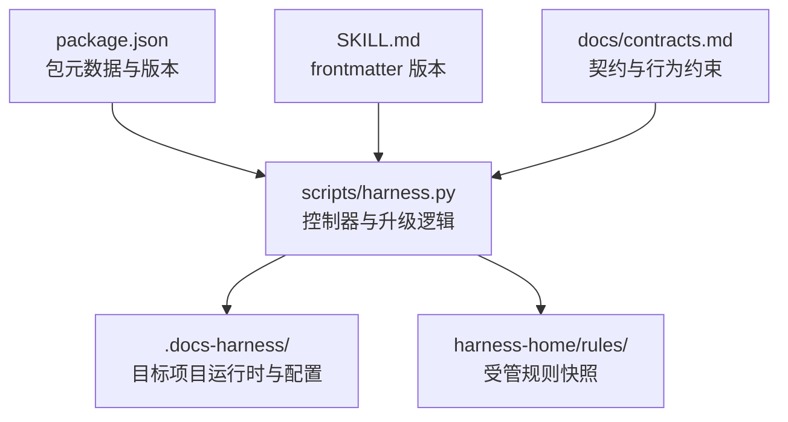
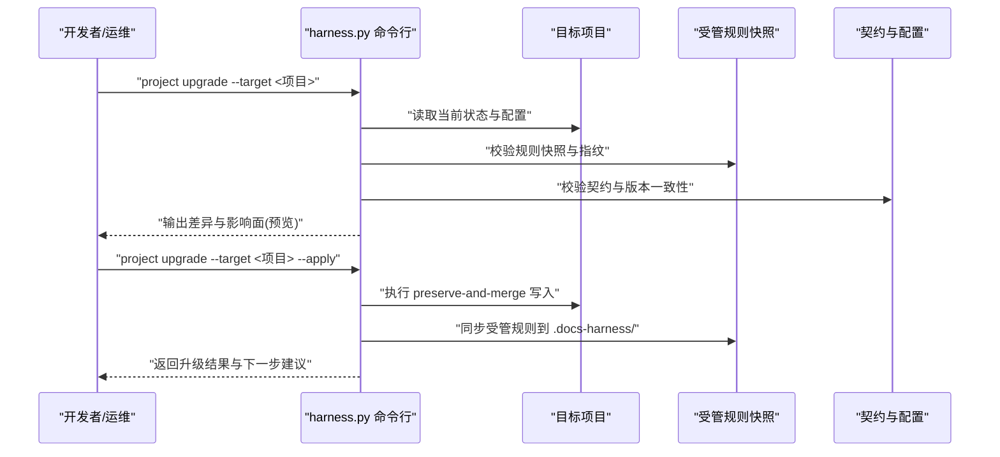
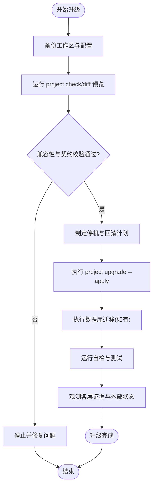
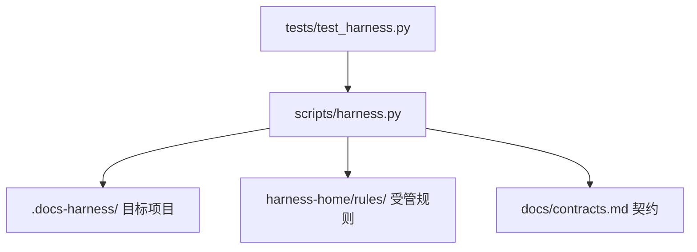

# 版本升级

<cite>
**本文引用的文件**   
- [scripts/harness.py](file://scripts/harness.py)
- [package.json](file://package.json)
- [SKILL.md](file://SKILL.md)
- [docs/contracts.md](file://docs/contracts.md)
- [harness-home/rules/INDEX.md](file://harness-home/rules/INDEX.md)
- [harness-home/rules/api-compatibility.md](file://harness-home/rules/api-compatibility.md)
- [harness-home/rules/release-authorization-rollback.md](file://harness-home/rules/release-authorization-rollback.md)
- [harness-home/rules/testing-release.md](file://harness-home/rules/testing-release.md)
- [tests/test_harness.py](file://tests/test_harness.py)
</cite>

## 目录
1. [简介](#简介)
2. [项目结构](#项目结构)
3. [核心组件](#核心组件)
4. [架构总览](#架构总览)
5. [详细组件分析](#详细组件分析)
6. [依赖关系分析](#依赖关系分析)
7. [性能考虑](#性能考虑)
8. [故障排查指南](#故障排查指南)
9. [结论](#结论)
10. [附录](#附录)

## 简介
本文件为 Docs Harness 的版本升级文档，面向发布与运维人员，覆盖版本号管理、变更日志维护、向后兼容性保证、升级前准备、升级执行步骤、回滚策略与故障恢复、完整检查清单以及常见问题解决方案。内容基于仓库内控制器源码、合同与规则定义，确保可操作且可审计。

## 项目结构
Docs Harness 的升级能力由独立控制器脚本提供，并通过项目安装生命周期命令完成目标项目的初始化与升级。关键要点：
- 控制器真源位于 scripts/harness.py，负责项目安装与升级、任务准入、上下文、验收、知识生命周期和后台 Job 状态机。
- 受管规则快照位于 harness-home/rules/，在 project init 与 project upgrade --apply 时同步到目标项目的 .docs-harness/harness-home/rules/。
- 版本信息在多位置保持一致：package.json、SKILL.md frontmatter、控制器常量 VERSION。
- 升级采用 preserve-and-merge 策略，仅同步明确拥有的文件或受管区块；归属不明内容失败关闭。

**图表来源** 
- [scripts/harness.py:10470-10560](file://scripts/harness.py#L10470-L10560)
- [docs/architecture.md:1-26](file://docs/architecture.md#L1-L26)

**章节来源**
- [scripts/harness.py:10470-10560](file://scripts/harness.py#L10470-L10560)
- [docs/architecture.md:1-26](file://docs/architecture.md#L1-L26)

## 核心组件
- 版本管理与一致性
  - package.json 中的 version 字段与 SKILL.md frontmatter 的 version、控制器常量 VERSION 必须一致。
  - 升级过程会校验并同步这些版本标记，避免不一致导致的失败关闭。
- 项目安装生命周期
  - 通过 commands.project.action 支持 init、upgrade、uninstall、check、diff、rollback-check。
  - --apply 用于实际写入；--purge-runtime 用于清理运行时状态。
- 规则与契约
  - 受管规则快照需保持 active 且指纹正确；契约定义了 API 兼容性与迁移要求。
- 测试与自检
  - self-test 用于内置合同自检；单元测试覆盖升级路径的关键场景（幂等性、迁移、冲突处理）。

**章节来源**
- [package.json:1-23](file://package.json#L1-L23)
- [SKILL.md:1-106](file://SKILL.md#L1-L106)
- [scripts/harness.py:10470-10560](file://scripts/harness.py#L10470-L10560)
- [harness-home/rules/INDEX.md:1-41](file://harness-home/rules/INDEX.md#L1-L41)
- [docs/contracts.md:1-200](file://docs/contracts.md#L1-L200)
- [tests/test_harness.py:1421-1507](file://tests/test_harness.py#L1421-L1507)

## 架构总览
升级流程围绕“只读预览 + 可选应用”的两阶段模式展开，结合规则与契约进行安全校验与兼容性保障。

**图表来源** 
- [scripts/harness.py:10470-10560](file://scripts/harness.py#L10470-L10560)
- [harness-home/rules/INDEX.md:1-41](file://harness-home/rules/INDEX.md#L1-L41)
- [docs/contracts.md:1-200](file://docs/contracts.md#L1-L200)

## 详细组件分析

### 版本号管理与变更日志维护
- 版本来源与一致性
  - package.json 的 version、SKILL.md frontmatter 的 version、控制器常量 VERSION 必须一致。
  - 升级过程中若发现不一致将触发失败关闭，需先统一版本后再执行升级。
- 变更日志维护
  - 使用 CHANGELOG.md（纳入包的 files）记录版本变更；升级前应更新变更日志以反映新版本特性、修复与破坏性变更。
- 向后兼容性
  - 遵循 docs/contracts.md 的契约约定，公共接口、Schema、协议与持久化结构的变更需满足兼容策略与迁移顺序。
  - 规则 DH-API-COMPATIBILITY 强制说明受影响消费者、迁移顺序与可执行回滚路径。

**章节来源**
- [package.json:1-23](file://package.json#L1-L23)
- [SKILL.md:1-106](file://SKILL.md#L1-L106)
- [scripts/harness.py:1-200](file://scripts/harness.py#L1-L200)
- [docs/contracts.md:1-200](file://docs/contracts.md#L1-L200)
- [harness-home/rules/api-compatibility.md:1-29](file://harness-home/rules/api-compatibility.md#L1-L29)

### 升级前准备工作
- 数据备份
  - 对 Git 仓库与工作区进行快照或提交，确保可回滚。
  - 备份 .docs-harness/config.json 与 docs/knowledge-map.json 等关键配置与知识索引。
- 依赖检查
  - 确认 Python 环境与必要工具可用；验证 Git 远端可达与权限。
  - 检查 harness-home/rules 快照是否完整且指纹正确。
- 兼容性验证
  - 运行 project check 与 diff 预览升级影响面。
  - 依据契约与规则评估 API、Schema、协议与持久化结构的兼容性。

**章节来源**
- [scripts/harness.py:10470-10560](file://scripts/harness.py#L10470-L10560)
- [harness-home/rules/INDEX.md:1-41](file://harness-home/rules/INDEX.md#L1-L41)
- [docs/contracts.md:1-200](file://docs/contracts.md#L1-L200)

### 升级执行步骤
- 服务停机计划
  - 对于涉及外部交付或远端状态的变更，应提前规划停机窗口与观测期。
  - 依据 release-authorization-rollback 规则冻结外部目标、产物身份、授权范围、发布步骤与回滚路径。
- 数据库迁移脚本执行
  - 若存在 Schema 或持久化结构变更，按契约要求准备可执行迁移与回滚脚本，并在升级前后分别验证。
- 配置更新
  - 使用 project upgrade --apply 执行 preserve-and-merge，仅同步受管文件与区块；非法路由或缺少路由合同的在途治理 Job 返回 needs_manual_migration，不覆盖真源配置或旧 Job scope。
- 验证与观测
  - 运行 self-test 与单元测试，确保契约与规则生效。
  - 观察构建、本地验证、Git HEAD/远端、fresh clone、发布产物与 UI 各层证据。

**图表来源** 
- [scripts/harness.py:10470-10560](file://scripts/harness.py#L10470-L10560)
- [harness-home/rules/release-authorization-rollback.md:1-29](file://harness-home/rules/release-authorization-rollback.md#L1-L29)
- [docs/contracts.md:1-200](file://docs/contracts.md#L1-L200)

**章节来源**
- [scripts/harness.py:10470-10560](file://scripts/harness.py#L10470-L10560)
- [harness-home/rules/release-authorization-rollback.md:1-29](file://harness-home/rules/release-authorization-rollback.md#L1-L29)
- [docs/contracts.md:1-200](file://docs/contracts.md#L1-L200)

### 回滚策略与故障恢复
- 快速回滚命令
  - 使用 project rollback-check 检查回滚可行性；必要时回退 Git 提交与配置文件至升级前状态。
- 状态恢复方法
  - 恢复 .docs-harness/config.json 与 docs/knowledge-map.json 等关键配置。
  - 重新执行 project upgrade --apply 以修复受管文件与规则快照。
- 失败处理
  - 授权不新鲜、目标不明确、产物无法唯一识别或不可回滚时，停止在外部写入之前。
  - 规则 DH-TESTING-RELEASE 要求记录实际执行命令、退出码、覆盖范围与失败项，不得宣称未完成闭环。

**章节来源**
- [scripts/harness.py:10470-10560](file://scripts/harness.py#L10470-L10560)
- [harness-home/rules/release-authorization-rollback.md:1-29](file://harness-home/rules/release-authorization-rollback.md#L1-L29)
- [harness-home/rules/testing-release.md:1-29](file://harness-home/rules/testing-release.md#L1-L29)

### 升级检查清单
- 版本一致性
  - 确认 package.json、SKILL.md frontmatter、控制器常量 VERSION 一致。
- 规则与契约
  - 校验 harness-home/rules 快照完整且指纹正确；契约要求的兼容策略与迁移顺序已落实。
- 备份与依赖
  - 工作区与关键配置已备份；Python/Git 环境就绪。
- 预览与验证
  - project check/diff 无阻断性问题；self-test 与单元测试通过。
- 停机与回滚
  - 停机窗口与回滚路径已冻结；外部状态与产物身份可唯一识别。
- 迁移与观测
  - 数据库迁移脚本可执行且具备回滚方案；各层证据与外部状态观测正常。

**章节来源**
- [package.json:1-23](file://package.json#L1-L23)
- [SKILL.md:1-106](file://SKILL.md#L1-L106)
- [scripts/harness.py:10470-10560](file://scripts/harness.py#L10470-L10560)
- [harness-home/rules/INDEX.md:1-41](file://harness-home/rules/INDEX.md#L1-L41)
- [docs/contracts.md:1-200](file://docs/contracts.md#L1-L200)

### 常见问题解决方案
- 版本不一致导致失败关闭
  - 统一 package.json、SKILL.md frontmatter、控制器常量 VERSION 后重试。
- 规则快照缺失或指纹漂移
  - 重新安装或升级受管规则快照，确保 active 规则与指纹正确。
- 兼容性问题未闭合
  - 依据 DH-API-COMPATIBILITY 补充受影响消费者、迁移顺序与回滚路径，并提供契约验收证据。
- 外部发布不可回滚
  - 依据 DH-RELEASE-AUTHORIZATION-ROLLBACK 冻结外部目标与回滚路径，确保产物身份可唯一识别。
- 测试未运行或证据过期
  - 依据 DH-TESTING-RELEASE 记录实际执行命令、退出码与覆盖范围，补齐失败项。

**章节来源**
- [package.json:1-23](file://package.json#L1-L23)
- [SKILL.md:1-106](file://SKILL.md#L1-L106)
- [harness-home/rules/api-compatibility.md:1-29](file://harness-home/rules/api-compatibility.md#L1-L29)
- [harness-home/rules/release-authorization-rollback.md:1-29](file://harness-home/rules/release-authorization-rollback.md#L1-L29)
- [harness-home/rules/testing-release.md:1-29](file://harness-home/rules/testing-release.md#L1-L29)

## 依赖关系分析
- 控制器与目标项目
  - 控制器读取目标项目状态与配置，执行 preserve-and-merge 写入。
- 规则与契约
  - 受管规则快照与契约共同决定升级行为的边界与安全性。
- 测试与自检
  - 单元测试覆盖升级路径的关键场景，确保幂等性与迁移正确性。

**图表来源** 
- [scripts/harness.py:10470-10560](file://scripts/harness.py#L10470-L10560)
- [harness-home/rules/INDEX.md:1-41](file://harness-home/rules/INDEX.md#L1-L41)
- [docs/contracts.md:1-200](file://docs/contracts.md#L1-L200)
- [tests/test_harness.py:1421-1507](file://tests/test_harness.py#L1421-L1507)

**章节来源**
- [scripts/harness.py:10470-10560](file://scripts/harness.py#L10470-L10560)
- [harness-home/rules/INDEX.md:1-41](file://harness-home/rules/INDEX.md#L1-L41)
- [docs/contracts.md:1-200](file://docs/contracts.md#L1-L200)
- [tests/test_harness.py:1421-1507](file://tests/test_harness.py#L1421-L1507)

## 性能考虑
- 升级过程应避免重复写入与不必要的重计算，利用幂等性与增量更新提升效率。
- 规则与契约校验应在早期阶段完成，减少后续写入成本。
- 对外部系统与远端的访问应控制频率与超时，避免阻塞升级流程。

## 故障排查指南
- 查看升级预览与差异
  - 使用 project check 与 diff 获取影响面与潜在问题。
- 检查规则与契约
  - 确认 harness-home/rules 快照完整且指纹正确；契约要求的兼容策略与迁移顺序已落实。
- 验证测试与自检
  - 运行 self-test 与单元测试，定位失败原因。
- 外部状态与回滚
  - 依据 DH-RELEASE-AUTHORIZATION-ROLLBACK 检查外部目标与回滚路径；必要时执行回滚检查与恢复。

**章节来源**
- [scripts/harness.py:10470-10560](file://scripts/harness.py#L10470-L10560)
- [harness-home/rules/release-authorization-rollback.md:1-29](file://harness-home/rules/release-authorization-rollback.md#L1-L29)
- [docs/contracts.md:1-200](file://docs/contracts.md#L1-L200)

## 结论
Docs Harness 的版本升级以控制器为核心，结合受管规则与契约实现安全、可审计与可回滚的升级流程。通过严格的版本一致性校验、兼容性保证与完整的检查清单，确保升级过程稳定可靠。建议在每次升级前充分准备与验证，遇到问题及时回滚并修复。

## 附录
- 常用命令参考
  - project init/upgrade/check/diff/rollback-check
  - self-test
  - background/list/status/prepare/dispatch/progress/verify/retry（如适用）

**章节来源**
- [scripts/harness.py:10470-10560](file://scripts/harness.py#L10470-L10560)
- [SKILL.md:1-106](file://SKILL.md#L1-L106)