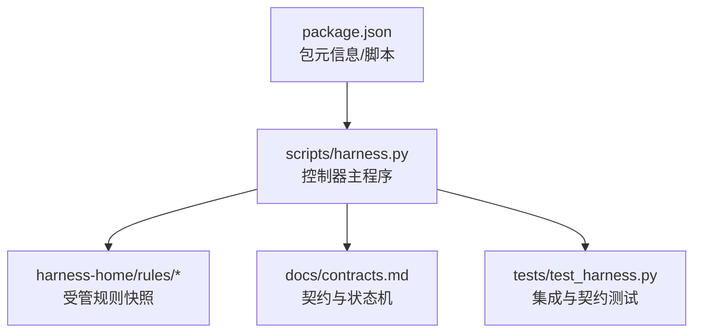
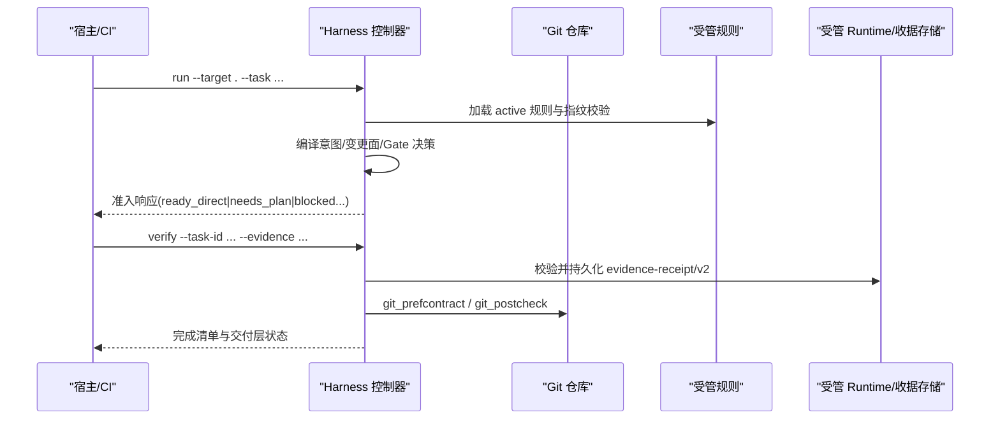
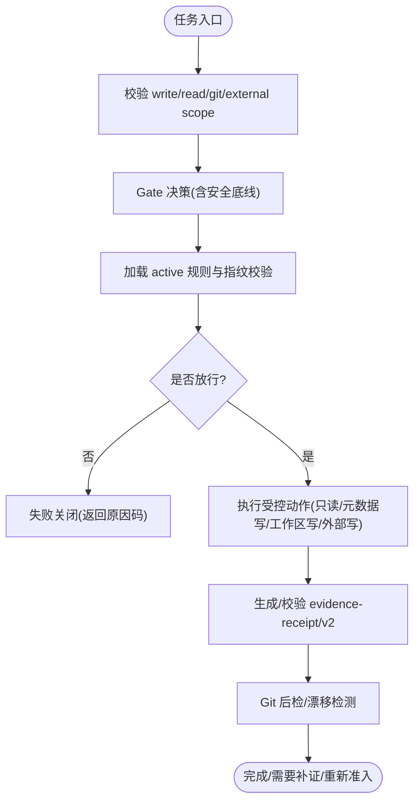
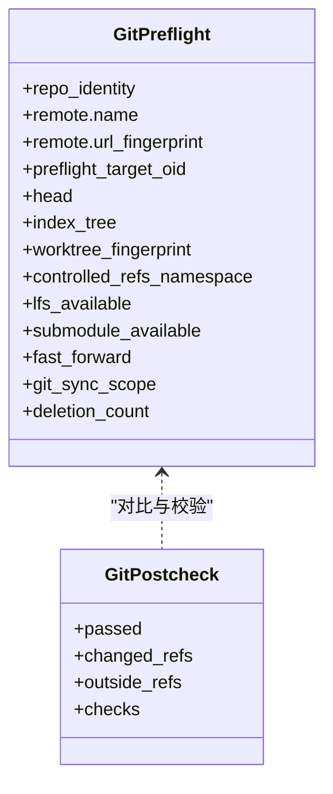
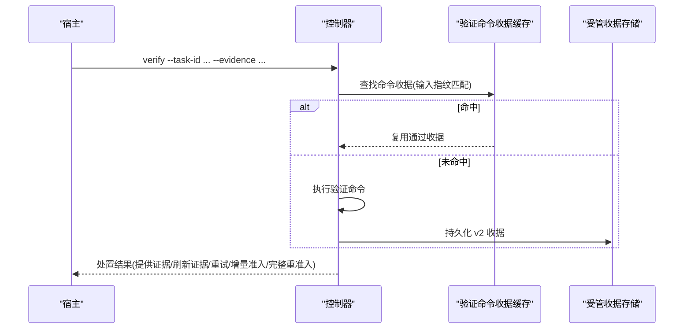
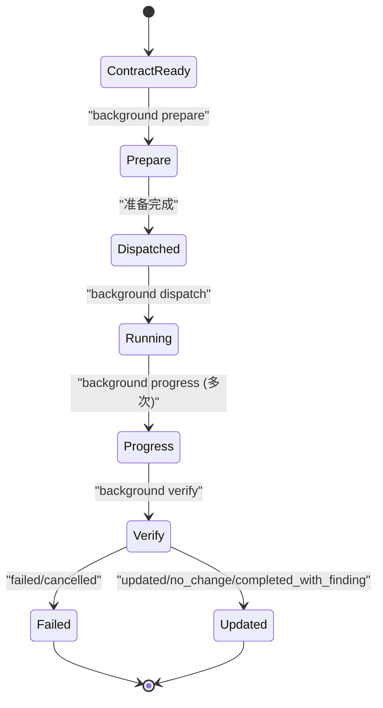
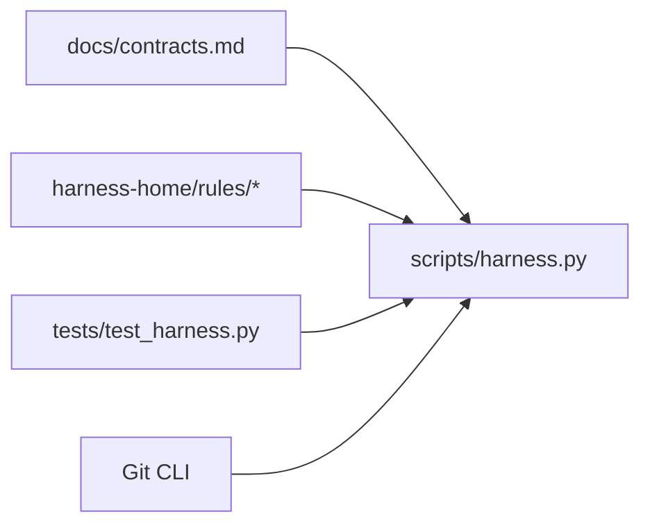
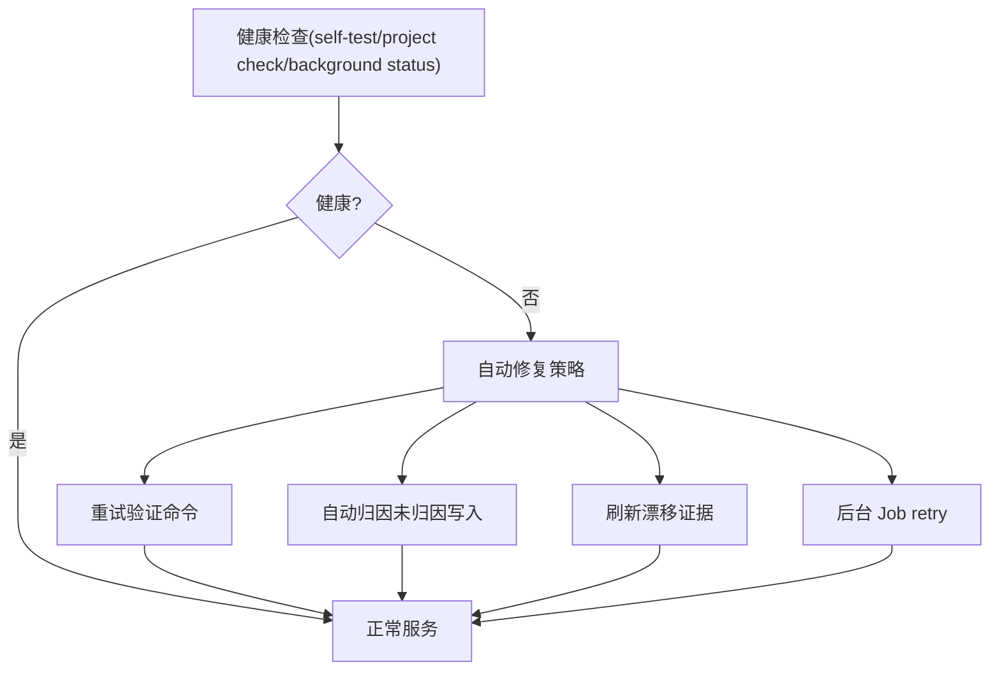

# 生产环境最佳实践

<cite>
**本文引用的文件**
- [scripts/harness.py](file://scripts/harness.py)
- [docs/contracts.md](file://docs/contracts.md)
- [harness-home/rules/INDEX.md](file://harness-home/rules/INDEX.md)
- [harness-home/rules/external-input-security.md](file://harness-home/rules/external-input-security.md)
- [harness-home/rules/api-compatibility.md](file://harness-home/rules/api-compatibility.md)
- [tests/test_harness.py](file://tests/test_harness.py)
- [package.json](file://package.json)
- [SKILL.md](file://SKILL.md)
</cite>

## 目录
1. [简介](#简介)
2. [项目结构](#项目结构)
3. [核心组件](#核心组件)
4. [架构总览](#架构总览)
5. [详细组件分析](#详细组件分析)
6. [依赖关系分析](#依赖关系分析)
7. [性能调优策略](#性能调优策略)
8. [容量规划与扩展](#容量规划与扩展)
9. [监控与告警](#监控与告警)
10. [健康检查与故障自愈](#健康检查与故障自愈)
11. [安全加固指南](#安全加固指南)
12. [故障排查指南](#故障排查指南)
13. [结论](#结论)

## 简介
本文件面向生产环境的 Docs Harness 部署与运维，聚焦以下目标：
- 安全加固：访问控制、网络安全、数据加密与最小权限原则落地。
- 性能调优：内存优化、并发控制、缓存配置与命令执行优化。
- 容量规划：资源评估、水平/垂直扩展策略与负载均衡配置建议。
- 监控告警：关键指标采集、日志聚合与异常通知。
- 健康检查与自愈：端点设计与自动恢复机制。

Docs Harness 是一个独立的任务控制器，负责任务准入、风险 Gate、范围与上下文管理、证据与验收、后台治理以及 Git 交付检查。其运行态与规则集通过受管目录与版本化合同进行约束，确保可审计、可回滚与失败关闭的强一致性。

**章节来源**
- [SKILL.md:1-106](file://SKILL.md#L1-L106)
- [docs/contracts.md:1-372](file://docs/contracts.md#L1-L372)

## 项目结构
- scripts/harness.py：控制器主程序，实现 CLI、状态机、Git 预检/后检、证据与收据处理、后台 Job 流程等。
- harness-home/rules/*：发布包内受管规则快照，包含 API 兼容、外部输入安全、UI 完整状态、测试发布、授权回滚、文档变更、范围变更重准入、Windows PowerShell 兼容性等。
- docs/contracts.md：对外行为与数据结构契约（task-package/v2、evidence-receipt/v2、Git 状态合同、退出码等）。
- tests/test_harness.py：覆盖安装、Git fetch/sync、意图路由、证据与收据、规则激活与自检等关键路径。
- package.json：包元信息与脚本入口（self-test、pack:check 等）。

**图表来源**
- [scripts/harness.py:1-800](file://scripts/harness.py#L1-L800)
- [docs/contracts.md:1-372](file://docs/contracts.md#L1-L372)
- [harness-home/rules/INDEX.md:1-41](file://harness-home/rules/INDEX.md#L1-L41)
- [tests/test_harness.py:1-800](file://tests/test_harness.py#L1-L800)
- [package.json:1-23](file://package.json#L1-L23)

**章节来源**
- [scripts/harness.py:1-800](file://scripts/harness.py#L1-L800)
- [docs/contracts.md:1-372](file://docs/contracts.md#L1-L372)
- [harness-home/rules/INDEX.md:1-41](file://harness-home/rules/INDEX.md#L1-L41)
- [tests/test_harness.py:1-800](file://tests/test_harness.py#L1-L800)
- [package.json:1-23](file://package.json#L1-L23)

## 核心组件
- 任务准入与意图路由：基于 task-package/v2 定义意图、变更面与允许动作；按最高变更面与 Gate 决定路线（direct/planned/extended）。
- 证据与收据：evidence-receipt/v2 绑定任务、目标、包指纹、可信生产者与 TTL；验证命令收据支持缓存复用。
- Git 状态合同：git_fetch/git_sync 预检/后检，锁定 ref、工作区与索引指纹，漂移与分歧失败关闭。
- 后台治理：background-job/v2 三路线（direct/goal/goal_phased），prepare/dispatched/running/progress/verify 严格状态机。
- 规则与 Gate：active 规则快照与内容指纹校验；Gate 包括产品、架构、安全、数据破坏、发布、前端设计、诊断修复、测试验收、审查审计、代码编辑、文档编辑。
- 错误与退出码：结构化错误码与退出码约定，保证失败关闭与可观测性。

**章节来源**
- [docs/contracts.md:1-372](file://docs/contracts.md#L1-L372)
- [scripts/harness.py:1-800](file://scripts/harness.py#L1-L800)
- [harness-home/rules/INDEX.md:1-41](file://harness-home/rules/INDEX.md#L1-L41)

## 架构总览
Docs Harness 作为独立控制器，围绕“任务—证据—验收—后台治理”的主循环构建，结合 Git 预检/后检与规则 Gate 形成强约束的生产级流水线。

**图表来源**
- [scripts/harness.py:1-800](file://scripts/harness.py#L1-L800)
- [docs/contracts.md:1-372](file://docs/contracts.md#L1-L372)

**章节来源**
- [scripts/harness.py:1-800](file://scripts/harness.py#L1-L800)
- [docs/contracts.md:1-372](file://docs/contracts.md#L1-L372)

## 详细组件分析

### 安全与访问控制
- 最小权限与范围约束：write_scope/read_scope/git_scope/external_scope 精确限定写入与读取范围；自然语言边界不被接受，必须使用路径或 glob。
- Gate 强制底线：security-sensitive、destructive-data、release-external 为安全底线，宿主声明不可豁免，由控制器按精确词表与否定守卫判定。
- 外部输入安全规则：DH-EXTERNAL-INPUT-SECURITY 要求信任边界、最小权限、秘密处理与负向路径证明。
- 规则快照与指纹：active 规则需 status: active、唯一 rule_id、content_fingerprint 正确且合同字段完整，缺失或漂移失败关闭。
- 受管 Runtime 隔离：Runtime、锁、迁移 journal、收据与本地质量账本不进入 Git，避免泄露与篡改。

**图表来源**
- [scripts/harness.py:1-800](file://scripts/harness.py#L1-L800)
- [docs/contracts.md:1-372](file://docs/contracts.md#L1-L372)
- [harness-home/rules/external-input-security.md:1-29](file://harness-home/rules/external-input-security.md#L1-L29)
- [harness-home/rules/INDEX.md:1-41](file://harness-home/rules/INDEX.md#L1-L41)

**章节来源**
- [docs/contracts.md:1-372](file://docs/contracts.md#L1-L372)
- [scripts/harness.py:1-800](file://scripts/harness.py#L1-L800)
- [harness-home/rules/external-input-security.md:1-29](file://harness-home/rules/external-input-security.md#L1-L29)
- [harness-home/rules/INDEX.md:1-41](file://harness-home/rules/INDEX.md#L1-L41)

### 网络与 Git 安全
- 远端 URL 脱敏：计算指纹前移除用户名、密码、token、查询参数与 fragment，Runtime 不保存原文。
- Git 预检/后检：锁定 ref、HEAD、index_tree、worktree_fingerprint；非 fast-forward、脏工作区重叠、危险删除、LFS/Submodule 不可用均失败关闭。
- 漂移与越界：远端漂移触发重新准入；ref 越界、分支分歧阻断执行；origin/HEAD 更新不再误判。

**图表来源**
- [docs/contracts.md:1-372](file://docs/contracts.md#L1-L372)
- [scripts/harness.py:1-800](file://scripts/harness.py#L1-L800)

**章节来源**
- [docs/contracts.md:1-372](file://docs/contracts.md#L1-L372)
- [scripts/harness.py:1-800](file://scripts/harness.py#L1-L800)

### 证据与验收缓存
- evidence-receipt/v2：绑定 task/target/package fingerprint、可信 producer、TTL、exit_code、digests、read/write set。
- 验证命令收据：按 argv、produces、输入指纹绑定；输入不变且上次通过则复用，失败或输入变化重跑；可通过配置整体关闭缓存。
- 自动归因：在 write_scope 内未归因写入时默认代铸 workspace_attribution 收据，可配置开关恢复补证据流程。

**图表来源**
- [docs/contracts.md:1-372](file://docs/contracts.md#L1-L372)
- [scripts/harness.py:1-800](file://scripts/harness.py#L1-L800)

**章节来源**
- [docs/contracts.md:1-372](file://docs/contracts.md#L1-L372)
- [scripts/harness.py:1-800](file://scripts/harness.py#L1-L800)

### 后台治理状态机
- 三路线：background_direct、background_goal、background_goal_phased。
- 标准序列：contract_ready → prepare → dispatched → running → progress → verify → 终态。
- 能力不足：置 queued_manual，不得静默降级；Job 固定 may_mutate_parent=false、may_spawn_child_jobs=false、suppress_post_completion_dispatch=true。

**图表来源**
- [docs/contracts.md:1-372](file://docs/contracts.md#L1-L372)
- [scripts/harness.py:1-800](file://scripts/harness.py#L1-L800)

**章节来源**
- [docs/contracts.md:1-372](file://docs/contracts.md#L1-L372)
- [scripts/harness.py:1-800](file://scripts/harness.py#L1-L800)

## 依赖关系分析
- 控制器对契约与规则的强依赖：所有行为以 contracts.md 为准，规则快照与指纹校验保障一致性。
- Git 工具链：git_command 封装超时与错误映射，pre/post check 贯穿 fetch/sync。
- 测试驱动：tests/test_harness.py 覆盖安装、Git 操作、意图路由、证据与收据、规则激活与自检。

**图表来源**
- [docs/contracts.md:1-372](file://docs/contracts.md#L1-L372)
- [scripts/harness.py:1-800](file://scripts/harness.py#L1-L800)
- [harness-home/rules/INDEX.md:1-41](file://harness-home/rules/INDEX.md#L1-L41)
- [tests/test_harness.py:1-800](file://tests/test_harness.py#L1-L800)

**章节来源**
- [docs/contracts.md:1-372](file://docs/contracts.md#L1-L372)
- [scripts/harness.py:1-800](file://scripts/harness.py#L1-L800)
- [harness-home/rules/INDEX.md:1-41](file://harness-home/rules/INDEX.md#L1-L41)
- [tests/test_harness.py:1-800](file://tests/test_harness.py#L1-L800)

## 性能调优策略
- 内存优化
  - 事件与收据采用 JSONL 追加写入与流式读取，避免一次性加载大文件。
  - 文件指纹计算分块哈希，降低峰值内存占用。
  - 限制输入文件大小与文本长度（如 quality review 最大字节/字符限制），防止 OOM。
- 并发控制
  - Git 命令统一封装并设置超时，避免阻塞。
  - 后台 Job 状态机串行推进，prepare/progress/dispatch/retry/verify 在同一控制锁下重读更新，避免竞态。
- 缓存配置
  - 验证命令收据缓存：输入指纹不变直接复用，减少重复执行；可通过配置整体关闭。
  - 上下文与授权收据跨阶段复用，避免重复加载规则与事实正文。
  - 证据受管副本：原始文件删除不影响已采纳证据，减少 I/O 压力。

[本节为通用指导，不直接分析具体文件]

## 容量规划与扩展
- 资源评估
  - 估算知识工作量与扫描范围（project_wide vs change_scoped），按需选择全仓或变更范围模式，降低 CPU/IO 压力。
  - 限制知识卡数量上限（如 repowiki 模式 200 张），避免过大上下文。
- 扩展策略
  - 垂直扩展：提升单实例 CPU/内存以应对大规模知识 bootstrap 与批量验证。
  - 水平扩展：多实例并行执行不同 target 或 job，注意共享存储与锁一致性。
- 负载均衡
  - CI/CD 队列分发任务至多个 Harness 实例，按 target/feature 分片。
  - 后台 Job 按 attempt 与 work_package 粒度拆分，避免长尾阻塞。

[本节为通用指导，不直接分析具体文件]

## 监控与告警
- 关键指标
  - 任务生命周期：run→context→plan→action→verify 各阶段耗时与成功率。
  - Git 操作：fetch/sync 成功/失败率、漂移次数、非 fast-forward 次数。
  - 证据与收据：验证命令命中率、失败原因分布、自动归因比例。
  - 后台 Job：状态转换频率、重试次数、终态分布。
- 日志聚合
  - 事件文件仅保留有界字段（phase、duration_ms、reason_code、package_revision、cache_hit、load_count、readmission_count、evidence_round_count、host_receipt_count、business_action_count），禁止记录敏感信息。
  - 将 events.jsonl 与 stderr/stdout 摘要接入集中日志系统（如 ELK/Loki）。
- 异常通知
  - 失败关闭场景（blocked/full_readmission/git_remote_drift）触发告警。
  - 规则指纹漂移、active 规则缺失、Git LFS/Submodule 不可用等基础设施问题即时告警。

**章节来源**
- [docs/contracts.md:1-372](file://docs/contracts.md#L1-L372)
- [scripts/harness.py:1-800](file://scripts/harness.py#L1-L800)

## 健康检查与故障自愈
- 健康检查端点
  - self-test：验证规则激活、指纹一致性与基本功能。
  - project check：检查 harness_home、规则完整性与配置有效性。
  - background list/status：后台 Job 健康度与进度。
- 故障自愈
  - 验证命令失败：retry_verification 自动重跑；输入变化才重跑，命中缓存跳过。
  - 证据未归因：auto_attribute_in_scope 开启时自动代铸收据并继续；否则提示 provide_evidence。
  - Git 漂移：refresh_evidence 失效漂移路径证据后重读；合同稳定时仅需增量准入。
  - 后台 Job 失败：retry 归档旧 attempt、推进 attempt、清空准备引用并刷新基线。

**图表来源**
- [tests/test_harness.py:1-800](file://tests/test_harness.py#L1-L800)
- [docs/contracts.md:1-372](file://docs/contracts.md#L1-L372)
- [scripts/harness.py:1-800](file://scripts/harness.py#L1-L800)

**章节来源**
- [tests/test_harness.py:1-800](file://tests/test_harness.py#L1-L800)
- [docs/contracts.md:1-372](file://docs/contracts.md#L1-L372)
- [scripts/harness.py:1-800](file://scripts/harness.py#L1-L800)

## 安全加固指南
- 访问控制
  - 严格限定 write_scope/read_scope/git_scope/external_scope，拒绝自然语言边界。
  - 受管 Runtime 与规则快照纳入版本控制，禁止运行时修改。
- 网络安全
  - 远端 URL 脱敏后再计算指纹，Runtime 不保存明文。
  - Git 预检/后检锁定 ref、HEAD、index、worktree 指纹，漂移与非 fast-forward 失败关闭。
- 数据加密
  - 建议在传输层启用 TLS（CI/Runner 到远程仓库），密钥与令牌通过安全注入而非明文传递。
  - 本地敏感信息（环境变量、凭证）不落盘，仅通过安全通道传入子进程。
- 最小权限
  - 规则与 Gate 强制安全底线；外部输入安全规则要求证明信任边界与负向路径。
  - 后台 Job 业务数据面受限，控制面仅 CLI 写入。

**章节来源**
- [docs/contracts.md:1-372](file://docs/contracts.md#L1-L372)
- [scripts/harness.py:1-800](file://scripts/harness.py#L1-L800)
- [harness-home/rules/external-input-security.md:1-29](file://harness-home/rules/external-input-security.md#L1-L29)
- [harness-home/rules/INDEX.md:1-41](file://harness-home/rules/INDEX.md#L1-L41)

## 故障排查指南
- 常见错误码与退出码
  - 输入/合同/状态无效：退出码 2。
  - 需要方案/证据/迁移/Git 交付：退出码 3。
  - 范围/漂移/Gate/授权/规则变化需重新准入：退出码 4。
- 典型问题定位
  - Git 预检失败：检查 remote、refs、LFS/Submodule、工作区脏状态与 fast-forward。
  - 证据未归因：确认 auto_attribute_in_scope 配置与 write_scope 范围。
  - 规则漂移：核对 active 规则指纹与 INDEX 清单一致性。
  - 后台 Job 卡住：查看 prepare/dispatched/running 状态与工作包进度。

**章节来源**
- [docs/contracts.md:1-372](file://docs/contracts.md#L1-L372)
- [scripts/harness.py:1-800](file://scripts/harness.py#L1-L800)
- [tests/test_harness.py:1-800](file://tests/test_harness.py#L1-L800)

## 结论
Docs Harness 在生产环境中应以“失败关闭、强契约、受管快照、证据可追溯”为核心原则，结合严格的访问控制、网络与数据安全、性能与容量规划、完善的监控与自愈机制，构建高可靠、可审计、可扩展的文档与治理流水线。通过本最佳实践，可在复杂变更与高风险场景中保持可控与可恢复，确保交付质量与安全性。

[本节为总结性内容，不直接分析具体文件]