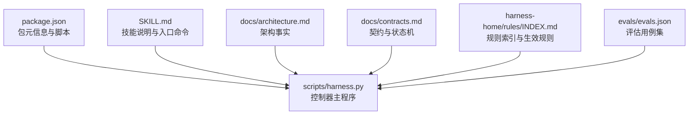
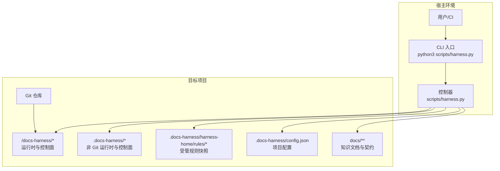
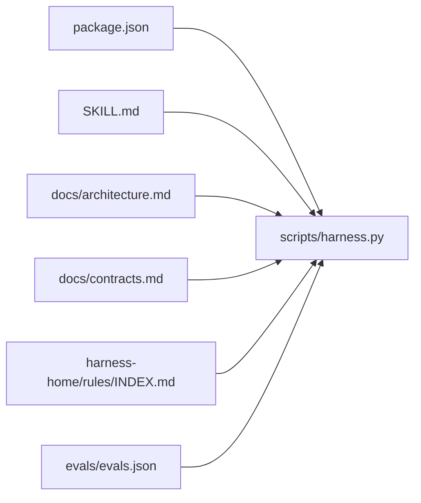

# 部署与运维

<cite>
**本文引用的文件**   
- [package.json](file://package.json)
- [SKILL.md](file://SKILL.md)
- [scripts/harness.py](file://scripts/harness.py)
- [docs/architecture.md](file://docs/architecture.md)
- [docs/contracts.md](file://docs/contracts.md)
- [harness-home/rules/INDEX.md](file://harness-home/rules/INDEX.md)
- [evals/evals.json](file://evals/evals.json)
</cite>

## 目录
1. [简介](#简介)
2. [项目结构](#项目结构)
3. [核心组件](#核心组件)
4. [架构总览](#架构总览)
5. [详细组件分析](#详细组件分析)
6. [依赖关系分析](#依赖关系分析)
7. [性能考虑](#性能考虑)
8. [故障排查指南](#故障排查指南)
9. [结论](#结论)
10. [附录](#附录)

## 简介
本文件面向 Docs Harness 的容器化部署与生产运维，覆盖镜像构建、编排配置、环境变量管理、配置策略、版本升级与回滚、备份恢复、安全加固、性能调优、容量规划以及自动化部署脚本与工具链。内容基于仓库中的控制器源码、合同文档与规则索引进行提炼，确保可落地、可审计、可回滚。

## 项目结构
Docs Harness 以 Python 单文件控制器为核心，配合项目内规则快照与契约文档，提供任务准入、上下文、证据、验收与后台治理等能力。运行时数据按 Git 与非 Git 两种形态落盘到受管目录，不进入工作区或版本控制面。

**图表来源** 
- [package.json:1-23](file://package.json#L1-L23)
- [SKILL.md:1-105](file://SKILL.md#L1-L105)
- [scripts/harness.py:1-120](file://scripts/harness.py#L1-L120)
- [docs/architecture.md:1-26](file://docs/architecture.md#L1-L26)
- [docs/contracts.md:1-60](file://docs/contracts.md#L1-L60)
- [harness-home/rules/INDEX.md:1-41](file://harness-home/rules/INDEX.md#L1-L41)
- [evals/evals.json:1-20](file://evals/evals.json#L1-L20)

**章节来源**
- [package.json:1-23](file://package.json#L1-L23)
- [SKILL.md:1-105](file://SKILL.md#L1-L105)
- [docs/architecture.md:1-26](file://docs/architecture.md#L1-L26)

## 核心组件
- 控制器主程序：负责项目安装与升级、任务准入、上下文与授权、证据与验收、Git 交付检查、后台 Job 状态机与质量账本。
- 契约与规则：定义任务包 Schema、验收层、Git 状态合同、证据收据格式、退出码与运行边界；规则索引声明生效规则与指纹约束。
- 评估用例：覆盖 v2 意图、Git 预检/后检、工作区漂移归因、证据收据、上下文复用、v1→v2 迁移、脱敏事件、后台治理等关键路径。

**章节来源**
- [scripts/harness.py:1-120](file://scripts/harness.py#L1-L120)
- [docs/contracts.md:1-120](file://docs/contracts.md#L1-L120)
- [harness-home/rules/INDEX.md:1-41](file://harness-home/rules/INDEX.md#L1-L41)
- [evals/evals.json:1-175](file://evals/evals.json#L1-L175)

## 架构总览
Docs Harness 以 CLI 为入口，在目标项目的 Git 或非 Git 环境下生成并维护受管 Runtime 目录，所有控制面数据（任务、证据、上下文、Job 工件）均隔离于业务代码之外，保证交付面纯净与可审计。

**图表来源** 
- [scripts/harness.py:1-120](file://scripts/harness.py#L1-L120)
- [docs/architecture.md:1-26](file://docs/architecture.md#L1-L26)
- [docs/contracts.md:350-370](file://docs/contracts.md#L350-L370)
- [harness-home/rules/INDEX.md:1-41](file://harness-home/rules/INDEX.md#L1-L41)

## 详细组件分析

### 容器化部署方案
- 镜像构建要点
  - 基础镜像：选择包含 Python 3.x 的最小镜像，仅安装必要系统依赖（如 git）。
  - 应用打包：将仓库根目录作为只读镜像层，通过 COPY 引入；确保 scripts/harness.py 可执行权限。
  - 版本固化：从 package.json 读取版本号，写入镜像标签与环境变量，便于追踪。
  - 最小化体积：清理缓存、删除无关文件，使用多阶段构建减少最终镜像大小。
- 容器编排配置
  - 资源限制：为 CPU 与内存设置 requests/limits，避免争用与 OOM。
  - 存储卷：挂载目标项目与工作区为只读卷，Runtime 目录映射到持久卷或临时卷（根据是否需跨 Pod 共享）。
  - 网络与安全：仅暴露必要端口（如需 Web UI），默认无对外端口；启用只读根文件系统。
  - 健康检查：通过 CLI 自检命令返回成功码判定就绪。
- 环境变量管理
  - 敏感信息：密钥、令牌通过 Secret 注入，禁止入镜像与日志。
  - 运行时开关：验证命令缓存、自动归因、规则指纹校验等开关由环境变量控制，优先于配置文件。
  - 配置优先级：环境变量 > 项目配置 .docs-harness/config.json > 内置默认值。

**章节来源**
- [package.json:1-23](file://package.json#L1-L23)
- [docs/contracts.md:350-370](file://docs/contracts.md#L350-L370)
- [harness-home/rules/INDEX.md:1-41](file://harness-home/rules/INDEX.md#L1-L41)

### 配置管理策略
- 配置文件结构
  - 项目级配置位于 .docs-harness/config.json，用于验证白名单、volatile_paths、命令缓存开关等。
  - 规则索引位于 harness-home/rules/INDEX.md，声明生效规则与指纹约束。
- 环境变量优先级
  - 环境变量覆盖配置文件与默认值；控制器对敏感字段进行脱敏处理，不在日志中输出。
- 动态配置更新
  - 规则与配置变更触发重新加载；若指纹漂移或非法，控制器失败关闭，保证一致性。
  - 支持 preserve-and-merge 升级流程，仅同步受管区块，避免覆盖用户自定义内容。

**章节来源**
- [docs/contracts.md:190-220](file://docs/contracts.md#L190-L220)
- [harness-home/rules/INDEX.md:1-41](file://harness-home/rules/INDEX.md#L1-L41)
- [docs/architecture.md:1-26](file://docs/architecture.md#L1-L26)

### 版本升级流程
- 向后兼容性
  - v1 任务仅允许只读操作与显式迁移；存在活动 v2 任务时阻断回滚。
  - 契约稳定时支持增量准入与证据复用，减少重复执行成本。
- 数据迁移脚本
  - 迁移过程创建 staging、全对象 backup、manifest 与 journal，中断即回滚；首次 workspace 基线保持不变。
- 回滚策略
  - 回滚前检查活动任务；回滚后 v2 对象只读保留，旧控制器遇到 v2 对象失败关闭。

**章节来源**
- [docs/contracts.md:236-282](file://docs/contracts.md#L236-L282)
- [SKILL.md:20-40](file://SKILL.md#L20-L40)

### 备份与恢复机制
- 工件存储备份
  - 证据与上下文副本保存在受管 artifact store，原始文件删除不影响已采纳证据。
  - 任务 Runtime、后台 Job 工件与质量账本隔离于业务代码，便于独立备份。
- 状态数据恢复
  - 通过冻结清单与指纹校验恢复任务、证据与上下文；损坏工件需显式修复。
- 灾难恢复预案
  - 建议定期快照 Git 仓库与 Runtime 目录；恢复后执行完整性自检与契约校验。

**章节来源**
- [docs/contracts.md:200-220](file://docs/contracts.md#L200-L220)
- [docs/architecture.md:11-19](file://docs/architecture.md#L11-L19)

### 生产环境最佳实践
- 安全加固
  - 只读工作区、最小权限原则、Secret 管理、输入校验与脱敏。
  - 规则指纹校验与契约一致性检查，防止未授权变更。
- 性能调优
  - 启用验证命令缓存与上下文复用，减少重复执行；合理设置超时与并发。
  - 监控事件指标（阶段、耗时、原因码）进行瓶颈定位。
- 容量规划
  - 预估知识库规模与证据数量，预留足够磁盘空间；按任务峰值规划 CPU/内存。

**章节来源**
- [docs/contracts.md:283-302](file://docs/contracts.md#L283-L302)
- [docs/contracts.md:350-370](file://docs/contracts.md#L350-L370)

### 自动化部署脚本与工具链
- 本地测试与自检
  - 使用 package.json 脚本执行单元测试与自测任务，确保环境就绪。
- CI/CD 集成
  - 构建镜像、推送制品、部署到集群；执行契约校验与评估用例集。
- 运维工具链
  - 结合 Git 钩子与 CLI 命令实现门禁、审计与回滚自动化。

**章节来源**
- [package.json:17-21](file://package.json#L17-L21)
- [SKILL.md:14-24](file://SKILL.md#L14-L24)

## 依赖关系分析
Docs Harness 控制器依赖 Git 工具、Python 运行时与项目内规则快照；契约文档与评估用例驱动行为一致性与回归测试。

**图表来源** 
- [package.json:1-23](file://package.json#L1-L23)
- [SKILL.md:1-105](file://SKILL.md#L1-L105)
- [scripts/harness.py:1-120](file://scripts/harness.py#L1-L120)
- [docs/architecture.md:1-26](file://docs/architecture.md#L1-L26)
- [docs/contracts.md:1-60](file://docs/contracts.md#L1-L60)
- [harness-home/rules/INDEX.md:1-41](file://harness-home/rules/INDEX.md#L1-L41)
- [evals/evals.json:1-20](file://evals/evals.json#L1-L20)

**章节来源**
- [scripts/harness.py:1-120](file://scripts/harness.py#L1-L120)
- [docs/contracts.md:1-60](file://docs/contracts.md#L1-L60)

## 性能考虑
- 缓存策略：启用验证命令收据缓存与上下文复用，避免重复执行与加载。
- I/O 优化：只读挂载工作区，减少写放大；Runtime 目录使用高性能存储。
- 并发控制：限制并行任务数，避免资源争用；合理设置超时与重试。
- 监控告警：基于事件指标与退出码建立告警阈值，及时发现异常。

[本节为通用指导，无需特定文件引用]

## 故障排查指南
- 常见错误码
  - 0：成功；verify.result=完成表示父任务完成。
  - 1：项目检查、自检或完整性读取失败。
  - 2：输入、合同、绑定或状态无效。
  - 3：需要方案、授权、证据、迁移、用户输入或 Git 交付。
  - 4：范围、漂移、Gate、远端、授权或规则变化，必须重新准入。
- 排查步骤
  - 检查项目配置与规则指纹是否一致。
  - 查看事件日志与退出码，定位失败阶段。
  - 验证 Git 状态与远端引用，确保 fast-forward 与 LFS/Submodule 可用。
  - 必要时执行迁移或回滚检查，遵循幂等与原子性原则。

**章节来源**
- [docs/contracts.md:359-370](file://docs/contracts.md#L359-L370)
- [SKILL.md:25-40](file://SKILL.md#L25-L40)

## 结论
Docs Harness 以严格的契约与规则保障任务执行的可靠性与可审计性。通过容器化部署、环境变量管理与自动化脚本，可实现安全、高效、可回滚的生产运维。建议结合监控与演练，持续优化性能与容量规划。

[本节为总结性内容，无需特定文件引用]

## 附录
- 快速参考
  - 项目初始化与升级命令见 SKILL.md。
  - 契约与状态机详见 docs/contracts.md。
  - 规则索引与生效规则见 harness-home/rules/INDEX.md。
  - 评估用例覆盖关键路径，可用于回归测试。

**章节来源**
- [SKILL.md:14-24](file://SKILL.md#L14-L24)
- [docs/contracts.md:1-60](file://docs/contracts.md#L1-L60)
- [harness-home/rules/INDEX.md:1-41](file://harness-home/rules/INDEX.md#L1-L41)
- [evals/evals.json:1-175](file://evals/evals.json#L1-L175)