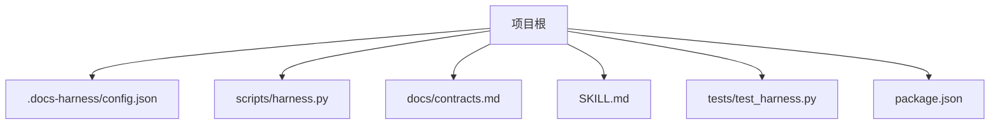
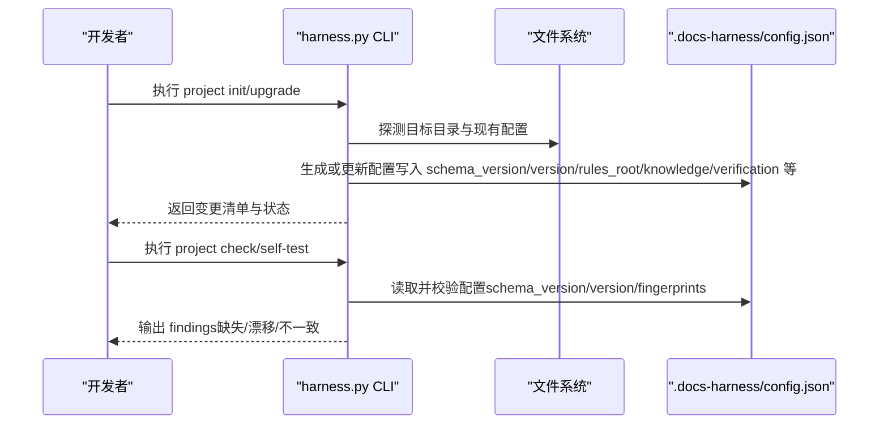
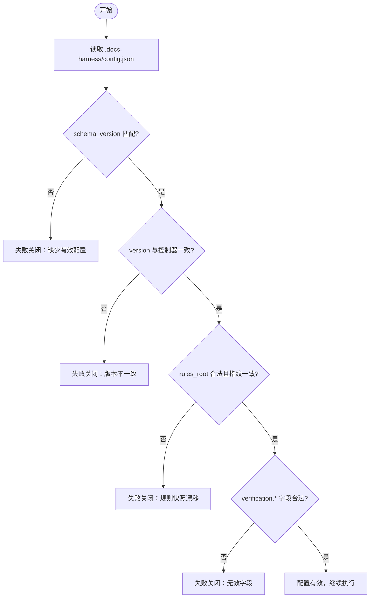
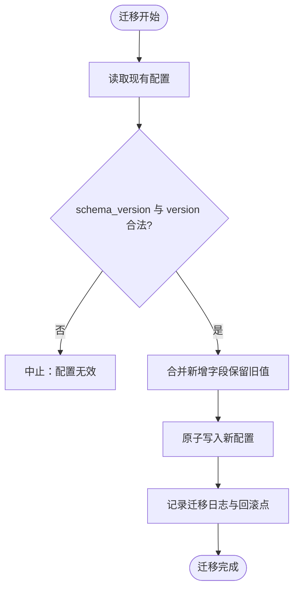
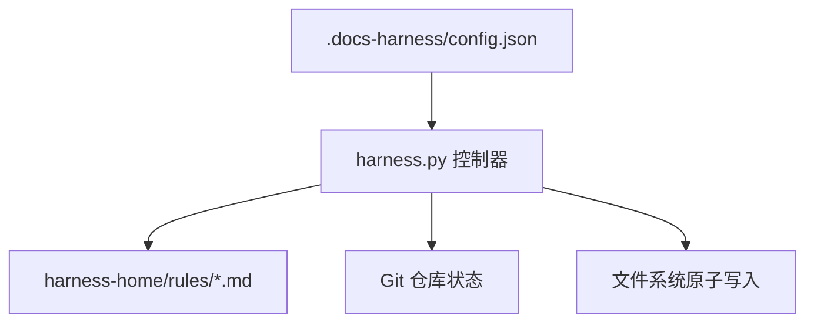

# 配置管理

<cite>
**本文引用的文件**
- [scripts/harness.py](file://scripts/harness.py)
- [docs/contracts.md](file://docs/contracts.md)
- [SKILL.md](file://SKILL.md)
- [tests/test_harness.py](file://tests/test_harness.py)
- [package.json](file://package.json)
</cite>

## 目录
1. [简介](#简介)
2. [项目结构](#项目结构)
3. [核心组件](#核心组件)
4. [架构总览](#架构总览)
5. [详细组件分析](#详细组件分析)
6. [依赖关系分析](#依赖关系分析)
7. [性能考虑](#性能考虑)
8. [故障排查指南](#故障排查指南)
9. [结论](#结论)
10. [附录](#附录)

## 简介
本文件为 Docs Harness 的配置管理文档，聚焦以下目标：
- 配置文件结构与 JSON 规范、字段定义与默认值
- 环境变量管理策略（命名约定、优先级、敏感信息处理）
- 动态配置更新机制（热重载、验证与回滚）
- 不同环境的配置模板（开发、测试、生产）
- 配置文件的版本管理与迁移脚本编写方法

Docs Harness 使用独立控制器脚本运行，项目级配置位于 .docs-harness/config.json，采用 schema docs-harness/project-config/v4。控制器在安装/升级时生成或更新该配置，并在运行时进行严格校验与一致性检查。

## 项目结构
- 控制器入口与核心逻辑：scripts/harness.py
- 合同与行为说明：docs/contracts.md
- 技能使用说明：SKILL.md
- 测试用例覆盖安装与配置行为：tests/test_harness.py
- 包元数据与脚本命令：package.json

**图表来源**
- [scripts/harness.py:9700-9761](file://scripts/harness.py#L9700-L9761)
- [docs/contracts.md:1-10](file://docs/contracts.md#L1-L10)
- [SKILL.md:13-23](file://SKILL.md#L13-L23)
- [tests/test_harness.py:358-376](file://tests/test_harness.py#L358-L376)
- [package.json:17-21](file://package.json#L17-L21)

**章节来源**
- [scripts/harness.py:9700-9761](file://scripts/harness.py#L9700-L9761)
- [docs/contracts.md:1-10](file://docs/contracts.md#L1-L10)
- [SKILL.md:13-23](file://SKILL.md#L13-L23)
- [tests/test_harness.py:358-376](file://tests/test_harness.py#L358-L376)
- [package.json:17-21](file://package.json#L17-L21)

## 核心组件
- 项目配置 Schema：docs-harness/project-config/v4
- 配置路径：.docs-harness/config.json
- 关键配置项：
  - rules_root：规则根目录（相对路径）
  - background_governance：后台治理开关与阈值
  - knowledge：知识库根、映射、目标级别、是否阻塞主流程等
  - verification：验证相关开关与白名单
  - installed_script_fingerprint / installed_rule_fingerprints：安装指纹
  - version / schema_version / installed_at：版本与安装时间

这些字段在初始化/升级时由控制器写入，并在运行时被严格校验。

**章节来源**
- [scripts/harness.py:9718-9747](file://scripts/harness.py#L9718-L9747)
- [scripts/harness.py:2052-2064](file://scripts/harness.py#L2052-L2064)
- [docs/contracts.md:1-10](file://docs/contracts.md#L1-L10)

## 架构总览
配置管理涉及“安装/升级生成”、“运行时读取与校验”、“变更检测与回滚”三个环节。

**图表来源**
- [scripts/harness.py:9700-9761](file://scripts/harness.py#L9700-L9761)
- [scripts/harness.py:9764-9899](file://scripts/harness.py#L9764-L9899)
- [tests/test_harness.py:358-376](file://tests/test_harness.py#L358-L376)

## 详细组件分析

### 配置文件结构与字段定义
- 文件位置：.docs-harness/config.json
- Schema 版本：docs-harness/project-config/v4
- 关键字段与默认值（由安装/升级逻辑生成）：
  - schema_version：固定为 CONFIG_SCHEMA（v4）
  - version：当前控制器版本
  - rules_root：相对路径（如 harness-home/rules）
  - installed_script_fingerprint：脚本文件指纹
  - installed_rule_fingerprints：规则文件指纹集合
  - background_governance.enabled/non_blocking/workload_estimator/simple_threshold/complex_threshold/host_dispatch：后台治理开关与阈值
  - knowledge.root/map/target_level/post_completion_sync/allow_degraded_admission/bootstrap_async/block_main_completion/docs_preexisting_at_install/inventory_include：知识库相关
  - verification.volatile_paths/command_cache_enabled/auto_attribute_in_scope：验证相关
  - installed_at：安装时间戳

注意：
- rules_root 必须为项目内相对路径且不可越界
- verification.volatile_paths 必须为非空字符串数组，且每个模式必须是工作区内带固定根目录的 glob
- command_cache_enabled 与 auto_attribute_in_scope 为布尔值

**章节来源**
- [scripts/harness.py:9718-9747](file://scripts/harness.py#L9718-L9747)
- [scripts/harness.py:2052-2064](file://scripts/harness.py#L2052-L2064)
- [scripts/harness.py:1157-1188](file://scripts/harness.py#L1157-L1188)
- [scripts/harness.py:1192-1215](file://scripts/harness.py#L1192-L1215)

### JSON 格式规范
- 文件编码：UTF-8
- 类型约束：对象（dict），键名与值类型受校验器约束
- 大小限制：输入文件存在大小限制（具体以 load_input_file 参数为准）
- 错误处理：JSON 解析失败会抛出结构化错误（invalid_json），不会回显敏感内容

**章节来源**
- [scripts/harness.py:440-447](file://scripts/harness.py#L440-L447)
- [scripts/harness.py:459-485](file://scripts/harness.py#L459-L485)

### 环境变量管理策略
- 命名约定：测试中通过 PYTHONDONTWRITEBYTECODE=1 控制字节码生成；其他环境变量未在控制器中硬编码读取
- 优先级：控制器不直接读取项目配置中的环境变量；如需注入凭据，应在宿主侧通过进程环境传递，并由上层安全网关过滤
- 敏感信息处理：
  - 远端 URL 在计算指纹前移除用户名、密码、token、查询参数和 fragment
  - 事件与日志脱敏，禁止保存用户任务正文、原始工具输出、环境变量、凭证或完整日志
  - 敏感文件名关键词检测（.env、credential、secret、private、token、password、keychain）用于告警与拒绝

**章节来源**
- [tests/test_harness.py:60-71](file://tests/test_harness.py#L60-L71)
- [docs/contracts.md:123-124](file://docs/contracts.md#L123-L124)
- [docs/contracts.md:300-301](file://docs/contracts.md#L300-L301)
- [scripts/harness.py:7842-7842](file://scripts/harness.py#L7842-L7842)

### 动态配置更新机制
- 热重载：控制器在每次调用时重新读取 .docs-harness/config.json，未实现内存缓存；因此修改配置后下次 CLI 调用即生效
- 配置验证：
  - schema_version 与 VERSION 一致性检查
  - rules_root 合法性与越界检查
  - verification.* 字段类型与范围校验
  - 规则快照指纹与实际文件指纹比对
- 回滚策略：
  - 安装/升级使用原子写入（atomic_write_json），避免部分写入导致损坏
  - 迁移与回滚通过备份与 journal 保证可恢复；存在活动 v2 任务时禁止回滚

**图表来源**
- [scripts/harness.py:9764-9899](file://scripts/harness.py#L9764-L9899)
- [scripts/harness.py:436-438](file://scripts/harness.py#L436-L438)

**章节来源**
- [scripts/harness.py:9764-9899](file://scripts/harness.py#L9764-L9899)
- [scripts/harness.py:436-438](file://scripts/harness.py#L436-L438)

### 不同环境的配置模板
以下为基于默认安装生成的最小可用配置要点（按环境调整）：
- 开发环境
  - background_governance.enabled=true, non_blocking=true
  - knowledge.allow_degraded_admission=true, bootstrap_async=true, block_main_completion=false
  - verification.command_cache_enabled=true, auto_attribute_in_scope=true
- 测试环境
  - 保持与开发一致，但可关闭 command_cache_enabled=false 以强制重跑验证命令
- 生产环境
  - background_governance.enabled=true, non_blocking=false（根据业务需求）
  - knowledge.block_main_completion=true（确保知识就绪再放行主流程）
  - verification.auto_attribute_in_scope=false（如需显式证据归因）
  - 严格校验 rules_root 与指纹一致性，禁止漂移

注意：
- 所有模板均以 schema_version=v4、version=控制器版本、installed_script_fingerprint/installed_rule_fingerprints 正确为前提
- 不要将敏感信息写入 config.json；通过宿主侧安全通道注入

**章节来源**
- [scripts/harness.py:9718-9747](file://scripts/harness.py#L9718-L9747)
- [docs/contracts.md:1-10](file://docs/contracts.md#L1-L10)

### 配置文件的版本管理与迁移脚本
- 版本管理：
  - schema_version 固定为 v4；version 与控制器版本保持一致
  - 安装/升级时写入 installed_script_fingerprint 与 installed_rule_fingerprints，用于漂移检测
- 迁移脚本编写建议：
  - 读取现有 config.json，校验 schema_version 与 version
  - 增量更新新增字段（如 verification.*、knowledge.*），保留已有合法字段
  - 使用原子写入，避免部分更新
  - 记录迁移日志与回滚点（backup + journal）
  - 若存在活动 v2 任务，禁止回滚并提示

**图表来源**
- [scripts/harness.py:9700-9761](file://scripts/harness.py#L9700-L9761)
- [docs/contracts.md:236-248](file://docs/contracts.md#L236-L248)

**章节来源**
- [scripts/harness.py:9700-9761](file://scripts/harness.py#L9700-L9761)
- [docs/contracts.md:236-248](file://docs/contracts.md#L236-L248)

## 依赖关系分析
- 控制器对配置文件的依赖：
  - 读取 .docs-harness/config.json 获取 rules_root、background_governance、knowledge、verification 等
  - 校验 installed_script_fingerprint 与 installed_rule_fingerprints 与实际文件一致
- 外部依赖：
  - Git 仓库状态（用于 clone_ready 与交付层验证）
  - 文件系统权限与原子写入能力

**图表来源**
- [scripts/harness.py:2052-2064](file://scripts/harness.py#L2052-L2064)
- [scripts/harness.py:9764-9899](file://scripts/harness.py#L9764-L9899)

**章节来源**
- [scripts/harness.py:2052-2064](file://scripts/harness.py#L2052-L2064)
- [scripts/harness.py:9764-9899](file://scripts/harness.py#L9764-L9899)

## 性能考虑
- 配置读取开销低（单次 CLI 调用读取一次）
- 原子写入避免锁竞争与部分写入
- 规则指纹比对仅在检查阶段执行，避免频繁 I/O

[本节为通用指导，无需特定文件引用]

## 故障排查指南
常见问题与定位：
- 缺少有效配置：检查 .docs-harness/config.json 是否存在且 schema_version=v4
- 版本不一致：确认 config.version 与控制器版本一致
- 规则快照漂移：核对 installed_rule_fingerprints 与实际规则文件指纹
- 非法 document_routes：检查 background_governance.document_routes 的路径合法性
- 验证字段非法：检查 verification.volatile_paths 是否为非空字符串数组且模式合法

**章节来源**
- [scripts/harness.py:9764-9899](file://scripts/harness.py#L9764-L9899)
- [tests/test_harness.py:358-376](file://tests/test_harness.py#L358-L376)

## 结论
Docs Harness 的配置管理以 .docs-harness/config.json 为核心，采用严格的 schema 与指纹校验，确保安装/升级的一致性与运行时的安全性。通过原子写入、迁移日志与回滚策略，保障配置变更的可追溯与可恢复。环境变量与敏感信息处理遵循最小暴露原则，避免泄露风险。

[本节为总结性内容，无需特定文件引用]

## 附录
- 安装与自检命令参考：package.json scripts
- 技能使用说明：SKILL.md
- 合同与行为说明：docs/contracts.md

**章节来源**
- [package.json:17-21](file://package.json#L17-L21)
- [SKILL.md:13-23](file://SKILL.md#L13-L23)
- [docs/contracts.md:1-10](file://docs/contracts.md#L1-L10)