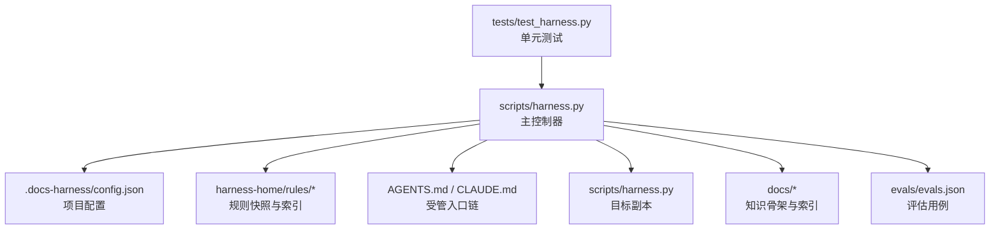
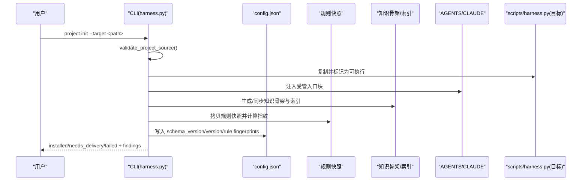
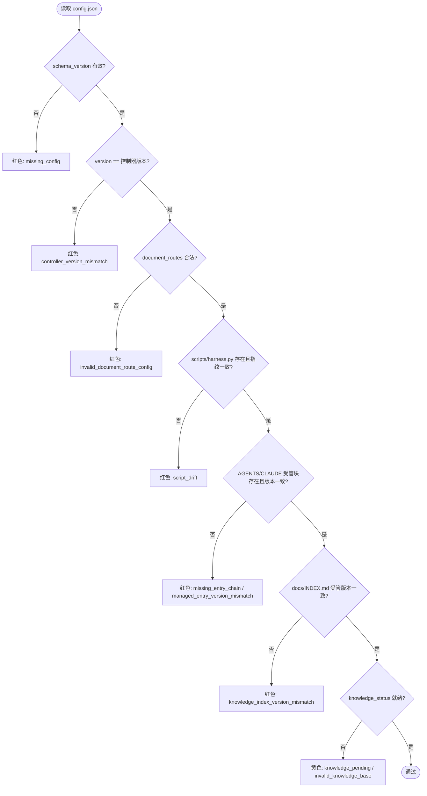
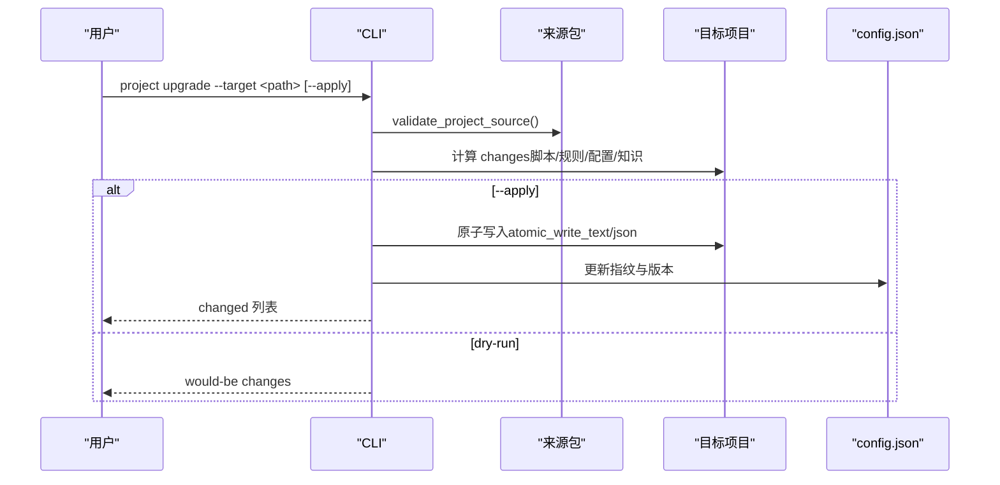
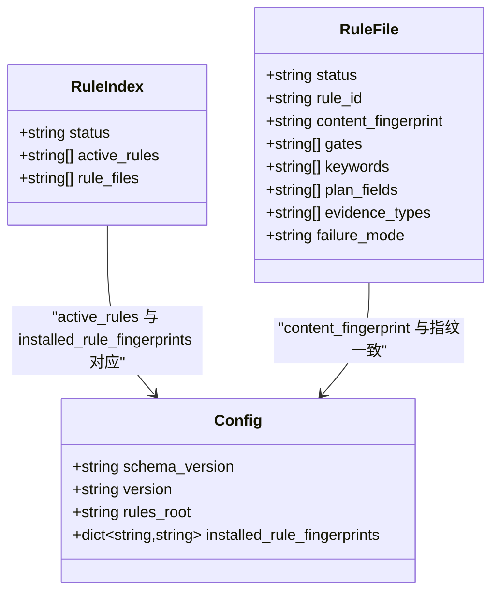
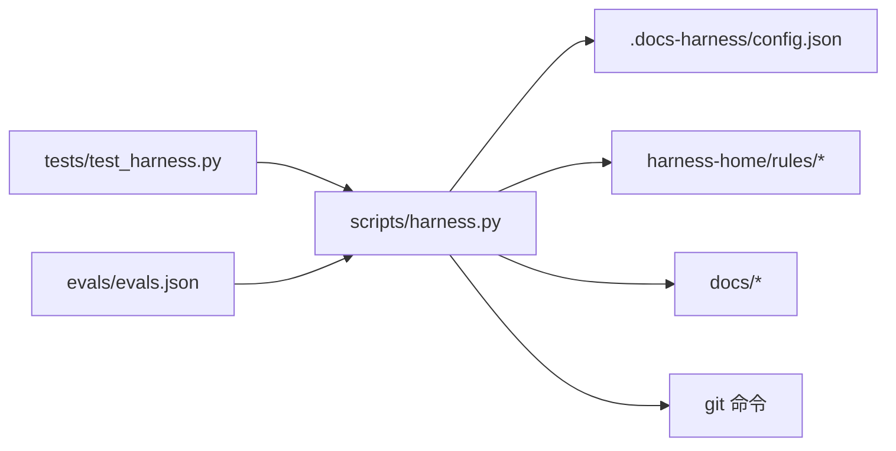

# 配置管理

<cite>
**本文引用的文件**   
- [scripts/harness.py](file://scripts/harness.py)
- [tests/test_harness.py](file://tests/test_harness.py)
- [package.json](file://package.json)
- [evals/evals.json](file://evals/evals.json)
- [harness-home/rules/INDEX.md](file://harness-home/rules/INDEX.md)
- [harness-home/rules/_rule-template.md](file://harness-home/rules/_rule-template.md)
- [harness-home/rules/api-compatibility.md](file://harness-home/rules/api-compatibility.md)
- [harness-home/rules/external-input-security.md](file://harness-home/rules/external-input-security.md)
</cite>

## 目录
1. [简介](#简介)
2. [项目结构](#项目结构)
3. [核心组件](#核心组件)
4. [架构总览](#架构总览)
5. [详细组件分析](#详细组件分析)
6. [依赖关系分析](#依赖关系分析)
7. [性能考量](#性能考量)
8. [故障排查指南](#故障排查指南)
9. [结论](#结论)
10. [附录](#附录)

## 简介
本仓库是一个“意图优先、证据可复用且失败关闭”的独立 Docs Harness 控制技能，提供项目安装、规则与配置管理、任务编排、验证与审计、知识库治理以及后台作业调度等能力。本文聚焦“配置管理”主题，围绕项目级配置文件 .docs-harness/config.json 的生命周期（创建、升级、校验、回滚）、规则快照与指纹一致性、版本与来源包一致性、以及通过 CLI 命令进行安装与检查的流程进行系统化说明。

## 项目结构
- scripts/harness.py：主控制器脚本，定义所有 CLI 子命令与配置管理逻辑
- tests/test_harness.py：覆盖安装、配置、规则、Git 预检/后检、知识基线等用例
- package.json：元数据与脚本入口（self-test、pack:check）
- evals/evals.json：评估用例清单，用于端到端契约测试
- harness-home/rules/*：随项目安装的规则快照与索引，包含激活规则列表与模板
- docs/*：文档与计划（非配置核心，但影响知识流与路由）

图表来源
- [scripts/harness.py:9600-9900](file://scripts/harness.py#L9600-L9900)
- [harness-home/rules/INDEX.md:1-41](file://harness-home/rules/INDEX.md#L1-L41)
- [package.json:1-23](file://package.json#L1-L23)

章节来源
- [package.json:1-23](file://package.json#L1-L23)
- [scripts/harness.py:9600-9900](file://scripts/harness.py#L9600-L9900)
- [harness-home/rules/INDEX.md:1-41](file://harness-home/rules/INDEX.md#L1-L41)

## 核心组件
- 项目配置对象 schema_version 与 version：确保控制器与项目配置一致，避免漂移
- 规则快照与指纹：rules_root 指向相对路径，installed_rule_fingerprints 记录每个规则文件的 sha256 指纹
- 安装脚本指纹：installed_script_fingerprint 锁定 scripts/harness.py 的来源包版本
- 背景治理与知识配置：background_governance 与 knowledge 字段控制后台任务与知识库行为
- 变更检测与发现：project_findings 汇总红/黄级别问题，驱动 check/diff/upgrade 流程

章节来源
- [scripts/harness.py:9600-9900](file://scripts/harness.py#L9600-L9900)
- [scripts/harness.py:9806-9900](file://scripts/harness.py#L9806-L9900)

## 架构总览
配置管理的整体流程由 CLI 驱动，核心命令包括 project init/upgrade/check/diff/uninstall 等。init 会复制控制器脚本、注入受管入口块、生成或同步知识骨架、拷贝规则快照并写入 config.json；upgrade 执行差异计算与幂等应用；check 输出 findings；diff 预览变更；uninstall 清理受管内容。

图表来源
- [scripts/harness.py:9668-9803](file://scripts/harness.py#L9668-L9803)
- [scripts/harness.py:9600-9666](file://scripts/harness.py#L9600-L9666)

章节来源
- [scripts/harness.py:9668-9803](file://scripts/harness.py#L9668-L9803)
- [scripts/harness.py:9600-9666](file://scripts/harness.py#L9600-L9666)

## 详细组件分析

### 项目配置结构与校验
- 配置位置：.docs-harness/config.json
- 关键字段
  - schema_version：固定为 CONFIG_SCHEMA（docs-harness/project-config/v4）
  - version：与控制器 VERSION 对齐
  - rules_root：相对路径 ".docs-harness/harness-home/rules"
  - installed_script_fingerprint：目标 scripts/harness.py 的指纹
  - installed_rule_fingerprints：各规则文件指纹映射
  - background_governance：启用开关、阈值、host_dispatch 策略等
  - knowledge：根目录、map 路径、目标层级、是否异步 bootstrap 等
  - verification.volatile_paths：验证时允许易变路径白名单
- 校验与发现
  - project_findings 检查缺失配置、版本不一致、document_routes 非法、脚本漂移、受管入口版本不匹配、知识索引版本不匹配、遗留版本标记、知识库状态、后台 Job 合同等

图表来源
- [scripts/harness.py:9806-9900](file://scripts/harness.py#L9806-L9900)

章节来源
- [scripts/harness.py:9806-9900](file://scripts/harness.py#L9806-L9900)

### 安装与升级流程
- install 阶段
  - 校验来源包（validate_project_source）
  - 复制 scripts/harness.py 到目标并设置可执行位
  - 在 AGENTS.md / CLAUDE.md 中注入受管入口块
  - 若 docs 不存在或已有 knowledge-map，则生成知识骨架与空 knowledge-map
  - 拷贝规则快照至 .docs-harness/harness-home/rules，记录指纹
  - 写入 .docs-harness/config.json，保留现有 document_routes 与 verification.volatile_paths
- upgrade 阶段
  - 计算 changes（create/update/needs_manual_migration），幂等应用
  - 对冲突（如用户修改了受管文件或规则）拒绝覆盖，要求人工 preserve-and-merge
- diff/preview
  - 仅展示变更，不写盘；apply 后才真正落盘

图表来源
- [scripts/harness.py:9668-9803](file://scripts/harness.py#L9668-L9803)
- [scripts/harness.py:9600-9666](file://scripts/harness.py#L9600-L9666)

章节来源
- [scripts/harness.py:9668-9803](file://scripts/harness.py#L9668-L9803)
- [scripts/harness.py:9600-9666](file://scripts/harness.py#L9600-L9666)

### 规则快照与指纹一致性
- 规则索引 INDEX.md 声明 active_rules 与 rule files
- 每个规则文件包含 metadata（status、rule_id、content_fingerprint、gates、keywords、plan_fields、evidence_types、failure_mode）
- 安装时将规则快照复制到项目内相对路径，并记录指纹；任何增加、删除或内容变化都会导致 check 失败（失败关闭）
- 模板 _rule-template.md 定义了新增规则的最低元数据要求

图表来源
- [harness-home/rules/INDEX.md:1-41](file://harness-home/rules/INDEX.md#L1-L41)
- [harness-home/rules/_rule-template.md:1-21](file://harness-home/rules/_rule-template.md#L1-L21)
- [scripts/harness.py:9600-9666](file://scripts/harness.py#L9600-L9666)

章节来源
- [harness-home/rules/INDEX.md:1-41](file://harness-home/rules/INDEX.md#L1-L41)
- [harness-home/rules/_rule-template.md:1-21](file://harness-home/rules/_rule-template.md#L1-L21)
- [scripts/harness.py:9600-9666](file://scripts/harness.py#L9600-L9666)

### 配置项详解与最佳实践
- schema_version/version：必须与控制器一致，否则 check 报红
- rules_root：保持相对路径，便于 Git 克隆与冻结
- installed_script_fingerprint：锁定控制器脚本来源包版本，防止漂移
- installed_rule_fingerprints：逐文件指纹，保证规则快照不可篡改
- background_governance：建议开启 non_blocking，按阈值选择直接/复杂路由
- knowledge：root/map/target_level/post_completion_sync/bootstrap_async 等，按需调整
- verification.volatile_paths：谨慎配置，避免全局通配符，限制范围

章节来源
- [scripts/harness.py:9760-9803](file://scripts/harness.py#L9760-L9803)
- [scripts/harness.py:9806-9900](file://scripts/harness.py#L9806-L9900)

### CLI 命令与配置相关用法
- project init：初始化项目，生成配置与规则快照，创建知识骨架
- project upgrade：增量升级，支持 --apply 与 dry-run
- project check：输出 findings（红/黄），指导修复
- project diff：预览变更
- project uninstall：清理受管内容与配置（可选 purge_runtime）

章节来源
- [scripts/harness.py:10490-10498](file://scripts/harness.py#L10490-L10498)
- [scripts/harness.py:10285-10330](file://scripts/harness.py#L10285-L10330)

### 测试与评估
- tests/test_harness.py 覆盖了安装幂等性、规则完整性、Git 预检/后检、知识引导、验证契约等场景
- evals/evals.json 定义了 v2 契约、Git 隔离、质量账本、知识库安装、后台路由等用例集合

章节来源
- [tests/test_harness.py:356-393](file://tests/test_harness.py#L356-L393)
- [tests/test_harness.py:1395-1419](file://tests/test_harness.py#L1395-L1419)
- [evals/evals.json:1-175](file://evals/evals.json#L1-L175)

## 依赖关系分析
- 控制器脚本依赖 Python 标准库与 git 命令
- 配置与规则快照强耦合于相对路径与指纹校验
- 知识骨架与 knowledge-map.json 影响动态上下文加载
- 测试与评估用例驱动契约稳定性

图表来源
- [scripts/harness.py:9600-9900](file://scripts/harness.py#L9600-L9900)
- [tests/test_harness.py:1-120](file://tests/test_harness.py#L1-L120)
- [evals/evals.json:1-175](file://evals/evals.json#L1-L175)

章节来源
- [scripts/harness.py:9600-9900](file://scripts/harness.py#L9600-L9900)
- [tests/test_harness.py:1-120](file://tests/test_harness.py#L1-L120)
- [evals/evals.json:1-175](file://evals/evals.json#L1-L175)

## 性能考量
- 原子写入与 fsync：确保配置与规则文件写入的原子性与持久化
- 指纹计算：对大文件采用分块哈希，避免内存峰值
- JSONL 事件追加：顺序追加与 flush/fsync，保障事件日志可靠性
- Git 操作超时与批量处理：预检/后检限制超时，避免阻塞

章节来源
- [scripts/harness.py:422-438](file://scripts/harness.py#L422-L438)
- [scripts/harness.py:510-533](file://scripts/harness.py#L510-L533)
- [scripts/harness.py:575-586](file://scripts/harness.py#L575-L586)

## 故障排查指南
- 缺少有效配置：运行 project check，根据 findings 补全 .docs-harness/config.json
- 版本不一致：升级控制器或降级项目配置，确保 version 一致
- 规则指纹不一致：恢复规则快照或执行 upgrade --apply
- 脚本漂移：恢复受管 scripts/harness.py 或执行 preserve-and-merge
- 知识索引版本不匹配：同步 docs/INDEX.md 受管版本块
- 后台 Job 合同缺失：停止宿主、取消并 route repair

章节来源
- [scripts/harness.py:9806-9900](file://scripts/harness.py#L9806-L9900)
- [tests/test_harness.py:356-393](file://tests/test_harness.py#L356-L393)

## 结论
配置管理以 .docs-harness/config.json 为核心，结合规则快照指纹、控制器脚本指纹与知识骨架，形成强一致的版本与来源包绑定。通过 CLI 提供的 init/upgrade/check/diff/uninstall 命令，实现安全、可审计、可回滚的项目生命周期管理。配合测试与评估用例，确保契约稳定与行为可预期。

## 附录
- 规则模板与示例：_rule-template.md、api-compatibility.md、external-input-security.md
- 评估用例：evals/evals.json 涵盖 v2 契约、Git 隔离、质量账本、知识库安装、后台路由等

章节来源
- [harness-home/rules/_rule-template.md:1-21](file://harness-home/rules/_rule-template.md#L1-L21)
- [harness-home/rules/api-compatibility.md:1-29](file://harness-home/rules/api-compatibility.md#L1-L29)
- [harness-home/rules/external-input-security.md:1-29](file://harness-home/rules/external-input-security.md#L1-L29)
- [evals/evals.json:1-175](file://evals/evals.json#L1-L175)