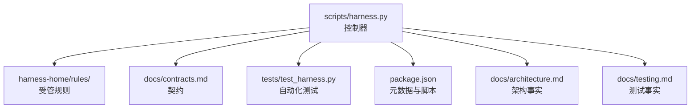
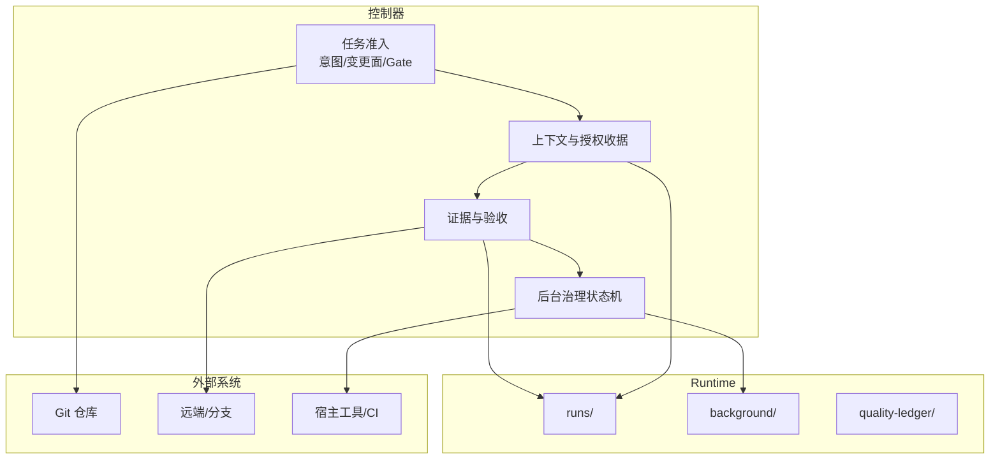
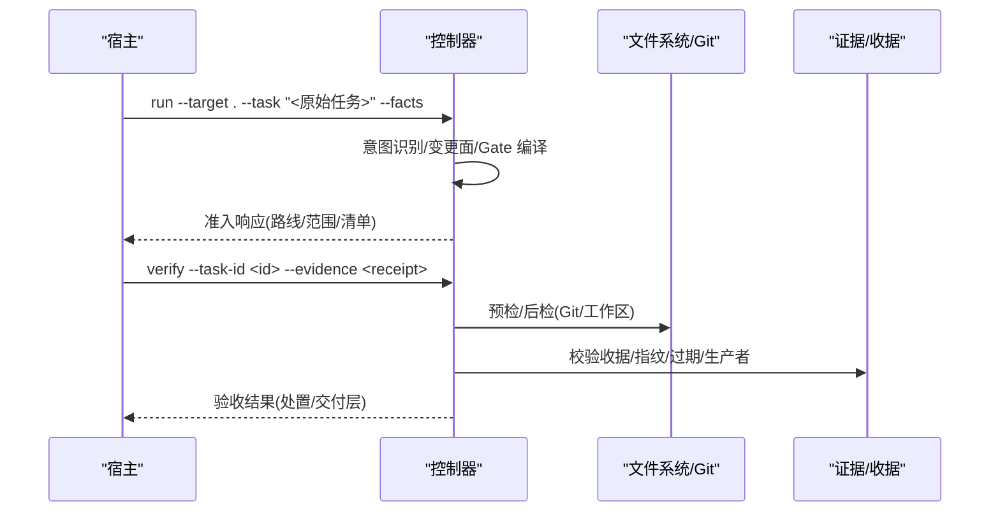
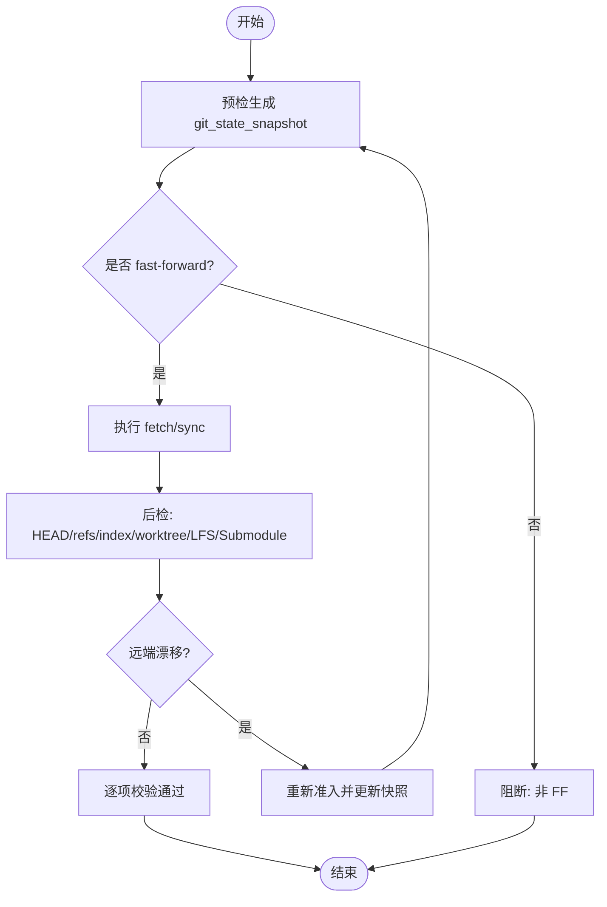
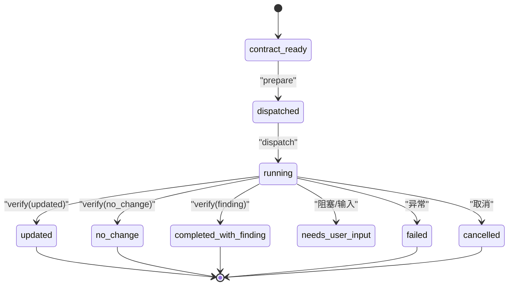
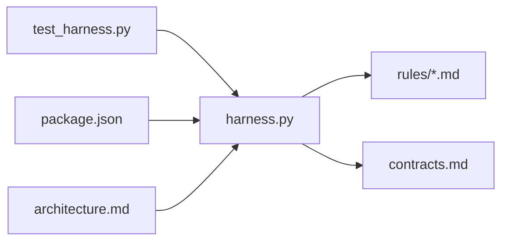

# 高级主题

<cite>
**本文引用的文件**   
- [SKILL.md](file://SKILL.md)
- [package.json](file://package.json)
- [harness.py](file://scripts/harness.py)
- [test_harness.py](file://tests/test_harness.py)
- [architecture.md](file://docs/architecture.md)
- [contracts.md](file://docs/contracts.md)
- [testing.md](file://docs/testing.md)
- [INDEX.md](file://harness-home/rules/INDEX.md)
- [external-input-security.md](file://harness-home/rules/external-input-security.md)
- [knowledge-bootstrap-upgrade-fix-plan.md](file://docs/plans/knowledge-bootstrap-upgrade-fix-plan.md)
- [task-admission-efficiency-plan.md](file://docs/plans/task-admission-efficiency-plan.md)
</cite>

## 目录
1. [引言](#引言)
2. [项目结构](#项目结构)
3. [核心组件](#核心组件)
4. [架构总览](#架构总览)
5. [详细组件分析](#详细组件分析)
6. [依赖关系分析](#依赖关系分析)
7. [性能优化策略](#性能优化策略)
8. [安全考虑](#安全考虑)
9. [故障排除指南](#故障排除指南)
10. [扩展点与插件开发](#扩展点与插件开发)
11. [监控与可观测性](#监控与可观测性)
12. [部署与运维](#部署与运维)
13. [结论](#结论)
14. [附录](#附录)

## 引言
本章节面向 Docs Harness 的高级用户与平台工程团队，聚焦性能、安全、可观测性、扩展能力与运维实践。内容基于控制器源码、合同文档、规则与测试用例进行系统化梳理，帮助读者在复杂工作区、多宿主协作与高并发场景下稳定运行并持续优化。

## 项目结构
Docs Harness 采用“控制器脚本 + 受管规则 + 契约文档 + 自动化测试”的结构：
- scripts/harness.py：独立任务控制器，负责安装升级、任务准入、上下文、验收、知识生命周期与后台 Job 状态机。
- harness-home/rules：发布包内受管规则快照，运行时不得依赖绝对路径；Git 项目需将规则目录、配置与知识地图纳入版本控制面。
- docs/*：产品边界、合同、测试事实与演进方案。
- tests/test_harness.py：覆盖安装、准入、Git 操作、证据、后台治理、兼容迁移等回归矩阵。
- package.json：元数据与脚本入口（测试、自检、打包检查）。

图表来源
- [harness.py:1-120](file://scripts/harness.py#L1-L120)
- [INDEX.md:1-41](file://harness-home/rules/INDEX.md#L1-L41)
- [contracts.md:1-120](file://docs/contracts.md#L1-L120)
- [test_harness.py:1-120](file://tests/test_harness.py#L1-L120)
- [package.json:1-23](file://package.json#L1-L23)
- [architecture.md:1-26](file://docs/architecture.md#L1-L26)
- [testing.md:1-25](file://docs/testing.md#L1-L25)

章节来源
- [architecture.md:1-26](file://docs/architecture.md#L1-L26)
- [package.json:1-23](file://package.json#L1-L23)

## 核心组件
- 任务准入与路由：意图识别、变更面、风险 Gate、读写范围、完成清单与交付层。
- Git 状态合同：预检/后检、远端漂移、ref 命名空间、LFS/Submodule 校验。
- 证据与收据：evidence-receipt/v2、验证命令收据、自动归因、命令缓存。
- 上下文与授权收据：按 task/target/stage/compiler contract/content_set_fingerprint 复用。
- 后台治理：background_direct/goal/phased，prepare/dispatched/running/progress/verify 状态机。
- 质量账本与事件：只读写入、脱敏事件、效率指标。

章节来源
- [contracts.md:1-370](file://docs/contracts.md#L1-L370)
- [harness.py:1-200](file://scripts/harness.py#L1-L200)

## 架构总览
Docs Harness 以控制器为中心，围绕“任务包/编译态/冻结基线/证据索引/上下文与授权收据”的强契约体系，形成从准入到验收的闭环。Git 与非 Git 项目通过 Runtime 目录隔离运行态，后台 Job 与控制面严格分离。

图表来源
- [harness.py:1-200](file://scripts/harness.py#L1-L200)
- [contracts.md:1-200](file://docs/contracts.md#L1-L200)
- [architecture.md:1-26](file://docs/architecture.md#L1-L26)

## 详细组件分析

### 任务准入与证据流水线
- 意图与变更面：query/audit/git_inspect/git_fetch/git_sync/modify/external_write，对应 read_only/git_metadata_write/workspace_write/external_write。
- 风险 Gate：product-change、architecture-contract、security-sensitive、destructive-data、release-external 等，安全底线不可豁免。
- 完成清单：completion_manifest 固定必需项与条件项，禁止末端追加隐藏要求。
- 证据收据：evidence-receipt/v2 绑定 task_id/target_identity/package_fingerprint/producer/command_argv_digest/cwd/ttl/exit_code/digests/read_set/write_set。
- 验收处置：provide_evidence/refresh_evidence/retry_verification/incremental_admission/full_readmission。

图表来源
- [contracts.md:1-220](file://docs/contracts.md#L1-L220)
- [harness.py:1-200](file://scripts/harness.py#L1-L200)

章节来源
- [contracts.md:1-220](file://docs/contracts.md#L1-L220)
- [harness.py:1-200](file://scripts/harness.py#L1-L200)

### Git 状态合同与同步流程
- git_state_snapshot：repo_identity/remote/preflight_target_oid/head/index_tree/worktree_fingerprint/controlled_refs_namespace/lfs_available/submodule_available。
- git_fetch：仅允许声明 refs/objects 变化，HEAD/索引/工作区不变。
- git_sync：自动生成变更范围，冻结目标 OID，fast-forward 约束，脏工作区/删除阈值/非 FF 均失败关闭。
- 远端漂移：重新准入，git_sync_landed_scope 累积已落盘文件并入 write_scope。

图表来源
- [contracts.md:1-180](file://docs/contracts.md#L1-L180)
- [harness.py:1-200](file://scripts/harness.py#L1-L200)

章节来源
- [contracts.md:1-180](file://docs/contracts.md#L1-L180)
- [harness.py:1-200](file://scripts/harness.py#L1-L200)

### 后台治理状态机
- 路线：background_direct/background_goal/background_goal_phased。
- 标准序列：contract_ready → prepare → dispatched → running → progress → verify → 终态。
- 知识 Job：updated/no_change 要求 knowledge_status=ready；waiting_for_bootstrap_merge 等待 bootstrap 成功且复算 ready。

图表来源
- [contracts.md:1-340](file://docs/contracts.md#L1-L340)
- [harness.py:1-200](file://scripts/harness.py#L1-L200)

章节来源
- [contracts.md:1-340](file://docs/contracts.md#L1-L340)
- [harness.py:1-200](file://scripts/harness.py#L1-L200)

## 依赖关系分析
- 控制器对规则与契约强依赖：规则缺失/指纹漂移/配置无效均失败关闭。
- 测试驱动：大量回归用例覆盖准入、Git、证据、后台治理、兼容迁移。
- 版本一致性：VERSION/SKILL frontmatter/package.json/控制器常量必须一致。

图表来源
- [harness.py:1-120](file://scripts/harness.py#L1-L120)
- [test_harness.py:1-120](file://tests/test_harness.py#L1-L120)
- [package.json:1-23](file://package.json#L1-L23)
- [INDEX.md:1-41](file://harness-home/rules/INDEX.md#L1-L41)

章节来源
- [harness.py:1-120](file://scripts/harness.py#L1-L120)
- [test_harness.py:1-120](file://tests/test_harness.py#L1-L120)

## 性能优化策略
- 缓存机制
  - 上下文收据复用：同一 task/target/stage/compiler contract/content_set_fingerprint 命中即复用，避免重复加载规则与项目事实。
  - 验证命令收据缓存：按 argv/produces/输入指纹复用，失败或输入变化才重跑；可通过配置整体关闭。
  - 证据受管副本：原始文件删除不影响已采纳证据，减少 I/O 与校验成本。
- 并发控制
  - 首次冻结基线不可变，区分 task_write_set/read_set/concurrent_drift/unattributed_drift，避免无关并发写入触发重新准入。
  - 后台 Job 控制锁与路径锁保证 prepare/dispatch/progress/verify 原子性与幂等。
- 资源管理
  - Runtime 目录隔离（Git 与非 Git），不进入版本控制；只保留必要工件与事件。
  - 脱敏事件只保存有界字段，避免大对象持久化。
  - 增量验收与一次性最终回复，减少冗余输出与重复处理。

章节来源
- [contracts.md:1-220](file://docs/contracts.md#L1-L220)
- [harness.py:1-200](file://scripts/harness.py#L1-L200)
- [testing.md:1-25](file://docs/testing.md#L1-L25)

## 安全考虑
- 输入验证
  - 所有文件型参数只接受路径，大小/UTF-8/JSON 类型/文件系统错误结构化返回，不回显敏感输入。
  - 自然语言范围拒绝进入路径范围，返回 invalid_scope_description。
- 权限控制
  - mutation_profile 逐级升级，不能降级；Gate 只能保持或升级。
  - 安全底线 Gate 不可豁免：security-sensitive/destructive-data/release-external 由控制器强制兜底。
- 审计日志
  - 事件脱敏，只记录 phase/duration_ms/reason_code/package_revision/context_cache_hit/context_load_count/readmission_count/evidence_round_count/host_receipt_count/business_action_count。
- 数据保护
  - 远程 URL 指纹去除凭证；证据与收据不保存原始输出/环境变量/凭证；受管副本隔离原始文件。

章节来源
- [contracts.md:1-370](file://docs/contracts.md#L1-L370)
- [external-input-security.md:1-29](file://harness-home/rules/external-input-security.md#L1-L29)
- [harness.py:1-200](file://scripts/harness.py#L1-L200)

## 故障排除指南
- 常见问题诊断
  - Git 预检失败：LFS/Submodule 不可用、远端不可达、非 FF、脏工作区重叠、删除数量超阈。
  - 远端漂移：verify 返回 git_remote_drift，需重新准入并更新快照。
  - 证据过期/跨任务/不可信生产者：拒绝复用，需重新生成 v2 收据。
  - 规则缺失/指纹漂移：project check 失败关闭，需恢复或升级规则快照。
- 日志分析
  - 查看 events.jsonl 脱敏事件，定位 reason_code 与阶段耗时。
  - 检查 freeze.json 与 compiled-task.json 的指纹与状态。
- 调试技巧
  - 使用 self-test 与 npm test 快速验证控制器与规则一致性。
  - 临时 Git 项目与 fresh clone 分层验证，隔离真实下游影响。
  - 针对背景 Job 使用 background status/list/prepare/dispatch/progress/verify 逐步排查。

章节来源
- [test_harness.py:1-200](file://tests/test_harness.py#L1-L200)
- [contracts.md:1-370](file://docs/contracts.md#L1-L370)
- [testing.md:1-25](file://docs/testing.md#L1-L25)

## 扩展点与插件开发
- 插件架构
  - 规则扩展：新增 rules/*.md，确保 rule_id 唯一、content_fingerprint 正确、status: active，并通过 INDEX.md 激活。
  - 证据适配器：实现 producer adapter/capability，产出 evidence-receipt/v2，满足白名单 produces。
- 适配器模式
  - 验证命令收据：按 argv/produces/输入指纹绑定，支持缓存与重试。
  - 上下文收据：按 content_set_fingerprint 复用，限定同一 task/target/stage/compiler contract。
- 自定义组件开发
  - 后台 Job 数据面：仅写 allowed_write_scope，控制面由 CLI 维护。
  - 文档真源路由：显式声明 architecture/changelog/todo/adr_root/reviews_root，路径链无符号链接。

章节来源
- [INDEX.md:1-41](file://harness-home/rules/INDEX.md#L1-L41)
- [contracts.md:1-340](file://docs/contracts.md#L1-L340)
- [harness.py:1-200](file://scripts/harness.py#L1-L200)

## 监控与可观测性
- 指标收集
  - 脱敏事件聚合：phase/duration_ms/reason_code 等字段用于复盘效率与瓶颈。
  - 验收交付层：source/local_verification/git_head/remote_delivery/fresh_clone/release_artifact/ui/external_state 分层报告。
- 健康检查
  - project check：检测规则完整性、配置有效性、知识状态与后台 Job 停滞提醒。
  - self-test：控制器自检通过，规则集与指纹一致。
- 告警配置
  - 非终态 Job 超过 stale_after 给出 action-required 提醒。
  - 知识未初始化且无活动 bootstrap 时，提示 knowledge audit 下一步。

章节来源
- [contracts.md:1-370](file://docs/contracts.md#L1-L370)
- [testing.md:1-25](file://docs/testing.md#L1-L25)
- [knowledge-bootstrap-upgrade-fix-plan.md:1-200](file://docs/plans/knowledge-bootstrap-upgrade-fix-plan.md#L1-L200)

## 部署与运维
- 容器化部署
  - 使用 package.json 元数据与 SKILL.md 描述安装与运行方式；npm pack 生成可携带包。
  - 控制器脚本独立，不依赖 agent-docs-harness，适合容器内执行。
- 配置管理
  - .docs-harness/config.json 管理 rules_root、verification.volatile_paths、verification.command_cache_enabled 等。
  - 规则快照与知识地图纳入版本控制面，clone_ready=true 需 HEAD 包含完整清单。
- 版本升级
  - preserve-and-merge 合法 document_routes；非法或缺失路由合同的任务返回 needs_manual_migration。
  - v1→v2 迁移：在途任务只允许读取与迁移命令，存在活动 v2 任务时阻断回滚。

章节来源
- [package.json:1-23](file://package.json#L1-L23)
- [SKILL.md:1-105](file://SKILL.md#L1-L105)
- [contracts.md:1-370](file://docs/contracts.md#L1-L370)
- [architecture.md:1-26](file://docs/architecture.md#L1-L26)

## 结论
Docs Harness 通过强契约、受管规则与自动化测试，构建了意图优先、证据可复用、失败关闭的控制面。性能优化围绕缓存、并发与资源管理展开；安全强调输入验证、权限控制、审计与数据保护；可观测性提供脱敏事件与分层交付报告；扩展点支持规则与证据适配器；部署运维强调可携带、可回滚与分层验收。遵循本文档的实践，可在复杂环境中稳定运行并持续优化。

## 附录
- 实际性能调优案例
  - 只读查询直入 direct 路线，避免编辑 Gate 与方案链，显著降低上下文加载与证据成本。
  - 验证命令收据缓存命中率高，减少重复执行与 I/O。
- 故障恢复场景
  - Git 远端漂移重新准入：更新快照与 git_sync_landed_scope，继承已冻结方案，单条 run --task-id 回到 ready_planned。
  - 后台 Job 失败重试：归档旧 attempt，推进 attempt 并清空准备引用，刷新基线后重新 prepare。

章节来源
- [task-admission-efficiency-plan.md:1-200](file://docs/plans/task-admission-efficiency-plan.md#L1-L200)
- [knowledge-bootstrap-upgrade-fix-plan.md:1-200](file://docs/plans/knowledge-bootstrap-upgrade-fix-plan.md#L1-L200)
- [contracts.md:1-370](file://docs/contracts.md#L1-L370)