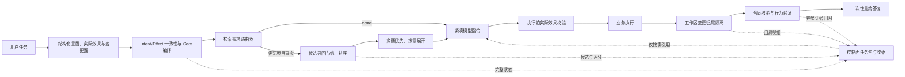
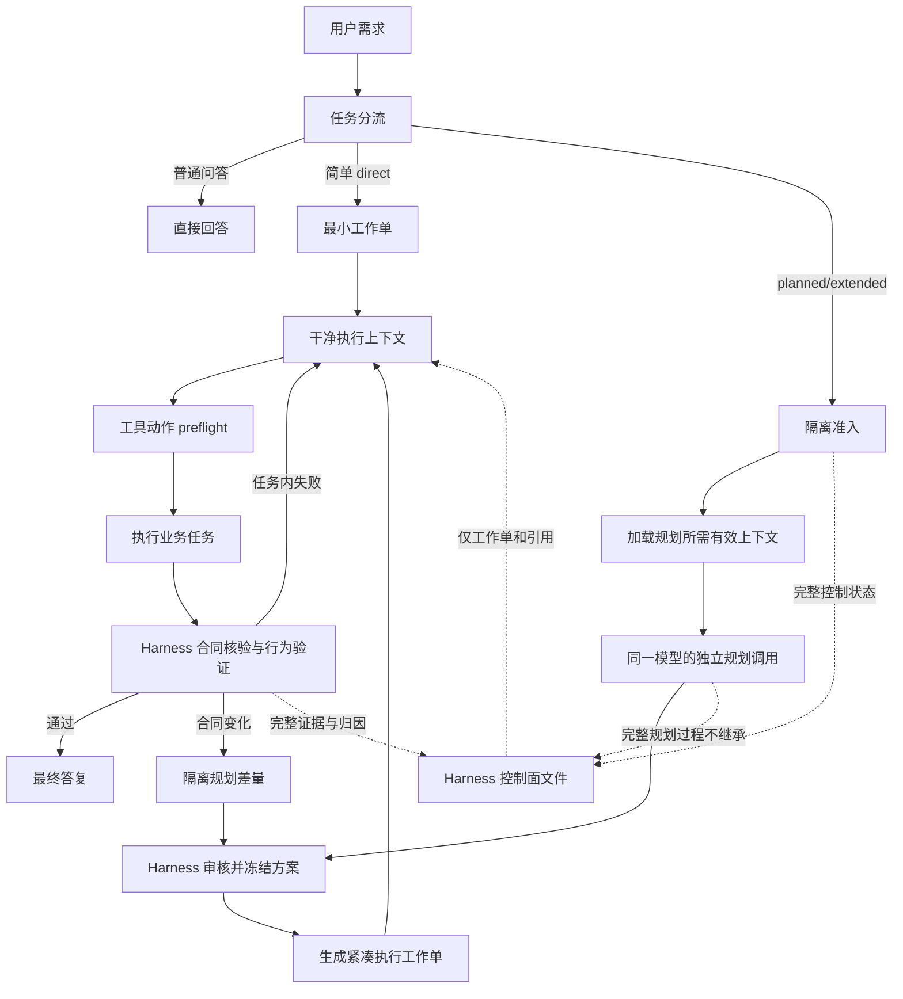

# Docs Harness 有效上下文密度与稳定性优化方案（v1.8.2+）

- 状态：最终设计方案；Codex Host Adapter P0 确定性基础层已实现并通过聚焦审查，完整宿主编排尚未实施
- 日期：2026-08-09
- 修订：补充 Intent/Effect 双重校验、answer-only 副作用拦截、Gate 级联去重、工作区归属隔离、Verify 语义拆分、Codex Host Adapter、规划/执行上下文隔离、Codex Schema 兼容合同、宿主最小上下文档位和子智能体使用策略
- 适用范围：Repowiki 检索与交付、Run、Gate、Plan、Verify、重准入、宿主适配和 ZBuddy 下游验收
- 核心指标：有效上下文密度（Effective Context Density，ECD）

## 1. 文档定位

本方案基于当前本地提交 `e0ca4fb` 的 `1.8.2` 代码继续设计，`VERSION`、`package.json` 与 `.docs-harness/config.json` 均为 `1.8.2`。该本地源码与提交状态仍不能单独证明远端、fresh clone、ZBuddy 受管副本、安装产物或用户可见行为已经更新。

本文用于统一以下分散设计：

- `repowiki-retrieval-delivery-system-v1.8.1-plan.md` 中的选卡、预算和交付设计；
- `scope-priority-matrix-short.md` 中已经进入 1.8.2 的全局 scope 候选池规则；
- `token-budget-decision-tree-short.md` 中尚未经过真实任务验证的固定预算设想；
- `receipt-state-machine-short.md` 中的 partial/resume 方向；
- `task-admission-efficiency-plan.md` 中的意图、Gate、证据和重准入合同；
- 2026-08-08 ZBuddy Docs Harness 真实任务审查；
- 《Qoder Repowiki 通用使用规则》中的按需触发、分层检索、增量加载、缓存和维护建议。

历史方案继续保留为设计背景。本文是 v1.8.2 之后“有效上下文密度与流程效率”的统一实施依据；历史方案中没有实测依据的目标值、时间目标和“已确认”标记不自动继承。

## 2. 执行摘要

1.8.2 已经完成第一轮止血：全局知识卡不再因 `**`、`*` 或空 scope 自动全量命中；候选卡进行简单相关性评分；任务选卡和单次 context 交付都增加了上限；响应开始暴露省略和截断。

但稳定、高效的 Docs Harness 仍缺少八项系统能力：

1. **任务方向准确性**：结构化意图仍可能被宿主声明错误，answer-only 尚无执行期副作用拦截；
2. **Gate 级联约束**：错误 Gate 仍会派生额外规则、证据、Plan 字段和 Verify 要求；
3. **工作区归属隔离**：其他任务或用户已有改动仍可能进入当前任务归因并触发重准入；
4. **相关性能力**：当前评分主要依赖卡片名称、分类和简单文本片段，短了但不一定准；
5. **交付真实性**：控制器准备输出不等于模型实际收到，partial 收据仍可能被当作有效收据复用；
6. **控制面隔离与数据化验收**：Run、Gate、Plan、Verify 的完整内部状态仍大量进入模型上下文，且没有以真实 ZBuddy 任务为基准的联合发布门槛。
7. **Codex 宿主编排**：规划和执行仍发生在同一个 Codex 上下文中，Harness 单独无法清空上下文、隐藏原始控制载荷或自动启动干净的执行调用。
8. **宿主基础上下文治理**：即使业务工作单很短，Codex 默认配置仍可能加载大量系统指令、技能和插件；如果不单独度量和收缩这一层，拆分调用只会隔离历史，不会自动提高有效上下文密度。

本方案不把“减少 token”本身视为成功。核心目标是：在不降低必要上下文召回率、任务成功率和安全合同的前提下，减少无关、重复、过期和只属于控制器内部的模型可见内容。

## 3. 事实基线

### 3.1 数据范围

以下数据来自 2026-08-08 ZBuddy 本地 Docs Harness 任务归档的只读统计，以及当前 1.8.2 选择器对典型旧任务的只读影子回放。它们用于建立问题基线，不代表线上全量用户数据，也不等同于模型能力损失的因果证明。

由于宿主最终送入模型的完整 token 流没有在所有历史任务中持久化，部分输出只能以字符数统计。字符数不能直接当作 token 数。

### 3.2 准入、Gate 与方案负担

| 指标 | 观察值 |
|---|---:|
| 完成状态任务包 | 53 |
| Gate 分配次数 | 79 |
| Gate 在 matched/assessment/decision 等字段中的记录次数 | 153 |
| 含 Gate 的任务 | 33 |
| 单任务包含 4–6 个 Gate | 8 |
| 规则分配次数 | 61 |
| 不同规则数量 | 7 |
| 重复规则分配 | 54（88.5%） |
| required evidence 条目 | 104 |
| 方案字段记录 | 412 |
| 同时生成的全空方案骨架字段 | 412 |

结论：Gate 和规则不仅承担控制决策，还以重复字段、规则清单和方案骨架形式进入宿主响应。控制信息重复是独立于知识库正文的上下文占用来源。

典型双向误判：只检查、不改代码的 hdiutil 问题被归入 `workspace_write` 并命中安全、测试、代码和文档 Gate，随后经历 6 次 Verify、4 次重准入、6 次上下文加载，最终累计 12 个 Host 收据；相反，完整构建并打包 DMG 被归入 `query/read_only`。这证明 Intent/Gate 同时存在过度触发和漏判。

### 3.3 Verify 与重准入负担

| 指标 | 观察值 |
|---|---:|
| 53 个完成任务的 Verify 尝试 | 75 |
| 最终完成 | 53 |
| `full_readmission` | 11 |
| `provide_evidence` | 7 |
| `refresh_evidence` | 4 |
| 非最终 Verify 尝试占比 | 29.3% |
| 没有执行命令的 Verify 尝试 | 70/75（93.3%） |
| 实际执行命令 | 6 |
| 命令缓存命中 | 0 |
| 要求 `test_result` 的任务 | 22 |
| 其中未声明 Harness 验证命令 | 19 |
| Verify 每次观察到的变更路径平均数 | 4.95 |
| Verify 单次观察到的最大变更路径数 | 29 |

已恢复的 50 份 Verify 直接输出覆盖 39 个主任务：总字符数 263,814，中位数 4,913，P90 9,585，最大值 12,116。

结论：Verify 的主要成本不是执行验证命令，而是重复解释合同、缺证、归因和下一步；证据要求与实际验证命令之间也存在错配。

### 3.4 Run 与 answer-only 负担

已恢复的 118 份主 Run 输出覆盖 71 个任务：总字符数 644,441，中位数 3,837，P90 14,258，最大值 24,133。

15 个任务包进入 `answer_only`；其中恢复到的 14 份响应字符数中位数为 3,585。一个响应包含 43 个顶层字段和 15 个空数组。

至少 7 个 answer-only 任务正文包含构建 DMG、切换分支、合并分支、写本地方案或删除 worktree 等明确副作用；“合并到当前 main”仍被归入 `review_light/read_only/answer_only`。

结论：`answer_only` 已免除 evidence 和 Verify，但首次响应仍沿用完整任务包投影，尚未成为真正的轻量模型路线。

### 3.5 Repowiki 负担

| 指标 | 观察值 |
|---|---:|
| 加载知识卡的任务 | 21 |
| 多数任务选卡数量 | 同一批 15 或 19 张 |
| 累计卡片加载 | 383 |
| 不同卡片 | 19 |
| 重复加载占比 | 约 95% |
| `category_refs` 路径条目 | 944 |
| 按任务去重后的路径条目 | 383 |
| 重复路径占比 | 59.4% |
| 19 张卡正文估算 | 约 17,612 token |

历史宿主输出恢复显示，模型可见的知识条目最多约为控制器准备条目的 36.6%，但控制器收据仍可能记录完整内容集合。

结论：1.8.2 之前存在全局卡过度召回、分类路径重复和准备交付/实际交付混淆。1.8.2 已减少过度召回，但交付真实性尚未闭环。

### 3.6 1.8.2 只读影子回放

使用当前 1.8.2 选择器对典型 ZBuddy 旧任务进行只读回放，观察到：

- AI PPT 主区进度卡任务只选中 1 张构建发布知识卡，没有命中直接相关的 UI、React 或样式卡；
- DMG 构建任务在修正意图和 scope 后选中 3 张卡，其中构建打包卡直接相关，配置和日志卡属于低价值补充；
- 文档转换 UI 任务未选中 React/UI 相关卡；
- 已知不需要项目知识的 Git 分支检查任务可以保持零选卡。

结论：1.8.2 已从高召回、低精度转向低负载，但真实任务上的召回率和排序质量仍不足。不能用“选卡数量减少”直接证明模型能力提升。

## 4. 问题定义

Docs Harness 当前把三类信息混合在同一模型上下文中：

1. **控制面信息**：意图、Gate、规则匹配、授权、范围、证据合同、状态机和调试字段；
2. **任务面信息**：用户目标、当前动作、必要约束、成功标准和下一步；
3. **知识面信息**：Repowiki 卡片、代码位置、历史任务经验和项目事实。

模型真正需要的是任务面，以及完成当前动作所必需的少量控制约束和知识。完整控制器内部状态应保存在任务包、收据和调试产物中，而不是默认进入模型上下文。

需要被系统性切断的错误放大链是：

```text
意图误判
→ Gate 误判
→ 额外规则、Plan 字段和证据要求
→ Verify 补证或完整重准入
→ 再次注入相同或更多上下文
```

本方案必须分别在四处阻断：任务包持久化前检查 Intent/Effect 一致性；Gate 编译时限制派生和去重；Verify 前隔离无关工作区变化；重准入时只返回合同与上下文差量。



## 5. 产品目标

### 5.1 核心目标

- 提高模型可见 Harness 内容中的任务相关信息比例；
- 保证用户要求的实际效果、任务意图、变更面和允许动作一致；
- 在 answer-only 和其他轻量路线执行前拦截未授权副作用；
- 隔离准入前改动和无关并发改动，避免污染当前任务；
- 保证所有完成任务所需的必要上下文被正确召回和实际交付；
- 让控制器状态完整可审计，但默认不占用模型上下文；
- 降低 Run、Context、Verify 和重准入往返轮次；
- 保留意图、Gate、授权、范围和证据的失败关闭能力；
- 用真实 ZBuddy 任务和统一模型条件证明改进，不以单元测试数量替代产品效果。
- 默认使用同一个强模型承担规划和执行，但两个角色使用隔离上下文，只通过冻结方案和紧凑工作单传递信息；
- 让 Codex Host Adapter 负责上下文防火墙、调用编排、动作 preflight 和真实交付确认；
- 子智能体仅用于天然可分解的规划、只读调查和独立审查，不作为 Harness 日常操作员。

### 5.2 非目标

- 不通过删除安全 Gate、证据或授权边界换取短响应；
- 不把所有任务强制变成零知识检索；
- 不让 Docs Harness 自动修改 Qoder Repowiki；Repowiki 在当前合同中仍是外部只消费知识源；
- 不用文本关键词重新推断具有授权能力的任务意图或风险 Gate；
- 不把隐藏控制器字段当作消除错误 Gate 级联；必须同时消除不必要的派生规则和证据；
- 不因为工作区存在与当前范围无关的其他改动就重准入当前任务；
- 不把固定 token 数、固定百分比或主观相关性分数当作已经验证的事实；
- 不在本方案阶段修改控制器代码或 ZBuddy 下游副本。
- 不强制使用两个不同模型；模型身份与上下文角色分离；
- 不默认启用子智能体，也不让多个智能体在同一工作区无边界并发写入；
- 不把仓库内 `harness.py` 能力表述成已经完成 Codex Desktop 原生编排。

## 6. 核心指标体系

### 6.1 有效上下文密度

```text
ECD = Σ（模型可见 token_i × relevance_weight_i）
      / Σ（全部模型可见 Harness token）
```

首期人工金标权重：

| 权重 | 定义 |
|---:|---|
| 1.0 | 完成当前动作直接必需 |
| 0.5 | 有帮助，但缺失不阻断完成 |
| 0 | 无关、重复、过期或只属于控制器内部 |

分母必须包含所有由 Harness 导致的模型可见内容：Run 控制字段、Gate/规则、Plan、Repowiki 正文、Context 包装字段、Verify 和重准入响应。不能只统计知识卡正文。

### 6.2 必要上下文召回率

```text
required_context_recall = 已实际交付的 must-have 金标项
                          / 当前任务全部 must-have 金标项
```

该指标用于防止通过少检索或不检索虚增 ECD。

### 6.3 交付真实性

```text
false_complete_rate = 被标记 complete 但宿主未确认完整交付的 context 次数
                      / 被标记 complete 的 context 次数
```

### 6.4 配套指标

- `duplicate_token_ratio`：模型可见重复内容 token / 模型可见 Harness token；
- `control_plane_token_ratio`：只属于控制器内部的信息 token / 模型可见 Harness token；
- `context_actual_tokens`：宿主使用真实 tokenizer 统计的交付 token；
- `context_estimated_tokens`：控制器预估值，仅用于发送前预算；
- `verify_attempt_count`：任务进入终态前的 Verify 次数；
- `same_reason_readmission_count`：相同原因码重复重准入次数；
- `intent_effect_inconsistency_count`：意图、变更面、允许动作和实际效果不一致次数；
- `intent_effect_route_exact_match_rate`：冻结金标中意图、效果和路线完整一致的任务比例；
- `gate_set_exact_match_rate`：冻结金标中 Gate 集合既不多报也不漏报的任务比例；
- `answer_only_side_effect_attempt_count`：answer-only 路线尝试执行副作用动作的次数；
- `gate_amplification_factor`：单个 Gate 派生的不同规则、证据和 Plan 字段数量；
- `unrelated_drift_readmission_count`：仅因无关工作区漂移触发重准入的次数；
- `contract_only_verify_ratio`：没有行为验证、仅执行治理合同核验的 Verify 占比；
- `behavior_verification_execution_rate`：声明需要行为验证的任务中实际执行命令或受控人工验收的比例；
- `task_success_rate`：真实任务是否满足用户目标；
- `harness_wall_time_share`：Harness 往返占任务总耗时比例。
- `raw_control_payload_visible_tokens`：Run/Gate/Plan/Verify 原始控制载荷进入执行模型的 token 数；
- `planning_execution_context_overlap`：规划过程进入执行上下文的内容，仅允许冻结方案、必要上下文与明确引用；
- `side_effect_preflight_coverage`：受管副作用动作中执行前经过 Harness preflight 的比例；
- `host_delivery_ack_rate`：要求确认的上下文交付中获得宿主实际 delivery ack 的比例；
- `agent_coordination_overhead`：使用子智能体时用于分派、同步和合并的模型可见 token 与往返次数。

### 6.5 建议发布门槛

以下数值是候选版本的产品验收目标，不是当前实测结果：

| 指标 | 建议门槛 |
|---|---:|
| ECD 中位数 | ≥70% |
| ECD P10 | ≥50% |
| 必要上下文召回率 | ≥95% |
| `false_complete_rate` | 0 |
| `duplicate_token_ratio` | ≤5% |
| 冻结的 Intent/Effect/Gate 误判回放 | 100% exact match，0 个错误路线 |
| answer-only 实际执行副作用 | 0 |
| 仅因无关工作区漂移触发重准入 | 0 |
| 原始控制载荷进入执行上下文 | 0 token |
| 受管副作用动作 preflight 覆盖率 | 100% |
| 规划到执行的上下文传递 | 仅冻结方案、工作单和必要上下文 |
| answer-only 模型可见 Harness 内容 | ≤300 token |
| 普通 Run/Verify 单次响应 | ≤600 token |
| 平均 Verify 次数 | ≤1.2 |
| 相同原因重复重准入 | 0 |
| 任务成功率 | 不低于 1.8.2 对照组 |

门槛必须经过冻结评测集验证后才能转成正式 SLO；如果召回率或任务成功率下降，即使 ECD 上升也不得发布。

## 7. 总体产品原则

### 7.1 按需检索，不按会话自动注入

只有当任务需要项目架构、当前实现、代码位置、已知符号或项目历史时才进入检索。通用知识、纯对话和不需要项目事实的 answer-only 任务不创建 Repowiki 上下文。

### 7.2 意图决定检索方式，不固定 Memory 优先

- 架构和设计问题：合同、ADR、Repowiki 摘要优先；
- 当前实现和故障定位：代码、运行事实和日志优先；
- 已知类名或函数名：直接 Symbol Lookup；
- 历史任务和回归：任务归档、证据和时间线优先；
- 通用编程问题：不检索项目知识。

### 7.3 摘要优先，正文按需展开

首轮只发送能帮助模型决定下一步的摘要、路径和命中理由。只有被模型选择或被 must-have 合同要求的条目才展开正文或精确代码片段。

### 7.4 控制面与模型面分离

控制器保留完整任务包和证据；模型只接收当前动作必需的约束。所有完整调试字段通过 `detail_ref`、`task_package_ref` 或专用查询按需读取。

### 7.5 实际交付优先于准备交付

控制器只能证明“准备了什么”；宿主确认后才能证明“模型实际收到了什么”。没有宿主确认的内容不得满足 complete 收据。

### 7.6 冲突必须可见

Memory、Repowiki、合同、代码和运行事实不一致时，响应应记录冲突和各自时间/版本，不得静默隐藏。回答采用哪一层事实取决于用户问题，而不是固定以代码或文档为准。

### 7.7 知识维护与知识消费分离

普通任务只消费知识。创建、更新、合并、归档或删除记忆属于独立写任务，需要明确授权、来源、版本和失效依据；不能因为超过固定时间未访问就自动删除。

## 8. Intent、实际效果与 Gate 准确性合同

### 8.1 四层职责

任务方向不能只依赖一个意图标签，应由四层共同约束：

| 层级 | 负责内容 | 不能替代的内容 |
|---|---|---|
| `intent_assessment` | 用户要完成什么 | 不能直接授予工具副作用 |
| `effect_assessment` | 任务预期产生什么实际效果 | 不能代替风险 Gate |
| 控制器兼容矩阵 | 检查 intent、effect、mutation profile、scope 和 allowed actions 是否一致 | 不从任务正文猜测意图 |
| 执行前效果校验 | 检查即将发生的真实工具/命令效果是否已授权 | 不在执行后补做准入 |

宿主仍负责结构化理解用户请求；控制器负责拒绝跨层矛盾；受管工具入口负责在副作用发生前执行最终校验。这样既不恢复正文关键词路由，也不把结构化声明错误直接带入执行阶段。

### 8.2 effect_assessment

```json
{
  "effect_assessment": {
    "requested_effects": [
      "read",
      "respond",
      "workspace_write",
      "build_artifact",
      "git_switch",
      "git_commit",
      "git_merge",
      "worktree_remove",
      "external_write"
    ],
    "forbidden_effects": ["external_write"],
    "expected_outputs": ["本地 DMG", "本地方案文档"],
    "rationale": "当前任务预期产生的本地、Git 或外部效果"
  }
}
```

数组中的值是受控枚举；示例用于展示完整值域，不表示单个任务应同时声明全部效果。没有副作用的任务通常只声明 `read`。

### 8.3 路线兼容矩阵

| 路线/意图 | 允许效果 | 禁止直接进入的效果 |
|---|---|---|
| `answer_only` | `read`、`respond` | 任意工作区、Git、构建、删除或外部副作用 |
| `query|review_light|git_inspect` | `read` | `workspace_write|build_artifact|git_*|worktree_remove|external_write` |
| `modify` | `read|workspace_write`，按合同可增加 `build_artifact` | 未声明的 Git、删除和外部写入 |
| 受控 Git 意图 | 与意图完全一致的单一 Git 效果 | 其他 Git 效果和工作区写入 |
| `external_write` | 已授权的外部效果 | 未授权目标和附带发布动作 |

如果 `effect_assessment` 与意图、变更面、scope 或允许动作不一致，控制器在任务包持久化前返回 `intent_effect_mismatch`，不自动选择“最接近”的路线。

### 8.4 执行前副作用校验

受管宿主在每次业务工具或命令执行前提交 `proposed_effects`：

```json
{
  "action_preflight": {
    "tool_or_command": "受管动作标识",
    "proposed_effects": ["build_artifact", "workspace_write"],
    "target_scope": ["dist/**"]
  }
}
```

控制规则：

- `proposed_effects` 必须是已冻结 `requested_effects` 和 `allowed_actions` 的子集；
- answer-only 只允许只读工具和最终答复；
- build、merge、switch、commit、文档写入、worktree 删除和外部发送均在副作用发生前校验；
- 不兼容时返回 `action_effect_readmission_required`，不得先执行再补收据；
- 命令效果来自受管工具类型、命令适配器或宿主显式声明，不从用户任务正文做关键词判定；
- 执行后的实际效果收据必须与 preflight 一致，否则任务失败关闭。

该机制无法保证宿主一定正确理解用户想做什么，但能防止错误 answer-only 路线继续执行副作用。意图理解准确率由冻结真实任务评测约束。

### 8.5 Gate 编译与级联去重

Gate 来源仅允许：

- 宿主结构化 `gate_assessment`；
- 封闭的路径结构推断；
- 项目显式 `gate_path_rules`；
- 执行期实际范围变化触发的 mid-task tripwire。

任务正文关键词不产生具有授权或阻断能力的 Gate。

Gate 还必须通过效果兼容检查：

- `code-edit|document-edit` 等编辑型 Gate 必须存在对应工作区写效果和写入范围；
- 构建、测试、发布、数据破坏等 Gate 必须能追溯到结构化效果、显式用户验收要求或受控项目规则；
- 只读任务可以存在必要的审计或数据访问约束，但不得因此生成写入授权、编辑型 Plan 或与当前任务无关的 `test_result`；
- Gate 与效果不兼容时返回 `gate_effect_mismatch`，不通过追加更多 Gate 进行“保守修复”；
- Gate 只能增加控制要求，不能反向创造用户没有请求的业务效果。

控制器为每个 Gate 生成唯一派生图：

```text
Gate
  ├── unique rule ids
  ├── unique evidence ids
  ├── required plan fields
  └── verification requirements
```

派生规则：

- 规则、证据和 Plan 字段分别按稳定 ID/fingerprint 做集合去重；
- 每个派生项必须记录 `derived_from_gate_ids`；
- 多个 Gate 共用同一要求时只生成一个要求，并保存多源关系；
- Gate 被纠正或移除时，失去全部来源的派生项必须同步撤销，不保留孤儿证据；
- 模型只接收最终有效约束，完整派生图留在控制面；
- 记录 `gate_amplification_factor`，防止单个 Gate 无边界放大治理内容。

### 8.6 必须冻结的误判回放

- “只检查、不改代码”的 hdiutil 问题必须保持只读，不进入工作区写入和四 Gate 路线；
- “重新完整构建并打包 DMG”必须包含 `build_artifact`，不得进入 answer-only；
- “合并到当前 main”必须包含受控 Git merge 效果；
- “切换分支”必须进入受控 `git_switch`；
- “把方案写入本地文档”必须包含 `workspace_write`；
- “删除 worktree”必须包含 `worktree_remove`；
- 只读讨论中提及 build、merge、发布或删除，不得仅因被提及就升级效果。

## 9. 检索需求路由器

检索需求不是风险 Gate，不改变用户授权、变更面或证据要求。它只决定当前任务是否需要项目知识，以及采用哪种检索方式。

### 9.1 输入合同

```json
{
  "retrieval_need": {
    "mode": "none|architecture|implementation|symbol|history",
    "reason": "为什么当前任务需要或不需要项目上下文",
    "queries": ["最多三个结构化查询"],
    "must_have": ["完成当前动作不可缺少的信息"],
    "budget_tokens": 1200,
    "stop_condition": "找到什么信息后停止"
  }
}
```

`budget_tokens` 由宿主根据当前模型窗口和已占用上下文提供。示例中的 `1200` 只用于展示 Schema，不是默认值。

### 9.2 路由规则

| mode | 典型任务 | 首选来源 | 首轮行为 |
|---|---|---|---|
| `none` | 通用问答、状态回复 | 无 | 不检索 |
| `architecture` | 模块关系、设计边界 | 合同、ADR、Repowiki | 返回摘要和关键路径 |
| `implementation` | 当前实现、故障链路 | 代码、运行事实、Repowiki 定位卡 | 搜索代码并返回最小片段 |
| `symbol` | 已知类、函数、事件 | Symbol、精确代码搜索 | 跳过宽泛知识检索 |
| `history` | 以前为什么这么做 | 任务归档、证据、ADR、Memory | 返回带日期和来源的结论 |

### 9.3 失败关闭边界

- 缺少检索需求声明不授予任何写权限；
- 检索结果不能增加写范围或允许动作；
- 任务意图和风险 Gate 继续由结构化 `intent_assessment`、`gate_assessment` 和显式路径规则控制；
- 不使用“全部、完整、发布、测试”等正文关键词自动扩大预算或升级 Gate。

## 10. 候选召回与统一排序

### 10.1 两阶段检索

第一阶段负责高召回候选集：

- 显式 requested ref；
- 具体 scope 路径匹配；
- 名称、别名、分类和摘要匹配；
- 代码路径、模块名和符号匹配；
- 历史任务的受控标签和原因码匹配。

第二阶段负责统一排序：

- 对显式、scope、全局和历史候选使用同一排序器；
- 不再让具体 scope 命中项绕过排序后按文件遍历顺序截断；
- 项目通用词如 `ZBuddy`、`SmartClaw`、`项目`、`系统` 应按文档频率降权；
- 精确符号、精确路径、业务实体和错误码获得更高权重；
- 记录每个候选的命中特征和淘汰原因。

### 10.2 首期排序策略

首期优先采用可解释、可离线回放的确定性排序，不把 embedding 作为发布前置条件：

```text
score = 精确 requested
      + 精确 symbol/path
      + name/alias
      + summary/category
      + concrete scope
      - 通用词惩罚
      - 过期/冲突惩罚
```

具体权重不在方案中拍定，应通过 ZBuddy 金标集调参。未来可增加 embedding 重排，但必须保留无网络、无模型服务时的确定性降级路径。

### 10.3 路径去重

知识项以唯一 `ref` 保存一次：

```json
{
  "knowledge_items": {
    "card-001": {"ref": "...", "fingerprint": "sha256:..."}
  },
  "category_refs": {
    "architecture": ["card-001"]
  }
}
```

分类只保存 ID 关系，不复制路径或正文。响应序列化前再次按 `ref + fingerprint` 去重。

## 11. 渐进式披露

### 11.1 四级内容层

| 层级 | 内容 | 默认是否进入模型 |
|---|---|---|
| L0 | ID、标题、来源、更新时间、命中理由 | 是 |
| L1 | 与任务相关的短摘要、关键路径 | 是，受预算控制 |
| L2 | 精确知识段落或代码片段 | must-have 或模型按需请求 |
| L3 | 完整知识卡、完整文件或大段历史 | 仅显式按需读取 |

### 11.2 停止条件

满足以下任一条件即停止继续检索：

- 所有 `must_have` 已有来源充分的答案；
- 已定位到可直接读取的具体文件或符号；
- 下一步已变成业务执行，不再需要更多背景；
- 剩余候选均低于冻结评测确定的最低相关度；
- 达到宿主提供的本次模型可见预算。

不得因为“还能找到更多资料”继续加载。

## 12. Token 预算合同

### 12.1 预算来源

宿主应提供：

- 当前模型最大上下文；
- 用户消息、系统指令和已使用历史的实际 token；
- 为推理、工具调用和最终答复预留的 token；
- 本次允许 Harness 使用的模型可见 token 上限。

控制器的 `len(text)/3` 只能用于发送前预估，不能作为实际交付和 SLO 统计依据。

### 12.2 预算覆盖范围

预算必须覆盖完整模型可见 Harness 载荷，而不是只覆盖知识正文：

```text
Harness 可见预算
= model_directive
+ 知识摘要/正文
+ 引用和命中原因
+ Gate 最终约束
+ Verify/重准入摘要
+ JSON/协议包装开销
```

### 12.3 预算策略

- 没有宿主预算时使用保守默认值，但标记 `budget_source=controller_default`；
- 不根据自然语言“全量、全部、完整”自动乘倍数；
- 超出预算时先删除零相关和重复项，再将 L2/L3 改为引用，不截断结构化字段；
- 单个必需条目过大时按语义段落分块，不按字符中间截断；
- 任何省略都必须保留游标、ref、fingerprint 和省略原因。

### 12.4 双层上下文预算

宿主必须把模型实际输入拆成两层记录，不能只统计 Harness 业务载荷：

```text
模型实际输入
= 宿主基础上下文（系统指令、工具说明、技能、插件、项目规则）
+ 任务业务上下文（用户目标、工作单、知识、代码、工具结果）
```

规划、执行、验证分别声明 `host_context_profile`。至少支持：

- `minimal_planner`：只保留规划必需的系统指令、只读工具、项目规则、方案 Schema 和必要知识；
- `minimal_executor`：只保留执行必需的系统指令、受管工具、冻结方案、当前工作单和验收合同；
- `full_interactive`：仅用于确实需要完整技能、插件和交互能力的任务，不作为后台规划/执行默认值。

必须分别记录 `host_base_input_tokens`、`task_input_tokens`、`cached_input_tokens` 和 `output_tokens`。如果宿主无法直接拆分，至少保存完整输入指纹、配置档位和总量，并标记 `token_breakdown=unavailable`，不得把短工作单等同于低上下文占用。

## 13. 交付收据与缓存

### 13.1 两阶段收据

控制器准备收据：

```json
{
  "status": "prepared",
  "content_set_fingerprint": "sha256:...",
  "prepared_refs": ["..."],
  "omitted_refs": ["..."],
  "estimated_tokens": 1000
}
```

宿主确认收据：

```json
{
  "status": "delivered|partial",
  "delivered_refs": ["..."],
  "delivered_content_fingerprints": ["sha256:..."],
  "actual_tokens": 960,
  "next_cursor": null,
  "host_ack_at": "..."
}
```

### 13.2 完整性规则

- `prepared` 不能满足 context 完成条件；
- `partial`、`truncated=true` 或存在未交付 must-have 时不能满足 context 完成条件；
- `delivered` 必须由宿主 ack，且内容集合与当前任务、target、stage、编译合同和知识指纹一致；
- 缓存重放必须保留原始 `partial/degraded/truncated` 状态；
- 同阶段允许使用 `next_cursor` 继续，不要求等待不存在的下一阶段；
- 后续只发送未交付或内容指纹变化的条目。

### 13.3 缓存键

```text
cache_key = task_identity
          + normalized_query
          + target_identity
          + repository_snapshot
          + knowledge_fingerprint
          + retrieval_policy_version
          + stage
```

仅用查询文本哈希不能证明结果仍有效。

## 14. 模型可见响应压缩

### 14.1 统一 model_directive

模型默认只接收：

```json
{
  "task_id": "...",
  "route": "answer_only|direct|planned|extended",
  "current_action": "当前只需要做什么",
  "constraints": ["当前动作必须遵守的约束"],
  "required_context": ["已交付的必要上下文引用"],
  "next_action": "respond|read|plan|execute|verify",
  "detail_ref": "完整任务包或调试产物路径"
}
```

### 14.2 answer-only

answer-only 不返回候选意图、全部 scope、完整 Gate、规则清单、全空方案骨架、context schedule 和空证据字段。只返回回答所需的读取边界、下一动作和必要引用。

### 14.3 Gate

完整 Gate 判定、匹配规则和理由保存在控制面。模型只接收编译后的有效约束，例如：

```json
{
  "constraints": [
    "只能修改 write_scope 内文件",
    "不得执行远端发布",
    "完成前需要运行已声明的前端验收"
  ],
  "gate_detail_ref": "..."
}
```

同一 Gate 不再通过 `matched_gates`、`gate_decision`、`matched_rules`、`rules` 和 plan fields 多次展开。模型侧压缩不能替代控制侧治理：控制侧还必须按 8.5 的派生图对规则、证据和 Plan 字段去重，并在 Gate 撤销时同步移除失去来源的派生项。

### 14.4 Plan 路线分级

| 任务路线 | Plan 要求 |
|---|---|
| `answer_only|query|review_light|git_inspect` | 不生成 Plan |
| 受控 `git_switch|git_commit|git_merge` | 使用专用动作合同，不填写通用产品方案 |
| 低风险、单一范围、成功标准明确的 direct 写任务 | 目标、范围和验证直接冻结在任务包，不另建通用 Plan |
| 跨文件或需要方案选择的 planned 任务 | 只生成当前 Gate 真正要求的最小字段 |
| 产品、架构、安全、不可逆和外部发布等 extended 任务 | 使用完整 Plan 合同 |

统一规则：

- 首次只发送字段 Schema、必填原因和字段来源 Gate；
- 不同时发送字段列表和全空对象；
- 通用“背景、目标、非目标”等字段只有在当前路线需要时才出现；
- 重准入只发送 `plan_delta`；
- 已冻结且未变化的方案通过 fingerprint 复用；
- Gate 被撤销后，对应的未填写 Plan 字段同步删除，不继续要求模型填表。

## 15. Verify、工作区归属与重准入

### 15.1 工作区变更归属隔离

准入时冻结已有工作区状态；业务动作通过受管收据记录其实际写入。Verify 前将所有变化划分为：

```text
task_owned_changes       当前任务受控动作产生
preexisting_changes      准入前已经存在
concurrent_changes       任务期间由其他进程产生且不与当前范围重叠
overlapping_unknown      与当前 write_scope 重叠但归属无法确认
```

归属规则：

- `task_owned_changes` 进入当前任务的证据、范围和行为验证；
- `preexisting_changes` 作为冻结背景，不因当前任务 Verify 被重新归因；
- `concurrent_changes` 与当前 read/write/Git 范围无重叠时，不触发 Gate、证据失效或重准入；
- `overlapping_unknown` 保持失败关闭，但只产生一个归属阻断原因，不扩散成多个风险 Gate；
- 工作区全量路径、fingerprint 和归属证据保存在 `workspace_attribution_ref`；
- 模型默认只接收任务拥有路径数、无关漂移数量、是否重叠和下一动作，不接收全部路径列表；
- `write_scope_violation` 必须指向当前任务动作或与当前范围重叠的未知动作，不能仅因范围外存在脏文件触发。

### 15.2 验证语义拆分与合同冻结

Verify 对外必须区分：

| 结果层 | 含义 | 是否需要执行命令 |
|---|---|---|
| `contract_check` | 检查范围、授权、证据、收据和工作区归属 | 不一定 |
| `behavior_verification` | 验证代码、构建、产品或运行行为 | 需要命令或受控人工验收 |

准入时根据真实变更面冻结验证命令和证据：

- 声明了可执行验证命令，才要求对应 `test_result`；
- 没有验证命令时，不得生成无法通过 Harness 执行或复核的泛化测试要求；
- 用户明确要求的人工验收使用独立证据类型，不伪装成命令测试；
- 未改变行为、依赖和共享夹具时复用匹配指纹的绿色收据。
- 只完成 `contract_check` 时必须标记 `verification_scope=contract_only`，不得表述为产品行为已经验证；
- 声明需要行为验证但没有执行命令、没有命中有效缓存且没有受控人工验收时，不得进入完成状态；
- `commands_executed`、`cache_hit` 和行为验证来源进入遥测与详情产物。

### 15.3 Verify 最小响应

```json
{
  "status": "complete|provide_evidence|refresh_evidence|readmit",
  "verification_scope": "contract_only|behavior_verified|manual_acceptance",
  "reason_codes": ["..."],
  "missing_items": ["..."],
  "next_action": "...",
  "detail_ref": "完整归因报告路径"
}
```

完整证据清单、文件归因、无关 changed paths、环境快照、命令模板和已满足项目写入产物，不重复进入模型上下文。同一根因只返回一个主原因码，相关细节通过 `detail_ref` 查看。

### 15.4 重准入差量

重准入只返回：

- 触发原因；
- 旧合同与新合同差异；
- 新增或失效的证据；
- 新增的上下文；
- 需要宿主重新确认的字段。

未变化的规则、方案、授权和已交付上下文按指纹复用。相同任务、相同原因码和相同合同差异连续出现第二次时，停止自动循环并返回 `controller_diagnostic_required`。

仅存在不重叠的 `preexisting_changes|concurrent_changes` 时不得生成重准入差量。重准入成立时也只加载新增 Gate、变更范围和新增 must-have 对应的上下文。

## 16. 信息真源与冲突处理

| 用户问题 | 优先事实层 | 辅助层 |
|---|---|---|
| 设计目标、产品合同 | 当前合同、ADR、批准方案 | Repowiki、代码 |
| 当前源码如何实现 | 当前工作区源码 | Repowiki、文档 |
| 安装版本实际行为 | 当前 Runtime、安装产物、日志 | 源码、发布说明 |
| Git 是否交付 | 当前 Git、远端 ref、fresh clone | 本地源码 |
| 历史原因 | 带日期的任务证据、ADR、提交 | Memory、总结 |

发生冲突时返回：

- 冲突的两个或多个来源；
- 各自时间、版本和证据层；
- 当前回答采用哪一层及原因；
- 是否需要后续更新知识库。

不能用“不要展示矛盾信息”掩盖数据不一致。

## 17. Codex 落地架构与完整任务流程

### 17.1 当前实际流程

当前 1.8.2 的真实宿主流程仍然是同一个 Codex 上下文同时承担 Harness 操作和业务任务：

```text
用户提出任务
↓
Codex 判断 Intent/Gate
↓
Codex 调用 Harness Run
↓
Codex 阅读准入响应并加载 Context
↓
Codex 填写 Plan
↓
Codex 执行业务任务
↓
Codex 整理证据并调用 Verify
↓
Codex 处理补证或重准入
↓
回复用户
```

同一上下文因此同时承载需求分析、Harness 操作、项目管理、技术规划、代码执行、证据整理和验收收尾。当前文档描述的上下文隔离是目标能力，不是 1.8.2 已有事实。

### 17.2 目标组件职责

| 组件 | 主要职责 | 不承担的职责 |
|---|---|---|
| Docs Harness 控制器 | 状态、Intent/Effect 一致性、Gate、范围、方案审核、收据、归属、验证和重准入 | 不生成技术实现，不直接管理模型上下文生命周期 |
| Codex Host Adapter | 调用编排、上下文防火墙、模型可见投影、动作 preflight、delivery ack、用户进度整合 | 不替代 Harness 的控制合同，不替代模型技术推理 |
| 规划调用 | 消费有效上下文和必要方案字段，生成具体方案 | 不修改工作区，不执行最终任务 |
| 执行调用 | 消费冻结方案和当前工作单，完成业务任务 | 不读取完整 Harness 账本，不重新维护 Gate 和证据合同 |
| 可选子智能体 | 独立规划、只读调查或高风险审查 | 不作为 Harness 日常操作员，不默认并发写当前工作区 |

默认使用同一个强模型完成规划和执行。这里的“规划调用”和“执行调用”是两个角色、两个隔离上下文，不要求使用两个不同模型。

### 17.3 任务分流

| 任务类型 | 目标流程 |
|---|---|
| 普通问答 | 直接回答，不创建 Harness 任务 |
| 简单只读检查 | 最小读取合同，不生成 Plan/Verify |
| 明确低风险修改 | 最小工作单，直接执行 |
| 复杂任务 | 独立规划 → Harness 审核冻结 → 独立执行 |
| 高风险任务 | 独立规划 → Harness 审核 → 必要授权 → 独立执行 |

分流依据是结构化 Intent、Effect、范围、风险和任务拓扑，不使用任务正文关键词直接授予权限。

### 17.4 完整目标流程



### 17.5 规划上下文

规划调用只消费：

```text
用户目标
+ 有效项目上下文
+ 必要方案字段
+ 允许范围和动作
+ 必须满足的风险与验收约束
```

规划调用默认使用只读 sandbox。它输出结构化方案，不执行写入、构建、Git 变更、删除或外部发送。

Harness 随后检查方案是否越权、是否包含未声明副作用、范围是否完整、必要步骤是否缺失、验收是否可执行。审核通过后保存方案 fingerprint 并冻结。

### 17.6 执行上下文与工作单合同

执行调用是新的干净上下文，只消费冻结方案的执行投影：

```json
{
  "task_id": "...",
  "objective": "当前用户目标",
  "plan_ref": "冻结方案路径",
  "plan_fingerprint": "sha256:...",
  "current_step": "当前要执行的步骤",
  "required_context": ["当前步骤真正需要的摘要或引用"],
  "allowed_actions": ["read", "workspace_write"],
  "read_scope": ["..."],
  "write_scope": ["..."],
  "acceptance": ["指定验证命令或人工验收"],
  "stop_conditions": ["何时必须停止并返回控制器"],
  "detail_ref": "完整控制面文件路径"
}
```

执行上下文不得继承 Harness Run 原始输出、Gate 推导过程、空方案模板、候选方案讨论、废弃假设、完整证据清单和规划调用全过程。

如果方案发生变化，只传递新增事实、步骤、范围、验收和新的方案 fingerprint，不重新注入原方案和完整控制状态。

### 17.7 Codex Host Adapter 必需能力

以下能力必须由 Codex 宿主层实现，不能仅通过 `harness.py` 完成：

- 自动启动独立规划调用；
- 规划完成后启动干净的执行调用；
- 将 Harness 原始响应写入控制面文件，并保证其不进入执行模型上下文；
- 只把 `model_directive`、冻结方案和当前工作单投影给模型；
- 在所有受管写入、构建、Git、删除和外部动作前执行 `action_preflight`；
- 使用宿主 tokenizer 统计模型实际收到的 token；
- 返回真实 context delivery ack；
- 把规划、执行、验证和最终答复在 Codex Desktop 中呈现为同一个连续用户任务；
- 记录规划调用和执行调用的独立 context/session 标识，证明上下文没有隐式继承。

Host Adapter 是完整产品的一部分，不是可选包装层。没有它，只能实现“更短的同上下文流程”，不能证明规划和执行已经隔离。

### 17.8 当前 Codex 可用基础能力

2026-08-09 本机观察到 `codex-cli 0.147.0` 提供：

- `codex exec`：独立非交互调用；
- `--ephemeral`：不持久化调用会话；
- `--sandbox read-only`：规划调用保持只读；
- `--output-schema`：约束最终方案结构；
- `--json`：以 JSONL 输出事件；
- `--ignore-user-config`：保留认证但不加载用户级 Codex 配置，可用于最小宿主档位原型；
- 新任务、`fork`、`resume` 等会话入口。

因此 CLI 层可以验证“同一个模型、两个独立上下文”的原型。例如：

```text
codex exec --ephemeral --sandbox read-only --output-schema <absolute-plan-schema-path> -C <target>
```

该命令只证明本机存在相应入口，不证明嵌套调用、Codex Desktop 连续体验、全工具 preflight 或 Host Adapter 已经完成；这些仍需专项实现和真实验收。

#### 17.8.1 2026-08-09 首轮 CLI 最小验证事实

首轮原型使用两个独立的 `codex exec --ephemeral` 调用完成“只读规划 → 冻结方案 → 受限执行”：

- 规划 context/session：`019fe48f-1f49-7ed3-ac3c-103ec81bad9f`；
- 执行 context/session：`019fe48f-df20-7782-b013-b781a8253a1f`；
- 规划阶段没有创建 `result.txt`；
- 执行阶段只新增 `result.txt`，最终字节为 `34 32 0a`，即 `42` 和一个末尾换行；
- 冻结方案、输入夹具和 Schema 的前后哈希一致。

该原型同时暴露三个必须纳入产品合同的问题：

1. **Schema 路径解析**：相对 `--output-schema` 路径不会因为 `-C` 自动按目标工作目录解析。Host Adapter 必须在启动前将路径解析为受控绝对路径，检查文件存在、位于允许根目录，并记录 Schema fingerprint；路径错误时不得启动模型调用。
2. **Schema 子集兼容**：当前 Codex 结构化输出接口拒绝 `uniqueItems`。Harness 不能把任意 JSON Schema 直接交给宿主；必须定义版本化的 `codex_response_schema_profile`，在启动前做兼容性校验，并用宿主集成测试覆盖允许关键字。首轮只证明 `uniqueItems` 不兼容，不据此推断其他未测试关键字。
3. **宿主累计输入负担仍高且缺少拆分**：极短业务输入下，CLI 在规划 thread 完成时报告 `input_tokens=43,593`、`cached_input_tokens=21,248`，在执行 thread 完成时报告 `input_tokens=89,084`、`cached_input_tokens=64,768`。Codex 0.147.0 的 `turn.completed.usage` 是 thread/session 截至该事件的累计快照，包含该 thread 内多次模型/API round 的重复输入，不是单次初始上下文长度，也不能拆出宿主基础上下文或 Harness 知识正文。它能证明完整任务输入负担仍高，但不能证明宿主固定注入本身等于这些数值。

两次调用沿用同一本地默认配置，但事件没有返回可核对的具体模型标识，因此本轮不能把“同一默认配置”虚报成“已证明同一模型身份”。下一轮必须记录宿主返回的模型 ID、配置档位和完整输入构成。

#### 17.8.2 Codex Schema 与最小宿主档位合同

Host Adapter 启动规划或执行调用前必须完成：

- 将 Schema 引用解析为规范绝对路径，并校验允许根目录、可读性和 fingerprint；
- 将通用 Plan/Work Order Schema 编译为宿主声明支持的严格子集；
- 启动前运行本地 Schema lint，不把接口拒绝当成模型任务失败或重准入；
- 为规划和执行分别选择最小 `host_context_profile`，默认不加载与当前角色无关的技能、插件和工具；
- 在相同模型、相同提示、相同夹具、相同 Schema 下，对默认配置与最小配置进行 A/B；
- 同时比较任务正确性、写入范围、输入 Token、缓存 Token、输出 Token 和耗时，不以 Token 下降单独判定成功。

`--ignore-user-config` 只能作为 CLI 原型入口。正式产品应使用受版本控制、可审计的宿主配置档位，不能依赖绕过用户配置来隐藏必要规则，也不能因此丢失安全、项目或工具合同。

#### 17.8.3 2026-08-09 最小宿主上下文 A/B

第二轮原型保持以下条件不变：模型配置为 `gpt-5.6-sol`、推理强度为 `xhigh`，提示词、夹具、Schema、sandbox 和验收目标与首轮一致。实验组只增加 `--ignore-user-config`，用于观察用户级配置退出后的完整 thread 累计输入变化。下表均为各 thread 最后一个 `turn.completed` 的累计快照，不是单个 API round 或初始上下文长度。

| 阶段 | 配置 | thread input total | cached input total | 推导的非缓存累计输入 | output total | 结果 |
|---|---|---:|---:|---:|---:|---|
| 规划 | 默认配置 | 43,593 | 21,248 | 22,345 | 590 | 正确，只读，方案符合 Schema |
| 规划 | ignore-user-config 首次 | 34,405 | 0 | 34,405 | 449 | 正确，只读，方案符合 Schema |
| 规划 | ignore-user-config 同配置重复 | 34,325 | 16,128 | 18,197 | 372 | 正确，只读，方案符合 Schema |
| 执行 | 默认配置 | 89,084 | 64,768 | 24,316 | 740 | 正确，只新增目标文件 |
| 执行 | ignore-user-config | 70,489 | 33,280 | 37,209 | 583 | 正确，只新增目标文件 |
| 合计 | 默认配置 | 132,677 | 86,016 | 46,661 | 1,330 | 两阶段正确 |
| 合计 | ignore-user-config | 104,894 | 33,280 | 71,614 | 1,032 | 两阶段正确 |

首次精简两阶段相对默认配置：

- 总输入减少 27,783 Token，即 20.9%；
- 规划输入减少 21.1%，执行输入减少 20.9%；
- 缓存输入减少 52,736 Token；
- 由 `input_tokens - cached_input_tokens` 推导的非缓存输入反而增加 24,953 Token，即 53.5%；
- 两组都完成了正确方案、不同规划/执行 context/session、单文件写入和精确字节验收。

为了避免把冷启动误判成配置缺陷，随后在相同目录、相同配置、相同提示和相同 Schema 下重复精简规划调用：

- 总输入为 34,325，相对默认规划减少 21.3%；
- 缓存输入恢复到 16,128；
- 推导的非缓存输入为 18,197，相对精简首次调用减少 47.1%，相对默认规划减少 18.6%；
- 方案仍然正确且保持只读。

精简组 context/session 分别为：

- 规划：`019fe494-4220-72a3-bbc4-1e208d91f18f`；
- 执行：`019fe494-e826-7cd3-b8bd-3f581f6650eb`。
- 同配置重复规划：`019fe496-98b4-7553-a31e-3c8e122e27f8`。

这仍然是最小单样本原型，只能证明方向和风险，不能推断稳定收益或模型能力变化。严格结论是：完全忽略用户配置可以降低完整 thread 的累计输入；首次缓存为零包含冷启动影响，不能据此声称精简配置必然破坏缓存；稳定重复后缓存能够恢复。但现有事件无法证明减少的具体内容来自插件、技能、系统指令还是多轮重复输入，也无法给出宿主固定上下文长度。`--ignore-user-config` 会无差别移除用户配置，因此不适合作为正式产品实现。

正式 `minimal_planner` 与 `minimal_executor` 应采用“稳定公共前缀 + 角色化能力清单 + 任务差量”的版本化配置：保留安全、项目规则和高复用公共前缀，只删除与角色无关的插件、技能和工具说明。发布时同时看总输入、非缓存输入、延迟、正确性和安全合同，不能只追求总 Token 下降。

#### 17.8.4 Codex Host Adapter P0 实施状态

2026-08-09 已实现独立的 `scripts/codex_host_adapter.py` 确定性基础层：

- 使用显式 `allowed_root`、目录 fd、`O_NOFOLLOW|O_DIRECTORY` 和同一文件 fd 完成 Schema 安全读取、严格兼容检查与 fingerprint；
- Codex Schema v1 只允许本机已验证的严格 `object|array|string` 组合，其他类型、关键字和错误组合失败关闭；
- 将 `turn.completed.usage` 记录为 thread/session 累计快照，只取最后快照，不重复求和；
- API round、宿主基础输入和任务输入无法由现有事件拆分时统一标记为 `unavailable`；
- 模块不包含网络、subprocess 或真实模型调用。

聚焦测试 `python3 -m unittest tests.test_codex_host_adapter` 为 23/23 通过，`git diff --check` 通过。独立只读审查发现的 usage 重复累计、Schema TOCTOU、Schema 兼容误放行和 allowed_root 错误码四项问题均已修复并完成二次复审。

该状态只证明 P0 本地基础层，不证明真实 Codex Host Adapter 已完成。进入真实调用集成前还必须解决：

- 每个 usage payload 绑定明确 thread/session ID，禁止拼接多个独立流后取“最后累计值”；
- preflight 后到 subprocess 启动前重新核对 Schema fingerprint，或让 Codex 消费受控不可变快照；
- 为缺少 `dir_fd/O_NOFOLLOW/O_DIRECTORY` 的平台提供等强度实现；当前实现只会失败关闭，不能据此宣称 Windows 宿主可用；
- 运行真实 Codex 集成测试，证明 Schema 错误确实发生在模型调用前，并证明调用消费的 Schema 与 preflight 字节一致。
- 将 Host Adapter 模块和测试纳入正式包清单与 release/pack 验收；当前 `package.json.files` 尚未包含新增文件，因此本地源码存在不等于 npm 包已交付。

### 17.9 子智能体策略

子智能体不是完整流程的必需条件。默认拓扑仍是：

```text
Harness 控制器
+ 同一个强模型的隔离规划调用
+ 同一个强模型的隔离执行调用
```

允许使用子智能体的场景：

- 复杂任务需要独立只读规划；
- 多个模块可以进行互不依赖的只读调查；
- 架构、安全、迁移、数据删除或发布任务需要独立审查；
- 多个执行工作包具备明确接口、独立 worktree 和不重叠 write scope。

禁止或默认不使用的场景：

- 普通问答、单文件修改、明确 Git 动作和小范围修复；
- 代替 Harness 维护 Intent、Gate、证据、收据或 Verify；
- 多个智能体在同一工作区无归属并发写入；
- 为了提高“任务状态”而重复读取相同上下文或重复验收。

一写者规则：默认只有执行主智能体可以修改当前工作区。规划、调查和审查子智能体保持只读；确需并行写入时使用独立 worktree、冻结文件所有权和不重叠范围，由主智能体统一合并和验收。

子智能体只接收自己的紧凑子工作单，返回方案、事实、风险或审查结论；完整探索过程和 Harness 控制状态不进入执行主智能体上下文。

### 17.10 可落地边界

仅修改 Docs Harness 可以完成：

- Intent/Effect 一致性、Gate 派生、方案 Schema 和冻结；
- 紧凑工作单、工作区归属、收据、Verify 和差量重准入；
- 完整控制状态写文件并提供最小模型投影。

必须修改或新增 Codex Host Adapter 才能完成：

- 自动隔离规划与执行上下文；
- 原始控制载荷对执行模型不可见；
- 所有副作用工具统一 preflight；
- 模型实际 token 和 delivery ack；
- Codex Desktop 中的一体化任务体验。

因此最终产品结构是：

```text
Docs Harness 控制器
+ Codex Host Adapter
+ 同一模型的独立规划调用
+ 同一模型的独立执行调用
+ 按需启用的只读规划/调查/审查子智能体
```

## 18. 评测与验收设计

### 18.1 冻结真实任务集

首期至少覆盖：

1. 普通项目问答：无需知识检索、Gate、Plan 或 Verify；
2. hdiutil 只检查问题：保持只读，不进入工作区写入和多 Gate；
3. DMG 完整构建：识别 `build_artifact`，不得进入 answer-only；
4. Git inspect：保持只读，不加载项目知识；
5. Git switch：进入受控 `git_switch`，不伪装成 query；
6. Git merge：进入受控 Git 效果，不得进入 review_light；
7. 写入本地方案文档：识别 `workspace_write`；
8. 删除 worktree：识别 `worktree_remove` 并执行前校验；
9. 发票数字格式小改动：只读取直接相关代码；
10. AI PPT UI 修改：命中 UI、React、样式和状态机知识；
11. 文档转换 UI：命中转换流程和前端呈现知识；
12. 语音退出问题正式诊断：命中退出、finalize、注入和生命周期链路；
13. 架构咨询：命中合同、ADR 和模块关系；
14. 已知函数定位：直接 Symbol Lookup，不进行宽泛 Repowiki 检索；
15. 存在范围外脏文件：无关漂移不触发当前任务重准入；
16. 并发改动与 write_scope 重叠：失败关闭且只返回一个归属阻断；
17. 上下文被截断：partial 不得满足完成条件，使用同阶段游标续传；
18. 复杂 planned 任务：同一模型的规划与执行使用不同 context/session，只传冻结方案和工作单；
19. 普通问答和单文件 direct 任务：不启动子智能体；
20. 高风险审查：可选只读审查子智能体不修改当前工作区；
21. 并行执行：只有独立 worktree 和不重叠 write scope 才允许多个写入者。
22. Schema 相对路径：启动前解析为允许根目录内的绝对路径，错误时不启动模型；
23. Schema 不兼容关键字：启动前 lint 并返回唯一兼容错误，不进入模型重试或重准入；
24. 最小宿主上下文 A/B：默认配置与最小规划/执行档位在同模型、同提示、同夹具下分别运行，正确性与范围不能下降。

### 18.2 金标

每个任务冻结：

- 预期 `task_intent`、`mutation_profile`、`requested_effects` 和允许动作；
- 预期 Gate、Gate 来源和派生规则/证据集合；
- 预期工作区归属分区和 Verify 语义范围；
- 预期执行拓扑、规划/执行 context 隔离要求和子智能体策略；
- must-have refs；
- helpful refs；
- irrelevant refs；
- 预期检索模式；
- 允许的最大首轮上下文；
- 成功标准；
- 不应出现的 Gate、规则和证据。

金标由人工基于当前源码、合同和任务事实建立。模型裁判只能辅助，不作为唯一真源。

### 18.3 对照组

- A：1.7.7 冻结源码；
- B：当前 1.8.2 冻结源码；
- C：候选修复版本。

检索和控制器确定性指标每个任务运行一次即可复算。涉及模型结果的任务使用相同模型、相同系统提示、相同项目快照和相同宿主版本，每个版本至少重复 5 次，报告分布而不是只报告最好结果。

### 18.4 必须记录

- 模型实际收到的完整 Harness 载荷指纹；
- 宿主真实 tokenizer 统计；
- 每个内容块的来源、ref、相关度金标和 token；
- 被召回、被过滤、被省略和按需展开的原因；
- 意图、实际效果、允许动作、action preflight 和实际效果收据；
- Gate 派生图、放大系数以及撤销后的孤儿项数量；
- 工作区变更归属分区和无关漂移处理结果；
- `contract_check`、`behavior_verification`、实际命令和缓存命中；
- 规划与执行 context/session 标识、工作单 fingerprint 和原始控制载荷可见 token；
- Schema 绝对路径、fingerprint、兼容档位和 lint 结果；
- 宿主配置档位、模型 ID、宿主基础上下文 Token、任务上下文 Token、缓存 Token、输出 Token 和耗时；
- 子智能体数量、角色、读写范围、协调 token 和 worktree 所有权；
- Run、Context、Verify 和重准入次数；
- 最终任务成功与失败原因。

不得记录凭据、原始 token、私密聊天正文或与评测无关的用户数据。

## 19. 分阶段实施路线

### P0：任务方向与交付真实性

建议版本：1.8.3

- 增加 `effect_assessment` 和 Intent/Effect/变更面/允许动作兼容矩阵；
- 增加业务动作执行前 `action_preflight`，answer-only 禁止所有副作用；
- 为 build、Git switch/commit/merge、文档写入、worktree 删除和外部写入建立受控效果映射；
- 将 hdiutil 只读、DMG 构建、Git switch/merge、本地文档写入和 worktree 删除冻结为误判回放；
- 修复 partial 收据被视为有效；
- 修复缓存重放丢失 partial/degraded 状态；
- 增加同阶段 `next_cursor`；
- 将 `category_refs` 改为唯一 ID 关系；
- 修正与 answer-only 合同冲突的旧评测；
- 建立宿主实际交付 ack 和真实 token 统计。

发布门：冻结 Intent/Effect/Gate 金标 100% exact match、错误路线为 0、answer-only 副作用执行为 0、`false_complete_rate=0`，所有 partial/缓存/续传回归通过。

### P1：工作区隔离与控制面压缩

建议版本：1.8.4

- 增加 `task_owned|preexisting|concurrent|overlapping_unknown` 归属分区；
- 无关范围外漂移不触发 Gate、证据失效或重准入；
- Gate 派生规则、证据和 Plan 字段按 ID/fingerprint 去重并支持撤销；
- 引入紧凑 `model_directive`；
- answer-only 使用专属最小响应；
- Plan 按路线分级，受控 Git 和简单 direct 任务不填通用骨架；
- Verify 拆分 `contract_check` 与 `behavior_verification`；
- Verify 返回最小摘要，完整 changed paths、归因和证据进入详情引用；
- 证据要求与预声明验证命令对齐；
- 复用未变化的上下文和绿色验证收据；
- 增加同原因重准入循环熔断。

发布门：无关漂移重准入为 0、answer-only ≤300 token、普通 Run/Verify ≤600 token、平均 Verify ≤1.2、相同原因重复重准入为 0，任务成功率不下降。

### P2：有效上下文密度

建议版本：1.8.5

- 增加 `retrieval_need` 路由；
- 统一排序显式、scope 和全局候选；
- 增加 alias、summary、path、symbol 和通用词降权；
- 实施 L0–L3 渐进式披露；
- 全局预算覆盖完整模型可见 Harness 载荷；
- 用冻结金标调参，不以选卡数量下降代替相关性改善。

发布门：ECD、必要上下文召回率和任务成功率同时达到候选门槛。

### P3：Codex Host Adapter 与上下文隔离

建议里程碑：Codex Host Adapter v1

- 使用同一模型建立独立规划调用和独立执行调用；
- 规划调用默认 `ephemeral + read-only + plan output schema`；
- Schema 路径在调用前解析为受控绝对路径，并通过版本化 Codex Schema 子集 lint；
- Harness 审核方案并冻结 plan fingerprint；
- Host Adapter 生成工作单并启动干净执行上下文；
- 规划与执行默认使用受版本控制的 `minimal_planner`、`minimal_executor` 宿主配置档位；
- 最小宿主档位保持稳定公共前缀以复用缓存，不以 `--ignore-user-config` 作为正式运行方式；
- 原始 Run/Gate/Plan/Verify 载荷只写控制面文件，不进入执行模型；
- 所有受管副作用工具经过 action preflight；
- 宿主记录实际 tokenizer、delivery ack 和独立 context/session 标识；
- 子智能体默认关闭，复杂任务按 17.9 的策略启用；
- Codex Desktop 将规划、执行、验证和最终答复呈现为同一用户任务。

发布门：规划与执行 context/session 不同、Schema 启动前兼容检查通过、`raw_control_payload_visible_tokens=0`、副作用 preflight 覆盖率 100%、工作单 fingerprint 可追溯、真实 delivery ack 可复算；最小宿主档位相对默认配置降低总输入 Token，且任务正确率、必要上下文召回率和安全合同不下降。具体降幅由冻结 A/B 基线确定，不在实测前虚设。

### P4：ZBuddy 灰度交付

- 在 Docs Harness 与 Host Adapter 分别冻结候选版本；
- 完成源码测试、合同一致性、自检、打包检查和宿主集成验收；
- 使用下游 upgrade preview 检查 ZBuddy 受管变化；
- 先在隔离工作树或灰度副本运行真实任务；
- 达标后再同步到 ZBuddy；
- 分别报告 Harness 源码、Host Adapter、提交、推送、下游同步、安装和用户可见验收状态。

任一层未完成都不得用“已发布”替代。

## 20. 实现范围建议

预计需要修改的正式实现面：

- `scripts/harness.py`：Intent/Effect 兼容、Gate 派生去重、工作区归属、检索路由、排序、预算、收据、紧凑投影、Verify/重准入；
- `docs/contracts.md`：effect assessment、action preflight、归属分区、验证语义、宿主预算、host ack、model_directive、检索需求和差量响应合同；
- `tests/test_harness.py`：误判回放、副作用拦截、Gate 撤销、工作区隔离、收据、缓存、排序、去重、压缩和循环熔断回归；
- `evals/evals.json`：修正旧只读路线并加入 Intent/Effect、工作区归属、ECD/召回评测；
- `SKILL.md` 与受管入口：提交结构化效果、执行 action preflight，并只向模型发送必须执行的短指令；
- 新增或扩展 Codex Host Adapter：编排独立规划/执行调用、实施上下文防火墙、工具 preflight、真实 token 和 delivery ack；
- `plan.schema.json` 与 `work-order.schema.json`：约束规划产物和执行投影，并提供版本化 Codex 兼容 Schema 投影与启动前 lint；
- 宿主集成测试：证明原始 Harness 载荷不可见、规划/执行 context 隔离、同一模型身份和 Codex Desktop 连续体验；
- 新的冻结评测事实文件：保存脱敏金标、实际 token 和对照结果。

不建议在首期引入外部向量数据库或在线 embedding 服务。先用确定性、可解释、可离线复现的方案证明产品收益。

## 21. 风险与控制

| 风险 | 控制 |
|---|---|
| 为提高 ECD 而漏掉关键知识 | 必要上下文召回率与任务成功率作为联合发布门 |
| 宿主把副作用任务误报为 answer-only | Intent/Effect 兼容矩阵、执行前 action preflight 和真实误判回放 |
| 错误 Gate 虽被隐藏但仍产生治理负担 | 唯一派生图、稳定 ID 去重、Gate 撤销后清理孤儿项 |
| 无关脏工作区继续触发当前任务重准入 | 冻结基线、任务动作收据、四分区归属和重叠才阻断 |
| 合同核验被表述为产品行为已验证 | 独立 `contract_check` 与 `behavior_verification` 状态 |
| 紧凑响应隐藏重要控制要求 | 完整状态保存在控制面，模型接收编译后的有效约束 |
| 宿主不支持实际 token 或 ack | 明确能力协商；不支持时标记估算和未确认，不宣称完整 |
| 排序器被项目通用词污染 | 文档频率降权、金标回放、命中特征可解释 |
| Symbol/代码检索替代了架构合同 | 按问题类型使用真源矩阵，冲突必须显式 |
| 缓存复用了旧知识 | 缓存键绑定仓库、知识和策略指纹 |
| 自动维护 Repowiki 污染知识库 | 知识维护独立授权，不由普通任务自动触发 |
| 新协议导致旧宿主不可用 | 协议版本、能力协商、旧响应兼容投影和明确回滚路径 |
| 只改 Harness 就宣称上下文已经隔离 | 以 Host Adapter 独立 context/session 标识和模型可见载荷指纹为验收依据 |
| `codex exec` 原型无法直接形成 Desktop 连续体验 | CLI 原型与 Desktop 宿主集成分层验收，不把入口存在当成产品完成 |
| Schema 相对路径解析错误 | Host Adapter 统一解析受控绝对路径，启动前检查存在性、允许根目录和 fingerprint |
| 通用 JSON Schema 含 Codex 不支持关键字 | 版本化兼容子集、启动前 lint 和宿主契约测试；兼容错误不消耗模型调用 |
| Schema 在 preflight 后、Codex 启动前漂移 | 调用前复核 fingerprint 或消费受控不可变快照，并用集成测试绑定实际输入 |
| usage payload 混入多个 thread/session | payload 绑定 thread/session ID；无法证明同源时不生成权威累计值 |
| 平台缺少安全逐组件打开能力 | P0 失败关闭；正式宿主提供等强度平台实现后才开放 |
| 独立调用仍加载庞大宿主上下文 | 规划/执行最小宿主档位、双层 Token 记账和同条件 A/B 发布门 |
| 冷启动或不稳定配置让缓存数据失真 | 同配置预热后重复测量，使用稳定公共前缀，并同时比较总输入与非缓存输入 |
| 为降低宿主 Token 而删除必要安全或项目规则 | 正确率、召回率、安全合同与 Token 联合验收，任何能力下降都不发布 |
| 使用不同模型导致规划与执行理解漂移 | 默认使用同一个强模型、不同上下文；不同模型必须通过独立 A/B 后再启用 |
| 子智能体增加协调噪音 | 默认关闭，只在天然可分解场景启用并统计协调开销 |
| 多智能体污染同一工作区 | 一写者默认规则；并行写入必须独立 worktree、文件所有权和不重叠范围 |

## 22. 决策清单

### 22.1 已冻结的设计决策

- Docs Harness 负责项目管理控制面，Codex 模型负责规划与执行；
- 默认使用同一个强模型，不强制引入两个不同模型；
- planned/extended 任务的规划与执行必须使用隔离上下文；
- 冻结方案和紧凑工作单是两个上下文之间唯一的默认业务信息桥梁；
- 完整上下文隔离必须包含 Codex Host Adapter，不能只修改 `harness.py`；
- Schema 必须使用受控绝对路径和版本化 Codex 兼容子集，兼容检查发生在模型调用前；
- 规划和执行默认使用角色化最小宿主上下文档位，并对宿主基础上下文和任务上下文分别记账；
- `--ignore-user-config` 仅用于诊断 A/B，不作为正式 Host Adapter 配置；正式档位必须保留稳定公共前缀和必要安全合同；
- 子智能体默认关闭，仅用于复杂只读规划、独立调查、高风险审查和边界清晰的工作包；
- 当前工作区默认只有一个写入主智能体。

### 22.2 实施前仍需确认

- 是否采用 ECD + 必要上下文召回率作为联合核心指标；
- 建议发布门槛是否先作为灰度目标，而非立即成为正式 SLO；
- 是否确认 1.8.3 同时修复 Intent/Effect 路线和 context 交付真实性，不在该版本重写相关性排序；
- 是否接受 `effect_assessment` 受控枚举和执行前 action preflight 作为受管宿主必需能力；
- 受管 shell 命令的效果由宿主显式声明还是由命令适配器提供，二者冲突时如何失败关闭；
- 宿主是否能够返回模型实际 tokenizer 统计与 delivery ack；
- 完整控制面产物的默认保留周期和脱敏要求；
- Codex Desktop 的 Host Adapter 使用 CLI、app-server、任务编排接口还是组合实现；
- ZBuddy 灰度任务是否采用本方案列出的首批二十一类用例。

## 23. 完成定义

只有同时满足以下条件，才能宣称“Docs Harness 有效上下文优化完成”：

1. 当前源码实现与合同一致；
2. Intent、Effect、变更面、允许动作和实际工具效果一致；
3. answer-only 无法执行构建、写入、Git、删除或外部副作用；
4. Gate 派生规则、证据和 Plan 字段唯一可追溯，Gate 撤销后无孤儿项；
5. 范围外 preexisting/concurrent 改动不会触发当前任务重准入；
6. `contract_check` 与 `behavior_verification` 分开报告；
7. partial、缓存、游标和 host ack 证明交付真实性；
8. planned/extended 任务的规划与执行使用独立 context/session；
9. 执行模型不可见 Harness 原始 Run/Gate/Plan/Verify 载荷；
10. 受管副作用动作 action preflight 覆盖率为 100%；
11. 子智能体默认关闭且遵守一写者、独立范围和 worktree 规则；
12. 冻结 ZBuddy 评测集达到 ECD、召回率和任务成功率联合门槛；
13. Gate、Plan、Verify 和重准入的模型可见内容达到压缩目标；
14. 全量回归仅运行一次且通过，失败按根因聚类；
15. ZBuddy managed upgrade preview 只包含预期文件；
16. Harness、Host Adapter、下游同步、提交、推送、安装和用户验收分别提供证据；
17. 没有用 CLI 入口存在、版本号、测试数量或控制器准备输出代替真实交付结论。
18. Schema 路径和兼容性在模型调用前通过检查，接口兼容错误不会进入模型重试或 Harness 重准入；
19. 规划与执行均使用可审计的宿主配置档位，并记录模型 ID 与双层 Token；
20. 最小宿主档位相对默认配置降低输入负担，同时任务正确性、范围控制、必要上下文召回和安全合同不下降。

## 24. 当前结论

1.8.2 应被视为“防止全量注入的止血版本”，不是最终的上下文效率版本。下一步优先级必须是：

1. 先修复 Intent/Effect 路线、answer-only 副作用拦截，以及收据和缓存的交付真实性；
2. 再隔离无关工作区变化，停止错误 Gate 向规则、证据、Plan 和重准入级联；
3. 随后压缩 Run、Gate、Plan、Verify 和重准入，并区分合同核验与行为验证；
4. 再用真实任务提高必要知识召回和排序精度；
5. 然后通过 Codex Host Adapter 隔离同一模型的规划与执行上下文，并按需启用只读子智能体；
6. 最后通过 ZBuddy 对照评测证明模型得到的是方向正确、更短、更准、足够且可验证的上下文。

完整产品不是单独升级 Harness，而是 `Docs Harness 控制器 + Codex Host Adapter + 同一模型的独立规划调用 + 同一模型的独立执行调用`。子智能体是按需能力，不是主流程依赖。

Qoder Repowiki 通用规则中的按需触发、分层检索、增量加载、去重缓存和敏感信息边界已经吸收到本方案；固定检索顺序、固定 token 数、简单查询哈希缓存、隐藏信息冲突和自动写记忆等部分未原样采用。

## 25. 证据定位

本方案使用的本地证据入口如下，便于实施前复核：

- ZBuddy 2026-08-08 任务归档：`/Users/aiware/projects/ZBuddy/.git/docs-harness/runs/`；
- 只检查 DMG 却进入多 Gate/多次重准入的任务：`dh-20260808T143702-88b9476e77/task-package.json`；
- DMG 构建被归入只读路线的任务：`dh-20260808T142849-8a3dec5e6d/task-package.json`；
- Git merge 被归入 `answer_only` 的任务：`dh-20260808T193430-f0ca352ce6/task-package.json`；
- 当前 1.8.2 选卡、预算、收据与 Run 投影实现：`scripts/harness.py`；
- 当前只读、Gate、context 和 Verify 合同：`docs/contracts.md`；
- 当前评测入口：`evals/evals.json`；
- 2026-08-09 首轮 Codex CLI 最小验证产物：`/tmp/docs-harness-codex-min-verify.sWqvlq/`；
- 2026-08-09 最小宿主上下文 A/B 产物：`/tmp/docs-harness-codex-min-ab.ftRHlo/`；
- Codex Host Adapter P0：`scripts/codex_host_adapter.py`、`tests/test_codex_host_adapter.py` 与 `docs/contracts.md` 第 14 节；
- Qoder Repowiki 规则输入：`/Users/aiware/.codex/attachments/79ea9d86-e114-4f47-9a29-cc660e837ffd/pasted-text.txt`。

上述文件只能证明各自所在层：历史任务包证明当时的准入和合同状态；当前源码证明本地工作区实现；评测配置证明期望口径；它们都不能单独证明远端发布、ZBuddy 已升级或模型能力已经改善。
