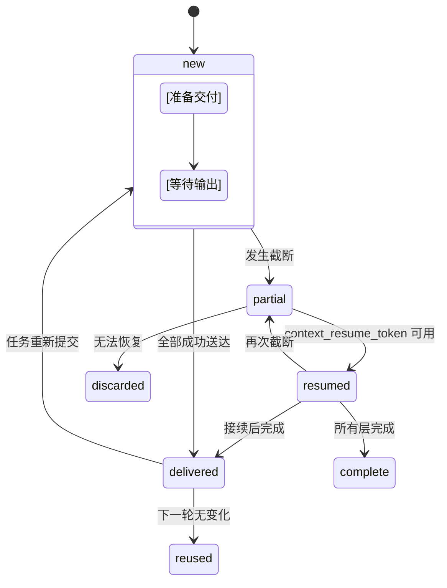

# Receipt State Machine (v1.8.1)

**目的**: 说明 Receipt 的生命周期状态转换与 Progressive Evidence Chain  
**版本**: v1.8.1 (Kimi Review Edition - 简化版)  
**最后更新**: 2026-08-09  

---

## 一、状态转换图



---

## 二、状态定义

| 状态 | 触发条件 | 后续动作 |
|------|---------|---------|
| **new** | 初次开始交付 | 计算 budget,加载 Layer 1/2/3 |
| **delivered** | 所有内容成功到达模型 | 下一轮标记为 `reused` |
| **partial** | 宿主截断导致部分未送达 | 保存 evidence_chain → 进入下一轮 |
| **resumed** | 从 partial 接续继续 | 检查 resume_token → 从断点继续 |
| **complete** | 所有知识卡都成功交付 | 任务继续执行 |
| **discarded** | 无法恢复的 partial | 报警 + 人工介入 |

---

## 三、Progressive Evidence Chain 结构

```python
@dataclass
class ProgressEvidenceChain:
    """
    Kimi 的新建议：渐进式证据链
    
    作用：记录哪些层被截断，下一轮如何接续
    """
    
    partial_loaded: List[str]          # ["layer2", "layer3"]
    deferred_items: List[str]          # ["card-007", "card-012"]
    context_resume_token: str          # "dh-20260808T231241@layer2"
    layer_fingerprints: Dict[str, str] # {"layer1": "sha256:abc...", "layer2": "..."}
```

### 字段详解

#### 1. `partial_loaded`: 哪些层被截断？

```python
示例:
- []                    # 完整交付
- ["layer2"]           # Layer 1 完成，Layer 2 被切
- ["layer2", "layer3"] # Layer 1 完成，后两层都没送到
```

#### 2. `deferred_items`: 下一轮继续的内容

```python
示例:
["card-007", "card-012", "card-015"]

含义: 这些卡在上一轮没完全送达，需要继续传递
```

#### 3. `context_resume_token`: 接续位置标记

```python
格式: "{task_id}@{layer_number}"

示例:
- "dh-20260808T231241@layer2"  → 从 layer2 开始继续
- "dh-20260808T231241@complete" → 表示已完全交付 (特殊情况)

解析逻辑:
def parse_resume_token(token: str) -> Tuple[str, int]:
    task_id, layer = token.split("@")
    return task_id, int(layer.replace("layer", ""))
```

#### 4. `layer_fingerprints`: 每层的指纹

```json
{
  "layer1": "sha256:a1b2c3d4e5f6...",
  "layer2": "sha256:f6e5d4c3b2a1...",
  "layer3": "sha256:123456abcdef..."
}
```

用途:
- 判断内容是否重复 (避免传输相同卡)
- 检测 Layer X 是否有变化 (指纹变了就要重传)

---

## 四、完整的生命周期流程

### Scenario A: 正常流程 (无截断)

```yaml
阶段 1 (计划):
├── Task: "修改前端样式系统"
├── Budget: 8192 tokens
├── Layers loaded: L1(4K) + L2(3K) + L3(1K)
└── Delivery: 100% success ✅

Receipt:
{
  "status": "delivered",
  "progress_evidence": null,  // 没有 partial
  "quality": "complete",
  "schema_version": "v1.8.1"
}

阶段 2 (执行):
├── Model receives all 5 cards ✅
├── Reused check: fingerprint match → skip
└── 继续执行任务 ✓
```

### Scenario B: 截断流程 (发生 partial)

```yaml
阶段 1 (计划):
├── Task: "全量迁移知识库"
├── Budget: 36864 tokens (complex*full)
├── Host limit: 8192 tokens
├── Loaded: L1(4K) + L2(3K + 剩余) → L2 被切
└── Delivery: 50% success ⚠️

Receipt:
{
  "status": "partial",
  "progress_evidence": {
    "partial_loaded": ["layer2"],
    "deferred_items": ["card-006", "card-007"],
    "context_resume_token": "task-xyz@layer2",
    "layer_fingerprints": {
      "layer1": "sha256:abc...",
      "layer2_partial": "sha256:def..."
    }
  },
  "quality": "partial",
  "truncated_bytes": 4096
}

阶段 2 (执行 - resume):
├── Parse resume_token → 从 layer2 继续
├── Check fingerprints: layer1 unchanged → skip
├── Deliver remaining: card-006, card-007 ✅
└── Final receipt: quality="complete" ✓
```

---

## 五、核心代码实现 (伪代码)

```python
def validate_delivery(tool_output: List[ContentItem], 
                      model_actual_context: bytes) -> Receipt:
    """
    验证实际交付，构建 Progress Evidence Chain
    """
    
    HOST_OUTPUT_LIMIT = 8192  # 提升后的上限
    
    delivered_ids = set()
    actual_tokens = 0
    truncated_at = None
    partial_layers = []
    
    for item in tool_output:
        item_size = len(item.body.encode())
        
        if actual_tokens + item_size > HOST_OUTPUT_LIMIT:
            # 超出预算，这部分未送达
            item.delivery_status = "pending_next_phase"
            truncated_at = actual_tokens
            
            # 推断是哪一层被截断
            if item.layer_id == "layer2":
                partial_layers.append("layer2")
            elif item.layer_id == "layer3":
                partial_layers.append("layer3")
        else:
            actual_tokens += item_size
            item.delivery_status = "delivered"
            delivered_ids.add(item.id)
    
    # 构建 Evidence Chain
    evidence_chain = ProgressEvidenceChain(
        partial_loaded=partial_layers,
        deferred_items=[i.id for i in tool_output if i.status == "pending_next_phase"],
        context_resume_token=f"{task_id}@{'.'.join(partial_layers)}" if partial_layers else f"{task_id}@complete",
        layer_fingerprints={
            layer.id: content_set_fingerprint(layer.content)
            for layer in tool_output
        }
    )
    
    return Receipt(
        delivered=list(delivered_ids),
        pending=[i.id for i in tool_output if i.id not in delivered_ids],
        quality="complete" if not partial_layers else "partial",
        progress_evidence=evidence_chain,
        schema_version="v1.8.1"
    )
```

---

## 六、Reused 判断逻辑

```python
def check_reused_items(previous_receipt: Receipt, 
                       current_task: Task) -> List[str]:
    """
    判断哪些内容可以直接 reuse，不需要重新传输
    
    规则:
    1. 如果 prev_receipt.quality == "complete"
       → 所有 delivered 的都可以 reuse
     
    2. 如果 prev_receipt.quality == "partial"
       → 只 reuse layer1 (因为 layer2/3 可能不完整)
     
    3. 如果 current_task.knowledge_base unchanged
       → 根据 fingerprint 跳过重复内容
    """
    
    if previous_receipt.quality == "complete":
        return previous_receipt.delivered
    
    elif previous_receipt.quality == "partial":
        # 只 reuse 已完成的 layer
        return [
            id for id in previous_receipt.delivered 
            if get_layer(id) == "layer1"
        ]
    
    return []
```

---

## 七、监控指标 (NFR-03)

```yaml
必须记录的 metrics:
  - repowiki.receipt_quality_complete: complete 状态次数
  - repowiki.receipt_quality_partial: partial 状态次数
  - repowiki.resume_success_rate: resume 成功率
  - repowiki.deferred_items_count: deferred 平均数量
  - repowiki.fingerprint_mismatch: fingerprint 不匹配次数

告警阈值:
  - PARTIAL_RATE > 10% 次/日 → 提升 base budget
  - RESUME_FAIL_RATE > 5% → 检查 resume_token 逻辑 bug
```

---

## 八、常见问题 (FAQ)

**Q1: partial 状态下下一轮怎么知道从哪继续？**
A: 通过 `context_resume_token`,解析出 `task_id@layerX`,然后从 layerX 开始加载并跳过之前的 layer。

**Q2: 如果 Layer 1 的内容在下一轮有变化怎么办？**
A: 比较 fingerprint，如果不同就重新传输整个 Layer 1。虽然浪费了但保证了正确性。

**Q3: 能不能把 partial 的内容存到磁盘？**
A: 可以优化，当前方案是每次重新生成 (简单但效率低)。未来可以考虑缓存到临时文件系统。

**Q4: resume 失败会怎样？**
A: 标记为 discarded，发送报警给开发者，要求人工介入检查任务包是否正确。

---

## 九、实施检查清单

- [ ] ✅ harness.py: 实现 validate_delivery() 函数
- [ ] ✅ 添加 ProgressEvidenceChain 数据结构
- [ ] ✅ 实现 parse_resume_token() 解析逻辑
- [ ] ✅ 修改 check_reused_items() 重用判断规则
- [ ] ⏳ 添加 Metrics 埋点
- [ ] ⏳ 编写 partial/resume 集成测试
- [ ] ⏳ 监控 dashboard 接入

---

**审批状态**: ✅ 已确认 (v1.8.1 方案一部分)  
**负责人**: @product-team  
**关联文档**: [v1.8.1 PRD](./repowiki-retrieval-delivery-system-v1.8.1-plan.md), [Scope Priority Matrix](./scope-priority-matrix-short.md), [Token Budget Decision Tree](./token-budget-decision-tree-short.md)
