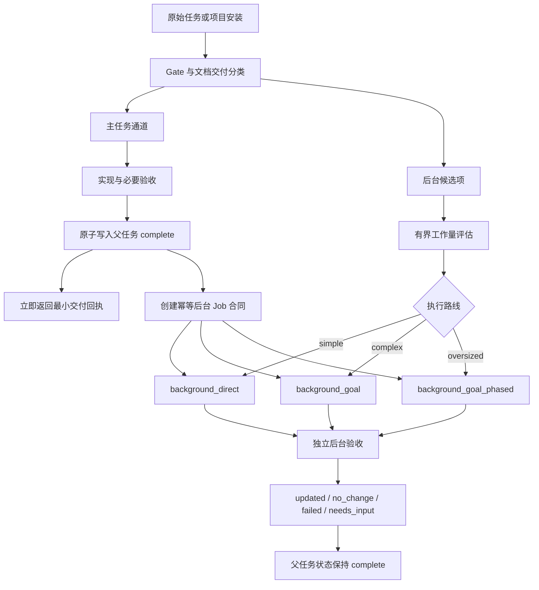

# Docs Harness v1.4.0 主交付优先与异步文档治理系统方案

状态：已实现（源码与本地运行验收完成；发布交付层未建立）  
方案版本：1.0  
目标版本：Docs Harness v1.4.0  
适用范围：项目安装、功能知识库初始化、日常研发任务、交付后文档治理  
决策依据：当前 v1.3.0 能力、会话 `019fc78f-26bc-7633-9344-f41237ebe41d` 以及本轮确认的非阻塞原则

实施验收：控制器候选指纹为 `3d71c756bb9fc5c7030ac5b4574cf477dbc1a915e9739297a20d96435e41f46e`；67 项自动化回归、内置自检和 npm 打包检查通过；同一候选安装快照已在真实 Codex 子智能体宿主分别完成 `background_direct` 与 `background_goal` 验收，复杂路线实际建立持续目标、绑定方案和跨回合进度。自动化覆盖临时 Git/fresh clone、安装、升级、卸载和兼容路径。当前源码目录本身不是 Git 仓库，因此没有当前目录的提交 HEAD、远端推送或发布证明；宿主未提供 `user_response_emitted_at`，结论限于“后台状态不阻塞响应生成”，不扩大为“用户界面零等待”。Claude Code 仅完成方案只读审查，未作为本轮实现后的真实运行宿主。

## 1. 执行摘要

Docs Harness v1.4.0 将“用户价值交付”和“文档治理闭环”拆成相互关联但状态独立的两条通道：

1. 主任务通道负责功能实现、用户明确要求的交付物和必要验收；条件成立后立即完成并向用户交付。
2. 后台治理通道负责知识库初始化、知识增量同步、ADR、Changelog、TODO、完整证据报告和其他非阻塞文档工作。

所有后台文档任务使用统一 Job 引擎，根据预判工作量路由为：

- `background_direct`：简单任务，派发一个有界后台子智能体直接完成；
- `background_goal`：复杂任务，派发一个目标型后台子智能体，先建立目标与方案，再按工作包执行；
- `background_goal_phased`：超大型任务，由一个目标 Owner 分阶段推进，必要时再拆分互不重叠的功能工作包。

知识缺失、知识库正在构建或后台 Job 失败，都不阻塞后续业务任务。任务保留原准入状态，同时以 `context_quality=degraded` 标记上下文降级，明确缺少什么、当前由哪个 Job 构建，以及执行时需要现场核实哪些事实。只有控制规则、授权、安全、范围和必要验收异常继续失败关闭。

本版本不是 v1.3.1 级别的小修复。它改变了任务完成模型、文档交付分类、安装后流程和宿主调度合同，因此版本号定为 v1.4.0。

## 2. 背景与现状

### 2.1 当前 v1.3.0 已具备的能力

- 项目内建立按功能组织的产品、研发、测试、设计知识文档；
- 通过知识地图按功能和 Gate 动态加载上下文；
- 新项目创建知识骨架，已有 `docs/` 的项目先审查再请求更新同意；
- 主任务 `verify` 完成后生成知识维护 Job；
- 主任务完成状态与后台知识 Job 状态解耦；
- 已实现 Job 幂等、防递归、功能锁、基线漂移、越界写入保护和重试；
- Git 交付检查覆盖知识地图及其声明的文档。

### 2.2 当前缺口

1. 安装只返回 `knowledge_flow`，没有确定性预判工作量并自动选择后台执行路线。
2. 新项目知识初始化仍需要调用方串联审查、Job 和宿主调度，缺少完整异步编排合同。
3. 知识缺失目前可能阻断任务准入，与“知识构建不能阻塞业务主流程”的新原则冲突。
4. 后台 Job 只覆盖知识同步，ADR、Changelog、TODO、证据整理等仍可能留在主链路。
5. 简单任务和复杂任务没有不同的宿主执行合同。
6. 初始化目标运行期间产生的增量知识没有合并队列，可能形成并发写入竞争。
7. 后台发现重大问题时，缺少“不篡改父任务历史、但建立高优先级跟进”的标准机制。

## 3. 目标、非目标与成功标准

### 3.1 产品目标

1. 功能与必要验收完成后，用户立即获得主任务结果。
2. 所有可以延后的文档工作自动进入后台，不占用用户等待时间。
3. 简单文档任务直接执行，复杂文档任务通过“目标 + 方案 + 工作包”执行。
4. 知识库不完整时，后续任务仍可执行，并获得透明的上下文完整度提示。
5. 后台任务失败、排队或需要人工处理，不回滚已经成立的主任务完成状态。
6. 主任务、后台 Job、Git 交付和真实宿主执行分别提供证据，不互相冒充。

### 3.2 非目标

- Harness 不直接绕过宿主创建真实 Agent；它生成可执行合同，由宿主调度。
- 不把所有文档一律异步化；本身属于用户交付物或必要验收依据的文档仍留在主任务。
- 不自动提交、推送、发布或修改 `.gitignore`。
- 不在知识缺失时编造项目事实。
- 不允许后台 Job 修改主代码或超出合同写入范围。
- 不通过后台结果删除或改写父任务的历史完成事件。

### 3.3 版本成功标准

- 安装命令在有界扫描后返回工作量等级和后台调度合同，不等待知识文档生成；
- 简单项目能够真实派发 `background_direct` 子智能体；
- 复杂项目能够真实派发 `background_goal` 子智能体，并在子智能体内建立目标、方案和工作包；
- 知识状态为 `building|partial|failed|quarantined` 时，业务任务保留可执行准入状态并返回 `context_quality=degraded`，而不是因知识缺失被阻断；
- 主任务完成时间早于后台 Job 运行和完成时间；
- 后台失败、超时或重试不改变父任务 `complete`；
- 初始化 Job 与日常增量 Job 不发生未受控并发写入；
- 当前 v1.3 知识 Job 命令在迁移期仍可使用；
- 单元测试、临时项目、真实 Git/fresh clone 和支持子智能体的真实宿主全部通过分层验收。

## 4. 核心产品原则

### 4.1 用户价值优先

主任务只等待用户价值交付所必需的实现和验收。非阻塞文档治理不进入主任务完成条件。

### 4.2 最小交付证据同步产生

主任务执行过程中持续记录最小必要证据，结束时直接生成交付回执，不在功能完成后重新启动大规模证据整理。

### 4.3 知识缺失只降级上下文，不阻塞业务

知识库是增强上下文，不是全局许可开关。缺少知识时必须透明披露并现场核实，但允许业务任务继续。

### 4.4 控制面继续失败关闭

规则损坏、授权不足、安全边界、不可逆操作、任务范围变化和必要证据不足仍然阻断。不能用“后台处理”绕过控制面要求。

### 4.5 父任务完成事实不可变

后台 Job 不得把父任务从 `complete` 改回其他状态。后台发现重大问题时创建独立高优先级跟进，不篡改历史。

### 4.6 一个异步引擎，多种文档任务

知识初始化、知识增量和交付治理复用相同的 Job、锁、基线、重试和宿主调度机制，避免形成多套状态机。

## 5. 文档交付分类

Gate 在任务准入时把文档要求编译为 `blocking_deliverables` 和 `background_deliverables`。分类依据是文档的产品角色，而不是文件扩展名。

### 5.1 必须阻塞主任务的文档

- 用户在当前任务中明确要求交付的文档；
- API、协议、数据库结构或迁移说明；
- 部署、运行、恢复、回滚和应急手册；
- 安全审批、权限边界或不可逆决策所需 ADR；
- 产品验收标准本身；
- 缺少后无法证明功能可用、兼容或可恢复的证据；
- 即使用户没有显式点名，但属于当前功能必要验收前提的文档；
- 法律、合规或外部发布明确要求同步完成的材料。

### 5.2 默认进入后台的文档

- 事后整理型 ADR；
- Changelog 和版本摘要；
- TODO、复盘和经验整理；
- 功能知识库增量同步；
- 完整证据报告、截图归档、去重、脱敏和排版；
- 非本次交付范围的扩大回归报告；
- 非阻塞的独立审查；
- 用户未明确要求立即交付的治理材料。

### 5.3 分类覆盖规则

优先级从高到低：

1. 用户明确要求；
2. 安全、数据和不可逆操作要求；
3. Gate 与规则合同；
4. 项目配置中的交付策略；
5. 默认分类。

任何自动分类都不能把用户明确要求的文档降级为后台任务。

宿主能力不参与交付分类。宿主是否支持后台、目标或分阶段执行，只影响后台候选项的调度路线，不能把本来必须同步交付的内容改成后台任务。

## 6. 总体架构



架构包含四个逻辑组件：

1. `Delivery Classifier`：判断哪些内容必须同步交付。
2. `Workload Estimator`：有界预判文档工作量并选择路线。
3. `Background Job Controller`：统一管理 Job 合同、状态、锁、基线与重试。
4. `Host Adapter Contract`：指导 Codex、Claude Code 等宿主真实派发子智能体。

## 7. 工作量评估器

### 7.1 命令

```bash
python3 scripts/harness.py knowledge estimate --target . --json
```

通用后台候选项也可以调用：

```bash
python3 scripts/harness.py background estimate \
  --target . \
  --candidate <candidate.json> \
  --json
```

### 7.2 扫描边界

- Git 项目优先使用 `git ls-files --cached --others --exclude-standard`；
- 非 Git 项目使用与工作区冻结相同的排除规则；
- 忽略 `.git/`、依赖缓存、构建产物、二进制大文件、Runtime 和疑似凭据路径；
- 只读取路径、大小、语言、目录分布和有界文本摘要，不在安装主链路深读全部源码；
- 扫描上限沿用 4096 个有效文件；达到上限时不截断后声称简单，而是直接提升为 `oversized`；
- 目标是快速路由，不承担最终知识审查职责。

### 7.3 v1 评分模型

总分 100。各维度分值均为整数且直接相加为 `raw_score`，区间没有空档。任一硬升级条件可以提高执行路线，但不篡改原始分数。

| 维度 | 取值 | 分值 |
|---|---:|---:|
| 有效源码文件 | `≤150 / 151–800 / 801–3000 / >3000` | `0 / 8 / 16 / 24` |
| 可识别功能候选 | `≤5 / 6–15 / 16–40 / >40` | `0 / 8 / 16 / 22` |
| 架构域或应用端 | `1 / 2 / 3–4 / ≥5` | `0 / 5 / 10 / 15` |
| 技术栈数量 | `1 / 2 / 3 / ≥4` | `0 / 4 / 8 / 12` |
| 四类功能文档缺口 | `<25% / 25–60% / >60% / 无地图` | `0 / 8 / 14 / 18` |
| 跨功能依赖 | `低 / 中 / 高` | `0 / 4 / 9` |

路线阈值：

- `0–24`：`simple → background_direct`；
- `25–59`：`complex → background_goal`；
- `60–100`：`oversized → background_goal_phased`。

硬升级条件：

- 扫描超过安全上限；
- 包含多个独立应用、服务或平台且无法归入单一功能域；
- 现有 `docs/` 存在大量用户文档，需要 preserve-and-merge；
- 功能依赖形成循环或无法确定所有者；
- 单个子智能体上下文无法覆盖所需证据；
- 用户明确要求方案、目标或分阶段执行。

发生硬升级时，响应同时保留 `raw_score`、评分原始路线和 `route_override_reason`，最终 `execution_route` 取“评分路线”和“硬升级路线”中更复杂的一方，禁止把硬升级后的路线伪装成评分结果。

### 7.4 评估输出

```json
{
  "schema_version": "docs-harness/workload-estimate/v1",
  "workload_class": "complex",
  "raw_score": 47,
  "score_route": "background_goal",
  "route_override_reason": null,
  "confidence": "medium",
  "reasons": [
    "识别到 18 个功能候选",
    "包含桌面端、Runtime 和服务端",
    "四类知识文档覆盖率低于 40%"
  ],
  "execution_route": "background_goal",
  "requires_plan": true,
  "blocking_main_task": false,
  "scan_file_count": 682,
  "scan_truncated": false,
  "suggested_work_packages": [
    "功能识别与知识地图",
    "功能文档补全",
    "公共知识层",
    "一致性与交付验收"
  ]
}
```

评估结果必须保存指纹；源文件集合变化后重新评估，不能沿用失效结论。

## 8. 统一后台 Job 模型

### 8.1 Job 类型

```text
knowledge_bootstrap
knowledge_incremental_sync
delivery_governance
critical_followup
```

`critical_followup` 是后台发现核心问题后创建的独立跟进合同，不是父任务状态回滚。

### 8.2 统一 Schema

```json
{
  "schema_version": "docs-harness/background-job/v1",
  "job_id": "bg-<timestamp>-<suffix>",
  "task_kind": "knowledge_bootstrap",
  "parent_task_id": null,
  "parent_job_id": null,
  "may_mutate_parent": false,
  "suppress_post_completion_dispatch": true,
  "status": "contract_ready",
  "execution_route": "background_goal",
  "workload_estimate_ref": ".docs-harness/background/estimates/<id>.json",
  "feature_ids": ["feature-a"],
  "candidate_categories": ["product", "development", "testing", "design"],
  "allowed_read_scope": ["src/**", "tests/**", "docs/**"],
  "allowed_write_scope": ["docs/features/**", "docs/shared/**", "docs/knowledge-map.json"],
  "forbidden_write_scope": ["src/**", "tests/**", ".git/**"],
  "base_fingerprints": {},
  "goal_contract": {},
  "work_packages": [],
  "dependency_job_ids": [],
  "attempt": 1,
  "max_attempts": 3,
  "created_at": "<timestamp>",
  "updated_at": "<timestamp>"
}
```

### 8.3 Job 状态

```text
contract_ready
dispatched
running
waiting_for_dependency
waiting_for_bootstrap_merge
queued_manual
updated
no_change
completed_with_finding
needs_user_input
needs_rebase
failed
cancelled
```

终态为 `updated|no_change|completed_with_finding|failed|cancelled`。`needs_user_input|needs_rebase|queued_manual` 可通过显式重试重新进入 `contract_ready`。达到 `max_attempts` 后只能进入 `failed` 或由用户显式创建新 Job，不能无限循环。

### 8.4 状态约束

- 每个状态转换写入 append-only 事件；
- 相同父任务和 Job 类型使用稳定幂等键；
- 已运行或终结的相同 Job 不重复派发；
- 进入 `running` 前校验基线和锁；
- `updated` 前校验实际写入范围、文档完整度和地图一致性；
- `no_change` 要求知识基线没有变化；
- `critical_followup` 必须具备非空 `parent_task_id` 和 `parent_job_id`，其他初始化 Job 可以没有父任务；
- 所有 Job 固定 `may_mutate_parent=false`，任意终态都不能修改父任务 `control_status`。

### 8.5 允许的状态转换

| 当前状态 | 允许的下一状态 |
|---|---|
| `contract_ready` | `dispatched|queued_manual|cancelled` |
| `dispatched` | `running|queued_manual|failed|cancelled` |
| `running` | `waiting_for_dependency|waiting_for_bootstrap_merge|updated|no_change|completed_with_finding|needs_user_input|needs_rebase|failed|cancelled` |
| `waiting_for_dependency` | 依赖完成后进入 `contract_ready`，依赖失败后进入 `failed|cancelled` |
| `waiting_for_bootstrap_merge` | 合并完成后进入 `updated|no_change`；初始化释放或失败后刷新基线并进入 `contract_ready` |
| `needs_user_input|needs_rebase|queued_manual` | 显式重试后进入 `contract_ready`，或进入 `cancelled` |
| 终态 | 不允许继续转换 |

`knowledge_bootstrap` 已处于 `dispatched|running` 时，新产生的 `knowledge_incremental_sync` 直接创建为 `waiting_for_bootstrap_merge`，不先进入 `running`。其退出条件由第 12 节的合并与重建基线规则决定。

`waiting_for_dependency` 只允许用于 `background_goal_phased` 的显式工作包依赖，或一个后台 Job 在合同中声明了非空 `dependency_job_ids` 的情况。依赖必须是同一项目内可验证的 Job ID；没有显式依赖的 Job 不得进入该状态。

## 9. 两类宿主执行合同

### 9.1 简单任务：`background_direct`

宿主动作：

1. 非阻塞创建一个后台子智能体；
2. 将 Job 合同作为唯一任务范围；
3. 子智能体先报告 `running`，再读取和写入；
4. 只允许写入 `allowed_write_scope`；
5. 完成后提交 `updated` 或 `no_change`；
6. 不等待子智能体才向用户报告父任务完成。

适用条件：工作量简单、单功能或少量文档、一次上下文可以安全完成。

### 9.2 复杂任务：`background_goal`

宿主先创建一个目标型后台子智能体。子智能体内部必须：

1. 按 `goal_contract.objective` 建立持续目标；
2. 读取工作量评估和允许范围；
3. 形成正式方案，明确功能拆分、事实来源、验收和停止条件；
4. 将方案绑定到 Job 指纹；
5. 按工作包逐步执行并保存进度；
6. 每个功能独立验收，最后再执行全局知识地图一致性验收；
7. 目标完成或真正受阻后更新 Job；
8. 不向父任务传播完成状态变更。

`goal_contract` 最少包含：

```json
{
  "objective": "遍历当前项目并建立 L2 功能知识库",
  "success_criteria": [
    "所有已识别功能具备四类文档",
    "公共知识无无意义重复",
    "知识地图、文件和项目事实一致"
  ],
  "plan_required": true,
  "progress_persistence": true,
  "stop_conditions": [
    "需要用户选择产品语义",
    "项目事实相互矛盾",
    "写入范围或基线发生变化"
  ]
}
```

### 9.3 超大型任务：`background_goal_phased`

- 只建立一个初始化目标 Owner，避免多个 Agent 同时改写功能目录和知识地图；
- Owner 可以为互不重叠的功能域生成工作包；
- 工作包只能在独立功能路径并行，公共层与知识地图统一串行合并；
- 每批完成后保存功能级进度，不要求一次会话完成全部项目；
- 未完成期间知识状态保持 `building`，业务任务仍可降级执行。

### 9.4 宿主能力降级

- 完全不支持子智能体：返回 `queued_manual` 和完整人工命令；
- 支持后台子智能体但不支持持久目标：`background_direct` 正常派发，`background_goal|background_goal_phased` 保持 `queued_manual`；
- 支持目标但不支持多工作包并行：由单一目标 Owner 串行执行，不擅自降级成直接任务；
- 支持全部能力：按合同执行原路线。

复杂路线不能静默降级为 `background_direct`，否则会绕过已经判定必需的方案、目标和进度持久化。主任务和安装结果仍可完成，但必须显示后台治理尚未执行或能力受限。

## 10. 知识库初始化流程

### 10.1 新项目没有 `docs/`

1. `project init` 创建最小骨架和空知识地图；
2. 控制器执行有界 `knowledge estimate`；
3. 创建 `knowledge_bootstrap` Job；
4. 安装结果立即返回 `installed`，知识状态为 `building`；
5. 宿主按评估路线异步派发子智能体；
6. 后台遍历项目、建立功能地图和四类文档；
7. 通过独立验收后切换为 `ready`。

安装动作已经授权首次初始化，不再请求第二次同意。

### 10.2 项目已有 `docs/`

1. 安装阶段零内容写入；
2. 执行只读盘点和工作量评估；
3. 若现有文档完整，只补充结构化地图且进入验收；
4. 若不完整，返回缺口、评估等级和建议路线；
5. 询问用户是否允许更新；
6. 用户同意后创建后台 Job，拒绝则只在本地 Runtime 保存回执；
7. 后台必须 preserve-and-merge，不覆盖用户已有内容。

用户同意只授权文档范围，不授权代码、提交、推送或发布。

同意或拒绝回执绑定以下内容：审查报告指纹、受控文档范围、当前知识地图或文档盘点指纹和记录时间。默认不设置时间失效，但在相关文档集合或审查缺口发生实质变化后失效。有效拒绝回执存在时不重复询问；只有指纹变化、用户主动发起更新或用户撤销原决定时才重新询问。有效同意回执不能扩大到新增范围，范围增加时必须重新取得同意。

### 10.3 安装返回示例

```json
{
  "status": "installed",
  "runtime_status": "healthy",
  "knowledge_status": "building",
  "clone_ready": false,
  "knowledge_flow": {
    "mode": "bootstrap_new",
    "workload_class": "complex",
    "execution_route": "background_goal",
    "blocking_install": false,
    "job_id": "bg-...",
    "dispatch_required": true
  }
}
```

`clone_ready=false` 只表示知识文档尚未形成并进入 HEAD，不影响本机控制器安装完成。

## 11. 知识不完整时的降级准入

### 11.1 上下文质量

降级不是新的互斥准入状态。任务继续使用 `ready_direct|ready_planned|ready_extended`，并通过 `context_quality=degraded` 表达知识完整度：

```json
{
  "admission_status": "ready_direct",
  "context_quality": "degraded",
  "knowledge_context": {
    "status": "building",
    "coverage": "partial",
    "selected_features": ["report-export"],
    "loaded_categories": ["development"],
    "missing_categories": ["product", "testing"],
    "active_job_id": "bg-...",
    "fallback_required": true
  }
}
```

CLI 展示层可以显示“降级准入”，但 Schema 和状态机中不存在 `ready_degraded`。这样不会破坏依赖既有 `admission_status` 的调用方。

### 11.2 降级执行补偿

智能体必须：

1. 从当前允许范围内的代码、测试、配置和有效文档现场核实事实；
2. 在任务包记录 `fallback_fact_refs`；
3. 把无法确认的信息标记为假设或待确认；
4. 不把推测写入知识真源；
5. 主任务完成后创建或合并知识增量 Job。

### 11.3 不阻塞的知识异常

- `absent`；
- `needs_bootstrap`；
- `building`；
- `partial`；
- 初始化或同步 Job `failed`；
- 知识地图 `quarantined`，此时不加载不可信内容。

### 11.4 继续失败关闭的控制异常

- Harness Home 缺失、规则为空或规则指纹漂移；
- 任务范围、目标或 Gate 变化；
- 必要授权缺失或失效；
- 安全、数据、发布和不可逆操作没有满足前置条件；
- 用户明确要求的交付层没有完成；
- 最小必要证据不足；
- 计划或证据合同无效。

判定规则是：

- 缺少产品背景、历史决策或功能知识文档，只降低 `context_quality`；
- 缺少证明本次业务结果成立的行为证据、用户指定交付层证据、安全证据或恢复证据，继续失败关闭；
- 知识文档不能替代任务证据，任务证据也不能反向伪装成已完成的知识库；
- 降级执行现场读取到的代码和测试可以成为任务事实引用，但只有经过本任务证据合同验证后才能满足必要验收。

## 12. 初始化与增量 Job 的合并队列

当 `knowledge_bootstrap` 正在运行时，日常任务产生的 `knowledge_incremental_sync` 不直接竞争写入。

处理规则：

1. 增量 Job 创建后进入 `waiting_for_bootstrap_merge`；
2. 保存父任务、功能、类别、实际变化路径和最小证据引用；
3. 初始化目标 Owner 在处理对应功能时吸收增量事实；
4. 合并成功后把增量 Job 标记为 `merged` 事件，最终状态为 `updated|no_change`；
5. 初始化目标已处理过该功能时，增量 Job 在功能锁释放后独立运行；
6. 初始化失败时，增量 Job 重新进入可调度队列，不随初始化目标一起失败；
7. 增量 Job 离开 `waiting_for_bootstrap_merge` 前必须废弃创建时的知识基线，读取初始化后的当前工作区或当前 HEAD，重新生成 `base_fingerprints`；
8. 增量更新基于父任务的结构化变化事实重新计算，禁止重放针对旧文档生成的文本补丁；
9. 新基线与父任务事实发生冲突时进入 `needs_rebase|needs_user_input`，不得以最后写入者覆盖初始化结果。

锁粒度：

- 功能文档：`feature:<feature-id>`；
- 公共知识：`shared:<category>`；
- 知识地图与索引：`catalog`；
- 交付治理文档：按实际路径锁定。

锁只保护后台写入，不阻塞业务代码任务。

## 13. 日常任务完成后的异步治理

### 13.1 主任务同步阶段

主任务只同步完成：

- 实现范围内的变更；
- 用户明确要求的交付物；
- 必要验证；
- 最小交付回执；
- 后台候选项与 Job 合同创建。

### 13.2 最小交付回执

```json
{
  "result": "完成",
  "control_status": "complete",
  "delivered_value": ["本次实际完成的用户结果"],
  "acceptance_layers": ["source", "local_runtime"],
  "minimum_evidence": ["test_result:passed"],
  "known_limit_codes": ["remote_delivery_not_verified"],
  "known_limit_details": ["尚未验收远端发布"],
  "background": {
    "status": "dispatch_required",
    "jobs": ["bg-knowledge-...", "bg-governance-..."]
  }
}
```

`known_limit_codes` 使用受控枚举，首版至少包含：`source_not_verified`、`local_runtime_not_verified`、`ui_not_verified`、`release_artifact_not_verified`、`remote_delivery_not_verified`、`external_state_not_verified`。人类可读说明进入 `known_limit_details`，不能只靠自由文本表达验收层级。

### 13.3 后台治理候选项

控制器对候选项去重后，可以生成一个或多个 Job：

- 相同功能的知识更新合并为一个 Job；
- ADR、Changelog、TODO 可以在写入范围不冲突时合并为一个 `delivery_governance` Job；
- 完整证据报告只引用脱敏索引，不复制原始日志和凭据；
- 质量账本仍然只有用户明确要求时才写入，不能因统一异步引擎而改为自动记录。

## 14. 后台发现重大问题

后台 Job 可能发现实现与文档、验证或安全边界不一致。处理方式：

1. 父任务 `complete` 和原始验收事件保持不变；
2. Job 记录 `critical_finding`；
3. 控制器创建 `critical_followup` 合同；
4. 项目状态展示 `delivery_confidence=questioned`；
5. 后续高风险任务加载该跟进项；
6. 只有新的修复任务可以形成新的完成事实。

这不是隐瞒错误，而是把“当时成立的交付事实”和“后来发现的新事实”分开审计。

发现严重问题不是 Job 运行失败：原 Job 进入终态 `completed_with_finding`，并通过稳定幂等键只创建一个 `critical_followup`。该状态和事实冲突禁止自动重试，避免重复生成严重事件。`critical_followup` 必须绑定父任务和发现它的父 Job，且 `may_mutate_parent=false`。

## 15. CLI 与兼容性设计

### 15.1 新命令

```bash
python3 scripts/harness.py knowledge estimate --target . --json
python3 scripts/harness.py knowledge bootstrap --target . --assessment <file> --json

python3 scripts/harness.py background estimate --target . --candidate <file> --json
python3 scripts/harness.py background list --target . --json
python3 scripts/harness.py background status --target . --job-id <id> --json
python3 scripts/harness.py background dispatch --target . --job-id <id> --job-status running --json
python3 scripts/harness.py background verify --target . --job-id <id> --assessment <file> --json
python3 scripts/harness.py background retry --target . --job-id <id> --json
python3 scripts/harness.py background prune --target . --older-than 30 --dry-run --json
```

### 15.2 v1.3 兼容层

以下命令在 v1.4.0 内继续支持，内部转发到统一后台控制器：

```text
knowledge job-status
knowledge dispatch
knowledge verify
knowledge retry
```

响应增加 `deprecated_alias=true`，CLI `--help` 同步显示替代命令，但不改变退出码和已有核心字段。v1.4.0 不承诺在 v1.5.0 自动移除；未来只有同时具备迁移命令、兼容测试、明确弃用说明和独立 ADR 时才能决定移除。由于 Harness 不收集遥测，不能用未经证明的“用户已经迁移”作为删除依据。

### 15.3 配置升级

项目配置升级为 `docs-harness/project-config/v4`：

```json
{
  "background_governance": {
    "enabled": true,
    "non_blocking": true,
    "workload_estimator": "v1",
    "simple_threshold": 24,
    "complex_threshold": 59,
    "host_dispatch": "required_when_supported"
  },
  "knowledge": {
    "allow_degraded_admission": true,
    "bootstrap_async": true,
    "post_completion_sync": true
  }
}
```

## 16. Runtime 与项目文件布局

Git 项目：

```text
<git-dir>/docs-harness/
  runs/
  background/
    estimates/
    jobs/<job-id>/
      job.json
      events.jsonl
      plan.json
      progress.json
    locks/
    queue/
  quality-ledger/
```

非 Git 项目使用：

```text
<project>/.docs-harness/background/
```

Runtime 不进入 Git。项目知识、ADR、Changelog 等真实文档仍按项目规则进入 Git 交付面。

Runtime 默认不自动删除，防止丢失审计与恢复证据。新增 `background prune --dry-run --older-than <days>` 只生成候选清单；只有用户显式 `--apply` 才能删除已处于终态且摘要已经进入本地索引的 Job。运行中、等待输入、需要重建基线和包含严重发现的 Job 永不进入自动候选。项目卸载默认保留后台 Runtime。

## 17. 安全、幂等与恢复

### 17.1 安全边界

- Job 明确 `allowed_read_scope`、`allowed_write_scope` 和 `forbidden_write_scope`；
- 写入前校验符号链接、相对路径和基线；
- 后台不得执行提交、推送、发布或外部写入，除非另有用户授权；
- 审查材料使用文件参数和字段白名单；
- 不保存原始环境、凭据、完整日志或会话正文。

### 17.2 幂等

幂等键建议为：

```text
sha256(task_kind + parent_task_id + feature_ids + candidate_categories + scope_fingerprint)
```

相同幂等键：

- `contract_ready|dispatched|running`：复用现有 Job；
- `updated|no_change` 且输入未变：返回已有结果；
- 既有输入已变化：创建新 attempt 或新 Job，不覆盖历史。

### 17.3 防递归

- 所有后台 Job 固定 `suppress_post_completion_dispatch=true`；
- 后台子智能体不得把自身文档更新再次编译为后台候选项；
- `critical_followup` 只能由明确的严重发现触发，不能自动执行修复。

### 17.4 失败与重试

- Job 创建失败：父任务仍完成，返回 `dispatch_failed`；
- 宿主不支持：`queued_manual`；
- 基线变化：`needs_rebase`；
- 需要产品选择：`needs_user_input`；
- 子智能体异常：`failed`；
- 显式 `retry` 刷新允许范围内基线并递增 attempt；
- 自动重试最多一次且只适用于原子写入暂时失败、锁竞争后的安全退避等瞬时 Runtime 错误；
- 网络、宿主能力不足、事实冲突、`critical_finding`、用户输入、越界写入和基线变化禁止自动重试；
- 显式重试和自动重试都受 `max_attempts` 限制，达到上限后进入 `failed`；如需继续，用户必须创建具有新幂等输入的新 Job。

## 18. 用户体验与状态展示

### 18.1 安装完成

```text
Docs Harness：已安装
知识库：后台构建中
工作量：复杂
执行方式：目标型后台子智能体
是否阻塞使用：否
Git 交付：知识文档完成并提交前 clone_ready=false
```

### 18.2 日常任务完成

```text
主任务：已完成并交付
必要验收：通过
后台治理：2 个任务已派发
知识完整度：部分，后台更新中
未覆盖层级：远端发布
```

### 18.3 后台失败

```text
主任务：仍为已完成并交付
后台治理：失败待重试
影响：文档可能过时，不影响当前功能完成事实
下一步：重试 bg-... 或人工处理
```

默认不持续打扰用户。只有 `needs_user_input`、`critical_finding` 或用户主动查询时展示后台详情。

失败 Job 写入 `stale_after`。超过该时间仍未处理时，`project check` 和后续相关功能任务显示黄色提醒，但不阻塞业务任务。Harness 自身不承诺推送通知；只有宿主具备通知能力且用户允许时，才由宿主发送一次提醒。

## 19. 实施拆分

### 阶段 A：合同与兼容层

- 新增统一 Job Schema、工作量评估 Schema、目标合同和状态机；
- 配置升级到 v4；
- 保留 v1.3 命令别名；
- 更新 SKILL、README、contracts、AGENTS 受管块和 Changelog。

### 阶段 B：工作量评估与安装异步化

- 实现有界 `knowledge estimate`；
- `project init` 创建初始化 Job，不等待文档生成；
- 已有文档保持审查和同意边界；
- 简单/复杂/超大型路线可确定性复现。

### 阶段 C：降级知识准入

- 移除“仅因知识缺失阻断业务任务”的逻辑；
- 增加 `context_quality`、缺失类别和 fallback 合同；
- 隔离损坏知识，不加载不可信内容；
- 保留控制面的失败关闭。

### 阶段 D：统一后台治理

- 将现有知识 Job 迁移到统一控制器；
- 增加 `delivery_governance` 候选项分类；
- 实现初始化与增量合并队列；
- 实现功能、公共层、目录和治理文档路径锁。

### 阶段 E：真实宿主合同与验收

- Codex：验证直接子智能体和目标型子智能体；
- Claude Code：验证受管入口能够按合同派发或正确降级为 `queued_manual`；
- 验证只支持直接后台、不支持持久目标的部分能力宿主不会把复杂 Job 静默降级；
- 验证完全不支持后台的宿主返回可执行人工命令；
- 验证父任务先完成、宿主只派发不等待；
- 验证后台完成、失败、重试和严重发现均不篡改父任务历史。

以上阶段属于同一个 v1.4.0 版本，可以分提交实现，但不能以缺少后续阶段的半成品发布。

## 20. 测试与分层验收

### 20.1 单元测试

- 工作量评分边界、硬升级和扫描上限；
- 新项目与已有 `docs/` 的不同授权分支；
- 文档阻塞项和后台项分类；
- 知识缺失时 `context_quality=degraded` 且任务可继续；
- 控制规则、授权和必要证据异常仍失败关闭；
- Job 幂等、防递归、状态转换、锁和重试；
- 初始化与增量 Job 的排队、合并和恢复；
- 后台越界写入、基线漂移和 `no_change` 冲突；
- `critical_followup` 不修改父任务状态；
- 同意与拒绝回执的指纹失效、避免重复询问和范围扩张重新授权；
- `max_attempts`、`completed_with_finding` 和禁止自动重试条件；
- v1.3 命令兼容。

### 20.2 临时项目验收

至少覆盖：

1. 简单非 Git 项目；
2. 复杂多模块 Git 项目；
3. 已有完整文档项目；
4. 已有不完整文档且用户拒绝更新；
5. 初始化过程中连续完成两个业务任务；
6. 初始化失败后增量 Job 独立恢复；
7. 损坏知识地图被隔离但业务任务继续。

### 20.3 fresh clone 验收

- 控制器和规则进入 HEAD 后 `controller_clone_ready=true`；
- 后台知识尚未完成时整体 `clone_ready=false`；
- 知识完成但未提交时仍为 `false`；
- 所有知识文档进入 HEAD 后 fresh clone `clone_ready=true`；
- Runtime、队列、锁和本地拒绝回执不进入 clone。

### 20.4 真实宿主验收

简单路线：

- 父任务先完成；
- 宿主创建一个后台子智能体后立即返回；
- 子智能体只写允许文档；
- 用户无需等待子智能体完成。

复杂路线：

- 宿主创建目标型后台子智能体；
- 子智能体先建立目标和方案；
- 工作包进度可以跨多个回合保持；
- 失败或需要输入不会回滚父任务；
- 最终验收后知识状态从 `building` 变为 `ready`。

### 20.5 时间顺序证据

验收必须记录：

```text
parent.completed_at
job.created_at
job.dispatched_at
job.started_at
user_response_emitted_at（宿主可提供时）
job.completed_at
```

至少证明：

```text
parent.completed_at <= job.created_at <= job.started_at < job.completed_at
```

宿主若不能证明用户响应时间，不得声称已经验证“界面上的用户完全无等待”，只能证明控制器和后台执行状态解耦。

如果宿主不能提供 `user_response_emitted_at`，发布验收必须改用两项较弱但可验证的证据：宿主的子智能体创建调用为非阻塞返回；父任务最终响应不读取、等待或依赖 Job 终态。此时结论只能写“后台状态不阻塞响应生成”，不能写“用户界面零等待”。

## 21. 发布与回滚

### 21.1 发布条件

- 全量旧测试通过；
- 新增合同和回归测试通过；
- 两种宿主路线至少各有一次真实验收；
- 至少验证一个部分支持宿主或能力模拟场景，以及一个完全不支持后台的 `queued_manual` 场景；
- 临时 Git 项目和 fresh clone 通过；
- 安装、升级、卸载 preserve-and-merge 通过；
- 本地源码、提交 HEAD、远端和 fresh clone 证据分别报告。

“用户界面无等待”只有在宿主提供 `user_response_emitted_at` 时才是发布证据；否则发布结论必须使用第 20.5 节定义的较弱表述，不得扩大证明层级。

### 21.2 功能开关

v1.4.0 初期允许配置：

```json
{
  "background_governance": {
    "enabled": true
  }
}
```

关闭时退回 v1.3 同步合同语义，但不能删除已经存在的后台 Runtime 或项目文档。

### 21.3 回滚原则

- 回滚控制器不删除 v1.4 创建的项目文档；
- 未完成 Job 保留为本地 Runtime；
- v1.3 控制器忽略无法识别的 v1.4 Runtime；
- 配置降级只允许显式执行，不自动覆盖用户文档；
- 已完成父任务和 append-only 事件不回滚。

## 22. 关键决策与明确边界

1. 一个 v1.4.0 版本统一实现安装异步初始化和日常异步治理。
2. 工作量评估只决定后台执行路线，不决定业务任务是否可以运行。
3. 知识不完整不再构成任务准入阻断；不可信知识被隔离后继续执行。
4. 文档是否阻塞由交付角色决定，不由文件类型决定。
5. 简单任务直接派发，复杂任务必须在子智能体内建立目标和方案。
6. 初始化目标是单一 Owner；增量知识通过队列合并，避免多 Agent 争写。
7. 后台结果不修改父任务完成状态；严重问题创建独立跟进。
8. 质量账本继续保持用户明确触发，不纳入自动后台治理。
9. Harness 只生成调度合同；真实 Agent 能力必须由每个宿主分别验收。
10. `runtime_status=healthy`、`controller_clone_ready=true`、本地知识 `ready`、远端已推送和用户界面无等待是不同证据层。

## 23. 最终完成定义

v1.4.0 只有同时满足以下条件才算完成：

- 主任务交付分类、最小证据和完成模型已经落地；
- 安装知识初始化真正异步，且简单/复杂路线均可执行；
- 知识构建期间的业务任务不会因知识缺失被阻断；
- 统一后台 Job 覆盖知识初始化、知识增量和非阻塞交付治理；
- 幂等、防递归、并发、基线、越界、失败和重试都有自动化证据；
- 父任务完成先于后台执行，并且后台任何结果都不篡改父任务历史；
- Git/fresh clone 和至少一个真实支持子智能体的宿主完成验收；
- 文档、版本、变更记录和评测清单与实现一致。

最终原则：**先交付已经成立的用户价值；文档异步创建与治理在后台持续完成，永远不因知识建设拖住业务主流程。**
